# Vearch增量备份设计文档

# Vearch增量备份设计文档

# 系统概述

## 设计目标

新版备份恢复系统旨在提供以下能力：


1. **高可用性**：支持异步备份恢复，不阻塞业务操作


1. **可监控性**：提供实时进度查询和任务状态监控


1. **版本管理**：支持多版本备份，便于数据回滚和恢复


1. **容错能力**：支持节点故障检测和自动重试


1. **性能优化**：支持多分区并行备份，提升备份效率

## 核心特性


- ✅**异步执行**：备份恢复任务异步执行，立即返回任务ID


- ✅**多版本**：使用VersionID（时间戳）和BackupID（UUID）双重标识


- ✅**任务监控**：实时监控任务状态，支持进度查询


- ✅**增量备份**：支持文件去重，节省存储空间


- ✅**健康检查**：自动检测节点健康状态，处理节点故障

## 系统架构

### 整体架构图

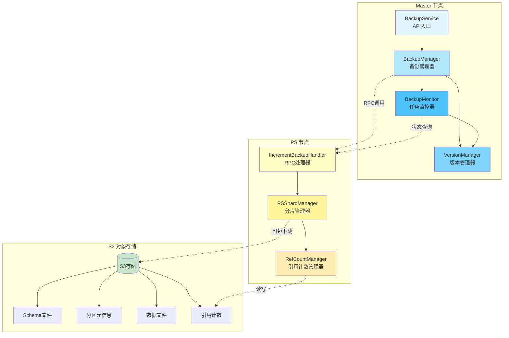

#### 2.3.2 组件关系图

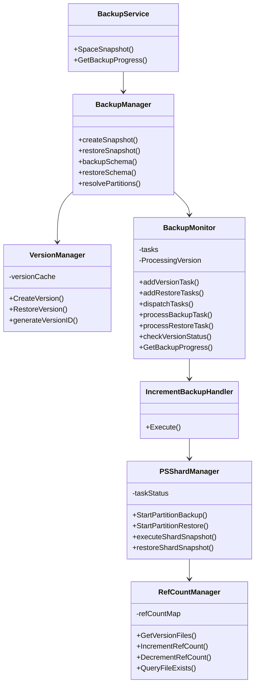

---

## 三、核心组件设计

### 3.1 Master侧组件

#### 3.1.1 BackupService

**职责**：提供备份恢复API入口，协调各个组件完成备份恢复任务。

**主要方法**：


- `SpaceSnapshot()`：处理备份/恢复请求的主入口


- `GetBackupProgress()`：查询备份进度

**设计要点**：


- 统一使用`BackupManager`实例，避免状态丢失


- 自动生成BackupID（UUID）和VersionID（时间戳）


- 支持命令：`backup`、`restore`

---

#### 3.1.2 BackupManager

**职责**：备份恢复的核心调度器，负责协调整个备份恢复流程。

**主要方法**：


- `createSnapshot()`：创建备份快照


- `restoreSnapshot()`：恢复备份快照


- `backupSchema()`：备份Space的Schema信息


- `restoreSchema()`：恢复Space的Schema信息


- `resolvePartitions()`：解析分区信息

**数据结构**：

```plaintext
type BackupManager struct {
    client         *client.Client
    backupMonitor  *BackupMonitor
    versionManager *VersionManager
    // S3分区ID到新分区ID的映射关系
    s3PartitionMap   map[string]map[entity.PartitionID]entity.PartitionID
    muS3PartitionMap sync.RWMutex
}
```

**设计要点**：


- 备份流程：备份Schema → 创建版本 → 分发任务


- 恢复流程：恢复Schema → 建立分区映射 → 分发任务


- 分区映射：恢复时建立S3分区ID到新分区ID的映射关系


---

#### 3.1.3 VersionManager

**职责**：管理备份版本信息，生成版本ID，维护版本缓存。

**主要方法**：


- `CreateVersion()`：创建新版本


- `RestoreVersion()`：创建恢复版本


- `generateVersionID()`：生成版本ID（时间戳格式）

**数据结构**：

```plaintext
type VersionManager struct {
    mu          sync.RWMutex
    client      *client.Client
    minioClient *minio.Client
    bucketName  string
    versionCache map[string]*VersionInfo // key: space_key
    maxVersions int
    stopChan    chanstruct{}
}
type VersionInfo struct {
    SpaceKey    string           // db-space
    Versions    []*BackupVersion // 版本列表
    LastUpdated time.Time
    TotalCount  int64
}
type BackupVersion struct {
    SpaceKey    string
    VersionID   string  // 时间戳格式：202411201504
    BackupID    string  // UUID格式
    CreateTime  time.Time
    Status      BackupVersionStatus
    Partitions  []*PartitionBackupInfo
}
```

**设计要点**：


- VersionID格式：`YYYYMMDDHHmm`（例如：`202411201504`）


- BackupID格式：UUID（例如：`550e8400-e29b-41d4-a716-446655440000`）


- 版本状态：Inited → Running → Completed/Failed


- 版本缓存：内存缓存，提高查询效率


---

#### 3.1.4 BackupMonitor

**职责**：监控备份恢复任务的执行状态，处理节点故障和任务重试。

**主要方法**：


- `addVersionTask()`：添加版本任务


- `addRestoreTasks()`：添加恢复任务（不创建版本）


- `dispatchTasks()`：分发任务到PS节点


- `processBackupTask()`：处理备份任务


- `processRestoreTask()`：处理恢复任务


- `checkVersionStatus()`：检查版本状态


- `GetBackupProgress()`：获取备份进度

**数据结构**：

```plaintext
type BackupMonitor struct {
    mu                sync.RWMutex
    client            *client.Client
    tasks             map[string][]*PartitionBackupTask // key: spaceKey
    ProcessingVersion []*BackupVersion
    healthCheckChan   chan entity.NodeID
    stopChan          chanstruct{}
}
type PartitionBackupTask struct {
    PartitionID   entity.PartitionID
    NodeID        entity.NodeID
    VersionID     string
    PSNodeAddr    string
    TaskType      string  // "backup" or "restore"
    Status        BackupTaskStatus
    RetryCount    int
    MaxRetries    int
    StartTime     time.Time
    CompleteTime  time.Time
    BackupRequest *entity.SnapshotRequest
}
```

**设计要点**：


- 任务状态：Inited → Running → Completed/Failed


- 定期检查：每10秒检查版本状态，每30秒检查任务状态


- 节点健康检查：检测节点故障，等待分区迁移后重试


- 进度查询：基于任务完成数量计算进度


---

### 3.2 PS侧组件

#### 3.2.1 IncrementBackupHandler

**职责**：处理来自Master的备份恢复RPC请求。

**主要方法**：


- `Execute()`：处理RPC请求

**设计要点**：


- 解析`SnapshotRequest`请求


- 获取或初始化`PSShardManager`


- 调用`StartPartitionBackup()`或`StartPartitionRestore()`


- 异步执行，立即返回


---

#### 3.2.2 PSShardManager

**职责**：在PS节点上执行具体的备份恢复操作。

**主要方法**：


- `StartPartitionBackup()`：启动分区备份


- `StartPartitionRestore()`：启动分区恢复


- `executeShardSnapshot()`：执行分片快照（上传文件）


- `restoreShardSnapshot()`：执行分片恢复（下载文件）


- `loadPartitionMeta()`：加载分区元信息

**数据结构**：

```go
type PSShardManager struct {
    mu            sync.RWMutex
    versions      map[string]services.VersionInfo
    taskStatus    map[string]*SnapshotTask // key: "spaceKey_backupID_partitionID"
    minioClient   *minio.Client
    getPartition  GetPartitionFunc
    refCountMgrs  map[string]*RefCountManager // 按spaceKey存储
    bucketName    string
    clusterName   string
    sstStoragePath string
}
type SnapshotTask struct {
    PartitionID   uint32
    s3PartitionID uint32  // S3上的分区ID（恢复时使用）
    status        SnapshotStatus
    spaceKey      string
    backupID      string
    versionID     string
    errorMessage  string
    startTime     time.Time
    completeTime  time.Time
}
```

**设计要点**：


- 备份流程：调用Engine.BackupSpace() → 扫描文件 → 计算CRC32 → 上传到S3


- 恢复流程：下载元信息 → 下载文件 → 验证CRC32 → 恢复Engine


- 分区ID映射：恢复时使用S3分区ID加载数据


---

#### 3.2.3 RefCountManager

**职责**：管理文件的引用计数，实现文件去重。

**主要方法**：


- `GetVersionFiles()`：获取版本文件列表


- `IncrementRefCount()`：增加引用计数


- `DecrementRefCount()`：减少引用计数


- `QueryFileExists()`：查询文件是否存在

**数据结构**：

```go
type RefCountManager struct {
    mu            sync.RWMutex
    refCountMap   map[string]*FileRefCount // key: CRC32
    minioClient   *minio.Client
    bucketName    string
    clusterName   string
    spaceKey      string
    metadataPath  string
}
type FileRefCount struct {
    CRC32         string    // 文件的CRC32值（唯一标识）
    S3Path        string    // 文件在S3上的路径
    RefCount      int       // 引用计数
    Size          int64     // 文件大小
    CreatedAt     time.Time
    LastUpdatedAt time.Time
    Versions      []string  // 引用该文件的版本列表
}
```

**设计要点**：


- 文件去重：相同CRC32的文件只存储一份


- 引用计数：记录文件被多少个版本引用


- 自动清理：引用计数为0时自动删除文件


- 按库表细分：每个spaceKey有独立的引用计数管理器


---

## 四、数据流程设计

### 4.1 备份流程

#### 4.1.1 备份序列图

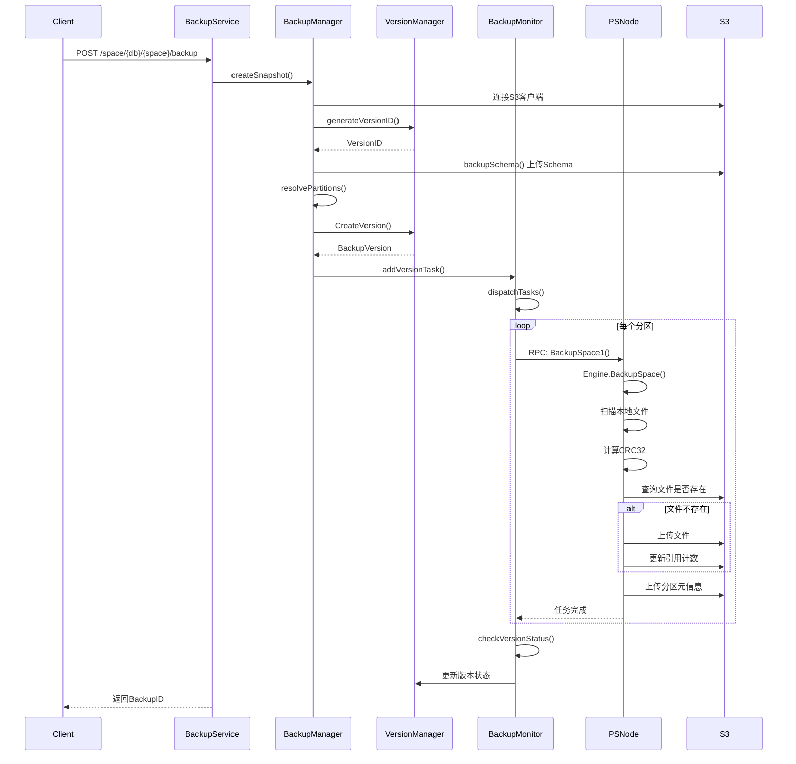

 


#### 4.1.2 备份流程图

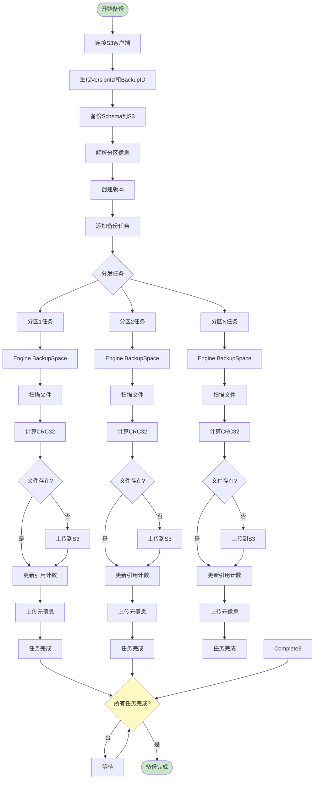

### 4.2 恢复流程

#### 4.2.1 恢复序列图

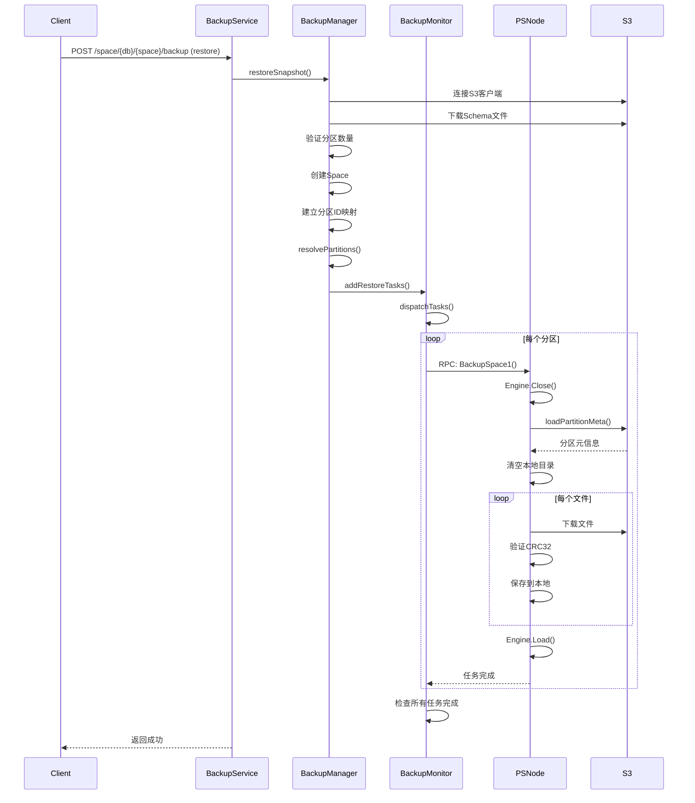

 


#### 4.2.2 恢复流程图

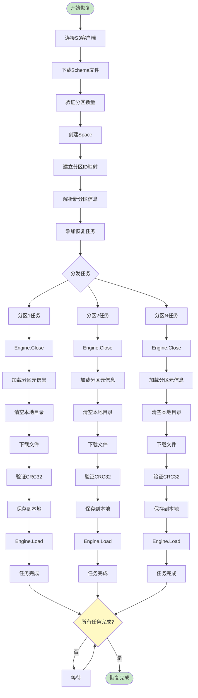

 


### 4.3 任务监控流程

#### 4.3.1 监控流程图

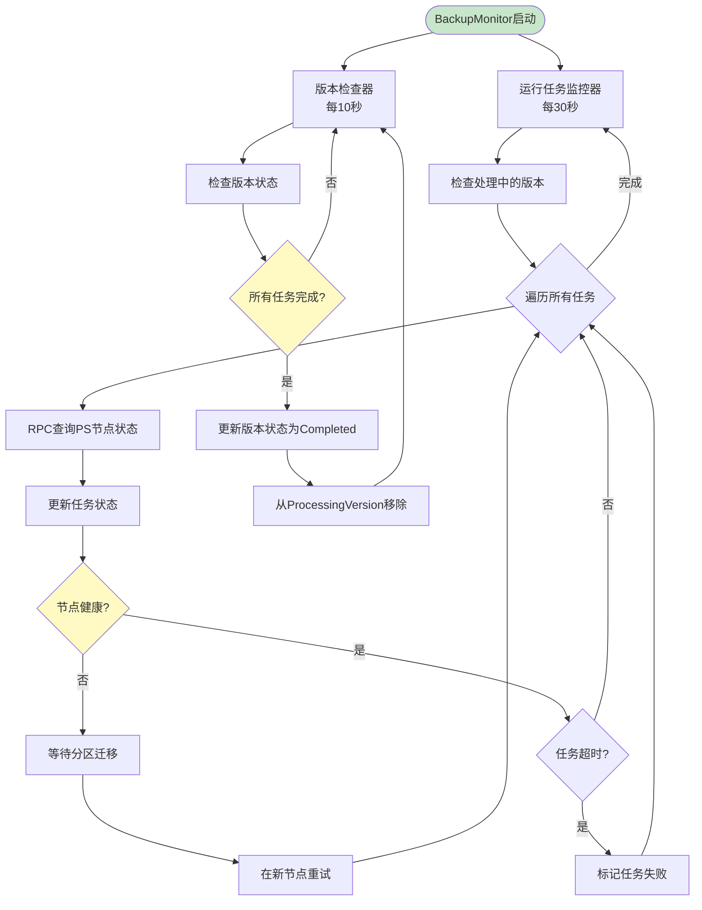

---

## 五、存储设计

### 5.1 S3路径结构

#### 5.1.1 新版系统路径格式

#### 5.1.2 存储结构树形图

```plaintext
{cluster}/
├── backup/
│   └── {db}/
│       └── {space}/
│           └── {versionID}/
│               ├── {space}.schema                    # Space的Schema文件
│               └── {partitionID}/                    # 分区目录
│                   ├── partition_meta.json            # 分区元信息
│                   └── files/                         # 文件目录（可选）
│                       └── {crc32}.sst                # 数据文件（以CRC32命名）
│
└── metadata/
    └── {db}/
        └── {space}/
            └── file_refcount.json                     # 引用计数元数据
```

### 5.2 文件命名规则


- **Schema文件**：`{spaceName}.schema`


- **分区元信息**：`partition_meta.json`


- **数据文件**：`{crc32}.sst`（使用CRC32值作为文件名，实现去重）

### 5.3 元数据结构

#### 5.3.1 PartitionBackupMeta（分区备份元信息）

```plaintext
{
  "partition_id":1,
  "backup_id":"550e8400-e29b-41d4-a716-446655440000",
  "version_id":"202411201504",
  "space_key":"testdb-testspace",
  "created_at":"2024-11-20T15:04:00Z",
  "files":[
    {
      "file_path":"data/file1.sst",
      "file_name":"file1.sst",
      "crc32":"a1b2c3d4",
      "size":1024000,
      "s3_path":"{cluster}/backup/{db}/{space}/{versionID}/files/a1b2c3d4.sst",
      "local_path":"/path/to/data/file1.sst",
      "uploaded_at":"2024-11-20T15:05:00Z",
      "upload_status":"completed"
    }
  ],
  "total_files":10,
  "total_size":10240000,
  "completed_at":"2024-11-20T15:10:00Z"}
```

#### 5.3.2 FileRefCount（文件引用计数）

```plaintext
{
  "a1b2c3d4":{
    "crc32":"a1b2c3d4",
    "s3_path":"{cluster}/backup/{db}/{space}/{versionID}/files/a1b2c3d4.sst",
    "ref_count":3,
    "size":1024000,
    "created_at":"2024-11-20T15:05:00Z",
    "last_updated_at":"2024-11-20T15:10:00Z",
    "versions":[
      "202411201504",
      "202411201505",
      "202411201506"
    ]
  }}
```

---

## 六、接口设计

### 6.1 API接口

#### 6.1.1 备份接口

**请求**：

```plaintext
POST /space/{db}/{space}/backup
Content-Type: application/json

{
  "command": "backup",
  "backup_id": 0,
  "s3_param": {
    "endpoint": "s3.example.com",
    "access_key": "your-access-key",
    "secret_key": "your-secret-key",
    "bucket_name": "backup-bucket",
    "region": "us-east-1",
    "use_ssl": true
  }
}
```

**响应**：

```plaintext
{
  "code":0,
  "msg":"success",
  "data":{
    "backup_id":0  // 兼容字段，实际使用UUID
  }}
```

#### 6.1.2 恢复接口

**请求**：

```plaintext
POST /space/{db}/{space}/backup
Content-Type: application/json

{
  "command": "restore",
  "version_id": "202411201504",  // 必需（或提供backup_id）
  "s3_param": {
    "endpoint": "s3.example.com",
    "access_key": "your-access-key",
    "secret_key": "your-secret-key",
    "bucket_name": "backup-bucket",
    "region": "us-east-1",
    "use_ssl": true
  }
}
```

**响应**：

```plaintext
{
  "code":0,
  "msg":"success",
  "data":{
    "backup_id":0
  }}
```

#### 6.1.3 进度查询接口

**请求**：

```plaintext
GET /space/{db}/{space}/backup/progress
```

**响应**：

```plaintext
{
  "code":0,
  "msg":"success",
  "data":{
    "total_tasks":3,
    "completed_tasks":2,
    "success_ratio":0.67
  }}
```

### 6.2 RPC接口

#### 6.2.1 备份/恢复RPC

**请求**：`IncrementBackupHandler.Execute()`

**参数**：

```plaintext
type SnapshotRequest struct {
    Database    string
    Space       string
    Command     string  // "backup" or "restore"
    BackupID    string  // UUID
    VersionID   string  // 时间戳格式
    S3PartitionID uint32  // S3分区ID（恢复时使用）
    S3Param     struct {
        Region     string
        BucketName string
        EndPoint   string
        AccessKey  string
        SecretKey  string
        UseSSL     bool
    }
}
```

**响应**：成功返回nil，失败返回错误

#### 6.2.2 状态查询RPC

**请求**：`GetBackupStatus()`

**参数**：


- `spaceKey`: 库表标识


- `backupID`: 备份ID


- `partitionID`: 分区ID

**响应**：

```plaintext
type BackupStatusResponse struct {
    Status      int    // 0=running, 1=completed, 2=failed
    Exists      bool
    ErrorMessage string
}
```

---

## 七、错误处理设计

### 7.1 错误分类

#### 7.1.1 参数错误


- **场景**：无效的VersionID、BackupID、S3参数等


- **处理**：立即返回错误，不创建任务

#### 7.1.2 资源错误


- **场景**：Space不存在、分区不存在、S3连接失败等


- **处理**：返回错误，记录日志

#### 7.1.3 节点故障


- **场景**：PS节点宕机、网络中断等


- **处理**：


   1. 检测节点健康状态


   1. 等待分区迁移到新节点


   1. 在新节点上重试任务


   1. 如果超时，标记任务失败


#### 7.1.4 任务失败


- **场景**：文件上传失败、CRC32校验失败等


- **处理**：


   1. 标记任务为失败


   1. 记录错误信息


       


## 八、性能优化设计

### 8.1 并行处理


- **多分区并行**：所有分区同时备份/恢复


- **文件并行上传**：多个文件并发上传到S3


- **任务并行分发**：使用goroutine并发分发任务

### 8.2 文件去重

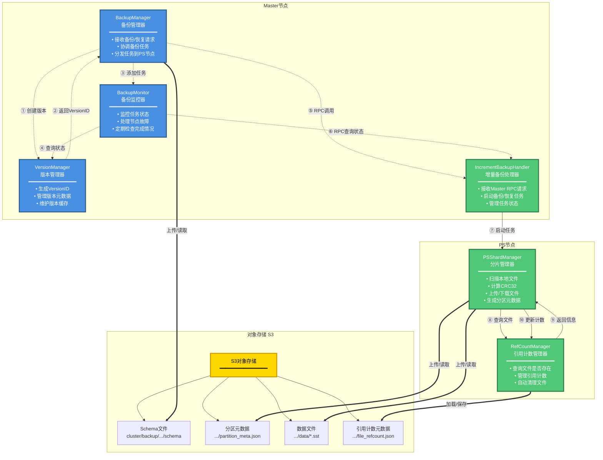

#### 8.2.1 文件去重流程图

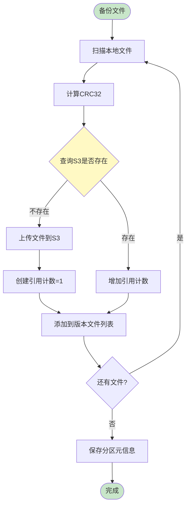

 


#### 8.2.2 引用计数管理图

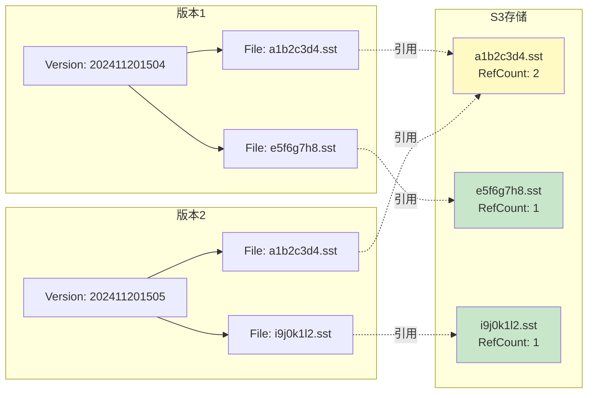


- **CRC32校验**：使用CRC32值作为文件唯一标识


- **引用计数**：相同文件只存储一份，多个版本共享


- **存储优化**：节省S3存储空间，减少上传时间

### 8.3 缓存机制


- **版本缓存**：VersionManager维护版本信息缓存


- **任务状态缓存**：BackupMonitor维护任务状态缓存


- **引用计数缓存**：RefCountManager维护引用计数缓存

### 8.4 批量操作


- **批量查询状态**：可以考虑批量查询PS节点状态（未来优化）


- **批量更新引用计数**：批量更新引用计数，减少S3写入次数

---

## 九、兼容性设计


- **统一入口**：`backupSpace`API统一使用新系统


- **参数兼容**：支持旧版参数格式


- **响应兼容**：响应格式保持兼容


## 十、增量备份优势分析

### 10.1 增量备份核心机制

新版备份系统通过**文件去重**和**引用计数**机制实现增量备份，相比传统全量备份具有显著优势。

#### 10.1.1 文件去重机制

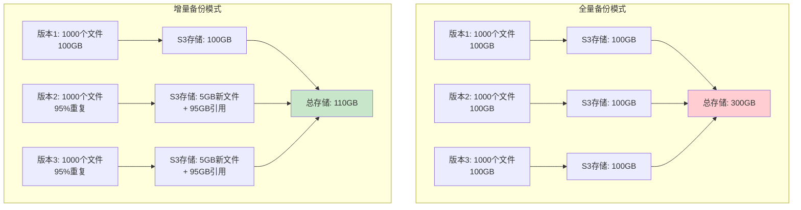

 


#### 10.1.2 工作原理


1. **CRC32校验**：每个文件计算CRC32值作为唯一标识


1. **引用查询**：备份前查询引用计数管理器，检查文件是否已存在


1. **智能上传**：


  - 文件已存在 → 跳过上传，直接引用，增加引用计数


  - 文件不存在 → 上传新文件，创建引用计数记录


1. **版本共享**：多个版本通过引用计数共享相同文件

### 10.2 存储空间节省分析

#### 10.2.1 典型场景计算

假设场景：


- **初始备份**：1000个文件，总大小100GB


- **数据变化率**：每次备份5%的文件发生变化


- **备份频率**：每天1次


- **保留版本数**：30个版本

**全量备份模式**：

```plaintext
版本1: 100GB
版本2: 100GB
版本3: 100GB
...
版本30: 100GB
总存储 = 100GB × 30 = 3000GB
```

**增量备份模式**：

```plaintext
版本1: 100GB (全量)
版本2: 5GB (新文件) + 95GB (引用) = 100GB逻辑，5GB物理
版本3: 5GB (新文件) + 95GB (引用) = 100GB逻辑，5GB物理
...
版本30: 5GB (新文件) + 95GB (引用) = 100GB逻辑，5GB物理

总存储 = 100GB (版本1) + 5GB × 29 = 245GB
```

**节省比例**：

```plaintext
节省空间 = 3000GB - 245GB = 2755GB
节省比例 = 2755GB / 3000GB = 91.8%
```

#### 10.2.2 不同变化率下的节省效果

现在假设进行一个月的增量备份，第一天的全量数据为 100G，根据不同数据变化率的具体情况如下。


| 数据变化率 | 30个版本总存储（全量） | 30个版本总存储（增量） | 节省空间 | 节省比例 |
|---|---|---|---|---|
| 1% | 3000GB | 129GB | 2871GB | 95.7% |
| 5% | 3000GB | 245GB | 2755GB | 91.8% |
| 10% | 3000GB | 390GB | 2610GB | 87.0% |
| 20% | 3000GB | 680GB | 2320GB | 77.3% |
| 50% | 3000GB | 1550GB | 1450GB | 48.3% |


**结论**：数据变化率越低，增量备份的存储节省效果越明显。对于大多数实际场景（变化率&lt;10%），可以节省80%以上的存储空间。

### 10.3 上传速度提升分析

#### 10.3.1 上传时间对比

假设条件：


- **网络带宽**：100Mbps (12.5MB/s)


- **文件数量**：1000个文件


- **平均文件大小**：100MB


- **数据变化率**：5%

**全量备份模式**：

```plaintext
总数据量 = 1000 × 100MB = 100GB上传时间 = 100GB / 12.5MB/s = 8000秒 ≈ 2.2小时
```

**增量备份模式**：

```plaintext
新文件数量 = 1000 × 5% = 50个文件新文件大小 = 50 × 100MB = 5GB上传时间 = 5GB / 12.5MB/s = 400秒 ≈ 6.7分钟文件去重检查时间 = 1000 × 0.01秒 = 10秒（本地CRC32计算和查询）总时间 = 400秒 + 10秒 = 410秒 ≈ 6.8分钟
```

**速度提升**：

```plaintext
时间节省 = 8000秒 - 410秒 = 7590秒速度提升 = 8000秒 / 410秒 = 19.5倍
```

#### 10.3.2 不同变化率下的速度提升

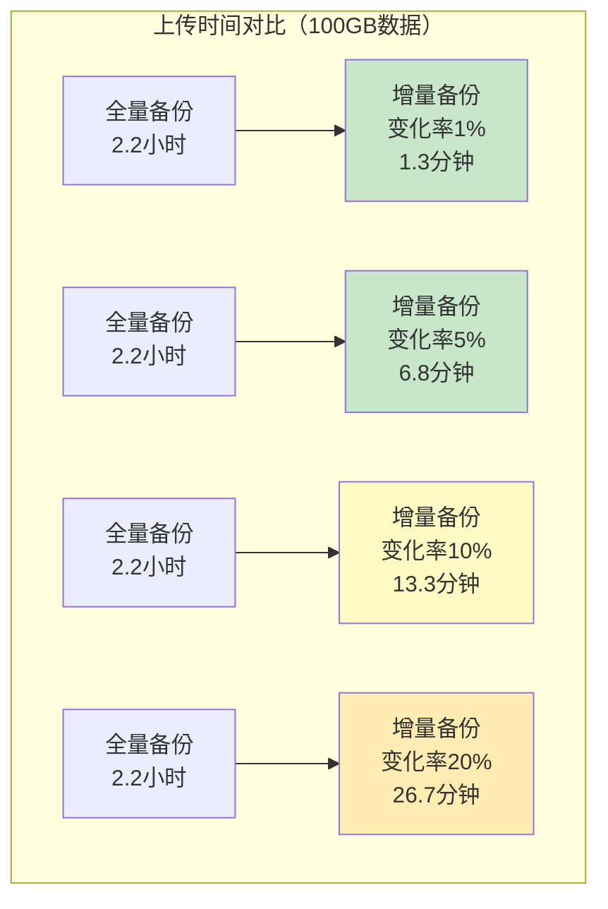


| 数据变化率 | 全量备份时间 | 增量备份时间 | 时间节省 | 速度提升 |
|---|---|---|---|---|
| 1% | 2.2小时 | 1.3分钟 | 2.18小时 | 100倍 |
| 5% | 2.2小时 | 6.8分钟 | 2.13小时 | 19.5倍 |
| 10% | 2.2小时 | 13.3分钟 | 2.07小时 | 10倍 |
| 20% | 2.2小时 | 26.7分钟 | 1.93小时 | 5倍 |


**结论**：增量备份可以显著减少上传时间，特别是在数据变化率较低的场景下，速度提升可达10-100倍。

### 10.4 实际应用场景

#### 10.4.1 场景1：向量数据库日常备份

**场景描述**：


- 数据库规模：10TB数据，1000个分区


- 备份频率：每天1次


- 数据变化率：3%（主要是新增数据，少量更新）


**全量备份**：


- 每次备份：10TB


- 30天存储：10TB × 30 = 300TB


- 每次备份时间：约22小时（假设100Mbps带宽）


**增量备份**：


- 首次备份：10TB


- 后续备份：10TB × 3% = 300GB


- 30天存储：10TB + 300GB × 29 = 18.7TB


- 每次备份时间：约40分钟


**收益**：


- 存储节省：300TB → 18.7TB，节省**93.8%**


- 时间节省：22小时 → 40分钟，速度提升**33倍**

#### 10.4.2 场景2：定期全量+增量混合备份

**场景描述**：


- 每周一次全量备份 + 每天增量备份


- 数据规模：5TB


- 数据变化率：5%


**全量备份策略**：


- 每周全量：5TB × 52周 = 260TB/年


- 存储成本高


**混合备份策略**：


- 每周全量：5TB × 52周 = 260TB


- 每天增量：5TB × 5% × 365天 = 91.25TB


- 总存储：351.25TB


**纯增量备份策略**：


- 首次全量：5TB


- 后续增量：5TB × 5% × 364天 = 91TB


- 总存储：96TB


**收益**：


- 相比全量备份：节省**63%**存储空间


- 相比混合备份：节省**73%**存储空间

### 10.5 技术优势总结

#### 10.5.1 核心优势对比图

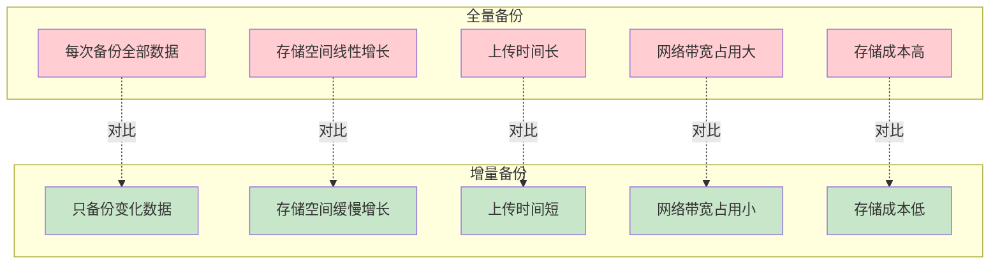

#### 10.5.2 优势列表


| 优势维度 | 全量备份 | 增量备份 | 提升效果 |
|---|---|---|---|
| **存储空间** | 线性增长 | 缓慢增长 | 节省80-95% |
| **上传速度** | 慢 | 快 | 提升10-100倍 |
| **网络带宽** | 占用大 | 占用小 | 减少80-95% |
| **备份时间** | 长 | 短 | 缩短90%以上 |
| **存储成本** | 高 | 低 | 降低80-95% |
| **恢复灵活性** | 需要完整版本 | 支持任意版本 | 相同 |
| **数据完整性** | 高 | 高 | 相同 |


### 10.6 适用场景建议

#### 10.6.1 最适合的场景

**数据变化率低**（&lt;10%）


- 向量数据库日常备份


- 文档数据库定期备份


- 配置数据备份


**备份频率高**


- 每天多次备份


- 实时备份需求


**存储成本敏感**


- 大规模数据备份


- 长期数据保留


**网络带宽有限**


- 跨地域备份


- 云上备份到云下


#### 10.6.2 注意事项

⚠️**数据变化率高**（&gt;50%）


- 增量备份优势不明显


- 建议使用全量备份或混合策略


⚠️**首次备份**


- 首次备份仍需全量上传


- 后续备份才能享受增量优势


⚠️**版本清理**


- 删除版本时需要更新引用计数


- 引用计数为0的文件会自动清理


---

## 十一、扩展性设计

### 10.1 版本管理扩展


- **版本清理策略**：支持配置最大保留版本数


- **版本过期机制**：支持自动清理过期版本


- **版本标签**：支持为版本添加标签和描述

### 10.2 备份策略扩展


- **增量备份**：支持增量备份（基于引用计数）


- **全量备份**：支持全量备份


- **定时备份**：支持定时自动备份

### 10.3 监控扩展


- **任务详情**：支持查询任务详细信息


- **历史记录**：支持查询历史备份记录


- **告警机制**：支持备份失败告警

### 10.4 性能扩展


- **压缩支持**：支持备份数据压缩


- **加密支持**：支持备份数据加密


- **分片上传**：支持大文件分片上传

---

## 十一、安全性设计

### 11.1 数据安全


- **CRC32校验**：文件上传和下载时进行CRC32校验


- **元数据验证**：恢复时验证元数据完整性


- **Schema验证**：恢复时验证Schema完整性

### 11.2 访问控制


- **S3凭证**：使用用户提供的S3凭证，不存储明文密码


- **权限控制**：备份恢复操作需要相应权限

### 11.3 数据隔离


- **路径隔离**：不同集群、数据库、Space使用独立路径


- **引用计数隔离**：按spaceKey隔离引用计数

---

## 十二、系统特性总结

### 12.1 系统优势

新版备份恢复系统通过以下设计实现了高可用、可监控、高性能的备份恢复能力：


1. **异步架构**：任务异步执行，不阻塞业务


1. **版本管理**：支持多版本备份，便于数据管理


1. **任务监控**：实时监控任务状态，支持进度查询


1. **容错机制**：自动处理节点故障和任务重试


1. **性能优化**：多分区并行、文件去重、缓存机制


1. **向后兼容**：兼容旧系统，平滑升级

### 12.2 技术架构图

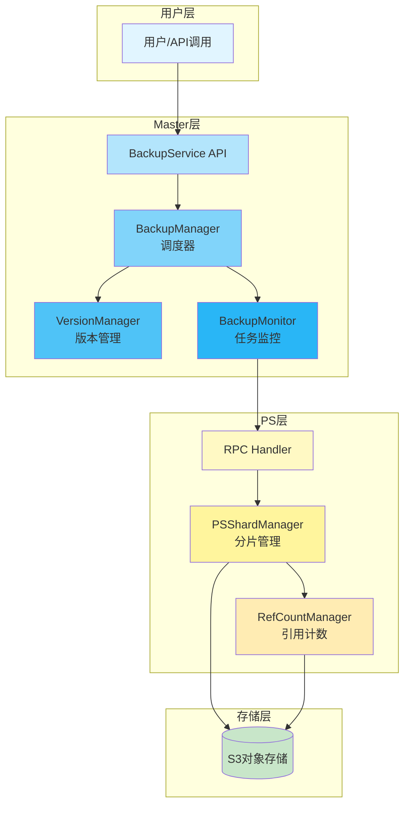

系统设计充分考虑了扩展性和可维护性，为未来的功能增强奠定了基础。

 


