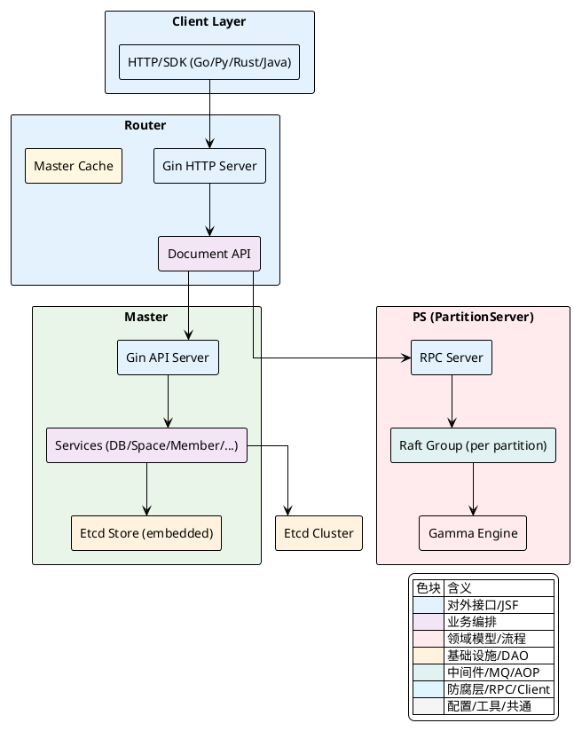
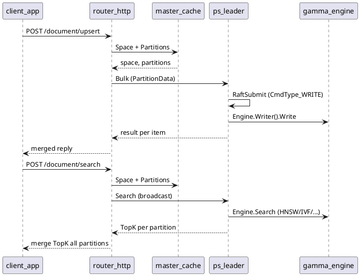
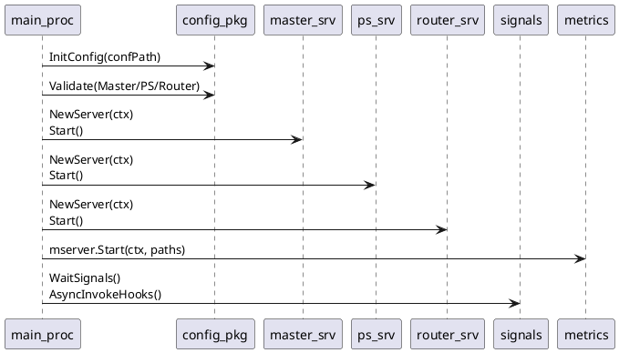
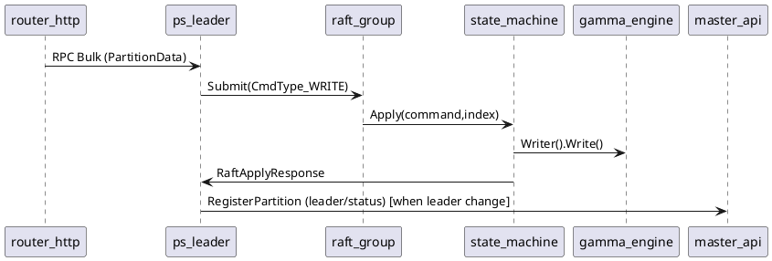

## 项目概览与架构设计

本文以代码为主线，对 Vearch 的核心组件、职责边界、运行方式与全局依赖进行分层梳理，聚焦 Master、Router、PartitionServer（PS）与引擎的协作关系、启动流程、配置体系以及一致性与复制机制。文末以表格形式列出在实现中可观测到的若干反模式与偏离点，便于后续演进时有针对性地治理。

### 架构总览

- Master 控制面：元数据、调度与管理接口，默认嵌入 `etcd`。
- Router 数据面入口：REST API，读写路由、分区广播、结果合并与多租户鉴权。
- PS 数据面核心：分区副本的 `raft` 复制与本地 `Gamma` 引擎存储/检索。
- Engine 核心：`Gamma`（C++/FAISS）通过 Go binding 提供写入、搜索、索引与内存状态查询。
- Client SDK：HTTP/SDK（Go/Python/Rust/Java），Router 上的文档 API 与 Master 上的控制面 API。

下图以组件图呈现系统分层与关键依赖：



---

### 组件职责与交互关系

Vearch 的数据路径是 `Client → Router → PS`，Master 不在读写搜索数据路径上，仅提供控制面与元数据服务。路由层基于 `Master Cache` 获取空间与分区元数据，将写入按 `pkey` 哈希分发到分区主副本，将查询/搜索并发广播到目标分区并合并结果。每个分区是一个独立的 `raft` 组，写入以日志复制达成副本一致后再提交到本地 `Gamma` 引擎；搜索与读取直接由引擎提供，未经过 `raft`。

关键职责归纳如下：

- Master
  - 管理 `DB/Space/Partition/User/Role/Alias` 元数据与变更。
  - 跟踪服务器注册与心跳、失败恢复、扩缩容与副本操作。
  - 默认嵌入 `etcd` 或使用外部 `etcd`（可配置）。
- Router
  - 提供 `upsert/delete/get/search/query/flush/index` 等文档接口。
  - 元数据缓存与路由决策（按 `pkey` 哈希或 `PartitionRule`）。
  - 查询搜索广播与 TopK 结果合并。
  - 统一的鉴权与限流中间件。
- PS
  - 节点注册与分区创建/恢复，启动本地 `Gamma` 引擎与 `raft` 服务。
  - 写入通过 `raft` 提交，应用于引擎；读取/搜索直接走引擎。
  - 监控副本落后状态，根据配置进行查询路由或隔离控制。
- Engine
  - `Gamma` 提供高维向量检索、标量过滤、索引构建与内存信息接口。
  - Go binding 负责 `Doc` 序列化、`Search`/`Query` 请求编解码、请求取消与内存熔断。

写入分区路由的关键逻辑：`Router` 使用 `murmur3` 计算 `pkey` 的哈希槽映射到分区，`Leader` 选择原则默认走主副本。示例代码：

[internal/client/client.go:231-251]()
```go
// PartitionDocs split docs into different partition
func (r *routerRequest) PartitionDocs() *routerRequest {
    dataMap := make(map[entity.PartitionID]*vearchpb.PartitionData)
    for _, doc := range r.docs {
        partitionID := r.space.PartitionId(murmur3.Sum32WithSeed([]byte(doc.PKey), 0))
        item := &vearchpb.Item{Doc: doc}
        if d, ok := dataMap[partitionID]; ok {
            d.Items = append(d.Items, item)
        } else {
            d = &vearchpb.PartitionData{PartitionID: partitionID, MessageID: r.GetMsgID(), Items: []*vearchpb.Item{}}
            dataMap[partitionID] = d
            d.Items = append(d.Items, item)
        }
    }
    r.sendMap = dataMap
    return r
}
```

搜索分区广播与合并在路由层完成，PS 层直接走引擎搜索并返回每分区的 TopK，由路由层进行全局合并：

[internal/router/document/doc_service.go:172-199]()
```go
func (docService *docService) search(ctx context.Context, searchReq *vearchpb.SearchRequest) *vearchpb.SearchResponse {
    request := client.NewRouterRequest(ctx, docService.client)
    request.SetMethod(client.SearchHandler).SetHead(searchReq.Head).SetSpace().SearchByPartitions(searchReq)
    // ... per-partition concurrent RPCs to PS, then field-sort merge:
    desc := sortOrder[0].GetSortOrder()
    searchResponse := request.SearchFieldSortExecute(desc)
    return searchResponse
}
```

为帮助读者理解读/写/搜索的数据路径与职责边界，以下时序图给出 Upsert 与 Search 的核心交互：



<details>
<summary>关联代码</summary>

[README_ZH_CN.md](),[docs/Architecture.md](),[internal/router/server.go:46-120](),[internal/router/document/doc_service.go:150-199](),[internal/client/client.go:231-342](),[internal/ps/handler_document.go:255-291]()

</details>

---

### 运行入口与启动流程

Vearch 通过 `cmd/vearch/startup.go` 统一启动 Master、PS、Router 三类进程。入口流程概述：

- 解析参数与初始化配置：`-conf` 指向 `config.toml`，`-master` 指定本机 Master 名称用于自选 `Self()`。
- 全局初始化：版本信息、`jaeger`、`log`、`metrics mserver`、内存打印与信号钩子。
- 分组件启动：
  - Master：校验配置、`Self()` 确认、设置监控 IP、创建 `Server` 并启动 Gin/嵌入式 `etcd`（可选），注册 HTTP Handler、监控注册、创建 `root` 用户、Watch 服务器与空间、将本机 Master 元信息写入 `etcd`。
  - PS：校验配置、创建客户端与 `rpc` 服务、注册 Master、启动 `raft server`、恢复分区与监听 Leader 改变事件、心跳与慢查询控制、导出 RPC Handler。
  - Router：校验配置、向 Master 注册 Router、启动 Gin HTTP 与（可选）gRPC、拉起元数据缓存增量刷新 Job、心跳与监控。

入口关键代码片段（简化）：

[cmd/vearch/startup.go:161-195]()
```go
// start master
if tags[masterTag] || tags[allTag] {
    if err := config.Conf().CurrentByMasterNameDomainIp(masterName); err != nil { os.Exit(1) }
    if err := config.Conf().Validate(config.Master); err != nil { os.Exit(1) }

    s, err := master.NewServer(ctx)
    if err != nil { os.Exit(1) }
    sigsHook.AddSignalHook(func() { s.Stop() })
    go func() { if err := s.Start(); err != nil { os.Exit(1) } }()
}
```

[cmd/vearch/startup.go:197-225]()
```go
// start ps
if tags[psTag] || tags[allTag] {
    if err := config.Conf().Validate(config.PS); err != nil { os.Exit(1) }
    server := ps.NewServer(ctx)
    sigsHook.AddSignalHook(func() { if server != nil { _ = server.Close() } })
    go func() { if err := server.Start(); err != nil { os.Exit(1) } }()
}
```

[cmd/vearch/startup.go:227-255]()
```go
// start router
if tags[routerTag] || tags[allTag] {
    if err := config.Conf().Validate(config.Router); err != nil { os.Exit(1) }
    server, err := router.NewServer(ctx)
    sigsHook.AddSignalHook(func() { cancel(); server.Shutdown() })
    go func() { if err := server.Start(); err != nil { os.Exit(1) } }()
}
```

Master 服务中嵌入式 `etcd` 的启动与 HTTP Handler 的挂载：

[internal/master/server.go:82-113]()
```go
if !config.Conf().Global.SelfManageEtcd {
    s.etcdServer, err = embed.StartEtcd(s.etcCfg)
    defer s.etcdServer.Close()
    <-s.etcdServer.Server.ReadyNotify()
}
s.client, err = client.NewClient(config.Conf())
service, err := newMasterService(s.client)
// 导出 Gin Handler 与监控
ExportToClusterHandler(httpServer, service, s)
monitor.Register(monitorService.Client, monitorService.etcdServer, config.Conf().Masters.Self().MonitorPort)
```

PS 启动与注册、`raft` 与分区恢复：

[internal/ps/server.go:132-176]()
```go
nodeId := psutil.InitMeta(s.client, config.Conf().Global.Name, config.Conf().GetDataDir())
s.nodeID = nodeId
server := s.register()
s.ip = server.Ip
s.raftServer, err = raftstore.StartRaftServer(nodeId, s.ip, s.raftResolver)
// create and recover partitions
s.recoverPartitions(server.PartitionIds, server.Spaces)
// start rpc server and export handlers
if err = s.rpcServer.Run(); err != nil { log.Panic(err) }
ExportToRpcHandler(s)
ExportToRpcAdminHandler(s)
```

为便于理解入口的控制流，以下时序图展示主进程的组件化启动与收敛：



<details>
<summary>关联代码</summary>

[cmd/vearch/startup.go:87-135](),[cmd/vearch/startup.go:161-255](),[internal/master/server.go:46-113](),[internal/router/server.go:46-145](),[internal/ps/server.go:124-176]()

</details>

---

### 配置体系与运行参数

配置加载与单例在 `internal/config/config.go`，`Conf()` 提供全局只读引用，`InitConfig/LoadConfig` 基于 `BurntSushi/toml` 解码。系统支持内管 `etcd` 或外部 `etcd`，Master 节点元信息用于聚合 `etcd` 地址。

核心结构与方法：

- `Config` 结构包含 `GlobalCfg/EtcdCfg/TracerCfg/Masters/RouterCfg/PSCfg`。
- `GetEtcdAddress()` 根据 `SelfManageEtcd` 决定从外部或从 Master 列表拼接 `clientURLs`。
- `GetEmbed()` 构建嵌入式 `etcd` 配置，包括 `ClusterState`、`ListenPeerUrls/ListenClientUrls` 与日志旋转等。
- `Validate()` 与 `validatePath()` 保证日志与数据目录存在，并避免一机多 Master。

示例代码：

[internal/config/config.go:95-121]()
```go
func (con *Config) GetEtcdAddress() []string {
    if con.Global.SelfManageEtcd {
        if len(con.EtcdConfig.AddressList) > 0 && con.EtcdConfig.EtcdClientPort > 0 {
            addrs := make([]string, len(con.EtcdConfig.AddressList))
            for i, s := range con.EtcdConfig.AddressList {
                addrs[i] = s + ":" + cast.ToString(con.EtcdConfig.EtcdClientPort)
            }
            return addrs
        }
        return nil
    }
    ms := con.GetMasters()
    addrs := make([]string, len(ms))
    for i, m := range ms {
        addrs[i] = m.Address + ":" + cast.ToString(ms[i].EtcdClientPort)
    }
    return addrs
}
```

[internal/config/config.go:265-351]()
```go
func (config *Config) GetEmbed() (*embed.Config, error) {
    masterCfg := config.Masters.Self()
    cfg := embed.NewConfig()
    cfg.Name = masterCfg.Name
    cfg.Dir = config.GetDataDir()
    // ClusterState: existing or new
    filePath := cfg.Dir + "/" + config.Global.Name + "_" + masterCfg.Name + "_" + entity.RESTART
    if _, err := os.Stat(filePath); err == nil {
        cfg.ClusterState = embed.ClusterStateFlagExisting
    } else {
        // default new
        cfg.ClusterState = embed.ClusterStateFlagNew
    }
    // Listen/Advertise URLs
    urlAddr, _ := url.Parse("http://" + masterCfg.Address + ":" + cast.ToString(masterCfg.EtcdClientPort))
    cfg.ListenClientUrls = []url.URL{*urlAddr}
    cfg.AdvertiseClientUrls = []url.URL{*urlAddr}
    return cfg, nil
}
```

典型 `config.toml` 关键参数（摘录）：

| 区域 | 参数 | 说明 | 代码默认/影响面 |
|---|---|---|---|
| `[global]` | `name` | 集群名（路由校验一致性） | 路由、Master |
| `[global]` | `resource_name` | 资源池名称 | Space 创建与服务器过滤 |
| `[global]` | `self_manage_etcd` | 是否自管 `etcd` | Master/Client Store |
| `[global]` | `raft_consistent` | 是否启用一致性路由策略 | PS 副本状态上报与 Router |
| `[router]` | `port`/`rpc_port` | HTTP/gRPC 端口 | Gin/GRPC 服务 |
| `[router]` | `rpc_timeout` | RPC 超时（毫秒） | 文档 API 超时传递 |
| `[ps]` | `rpc_port` | PS RPC 端口 | PS RPC 服务 |
| `[ps]` | `raft_*` | 心跳/复制/截断等参数 | Raft 行为 |
| `[ps]` | `raft_diff_count` | 副本落后容忍度 | 查询隔离/状态上报 |
| `[ps]` | `flush_*` | 刷盘周期/阈值 | 引擎刷盘 |

<details>
<summary>关联代码</summary>

[internal/config/config.go:85-152](),[internal/config/config.go:265-351](),[config/config.toml:1-88](),[config/config_cluster.toml:104-133]()

</details>

---

### 一致性与复制机制

PS 层以分区为粒度形成独立的 `raft` 组。写入路径将用户文档打包为 `DocCmd`，以 `CmdType_WRITE` 提交到 `raft` 并在状态机内应用到本地 `Gamma` 引擎；读取与搜索不经过 `raft`，从本地引擎直接提供。系统具备副本进度观测与一致性路由开关，以便在副本落后时可选择隔离或路由策略调整。

- 写入与提交
  - `Store.Write()` 封装 `RaftCommand` 后调用 `RaftSubmit()`，等待 `future.Response()` 并检查 `Err`。
  - 状态机 `innerApply()` 对 `CmdType_WRITE` 调用 `Engine.Writer().Write()`，对 `CmdType_FLUSH` 调用 `Commit()` 并返回 `FlushC`。
  - `checkWritable()` 在非 Leader（`PA_READONLY`）或无效/关闭状态下返回特定错误码，用于路由端选择 Leader。

核心代码：

[internal/ps/storage/raftstore/store_writer.go:77-114]()
```go
func (s *Store) Write(ctx context.Context, request *vearchpb.DocCmd) (err error) {
    if err = s.checkWritable(); err != nil { return err }
    raftCmd := &vearchpb.RaftCommand{Type: vearchpb.CmdType_WRITE, WriteCommand: request}
    data, _ := json.Marshal(raftCmd)
    // submit to raft
    err = s.RaftSubmit(data)
    return err
}
```

[internal/ps/storage/raftstore/raft_state_machine.go:124-143]()
```go
func (s *Store) innerApply(index uint64, raftCmd *vearchpb.RaftCommand) any {
    resp := new(RaftApplyResponse)
    switch raftCmd.Type {
    case vearchpb.CmdType_WRITE:
        resp.Err = s.Engine.Writer().Write(s.Ctx, raftCmd.WriteCommand)
    case vearchpb.CmdType_UPDATESPACE:
        resp = s.updateSchemaBySpace(raftCmd.UpdateSpace.Space)
    case vearchpb.CmdType_FLUSH:
        flushC, err := s.Engine.Writer().Commit(s.Ctx, int64(index))
        resp.FlushC = flushC; resp.Err = err
    default:
        resp.SetErr(fmt.Errorf("unsupported command[%s]", raftCmd.Type))
    }
    s.Sn = int64(index)
    return resp
}
```

- 副本状态观测与一致性路由
  - `ReplicasStatusChange()` 根据 `leaderCommit-rs.Commit` 与 `raftDiffCount` 比较，判定副本是否落后并更新 `RsStatusMap`。
  - 当 `Global.RaftConsistent` 为真且当前节点为 Leader 时，发送 `ReplicasStatusEntry` 到 `RsStatusC`，最终由 PS 层处理并注册到 Master 用于路由端参考。
  - 路由端写入优先选择 Leader；读取/搜索在副本落后时可调整路由或隔离（结合引擎/路由限流）。

[internal/ps/storage/raftstore/raft_state_machine.go:40-89,100-119]()
```go
func (s *Store) ReplicasStatusChange() bool {
    statusChange := false
    leaderCommit := s.Status().Commit
    // walk replicas, compare lag vs raftDiffCount
    for nodeID, rs := range s.Status().Replicas {
        var currentStatus uint32
        if nodeID == s.Partition.LeaderID || leaderCommit-rs.Commit < s.raftDiffCount {
            currentStatus = entity.ReplicasOK
        } else {
            currentStatus = entity.ReplicasNotReady
        }
        // update RsStatusMap and mark statusChange
        // ...
    }
    // delete unExist replicas from RsStatusMap
    return statusChange
}

func (s *Store) Apply(command []byte, index uint64) (resp any, err error) {
    // ...
    resp = s.innerApply(index, raftCmd)
    if config.Conf().Global.RaftConsistent {
        if s.IsLeader() && s.ReplicasStatusChange() {
            s.RsStatusC <- &ReplicasStatusEntry{NodeID: s.NodeID, PartitionID: s.Partition.Id, ReStatusMap: *copySyncMap(&s.RsStatusMap)}
        }
    }
    return resp, nil
}
```

- 引擎执行与请求可中断
  - Go binding 与 C++ 的对接在 `internal/engine/sdk/go/gamma/gamma.go`。
  - 搜索/查询时通过 `RequestId` 与并发状态标识控制取消/熔断，`Search()`/`Query()` 返回 `Status` 与响应二进制以 FlatBuffers 序列化。

[internal/engine/sdk/go/gamma/gamma.go:160-199]()
```go
func Search(engine unsafe.Pointer, reqByte []byte, message_id string, partition_id entity.PartitionID) ([]byte, *Status) {
    // locate RequestStatus by (message_id, partition_id)
    if requestStatus == nil || atomic.CompareAndSwapInt32(&requestStatus.Status, request.Running_1, request.Running_2) {
        cstatus := C.Search(engine, (*C.char)(unsafe.Pointer(&reqByte[0])), C.int(len(reqByte)), (**C.char)(unsafe.Pointer(&CBuffer)), (*C.int)(unsafe.Pointer(length)))
        // decode CBuffer to respByte and build Status
        atomic.CompareAndSwapInt32(&requestStatus.Status, request.Running_2, request.Running_1)
        DeleteKillStatus(messageId, int(partition_id))
    } else {
        status = &Status{Code: int32(gamma_api.CodekMemoryExceeded), Msg: "request canceled"}
    }
    return respByte, status
}
```

为帮助理解 `raft` 与状态机的交互，补充时序图如下：



#### 反模式与偏离点

| 标题 | 位置 | 表现 | 影响 | 建议 |
|---|---|---|---|---|
| 使用明文 Basic Auth | `internal/master/cluster_api.go`、`internal/router/document/doc_http.go` | `Authorization: Basic` 直接比较 `password` 与明文 | 认证信息泄露风险、缺乏密码哈希 | 引入密码哈希与盐，统一鉴权中台或 OAuth；至少将存储与比较迁移为哈希 |
| 监听地址使用占位符 `x.x.x.x` | `internal/config/config.go:GetEmbed`、`internal/router/server.go:139` | 以 `x.x.x.x:port` 作为 ListenClientUrls/HTTP 监听 | 在部分环境下不可绑定或语义不清，影响网络可达性 | 用 `0.0.0.0`（全地址）或具体 IP，按域名/IP 模式分别生成监听与广播地址 |
| 不规范循环写法 | `internal/ps/server.go:231` | `for i := range math.MaxInt32` | Go 语法非法或不明确，影响可读性与稳定性 | 改为 `for i := 0; ; i++ { ... }` 或有界重试 `for i := 0; i < maxRetry; i++ { ... }` |
| 统一错误处理不足 | 多处 `panic/os.Exit(1)` | 服务启动/运行期遇错直接 `panic`/退出 | 运维可用性与容错能力较弱 | 引入统一错误分级与重试/降级策略，启动期提供健康失败但不崩溃（如回退只启动可用组件） |
| RPC 客户端复用与一次性调用混用 | `internal/client/ps.go:GetOrCreateRPCClient` 与 `internal/client/ps.go:execute` | 同时存在缓存式 `RpcClient` 与每次新建/关闭 | 性能波动与复杂度提升 | 统一策略：数据面走持久连接池，管理面低频可走一次性连接；抽象清晰边界 |
| 搜索路径的引擎错误传播 | `internal/engine/sdk/go/gamma/gamma.go:160-199` | 引擎返回 `CodekMemoryExceeded` 字符串消息 | 与上层错误码对齐不足 | 将引擎错误与 `vearchpb.ErrorEnum` 映射统一，减少调用侧解析负担 |

<details>
<summary>关联代码</summary>

[internal/master/cluster_api.go:98-161](),[internal/router/document/doc_http.go:68-130](),[internal/config/config.go:330-348](),[internal/router/server.go:139-145](),[internal/ps/server.go:228-247](),[internal/client/ps.go:173-230](),[internal/engine/sdk/go/gamma/gamma.go:160-199]()

</details>

---

### 术语与外部依赖速览

| 依赖 | 用途 | 代码位置 |
|---|---|---|
| `gin-gonic/gin` | HTTP 服务框架 | `internal/master`, `internal/router` |
| `go.etcd.io/etcd` | 嵌入式/外部 `etcd` | `internal/master/server.go`, `internal/config/config.go` |
| `cubefs/depends/tiglabs/raft` | Raft 协议 | `internal/ps/storage/raftstore/*` |
| `smallnest/rpcx` | 内部 RPC | `internal/ps`, `internal/client` |
| `FAISS/Gamma` | 向量引擎 | `internal/engine/sdk/go/gamma/*` |
| `jaeger` | 追踪可选 | `cmd/vearch/startup.go` |
| `prometheus` | 监控与 mserver | `internal/monitor`, `internal/pkg/metrics/mserver` |

---

### 关键代码示例精选

- 路由端 `_id` 字段补齐与主键生成：

[internal/client/client.go:192-211]()
```go
func (r *routerRequest) SetDocsField() *routerRequest {
    for _, doc := range r.docs {
        key, err := generateUUID(doc.PKey)
        doc.PKey = key
        field := &vearchpb.Field{Name: entity.IdField, Value: []byte(doc.PKey), Type: vearchpb.FieldType_STRING}
        doc.Fields = append(doc.Fields, field)
    }
    return r
}
```

- PS 状态切换与 Leader 变更：

[internal/ps/storage/raftstore/raft_state_machine.go:217-229]()
```go
func (s *Store) HandleLeaderChange(leader uint64) {
    if leader == uint64(s.NodeID) {
        s.Partition.SetStatus(entity.PA_READWRITE)
        s.EventListener.HandleRaftLeaderEvent(&RaftLeaderEvent{PartitionId: s.Partition.Id, Leader: leader})
    } else {
        s.Partition.SetStatus(entity.PA_READONLY)
    }
}
```

- Master 创建空间的副本分配策略（倾向低负载节点）：

[internal/master/services/space_service.go:175-214]()
```go
serverPartitions, err := s.filterAndSortServer(ctx, dbs, space, servers)
// select servers per partition by replicaNum
for partitionIndex := range space.Partitions {
    serverAddresses, _ := s.selectServersForPartition(servers, serverPartitions, space.ReplicaNum, space.Partitions[partitionIndex])
    partitionServerAddresses[partitionIndex] = serverAddresses
}
```

<details>
<summary>关联代码</summary>

[internal/client/client.go:192-211](),[internal/ps/storage/raftstore/raft_state_machine.go:217-229](),[internal/master/services/space_service.go:175-214]()

</details>