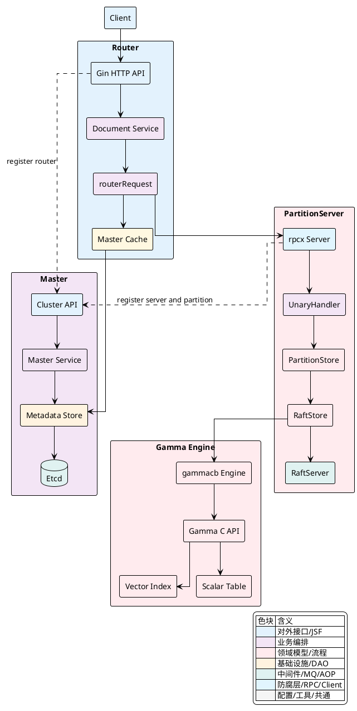
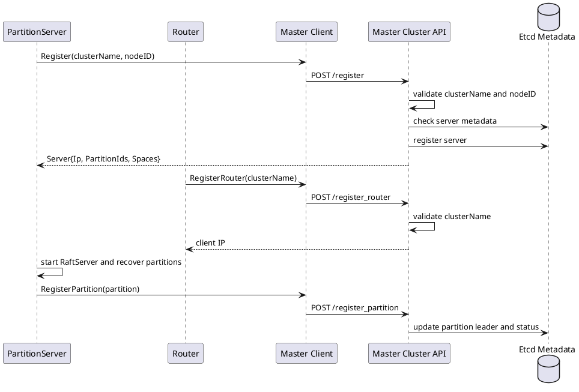
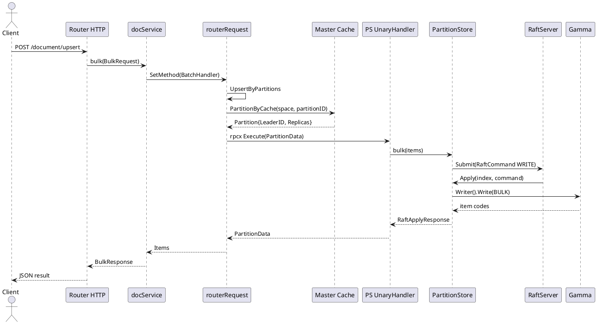
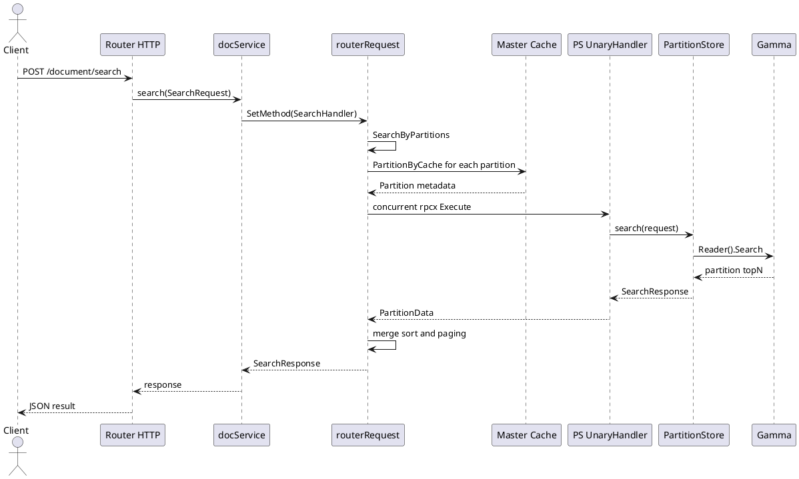
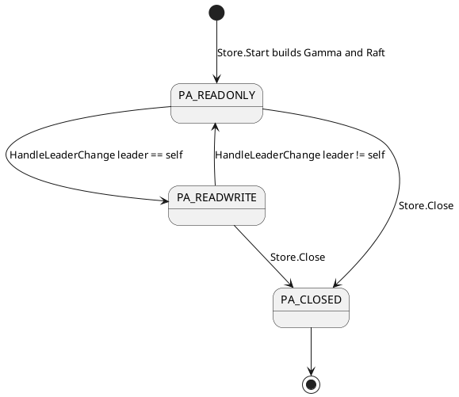

# 组件职责与交互关系

`Vearch` 的核心运行面由 `Master`、`Router`、`PartitionServer` 和 `Gamma` 组成。`Master` 保存集群与业务元数据，并接收节点注册、分区 leader 更新和治理操作；`Router` 面向用户暴露文档 API，将请求拆分到分区并合并结果；`PartitionServer` 承载真实分区，通过 `Raft` 复制写入并调用本地 `Gamma` 引擎完成索引、检索和持久化；`Gamma` 位于 `internal/engine` 与 `internal/ps/engine/gammacb` 交界处，是向量、标量与文档数据的本地执行引擎。

## 总体交互视图



### 组件边界：四类角色对应四条职责链

`Master` 的运行入口在 `internal/master/server.go`。启动时，`Server.Start` 会根据配置启动嵌入式 `Etcd` 或连接外部 `Etcd`，创建 `client.Client`，构造 `masterService`，注册 `Cluster API`，启动监控、备份、元数据 watch 任务，并把当前 `Master` 成员写入 `Etcd`。这使 `Master` 处于集群控制面的中心位置，所有 `DB`、`Space`、`Partition`、`Server`、`Router`、用户与角色等元数据都通过 `masterService` 管理。

`Router` 的运行入口在 `internal/router/server.go`。`NewServer` 创建 `client.Client` 后立即调用 `RegisterRouter`，随后初始化 `Gin` HTTP 服务、文档 API、可选 `gRPC` 服务以及 `Master` 缓存刷新任务。`Router` 不保存分区数据，它依赖 `Master` 缓存获得 `Space` 和 `Partition` 信息，再通过 `client.PS()` 与 `PartitionServer` 交互。

`PartitionServer` 的运行入口在 `internal/ps/server.go`。`Server.Start` 会初始化本地节点元数据，向 `Master` 注册自身，启动 `RaftServer`，恢复本地分区，监听 leader 与副本状态事件，启动心跳、慢查询控制和 `rpcx` 服务。`PartitionServer` 是数据面的主体，分区通过 `PartitionStore` 抽象暴露读写、检索、索引维护和 `Raft` 成员变更能力。

`Gamma` 的 Go 侧抽象定义在 `internal/ps/engine/engine.go`，实现集中在 `internal/ps/engine/gammacb`，底层 C++ 引擎位于 `internal/engine`。`PartitionStore` 启动时通过 `gammacb.Build` 创建本地引擎，写入、删除、查询、向量检索和 flush 都会最终进入 `gamma` SDK 或 C API。

| 组件 | 入口文件 | 核心对象 | 主要职责 | 关键依赖 |
| --- | --- | --- | --- | --- |
| `Master` | `internal/master/server.go` | `master.Server`、`masterService`、`clusterAPI` | 元数据、注册、调度、治理、认证、监控 | `Etcd`、`Gin`、`client.Client` |
| `Router` | `internal/router/server.go` | `router.Server`、`docService`、`routerRequest` | HTTP API、认证、参数解析、分区路由、结果合并 | `Gin`、`Master Cache`、`rpcx client` |
| `PartitionServer` | `internal/ps/server.go` | `ps.Server`、`PartitionStore`、`UnaryHandler` | 分区承载、RPC 执行、并发控制、`Raft` 复制、索引读写 | `rpcx`、`Raft`、`Gamma` |
| `Gamma` | `internal/ps/engine/engine.go`、`internal/engine/` | `engine.Engine`、`readerImpl`、`writerImpl` | 文档存取、向量检索、标量过滤、索引 dump、快照数据 | `gamma` Go SDK、C++ engine |

`Master` 的启动逻辑体现了它同时承担 HTTP 控制面和元数据持久化入口的职责：

[internal/master/server.go:82-105]()
```go
func (s *Server) Start() (err error) {
	log.Debug("master start ...")

	if !config.Conf().Global.SelfManageEtcd {
		s.etcdServer, err = embed.StartEtcd(s.etcCfg)
		if err != nil {
			log.Error(err.Error())
			return err
		}
		defer s.etcdServer.Close()
		select {
		case <-s.etcdServer.Server.ReadyNotify():
			log.Info("Server is ready!")
		case <-time.After(60 * time.Second):
			s.etcdServer.Server.Stop()
			log.Error("Server took too long to start!")
			return vearchpb.NewError(vearchpb.ErrorEnum_INTERNAL_ERROR, fmt.Errorf("etcd start timeout"))
		}
	}

	s.client, err = client.NewClient(config.Conf())
```

`Router` 在创建阶段完成注册、API 装配与缓存任务启动：

[internal/router/server.go:46-113]()
```go
func NewServer(ctx context.Context) (*Server, error) {
	cli, err := client.NewClient(config.Conf())
	if err != nil {
		return nil, err
	}

	res, err := cli.Master().RegisterRouter(ctx, config.Conf().Global.Name, time.Duration(10*time.Second))
	if err != nil {
		return nil, err
	}

	log.Info("register router success, res: %s", res)

	gin.SetMode(gin.ReleaseMode)
	httpServer := gin.New()

	document.ExportDocumentHandler(httpServer, cli)

	routerCtx, routerCancel := context.WithCancel(ctx)
	if err := cli.Master().FlushCacheJob(routerCtx); err != nil {
		log.Error("Error in Start cache Job,Err:%v", err)
		panic(err)
	}
```

`PartitionServer` 的启动逻辑则围绕节点元数据、`RaftServer`、分区恢复和 RPC 服务展开：

[internal/ps/server.go:123-176]()
```go
func (s *Server) Start() error {
	s.stopping = false

	nodeId := psutil.InitMeta(s.client, config.Conf().Global.Name, config.Conf().GetDataDir())
	s.nodeID = nodeId

	server := s.register()
	s.ip = server.Ip
	mserver.SetIp(server.Ip, true)

	s.raftServer, err = raftstore.StartRaftServer(nodeId, s.ip, s.raftResolver)

	s.recoverPartitions(server.PartitionIds, server.Spaces)

	s.startChangeLeaderC()
	s.StartHeartbeatJob()
	s.StartKillSlowRequestJob()

	if err = s.rpcServer.Run(); err != nil {
		log.Panic(fmt.Sprintf("ps rpcServer run error: %v", err))
	}

	ExportToRpcHandler(s)
	ExportToRpcAdminHandler(s)
```

<details>
<summary>关联代码</summary>

[internal/master/server.go:39-44](),[internal/master/server.go:82-237](),[internal/router/server.go:38-44](),[internal/router/server.go:46-154](),[internal/ps/server.go:50-73](),[internal/ps/server.go:123-180](),[internal/ps/engine/engine.go:26-82](),[internal/engine/]()

</details>

### 启动与注册：节点进入集群元数据

`Router` 和 `PartitionServer` 都通过 `client.Master()` 与 `Master` 交互，但注册语义不同。`Router` 的注册只校验集群名并返回当前 HTTP 客户端 IP，`Master` 将这个 IP 用于后续路由节点查询。`PartitionServer` 的注册携带 `nodeID`，`Master` 会校验集群名、检测节点是否已存在，并通过 `RegisterServer` 生成或返回服务端元数据，其中包含 `Ip`、`PartitionIds` 和 `Spaces`，用于 `PartitionServer` 恢复本地分区。



`Master` 将三个内部注册接口开放在未认证的 `group` 上，分别对应 `PartitionServer` 注册、分区 leader 注册和 `Router` 注册：

[internal/master/cluster_api.go:244-271]()
```go
func ExportToClusterHandler(router *gin.Engine, masterService *masterService, server *Server) {
	c := &clusterAPI{router: router, masterService: masterService, server: server}
	router.Use(RecoveryMiddleware())
	router.Use(TimeoutMiddleware(10 * time.Second))

	var group *gin.RouterGroup = router.Group("")

	group.POST("/register", c.register)
	group.POST("/register_partition", c.registerPartition)
	group.POST("/register_router", c.registerRouter)
```

`PartitionServer` 启动后会进入 `register` 循环，直到 `Master` 返回有效的 `entity.Server`。返回值中的 `PartitionIds` 和 `Spaces` 会直接进入分区恢复流程：

[internal/ps/server.go:228-248]()
```go
func (s *Server) register() (server *entity.Server) {
	var err error

	for i := range math.MaxInt32 {
		log.Info("registering master, nodeId: [%d], attempt: %d", s.nodeID, i)
		server, err = s.client.Master().Register(s.ctx, config.Conf().Global.Name, s.nodeID, 30*time.Second)
		if err != nil {
			log.Error("register master error, nodeId: [%d], err: %s", s.nodeID, err.Error())
		} else if server == nil {
			log.Error("no error but server is nil, nodeId: [%d]", s.nodeID)
		} else {
			break
		}
		time.Sleep(2 * time.Second)
	}
	if server == nil {
		s.Close()
	}
	log.Info("register master successful, nodeId: [%d]", s.nodeID)
	return server
}
```

`Master` 侧的 `register` 会读取客户端 IP 和 `nodeID`，进行集群名与节点唯一性校验，再调用 `masterService.Server().RegisterServer`：

[internal/master/cluster_api.go:444-482]()
```go
func (ca *clusterAPI) register(c *gin.Context) {
	ip := c.ClientIP()
	clusterName := c.Query("clusterName")
	nodeID := entity.NodeID(cast.ToInt64(c.Query("nodeID")))

	if clusterName == "" || nodeID == 0 {
		httpCode = response.New(c).JsonError(errors.NewErrBadRequest(fmt.Errorf("param err must has clusterName AND nodeID")))
		return
	}

	if clusterName != config.Conf().Global.Name {
		httpCode = response.New(c).JsonError(errors.NewErrUnprocessable(fmt.Errorf("cluster[%s] name different, config cluster name is %s", clusterName, config.Conf().Global.Name)))
		return
	}

	if err := ca.masterService.Server().IsExistNode(c, nodeID, ip); err != nil {
		httpCode = response.New(c).JsonError(errors.NewErrUnprocessable(err))
		return
	}

	server, err := ca.masterService.Server().RegisterServer(c, ip, nodeID)
```

`Router` 的注册处理更加轻量，核心是校验 `clusterName` 并返回 `c.ClientIP()`：

[internal/master/cluster_api.go:485-505]()
```go
func (ca *clusterAPI) registerRouter(c *gin.Context) {
	ip := c.ClientIP()
	clusterName := c.Query("clusterName")

	if clusterName != config.Conf().Global.Name {
		httpCode = response.New(c).JsonError(errors.NewErrUnprocessable(fmt.Errorf("cluster name different, please check")))
		return
	}

	httpCode = response.New(c).JsonSuccess(ip)
}
```

分区 leader 的更新由 `PartitionServer` 在 `Raft` leader 事件发生后触发。`registerMaster` 只允许当前节点作为 leader 时注册分区，并把 `partition.LeaderID` 写为本节点：

[internal/ps/server.go:302-334]()
```go
func (s *Server) HandleRaftLeaderEvent(event *raftstore.RaftLeaderEvent) {
	s.changeLeaderC <- &changeLeaderEntry{
		leader: event.Leader,
		pid:    event.PartitionId,
	}
}

func (s *Server) registerMaster(leader entity.NodeID, pid entity.PartitionID) {
	if leader != s.nodeID {
		return
	}

	store, ok := s.partitions.Load(pid)
	if !ok {
		log.Error("partition not found by id: [%d]", pid)
		return
	}

	if !s.raftServer.IsLeader(uint64(pid)) {
		log.Debug("server %d is not leader of partition: [%d]", s.nodeID, pid)
		return
	}

	partition := store.(PartitionStore).GetPartition()
	partition.LeaderID = s.nodeID

	if err := s.client.Master().RegisterPartition(context.Background(), partition); err != nil {
		log.Error("register partition error: [%s]", err.Error())
	}
}
```

<details>
<summary>关联代码</summary>

[internal/router/server.go:46-58](),[internal/ps/server.go:228-248](),[internal/ps/server.go:204-226](),[internal/ps/server.go:302-334](),[internal/master/cluster_api.go:244-271](),[internal/master/cluster_api.go:444-531]()

</details>

### Router 的请求编排：从 HTTP API 到分区 RPC

`Router` 的文档请求入口位于 `internal/router/document/doc_http.go`。以 upsert 为例，`handleDocumentUpsert` 负责从 `Gin` 请求中构造 `vearchpb.BulkRequest`，补齐 `RequestHead` 中的 `DbName` 和 `SpaceName`，通过 `docService.getSpace` 读取 `Space` 元数据，然后调用 `documentParse` 把 HTTP JSON 转换为内部 `vearchpb.Document` 列表，最后交给 `docService.bulk` 执行路由调用。

[internal/router/document/doc_http.go:460-511]()
```go
func (handler *DocumentHandler) handleDocumentUpsert(c *gin.Context) {
	args := &vearchpb.BulkRequest{}
	var err error
	args.Head, err = setRequestHeadFromGin(c)
	if err != nil {
		httpCode = response.New(c).JsonError(errors.NewErrInternal(err))
		return
	}
	docRequest := &request.DocumentRequest{}
	err = c.ShouldBindJSON(docRequest)
	if err != nil {
		httpCode = response.New(c).JsonError(errors.NewErrBadRequest(err))
		return
	}

	args.Head.DbName = dbName
	args.Head.SpaceName = spaceName
	space, err := handler.docService.getSpace(c.Request.Context(), args.Head)

	err = documentParse(c.Request.Context(), handler, c.Request, docRequest, space, args)
	if err != nil {
		httpCode = response.New(c).JsonError(errors.NewErrInternal(err))
		return
	}
	reply := handler.docService.bulk(c.Request.Context(), args)
	result, err := documentUpsertResponse(reply)
```

`docService` 是 HTTP 层与路由执行层之间的业务编排对象。它不直接连接 `PartitionServer`，而是创建 `client.routerRequest`，设置消息 ID、处理器类型、请求头、空间元数据和文档字段，然后调用 `Execute`、`SearchFieldSortExecute` 或 `QueryFieldSortExecute`。

| 请求类型 | `docService` 方法 | `routerRequest` 构造方式 | 执行方法 | 结果处理 |
| --- | --- | --- | --- | --- |
| 文档获取 | `getDocs` | `SetDocsByKey` + `PartitionDocs` | `Execute` | 按原始主键顺序回填 `Items` |
| 文档删除 | `deleteDocs` | `SetDocsByKey` + `SetDocsField` + `PartitionDocs` | `Execute` | 将分区错误写回每个 `Item` |
| 文档 upsert | `bulk` | `SetDocs` + `SetDocsField` + `UpsertByPartitions` | `Execute` | 汇总每个文档的写入结果 |
| 向量检索 | `search` | `SearchByPartitions` | `SearchFieldSortExecute` | 合并、排序、分页 |
| 标量查询 | `query` | `QueryByPartitions` | `QueryFieldSortExecute` | 合并分区查询结果 |
| 索引维护 | `flush`、`forceMerge`、`rebuildIndex` | `CommonByPartitions` 或 `CommonSetByPartitions` | 专用执行方法 | 汇总分区级状态 |

`docService.bulk` 显示了典型链式构造过程。`BatchHandler` 被写入 metadata，后续 `PartitionServer` 的 `UnaryHandler` 会根据这个值选择处理逻辑：

[internal/router/document/doc_service.go:104-114]()
```go
func (docService *docService) bulk(ctx context.Context, args *vearchpb.BulkRequest) *vearchpb.BulkResponse {
	reply := &vearchpb.BulkResponse{Head: newOkHead()}
	request := client.NewRouterRequest(ctx, docService.client)
	request.SetMsgID(args.Head.Params["request_id"]).SetMethod(client.BatchHandler).SetHead(args.Head).SetSpace().SetDocs(args.Docs).SetDocsField().UpsertByPartitions(args.Partitions)
	if request.Err != nil {
		log.Errorf("bulk args:[%v] error: [%s]", args, request.Err)
		return &vearchpb.BulkResponse{Head: setErrHead(request.Err)}
	}
	reply.Items = request.Execute()
	reply.Head.Params = request.GetMD()
	return reply
}
```

普通文档请求会根据主键 hash 到分区。`PartitionDocs` 使用 `murmur3.Sum32WithSeed` 计算主键 hash，然后调用 `space.PartitionId` 得到目标 `PartitionID`，最终形成 `map[PartitionID]*vearchpb.PartitionData`：

[internal/client/client.go:231-251]()
```go
func (r *routerRequest) PartitionDocs() *routerRequest {
	if r.Err != nil {
		return r
	}
	dataMap := make(map[entity.PartitionID]*vearchpb.PartitionData)
	for _, doc := range r.docs {
		partitionID := r.space.PartitionId(murmur3.Sum32WithSeed([]byte(doc.PKey), 0))
		item := &vearchpb.Item{Doc: doc}
		if d, ok := dataMap[partitionID]; ok {
			d.Items = append(d.Items, item)
		} else {
			items := make([]*vearchpb.Item, 0)
			d = &vearchpb.PartitionData{PartitionID: partitionID, MessageID: r.GetMsgID(), Items: items}
			dataMap[partitionID] = d
			d.Items = append(d.Items, item)
		}
	}
	r.sendMap = dataMap
	return r
}
```

`Execute` 会为每个分区启动 goroutine，从 `Master Cache` 中取出 `Partition`，优先调用 `partition.LeaderID` 对应的 `PartitionServer`，失败时遍历副本重试。响应回收后，`Router` 根据原始文档主键位置将分区结果回填到用户请求顺序中。

[internal/client/client.go:374-450]()
```go
func (r *routerRequest) Execute() []*vearchpb.Item {
	var wg sync.WaitGroup

	respChain := make(chan *vearchpb.PartitionData, len(r.sendMap))
	for partitionID, pData := range r.sendMap {
		wg.Add(1)
		c := context.WithValue(r.ctx, share.ReqMetaDataKey, copyMap(r.md))
		go func(ctx context.Context, pid entity.PartitionID, d *vearchpb.PartitionData) {
			defer wg.Done()
			replyPartition := new(vearchpb.PartitionData)

			partition, e := r.client.Master().Cache().PartitionByCache(ctx, r.space.Name, pid)
			if e != nil {
				panic(e.Error())
			}

			nodeID := partition.LeaderID
			err := r.client.PS().GetOrCreateRPCClient(ctx, nodeID).Execute(ctx, UnaryHandler, d, replyPartition)
			if err != nil {
				for _, nodeID := range partition.Replicas {
					if nodeID == 0 {
						continue
					}
					if r.client.PS().TestFaulty(nodeID) {
						continue
					}
					replyPartition = new(vearchpb.PartitionData)
					err = r.client.PS().GetOrCreateRPCClient(ctx, nodeID).Execute(ctx, UnaryHandler, d, replyPartition)
					if err == nil {
						break
					}
				}
```

检索请求与写入请求不同，`SearchByPartitions` 会把同一份 `SearchRequest` 广播到多个分区。`SearchFieldSortExecute` 并发访问分区后，通过 `AddMergeSort`、`quickSort` 和分页逻辑合并最终结果。`ClientType` 会影响副本选择，`Leader`、`NotLeader`、`Random`、`LeastConnection` 都通过 `GetNodeIdsByClientType` 映射到具体 `nodeID`。

[internal/client/client.go:1321-1345]()
```go
func (r *routerRequest) SearchByPartitions(searchReq *vearchpb.SearchRequest) *routerRequest {
	if r.Err != nil {
		return r
	}
	r.sendMap = make(map[entity.PartitionID]*vearchpb.PartitionData)
	partition_names := make(map[string]bool)
	if len(searchReq.PartitionNames) > 0 {
		for _, pname := range searchReq.PartitionNames {
			partition_names[pname] = true
		}
	}
	for _, p := range r.space.Partitions {
		if len(partition_names) > 0 {
			if _, ok := partition_names[p.Name]; !ok {
				continue
			}
		}
		r.sendMap[p.Id] = &vearchpb.PartitionData{PartitionID: p.Id, MessageID: r.GetMsgID(), SearchRequest: searchReq}
	}
	return r
}
```

[internal/client/client.go:823-909]()
```go
if r.Err == nil {
	var result []*vearchpb.SearchResult

	mergeStartTime := time.Now()
	var finalErr *vearchpb.Error
	for r := range respChain {
		if r != nil && r.PartitionData.Err != nil {
			finalErr = r.PartitionData.Err
			continue
		}

		if result == nil && r != nil {
			searchResponse = r.PartitionData.SearchResponse
			if searchResponse != nil && len(searchResponse.Results) > 0 {
				result = searchResponse.Results
				continue
			}
		}

		if len(result) <= len(r.PartitionData.SearchResponse.Results) {
			for i := range result {
				AddMergeSort(result[i], r.PartitionData.SearchResponse.Results[i], int(searchReq.TopN), desc)
			}
		}
	}

	for _, resp := range result {
		quickSort(resp.ResultItems, desc, 0, len(resp.ResultItems)-1)
		if len(resp.ResultItems) > 0 {
			if searchReq.PageSize > 0 && searchReq.PageNum >= 1 {
```

<details>
<summary>关联代码</summary>

[internal/router/document/doc_http.go:460-511](),[internal/router/document/doc_service.go:55-114](),[internal/router/document/doc_service.go:150-200](),[internal/client/client.go:110-126](),[internal/client/client.go:231-341](),[internal/client/client.go:374-488](),[internal/client/client.go:770-926](),[internal/client/client.go:1255-1345](),[internal/client/client.go:1347-1414]()

</details>

### PartitionServer 的执行边界：RPC、并发隔离与 PartitionStore

`PartitionServer` 对 `Router` 暴露的是 `rpcx` 服务。`ExportToRpcHandler` 把多个处理器串成 `handler.NewChain`，其中 `InitHandler` 处理停止状态，`UnaryHandler` 是文档请求的核心执行器。请求方法不是通过 RPC 方法名区分，而是通过 metadata 中的 `client.HandlerType` 区分；这与 `Router` 中 `SetMethod` 写入 metadata 的行为对应。

[internal/ps/handler_document.go:64-74]()
```go
func ExportToRpcHandler(server *Server) {
	initHandler := &InitHandler{server: server}
	psErrorChange := psErrorChange(server)

	limitPlugin := &limitPlugin{limit: atomic.NewInt64(0), size: 50000}
	server.rpcServer.AddPlugin(limitPlugin)

	if err := server.rpcServer.RegisterName(handler.NewChain(client.UnaryHandler, handler.DefaultPanicHandler, psErrorChange, initHandler, &UnaryHandler{server: server}), ""); err != nil {
		panic(err)
	}
}
```

`UnaryHandler.Execute` 会从 `share.ReqMetaDataKey` 取出 `HandlerType`，设置超时上下文，并对 `SearchHandler` 和 `QueryHandler` 维护运行中请求队列。真正的业务分发在 goroutine 中执行，外层通过 `doneCh` 和 `time.After` 统一返回成功或超时。

[internal/ps/handler_document.go:96-187]()
```go
func (handler *UnaryHandler) Execute(ctx context.Context, req *vearchpb.PartitionData, reply *vearchpb.PartitionData) (err error) {
	var method string
	reqMap := ctx.Value(share.ReqMetaDataKey).(map[string]string)
	method, ok := reqMap[client.HandlerType]
	if !ok {
		msg := fmt.Sprintf("client type not found in matadata, key [%s]", client.HandlerType)
		reply.Err = vearchpb.NewError(vearchpb.ErrorEnum_INTERNAL_ERROR, errors.New(msg)).GetError()
		return
	}

	timeout := handler.server.rpcTimeOut * 1000
	deadline, ok := ctx.Deadline()
	if ok {
		timeout = int(time.Until(deadline).Seconds() * 1000)
	}
	delayTime := time.Duration(timeout) * time.Millisecond
	ctx, cancel := context.WithTimeout(ctx, delayTime)
	defer cancel()

	doneCh := make(chan struct{})
	go func(ctx context.Context, req *vearchpb.PartitionData) {
		handler.execute(ctx, req)
		close(doneCh)
	}(ctx, req)

	select {
	case <-doneCh:
		reply.PartitionID = req.PartitionID
		reply.MessageID = req.MessageID
		reply.Items = req.Items
		reply.SearchResponse = req.SearchResponse
		reply.DelByQueryResponse = req.DelByQueryResponse
		reply.Err = req.Err
		return
	case <-time.After(delayTime):
		msg := fmt.Sprintf("request of method[%s] time out[%dms]", method, timeout)
		reply.Err = vearchpb.NewError(vearchpb.ErrorEnum_TIMEOUT, errors.New(msg)).GetError()
		return
	}
}
```

`handler.execute` 内部会按请求类型选择并发控制通道。慢查询使用 `slow_search_concurrent`，普通读使用 `read_request_concurrent`，写入和维护类请求使用 `write_request_concurrent`。进入并发槽位后，请求被交给 `handler.document`，再由 `PartitionData.PartitionID` 找到本地 `PartitionStore`。

[internal/ps/handler_document.go:215-240]()
```go
var concurrentCh chan bool
if req.SearchRequest != nil && req.SearchRequest.IsSlowSearch {
	concurrentCh = handler.server.slow_search_concurrent
} else if method == client.QueryHandler || method == client.SearchHandler ||
	method == client.GetDocsHandler || method == client.GetDocsByPartitionHandler ||
	method == client.GetNextDocsByPartitionHandler {
	concurrentCh = handler.server.read_request_concurrent
} else {
	concurrentCh = handler.server.write_request_concurrent
}

select {
case concurrentCh <- true:
	defer func() {
		<-concurrentCh
	}()
case <-ctx.Done():
	if ctx.Err() == context.DeadlineExceeded {
		msg := fmt.Sprintf("request for partition: %d time out, the server can only deal [%d] request at same time.", req.PartitionID, cap(concurrentCh))
		log.Error(msg)
		req.Err = vearchpb.NewError(vearchpb.ErrorEnum_TIMEOUT, nil).GetError()
		return
	}
```

`PartitionStore` 是 `PartitionServer` 数据面的稳定接口。它组合了基础分区能力、`Raft` 能力、文档读写、索引 flush、向量检索和标量查询能力。`Server.GetPartition` 从本地 `sync.Map` 中按 `PartitionID` 取出具体 store，`handler_document` 对外屏蔽了底层 `RaftStore` 和 `Gamma` 的实现细节。

[internal/ps/partition_service.go:70-86]()
```go
type PartitionStore interface {
	Base

	Raft

	UpdateSpace(ctx context.Context, space *entity.Space) error

	GetDocument(ctx context.Context, readLeader bool, doc *vearchpb.Document, getByDocId bool, next bool) (err error)

	Write(ctx context.Context, request *vearchpb.DocCmd) (err error)

	Flush(ctx context.Context) error

	Search(ctx context.Context, query *vearchpb.SearchRequest, response *vearchpb.SearchResponse) error

	Query(ctx context.Context, query *vearchpb.QueryRequest, response *vearchpb.SearchResponse) error
}
```

请求分发逻辑把 `client.HandlerType` 映射到 `PartitionStore` 方法。`BatchHandler`、`DeleteDocsHandler` 进入写路径，`SearchHandler`、`QueryHandler` 进入读路径，`FlushHandler`、`ForceMergeHandler`、`RebuildIndexHandler` 进入索引维护路径。

[internal/ps/handler_document.go:246-290]()
```go
store := handler.server.GetPartition(req.PartitionID)
if store == nil {
	msg := fmt.Sprintf("partition not found, partitionId:[%d], nodeID:[%d], node ip:[%s]", req.PartitionID, handler.server.nodeID, handler.server.ip)
	log.Error(msg)
	req.Err = vearchpb.NewError(vearchpb.ErrorEnum_PARTITION_NOT_EXIST, errors.New(msg)).GetError()
	return
}

switch method {
case client.GetDocsHandler:
	getDocuments(ctx, store, req.Items, false, false)
case client.GetDocsByPartitionHandler:
	getDocuments(ctx, store, req.Items, true, false)
case client.DeleteDocsHandler:
	deleteDocs(ctx, store, req.Items)
case client.BatchHandler:
	bulk(ctx, store, req.Items)
case client.SearchHandler:
	search(ctx, store, req.SearchRequest, req.SearchResponse)
case client.QueryHandler:
	query(ctx, store, req.QueryRequest, req.SearchResponse)
case client.ForceMergeHandler:
	req.Err = forceMerge(store)
case client.RebuildIndexHandler:
	req.Err = rebuildIndex(store, req.IndexRequest)
case client.DeleteByQueryHandler:
	deleteByQuery(ctx, store, req.QueryRequest, req.DelByQueryResponse)
case client.FlushHandler:
	req.Err = flush(ctx, store)
default:
	req.Err = vearchpb.NewError(vearchpb.ErrorEnum_METHOD_NOT_IMPLEMENT, nil).GetError()
	return
}
```

<details>
<summary>关联代码</summary>

[internal/ps/handler_document.go:44-74](),[internal/ps/handler_document.go:76-187](),[internal/ps/handler_document.go:189-240](),[internal/ps/handler_document.go:246-290](),[internal/ps/partition_service.go:70-93](),[internal/ps/server.go:44-73](),[internal/ps/server.go:76-116]()

</details>

### Raft 与 Gamma：写入复制、读取检索和索引持久化

每个分区在 `PartitionServer` 内部对应一个 `raftstore.Store`。`CreateStore` 创建分区目录和 `storage.StoreBase`，`Start` 构建 `Gamma` 引擎、读取最后应用的序列号 `SN`，打开本地 `WAL`，并用分区副本列表创建 `Raft` group。`Store` 同时是 `Raft` 状态机，写入先进入 `RaftServer.Submit`，再由 `Apply` 调用 `Engine.Writer().Write`。

[internal/ps/storage/raftstore/store.go:123-187]()
```go
func (s *Store) Start() (err error) {
	s.Engine, err = gammacb.Build(gammacb.EngineConfig{
		Path:        s.DataPath,
		Space:       s.Space,
		PartitionID: s.Partition.Id,
	})
	if err != nil {
		return err
	}
	apply, err := s.Engine.Reader().ReadSN(s.Ctx)
	if err != nil {
		s.Engine.Close()
		return err
	}
	s.LastFlushSn = apply
	s.LastFlushTime = time.Now()

	s.Partition.SetStatus(entity.PA_READONLY)

	raftStore, err := wal.NewStorage(s.RaftPath, nil)

	raftConf := &raft.RaftConfig{
		ID:           uint64(s.Partition.Id),
		Applied:      uint64(apply),
		Peers:        make([]proto.Peer, 0, len(partition.Replicas)),
		Storage:      raftStore,
		StateMachine: s,
	}
```

写入路径从 `PartitionStore.Write` 开始。它先检查分区是否可写，然后把 `vearchpb.DocCmd` 包装为 `vearchpb.RaftCommand`，序列化后提交给 `Raft`。这意味着 `Router` 看到的文档 upsert 或 delete，在 `PartitionServer` 内部都会先进入分区 `Raft` group。

[internal/ps/storage/raftstore/store_writer.go:77-114]()
```go
func (s *Store) Write(ctx context.Context, request *vearchpb.DocCmd) (err error) {
	if err = s.checkWritable(); err != nil {
		return err
	}

	if request.Type == vearchpb.OpType_BULK {
		if s.Partition.ResourceExhausted {
			err = vearchpb.NewError(vearchpb.ErrorEnum_PARTITION_RESOURCE_EXHAUSTED, fmt.Errorf("partition %d resource exhausted", s.Partition.Id))
			return err
		}
	}

	raftCmd := &vearchpb.RaftCommand{
		Type:         vearchpb.CmdType_WRITE,
		WriteCommand: request,
	}

	data, err := json.Marshal(raftCmd)
	if err != nil {
		return err
	}

	err = s.RaftSubmit(data)
	if err != nil {
		return err
	}

	return nil
}
```

`Raft` 状态机的 `Apply` 将日志命令落到本地 `Gamma`。`CmdType_WRITE` 调用 `Engine.Writer().Write`，`CmdType_FLUSH` 调用 `Engine.Writer().Commit` 并返回 `FlushC`，`CmdType_UPDATESPACE` 更新 schema 与本地分区元数据。若启用 `Global.RaftConsistent`，leader 会检查副本 commit 进度，并把副本状态变化送入 `replicasStatusC`，最终注册回 `Master` 的分区元数据。

[internal/ps/storage/raftstore/raft_state_machine.go:91-143]()
```go
func (s *Store) Apply(command []byte, index uint64) (resp any, err error) {
	raftCmd := &vearchpb.RaftCommand{}

	if err = json.Unmarshal(command, raftCmd); err != nil {
		log.Error(err)
		return nil, err
	}

	resp = s.innerApply(index, raftCmd)
	if config.Conf().Global.RaftConsistent {
		if s.IsLeader() && s.ReplicasStatusChange() {
			partitionStatus := &ReplicasStatusEntry{
				NodeID:      s.NodeID,
				PartitionID: s.Partition.Id,
				ReStatusMap: *copySyncMap(&s.RsStatusMap),
			}
			s.RsStatusC <- partitionStatus
		}
	}
	return resp, nil
}

func (s *Store) innerApply(index uint64, raftCmd *vearchpb.RaftCommand) any {
	resp := new(RaftApplyResponse)
	switch raftCmd.Type {
	case vearchpb.CmdType_WRITE:
		resp.Err = s.Engine.Writer().Write(s.Ctx, raftCmd.WriteCommand)
	case vearchpb.CmdType_UPDATESPACE:
		resp = s.updateSchemaBySpace(raftCmd.UpdateSpace.Space)
	case vearchpb.CmdType_FLUSH:
		flushC, err := s.Engine.Writer().Commit(s.Ctx, int64(index))
		resp.FlushC = flushC
		resp.Err = err
	}

	s.Sn = int64(index)

	return resp
}
```

读路径不经过 `Raft.Submit`。`GetDocument`、`Search` 和 `Query` 先检查分区状态，再直接调用 `Engine.Reader()`。当请求头中的 `ClientType` 为 `leader` 时，`checkReadable` 会要求分区处于 `PA_READWRITE`，否则允许从只读副本读取。

[internal/ps/storage/raftstore/store_read.go:25-74]()
```go
func (s *Store) GetDocument(ctx context.Context, readLeader bool, doc *vearchpb.Document, getByDocId bool, next bool) (err error) {
	if err = s.checkReadable(readLeader); err != nil {
		return err
	}
	return s.Engine.Reader().GetDoc(ctx, doc, getByDocId, next)
}

func (s *Store) Search(ctx context.Context, request *vearchpb.SearchRequest, response *vearchpb.SearchResponse) (err error) {
	leader := false
	if request.Head.ClientType == "leader" {
		leader = true
	}
	if err = s.checkReadable(leader); err != nil {
		return err
	}
	err = s.Engine.Reader().Search(ctx, request, response)
	return err
}

func (s *Store) Query(ctx context.Context, request *vearchpb.QueryRequest, response *vearchpb.SearchResponse) (err error) {
	leader := false
	if request.Head.ClientType == "leader" {
		leader = true
	}
	if err = s.checkReadable(leader); err != nil {
		return err
	}
	err = s.Engine.Reader().Query(ctx, request, response)
	return err
}
```

`Gamma` 的写入实现把 `BULK` 转为 `gamma.AddOrUpdateDocs`，把 `DELETE` 转为 `gamma.DeleteDoc`。`Flush` 和 `Commit` 通过 `gamma.Dump` 把索引持久化到磁盘，并写入 `sn` 文件记录已落盘的 `Raft` index。

[internal/ps/engine/gammacb/writer.go:42-82]()
```go
func (wi *writerImpl) Write(ctx context.Context, doc *vearchpb.DocCmd) (err error) {
	if doc == nil {
		return errors.New("doc is nil")
	}

	wi.engine.counter.Incr()
	defer wi.engine.counter.Decr()

	gammaEngine := wi.engine.gamma
	if gammaEngine == nil {
		return vearchpb.NewError(vearchpb.ErrorEnum_PARTITION_IS_CLOSED, nil)
	}

	switch doc.Type {
	case vearchpb.OpType_BULK:
		resp := gamma.AddOrUpdateDocs(gammaEngine, doc.Docs)
		var buffer bytes.Buffer
		for _, code := range resp {
			buffer.WriteString(strconv.Itoa(int(code)) + ",")
		}
		err := errors.New(buffer.String())
		return vearchpb.NewError(vearchpb.ErrorEnum_SUCCESS, err)
	case vearchpb.OpType_DELETE:
		if resp := gamma.DeleteDoc(gammaEngine, doc.Doc); resp != 0 {
			if resp == -1 {
				return vearchpb.NewError(vearchpb.ErrorEnum_DOCUMENT_NOT_EXIST, nil)
			}
			err = fmt.Errorf("gamma delete doc err code:[%d]", int(resp))
			return vearchpb.NewError(vearchpb.ErrorEnum_INTERNAL_ERROR, err)
		}
	}
	return
}
```

[internal/ps/engine/gammacb/writer.go:84-107]()
```go
func (wi *writerImpl) Flush(ctx context.Context, sn int64) error {
	wi.engine.counter.Incr()
	defer wi.engine.counter.Decr()

	gammaEngine := wi.engine.gamma
	if gammaEngine == nil {
		log.Error("gammaEngine is nil")
		return vearchpb.NewError(vearchpb.ErrorEnum_PARTITION_IS_CLOSED, nil)
	}

	wi.engine.lock.Lock()
	defer wi.engine.lock.Unlock()

	if code := gamma.Dump(gammaEngine); code != 0 {
		return fmt.Errorf("dump index err response code :[%d]", code)
	}

	fileName := filepath.Join(wi.engine.path, indexSn)
	err := fileutil.WriteFileAtomic(fileName, []byte(string(strconv.FormatInt(sn, 10))), os.ModePerm)
	if err != nil {
		return err
	}
	return nil
}
```

<details>
<summary>关联代码</summary>

[internal/ps/storage/raftstore/store.go:69-96](),[internal/ps/storage/raftstore/store.go:123-187](),[internal/ps/storage/raftstore/store_writer.go:77-164](),[internal/ps/storage/raftstore/raft_state_machine.go:91-143](),[internal/ps/storage/raftstore/store_read.go:25-74](),[internal/ps/engine/engine.go:26-82](),[internal/ps/engine/gammacb/reader.go:42-76](),[internal/ps/engine/gammacb/writer.go:42-159](),[internal/engine/c_api/gamma_api.h](),[internal/engine/c_api/gamma_api.cc]()

</details>

### 请求链路：一次文档写入与一次向量检索的执行路径

写入链路从 `Router` 的 HTTP API 开始，经过 `docService.bulk` 和 `routerRequest.Execute`，按主键或分区规则切分为 `PartitionData`。`Router` 通过 `Master Cache` 找到分区 leader，然后调用该 leader 所在 `PartitionServer` 的 `UnaryHandler`。`PartitionServer` 找到本地 `PartitionStore` 后，将 `BULK` 命令提交给 `Raft`。当日志在状态机中 `Apply` 时，`Gamma` 执行 `AddOrUpdateDocs`。

检索链路同样由 `Router` 编排，但通常会广播到多个分区。每个分区请求根据 `ClientType` 选择 leader 或副本，`PartitionServer` 执行 `store.Search`，`Gamma` 返回每个分区的 topN 结果，`Router` 最后进行跨分区合并排序和分页。





| 阶段 | 写入请求 | 检索请求 |
| --- | --- | --- |
| HTTP 入口 | `handleDocumentUpsert` | `handleDocumentSearch`、`handleDocumentQuery` |
| 业务编排 | `docService.bulk` | `docService.search`、`docService.query` |
| 分区选择 | `UpsertByPartitions` | `SearchByPartitions`、`QueryByPartitions` |
| PS 选择 | `partition.LeaderID` 优先 | `GetNodeIdsByClientType` |
| PS 分发 | `BatchHandler` | `SearchHandler`、`QueryHandler` |
| Store 调用 | `PartitionStore.Write` | `PartitionStore.Search`、`PartitionStore.Query` |
| `Raft` 行为 | `Submit` 后 `Apply` | 不提交 `Raft` |
| `Gamma` 行为 | `AddOrUpdateDocs` 或 `DeleteDoc` | `Search` 或 `Query` |

<details>
<summary>关联代码</summary>

[internal/router/document/doc_http.go:460-511](),[internal/router/document/doc_http.go:652-721](),[internal/router/document/doc_service.go:104-114](),[internal/router/document/doc_service.go:172-200](),[internal/client/client.go:277-341](),[internal/client/client.go:374-488](),[internal/client/client.go:500-744](),[internal/client/client.go:823-909](),[internal/ps/handler_document.go:246-290](),[internal/ps/handler_document.go:344-403](),[internal/ps/handler_document.go:432-459](),[internal/ps/storage/raftstore/store_writer.go:77-127](),[internal/ps/storage/raftstore/store_read.go:52-74]()

</details>

### 组件协作中的状态流转

分区状态围绕 `Raft` leader 变化、读写能力和 `Master` 元数据更新流转。分区 store 启动后先进入 `PA_READONLY`，当 `Raft` 通知当前节点成为 leader 时，`HandleLeaderChange` 将状态设置为 `PA_READWRITE`，并触发 `HandleRaftLeaderEvent`，随后 `PartitionServer` 通过 `RegisterPartition` 把新的 leader 写入 `Master`。当当前节点不再是 leader 时，状态回到 `PA_READONLY`，读请求仍可在条件满足时执行，写请求会被 `checkWritable` 拦截。



`HandleLeaderChange` 是状态变化与元数据同步的连接点。成为 leader 的节点不仅改变本地状态，还把 leader 事件交给 `PartitionServer`，最终调用 `RegisterPartition`：

[internal/ps/storage/raftstore/raft_state_machine.go:217-229]()
```go
func (s *Store) HandleLeaderChange(leader uint64) {
	s.Lock()
	defer s.Unlock()

	log.Info("partition[%d] node[%d] change leader to [%d]", s.Partition.Id, s.NodeID, leader)
	if leader == uint64(s.NodeID) {
		s.Partition.SetStatus(entity.PA_READWRITE)
		s.EventListener.HandleRaftLeaderEvent(&RaftLeaderEvent{PartitionId: s.Partition.Id, Leader: leader})
	} else {
		s.Partition.SetStatus(entity.PA_READONLY)
	}
}
```

`checkReadable` 和 `checkWritable` 分别控制读写入口。读请求可以在只读副本上执行，但当请求指定读 leader 时，需要分区处于 `PA_READWRITE`。写请求要求分区处于可写状态，否则返回分区状态错误。

[internal/ps/storage/raftstore/store_read.go:32-50]()
```go
func (s *Store) checkReadable(readLeader bool) error {
	status := s.Partition.GetStatus()

	if status == entity.PA_CLOSED {
		return vearchpb.NewError(vearchpb.ErrorEnum_PARTITION_IS_CLOSED, nil)
	}

	if status == entity.PA_INVALID {
		return vearchpb.NewError(vearchpb.ErrorEnum_PARTITION_IS_INVALID, nil)
	}

	if readLeader && status != entity.PA_READWRITE {
		log.Error("checkReadable status: %d , err: %v", status, vearchpb.NewError(vearchpb.ErrorEnum_PARTITION_NOT_LEADER, nil).Error())
		return vearchpb.NewError(vearchpb.ErrorEnum_PARTITION_NOT_LEADER, nil)
	}

	return nil
}
```

<details>
<summary>关联代码</summary>

[internal/ps/storage/raftstore/store.go:123-187](),[internal/ps/storage/raftstore/store.go:190-204](),[internal/ps/storage/raftstore/raft_state_machine.go:217-229](),[internal/ps/storage/raftstore/store_read.go:25-74](),[internal/ps/storage/raftstore/store_writer.go:166-180](),[internal/ps/server.go:204-226](),[internal/ps/server.go:302-334]()

</details>