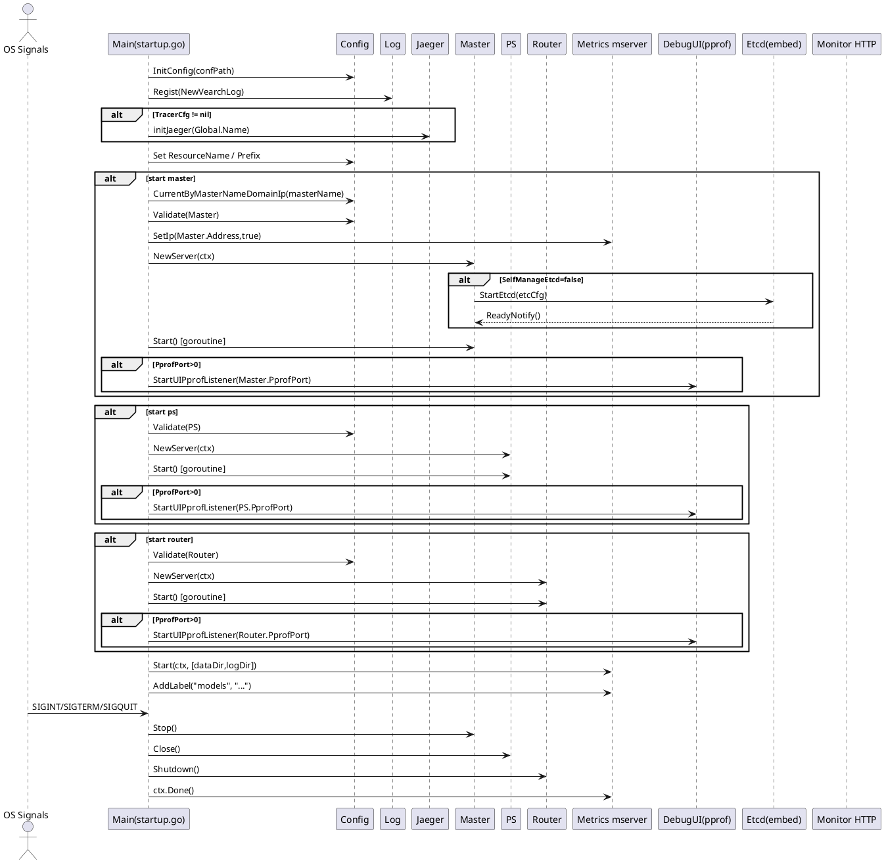

## 运行入口与启动流程

本节从进程入口 `cmd/vearch/startup.go` 切入，串联配置加载、日志与追踪初始化、组件并发启动（`master`、`ps`、`router`）、调试与监控的注册，以及信号驱动的优雅关闭，描绘从命令到服务可用的完整时序与数据流动。

### 启动模式与参数解析

进程通过命令行参数选择启动角色，并据此编排后续的初始化与并发启动。可选标签为 `master`、`ps`、`router`、`all`。当无参数时，默认等价于 `all`。

- 启动标签与组件关系

| 标签 | 启动组件 |
| --- | --- |
| `master` | Master |
| `ps` | PartitionServer |
| `router` | Router |
| `all` | Master、PartitionServer、Router |

核心逻辑如下：读取 `-conf` 配置路径、可选 `-master` 主节点名（本地多 Master 时用于精准定位），解析剩余参数得出启动标签集合，随后进入初始化流程。

关键代码示例：
[cmd/vearch/startup.go:52-63]()
```go
func init() {
    flag.StringVar(&confPath, "conf", getDefaultConfigFile(), "vearch config path")
    flag.StringVar(&masterName, "master", "", "vearch config for master name, is on local start two master must use it")
}
const (
    psTag     = "ps"
    masterTag = "master"
    routerTag = "router"
    allTag    = "all"
)
```

[cmd/vearch/startup.go:107-121]()
```go
args := flag.Args()
if len(args) == 0 {
    args = []string{allTag}
}
tags := map[string]bool{allTag: false, psTag: false, routerTag: false, masterTag: false}
for _, a := range args {
    if _, ok := tags[a]; !ok {
        log.Error("not found tags: %s it only support [ps, router, master or all]", a)
        os.Exit(1)
    }
    tags[a] = true
}
```

<details>
<summary>关联代码</summary>

[cmd/vearch/startup.go:52-63](),[cmd/vearch/startup.go:107-121]()

</details>

### 引导参数与配置加载

`main` 首先设置版本信息，解析参数并加载 TOML 配置。`config.InitConfig` 将路径与默认值写入单例，并解码配置文件至内存。若启用分布式追踪，还会接入 Jaeger 配置。其后设置集群名前缀、资源名、以及日志滚动参数。

- 数据流向
  - `-conf` 路径进入 `config.InitConfig`，经 `toml.DecodeFile` 转换为内存结构 `Config`。
  - `Global.ResourceName` 空值回退为默认 `default`，用于后续集群标识。
  - 若存在 `TracerCfg`，`initJaeger` 生成全局 Tracer；trace 流量将发往本地或远端 Jaeger Agent。
  - 通过 `entity.SetPrefixAndSequence` 设置集群前缀，影响后续 etcd/键空间前缀与序号生成。

关键代码示例：
[cmd/vearch/startup.go:97-106]()
```go
config.InitConfig(confPath)

if config.Conf().Global.ResourceName == "" {
    config.Conf().Global.ResourceName = DefaultResourceName
}

if config.Conf().TracerCfg != nil {
    closer := initJaeger(config.Conf().Global.Name, config.Conf().TracerCfg)
    defer closer.Close()
}
```

[internal/config/config.go:399-422]()
```go
func InitConfig(path string) {
    single = &Config{
        mu: new(sync.RWMutex),
        Global: &GlobalCfg{ ResourceLimitRate: entity.DefaultResourceLimitRate, },
        PS: &PSCfg{ ReplicaAutoRecoverTime: -1, },
    }
    LoadConfig(single, path)
}
func LoadConfig(conf *Config, path string) {
    if _, err := toml.DecodeFile(path, conf); err != nil { os.Exit(-1) }
    conf.Global.Path = path
}
```

[cmd/vearch/startup.go:65-85]()
```go
func initJaeger(service string, c *config.TracerCfg) io.Closer {
    cfg := &jaegerConfig.Configuration{
        ServiceName: service,
        Sampler: &jaegerConfig.SamplerConfig{ Type:  c.SampleType, Param: c.SampleParam, },
        Reporter: &jaegerConfig.ReporterConfig{
            LocalAgentHostPort: c.Host,
            LogSpans: false, DisableAttemptReconnecting: false, AttemptReconnectInterval: 1 * time.Minute,
        },
    }
    closer, err := cfg.InitGlobalTracer(service, jaegerConfig.Logger(jaeger.StdLogger))
    if err != nil { panic(fmt.Sprintf("ERROR: cannot init Jaeger: %v\n", err)) }
    return closer
}
```

<details>
<summary>关联代码</summary>

[cmd/vearch/startup.go:88-106](),[cmd/vearch/startup.go:122-131](),[cmd/vearch/startup.go:65-85](),[internal/config/config.go:399-422](),[internal/config/config.go:218-221]()

</details>

### 日志、追踪与运行环境初始化

日志子系统通过 `vearchlog.SetConfig` 配置滚动文件大小与数量，`log.Regist` 绑定具体实现。随后输出版本、配置与 CPU 并发信息。若调试级别开启，后台协程周期性读取 `runtime.MemStats` 输出 `goroutine` 数与内存指标，便于线上诊断。

- 数据流向
  - `vearchlog` 将日志写入 `Global.LogDir`，文件名根据组件标签组合成 `logName`。
  - Debug 监视协程每 3 分钟读取 `runtime` 指标并写入日志。

关键代码示例：
[cmd/vearch/startup.go:122-131]()
```go
logName := strings.ToUpper(strings.Join(args, "-"))
vearchlog.SetConfig(config.Conf().GetLogFileNum(), 1024*1024*config.Conf().GetLogFileSize())
log.Regist(vearchlog.NewVearchLog(config.Conf().GetLogDir(), logName, config.Conf().GetLevel(), false))

entity.SetPrefixAndSequence(config.Conf().Global.Name)
log.Info("The cluster prefix is: %v", entity.PrefixEtcdClusterID)
```

[cmd/vearch/startup.go:136-153]()
```go
if log.IsDebugEnabled() {
    go func() {
        for {
            select {
            case <-ctx.Done():
                return
            default:
            }
            if config.LogInfoPrintSwitch {
                var mem runtime.MemStats
                runtime.ReadMemStats(&mem)
                log.Debug("mem.Alloc:", mem.Alloc, " ... routing :", runtime.NumGoroutine())
            }
            time.Sleep(3 * time.Minute)
        }
    }()
}
```

<details>
<summary>关联代码</summary>

[cmd/vearch/startup.go:122-131](),[cmd/vearch/startup.go:136-153]()

</details>

### 组件启动编排与并发生命周期

主流程依据标签依次为 `master`、`ps`、`router` 构造服务、验证配置、启动 goroutine，并在 `signals.SignalHook` 中注册关闭钩子。三者共享同一 `ctx` 根上下文，`router` 关闭时会 `cancel` 以终止子任务。

- Master 启动流
  - `CurrentByMasterNameDomainIp` 基于 `-master` 名称或本机 IP 映射，标定本实例对应的 `Masters.Self()`。
  - `Validate(config.Master)` 校验模型与本地目录。
  - `mserver.SetIp(self.Address, true)` 为监控设置主机标识。
  - `master.NewServer(ctx)` 根据 `Global.SelfManageEtcd` 决定是否启用内嵌 `etcd`。
  - `Start()` 若内嵌 etcd，阻塞等待就绪；启动 Gin `http` API、注册监控、启动备份与监听作业，并把自身成员信息写入元存储。

- PS 启动流
  - `Validate(config.PS)` 保证数据与日志路径存在。
  - `ps.NewServer(ctx)` 构建 RPC 服务器与监控端口。
  - `Start()` 初始化 `nodeId` 元数据、向 Master 注册获取分区信息、`mserver.SetIp`、启动 Raft、恢复分区、心跳与慢请求守护、导出 RPC Handler，最终阻塞于 `wg.Wait()`。

- Router 启动流
  - `Validate(config.Router)` 校验端口与目录。
  - `router.NewServer(ctx)` 向 Master 注册 Router、初始化 Gin `http` 服务、可选 CORS、可选 gRPC、开启缓存刷新的后台 Job。
  - `Start()` 解析本机 IP，`mserver.SetIp(..., false)`，启动心跳、监控并监听 HTTP 端口。

- PProf UI
  - 若角色配置了 `PprofPort`，调用 `debugutil.StartUIPprofListener(port)` 开启 `/debug/pprof/*` 与 `/perf/*` 可视化火焰图端点。

关键代码示例（主流程裁剪）：
[cmd/vearch/startup.go:161-195]()
```go
if tags[masterTag] || tags[allTag] {
    if err := config.Conf().CurrentByMasterNameDomainIp(masterName); err != nil { os.Exit(1) }
    if err := config.Conf().Validate(config.Master); err != nil { os.Exit(1) }
    self := config.Conf().Masters.Self()
    mserver.SetIp(self.Address, true)
    s, err := master.NewServer(ctx)
    sigsHook.AddSignalHook(func() { s.Stop() })
    go func(){ if err := s.Start(); err != nil { os.Exit(1) } }()
    if port := config.Conf().Masters.Self().PprofPort; port > 0 { debugutil.StartUIPprofListener(int(port)) }
}
```

[cmd/vearch/startup.go:197-225]()
```go
if tags[psTag] || tags[allTag] {
    if err := config.Conf().Validate(config.PS); err != nil { os.Exit(1) }
    server := ps.NewServer(ctx)
    sigsHook.AddSignalHook(func(){ if server != nil { _ = server.Close() } })
    go func(){ if err := server.Start(); err != nil { os.Exit(1) } }()
    if port := config.Conf().PS.PprofPort; port > 0 { debugutil.StartUIPprofListener(int(port)) }
}
```

[cmd/vearch/startup.go:227-255]()
```go
if tags[routerTag] || tags[allTag] {
    if err := config.Conf().Validate(config.Router); err != nil { os.Exit(1) }
    server, err := router.NewServer(ctx)
    sigsHook.AddSignalHook(func(){ cancel(); server.Shutdown() })
    go func(){ if err := server.Start(); err != nil { os.Exit(1) } }()
    if port := config.Conf().Router.PprofPort; port > 0 { debugutil.StartUIPprofListener(int(port)) }
}
```

Master/PS/Router 启动关键逻辑（裁剪）：
[internal/master/server.go:82-123]()
```go
func (s *Server) Start() (err error) {
    if !config.Conf().Global.SelfManageEtcd {
        s.etcdServer, err = embed.StartEtcd(s.etcCfg)
        defer s.etcdServer.Close()
        select {
        case <-s.etcdServer.Server.ReadyNotify():
        case <-time.After(60 * time.Second):
            s.etcdServer.Server.Stop(); return vearchpb.NewError(...)
        }
    }
    s.client, err = client.NewClient(config.Conf())
    service, err := newMasterService(s.client)
    service.Backup().Start()
    gin.SetMode(gin.ReleaseMode)
    httpServer := gin.New()
    ExportToClusterHandler(httpServer, service, s)
    monitor.Register(..., config.Conf().Masters.Self().MonitorPort)
    go func(){ _ = httpServer.Run(":" + cast.ToString(config.Conf().Masters.Self().ApiPort)) }()
    // root user ensure + watch jobs + register member ...
}
```

[internal/ps/server.go:123-171]()
```go
func (s *Server) Start() error {
    s.stopping = false
    nodeId := psutil.InitMeta(s.client, config.Conf().Global.Name, config.Conf().GetDataDir())
    server := s.register()
    s.ip = server.Ip
    mserver.SetIp(server.Ip, true)
    s.raftServer, err = raftstore.StartRaftServer(nodeId, s.ip, s.raftResolver)
    s.recoverPartitions(server.PartitionIds, server.Spaces)
    s.startChangeLeaderC()
    s.StartHeartbeatJob()
    s.StartKillSlowRequestJob()
    if err = s.rpcServer.Run(); err != nil { log.Panic(...) }
    ExportToRpcHandler(s); ExportToRpcAdminHandler(s)
    s.wg.Wait(); return nil
}
```

[internal/router/server.go:122-141]()
```go
func (server *Server) Start() error {
    routerIP, err := netutil.GetLocalIP()
    mserver.SetIp(routerIP, false)
    server.StartHeartbeatJob(routerIP)
    if port := config.Conf().Router.MonitorPort; port > 0 { monitor.Register(nil, nil, config.Conf().Router.MonitorPort) }
    if err := server.httpServer.Run(cast.ToString(fmt.Sprintf("x.x.x.x:%d", config.Conf().Router.Port))); err != nil {
        return fmt.Errorf("fail to start http Server, %v", err)
    }
    return nil
}
```

<details>
<summary>关联代码</summary>

[cmd/vearch/startup.go:161-195](),[cmd/vearch/startup.go:197-225](),[cmd/vearch/startup.go:227-255](),[internal/config/config.go:442-487](),[internal/config/config.go:509-536](),[internal/master/server.go:82-157](),[internal/master/server.go:199-236](),[internal/ps/server.go:123-180](),[internal/router/server.go:122-145]()

</details>

### 调试与性能剖析端点（pprof 与火焰图）

当 `PprofPort` > 0 时，`debugutil.StartUIPprofListener` 打开 HTTP 监听，提供两类能力：

- 标准 pprof UI 与增强版 UI
  - `/debug/pprof/`、`/debug/pprof/profile`、`/debug/pprof/trace` 等标准端点
  - `/debug/pprof/ui/` 增强 UI，支持带标签的 `profile` 采集

- 一键火焰图生成
  - `/perf/profile?seconds=N` 采集 CPU 调用栈
  - `/perf/heap?seconds=N` 采集内核内存事件
  - 管道链路：`perf record` → `perf script` → `stackcollapse-perf.pl` → `flamegraph.pl` → 返回 SVG 页面

关键代码示例：
[internal/debugutil/server.go:89-101]()
```go
func StartUIPprofListener(port int) {
    pprofServer := NewServer()
    address := strings.Join([]string{"", strconv.Itoa(port)}, ":")
    listener, err := net.Listen("tcp", address)
    srvhttp := &http.Server{ Handler: pprofServer.mux }
    go func(){ _ = srvhttp.Serve(listener) }()
}
```

[internal/debugutil/perfui.go:46-67,88-117,120-145]()
```go
func GetPerfSVGHtml(w io.Writer, name string, interval int64) error {
    // perf record ...
    cmdPerf := exec.Command("perf", "record", "-g", "-p", fmt.Sprintf("%d", pid), "-o", perfDataFile, "sleep", fmt.Sprintf("%d", interval))
    _ = cmdPerf.Run()
    // perf script ...
    cmdScript := exec.Command("perf", "script", "-i", perfDataFile)
    // stackcollapse-perf.pl ...
    cmdStackCollapse := exec.Command("stackcollapse-perf.pl", perfUnfoldFile)
    // flamegraph.pl ...
    cmdFlameGraph := exec.Command("flamegraph.pl", perfFoldedFile)
    // return embedded SVG in HTML ...
}
```

<details>
<summary>关联代码</summary>

[internal/debugutil/server.go](),[internal/debugutil/cpuprofile.go](),[internal/debugutil/perfui.go]()

</details>

### 监控采集与指标输出（mserver）

监控在主流程末尾统一启动。`mserver.Start(ctx, diskPaths)` 内部构造 `metrics.Registry`、`export.NewMemoryExporter`、`sysstat.RuntimeStatSampler` 并注册至 `MetricRegistry`。采样器通过定时器周期性抓取系统与进程的 CPU、内存、磁盘、网络、GC 等指标；`ExportTimer` 定时触发导出。

- 数据流向
  - `Start(ctx, paths)` 接收数据与日志目录，作为磁盘监控路径。
  - `RuntimeStatSampler.Start()` 定时调用 `MemorySample`、`CpuSample`、`DiskSample`、`NetSample`、`UpdateTime` 并写入底层 `Gauge`。
  - `ExportTimer.Start()` 周期性取 `Registry` 快照，通过 `Exporter` 输出；默认 `MemoryExporter` 保持在进程内存，便于 API 汇总与可视化。
  - `SetIp` 与 `AddLabel` 为 `Registry` 注入 IP 与角色标签，统一在监控中体现来源。

关键代码示例：
[internal/pkg/metrics/mserver/MetricServer.go:39-58,67-83]()
```go
func Start(ctx context.Context, diskPaths []string) {
    ms.once.Do(func() {
        ms.MetricRegistry = metrics.NewRegistry()
        ms.MetricExport   = export.NewMemoryExporter()
        ms.MetricRuntime  = sysstat.NewRuntimeStatSampler(sysstat.RuntimeStatOption{ Ctx: ctx, HeapSample: false, DiskPath: diskPaths })
        ms.MetricRegistry.AddMetricStruct(ms.MetricRuntime)
        ms.MetricExportTimer = metrics.NewExportTimer(ctx, 0)
        _ = ms.MetricRuntime.Start()
        _ = ms.MetricExportTimer.Start()
    })
}
func SetIp(ip string, replace bool) { /* ... */ }
func AddLabel(key, value string)    { ms.MetricRegistry.AddLabel(key, value) }
```

[internal/pkg/metrics/sysstat/runtime.go:249-270]()
```go
func (s *RuntimeStatSampler) Start() error {
    return routine.RunWorkDaemon("RuntimeStat-Sampler", func() {
        timer := time.NewTimer(s.Interval)
        for {
            select {
            case <-s.Ctx.Done():
                return
            case <-timer.C:
                s.MemorySample(); s.SwapSample(); s.CpuSample(); s.DiskSample(); s.NetSample(); s.UpdateTime()
            }
            timer.Reset(s.Interval)
        }
    }, s.Ctx.Done())
}
```

[cmd/vearch/startup.go:257-268]()
```go
var psPath []string
for k := range paths { psPath = append(psPath, k) }
mserver.Start(ctx, psPath)
mserver.AddLabel("models", strings.Join(models, ","))
sigsHook.WaitSignals(); sigsHook.AsyncInvokeHooks(); sigsHook.WaitUntilTimeout(30 * time.Second)
```

<details>
<summary>关联代码</summary>

[internal/pkg/metrics/mserver/MetricServer.go:39-83](),[internal/pkg/metrics/mserver/monitor.go:26-67](),[internal/pkg/metrics/sysstat/runtime.go:249-270](),[internal/pkg/metrics/exporter.go:44-71](),[cmd/vearch/startup.go:257-268]()

</details>

### 优雅关闭：信号钩子驱动的收敛

`signals.SignalHook` 在主流程构造时注册对 `SIGINT`、`SIGTERM`、`SIGQUIT` 的监听。每个已启动组件注册一个关闭钩子：

- Master：调用 `Server.Stop()`，其中 `etcdServer.Server.Stop()` 触发内部关闭。
- PS：调用 `Server.Close()`，设置 `stopping` 标志、`ctxCancel()`、停止后台协程、关闭分区与 Raft。
- Router：调用 `Server.Shutdown()`，`cancelFunc()` 终止内部 `ctx`，释放 HTTP 资源。

`WaitSignals()` 阻塞等待第一个信号，随后 `AsyncInvokeHooks()` 并行执行各钩子；`WaitUntilTimeout(30s)` 在所有钩子执行结束、或收到第二个信号、或超时任一条件达成时返回，从而完成优雅或强制关闭。

关键代码示例：
[internal/pkg/signals/signals.go:32-41,47-74]()
```go
func NewSignalHook() *SignalHook {
    s := &SignalHook{ sigsC: make(chan os.Signal, 1), hooks: make([]func(), 0), stopC: make(chan interface{}, 1) }
    signal.Notify(s.sigsC, syscall.SIGINT, syscall.SIGTERM, syscall.SIGQUIT)
    return s
}
func (s *SignalHook) WaitSignals() os.Signal { sig := <-s.sigsC; return sig }
func (s *SignalHook) AsyncInvokeHooks() { go func(){ for _, f := range s.hooks { f() }; s.stopC <- struct{}{} }() }
func (s *SignalHook) WaitUntilTimeout(d time.Duration) {
    select {
    case <-s.stopC: // graceful
    case <-s.sigsC: // hard
    case <-time.After(d): // timeout
    }
}
```

[internal/master/server.go:239-243]()
```go
func (s *Server) Stop() {
    log.Info("master shutdown... start")
    s.etcdServer.Server.Stop()
    log.Info("master shutdown... end")
}
```

[internal/ps/server.go:183-201]()
```go
func (s *Server) Close() error {
    log.Info("ps shutdown... start")
    s.stopping = true; s.ctxCancel()
    if err := routine.Stop(); err != nil { log.Error(err.Error()) }
    s.ClosePartitions()
    if s.raftServer != nil { s.raftServer.Stop() }
    log.Info("ps shutdown... end")
    return nil
}
```

[internal/router/server.go:147-154]()
```go
func (server *Server) Shutdown() {
    server.cancelFunc()
    log.Info("router shutdown... start")
    if server.httpServer != nil { server.httpServer = nil }
    log.Info("router shutdown... end")
}
```

<details>
<summary>关联代码</summary>

[cmd/vearch/startup.go:155-168](),[cmd/vearch/startup.go:181-195](),[cmd/vearch/startup.go:206-221](),[cmd/vearch/startup.go:241-255](),[cmd/vearch/startup.go:265-268](),[internal/pkg/signals/signals.go](),[internal/master/server.go:239-243](),[internal/ps/server.go:183-201](),[internal/router/server.go:147-154]()

</details>

### 启动时序（交互图）

以下时序以 `all` 启动为例，展示从入口到各组件上线、监控与调试端点注册、以及信号触发的关闭过程。关键信息流包括配置、日志、追踪、监控标签注入与各组件生命周期回调。



<details>
<summary>关联代码</summary>

[cmd/vearch/startup.go:97-268](),[internal/master/server.go:82-157](),[internal/ps/server.go:123-180](),[internal/router/server.go:122-145](),[internal/pkg/metrics/mserver/MetricServer.go:39-83](),[internal/debugutil/server.go:89-101](),[internal/pkg/signals/signals.go]()

</details>

### 运行路径与配置识别（补充）

当未显式提供 `-conf` 时，`getDefaultConfigFile` 会尝试在可执行文件目录或源码目录的 `config/config.toml` 查找默认配置路径，避免开发与部署环境下反复传参。

关键代码示例：
[cmd/vearch/startup.go:270-289]()
```go
func getDefaultConfigFile() (defaultConfigFile string) {
    if currentExePath, err := getCurrentPath(); err == nil {
        path := filepath.Join(currentExePath, "config", "config.toml")
        if ok, _ := pathExists(path); ok { return path }
    }
    if sourceCodeFileName, err := getCurrentSourceCodePath(); err == nil {
        lastIndex := strings.LastIndex(sourceCodeFileName, string(os.PathSeparator))
        path := filepath.Join(sourceCodeFileName[:lastIndex+1], "config", "config.toml")
        if ok, _ := pathExists(path); ok { return path }
    }
    return
}
```

<details>
<summary>关联代码</summary>

[cmd/vearch/startup.go:270-313]()

</details>

### 全局依赖与端口暴露（运行期）

- `HTTP`：
  - Master：`Masters.Self().ApiPort` 提供管理 API 与监控注册
  - Router：`Router.Port` 提供数据平面 `HTTP` 接口
- `RPC`：
  - Router：当 `Router.RpcPort` > 0 时开启基于 `gRPC` 的接口
  - PS：内部 `rpcx` RPC 服务器对集群内通信用
- `监控`：
  - `MonitorPort`：在 Master、PS、Router 内分别注册
  - mserver 统一采样并导出，标签包含 `Ip` 与 `models`
- `pprof`：
  - 各角色独立的 `PprofPort` 暴露 `/debug/pprof/*` 与 `/perf/*`

<details>
<summary>关联代码</summary>

[internal/master/server.go:124-157](),[internal/router/server.go:139-145](),[internal/ps/server.go:107-116](),[internal/pkg/metrics/mserver/MetricServer.go:39-58](),[internal/debugutil/server.go:89-101]()

</details>