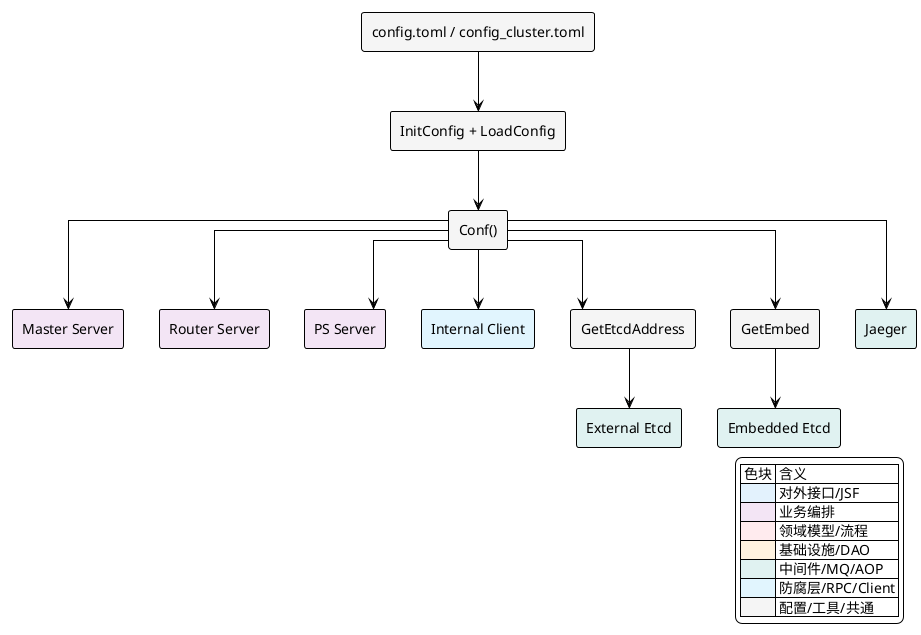
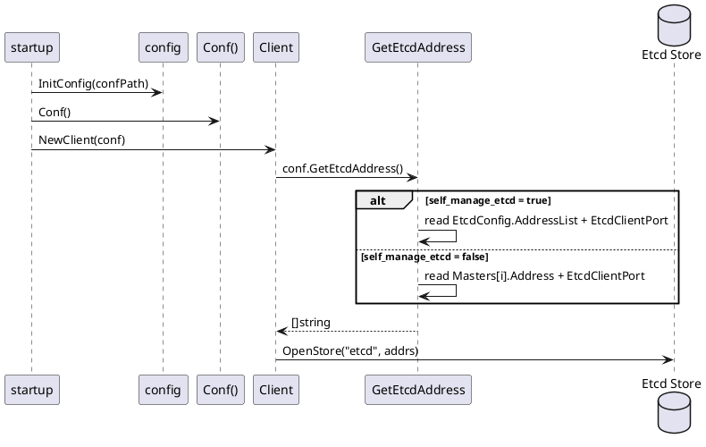

## 配置体系与运行参数

Vearch 的配置体系以单个 `Config` 对象为中心展开。这个对象在进程启动时由 TOML 文件反序列化生成，随后被 `Master`、`Router`、`PartitionServer` 以及内部客户端共享使用。配置并不是简单的静态参数集合，它还承担了运行期地址计算、目录选择、当前节点身份识别、内嵌 `etcd` 启动参数生成等职责。

从代码形态上看，配置入口集中在 `internal/config/config.go`，而 `config/config.toml` 与 `config/config_cluster.toml` 提供了两种典型部署样例：单 `master` 示例和多 `master` 集群示例。运行时主流程遵循 `LoadConfig -> Conf() -> GetEtcdAddress()/GetEmbed() -> 组件使用` 这条链路，配置先被加载成全局单例，再被不同组件按需解释为连接地址、监听端口、日志目录、数据目录、并发度、超时值与监控参数。

### 单例配置对象与装载入口

配置对象定义为 `Config` 结构体，包含 `Global`、`EtcdConfig`、`TracerCfg`、`Masters`、`Router`、`PS` 六个一级分段。它们分别对应集群通用参数、`etcd` 访问参数、链路追踪参数、`master` 成员列表、路由节点参数和分片节点参数。整个进程只保留一个配置实例，由包级变量 `single` 持有，并通过 `Conf()` 暴露给其他模块。

这种组织方式带来的直接运行效果是：无论组件处于启动阶段还是服务阶段，读取配置都通过同一入口完成。例如 `Router` 读取 `config.Conf().Router.Port`，`PS` 读取 `config.Conf().PS.RaftReplicatePort`，内部客户端读取 `conf.GetEtcdAddress()`，都围绕同一棵配置树工作。

核心初始化逻辑很短，但它决定了配置体系的装载边界：

[internal/config/config.go:399-422]()
```go
func InitConfig(path string) {
	single = &Config{
		mu: new(sync.RWMutex),
		Global: &GlobalCfg{
			ResourceLimitRate: entity.DefaultResourceLimitRate,
		},
		PS: &PSCfg{
			ReplicaAutoRecoverTime: -1,
		},
	}
	LoadConfig(single, path)
}

func LoadConfig(conf *Config, path string) {
	if len(path) == 0 {
		log.Error("load config path is empty")
		os.Exit(-1)
	}
	if _, err := toml.DecodeFile(path, conf); err != nil {
		log.Error("decode:[%s] failed, err:[%s]", path, err.Error())
		os.Exit(-1)
	}
	conf.Global.Path = path
}
```

这里有两个实现细节值得注意。

第一，配置并不是“纯覆盖式”初始化。`InitConfig()` 在解析 TOML 前，已经为 `Global.ResourceLimitRate` 和 `PS.ReplicaAutoRecoverTime` 设置了默认值。这意味着如果配置文件中省略这些字段，运行时仍然有可用值。

第二，配置文件路径会回写到 `conf.Global.Path`。这个字段随后被 `DumpConfig()` 使用，使配置对象具备“从文件载入后再写回同一文件”的能力。

在启动主程序中，配置初始化发生在最前面，之后所有组件都通过 `Conf()` 读取它：

[cmd/vearch/startup.go:87-105]()
```go
func main() {
	config.SetConfigVersion(BuildVersion, BuildTime, CommitID)

	flag.Parse()

	if confPath == "" {
		log.Error("can not get the config file, then exit the program!")
		os.Exit(1)
	}

	config.InitConfig(confPath)

	if config.Conf().Global.ResourceName == "" {
		config.Conf().Global.ResourceName = DefaultResourceName
	}

	if config.Conf().TracerCfg != nil {
		closer := initJaeger(config.Conf().Global.Name, config.Conf().TracerCfg)
		defer closer.Close()
	}
```

这段流程说明配置对象不仅提供原始参数，还在启动期承接补全动作。`Global.ResourceName` 为空时会被补成 `default`，`TracerCfg` 不为空时立即初始化 Jaeger。

<details>
<summary>关联代码</summary>

[internal/config/config.go:85-93](),[internal/config/config.go:399-439](),[cmd/vearch/startup.go:87-105]()

</details>

### 配置分层与字段职责

`Config` 下每个一级分段都对应一个明确的运行面向。它们不是按文件划分，而是按进程共享程度与组件职责划分。

| 分段 | 结构体 | 主要内容 | 直接影响的运行行为 |
|---|---|---|---|
| `global` | `GlobalCfg` | 集群名、资源组、鉴权开关、日志目录、数据目录、资源阈值、是否自管理 `etcd` | 所有组件共享的基础运行环境 |
| `etcd` | `EtcdCfg` | 外部 `etcd` 地址、客户端端口、用户名密码 | 内部客户端连接元数据存储 |
| `masters` | `Masters` / `MasterCfg` | `master` 成员地址、HTTP 端口、内嵌 `etcd` 端口、监控端口 | `master` 自身身份识别与集群元信息注册 |
| `router` | `RouterCfg` | HTTP 端口、RPC 端口、并发数、超时、CORS、监控端口 | 路由层接入行为与内部 RPC 行为 |
| `ps` | `PSCfg` | Raft 端口、心跳超时、日志截断、刷盘阈值、并发数、监控端口 | 分区副本复制、存储刷盘、节点注册与恢复 |
| `tracer` | `TracerCfg` | Jaeger 地址、采样类型、采样率 | 分布式链路追踪初始化 |

配置结构定义如下：

[internal/config/config.go:85-92]()
```go
type Config struct {
	Global     *GlobalCfg `toml:"global,omitempty" json:"global"`
	EtcdConfig *EtcdCfg   `toml:"etcd,omitempty" json:"etcd"`
	TracerCfg  *TracerCfg `toml:"tracer,omitempty" json:"tracer"`
	Masters    Masters    `toml:"masters,omitempty" json:"masters"`
	Router     *RouterCfg `toml:"router,omitempty" json:"router"`
	PS         *PSCfg     `toml:"ps,omitempty" json:"ps"`
	mu         *sync.RWMutex
}
```

其中 `GlobalCfg` 是最外层公共配置，它继承了 `Base`，将日志与数据路径统一放到所有角色共享的基础层中：

[internal/config/config.go:187-209]()
```go
type Base struct {
	Log         string   `toml:"log,omitempty" json:"log"`
	Level       string   `toml:"level,omitempty" json:"level"`
	LogFileNum  int      `toml:"log_file_num,omitempty" json:"log_file_num"`
	LogFileSize int      `toml:"log_file_size,omitempty" json:"log_file_size"`
	Data        []string `toml:"data,omitempty" json:"data"`
}

type GlobalCfg struct {
	Base
	Name              string  `toml:"name,omitempty" json:"name"`
	ResourceName      string  `toml:"resource_name,omitempty" json:"resource_name"`
	Signkey           string  `toml:"signkey,omitempty" json:"signkey"`
	SkipAuth          bool    `toml:"skip_auth,omitempty" json:"skip_auth"`
	SelfManageEtcd    bool    `toml:"self_manage_etcd,omitempty" json:"self_manage_etcd"`
	AutoRecoverPs     bool    `toml:"auto_recover_ps,omitempty" json:"auto_recover_ps"`
	SupportEtcdAuth   bool    `toml:"support_etcd_auth,omitempty" json:"support_etcd_auth"`
	RaftConsistent    bool    `toml:"raft_consistent,omitempty" json:"raft_consistent"`
	LimitedDBNum      bool    `toml:"limited_db_num,omitempty" json:"limited_db_num"`
	LimitedReplicaNum bool    `toml:"limited_replica_num,omitempty" json:"limited_replica_num"`
	ResourceLimitRate float64 `toml:"resource_limit_rate,omitempty" json:"resource_limit_rate"`
	Path              string  `toml:"path,omitempty" json:"path"`
}
```

这里的字段与运行过程是直接绑定的。`Global.Name` 会变成集群前缀，参与 `etcd` 键空间和监控指标标签；`Global.ResourceName` 会参与资源过滤；`Global.SkipAuth` 会影响 `Master` 与 `Router` HTTP 接口是否绕过鉴权；`Global.ResourceLimitRate` 会在 `PS` 写入和恢复路径上用于资源耗尽检查；`Global.SelfManageEtcd` 则决定元数据存储是连外部 `etcd`，还是由 `master` 进程内嵌启动。

样例配置文件也围绕这些一级分段展开。以单节点样例为例：

[config/config.toml:1-35]()
```toml
[global]
    name = "vearch"
    resource_name = "default"
    data = ["datas/","datas1/"]
    log = "logs/"
    level = "debug"
    signkey = "secret"
    skip_auth = false
    self_manage_etcd = false
    auto_recover_ps = true
    support_etcd_auth = false
    raft_consistent = false
    resource_limit_rate = 0.85

[etcd]
    address = ["x.x.x.x"]
    etcd_client_port = 2379
    user_name = "root"
    password = ""
```

而多 `master` 样例则扩展了多个 `[[masters]]` 项，显式列出每个成员的地址和端口：

[config/config_cluster.toml:38-102]()
```toml
[[masters]]
    name = "m1"
    address = "vearch-master1"
    api_port = 8817
    etcd_port = 2378
    etcd_peer_port = 2390
    etcd_client_port = 2370
    cluster_state = "new"
    pprof_port = 6062
    monitor_port = 8828

[[masters]]
    name = "m2"
    address = "vearch-master2"
    api_port = 8817
    etcd_port = 2378
    etcd_peer_port = 2390
    etcd_client_port = 2370
    cluster_state = "new"
    pprof_port = 6062
    monitor_port = 8828
```

<details>
<summary>关联代码</summary>

[internal/config/config.go:187-255](),[config/config.toml:1-88](),[config/config_cluster.toml:1-133]()

</details>

### 启动链路中的配置传播

配置在启动过程中不是被一次性“消费”，而是逐层传播到不同组件。主程序在解析命令行后，根据 `master`、`ps`、`router` 标签决定启动哪些角色；每个角色启动前都会从同一配置对象中提取自己的运行参数。

这个传播关系可以用一张组件图表示：



在实际代码中，`Master`、`PS`、`Router` 的启动前检查都围绕 `Conf()` 展开：

[cmd/vearch/startup.go:161-255]()
```go
if tags[masterTag] || tags[allTag] {
	if err := config.Conf().CurrentByMasterNameDomainIp(masterName); err != nil {
		log.Error("CurrentByMasterNameDomainIp master error: %v", err)
		os.Exit(1)
	}

	if err := config.Conf().Validate(config.Master); err != nil {
		log.Error("validate master error: %v", err)
		os.Exit(1)
	}
    ...
}

if tags[psTag] || tags[allTag] {
	if err := config.Conf().Validate(config.PS); err != nil {
		log.Error("validate ps error: %v", err)
		os.Exit(1)
	}
    ...
}

if tags[routerTag] || tags[allTag] {
	if err := config.Conf().Validate(config.Router); err != nil {
		log.Error("validate router error: %v", err)
		os.Exit(1)
	}
    ...
}
```

这里的传播顺序很清晰。`master` 启动前需要先完成“当前机器对应哪一个 `master` 配置项”的识别，然后验证路径；`ps` 和 `router` 只需要做路径准备。这样一来，配置对象除了提供静态值，还会在启动期被补充出运行身份状态，即 `Masters` 列表里哪个成员 `Self = true`。

<details>
<summary>关联代码</summary>

[cmd/vearch/startup.go:155-255](),[internal/config/config.go:42-44](),[internal/config/config.go:442-525]()

</details>

### `etcd` 地址解析：外部 `etcd` 与内嵌 `etcd` 的分流

Vearch 对 `etcd` 的处理分成两条路径，分流条件完全由 `Global.SelfManageEtcd` 控制。这个布尔值会影响两件事：内部客户端连接谁，以及 `Master` 是否在本进程内启动嵌入式 `etcd`。

地址解析逻辑集中在 `GetEtcdAddress()`：

[internal/config/config.go:95-121]()
```go
func (con *Config) GetEtcdAddress() []string {
	// depend manageEtcd config
	if con.Global.SelfManageEtcd {
		// provide etcd config ,address and port
		if len(con.EtcdConfig.AddressList) > 0 && con.EtcdConfig.EtcdClientPort > 0 {
			addrs := make([]string, len(con.EtcdConfig.AddressList))
			for i, s := range con.EtcdConfig.AddressList {
				addrs[i] = s + ":" + cast.ToString(con.EtcdConfig.EtcdClientPort)
				log.Info("outside etcd address is %s", addrs[i])
			}
			return addrs
		} else {
			log.Error("the etcd config is error!")
			return nil
		}
	} else {
		// manage etcd by vearch
		ms := con.GetMasters()
		addrs := make([]string, len(ms))
		for i, m := range ms {
			addrs[i] = m.Address + ":" + cast.ToString(ms[i].EtcdClientPort)
			log.Info("vearch etcd address is %s", addrs[i])
		}
		return addrs
	}
}
```

这里的行为非常具体。

当 `Global.SelfManageEtcd = true` 时，返回值来自 `[etcd]` 段，也就是外部 `etcd` 集群的地址列表加统一客户端端口。

当 `Global.SelfManageEtcd = false` 时，返回值来自 `[[masters]]`，即把每个 `master` 的 `Address` 与自己的 `EtcdClientPort` 拼成连接地址。这意味着 Vearch 把 `master` 成员同时视为 `etcd` 成员，内部客户端以 `masters` 列表作为元数据存储入口。

内部客户端初始化时直接消费这个地址列表：

[internal/client/client.go:74-81]()
```go
func (client *Client) initMasterClient(conf *config.Config) error {
	etcdStore, err := store.OpenStore("etcd", conf.GetEtcdAddress())
	if err != nil {
		return err
	}

	client.master = &masterClient{client: client, Store: etcdStore, cfg: conf}
	return nil
}
```

因此，从启动结果看，`GetEtcdAddress()` 实际上是“配置到元数据访问入口”的解释器。它把不同部署方式收敛成统一的 `[]string`，使 `client.NewClient()` 无需关心 `etcd` 来自外部还是来自 `master` 进程内嵌。

下面这张时序图能更直观地表示这条链路：



<details>
<summary>关联代码</summary>

[internal/config/config.go:95-121](),[internal/client/client.go:74-81](),[internal/master/store/etcdstore.go:76-80]()

</details>

### 内嵌 `etcd` 配置生成机制

当 `Global.SelfManageEtcd = false` 时，`Master` 在启动过程中不会连接外部 `etcd`，而是先根据自身配置动态构造一个 `embed.Config`，再启动内嵌 `etcd` 服务器。这个构造动作发生在 `GetEmbed()`。

[internal/master/server.go:53-68]()
```go
var server *Server
// manage etcd by yourself
if config.Conf().Global.SelfManageEtcd {
	server = &Server{ctx: ctx}
} else {
	// manage etcd by vearch
	cfg, err := config.Conf().GetEmbed()
	if err != nil {
		return nil, err
	}
	if err := os.MkdirAll(cfg.Dir, os.ModePerm); err != nil {
		return nil, err
	}
	server = &Server{etcCfg: cfg, ctx: ctx}
}
```

`GetEmbed()` 的核心任务不是简单字段拷贝，而是把 `masters` 列表、当前节点身份、数据目录和历史重启痕迹组合成完整的嵌入式 `etcd` 启动参数。它至少完成了四层解释。

第一层是定位当前节点。`config.Masters.Self()` 返回当前进程所对应的 `MasterCfg`，没有它就无法确定本机监听地址、成员名与端口。

第二层是推导集群状态。函数会检查 `${dataDir}/${clusterName}_${masterName}_restart` 文件是否存在，存在则使用 `existing`，不存在则从 `masterCfg.ClusterState` 读取；如果配置值不合法，就回退到 `new`。

第三层是组装 `InitialCluster`。它遍历整个 `config.Masters`，把每个成员转成 `name=http://address:peerPort` 的格式，用逗号拼接为 `etcd` 初始成员列表。

第四层是区分 IP 与域名模式。若 `masterCfg.Address` 是域名，则监听地址使用 `x.x.x.x:port`，对外广播地址使用真实域名；若是 IP，则监听和广播都使用该 IP。这保证了域名部署下可以绑定任意网卡，同时保留正确的成员广播地址。

核心代码如下：

[internal/config/config.go:265-350]()
```go
func (config *Config) GetEmbed() (*embed.Config, error) {
	masterCfg := config.Masters.Self()

	if masterCfg == nil {
		return nil, vearchpb.NewError(vearchpb.ErrorEnum_CONFIG_ERROR, fmt.Errorf("not found master config"))
	}

	cfg := embed.NewConfig()
	cfg.Name = masterCfg.Name
	cfg.Dir = config.GetDataDir()
	cfg.WalDir = ""

	filePath := cfg.Dir + "/" + config.Global.Name + "_" + masterCfg.Name + "_" + entity.RESTART
	_, err := os.Stat(filePath)
	if err == nil {
		cfg.ClusterState = embed.ClusterStateFlagExisting
	} else if os.IsNotExist(err) {
		if masterCfg.ClusterState == "" {
			cfg.ClusterState = embed.ClusterStateFlagNew
		} else {
			if !strings.EqualFold(masterCfg.ClusterState, embed.ClusterStateFlagNew) && !strings.EqualFold(masterCfg.ClusterState, embed.ClusterStateFlagExisting) {
				cfg.ClusterState = embed.ClusterStateFlagNew
			} else {
				cfg.ClusterState = masterCfg.ClusterState
			}
		}
	}

	cfg.EnablePprof = false
	cfg.StrictReconfigCheck = true
	cfg.TickMs = uint(100)
	cfg.ElectionMs = uint(3000)
	cfg.AutoCompactionMode = "periodic"
	cfg.AutoCompactionRetention = "1"
	cfg.MaxRequestBytes = 33554432
	cfg.QuotaBackendBytes = 8589934592
	cfg.LogOutputs = []string{config.GetLogDir() + "/MASTER.ETCD.log"}
	cfg.LogLevel = "warn"
	cfg.EnableLogRotation = true

	buf := bytes.Buffer{}
	for _, m := range config.Masters {
		if buf.Len() > 0 {
			buf.WriteString(",")
		}
		buf.WriteString(fmt.Sprintf("%s=http://%s:%d", m.Name, m.Address, masterCfg.EtcdPeerPort))
	}
	cfg.InitialCluster = buf.String()
    ...
	return cfg, nil
}
```

其中 `InitialCluster` 这一段有一个实现特点：它对每个成员使用的是当前 `masterCfg.EtcdPeerPort`，而不是循环变量 `m.EtcdPeerPort`。在默认样例中所有 `master` 的 `etcd_peer_port` 相同，所以生成结果保持一致；实际运行时这个函数按“同集群统一端口”的方式解释 `peer` 通道。

真正启动时，`Master` 会等待 `etcd` 就绪，然后再创建自己的业务客户端和服务：

[internal/master/server.go:86-105]()
```go
if !config.Conf().Global.SelfManageEtcd {
	s.etcdServer, err = embed.StartEtcd(s.etcCfg)
	if err != nil {
		log.Error(err.Error())
		return err
	}
	defer s.etcdServer.Close()
	select {
	case <-s.etcdServer.Server.ReadyNotify():
		log.Info("Server is ready!")
	case <-time.After(60 * time.Second):
		s.etcdServer.Server.Stop()
		log.Error("Server took too long to start!")
		return vearchpb.NewError(vearchpb.ErrorEnum_INTERNAL_ERROR, fmt.Errorf("etcd start timeout"))
	}
}

s.client, err = client.NewClient(config.Conf())
```

运行顺序因此变成：先由配置生成内嵌 `etcd` 参数，再启动 `etcd`，再由统一客户端使用 `GetEtcdAddress()` 连回去访问它。

<details>
<summary>关联代码</summary>

[internal/config/config.go:265-350](),[internal/master/server.go:53-68](),[internal/master/server.go:86-105]()

</details>

### 当前 `master` 身份识别与配置校验

`masters` 在 TOML 中是一个列表，但每个 `master` 进程必须知道自己对应其中哪一项。Vearch 并不是在配置文件中要求显式写一个 `self = true`，而是在启动时通过 `CurrentByMasterNameDomainIp()` 动态推断并回填 `Self` 字段。

这个过程先收集本机所有网卡 IP，然后遍历 `config.Masters`。如果是外部 `etcd` 模式，则直接把命中的 `master` 标记为 `Self`；如果是内嵌 `etcd` 模式，则按以下规则判定当前节点：

| 判定来源 | 处理方式 |
|---|---|
| 启动参数 `-master` 指定的名称与 `m.Name` 相同 | 直接标记 `m.Self = true` |
| `m.Address` 是 IP 且出现在本机地址表中 | 标记 `m.Self = true` |
| `m.Address` 是域名且解析出的 IP 出现在本机地址表中 | 标记 `m.Self = true` |

核心逻辑如下：

[internal/config/config.go:444-487]()
```go
func (config *Config) CurrentByMasterNameDomainIp(masterName string) error {
	addrMap := config.addrMap()

	var found bool

	for _, m := range config.Masters {
		if config.Global.SelfManageEtcd {
			m.Self = true
			found = true
			return nil
		}
		var domainIP *net.IPAddr
		match, _ := regexp.MatchString(`^[0-9]+\.[0-9]+\.[0-9]+\.[0-9]+/[0-9]+$`, m.Address)
		if !match {
			tempIP, err := net.ResolveIPAddr("ip", m.Address)
			if err != nil {
				log.Errorf("address [%s] has err: %v", m.Address, err)
				return err
			}
			domainIP = tempIP
		}
		if m.Name == masterName {
			m.Self = true
			found = true
		} else if addrMap[m.Address] || (domainIP != nil && addrMap[domainIP.String()]) {
			m.Self = true
			found = true
		}
		if found {
			return nil
		}
	}

	return errors.New("None of the masters has the same ip address as current local master server's ip")
}
```

完成身份识别后，`Validate()` 继续做启动前校验。对于 `Master` 模式，代码只检查一件事：同一台机器不能匹配到多个 `master` 配置项。然后统一调用 `validatePath()` 创建日志目录与数据目录。

[internal/config/config.go:509-535]()
```go
func (config *Config) Validate(model Model) error {
	switch model {
	case Master:
		masterNum := 0
		for _, m := range config.Masters {
			if m.Self {
				masterNum++
			}
		}

		if masterNum > 1 {
			return vearchpb.NewError(vearchpb.ErrorEnum_CONFIG_ERROR, fmt.Errorf("two masters on one machine"))
		}
	}

	return config.validatePath()
}

func (config *Config) validatePath() error {
	if err := os.MkdirAll(config.GetLogDir(), os.ModePerm); err != nil {
		return err
	}
	if err := os.MkdirAll(config.GetDataDir(), os.ModePerm); err != nil {
		return err
	}

	return nil
}
```

从运行结果看，配置校验并不负责逐字段约束，而是负责两类最直接的启动前条件：当前节点身份唯一，以及日志、数据目录可创建。

<details>
<summary>关联代码</summary>

[internal/config/config.go:444-507](),[internal/config/config.go:509-535](),[cmd/vearch/startup.go:161-171]()

</details>

### 运行参数如何驱动 `Router` 与 `PS`

配置体系的另一层价值，是把 `Router` 与 `PS` 的运行行为压缩成少量可解释字段。`RouterCfg` 与 `PSCfg` 都不是“声明式元数据”，而是直接参与并发控制、超时设定、端口绑定和副本复制。

先看 `RouterCfg`：

[internal/config/config.go:353-375]()
```go
type RouterCfg struct {
	Port          uint16   `toml:"port,omitempty" json:"port"`
	PprofPort     uint16   `toml:"pprof_port,omitempty" json:"pprof_port"`
	RpcPort       uint16   `toml:"rpc_port,omitempty" json:"rpc_port"`
	MonitorPort   uint16   `toml:"monitor_port" json:"monitor_port"`
	ConnLimit     int      `toml:"conn_limit" json:"conn_limit"`
	CloseTimeout  int64    `toml:"close_timeout" json:"close_timeout"`
	RouterIPS     []string `toml:"router_ips" json:"router_ips"`
	ConcurrentNum int      `toml:"concurrent_num" json:"concurrent_num"`
	RpcTimeOut    int      `toml:"rpc_timeout" json:"rpc_timeout"` // ms
	AllowOrigins  []string `toml:"allow_origins" json:"allow_origins"`
}
```

这些参数在 `Router` 启动时被直接使用。`AllowOrigins` 决定跨域白名单，`RpcPort` 决定是否附加启动 gRPC/RPC 监听，`MonitorPort` 决定监控服务是否开放，`Port` 决定 HTTP 服务绑定地址。

[internal/router/server.go:81-93]()
```go
if len(config.Conf().Router.AllowOrigins) > 0 {
	corsConfig.AllowOrigins = config.Conf().Router.AllowOrigins
}

if config.Conf().Router.RpcPort > 0 {
	lis, err := net.Listen("tcp", fmt.Sprintf("%s:%d", addr, config.Conf().Router.RpcPort))
```

[internal/router/server.go:135-139]()
```go
if port := config.Conf().Router.MonitorPort; port > 0 {
	monitor.Register(nil, nil, config.Conf().Router.MonitorPort)
}
if err := server.httpServer.Run(cast.ToString(fmt.Sprintf("x.x.x.x:%d", config.Conf().Router.Port))); err != nil {
```

同时，`Router.RpcTimeOut` 和 `Router.ConcurrentNum` 会继续影响文档服务请求路径与 RPC 客户端并发能力：

[internal/router/document/doc_service.go:43-44]()
```go
if config.Conf().Router.RpcTimeOut > 0 {
	timeout = int64(config.Conf().Router.RpcTimeOut)
}
```

[internal/pkg/server/rpc/rpc_client.go:64-65]()
```go
if config.Conf().Router.ConcurrentNum > 0 {
	r.concurrentNum = config.Conf().Router.ConcurrentNum
}
```

再看 `PSCfg`。它覆盖了 `PS` 节点的网络面、Raft 面和存储面参数：

[internal/config/config.go:377-397]()
```go
type PSCfg struct {
	RpcPort                     uint16 `toml:"rpc_port,omitempty" json:"rpc_port"`
	PsHeartbeatTimeout          int    `toml:"ps_heartbeat_timeout" json:"ps_heartbeat_timeout"`
	RaftHeartbeatPort           uint16 `toml:"raft_heartbeat_port,omitempty" json:"raft_heartbeat_port"`
	RaftReplicatePort           uint16 `toml:"raft_replicate_port,omitempty" json:"raft_replicate_port"`
	RaftHeartbeatInterval       int    `toml:"heartbeat_interval" json:"heartbeat-interval"`
	RaftRetainLogs              uint64 `toml:"raft_retain_logs" json:"raft-retain-logs"`
	RaftReplicaConcurrency      int    `toml:"raft_replica_concurrency" json:"raft-replica-concurrency"`
	RaftSnapConcurrency         int    `toml:"raft_snap_concurrency" json:"raft-snap-concurrency"`
	RaftTruncateCount           int64  `toml:"raft_truncate_count" json:"raft_truncate_count"`
	RaftDiffCount               uint64 `toml:"raft_diff_count" json:"raft_diff_count"`
	ReplicaAutoRecoverTime      int64  `toml:"replica_auto_recover_time" json:"replica_auto_recover_time"`
	ReplicaAntiAffinityStrategy int    `toml:"replica_anti_affinity_strategy" json:"replica_anti_affinity_strategy"`
	PprofPort                   uint16 `toml:"pprof_port" json:"pprof_port"`
	Private                     bool   `toml:"private" json:"private"`
	FlushTimeInterval           uint32 `toml:"flush_time_interval" json:"flush_time_interval"`
	FlushCountThreshold         uint32 `toml:"flush_count_threshold" json:"flush_count_threshold"`
	ConcurrentNum               int    `toml:"concurrent_num" json:"concurrent_num"`
	RpcTimeOut                  int    `toml:"rpc_timeout" json:"rpc_timeout"`
	MonitorPort                 uint16 `toml:"monitor_port" json:"monitor_port"`
}
```

这些字段在 `PS` 中有四种典型落点：

| 参数类别 | 典型字段 | 使用位置 | 运行效果 |
|---|---|---|---|
| RPC 服务 | `RpcPort`、`ConcurrentNum`、`RpcTimeOut` | `internal/ps/server.go` | 决定 PS 对外 RPC 服务能力 |
| Raft 网络 | `RaftHeartbeatPort`、`RaftReplicatePort` | `internal/ps/storage/raftstore/server.go` | 决定副本心跳与日志复制地址 |
| Raft 调优 | `RaftHeartbeatInterval`、`RaftRetainLogs`、`RaftReplicaConcurrency`、`RaftSnapConcurrency` | `internal/ps/storage/raftstore/server.go` | 决定副本复制调度行为 |
| 刷盘与恢复 | `FlushTimeInterval`、`FlushCountThreshold`、`RaftTruncateCount`、`ReplicaAutoRecoverTime` | `store_raft_job.go`、`master_cache.go` | 决定日志截断、刷盘与副本恢复节奏 |

例如 `PS` 服务启动时，配置直接被映射到服务对象字段：

[internal/ps/server.go:90-110]()
```go
if config.Conf().PS.ConcurrentNum > 0 {
	s.concurrentNum = config.Conf().PS.ConcurrentNum
}
if config.Conf().PS.RpcTimeOut > 0 {
	s.rpcTimeOut = config.Conf().PS.RpcTimeOut
}
s.rpcServer = rpc.NewRpcServer(config.LocalCastAddr, config.Conf().PS.RpcPort)
if port := config.Conf().PS.MonitorPort; port > 0 {
	monitor.Register(nil, nil, config.Conf().PS.MonitorPort)
}
```

而 Raft 服务初始化则从同一配置对象中提取副本层参数：

[internal/ps/storage/raftstore/server.go:35-49]()
```go
rc.HeartbeatAddr = fmt.Sprintf(ip + ":" + cast.ToString(config.Conf().PS.RaftHeartbeatPort))
rc.ReplicateAddr = fmt.Sprintf(ip + ":" + cast.ToString(config.Conf().PS.RaftReplicatePort))

if config.Conf().PS.RaftReplicaConcurrency > 0 {
	rc.MaxReplConcurrency = config.Conf().PS.RaftReplicaConcurrency
}
if config.Conf().PS.RaftSnapConcurrency > 0 {
	rc.MaxSnapConcurrency = config.Conf().PS.RaftSnapConcurrency
}
if config.Conf().PS.RaftHeartbeatInterval > 0 {
	rc.TickInterval = time.Millisecond * time.Duration(config.Conf().PS.RaftHeartbeatInterval)
}
if config.Conf().PS.RaftRetainLogs > 0 {
	rc.RetainLogs = config.Conf().PS.RaftRetainLogs
}
```

这说明 `PSCfg` 并不是“可选增强”，而是分区副本系统的基础运行面。

<details>
<summary>关联代码</summary>

[internal/config/config.go:353-397](),[internal/router/server.go:81-93](),[internal/router/server.go:135-139](),[internal/router/document/doc_service.go:43-44](),[internal/pkg/server/rpc/rpc_client.go:64-65](),[internal/ps/server.go:90-110](),[internal/ps/storage/raftstore/server.go:35-49]()

</details>

### 日志、路径、追踪与资源阈值的统一入口

配置体系还承担了一组横切能力，它们不属于某个单独角色，却会被多个模块同时消费。

日志与数据目录由 `Global.Base` 统一承载。访问方法非常直接：

[internal/config/config.go:123-152]()
```go
func (c *Config) GetLogDir() string {
	return c.Global.Log
}

func (c *Config) GetLevel() string {
	return c.Global.Level
}

func (c *Config) GetDataDir() string {
	return c.Global.Data[0]
}

func (c *Config) GetDataDirBySlot(model Model, pid uint32) string {
	s := c.Global.Data
	index := int(pid) % len(s)
	return s[index]
}
```

这里的 `GetDataDirBySlot()` 不是简单返回第一个目录，而是按分区 `pid` 对数据目录列表取模分配路径。这样一来，在配置文件中写入多个数据目录时，`PS` 可以按分区号把不同分片均摊到不同磁盘目录。

这一点已经在存储路径分配中使用：

[internal/ps/storage/raftstore/store.go:71-71]()
```go
path := config.Conf().GetDataDirBySlot(config.PS, pID)
```

而日志目录则被多个子系统复用，包括 `Gamma` 引擎日志和 `PS.RAFT` 日志：

[internal/ps/storage/raftstore/store.go:171-171]()
```go
raftLog, err := rlog.NewLog(config.Conf().GetLogDir(), "PS.RAFT", vearchlog.DebugLogType)
```

[internal/ps/engine/gammacb/gamma.go:80-80]()
```go
LogDir:    config.Conf().GetLogDir(),
```

链路追踪的入口则来自 `TracerCfg`。只要 TOML 中配置了 `[tracer]` 段，启动时就会初始化 Jaeger 全局 Tracer：

[internal/config/config.go:218-222]()
```go
type TracerCfg struct {
	Host        string  `toml:"host,omitempty" json:"host"`
	SampleType  string  `toml:"sample_type,omitempty" json:"sample_type"`
	SampleParam float64 `toml:"sample_param,omitempty" json:"sample_param"`
}
```

[cmd/vearch/startup.go:65-84]()
```go
func initJaeger(service string, c *config.TracerCfg) io.Closer {
	cfg := &jaegerConfig.Configuration{
		ServiceName: service,
		Sampler: &jaegerConfig.SamplerConfig{
			Type:  c.SampleType,
			Param: c.SampleParam,
		},
		Reporter: &jaegerConfig.ReporterConfig{
			LocalAgentHostPort:         c.Host,
			LogSpans:                   false,
			DisableAttemptReconnecting: false,
			AttemptReconnectInterval:   1 * time.Minute,
		},
	}
	closer, err := cfg.InitGlobalTracer(service, jaegerConfig.Logger(jaeger.StdLogger))
```

资源阈值同样属于横切参数。`Global.ResourceLimitRate` 被 `PS` 写路径和管理路径重复使用，用于判断磁盘资源是否接近耗尽：

[internal/ps/storage/raftstore/store_writer.go:90-90]()
```go
s.Partition.ResourceExhausted, err = entity.CheckResource(s.RaftPath, config.Conf().Global.ResourceLimitRate)
```

[internal/ps/partition_service.go:143-143]()
```go
if resourceExhausted, err := entity.CheckResource(store.RaftPath, config.Conf().Global.ResourceLimitRate); err != nil {
```

因此，`global` 段中的字段虽然集中在一起，但它们并不是只作用于启动阶段，而是持续参与运行时调度、存储、监控与安全控制。

<details>
<summary>关联代码</summary>

[internal/config/config.go:123-152](),[internal/config/config.go:218-222](),[cmd/vearch/startup.go:65-84](),[internal/ps/storage/raftstore/store.go:71-71](),[internal/ps/storage/raftstore/store.go:171-171](),[internal/ps/engine/gammacb/gamma.go:80-80](),[internal/ps/storage/raftstore/store_writer.go:90-90](),[internal/ps/partition_service.go:143-143]()

</details>

### 配置样例中的部署语义

`config/config.toml` 与 `config/config_cluster.toml` 体现了同一配置模型在两种运行场景下的差异。它们并没有引入新的字段集合，而是通过字段组合表达不同部署方式。

| 配置文件 | `masters` 数量 | `address` 形态 | 典型场景 |
|---|---:|---|---|
| `config/config.toml` | 1 | IP 示例 `x.x.x.x` | 单 `master` 或本地实验配置 |
| `config/config_cluster.toml` | 3 | 域名示例 `vearch-master1` 等 | 多 `master` 集群部署 |

单节点配置中的 `masters` 片段如下：

[config/config.toml:37-58]()
```toml
[[masters]]
    name = "m1"
    address = "x.x.x.x"
    api_port = 8817
    etcd_port = 2378
    etcd_peer_port = 2390
    etcd_client_port = 2370
    cluster_state = "new"
    pprof_port = 6062
    monitor_port = 8818
```

多节点配置中的三个 `master` 则保持相同端口模板，仅替换名称与地址：

[config/config_cluster.toml:38-102]()
```toml
[[masters]]
    name = "m1"
    address = "vearch-master1"
    api_port = 8817
    etcd_port = 2378
    etcd_peer_port = 2390
    etcd_client_port = 2370
    cluster_state = "new"
    pprof_port = 6062
    monitor_port = 8828

[[masters]]
    name = "m2"
    address = "vearch-master2"
    ...
```

这种样例与 `GetEmbed()` 的逻辑是对应的。域名配置会触发“监听用 `x.x.x.x`，广播用域名地址”的处理，而多 `master` 列表会被拼成 `InitialCluster`。

`router` 与 `ps` 段则是角色级参数模板。样例虽然没有展开所有结构体字段，但已经覆盖最常用端口与关键复制参数：

[config/config.toml:60-88]()
```toml
[router]
    port = 9001
    pprof_port = 6061
    plugin_path = "plugin"
    allow_origins = ["http://google.com"]

[ps]
    rpc_port = 8081
    ps_heartbeat_timeout = 5
    raft_heartbeat_port = 8898
    raft_replicate_port = 8899
    heartbeat-interval = 200
    raft_retain_logs = 20000000
    raft_replica_concurrency = 1
    raft_snap_concurrency = 1
    raft_truncate_count = 500000
    raft_diff_count = 10000
    replica_auto_recover_time = 1800
    pprof_port = 6060
    private = false
    flush_time_interval = 600
    flush_count_threshold = 200000
```

可以看到，配置样例本身已经把“接入参数”和“副本参数”放在同一文件中，这也是单进程配置对象统一管理多角色运行面的直接体现。

<details>
<summary>关联代码</summary>

[config/config.toml:37-88](),[config/config_cluster.toml:38-133](),[internal/config/config.go:244-397]()

</details>