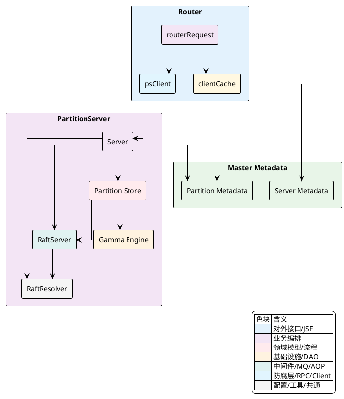
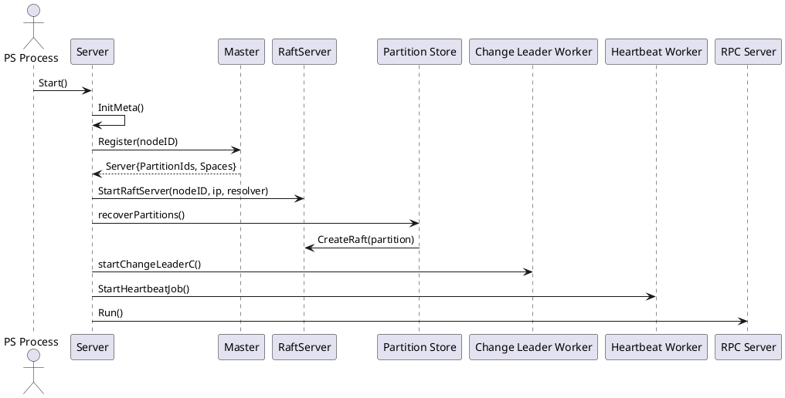
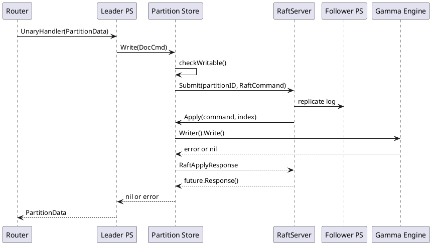
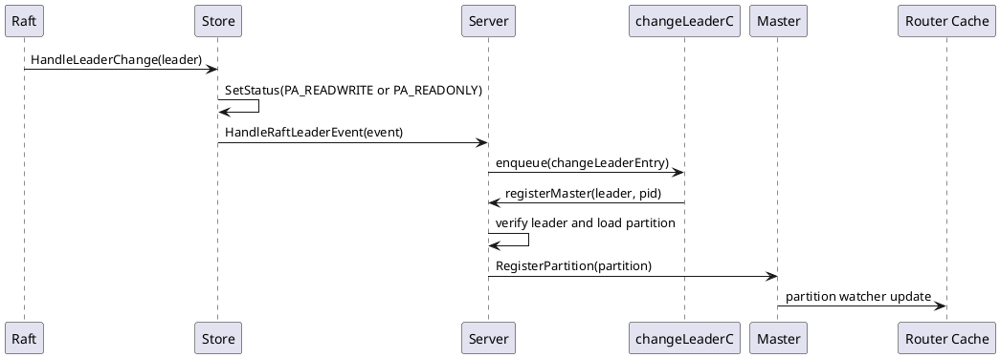
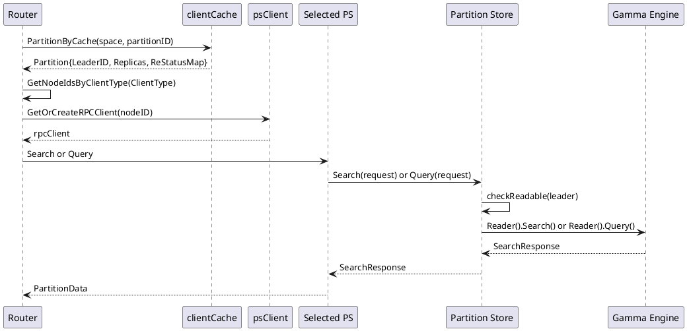

## 一致性与复制机制

### 复制边界：分区副本由 PS 内部 Raft 驱动，Master 保存可路由元数据

Vearch 的一致性边界落在 **PartitionServer 的单个分区副本组** 上。每个分区对应一个独立的 `raft` 实例，副本成员来自 `entity.Partition.Replicas`，写入、空间结构变更、刷盘等会被包装成 `vearchpb.RaftCommand` 提交到该分区的 Raft 日志；日志提交后，`Store` 作为 Raft 状态机将命令应用到 Gamma 引擎或分区元数据。

Master 不参与分区内的日志复制。它保存的是可路由的集群元数据，包括分区的 `LeaderID`、`Replicas`、`ReStatusMap` 等。PS 在 Leader 发生变化或副本追赶状态变化后，把最新分区状态通过 `RegisterPartition` 回写 Master。Router 侧通过 `clientCache` 监听 Master 元数据变化，并在请求路径中读取分区缓存，从而定位 Leader 或可用副本。

| 组件 | 一致性相关职责 | 关键数据 |
| --- | --- | --- |
| `Server` | 启动 RaftServer、恢复本地分区、接收 Raft 事件、向 Master 注册分区状态 | `nodeID`、`partitions`、`changeLeaderC`、`replicasStatusC` |
| `raftstore.Store` | 每个分区的 Raft 状态机，负责提交写命令、应用日志、处理 Leader 变化和成员变化 | `Partition`、`RaftServer`、`RaftPath`、`RsStatusMap` |
| `RaftResolver` | 将 `NodeID` 解析为 Raft 心跳地址和复制地址 | `heartbeatAddr`、`replicateAddr`、`rpcAddr` |
| Master 元数据 | 保存分区 Leader、Replica 列表和副本同步状态，供 Router 缓存和路由使用 | `LeaderID`、`Replicas`、`ReStatusMap` |
| Router Client | 读取分区缓存，写入优先访问 Leader，查询按 `ClientType` 选择副本并进行失败回退 | `PartitionByCache`、`GetNodeIdsByClientType`、`faultyList` |



`Server` 的字段已经把这个闭环表达得很直接：`raftServer` 是节点级 Raft 服务，`partitions` 保存本节点承载的分区状态机，`changeLeaderC` 和 `replicasStatusC` 是 Raft 事件通向 Master 元数据的异步通道。

[internal/ps/server.go:50-73]()
```go
type Server struct {
	mu                       sync.RWMutex
	nodeID                   entity.NodeID // server id
	ip                       string
	partitions               sync.Map
	raftResolver             *raftstore.RaftResolver
	raftServer               *raft.RaftServer
	rpcServer                *rpc.RpcServer
	client                   *client.Client
	ctx                      context.Context
	ctxCancel                context.CancelFunc
	stopping                 bool
	wg                       sync.WaitGroup
	changeLeaderC            chan *changeLeaderEntry
	replicasStatusC          chan *raftstore.ReplicasStatusEntry
	read_request_concurrent  chan bool
	write_request_concurrent chan bool
	slow_search_concurrent   chan bool
	concurrentNum            int
	rpcTimeOut               int
	backupStatus             map[uint32]int
	backupManager            BackupManager
}
```

<details>
<summary>关联代码</summary>

[internal/ps/server.go:50-73](),[internal/ps/storage/raftstore/store.go:49-67](),[internal/ps/storage/raftstore/server.go:55-76](),[internal/client/master_cache.go:56-62]()

</details>

### PS 启动与分区恢复：从 `StartRaftServer` 到 `recoverPartitions`

PS 启动时先向 Master 注册当前节点并获取该节点应该承载的分区列表，随后启动节点级 `raft.RaftServer`，再按 Master 返回的 `PartitionIds` 和 `Spaces` 恢复本地分区。恢复完成后，PS 启动两个与一致性元数据相关的后台任务：`startChangeLeaderC` 负责消费 Leader 变化和副本状态变化事件，`StartHeartbeatJob` 负责节点心跳。此后 RPC 服务才开始对外提供分区读写能力。



启动顺序的核心代码集中在 `Server.Start`。其中 `psutil.InitMeta` 负责初始化或读取节点身份，`register` 通过 Master 获取当前节点的分区分配，`raftstore.StartRaftServer` 构造节点级 Raft 服务，`recoverPartitions` 将本地分区逐个绑定到这个 RaftServer。

[internal/ps/server.go:123-176]()
```go
func (s *Server) Start() error {
	s.stopping = false

	// load meta data
	nodeId := psutil.InitMeta(s.client, config.Conf().Global.Name, config.Conf().GetDataDir())
	s.nodeID = nodeId

	// load local partitions
	server := s.register()
	s.ip = server.Ip
	mserver.SetIp(server.Ip, true)

	// create raft server
	retryTime := 0
	s.raftServer, err = raftstore.StartRaftServer(nodeId, s.ip, s.raftResolver)
	for err != nil {
		log.Error("ps StartRaftServer error: %v", err)
		if retryTime > maxTryTime {
			log.Panic("ps StartRaftServer error: %v", err)
		}
		time.Sleep(5 * time.Second)
		retryTime++
		s.raftServer, err = raftstore.StartRaftServer(nodeId, s.ip, s.raftResolver)
	}

	// create and recover partitions
	s.recoverPartitions(server.PartitionIds, server.Spaces)

	// start change leader job
	s.startChangeLeaderC()

	// start heartbeat job
	s.StartHeartbeatJob()

	// start rpc server
	if err = s.rpcServer.Run(); err != nil {
		log.Panic(fmt.Sprintf("ps rpcServer run error: %v", err))
	}

	ExportToRpcHandler(s)
	ExportToRpcAdminHandler(s)

	log.Info("ps server successfully started...")
	s.wg.Wait()
	return nil
}
```

`recoverPartitions` 并行调用 `LoadPartition`，每个分区恢复时会创建 `raftstore.Store`、补齐副本节点的 Raft 地址解析信息、启动分区 Raft 实例，然后将 `Store` 放入 `Server.partitions`。这里的 `RsStatusC = s.replicasStatusC` 是副本追赶状态从分区状态机回传到 `Server` 的通道连接点。

[internal/ps/partition_service.go:121-151]()
```go
store, err := raftstore.CreateStore(ctx, pid, s.nodeID, space, s.raftServer, s, s.client)
if err != nil {
	return nil, err
}

// partition status chan
store.RsStatusC = s.replicasStatusC
replicas := store.GetPartition().Replicas
for _, replica := range replicas {
	if server, err := s.client.Master().QueryServer(context.Background(), replica); err != nil {
		log.Error("partition recovery get server info err: %s", err.Error())
		s.raftResolver.AddNode(replica, &entity.Replica{NodeID: replica})
	} else {
		s.raftResolver.AddNode(replica, server.Replica())
	}
}

if err := store.Start(); err != nil {
	return nil, err
}

s.partitions.Store(pid, store)
```

<details>
<summary>关联代码</summary>

[internal/ps/server.go:123-180](),[internal/ps/server.go:228-248](),[internal/ps/partition_service.go:102-151](),[internal/ps/partition_service.go:275-298]()

</details>

### RaftServer 与 `RaftResolver`：节点级通信地址和分区级 Raft 实例

Vearch 的 PS 节点只有一个 `raft.RaftServer`，不同分区在这个 RaftServer 上创建不同的 `raft.RaftConfig`。节点级 `RaftServer` 负责心跳、复制和 Raft 内部网络通信；分区级 `Store` 负责提供状态机、WAL 存储和应用逻辑。`RaftResolver` 连接这两层，它根据 `NodeID` 返回心跳地址或复制地址，使 Raft 层能够与分区副本所在的 PS 节点通信。

`StartRaftServer` 使用当前 PS 的 `nodeId` 和 `ip` 生成 Raft 节点配置。它设置了 `HeartbeatAddr`、`ReplicateAddr`、`Resolver`、`TickInterval`，并从配置中读取复制并发、快照并发、心跳间隔和保留日志数量。

[internal/ps/storage/raftstore/server.go:31-52]()
```go
func StartRaftServer(nodeId entity.NodeID, ip string, resolver raft.SocketResolver) (*raft.RaftServer, error) {
	rc := raft.DefaultConfig()
	rc.NodeID = uint64(nodeId)
	rc.LeaseCheck = true
	rc.HeartbeatAddr = fmt.Sprintf(ip + ":" + cast.ToString(config.Conf().PS.RaftHeartbeatPort))
	rc.ReplicateAddr = fmt.Sprintf(ip + ":" + cast.ToString(config.Conf().PS.RaftReplicatePort))
	rc.Resolver = resolver
	rc.TickInterval = 500 * time.Millisecond
	if config.Conf().PS.RaftReplicaConcurrency > 0 {
		rc.MaxReplConcurrency = config.Conf().PS.RaftReplicaConcurrency
	}
	if config.Conf().PS.RaftSnapConcurrency > 0 {
		rc.MaxSnapConcurrency = config.Conf().PS.RaftSnapConcurrency
	}
	if config.Conf().PS.RaftHeartbeatInterval > 0 {
		rc.TickInterval = time.Millisecond * time.Duration(config.Conf().PS.RaftHeartbeatInterval)
	}
	if config.Conf().PS.RaftRetainLogs > 0 {
		rc.RetainLogs = config.Conf().PS.RaftRetainLogs
	}

	return raft.NewRaftServer(rc)
}
```

`RaftResolver` 中保存的是副本节点的网络地址。`NodeAddress` 根据 Raft 请求的 socket 类型返回心跳或复制地址，因此 PS 在加载分区和处理成员变更时都会把副本对应的 `entity.Replica` 写入 Resolver。

[internal/ps/storage/raftstore/server.go:97-109]()
```go
func (r *RaftResolver) AddNode(id entity.NodeID, replica *entity.Replica) {
	ref := new(nodeRef)
	ref.heartbeatAddr = replica.HeartbeatAddr
	ref.replicateAddr = replica.ReplicateAddr
	ref.rpcAddr = replica.RpcAddr
	obj, _ := r.nodes.LoadOrStore(id, ref)
	log.Debug("RaftResolver AddNode(), nodeId: [%d], nodeRef:[%v], obj:[%v]", id, ref, obj)
	r.nodes.Range(func(key, value any) bool {
		log.Debug("r.nodes, key: [%v], value: [%v]", key, value)
		return true
	})
	atomic.AddInt32(&(obj.(*nodeRef).refCount), 1)
}
```

[internal/ps/storage/raftstore/server.go:165-180]()
```go
func (r *RaftResolver) NodeAddress(nodeID uint64, stype raft.SocketType) (string, error) {
	node := r.GetNode(entity.NodeID(nodeID))
	if node == nil {
		return "", vearchpb.NewError(vearchpb.ErrorEnum_PARAM_ERROR, fmt.Errorf("cannot get node network information, nodeID=[%d]", nodeID))
	}

	switch stype {
	case raft.HeartBeat:
		return node.heartbeatAddr, nil
	case raft.Replicate:
		return node.replicateAddr, nil
	default:
		return "", vearchpb.NewError(vearchpb.ErrorEnum_PARAM_ERROR, fmt.Errorf("unknown socket type[%v]", stype))
	}
}
```

分区启动时，`Store.Start` 构造 `raft.RaftConfig`。`ID` 使用分区 `Partition.Id`，`Applied` 来自引擎已持久化的序列号，`Peers` 来自分区副本列表，`Storage` 使用分区自己的 WAL 目录，`StateMachine` 指向当前 `Store`。当副本列表的第一个节点等于当前节点时，启动配置会给出初始 `Leader`。

[internal/ps/storage/raftstore/store.go:123-187]()
```go
func (s *Store) Start() (err error) {
	s.Engine, err = gammacb.Build(gammacb.EngineConfig{
		Path:        s.DataPath,
		Space:       s.Space,
		PartitionID: s.Partition.Id,
	})
	if err != nil {
		return err
	}
	apply, err := s.Engine.Reader().ReadSN(s.Ctx)
	if err != nil {
		s.Engine.Close()
		return err
	}
	s.LastFlushSn = apply
	s.LastFlushTime = time.Now()

	s.Partition.SetStatus(entity.PA_READONLY)

	raftStore, err := wal.NewStorage(s.RaftPath, nil)
	if err != nil {
		s.Engine.Close()
		return vearchpb.NewError(vearchpb.ErrorEnum_INTERNAL_ERROR, fmt.Errorf("start partition[%d] open raft store engine error: %s", s.Partition.Id, err.Error()))
	}

	partition := s.Space.GetPartition(s.Partition.Id)
	if partition == nil {
		return vearchpb.NewError(vearchpb.ErrorEnum_PARAM_ERROR, fmt.Errorf("can not found partition by id:[%d]", s.Partition.Id))
	}

	raftConf := &raft.RaftConfig{
		ID:           uint64(s.Partition.Id),
		Applied:      uint64(apply),
		Peers:        make([]proto.Peer, 0, len(partition.Replicas)),
		Storage:      raftStore,
		StateMachine: s,
	}

	if s.Partition.Replicas[0] == s.NodeID {
		raftConf.Leader = s.NodeID
	}

	for _, repl := range partition.Replicas {
		peer := proto.Peer{Type: proto.PeerNormal, ID: uint64(repl)}
		raftConf.Peers = append(raftConf.Peers, peer)
	}

	if err = s.RaftServer.CreateRaft(raftConf); err != nil {
		s.Engine.Close()
		return vearchpb.NewError(vearchpb.ErrorEnum_INTERNAL_ERROR, fmt.Errorf("start partition[%d] create raft error: %s", s.Partition.Id, err))
	}

	s.startFlushJob()
	s.startTruncateJob(apply)

	return nil
}
```

<details>
<summary>关联代码</summary>

[internal/ps/storage/raftstore/server.go:31-52](),[internal/ps/storage/raftstore/server.go:85-180](),[internal/ps/storage/raftstore/store.go:69-95](),[internal/ps/storage/raftstore/store.go:123-187]()

</details>

### 写入一致性：写命令经 Raft 提交后再应用到引擎

写入路径由 `Store.Write` 控制。进入写入前，`checkWritable` 会检查当前分区状态，只有 `PA_READWRITE` 可以写入；Leader 变更时只有 Leader 会被置为 `PA_READWRITE`，Follower 保持 `PA_READONLY`。写入请求被封装为 `vearchpb.RaftCommand{Type: CmdType_WRITE}`，序列化后通过 `RaftServer.Submit` 提交到对应分区的 Raft 实例。`Submit` 返回的 `future.Response` 表示命令完成状态，`RaftApplyResponse.Err` 承载状态机应用阶段的错误。



[internal/ps/storage/raftstore/store_writer.go:77-114]()
```go
func (s *Store) Write(ctx context.Context, request *vearchpb.DocCmd) (err error) {
	if err = s.checkWritable(); err != nil {
		return err
	}

	if request.Type == vearchpb.OpType_BULK {
		if s.Partition.ResourceExhausted {
			err = vearchpb.NewError(vearchpb.ErrorEnum_PARTITION_RESOURCE_EXHAUSTED, fmt.Errorf("partition %d resource exhausted", s.Partition.Id))
			return err
		}
		s.Partition.AddNum += int64(len(request.Docs))
		if s.Partition.AddNum >= 50000 {
			s.Partition.AddNum = 0
			s.Partition.ResourceExhausted, err = entity.CheckResource(s.RaftPath, config.Conf().Global.ResourceLimitRate)
			if s.Partition.ResourceExhausted {
				return err
			}
		}
	}

	raftCmd := &vearchpb.RaftCommand{
		Type:         vearchpb.CmdType_WRITE,
		WriteCommand: request,
	}

	data, err := json.Marshal(raftCmd)
	if err != nil {
		return err
	}

	// sumbit raft
	err = s.RaftSubmit(data)
	if err != nil {
		return err
	}

	return nil
}
```

[internal/ps/storage/raftstore/store_writer.go:116-127]()
```go
func (s *Store) RaftSubmit(data []byte) (err error) {
	future := s.RaftServer.Submit(uint64(s.Partition.Id), data)
	resp, err := future.Response()
	if err != nil {
		return err
	}
	if resp.(*RaftApplyResponse).Err != nil {
		return resp.(*RaftApplyResponse).Err
	}
	return nil
}
```

Raft 状态机的应用入口是 `Store.Apply`。它先反序列化 `vearchpb.RaftCommand`，再委托 `innerApply` 执行具体命令。`CmdType_WRITE` 最终落到 `Engine.Writer().Write`，`CmdType_UPDATESPACE` 更新引擎 mapping 和分区元数据，`CmdType_FLUSH` 触发 `Engine.Writer().Commit`。每次应用完成后，`Sn` 被更新为当前 Raft 日志索引。

[internal/ps/storage/raftstore/raft_state_machine.go:91-144]()
```go
func (s *Store) Apply(command []byte, index uint64) (resp any, err error) {
	raftCmd := &vearchpb.RaftCommand{}

	if err = json.Unmarshal(command, raftCmd); err != nil {
		log.Error(err)
		return nil, err
	}

	resp = s.innerApply(index, raftCmd)
	if config.Conf().Global.RaftConsistent {
		if s.IsLeader() && s.ReplicasStatusChange() {
			partitionStatus := &ReplicasStatusEntry{
				NodeID:      s.NodeID,
				PartitionID: s.Partition.Id,
				ReStatusMap: *copySyncMap(&s.RsStatusMap),
			}
			s.RsStatusC <- partitionStatus
		}
	}
	return resp, nil
}

func (s *Store) innerApply(index uint64, raftCmd *vearchpb.RaftCommand) any {
	resp := new(RaftApplyResponse)
	switch raftCmd.Type {
	case vearchpb.CmdType_WRITE:
		resp.Err = s.Engine.Writer().Write(s.Ctx, raftCmd.WriteCommand)
	case vearchpb.CmdType_UPDATESPACE:
		resp = s.updateSchemaBySpace(raftCmd.UpdateSpace.Space)
	case vearchpb.CmdType_FLUSH:
		flushC, err := s.Engine.Writer().Commit(s.Ctx, int64(index))
		resp.FlushC = flushC
		resp.Err = err
	default:
		log.Error("unsupported command[%s]", raftCmd.Type)
		resp.SetErr(fmt.Errorf("unsupported command[%s]", raftCmd.Type))
	}

	s.Sn = int64(index)

	return resp
}
```

`checkWritable` 是 Leader 写入约束在 PS 内部的直接体现。Follower 收到写请求时，因为状态不是 `PA_READWRITE`，会返回 `PARTITION_NOT_LEADER`。

[internal/ps/storage/raftstore/store_writer.go:166-183]()
```go
func (s *Store) checkWritable() error {
	switch s.Partition.GetStatus() {
	case entity.PA_INVALID:
		return vearchpb.NewError(vearchpb.ErrorEnum_PARTITION_IS_INVALID, nil)
	case entity.PA_CLOSED:
		return vearchpb.NewError(vearchpb.ErrorEnum_PARTITION_IS_CLOSED, nil)
	case entity.PA_READONLY:
		return vearchpb.NewError(vearchpb.ErrorEnum_PARTITION_NOT_LEADER, nil)
	case entity.PA_READWRITE:
		return nil
	default:
		return vearchpb.NewError(vearchpb.ErrorEnum_INTERNAL_ERROR, nil)
	}
}
```

<details>
<summary>关联代码</summary>

[internal/ps/storage/raftstore/store_writer.go:28-183](),[internal/ps/storage/raftstore/raft_state_machine.go:91-144](),[internal/ps/storage/raftstore/store.go:236-256]()

</details>

### Leader 变更上报：Raft 事件进入 `changeLeaderC` 后注册 Master

Leader 变化发生在分区 Raft 状态机层。`Store.HandleLeaderChange` 是 Raft 回调入口：当新的 Leader 是当前节点时，分区状态被设置为 `PA_READWRITE`，并通过 `EventListener.HandleRaftLeaderEvent` 向 `Server` 发出 Leader 变更事件；当新的 Leader 不是当前节点时，本地分区状态被设置为 `PA_READONLY`。

[internal/ps/storage/raftstore/raft_state_machine.go:217-229]()
```go
func (s *Store) HandleLeaderChange(leader uint64) {
	s.Lock()
	defer s.Unlock()

	log.Info("partition[%d] node[%d] change leader to [%d]", s.Partition.Id, s.NodeID, leader)
	if leader == uint64(s.NodeID) {
		s.Partition.SetStatus(entity.PA_READWRITE)
		s.EventListener.HandleRaftLeaderEvent(&RaftLeaderEvent{PartitionId: s.Partition.Id, Leader: leader})
	} else {
		s.Partition.SetStatus(entity.PA_READONLY)
	}
}
```

`Server.HandleRaftLeaderEvent` 把 Raft 事件转成 `changeLeaderEntry` 写入 `changeLeaderC`。`startChangeLeaderC` 是这个事件的消费者，它从 `changeLeaderC` 读取 Leader 变化，从 `replicasStatusC` 读取副本追赶状态变化。Leader 变化最终进入 `registerMaster`，副本状态变化进入 `changeReplicas`。



[internal/ps/server.go:204-226]()
```go
func (s *Server) startChangeLeaderC() {
	go func() {
		defer func() {
			if rErr := recover(); rErr != nil {
				log.Error("recover() err: [%v]", rErr)
				log.Error("stack: [%s]", debug.Stack())
			}
		}()
		for {
			select {
			case <-s.ctx.Done():
				log.Info("startChangeLeaderC() closed")
				return
			case entry := <-s.changeLeaderC:
				log.Info("startChangeLeaderC() received a change leader event, nodeId: %d, partitionId: %d", entry.leader, entry.pid)
				s.registerMaster(entry.leader, entry.pid)
			case pStatus := <-s.replicasStatusC:
				log.Info("received a change leader status, nodeId: %d, partitionId: %d", pStatus.NodeID, pStatus.PartitionID)
				s.changeReplicas(pStatus)
			}
		}
	}()
}
```

`registerMaster` 只允许当前 Leader 上报分区。它先比较事件中的 `leader` 和本节点 `nodeID`，再从本地 `partitions` 中取出 `PartitionStore`，并通过 `raftServer.IsLeader` 再次确认当前节点仍是该分区 Leader。确认通过后，`partition.LeaderID` 被更新为本节点，随后调用 Master 的 `RegisterPartition` 写入元数据。

[internal/ps/server.go:302-334]()
```go
func (s *Server) HandleRaftLeaderEvent(event *raftstore.RaftLeaderEvent) {
	s.changeLeaderC <- &changeLeaderEntry{
		leader: event.Leader,
		pid:    event.PartitionId,
	}
}

// register master partition
func (s *Server) registerMaster(leader entity.NodeID, pid entity.PartitionID) {
	if leader != s.nodeID { // only leader registers partition
		return
	}

	store, ok := s.partitions.Load(pid)

	if !ok {
		log.Error("partition not found by id: [%d]", pid)
		return
	}

	if !s.raftServer.IsLeader(uint64(pid)) {
		log.Debug("server %d is not leader of partition: [%d]", s.nodeID, pid)
		return
	}

	partition := store.(PartitionStore).GetPartition()
	partition.LeaderID = s.nodeID

	if err := s.client.Master().RegisterPartition(context.Background(), partition); err != nil {
		log.Error("register partition error: [%s]", err.Error())
	}
}
```

<details>
<summary>关联代码</summary>

[internal/ps/storage/raftstore/raft_state_machine.go:217-229](),[internal/ps/server.go:204-226](),[internal/ps/server.go:302-334](),[internal/ps/server.go:277-300]()

</details>

### 副本状态上报：`RaftConsistent` 下按日志追赶程度更新 `ReStatusMap`

当 `Global.RaftConsistent` 开启时，Leader 在应用 Raft 日志后会检查 Follower 的提交进度。`ReplicasStatusChange` 读取 `s.Status().Commit` 作为 Leader 侧提交进度，并遍历 `s.Status().Replicas` 中各副本的 `Commit`。如果某个副本与 Leader 的差距小于 `raftDiffCount`，或者该节点就是 Leader，则标记为 `entity.ReplicasOK`；否则标记为 `entity.ReplicasNotReady`。状态有变化时，Leader 将 `ReplicasStatusEntry` 写入 `RsStatusC`。

[internal/ps/storage/raftstore/raft_state_machine.go:40-89]()
```go
func (s *Store) ReplicasStatusChange() bool {
	statusChange := false
	// get leader
	leaderCommit := s.Status().Commit
	var currentStatus uint32
	for nodeID, rs := range s.Status().Replicas {
		if nodeID == s.Partition.LeaderID || leaderCommit-rs.Commit < s.raftDiffCount {
			currentStatus = entity.ReplicasOK
		} else {
			currentStatus = entity.ReplicasNotReady
		}
		pStatus, found := s.RsStatusMap.Load(nodeID)
		if found {
			if pStatus.(uint32) != currentStatus {
				if !statusChange {
					statusChange = true
				}
				s.RsStatusMap.Store(nodeID, currentStatus)
			}
		} else {
			if !statusChange {
				statusChange = true
			}
			s.RsStatusMap.Store(nodeID, currentStatus)
		}
	}
	s.RsStatusMap.Range(func(key, value interface{}) bool {
		nodeID := key.(uint64)
		if _, find := s.Status().Replicas[nodeID]; !find {
			s.RsStatusMap.Delete(key)
			if !statusChange {
				statusChange = true
			}
		}
		return true
	})
	return statusChange
}
```

`Server.changeReplicas` 消费 `replicasStatusC` 后，会把 `ReplicasStatusEntry.ReStatusMap` 合并进分区元数据的 `partition.ReStatusMap`，然后再次调用 `RegisterPartition`。Router 侧读取分区缓存时，就可以在副本选择逻辑中使用这个同步状态过滤落后副本。

[internal/ps/server.go:336-365]()
```go
func (s *Server) changeReplicas(pStatus *raftstore.ReplicasStatusEntry) {
	var err error
	errutil.CatchError(&err)

	log.Debug("received changeReplicas message, pStatus: [%+v]", pStatus)

	store, ok := s.partitions.Load(pStatus.PartitionID)

	if !ok {
		log.Error("partition not found by id: [%d]", pStatus.PartitionID)
		return
	}

	partition := store.(PartitionStore).GetPartition()

	// initialize ReStatusMap
	if partition.ReStatusMap == nil {
		partition.ReStatusMap = make(map[uint64]uint32)
	}

	pStatus.ReStatusMap.Range(func(key, value any) bool {
		partition.ReStatusMap[key.(uint64)] = value.(uint32)
		return true
	})

	if err := s.client.Master().RegisterPartition(context.Background(), partition); err != nil {
		log.Error("register partition error: [%s]", err.Error())
	}
}
```

Router 的副本选择函数 `GetNodeIdsByClientType` 在 `RaftConsistent` 开启时，会根据 `partition.ReStatusMap[nodeID] == entity.ReplicasOK` 过滤可读副本。`request.NotLeader` 还会排除 `partition.LeaderID`，`request.Random` 和默认策略会在健康副本之间轮询。

[internal/client/client.go:1349-1393]()
```go
func GetNodeIdsByClientType(clientType string, partition *entity.Partition, servers *cache.Cache, client *Client) entity.NodeID {
	nodeId := uint64(0)
	switch clientType {
	case request.Leader:
		nodeId = partition.LeaderID
	case request.NotLeader:
		noLeaderIDs := make([]entity.NodeID, 0)
		for _, nodeID := range partition.Replicas {
			_, serverExist := servers.Get(cast.ToString(nodeID))
			if !serverExist {
				continue
			}
			if client.PS().TestFaulty(nodeID) {
				continue
			}
			if config.Conf().Global.RaftConsistent {
				if partition.ReStatusMap[nodeID] == entity.ReplicasOK && nodeID != partition.LeaderID {
					noLeaderIDs = append(noLeaderIDs, nodeID)
				}
			} else {
				if nodeID != partition.LeaderID {
					noLeaderIDs = append(noLeaderIDs, nodeID)
				}
			}
		}
		nodeId = replicaRoundRobin.Next(partition.Id, noLeaderIDs)
	case request.Random, "":
		randIDs := make([]entity.NodeID, 0)
		for _, nodeID := range partition.Replicas {
			_, serverExist := servers.Get(cast.ToString(nodeID))
			if !serverExist {
				continue
			}
			if client.PS().TestFaulty(nodeID) {
				continue
			}
			if config.Conf().Global.RaftConsistent {
				if partition.ReStatusMap[nodeID] == entity.ReplicasOK {
					randIDs = append(randIDs, nodeID)
				}
			} else {
				randIDs = append(randIDs, nodeID)
			}
		}
		nodeId = replicaRoundRobin.Next(partition.Id, randIDs)
	}
	return nodeId
}
```

<details>
<summary>关联代码</summary>

[internal/ps/storage/raftstore/raft_state_machine.go:40-121](),[internal/ps/server.go:336-365](),[internal/client/client.go:1349-1494]()

</details>

### Router 写入容错：获取分区缓存后优先 Leader，失败再遍历副本

Router 写入入口使用 `routerRequest.Execute`。请求在 Router 侧先根据主键被分到不同分区，随后每个分区并发执行 RPC。每个分区发送前会通过 `Master().Cache().PartitionByCache` 获取分区元数据，并取 `partition.LeaderID` 作为首选写入节点。若首选 Leader RPC 失败，Router 会遍历 `partition.Replicas`，跳过 `nodeID == 0` 和 `faultyList` 中的节点，继续尝试可用副本。

这个回退并不改变 PS 内部写入约束。真正能写入的 PS 仍必须在分区本地处于 `PA_READWRITE`。当 Router 缓存的 `LeaderID` 尚未更新、或首选节点连接失败时，遍历副本可以让请求命中新 Leader；若命中的不是 Leader，PS 的 `checkWritable` 会返回 `PARTITION_NOT_LEADER`，请求继续按错误路径处理。

[internal/client/client.go:395-450]()
```go
partition, e := r.client.Master().Cache().PartitionByCache(ctx, r.space.Name, pid)
if e != nil {
	panic(e.Error())
}

nodeID := partition.LeaderID
err := r.client.PS().GetOrCreateRPCClient(ctx, nodeID).Execute(ctx, UnaryHandler, d, replyPartition)
if err != nil {
	for _, nodeID := range partition.Replicas {
		if nodeID == 0 {
			continue
		}
		if r.client.PS().TestFaulty(nodeID) {
			continue
		}
		replyPartition = new(vearchpb.PartitionData)
		err = r.client.PS().GetOrCreateRPCClient(ctx, nodeID).Execute(ctx, UnaryHandler, d, replyPartition)
		if err == nil {
			break
		}
	}
	if err != nil {
		d.Err = vearchpb.NewError(vearchpb.ErrorEnum_INTERNAL_ERROR, err).GetError()
		respChain <- d
	} else {
		d.Err = nil
		respChain <- replyPartition
	}
} else {
	respChain <- replyPartition
}
```

`PartitionByCache` 是 Router 感知 Leader 的元数据入口。它优先读本地 `partitionCache`，未命中时触发 `reloadPartitionCache` 从 Master 查询分区，再将结果放回缓存。Master 上的 `RegisterPartition` 更新会通过 watcher 更新缓存，Leader 变更和副本状态最终都会体现到 `partitionCache` 中。

[internal/client/master_cache.go:289-307]()
```go
func (cliCache *clientCache) PartitionByCache(ctx context.Context, spaceName string, pid entity.PartitionID) (*entity.Partition, error) {
	key := cachePartitionKey(spaceName, pid)
	get, found := cliCache.partitionCache.Get(key)
	if found {
		return get.(*entity.Partition), nil
	}

	_ = cliCache.reloadPartitionCache(ctx, false, spaceName, pid)

	for i := 0; i < retryNum; i++ {
		time.Sleep(retrySleepTime)
		log.Debug("to find partition by key:[%s] ", key)
		if get, found = cliCache.partitionCache.Get(key); found {
			return get.(*entity.Partition), nil
		}
	}

	return nil, vearchpb.NewError(vearchpb.ErrorEnum_PARAM_ERROR, fmt.Errorf("space:[%s] partition_id:[%d]", spaceName, pid))
}
```

RPC 客户端由 `psClient.GetOrCreateRPCClient` 维护。它使用 Master 的 `serverCache` 将 `nodeID` 转为 PS 的 `Ip:RpcPort`，并把创建好的 `rpcClient` 缓存在 `cliCache` 中。连接失败的节点可以被加入 `faultyList`，副本选择逻辑会跳过这些节点。

[internal/client/ps.go:102-148]()
```go
func (ps *psClient) GetOrCreateRPCClient(ctx context.Context, nodeID entity.NodeID) *rpcClient {
	value, ok := ps.Client().Master().cliCache.Load(nodeID)
	if ok {
		return value.(*rpcClient).lastUse()
	}

	ps.Client().Master().cliCache.lock.Lock()
	defer ps.Client().Master().cliCache.lock.Unlock()

	value, ok = ps.Client().Master().cliCache.Load(nodeID)
	if ok {
		return value.(*rpcClient).lastUse()
	}

	log.Info("psClient not in psClientCache, make new psClient, nodeID:[%d]", nodeID)
	psServer, err := ps.Client().Master().cliCache.ServerByCache(ctx, nodeID)
	if err != nil {
		log.Error("Master().ServerByCache() err, can not get ps server from master, err: %s", err.Error())
		return nilClient
	}

	client, err := server.NewRpcClient(psServer.Ip + ":" + cast.ToString(psServer.RpcPort))
	if err != nil {
		log.Error("server.NewRpcClient() err, can not new rpc Client, err: %s", err.Error())
		return nilClient
	}

	if client != nil {
		c := &rpcClient{client: client, useTime: time.Now().UnixNano()}
		ps.Client().Master().cliCache.Store(nodeID, c)
		return c.lastUse()
	}

	return nilClient
}

func (ps *psClient) AddFaulty(nodeID uint64, d time.Duration) {
	ps.faultyList.Set(fmt.Sprint(nodeID), nodeID, d)
}

func (ps *psClient) TestFaulty(nodeID uint64) bool {
	_, b := ps.faultyList.Get(fmt.Sprint(nodeID))
	return b
}
```

<details>
<summary>关联代码</summary>

[internal/client/client.go:374-480](),[internal/client/master_cache.go:289-344](),[internal/client/ps.go:102-148](),[internal/ps/storage/raftstore/store_writer.go:166-183]()

</details>

### Router 读取容错：按 `ClientType` 选择 Leader、Follower 或健康副本

查询路径同样先读取分区缓存，再根据请求头中的 `ClientType` 选择目标副本。`request.Leader` 强制访问 `partition.LeaderID`；`request.NotLeader` 会选择非 Leader 副本；`request.Random`、空字符串以及其他默认策略会在候选副本中轮询。候选集合会同时过滤 Master `serverCache` 中不存在的节点和 `faultyList` 中的节点；当 `RaftConsistent` 开启时，还会过滤 `ReStatusMap` 中非 `ReplicasOK` 的副本。



`SearchByPartition` 的核心逻辑体现了读取容错。Router 先获取 `partition`，再调用 `GetNodeIdsByClientType` 选择目标节点。若 RPC 失败且错误包含连接拒绝，目标节点会被临时加入 `faultyList`，随后重新选择节点并重试，最多尝试不超过副本数量。

[internal/client/client.go:526-680]()
```go
partition, e := r.client.Master().Cache().PartitionByCache(ctx, r.space.Name, partitionID)
if e != nil {
	err := &vearchpb.Error{Code: vearchpb.ErrorEnum_ROUTER_NO_PS_CLIENT, Msg: "query partition cache err partitionID:" + fmt.Sprint(partitionID)}
	pd.SearchResponse = &vearchpb.SearchResponse{Head: &vearchpb.ResponseHead{Err: err, RequestId: pd.MessageID}}
	responseDoc.PartitionData = pd
	respChain <- responseDoc
	return
}

clientType := pd.SearchRequest.Head.ClientType
serverCache := r.client.Master().Cache().serverCache

nodeID := GetNodeIdsByClientType(clientType, partition, serverCache, r.client)

faultyNodeNum := r.replicasFaultyNum(partition.Replicas)
retryTime := 0
var retry_err error
if len(partition.Replicas) <= faultyNodeNum || nodeID == 0 {
	msg := fmt.Sprintf("nodeID %v partitionID: %d is faulty, replica_num=%d, faultyNodeNum=%d", nodeID, partitionID, len(partition.Replicas), faultyNodeNum)
	log.Error(msg)
	retry_err = fmt.Errorf(msg)
}
for len(partition.Replicas) > faultyNodeNum && retryTime < len(partition.Replicas) {
	rpcClient := r.client.PS().GetOrCreateRPCClient(ctx, nodeID)
	if rpcClient == nil {
		err := &vearchpb.Error{Code: vearchpb.ErrorEnum_ROUTER_NO_PS_CLIENT, Msg: "no ps client by nodeID:" + fmt.Sprint(nodeID)}
		pd.SearchResponse = &vearchpb.SearchResponse{Head: &vearchpb.ResponseHead{Err: err}}
		responseDoc.PartitionData = pd
		respChain <- responseDoc
		return
	}

	if r.Err == nil {
		r.clientMap.Store(partitionID, nodeID)
		retry_err = rpcClient.Execute(ctx, UnaryHandler, pd, replyPartition)
		r.clientMap.Delete(partitionID)
	}
	if retry_err == nil || r.Err != nil {
		break
	}

	log.Error("nodeID %v partitionID: %d rpc err [%v], retryTime: %d, len(partition.Replicas)=%d, faultyNodeNum: %d", nodeID, partitionID, retry_err, retryTime, len(partition.Replicas), faultyNodeNum)
	if strings.Contains(retry_err.Error(), "connect: connection refused") {
		r.client.PS().AddFaulty(nodeID, time.Second*30)
	} else {
		break
	}
	nodeID = GetNodeIdsByClientType(clientType, partition, serverCache, r.client)

	faultyNodeNum = r.replicasFaultyNum(partition.Replicas)
	retryTime++
}
```

PS 侧读取允许读 Leader，也允许读 Follower，但当请求明确要求 Leader 时，会把 `readLeader` 置为 `true`。对于 `Search` 和 `Query`，这个判断来自 `request.Head.ClientType == "leader"`。如果请求要求 Leader 而当前分区不是 `PA_READWRITE`，`checkReadable` 会返回 `PARTITION_NOT_LEADER`。

[internal/ps/storage/raftstore/store_read.go:33-74]()
```go
func (s *Store) checkReadable(readLeader bool) error {
	status := s.Partition.GetStatus()

	if status == entity.PA_CLOSED {
		return vearchpb.NewError(vearchpb.ErrorEnum_PARTITION_IS_CLOSED, nil)
	}

	if status == entity.PA_INVALID {
		return vearchpb.NewError(vearchpb.ErrorEnum_PARTITION_IS_INVALID, nil)
	}

	if readLeader && status != entity.PA_READWRITE {
		log.Error("checkReadable status: %d , err: %v", status, vearchpb.NewError(vearchpb.ErrorEnum_PARTITION_NOT_LEADER, nil).Error())
		return vearchpb.NewError(vearchpb.ErrorEnum_PARTITION_NOT_LEADER, nil)
	}

	return nil
}

func (s *Store) Search(ctx context.Context, request *vearchpb.SearchRequest, response *vearchpb.SearchResponse) (err error) {
	leader := false
	if request.Head.ClientType == "leader" {
		leader = true
	}
	if err = s.checkReadable(leader); err != nil {
		return err
	}
	err = s.Engine.Reader().Search(ctx, request, response)
	return err
}

func (s *Store) Query(ctx context.Context, request *vearchpb.QueryRequest, response *vearchpb.SearchResponse) (err error) {
	leader := false
	if request.Head.ClientType == "leader" {
		leader = true
	}
	if err = s.checkReadable(leader); err != nil {
		return err
	}
	err = s.Engine.Reader().Query(ctx, request, response)
	return err
}
```

<details>
<summary>关联代码</summary>

[internal/client/client.go:520-700](),[internal/client/client.go:1349-1494](),[internal/client/ps.go:138-148](),[internal/ps/storage/raftstore/store_read.go:25-74]()

</details>