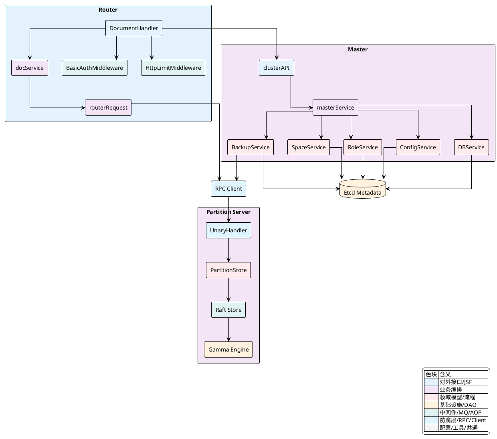
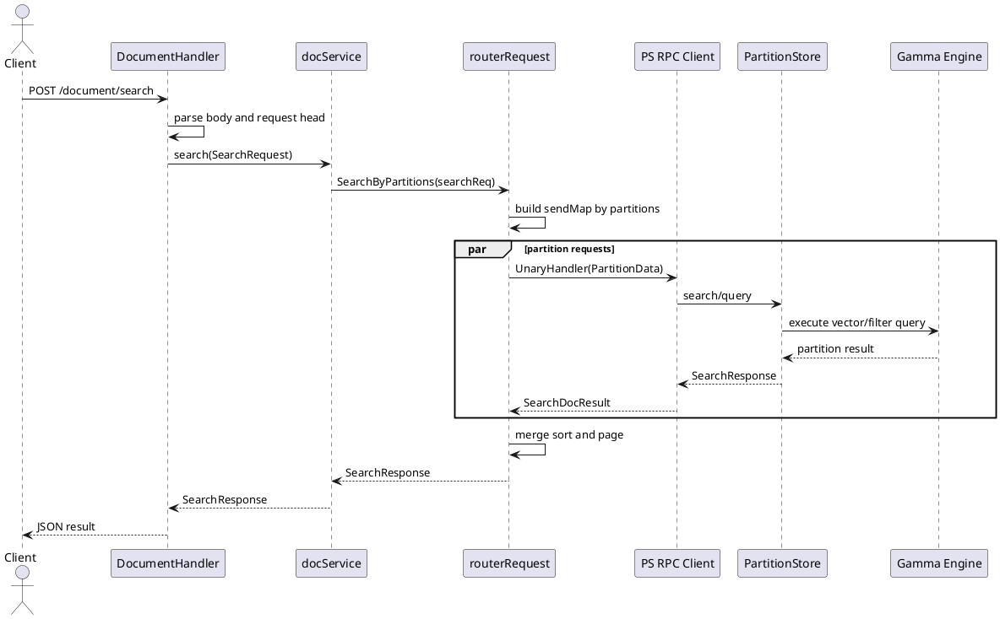
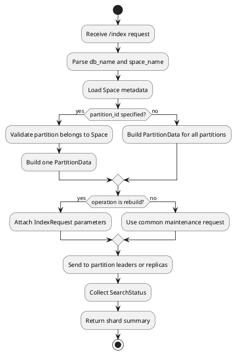
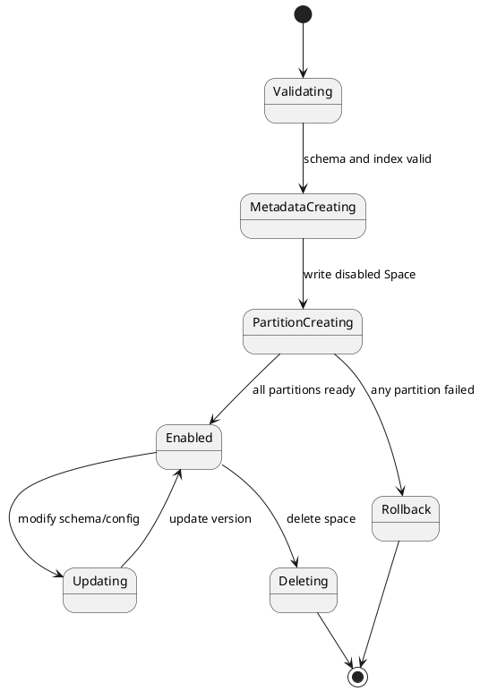
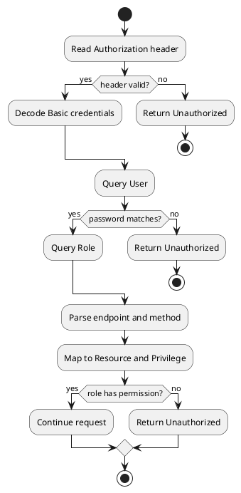
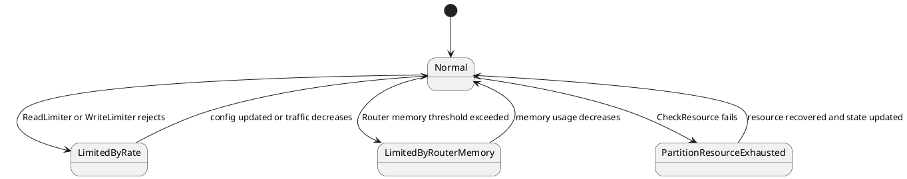

## 业务视图篇

Vearch 的业务入口以 `Router` 为主要外部访问面，文档写入、查询、搜索、索引维护先在 `Router` 层完成协议解析、鉴权、限流、元数据解析与分区路由，再通过内部 RPC 分发到各个 `Partition Server`。集群治理、`DB`、`Space`、`Alias`、用户角色、备份恢复等元数据类操作由 `Router` 代理到 `Master`，再由 `masterService` 下的领域服务写入 `Etcd` 元数据或向 `Partition Server` 下发运维指令。



### 文档生命周期与路由策略

文档主路径由 `DocumentHandler` 承担 HTTP 协议入口，由 `docService` 将请求转化为 `routerRequest`，再根据 `Space` 的分区信息构造分区级 `PartitionData`。写入类请求最终落到 `PartitionStore.Write`，检索类请求则并行访问多个分区并在 `Router` 汇总结果。

| 业务动作 | 外部入口 | Router 编排 | 分区选择 | PS 执行语义 |
| --- | --- | --- | --- | --- |
| 写入 | `POST /document/upsert` | `handleDocumentUpsert` 解析 `DocumentRequest`，填充 `BulkRequest`，调用 `docService.bulk` | `UpsertByPartitions` 按 `PartitionRule` 或 `_id` 哈希分桶 | `bulk` 序列化 `gamma.Doc`，调用 `PartitionStore.Write` |
| 按 ID 查询 | `POST /document/query` | `handleDocumentQuery` 在存在 `document_ids` 时进入 `getDocs` 或 `getDocsByPartition` | 未指定 `partition_id` 时按主键路由，指定时直接访问目标分区 | PS 返回命中文档字段 |
| 条件查询 | `POST /document/query` | `docService.query` 构造 `QueryByPartitions` | 指定 `partition_id` 或 `partition_names` 时缩小范围，否则广播到所有分区 | `QueryFieldSortExecute` 合并各分区结果 |
| 向量搜索 | `POST /document/search` | `docService.search` 构造 `SearchByPartitions` | 按 `partition_names` 过滤或广播到所有分区 | `SearchFieldSortExecute` 并发搜索并按分数归并 |

文档写入的生命周期以 `Space` 元数据为中心。`handleDocumentUpsert` 先从请求体取出 `dbName` 与 `spaceName`，再通过 `docService.getSpace` 解析真实 `Space`，其中别名会在读取元数据前被转换成目标 `Space` 名称。随后 `documentParse` 将用户文档转为 `vearchpb.Document`，`docService.bulk` 把文档交给 `routerRequest.UpsertByPartitions`。如果 `Space` 配置了 `PartitionRule`，写入必须携带分区规则字段，系统按范围分区定位候选分区，再对同一范围下的多个物理分区做哈希分散；如果没有分区规则，系统直接对文档主键 `PKey` 做 `murmur3` 哈希并映射到 `Space.PartitionId`。

[internal/router/document/doc_http.go:460-511]()
```go
func (handler *DocumentHandler) handleDocumentUpsert(c *gin.Context) {
	args := &vearchpb.BulkRequest{}
	args.Head, err = setRequestHeadFromGin(c)

	docRequest := &request.DocumentRequest{}
	err = c.ShouldBindJSON(docRequest)

	args.Head.DbName = docRequest.DbName
	args.Head.SpaceName = docRequest.SpaceName
	space, err := handler.docService.getSpace(c.Request.Context(), args.Head)

	err = documentParse(c.Request.Context(), handler, c.Request, docRequest, space, args)
	reply := handler.docService.bulk(c.Request.Context(), args)
	result, err := documentUpsertResponse(reply)
	httpCode = response.New(c).JsonSuccess(result)
}
```

[internal/client/client.go:277-341]()
```go
func (r *routerRequest) UpsertByPartitions(partitions []uint32) *routerRequest {
	partitionID := uint32(0)
	dataMap := make(map[entity.PartitionID]*vearchpb.PartitionData)

	if r.space.PartitionRule != nil {
		for _, doc := range r.docs {
			found := false
			for _, field := range doc.Fields {
				if field.Name == r.space.PartitionRule.Field {
					found = true
					pids, err := r.space.PartitionIdsByRangeField(field.Value, field.Type)
					if err != nil {
						r.Err = err
						return r
					}
					if len(pids) == 1 {
						partitionID = pids[0]
					} else {
						hash_index := murmur3.Sum32WithSeed([]byte(doc.PKey), 0) % uint32(len(pids))
						partitionID = pids[hash_index]
					}
					break
				}
			}
			if !found {
				r.Err = vearchpb.NewError(vearchpb.ErrorEnum_PARAM_ERROR, fmt.Errorf("document must have partition rule field"))
				return r
			}
			item := &vearchpb.Item{Doc: doc}
			if d, ok := dataMap[partitionID]; ok {
				d.Items = append(d.Items, item)
			} else {
				items := make([]*vearchpb.Item, 0)
				d = &vearchpb.PartitionData{PartitionID: partitionID, MessageID: r.GetMsgID(), Items: items}
				dataMap[partitionID] = d
				d.Items = append(d.Items, item)
			}
		}
	} else {
		for _, doc := range r.docs {
			if len(partitions) == 0 {
				partitionID = r.space.PartitionId(murmur3.Sum32WithSeed([]byte(doc.PKey), 0))
			} else {
				hash_index := murmur3.Sum32WithSeed([]byte(doc.PKey), 0) % uint32(len(partitions))
				partitionID = partitions[hash_index]
			}
			item := &vearchpb.Item{Doc: doc}
			if d, ok := dataMap[partitionID]; ok {
				d.Items = append(d.Items, item)
			} else {
				items := make([]*vearchpb.Item, 0)
				d = &vearchpb.PartitionData{PartitionID: partitionID, MessageID: r.GetMsgID(), Items: items}
				dataMap[partitionID] = d
				d.Items = append(d.Items, item)
			}
		}
	}

	r.sendMap = dataMap
	return r
}
```

写入到达 `Partition Server` 后，`bulk` 会先做内存熔断检查，再并行把每个 `vearchpb.Item` 的字段序列化为 Gamma 引擎可识别的二进制，最后构造 `DocCmd` 进入 `PartitionStore.Write`。`Store.Write` 在提交 Raft 前检查分区是否可写，并在批量写入时维护 `AddNum`，周期性触发磁盘与内存资源检查。真正的数据变更以 `RaftCommand` 的形式进入 Raft 日志，再由状态机应用到引擎层。

[internal/ps/handler_document.go:344-372]()
```go
func bulk(ctx context.Context, store PartitionStore, items []*vearchpb.Item) {
	estimatedSize := estimatedDocSize(items[0])
	if entity.CheckVirtualMemExceed(estimatedSize*len(items) + 24*len(items)) {
		err = fmt.Errorf("canceled by memory circuit breaker")
		vErr = vearchpb.NewError(vearchpb.ErrorEnum_INTERNAL_ERROR, nil)
	} else {
		wg := sync.WaitGroup{}
		docBytes := make([][]byte, len(items))
		for i, item := range items {
			wg.Add(1)
			go func(item *vearchpb.Item, n int) {
				defer wg.Done()
				docGamma := &gamma.Doc{Fields: item.Doc.Fields}
				docBytes[n] = docGamma.Serialize()
				item.Doc.Fields = nil
				item.Err = vearchpb.NewError(vearchpb.ErrorEnum_SUCCESS, nil).GetError()
			}(item, i)
		}
		wg.Wait()
		docCmd := &vearchpb.DocCmd{Type: vearchpb.OpType_BULK, Docs: docBytes}

		err = store.Write(ctx, docCmd)
		vErr = vearchpb.NewError(vearchpb.ErrorEnum_INTERNAL_ERROR, err)
	}
}
```

[internal/ps/storage/raftstore/store_writer.go:77-109]()
```go
func (s *Store) Write(ctx context.Context, request *vearchpb.DocCmd) (err error) {
	if err = s.checkWritable(); err != nil {
		return err
	}

	if request.Type == vearchpb.OpType_BULK {
		if s.Partition.ResourceExhausted {
			err = vearchpb.NewError(vearchpb.ErrorEnum_PARTITION_RESOURCE_EXHAUSTED, fmt.Errorf("partition %d resource exhausted", s.Partition.Id))
			return err
		}
		s.Partition.AddNum += int64(len(request.Docs))
		if s.Partition.AddNum >= 50000 {
			s.Partition.AddNum = 0
			s.Partition.ResourceExhausted, err = entity.CheckResource(s.RaftPath, config.Conf().Global.ResourceLimitRate)
			if s.Partition.ResourceExhausted {
				return err
			}
		}
	}

	raftCmd := &vearchpb.RaftCommand{
		Type:         vearchpb.CmdType_WRITE,
		WriteCommand: request,
	}

	data, err := json.Marshal(raftCmd)
	err = s.RaftSubmit(data)
	return err
}
```

检索路径的核心差异在于 `Router` 不只做转发，还负责扇出、重试和合并。`SearchByPartitions` 将一次搜索请求复制到多个分区，`SearchFieldSortExecute` 为每个分区启动 goroutine，经 `searchFromPartition` 访问副本，然后按 `sort_fields` 的顺序把各分区结果归并。`QueryFieldSortExecute` 同样并发访问分区，但其合并逻辑更偏向条件查询的命中集合累加，而不是向量搜索的 `topN` 排序截断。



<details>
<summary>关联代码</summary>

[internal/router/document/doc_http.go:460-511](),[internal/router/document/doc_http.go:514-650](),[internal/router/document/doc_http.go:652-710](),[internal/router/document/doc_service.go:104-115](),[internal/router/document/doc_service.go:150-200](),[internal/client/client.go:277-341](),[internal/client/client.go:770-925](),[internal/client/client.go:1052-1119](),[internal/client/client.go:1255-1345](),[internal/client/client.go:1349-1494](),[internal/ps/handler_document.go:344-372](),[internal/ps/storage/raftstore/store_writer.go:77-127](),[internal/proto/router_grpc.proto:10-17](),[internal/proto/router_grpc.proto:147-219]()

</details>

### 索引管理与维护操作

索引维护围绕 `Space` 的分区副本展开，外部入口集中在 `POST /index/flush`、`POST /index/forcemerge` 与 `POST /index/rebuild`。这三类请求都先由 `DocumentHandler` 校验目标 `dbName`、`spaceName` 与可选 `partition_id`，再通过 `docService` 构建分区级请求。执行范围由请求参数决定，未指定分区时会覆盖 `Space.Partitions` 的所有分区，指定分区时只对单个分区发起操作。

| 维护动作 | Handler | `docService` 方法 | 分区构造 | 结果语义 |
| --- | --- | --- | --- | --- |
| 刷盘 | `handleIndexFlush` | `flush` | `CommonByPartitions(0)` | 返回 `FlushResponse.Shards` 转换后的分片状态 |
| 合并 | `handleIndexForceMerge` | `forceMerge` | `CommonByPartitions(args.PartitionId)` | 返回 `ForceMergeResponse.Shards`，支持单分区或全分区 |
| 重建 | `handleIndexRebuild` | `rebuildIndex` | `CommonSetByPartitions(args)` | 携带 `drop_before_rebuild`、`limit_cpu`、`describe` 等重建参数 |

`flush` 是索引维护中最轻量的操作，入口只需要定位 `Space`。`forceMerge` 和 `rebuildIndex` 会额外校验 `partition_id` 是否属于当前 `Space`，避免向不存在或不归属的分区下发维护命令。`rebuildIndex` 还会把 `drop_before_rebuild`、`limit_cpu`、`describe` 等运维参数放入 `vearchpb.IndexRequest`，由后续 RPC 带到分区侧。

[internal/router/document/doc_http.go:825-863]()
```go
func (handler *DocumentHandler) handleIndexFlush(c *gin.Context) {
	args := &vearchpb.FlushRequest{}
	args.Head, err = setRequestHeadFromGin(c)

	indexRequest := &request.IndexRequest{}
	err = c.ShouldBindJSON(indexRequest)

	args.Head.DbName = indexRequest.DbName
	args.Head.SpaceName = indexRequest.SpaceName

	_, err = handler.docService.getSpace(c.Request.Context(), args.Head)

	flushResponse := handler.docService.flush(c.Request.Context(), args)
	result := IndexResponseToContent(flushResponse.Shards)
	httpCode = response.New(c).JsonSuccess(result)
}
```

[internal/router/document/doc_http.go:930-994]()
```go
func (handler *DocumentHandler) handleIndexRebuild(c *gin.Context) {
	args := &vearchpb.IndexRequest{}
	args.Head, err = setRequestHeadFromGin(c)

	indexRequest := &request.IndexRequest{}
	err = c.ShouldBindJSON(indexRequest)

	args.Head.DbName = indexRequest.DbName
	args.Head.SpaceName = indexRequest.SpaceName
	if indexRequest.DropBeforeRebuild {
		args.DropBeforeRebuild = 1
	} else {
		args.DropBeforeRebuild = 0
	}
	args.LimitCpu = int64(indexRequest.LimitCPU)
	args.Describe = int64(indexRequest.Describe)
	args.PartitionId = indexRequest.PartitionId

	space, err := handler.docService.getSpace(c.Request.Context(), args.Head)

	if args.PartitionId > 0 {
		found := false
		for _, partition := range space.Partitions {
			if partition.Id == args.PartitionId {
				found = true
				break
			}
		}
		if !found {
			err := vearchpb.NewError(vearchpb.ErrorEnum_PARAM_ERROR, fmt.Errorf("partition_id %d not belong to space %s", args.PartitionId, space.Name))
			httpCode = response.New(c).JsonError(errors.NewErrBadRequest(err))
			return
		}
	}

	indexResponse := handler.docService.rebuildIndex(c.Request.Context(), args)
	result := IndexResponseToContent(indexResponse.Shards)
	httpCode = response.New(c).JsonSuccess(result)
}
```

`docService` 侧的职责是把维护动作映射为 `routerRequest` 的方法名与分区集合。`flush` 使用 `CommonByPartitions(0)` 表示所有分区；`forceMerge` 使用 `CommonByPartitions(args.PartitionId)`，当 `PartitionId` 为 `0` 时同样覆盖全部分区；`rebuildIndex` 使用 `CommonSetByPartitions(args)`，把维护参数附加到每个分区的 `PartitionData.IndexRequest` 中。

[internal/router/document/doc_service.go:202-266]()
```go
func (docService *docService) flush(ctx context.Context, args *vearchpb.FlushRequest) *vearchpb.FlushResponse {
	request := client.NewRouterRequest(ctx, docService.client)
	request.SetMsgID(args.Head.Params["request_id"]).SetMethod(client.FlushHandler).SetHead(args.Head).SetSpace().CommonByPartitions(0)
	if request.Err != nil {
		return &vearchpb.FlushResponse{Head: setErrHead(request.Err)}
	}

	flushResponse := request.FlushExecute()
	return flushResponse
}

func (docService *docService) forceMerge(ctx context.Context, args *vearchpb.ForceMergeRequest) *vearchpb.ForceMergeResponse {
	request := client.NewRouterRequest(ctx, docService.client)
	request.SetMsgID(args.Head.Params["request_id"]).SetMethod(client.ForceMergeHandler).SetHead(args.Head).SetSpace().CommonByPartitions(args.PartitionId)
	if request.Err != nil {
		return &vearchpb.ForceMergeResponse{Head: setErrHead(request.Err)}
	}

	forceMergeResponse := request.ForceMergeExecute()
	return forceMergeResponse
}

func (docService *docService) rebuildIndex(ctx context.Context, args *vearchpb.IndexRequest) *vearchpb.IndexResponse {
	request := client.NewRouterRequest(ctx, docService.client)
	request.SetMsgID(args.Head.Params["request_id"]).SetMethod(client.RebuildIndexHandler).SetHead(args.Head).SetSpace().CommonSetByPartitions(args)
	if request.Err != nil {
		return &vearchpb.IndexResponse{Head: setErrHead(request.Err)}
	}

	indexResponse := request.RebuildIndexExecute()
	return indexResponse
}
```



索引 schema 本身在 `Space` 创建或更新时被验证。`entity.Index` 支持向量索引、标量索引、倒排、位图与复合索引等类型，`UnmarshalJSON` 会检查索引类型与参数范围，`MergeFieldIndexes` 将字段级索引合并到 `Space.Indexes`，并通过 `validateIndexes` 校验字段和索引类型的兼容性。业务上，索引维护操作依赖这些已经固化在 `Space` 元数据中的定义，不在维护接口中重新解释字段结构。

<details>
<summary>关联代码</summary>

[internal/router/document/doc_http.go:825-997](),[internal/router/document/doc_service.go:202-266](),[internal/client/client.go:1629-1670](),[internal/entity/space.go:34-72](),[internal/entity/space.go:230-329](),[internal/entity/space.go:504-622](),[internal/proto/router_grpc.proto:54-67](),[internal/proto/router_grpc.proto:86-105]()

</details>

### 集群与元数据管理

集群治理与元数据管理由 `Master` 侧的 `clusterAPI` 统一暴露，`Router` 侧通过 `proxyMaster` 将 `/dbs`、`/spaces`、`/alias`、`/users`、`/roles`、`/backup`、`/restore`、`/config`、`/partitions`、`/schedule` 等路径代理到 `Master`。这一层的核心职责是把 HTTP 请求绑定到具体领域服务，并把元数据更新写入 `Etcd`，同时在需要时调用 `Partition Server` 完成分区创建、删除、配置变更或备份任务。

| 业务域 | 外部路径 | 领域服务 | 元数据或执行对象 |
| --- | --- | --- | --- |
| `DB` 管理 | `/dbs` | `DBService` | `DBKey`、`DBKeyBody`、`DBName2ID` 等 `Etcd` key |
| `Space` 管理 | `/dbs/:db_name/spaces` | `SpaceService` | `SpaceKey`、`PartitionKey`、`SpaceConfigKey` |
| `Alias` 管理 | `/alias` | `AliasService` | 别名到 `dbName/spaceName` 的映射 |
| 集群调度 | `/schedule`、`/partitions/change_member` | `MemberService`、`PartitionService` | 分区成员、失败节点、恢复任务 |
| 备份恢复 | `/backup`、`/restore` | `BackupService` | 备份版本、分区任务、对象存储路径 |
| 配置治理 | `/config` | `ConfigService` | `RouterConfigKey` 与引擎配置 |

`Router` 对元数据 API 的代理是显式路径映射。`handleMasterRequest` 会保留 HTTP 方法、原始 `RequestURI`、请求体和 `Authorization` 头，然后通过 `client.Master().ProxyHTTPRequest` 发送给 `Master`。这使文档业务与集群治理共享同一个对外 Router 入口，但元数据写入仍集中在 `Master`。

[internal/router/document/doc_http.go:189-272]()
```go
func (handler *DocumentHandler) proxyMaster(group *gin.RouterGroup) error {
	group.GET("/servers", handler.handleMasterRequest)
	group.GET("/partitions", handler.handleMasterRequest)
	group.POST("/partitions/change_member", handler.handleMasterRequest)
	group.POST("/partitions/resource_limit", handler.handleMasterRequest)

	group.POST(fmt.Sprintf("/dbs/:%s", URLParamDbName), handler.handleMasterRequest)
	group.GET(fmt.Sprintf("/dbs/:%s", URLParamDbName), handler.handleMasterRequest)
	group.GET("/dbs", handler.handleMasterRequest)
	group.DELETE(fmt.Sprintf("/dbs/:%s", URLParamDbName), handler.handleMasterRequest)
	group.PUT(fmt.Sprintf("/dbs/:%s", URLParamDbName), handler.handleMasterRequest)

	group.POST(fmt.Sprintf("/dbs/:%s/spaces", URLParamDbName), handler.handleMasterRequest)
	group.GET(fmt.Sprintf("/dbs/:%s/spaces/:%s", URLParamDbName, URLParamSpaceName), handler.handleMasterRequest)
	group.GET(fmt.Sprintf("/dbs/:%s/spaces", URLParamDbName), handler.handleMasterRequest)
	group.DELETE(fmt.Sprintf("/dbs/:%s/spaces/:%s", URLParamDbName, URLParamSpaceName), handler.handleMasterRequest)
	group.PUT(fmt.Sprintf("/dbs/:%s/spaces/:%s", URLParamDbName, URLParamSpaceName), handler.handleMasterRequest)

	group.POST(fmt.Sprintf("/alias/:%s/dbs/:%s/spaces/:%s", URLParamAliasName, URLParamDbName, URLParamSpaceName), handler.handleMasterRequest)
	group.GET(fmt.Sprintf("/alias/:%s", URLParamAliasName), handler.handleMasterRequest)
	group.GET("/alias", handler.handleMasterRequest)

	group.POST("/users", handler.handleMasterRequest)
	group.GET(fmt.Sprintf("/users/:%s", URLParamUserName), handler.handleMasterRequest)
	group.GET("/users", handler.handleMasterRequest)

	group.POST("/roles", handler.handleMasterRequest)
	group.GET(fmt.Sprintf("/roles/:%s", URLParamRoleName), handler.handleMasterRequest)
	group.GET("/roles", handler.handleMasterRequest)

	group.GET("/cluster/health", handler.handleMasterRequest)
	group.GET("/cluster/stats", handler.handleMasterRequest)
	return nil
}
```

[internal/router/document/doc_http.go:275-303]()
```go
func (handler *DocumentHandler) handleMasterRequest(c *gin.Context) {
	method := c.Request.Method
	bodyBytes, err := io.ReadAll(c.Request.Body)
	if err != nil {
		res_err := errors.NewErrBadRequest(err)
		c.JSON(res_err.HttpCode(), gin.H{
			"code":       res_err.Code(),
			"request_id": c.GetHeader(URLParamRequestID),
			"msg":        res_err.Msg(),
		})
		return
	}
	authHeader := c.GetHeader("Authorization")
	res, err := handler.client.Master().ProxyHTTPRequest(method, c.Request.RequestURI, string(bodyBytes), authHeader)
	if err != nil {
		if string(res) != "" {
			response.New(c).SetHttpStatus(http.StatusInternalServerError).SendJsonBytes(res)
		} else {
			res_err := errors.NewErrInternal(err)
			c.JSON(res_err.HttpCode(), gin.H{
				"code":       res_err.Code(),
				"request_id": c.GetHeader(URLParamRequestID),
				"msg":        res_err.Msg(),
			})
		}
		return
	}
	response.New(c).SendJsonBytes(res)
}
```

`DBService.CreateDB` 展示了元数据写入的基本模式：先做业务校验，再生成全局 ID，然后基于 `Etcd` 分布式锁与 STM 写入名称索引、ID 索引和实体正文。删除 `DB` 时会先查询该 `DB` 下是否仍存在 `Space`，只有空 `DB` 才会删除相关 key。

[internal/master/services/db_service.go:42-99]()
```go
func (s *DBService) CreateDB(ctx context.Context, db *entity.DB) (err error) {
	mc := s.client.Master()

	if err = db.Validate(); err != nil {
		return err
	}

	if err = s.validatePS(ctx, db.Ps); err != nil {
		return err
	}

	db.Id, err = mc.NewIDGenerate(ctx, entity.DBIdSequence, 1, 5*time.Second)
	if err != nil {
		return err
	}

	mutex := mc.NewLock(ctx, entity.LockDBKey(db.Name), time.Second*300)
	if err = mutex.Lock(); err != nil {
		return err
	}
	defer func() {
		if err := mutex.Unlock(); err != nil {
			log.Error("unlock db err:[%s]", err.Error())
		}
	}()

	err = mc.STM(context.Background(), func(stm concurrency.STM) error {
		idKey, nameKey, bodyKey := mc.DBKeys(db.Id, db.Name)

		if stm.Get(nameKey) != "" {
			return vearchpb.NewError(vearchpb.ErrorEnum_DB_EXIST, fmt.Errorf("dbname %s already exists", db.Name))
		}

		if stm.Get(idKey) != "" {
			return vearchpb.NewError(vearchpb.ErrorEnum_DB_EXIST, fmt.Errorf("dbID %d already exists", db.Id))
		}
		value, err := json.Marshal(db)
		if err != nil {
			return err
		}
		stm.Put(nameKey, cast.ToString(db.Id))
		stm.Put(idKey, db.Name)
		stm.Put(bodyKey, string(value))
		return nil
	})
	return err
}
```

`SpaceService.CreateSpace` 是元数据管理中最完整的业务流程。它先解析 `dbName` 到 `dbId`，校验字段 schema 与索引定义，创建分区 ID 和 slot 范围，再根据副本数选择分区服务器。`Space` 在创建初期会以 `Enabled=false` 写入元数据，待所有分区在 `Partition Server` 上创建成功后再置为 `Enabled=true` 并更新版本。这个状态标记让未完成初始化的 `Space` 不会被视为可用业务对象。



备份恢复属于集群治理的一条长流程。`backupDb` 会遍历 `DB` 下全部 `Space`，`backupSpace` 针对单个 `Space` 触发 `BackupService.SpaceSnapshot`。`BackupService` 内部维护 `BackupManager`、`backupMonitor` 与版本缓存，备份时会生成 `versionID` 和 `backupID`，写出 schema，并为每个分区调度备份任务。进度查询通过 `GetBackupProgress` 和 `GetRestoreProgress` 读取监控任务状态与版本状态，返回 `running`、`completed` 或 `failed`。

[internal/master/cluster_api.go:826-910]()
```go
func (ca *clusterAPI) backupSpace(c *gin.Context) {
	dbName = c.Param(paramDbName)
	spaceName = c.Param(paramSpaceName)
	data, err := io.ReadAll(c.Request.Body)

	backup := &entity.BackupSpaceRequest{}
	err = json.Unmarshal(data, backup)

	res := &entity.BackupSpaceResponse{}
	res, err = ca.masterService.Backup().SpaceSnapshot(c, ca.masterService.DB(), ca.masterService.Space(), ca.masterService.Config(), dbName, spaceName, backup)

	if err != nil {
		httpCode = response.New(c).JsonError(errors.NewErrInternal(err))
		return
	} else {
		httpCode = response.New(c).JsonSuccess(res)
	}
}
```

<details>
<summary>关联代码</summary>

[internal/router/document/doc_http.go:189-303](),[internal/master/cluster_api.go:244-329](),[internal/master/cluster_api.go:826-968](),[internal/master/services/db_service.go:42-142](),[internal/master/services/space_service.go:59-258](),[internal/master/services/space_service.go:260-315](),[internal/master/services/backup_service.go:51-131](),[internal/master/services/backup_service.go:361-410](),[internal/entity/db.go](),[internal/entity/space.go:74-126](),[internal/entity/backup.go:19-164]()

</details>

### 安全与权限模型

Vearch 的权限入口位于 `Router` 和 `Master` 两侧的 `BasicAuthMiddleware`。当 `Global.SkipAuth` 为 `false` 时，业务请求必须携带 `Authorization: Basic ...`。中间件解析用户名和密码后查询用户，再查询角色，最后以当前 HTTP endpoint 与 method 计算资源类型和读写权限。权限判断不直接绑定具体 handler 函数，而是绑定路径语义，例如 `/document/search` 被解释为 `ResourceDocument` 的 `ReadOnly`，`/document/upsert` 被解释为 `ResourceDocument` 的 `WriteOnly`。

| 权限元素 | 代码实体 | 语义 |
| --- | --- | --- |
| 用户 | `entity.User` | 保存 `name`、`password`、`role_name` |
| 角色 | `entity.Role` | 保存 `Privileges`，即 `Resource` 到 `Privilege` 的映射 |
| 资源 | `entity.Resource` | 覆盖 `ResourceCluster`、`ResourceDB`、`ResourceSpace`、`ResourceDocument`、`ResourceIndex` 等 |
| 权限 | `entity.Privilege` | `None`、`ReadOnly`、`WriteOnly`、`WriteRead` |
| 内置角色 | `entity.RoleMap` | 包含 `root`、`defaultClusterAdmin`、`defaultSpaceAdmin`、`defaultDocumentAdmin` 等 |

[internal/router/document/doc_http.go:68-129]()
```go
func BasicAuthMiddleware(docService docService) gin.HandlerFunc {
	return func(c *gin.Context) {
		authHeader := c.GetHeader("Authorization")
		if authHeader == "" {
			err := fmt.Errorf("auth header is empty")
			response.New(c).JsonError(errors.NewErrUnauthorized(err))
			c.Abort()
			return
		}

		user, err := docService.getUser(c, credentials[0])
		if err != nil {
			ferr := fmt.Errorf("auth header user %s is invalid", credentials[0])
			response.New(c).JsonError(errors.NewErrUnauthorized(ferr))
			c.Abort()
			return
		}
		if *user.Password != credentials[1] {
			err := fmt.Errorf("auth header password is invalid")
			response.New(c).JsonError(errors.NewErrUnauthorized(err))
			c.Abort()
			return
		}
		role, err := docService.getRole(c, *user.RoleName)
		if err != nil {
			response.New(c).JsonError(errors.NewErrUnauthorized(err))
			c.Abort()
			return
		}
		endpoint := c.FullPath()
		method := c.Request.Method
		if err := role.HasPermissionForResources(endpoint, method); err != nil {
			response.New(c).JsonError(errors.NewErrUnauthorized(err))
			c.Abort()
			return
		}

		c.Next()
	}
}
```

`docService.getUser` 和 `docService.getRole` 体现了 Router 侧的缓存读取路径。用户从 `Master` 缓存获取，角色优先匹配内置 `RoleMap`，未命中时再查 `Master` 缓存。`Master` 侧的 `RoleService` 则负责角色创建、删除、查询和权限变更，持久化 key 为 `RoleKey(role.Name)`，更新时使用 `Etcd` 锁与 STM 避免并发覆盖。

[internal/router/document/doc_service.go:131-148]()
```go
func (docService *docService) getSpace(ctx context.Context, head *vearchpb.RequestHead) (*entity.Space, error) {
	if alias, err := docService.client.Master().Cache().AliasByCache(ctx, head.SpaceName); err == nil {
		head.SpaceName = alias.SpaceName
	}
	return docService.client.Master().Cache().SpaceByCache(ctx, head.DbName, head.SpaceName)
}

func (docService *docService) getUser(ctx context.Context, userName string) (*entity.User, error) {
	return docService.client.Master().Cache().UserByCache(ctx, userName)
}

func (docService *docService) getRole(ctx context.Context, roleName string) (*entity.Role, error) {
	if value, exists := entity.RoleMap[roleName]; exists {
		role := &value
		return role, nil
	}
	return docService.client.Master().Cache().RoleByCache(ctx, roleName)
}
```

`ParseResources` 是权限模型的业务语义表。它先根据 HTTP method 推断基础权限，`GET` 为 `ReadOnly`，其他方法为 `WriteOnly`，然后根据路径前缀映射资源。文档接口还会细分 `query` 与 `search` 为读权限，其他文档操作为写权限。`root` 角色在 `HasPermissionForResources` 中直接通过，其他角色必须在 `Privileges` 中具备目标资源的权限，或具备 `WriteRead`。

[internal/entity/user.go:191-313]()
```go
func ParseResources(endpoint string, method string) (resource Resource, privilege Privilege) {
	switch method {
	case "GET":
		privilege = ReadOnly
	default:
		privilege = WriteOnly
	}

	resource = ResourceAll
	if strings.HasPrefix(endpoint, "/cluster") {
		resource = ResourceCluster
		return resource, privilege
	}

	if strings.HasPrefix(endpoint, "/document") {
		resource = ResourceDocument
		if strings.Contains(endpoint, "query") || strings.Contains(endpoint, "search") {
			privilege = ReadOnly
		} else {
			privilege = WriteOnly
		}
		return resource, privilege
	}

	if strings.HasPrefix(endpoint, "/index") {
		resource = ResourceIndex
		return resource, privilege
	}

	if strings.HasPrefix(endpoint, "/users") {
		resource = ResourceUser
		return resource, privilege
	}

	if strings.HasPrefix(endpoint, "/roles") {
		resource = ResourceRole
		return resource, privilege
	}

	return resource, privilege
}

func (role *Role) HasPermissionForResources(endpoint string, method string) error {
	if role.Name == RootName {
		return nil
	}
	resource, privilege := ParseResources(endpoint, method)
	if value, ok := role.Privileges[resource]; ok {
		if privilege == value || value == WriteRead {
			return nil
		}
	} else {
		return vearchpb.NewError(vearchpb.ErrorEnum_AUTHENTICATION_FAILED, fmt.Errorf("role:%s don't have privilege for resource: %s", role.Name, resource))
	}
	return nil
}
```



<details>
<summary>关联代码</summary>

[internal/router/document/doc_http.go:68-129](),[internal/master/cluster_api.go:98-160](),[internal/router/document/doc_service.go:131-148](),[internal/master/services/role_service.go:38-68](),[internal/master/services/role_service.go:100-178](),[internal/master/services/role_service.go:180-230](),[internal/entity/user.go:25-155](),[internal/entity/user.go:191-313](),[internal/entity/user.go:315-345]()

</details>

### 资源与限流治理

资源治理分为 Router 请求级治理、集群配置级治理和 Partition Server 分区级治理。Router 请求级治理由 `HttpLimitMiddleware` 在文档接口前置执行，先判断请求体大小是否会触发内存限制，再按写请求和读请求分别使用 `WriteLimiter` 与 `ReadLimiter`。集群配置级治理由 `ConfigService` 将请求限流、内存限制、慢查询隔离等配置写入元数据，并在需要时下发到各个 `Partition Server`。分区级治理由 `ResourceLimit` 和 `Partition.ResourceExhausted` 标记共同完成，写入路径会周期性检查磁盘和内存资源。

| 治理对象 | 配置实体 | 生效位置 | 行为 |
| --- | --- | --- | --- |
| 读请求速率 | `RequestLimitCfg.TotalReadLimit` | `HttpLimitMiddleware` | `query`、`search` 进入 `ReadLimiter` |
| 写请求速率 | `RequestLimitCfg.TotalWriteLimit` | `HttpLimitMiddleware` | `upsert`、`delete` 进入 `WriteLimiter` |
| Router 内存 | `MemoryLimitCfg.RouterMemoryLimit` | `gctuner` 与请求入口 | 请求执行前检查请求体与内存阈值 |
| PS 内存 | `MemoryLimitCfg.PsMemoryLimit` | `Partition Server` | 配置下发到所有 PS 节点 |
| 分区资源 | `Partition.ResourceExhausted` | `PartitionStore.Write` | 分区资源耗尽时拒绝批量写入 |
| 慢查询隔离 | `SlowSearchIsolationCfg` | Router/PS 查询路径配置 | 通过元数据开关控制慢查询隔离状态 |

`HttpLimitMiddleware` 直接绑定到 `/document` 路由组。它先通过 `gctuner.CheckMemoryLimitExceed` 判断请求体大小是否会超过 Router 内存限制，再根据 `RequestURI` 区分写入和读取请求。`upsert`、`delete` 使用 `entity.WriteLimiter`，`query`、`search` 使用 `entity.ReadLimiter`。限流器的限额来自 `entity.SetRequestLimit`，该方法会按当前 Router 数量把集群总限额拆分到单个 Router 实例。

[internal/router/document/doc_http.go:132-164]()
```go
func HttpLimitMiddleware(docService docService) gin.HandlerFunc {
	return func(c *gin.Context) {
		if c.Request.ContentLength > 0 && gctuner.CheckMemoryLimitExceed(uint64(c.Request.ContentLength)) {
			msg := fmt.Sprintf("memory usage have reached limit %d before execute request", entity.ConfigInfo.MemoryLimitConfig.RouterMemoryLimit)
			log.Error(msg)
			response.New(c).JsonError(errors.NewErrInternal(fmt.Errorf(msg)))
			c.Abort()
			return
		}

		Request := strings.TrimPrefix(c.Request.RequestURI, "/document/")

		switch Request {
		case "upsert", "delete":
			if !entity.WriteLimiter.Allow() {
				msg := fmt.Sprintf("document write request too frequency, have reached limit %d", entity.WriteLimiter.Burst())
				log.Error(msg)
				response.New(c).JsonError(errors.NewErrInternal(fmt.Errorf(msg)))
				c.Abort()
				return
			}
		case "query", "search":
			if !entity.ReadLimiter.Allow() {
				msg := fmt.Sprintf("document read request too frequency, have reached limit %d", entity.ReadLimiter.Burst())
				log.Error(msg)
				response.New(c).JsonError(errors.NewErrInternal(fmt.Errorf(msg)))
				c.Abort()
				return
			}
		}

		c.Next()
	}
}
```

[internal/entity/config.go:69-104]()
```go
func SetRequestLimit(requestLimit *RequestLimitCfg) {
	if requestLimit.RequestLimitEnabled {
		ConfigInfo.RequestLimitConfig.RequestLimitEnabled = true

		if requestLimit.TotalReadLimit > 0 {
			ConfigInfo.RequestLimitConfig.TotalReadLimit = requestLimit.TotalReadLimit
		} else {
			ConfigInfo.RequestLimitConfig.TotalReadLimit = DefaultReadRequestLimitCount
		}

		if requestLimit.TotalWriteLimit > 0 {
			ConfigInfo.RequestLimitConfig.TotalWriteLimit = requestLimit.TotalWriteLimit
		} else {
			ConfigInfo.RequestLimitConfig.TotalWriteLimit = DefaultWriteRequestLimitCount
		}

		if ConfigInfo.RouterCount > 0 {
			var limit rate.Limit
			limit = rate.Limit(ConfigInfo.RequestLimitConfig.TotalReadLimit / ConfigInfo.RouterCount)
			ReadLimiter.SetLimit(limit)
			ReadLimiter.SetBurst(int(limit * 1.1))

			limit = rate.Limit(ConfigInfo.RequestLimitConfig.TotalWriteLimit / ConfigInfo.RouterCount)
			WriteLimiter.SetLimit(limit)
			WriteLimiter.SetBurst(int(limit * 1.1))
		}
	} else {
		ConfigInfo.RequestLimitConfig.RequestLimitEnabled = false

		ReadLimiter.SetLimit(rate.Inf)
		ReadLimiter.SetBurst(0)

		WriteLimiter.SetLimit(rate.Inf)
		WriteLimiter.SetBurst(0)
	}
}
```

配置的持久化入口在 `Master`。`ConfigService.GetRequestLimitCfg` 从 `RouterConfigKey(RequestLimitConfigKey)` 读取配置，缺省时返回默认值；`ModifyRequestLimitCfg` 合并旧配置与新配置后写回元数据。内存限制同样持久化到 `RouterConfigKey(MemoryLimitConfigKey)`，并在修改后遍历所有 `Server`，通过 `client.UpdateMemoryLimitCfg` 下发到 `Partition Server`。

[internal/master/services/config_service.go:183-239]()
```go
func (s *ConfigService) GetRequestLimitCfg(ctx context.Context) (*entity.RequestLimitCfg, error) {
	mc := s.client.Master()
	marshal, err := mc.Get(ctx, entity.RouterConfigKey(entity.RequestLimitConfigKey))
	if err != nil {
		return nil, err
	}

	if marshal == nil {
		cfg := &entity.RequestLimitCfg{
			RequestLimitEnabled: true,
			TotalReadLimit:      entity.DefaultReadRequestLimitCount,
			TotalWriteLimit:     entity.DefaultWriteRequestLimitCount,
		}
		return cfg, nil
	}

	cfg := &entity.RequestLimitCfg{}
	if err = json.Unmarshal(marshal, cfg); err != nil {
		return nil, err
	}

	return cfg, nil
}

func (s *ConfigService) ModifyRequestLimitCfg(ctx context.Context, cfg *entity.RequestLimitCfg) (err error) {
	old_cfg, err := s.GetRequestLimitCfg(ctx)
	if err != nil {
		return err
	}
	new_cfg := cfg

	if old_cfg != nil {
		new_cfg = old_cfg

		if cfg.RequestLimitEnabled != new_cfg.RequestLimitEnabled {
			new_cfg.RequestLimitEnabled = cfg.RequestLimitEnabled
		}
		if cfg.RequestLimitEnabled && cfg.TotalReadLimit > 0 {
			new_cfg.TotalReadLimit = cfg.TotalReadLimit
		}
		if cfg.RequestLimitEnabled && cfg.TotalWriteLimit > 0 {
			new_cfg.TotalWriteLimit = cfg.TotalWriteLimit
		}
	}

	marshal, err := json.Marshal(new_cfg)
	if err != nil {
		return err
	}
	mc := s.client.Master()
	if err = mc.Update(ctx, entity.RouterConfigKey(entity.RequestLimitConfigKey), marshal); err != nil {
		return err
	}

	return nil
}
```

分区资源状态在写入链路中被持续维护。`Store.Write` 每累计 `50000` 条批量写入会调用 `entity.CheckResource` 检查 Raft 路径所在磁盘和系统内存。资源不足时，分区的 `ResourceExhausted` 被置为 `true`，后续批量写入直接返回 `PARTITION_RESOURCE_EXHAUSTED`。`/partitions/resource_limit` 则提供了集群侧主动调整资源限制的入口，由 `clusterAPI.ResourceLimit` 绑定请求并交给 `Server().ResourceLimitService` 执行业务处理。



<details>
<summary>关联代码</summary>

[internal/router/document/doc_http.go:132-164](),[internal/router/document/doc_http.go:311-317](),[internal/master/cluster_api.go:298-307](),[internal/master/cluster_api.go:1172-1199](),[internal/master/services/config_service.go:183-345](),[internal/entity/config.go:17-67](),[internal/entity/config.go:69-184](),[internal/entity/partition.go:50-65](),[internal/entity/partition.go:103-108](),[internal/entity/partition.go:278-316](),[internal/ps/storage/raftstore/store_writer.go:77-95]()

</details>