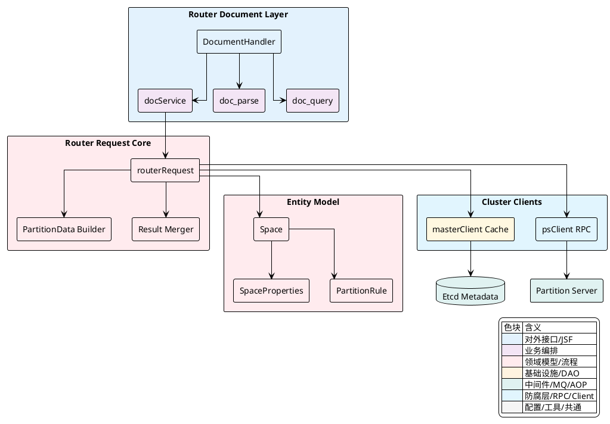
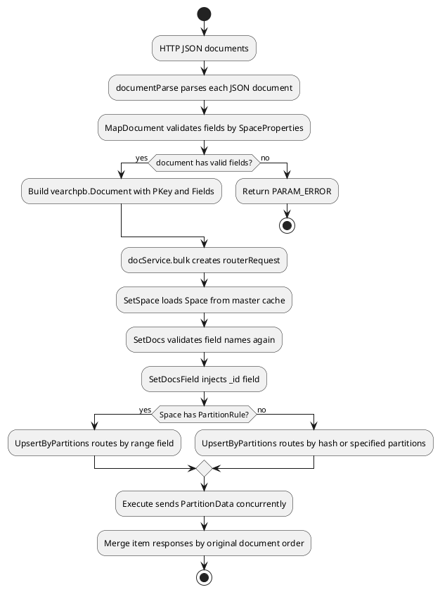
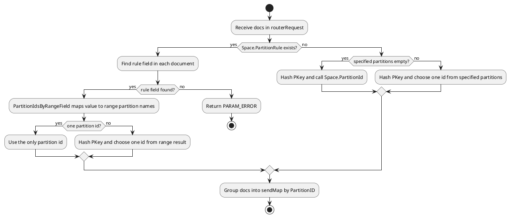
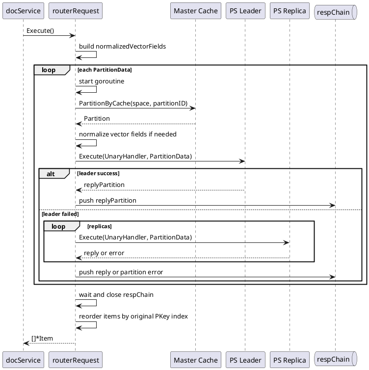

## 文档生命周期与路由策略

### 职责边界

Vearch 的文档生命周期由三类对象共同完成：`document` 层负责把 HTTP/JSON 语义转换为内部 `vearchpb` 请求，`routerRequest` 负责在 Router 内部串联空间加载、字段校验、主键补齐、分区路由、并发 RPC 与结果聚合，`entity.Space` 则承载空间 Schema、索引元数据与分区规则。写入路径围绕 `Document` 与 `Field` 组织数据，检索路径围绕 `SearchRequest`、`QueryRequest` 与 `PartitionData` 在多个分区间广播或定向分发。



| 角色 | 核心对象 | 生命周期职责 |
|---|---|---|
| 请求入口 | `DocumentHandler`、`docService` | 接收 HTTP 请求，加载 `Space`，将请求转换为 `vearchpb.BulkRequest`、`vearchpb.SearchRequest`、`vearchpb.QueryRequest` |
| 字段解析 | `MapDocument`、`parseJSON`、`processProperty` | 按 `SpaceProperties` 解析字段类型，拒绝未知字段，转换标量、日期、数组与向量为内部二进制表示 |
| 路由编排 | `routerRequest` | 保存 `ctx`、`head`、`docs`、`space`、`sendMap`，用链式方法完成校验、补主键、分区与执行 |
| 分区模型 | `Space.PartitionId`、`Space.PartitionIdsByRangeField` | 提供 Hash 槽位到分区的映射，以及 Range 分区字段值到分区名的映射 |
| 分发执行 | `Execute`、`SearchFieldSortExecute`、`QueryFieldSortExecute` | 对分区并发发起 RPC，处理副本选择、异常回填、向量归一化与结果合并 |

`routerRequest` 是 Router 内部的生命周期载体。它不直接解析 HTTP JSON，而是消费已经转换好的 `vearchpb.Document`、`vearchpb.SearchRequest` 或 `vearchpb.QueryRequest`。其结构中 `space` 用于访问 Schema 与分区信息，`sendMap` 将 `PartitionID` 映射到待发送的 `PartitionData`，`clientMap` 用于记录执行中的分区到节点映射，在取消请求时可以定位正在处理的 PS 节点。

[internal/client/client.go:110-126]()
```go
// NewRouterRequest create a new request for router
func NewRouterRequest(ctx context.Context, client *Client) *routerRequest {
	return &routerRequest{ctx: ctx, client: client, md: make(map[string]string)}
}

type routerRequest struct {
	ctx       context.Context
	client    *Client
	md        map[string]string
	head      *vearchpb.RequestHead
	docs      []*vearchpb.Document
	space     *entity.Space
	sendMap   map[entity.PartitionID]*vearchpb.PartitionData
	clientMap sync.Map
	// Err if error else nil
	Err error
}
```

<details>
<summary>关联代码</summary>

[internal/client/client.go:110-126](),[internal/router/document/doc_service.go:55-115](),[internal/entity/space.go:75-95](),[internal/entity/space.go:128-137]()

</details>

### 写入生命周期

写入从 `documentParse` 开始。HTTP 层把每个 JSON 文档逐个交给 `MapDocument`，得到 `[]*vearchpb.Field`，同时保留用户传入的 `_id` 作为 `Document.PKey`。如果空间包含向量字段，而本次写入没有带全量向量，并且主键为空，解析层会返回参数错误，防止无法定位既有文档的部分更新。

`docService.bulk` 随后构建 `routerRequest`，按固定顺序调用 `SetSpace`、`SetDocs`、`SetDocsField` 与 `UpsertByPartitions`。这一串链式调用形成写入请求在 Router 中的状态推进：先加载空间元数据，再校验文档字段，再补齐 `_id` 字段，最后将文档归组到目标分区。



[internal/router/document/doc_parse.go:540-610]()
```go
func documentParse(ctx context.Context, handler *DocumentHandler, r *http.Request, docRequest *request.DocumentRequest, space *entity.Space, args *vearchpb.BulkRequest) error {
	spaceProperties := space.SpaceProperties
	if spaceProperties == nil {
		spaceProperties, _ = entity.UnmarshalPropertyJSON(space.Fields)
	}

	vectorFieldNum := 0
	for _, value := range spaceProperties {
		if value.FieldType == vearchpb.FieldType_VECTOR {
			vectorFieldNum++
		}
	}

	docs := make([]*vearchpb.Document, 0, len(docRequest.Documents))
	for i, docJson := range docRequest.Documents {
		jsonMap, err := vjson.ByteToJsonMap(docJson)
		if err != nil {
			return err
		}
		primaryKey := jsonMap.GetJsonValString(IDField)

		fields, haveVector, err := MapDocument(docJson, space, spaceProperties)
		if err != nil {
			return err
		}

		if haveVector != vectorFieldNum {
			if primaryKey == "" {
				return vearchpb.NewError(vearchpb.ErrorEnum_PARAM_ERROR, fmt.Errorf("vector field num:%d is not equal to vector num of space fields:%d and document_id is empty", haveVector, vectorFieldNum))
			}
		}

		docs = append(docs, &vearchpb.Document{PKey: primaryKey, Fields: fields})
	}

	if len(docs) == 0 {
		return vearchpb.NewError(vearchpb.ErrorEnum_PARAM_ERROR, fmt.Errorf("empty documents, should set at least one document"))
	}

	args.Docs = docs
	return nil
}
```

`bulk` 的链式调用展示了写入阶段的路由入口。`SetDocs` 并不做类型转换，类型转换已经在 `documentParse` 完成；它负责以 `SpaceProperties` 为基准进行字段存在性校验。`SetDocsField` 会将 `PKey` 统一写回文档字段列表，保证 PS 侧可以把业务主键作为普通字段参与存储、返回与查询。

[internal/router/document/doc_service.go:104-114]()
```go
func (docService *docService) bulk(ctx context.Context, args *vearchpb.BulkRequest) *vearchpb.BulkResponse {
	reply := &vearchpb.BulkResponse{Head: newOkHead()}
	request := client.NewRouterRequest(ctx, docService.client)
	request.SetMsgID(args.Head.Params["request_id"]).SetMethod(client.BatchHandler).SetHead(args.Head).SetSpace().SetDocs(args.Docs).SetDocsField().UpsertByPartitions(args.Partitions)
	if request.Err != nil {
		log.Errorf("bulk args:[%v] error: [%s]", args, request.Err)
		return &vearchpb.BulkResponse{Head: setErrHead(request.Err)}
	}
	reply.Items = request.Execute()
	reply.Head.Params = request.GetMD()
	return reply
}
```

<details>
<summary>关联代码</summary>

[internal/router/document/doc_parse.go:540-610](),[internal/router/document/doc_service.go:104-114](),[internal/client/client.go:162-211](),[internal/client/client.go:276-341](),[internal/client/client.go:374-480]()

</details>

### 字段校验与字段映射

字段生命周期有两道校验。第一道位于 JSON 解析阶段，`MapDocument` 与 `parseJSON` 遍历输入对象，跳过用户传入的 `_id`，对其他字段逐个查询 `proMap`。字段不在 `SpaceProperties` 中会直接返回 `PARAM_ERROR`。第二道位于 `routerRequest.SetDocs`，它对已经转换成 `vearchpb.Field` 的文档再次检查字段名是否存在于当前 `Space`，避免进入分区分发后才发现 Schema 不匹配。

[internal/router/document/doc_parse.go:56-128]()
```go
func MapDocument(source []byte, space *entity.Space, proMap map[string]*entity.SpaceProperties) ([]*vearchpb.Field, int, error) {
	var fast fastjson.Parser
	v, err := fast.ParseBytes(source)
	if err != nil {
		log.Warnf("bytes transform to json failed when inserting, err: %s ,data:%s", err.Error(), string(source))
		return nil, 0, errors.Wrap(err, "data format error, please check your input!")
	}
	var path []string
	return parseJSON(path, v, space, proMap)
}

func parseJSON(path []string, v *fastjson.Value, space *entity.Space, proMap map[string]*entity.SpaceProperties) ([]*vearchpb.Field, int, error) {
	fields := make([]*vearchpb.Field, 0)
	obj, err := v.Object()
	if err != nil {
		log.Warnf("data format error, object is required but received %s", v.Type().String())
		return nil, 0, vearchpb.NewError(vearchpb.ErrorEnum_PARAM_ERROR, fmt.Errorf("data format error, object is required but received %s", v.Type().String()))
	}

	haveNoField := false
	errorField := ""
	haveVector := 0
	parseErr := fmt.Errorf("")

	obj.Visit(func(key []byte, val *fastjson.Value) {
		fieldName := string(key)
		if fieldName == IDField {
			return
		}
		pro, ok := proMap[fieldName]
		if !ok {
			haveNoField = true
			errorField = fieldName
			log.Warnf("unrecognizable field, %s is not found in space[%s] fields", fieldName, space.Name)
			return
		}
		if _, ok := FieldsIndex[fieldName]; ok {
			log.Warnf("filed name [%s]  is an internal field that cannot be used", fieldName)
			return
		}
		field, err := processProperty(docV, val, space.GetFieldIndexType(fieldName), pro)
		if err != nil {
			log.Error("processProperty parse field:[%s] err: %v", fieldName, err)
			parseErr = err
			return
		}
		if field != nil && field.Type == vearchpb.FieldType_VECTOR && field.Value != nil {
			haveVector += 1
		}
		fields = append(fields, field)
	})

	if parseErr.Error() != "" {
		return nil, haveVector, vearchpb.NewError(vearchpb.ErrorEnum_PARAM_ERROR, fmt.Errorf("%s", parseErr.Error()))
	}

	if haveNoField {
		return nil, haveVector, vearchpb.NewError(vearchpb.ErrorEnum_PARAM_ERROR, fmt.Errorf("unrecognizable field, %s is not found in space[%s] fields", errorField, space.Name))
	}

	return fields, haveVector, nil
}
```

类型映射由 `processProperty` 分派到字符串、数字、布尔、数组和向量处理函数。标量字段会转换成 `cbbytes` 二进制表示，日期字符串会转为纳秒时间戳，向量字段会根据索引类型区分浮点向量与二进制向量。`processVector` 会检查输入长度是否等于 `SpaceProperties.Dimension`，`processVectorBinary` 则要求二进制向量长度等于 `Dimension / 8`。

| JSON 输入类型 | 处理函数 | 目标字段类型 | 关键约束 |
|---|---|---|---|
| `string` | `processString` | `STRING`、`DATE`、`INT`、`LONG`、`FLOAT`、`DOUBLE`、`STRINGARRAY` | 索引字符串长度不超过 `1024`，普通字符串长度不超过 `65535` |
| `number` | `processNumber` | `INT`、`LONG`、`FLOAT`、`DOUBLE`、`DATE` | 按 `SpaceProperties.FieldType` 做数值转换 |
| `bool` | `processBool` | `BOOL` | 仅允许映射到 `BOOL` |
| `array` | `processPropertyArray` | `STRINGARRAY` 或 `VECTOR` | 向量数组不能为空，维度必须匹配 |
| `vector` | `processVector`、`processVectorBinary` | `VECTOR` | `BINARYIVF` 使用 `uint8` 字节数组，其他索引使用 `float32` 数组 |

[internal/router/document/doc_parse.go:276-308]()
```go
func processProperty(docVal *DocVal, v *fastjson.Value, indexType string, pro *entity.SpaceProperties) (*vearchpb.Field, error) {
	fieldName := docVal.FieldName
	path := docVal.Path
	if len(path) == 0 && FieldsIndex[fieldName] > 0 {
		log.Error("field name [%s]  is an internal field that cannot be used", fieldName)
		return nil, vearchpb.NewError(vearchpb.ErrorEnum_PARAM_ERROR, fmt.Errorf("field name [%s]  is an internal field that cannot be used", fieldName))
	}

	pathString := fieldName
	if len(path) > 0 {
		pathString = encodePath(append(path, fieldName))
	}

	if v.Type() == fastjson.TypeNull {
		return nil, vearchpb.NewError(vearchpb.ErrorEnum_PARAM_ERROR, fmt.Errorf("field name [%s] type is null", fieldName))
	}

	field := &vearchpb.Field{Name: fieldName}
	err := fmt.Errorf("parse param processProperty err :%s", fieldName)

	switch v.Type() {
	case fastjson.TypeString:
		field, err = processPropertyString(v, pathString, pro)
	case fastjson.TypeNumber:
		field, err = processPropertyNumber(v, pathString, pro)
	case fastjson.TypeTrue, fastjson.TypeFalse:
		field, err = processPropertyBool(v, pathString, pro)
	case fastjson.TypeObject:
		field, err = processPropertyObject()
	case fastjson.TypeArray:
		field, err = processPropertyArray(v, pathString, pro, fieldName, indexType)
	}
	return field, err
}
```

`SetDocs` 和 `SetDocsField` 构成写入进入分区前的统一收口。`SetDocs` 只接受 `SpaceProperties` 中定义过的字段。`SetDocsField` 调用 `generateUUID` 为没有主键的文档生成主键，然后追加一个名称为 `entity.IdField` 的 `STRING` 字段，字段值与 `Document.PKey` 保持一致。

[internal/client/client.go:171-211]()
```go
func (r *routerRequest) SetDocs(docs []*vearchpb.Document) *routerRequest {
	if r.Err != nil {
		return r
	}
	r.docs = docs
	for _, doc := range r.docs {
		if doc == nil {
			r.Err = vearchpb.NewError(vearchpb.ErrorEnum_PARAM_ERROR, errors.New("the doc is nil"))
			return r
		}
		for _, field := range doc.Fields {
			if _, ok := r.space.SpaceProperties[field.Name]; !ok {
				r.Err = vearchpb.NewError(vearchpb.ErrorEnum_PARAM_ERROR, fmt.Errorf("the field[%s] in doc not needed in space", field.Name))
				return r
			}
		}
	}
	return r
}

func (r *routerRequest) SetDocsField() *routerRequest {
	if r.Err != nil {
		return r
	}
	for _, doc := range r.docs {
		key, err := generateUUID(doc.PKey)
		if err != nil {
			r.Err = err
			return r
		}
		doc.PKey = key
		field := &vearchpb.Field{Name: entity.IdField}

		field.Value = []byte(doc.PKey)
		field.Type = vearchpb.FieldType_STRING
		doc.Fields = append(doc.Fields, field)
	}
	return r
}
```

<details>
<summary>关联代码</summary>

[internal/router/document/doc_parse.go:56-128](),[internal/router/document/doc_parse.go:252-514](),[internal/client/client.go:171-211](),[internal/client/client.go:1236-1253](),[internal/entity/space.go:128-137]()

</details>

### 分区路由策略

写入分区有两条路径。没有 `PartitionRule` 时，文档以 `PKey` 为输入计算 `murmur3.Sum32WithSeed`，再调用 `Space.PartitionId` 将哈希槽映射为分区。存在 `PartitionRule` 时，`UpsertByPartitions` 会在文档字段中寻找规则字段，读取该字段的二进制值，交给 `Space.PartitionIdsByRangeField` 解析 Range 分区；如果 Range 结果包含多个分区，则再用主键哈希在这些分区中选一个。



`Space.PartitionId` 假设 `Space.Partitions` 按 `Slot` 有序。它通过二分查找定位不大于当前 `slotID` 的分区，单分区空间直接返回唯一分区。这个方法只关心槽位边界，不直接关心业务字段，因此 Hash 分区的稳定性取决于 `PKey` 到 `slotID` 的哈希结果，以及空间中的分区槽位配置。

[internal/entity/space.go:153-179]()
```go
func (s *Space) PartitionId(slotID SlotID) PartitionID {
	if len(s.Partitions) == 1 {
		return s.Partitions[0].Id
	}

	arr := s.Partitions

	maxKey := len(arr) - 1

	low, high, mid := 0, maxKey, 0

	for low <= high {
		mid = (low + high) >> 1

		midVal := arr[mid].Slot

		if midVal > slotID {
			high = mid - 1
		} else if midVal < slotID {
			low = mid + 1
		} else {
			return arr[mid].Id
		}
	}

	return arr[low-1].Id
}
```

Range 分区通过 `PartitionRule.Ranges` 的边界值映射到分区名。实现中 `PartitionIdsByRangeField` 将字段值转为整数时间戳，逐个比较 Range 边界，选中第一个边界大于字段值的 Range 名称，再回到 `Space.Partitions` 中查找同名分区并返回其 `PartitionID`。

[internal/entity/space.go:198-228]()
```go
func (s *Space) PartitionIdsByRangeField(value []byte, field_type vearchpb.FieldType) ([]PartitionID, error) {
	pids := make([]PartitionID, 0)
	if len(s.Partitions) == 1 {
		pids = append(pids, s.Partitions[0].Id)
		return pids, nil
	}

	arr := s.Partitions
	partition_name := ""
	ts := cbbytes.Bytes2Int(value)
	found := false
	for _, r := range s.PartitionRule.Ranges {
		value, _ := ToTimestamp(r.Value)
		if ts < value {
			partition_name = r.Name
			found = true
			break
		}
	}
	if !found {
		u := cbbytes.Bytes2Int(value)
		timeStr := time.Unix(u/1e9, u%1e9)
		return pids, vearchpb.NewError(vearchpb.ErrorEnum_PARAM_ERROR, fmt.Errorf("can't set partition for field value %s, space ranges %v", timeStr, s.PartitionRule.Ranges))
	}
	for i := 0; i < len(arr); i++ {
		if arr[i].Name == partition_name {
			pids = append(pids, arr[i].Id)
		}
	}
	return pids, nil
}
```

`UpsertByPartitions` 是写入路由的主实现。它同时覆盖三类场景：按 Range 规则字段路由、按全空间 Hash 路由、按用户指定分区集合 Hash 路由。每个目标分区会被构造成一个 `vearchpb.PartitionData`，其中 `MessageID` 来自请求元数据，`Items` 保存该分区下所有待写入文档。

[internal/client/client.go:276-341]()
```go
func (r *routerRequest) UpsertByPartitions(partitions []uint32) *routerRequest {
	if r.Err != nil {
		return r
	}
	partitionID := uint32(0)
	dataMap := make(map[entity.PartitionID]*vearchpb.PartitionData)
	// partition by specify rule
	if r.space.PartitionRule != nil {
		for _, doc := range r.docs {
			found := false
			for _, field := range doc.Fields {
				if field.Name == r.space.PartitionRule.Field {
					found = true
					pids, err := r.space.PartitionIdsByRangeField(field.Value, field.Type)
					if err != nil {
						r.Err = err
						return r
					}
					if len(pids) == 1 {
						partitionID = pids[0]
					} else {
						hash_index := murmur3.Sum32WithSeed([]byte(doc.PKey), 0) % uint32(len(pids))
						partitionID = pids[hash_index]
					}
					break
				}
			}
			if !found {
				r.Err = vearchpb.NewError(vearchpb.ErrorEnum_PARAM_ERROR, fmt.Errorf("document must have partition rule field"))
				return r
			}

			item := &vearchpb.Item{Doc: doc}
			if d, ok := dataMap[partitionID]; ok {
				d.Items = append(d.Items, item)
			} else {
				items := make([]*vearchpb.Item, 0)
				d = &vearchpb.PartitionData{PartitionID: partitionID, MessageID: r.GetMsgID(), Items: items}
				dataMap[partitionID] = d
				d.Items = append(d.Items, item)
			}
		}
	} else {
		// partition by hash or specify pids
		for _, doc := range r.docs {
			if len(partitions) == 0 {
				partitionID = r.space.PartitionId(murmur3.Sum32WithSeed([]byte(doc.PKey), 0))
			} else {
				hash_index := murmur3.Sum32WithSeed([]byte(doc.PKey), 0) % uint32(len(partitions))
				partitionID = partitions[hash_index]
			}
			item := &vearchpb.Item{Doc: doc}
			if d, ok := dataMap[partitionID]; ok {
				d.Items = append(d.Items, item)
			} else {
				items := make([]*vearchpb.Item, 0)
				d = &vearchpb.PartitionData{PartitionID: partitionID, MessageID: r.GetMsgID(), Items: items}
				dataMap[partitionID] = d
				d.Items = append(d.Items, item)
			}
		}
	}

	r.sendMap = dataMap
	return r
}
```

<details>
<summary>关联代码</summary>

[internal/client/client.go:232-251](),[internal/client/client.go:276-341](),[internal/entity/space.go:153-179](),[internal/entity/space.go:198-228]()

</details>

### 并发分发、向量归一化与响应回填

`Execute` 将 `sendMap` 中的每个分区作为一个并发任务处理。每个 goroutine 会从 Master 缓存读取分区信息，优先向 `partition.LeaderID` 发起 `UnaryHandler` RPC；如果失败，则遍历副本并跳过已被 `psClient` 标记为 faulty 的节点。所有分区响应写入 `respChain`，主协程等待 `WaitGroup` 结束后关闭通道并合并结果。



归一化只对声明了向量格式的字段生效。`NormalizedVectorFields` 扫描 `SpaceProperties`，只有 `FieldType` 为 `VECTOR` 且 `Format` 为 `normalization` 或 `normal` 的字段才会进入集合，`BINARYIVF` 被排除。写入时 `Execute` 在发送到 PS 前将字段值从二进制转换成 `float32` 数组，调用 `number.Normalization` 后再写回 `Field.Value`。

[internal/client/client.go:352-371]()
```go
func NormalizedVectorFields(space *entity.Space) map[string]string {
	normalizedVectorFields := make(map[string]string)
	for fieldName, property := range space.SpaceProperties {
		format := property.Format
		if property.FieldType == vearchpb.FieldType_VECTOR && format != nil && (*format == "normalization" || *format == "normal") {
			if property.Index != nil {
				if property.Index.Type != "BINARYIVF" {
					normalizedVectorFields[fieldName] = fieldName
				}
			} else {
				for _, idx := range space.Indexes {
					if idx.FieldName == fieldName && idx.Type != "BINARYIVF" {
						normalizedVectorFields[fieldName] = fieldName
						break
					}
				}
			}
		}
	}
	return normalizedVectorFields
}
```

[internal/client/client.go:374-424]()
```go
func (r *routerRequest) Execute() []*vearchpb.Item {
	normalizedVectorFields := make(map[string]string)
	if r.md[HandlerType] == BatchHandler {
		normalizedVectorFields = NormalizedVectorFields(r.space)
	}
	var wg sync.WaitGroup

	respChain := make(chan *vearchpb.PartitionData, len(r.sendMap))
	for partitionID, pData := range r.sendMap {
		wg.Add(1)
		c := context.WithValue(r.ctx, share.ReqMetaDataKey, copyMap(r.md))
		go func(ctx context.Context, pid entity.PartitionID, d *vearchpb.PartitionData) {
			defer wg.Done()
			replyPartition := new(vearchpb.PartitionData)
			partition, e := r.client.Master().Cache().PartitionByCache(ctx, r.space.Name, pid)
			if e != nil {
				panic(e.Error())
			}

			if len(normalizedVectorFields) > 0 {
				for _, item := range d.Items {
					if item.Doc == nil {
						continue
					}
					for _, field := range item.Doc.Fields {
						if field == nil || field.Name == "" || normalizedVectorFields[field.Name] == "" {
							continue
						}
						float32s, err := cbbytes.ByteToVectorForFloat32(field.Value)
						if err != nil {
							log.Panic(err.Error())
						}
						if err := number.Normalization(float32s); err != nil {
							log.Panic(err.Error())
						}
						bs, err := cbbytes.VectorToByte(float32s)
						if err != nil {
							log.Error("processVector VectorToByte error: %v", err)
							log.Panic(err.Error())
						}
						field.Value = bs
					}
				}
			}
			nodeID := partition.LeaderID
			err := r.client.PS().GetOrCreateRPCClient(ctx, nodeID).Execute(ctx, UnaryHandler, d, replyPartition)
```

合并阶段通过 `docIndexMap` 保留原始请求顺序。因为并发响应按分区完成时间返回，而用户期待写入结果和输入文档顺序对齐，`Execute` 会先记录每个 `PKey` 在输入数组中的位置，再把各分区返回的 `Item` 放回对应下标。分区级错误通过 `setPartitionErr` 下沉到分区内每个 `Item.Err`。

[internal/client/client.go:456-488]()
```go
docIndexMap := make(map[string][]int, len(r.docs))
for i, doc := range r.docs {
	docIndexMap[doc.PKey] = append(docIndexMap[doc.PKey], i)
}

items := make([]*vearchpb.Item, len(r.docs))
for resp := range respChain {
	setPartitionErr(resp)
	for _, item := range resp.Items {
		if item == nil || item.Doc == nil {
			log.Error("item or doc is nil")
			continue
		}
		realIndex := docIndexMap[item.Doc.PKey]
		if len(realIndex) == 1 {
			items[realIndex[0]] = item
		} else {
			for _, index := range realIndex {
				items[index] = item
			}
		}
	}
}
return items
}

func setPartitionErr(d *vearchpb.PartitionData) {
	if d.Err != nil && d.Err.Code != vearchpb.ErrorEnum_SUCCESS {
		for _, item := range d.Items {
			item.Err = d.Err
		}
	}
}
```

<details>
<summary>关联代码</summary>

[internal/client/client.go:352-371](),[internal/client/client.go:374-480](),[internal/client/client.go:482-488](),[internal/client/client.go:1349-1494]()

</details>

### 查询与搜索的过滤、路由和结果聚合

查询与搜索共享分区广播模型，但请求语义不同。`queryRequestToPb` 面向字段过滤和主键查询，负责生成 `RangeFilters`、`TermFilters`、返回字段列表、排序字段与分页参数。`requestToPb` 面向向量搜索，除字段过滤外还解析 `Vectors` 为 `VecFields`，根据索引参数和度量类型设置排序方向，并把多向量请求的 `ReqNum` 写入 `SearchRequest`。

| 路径 | 转换函数 | 路由函数 | 执行函数 | 聚合方式 |
|---|---|---|---|---|
| 按主键或过滤查询 | `queryRequestToPb` | `QueryByPartitions` | `QueryFieldSortExecute` | `AddMergeResultArr` 追加结果，按 `DocumentIds` 可恢复输入顺序 |
| 向量搜索 | `requestToPb` | `SearchByPartitions` | `SearchFieldSortExecute` | `AddMergeSort` 合并已排序结果，再按 `TopN` 或分页裁剪 |
| 指定分区查询 | `queryRequestToPb` 设置 `PartitionId` 或 `PartitionNames` | `QueryByPartitions` | `QueryFieldSortExecute` | 仅访问命中的分区集合 |
| 指定 Range 分区搜索 | `requestToPb` 设置 `PartitionNames` | `SearchByPartitions` | `SearchFieldSortExecute` | 仅访问名称匹配的分区集合 |

字段过滤由 `parseFilter` 完成。它从 `request.Filter` 中拆分 Range 条件和 Term 条件，支持 `<`、`<=`、`>`、`>=`、`=`、`<>`、`!=`、`IN` 与 `NOT IN`，并把过滤条件转换成 PS 可执行的 `vearchpb.RangeFilter` 和 `vearchpb.TermFilter`。查询与搜索都通过该函数填充过滤字段，因此字段过滤语义在两条读路径上保持一致。

[internal/router/document/doc_query.go:85-162]()
```go
func parseFilter(filters *request.Filter, space *entity.Space) ([]*vearchpb.RangeFilter, []*vearchpb.TermFilter, int32, error) {
	rfs := make([]*vearchpb.RangeFilter, 0)
	tfs := make([]*vearchpb.TermFilter, 0)
	var operator = FilterOperatorAnd

	var err error

	proMap := space.SpaceProperties
	if proMap == nil {
		proMap, err = entity.UnmarshalPropertyJSON(space.Fields)
		if err != nil {
			return nil, nil, operator, err
		}
	}

	if filters != nil {
		if filters.Operator == "AND" {
			operator = FilterOperatorAnd
		} else if filters.Operator == "OR" {
			operator = FilterOperatorOr
		} else {
			return nil, nil, operator, vearchpb.NewError(vearchpb.ErrorEnum_FILTER_OPERATOR_TYPE_ERR, nil)
		}
		rangeConditionMap := make(map[string][]*request.Condition)
		termConditionMap := make(map[string][]*Term)
		for _, condition := range filters.Conditions {
			if condition.Operator == "<" || condition.Operator == "<=" ||
				condition.Operator == ">" || condition.Operator == ">=" ||
				condition.Operator == "=" || condition.Operator == "<>" ||
				condition.Operator == "!=" {
				rangeConditionMap[condition.Field] = append(rangeConditionMap[condition.Field], &condition)
			} else if condition.Operator == "IN" {
				tmp := make([]string, 0)
				err := json.Unmarshal(condition.Value, &tmp)
				if err != nil {
					log.Error(err)
					return nil, nil, operator, vearchpb.NewError(vearchpb.ErrorEnum_PARAM_ERROR, err)
				}

				tm := &Term{
					Value:    condition.Value,
					Operator: ConditionOperatorIN,
				}
				termConditionMap[condition.Field] = append(termConditionMap[condition.Field], tm)
			} else if condition.Operator == "NOT IN" {
				tmp := make([]string, 0)
				err := json.Unmarshal(condition.Value, &tmp)
				if err != nil {
					log.Error(err)
					return nil, nil, operator, vearchpb.NewError(vearchpb.ErrorEnum_PARAM_ERROR, err)
				}

				tm := &Term{
					Value:    condition.Value,
					Operator: ConditionOperatorNOTIN,
				}
				termConditionMap[condition.Field] = append(termConditionMap[condition.Field], tm)
			} else {
				return nil, nil, operator, vearchpb.NewError(vearchpb.ErrorEnum_FILTER_CONDITION_OPERATOR_TYPE_ERR, fmt.Errorf("unsupported operator: %s", condition.Operator))
			}
		}
		filter, err := parseRange(filters.Operator, rangeConditionMap, proMap, space.Indexes)
		if err != nil {
			return nil, nil, operator, vearchpb.NewError(vearchpb.ErrorEnum_PARAM_ERROR, fmt.Errorf("parseRange err %s", err.Error()))
		}
		if len(filter) != 0 {
			rfs = append(rfs, filter...)
		}
		tmFilter, err := parseTerm(termConditionMap, proMap, space.Indexes)
		if err != nil {
			return nil, nil, operator, vearchpb.NewError(vearchpb.ErrorEnum_PARAM_ERROR, fmt.Errorf("parseTerm err %s", err.Error()))
		}
		if len(tmFilter) != 0 {
			tfs = append(tfs, tmFilter...)
		}
	}

	return rfs, tfs, operator, nil
}
```

搜索向量解析由 `parseSearch` 与 `parseVectors` 完成。`parseVectors` 会校验字段存在性、字段类型、索引类型、向量非空、维度整除关系，以及多向量请求中每个向量字段的 `queryNum` 是否一致。通过校验后，`VectorQuery.ToC` 把用户 JSON 向量转为 `vearchpb.VectorQuery`。

[internal/router/document/doc_query.go:165-198]()
```go
func parseSearch(vectors []json.RawMessage, filters *request.Filter, req *vearchpb.SearchRequest, space *entity.Space) error {
	vqs := make([]*vearchpb.VectorQuery, 0)

	var err error
	var reqNum int

	if len(vectors) > 0 {
		req.MultiVectorRank = 1
		if reqNum, vqs, err = parseVectors(reqNum, vqs, vectors, space); err != nil {
			return err
		}
	}
	if len(vqs) > 0 {
		req.VecFields = vqs
	}

	rfs, tfs, operator, err := parseFilter(filters, space)
	if err != nil {
		return err
	}
	if len(rfs) > 0 {
		req.RangeFilters = rfs
	}
	if len(tfs) > 0 {
		req.TermFilters = tfs
	}
	req.Operator = operator

	if reqNum <= 0 {
		reqNum = 1
	}

	req.ReqNum = int32(reqNum)
	return nil
}
```

读路径的分区选择不是按文档主键 Hash 定位，而是按请求范围构造广播集合。`SearchByPartitions` 遍历 `space.Partitions`，如果请求包含 `PartitionNames`，只保留名称命中的分区；否则广播到所有分区。`QueryByPartitions` 还支持显式 `PartitionId`，这类请求会只构造单个 `PartitionData`。

[internal/client/client.go:1321-1345]()
```go
func (r *routerRequest) SearchByPartitions(searchReq *vearchpb.SearchRequest) *routerRequest {
	if r.Err != nil {
		return r
	}
	r.sendMap = make(map[entity.PartitionID]*vearchpb.PartitionData)
	partition_names := make(map[string]bool)
	if len(searchReq.PartitionNames) > 0 {
		for _, pname := range searchReq.PartitionNames {
			partition_names[pname] = true
		}
	}
	for _, p := range r.space.Partitions {
		if len(partition_names) > 0 {
			if _, ok := partition_names[p.Name]; !ok {
				continue
			}
		}
		if _, ok := r.sendMap[p.Id]; ok {
			log.Error("db Id:%d , space Id:%d, have multiple partitionID:%d", p.DBId, p.SpaceId, p.Id)
			continue
		}
		r.sendMap[p.Id] = &vearchpb.PartitionData{PartitionID: p.Id, MessageID: r.GetMsgID(), SearchRequest: searchReq}
	}
	return r
}
```

搜索执行阶段会在 `searchFromPartition` 中对查询向量执行与写入一致的归一化处理。对于已知字段，代码会按照 `SpaceProperties.Dimension` 将连续的 `float32` 查询向量切成多个向量片段，逐段调用 `number.Normalization`，再重新序列化为字节数组。这样多条查询向量被放入同一个字段时，每条向量都按自身维度独立归一化。

[internal/client/client.go:596-635]()
```go
if len(normalizedVectorFields) > 0 {
	vectorQueryArr := pd.SearchRequest.VecFields
	proMap := r.space.SpaceProperties
	for _, query := range vectorQueryArr {
		docField := proMap[query.Name]
		if docField != nil {
			dimension := docField.Dimension
			float32s, err := cbbytes.ByteToVectorForFloat32(query.Value)
			if err != nil {
				panic(err.Error())
			}
			max := len(float32s)
			dPage := max / dimension
			if max >= dPage {
				end := int(0)
				normalVector := make([]float32, 0, max)
				for i := 1; i <= dPage; i++ {
					qu := i * dimension
					if i != dPage {
						norma := float32s[i-1+end : qu]
						if err := number.Normalization(norma); err != nil {
							panic(err.Error())
						}
						normalVector = append(normalVector, norma...)
					} else {
						norma := float32s[i-1+end:]
						if err := number.Normalization(norma); err != nil {
							panic(err.Error())
						}
						normalVector = append(normalVector, norma...)
					}
					end = qu - i
				}
				bs, err := cbbytes.VectorToByte(normalVector)
				if err != nil {
					log.Error("processVector VectorToByte error: %v", err)
					panic(err.Error())
				}
				query.Value = bs
			}
		}
```

`SearchFieldSortExecute` 会等待所有分区返回后进行归并。每个分区返回的结果已经按分数排序，`AddMergeSort` 使用 `mergeSortedArrays` 将两个有序列表合并，并按照 `TopN` 截断。所有分区合并完成后，再根据 `PageSize`、`PageNum` 或 `TopN` 做最终裁剪，并把 `RequestId` 写回响应头。

[internal/client/client.go:823-910]()
```go
if r.Err == nil {
	var result []*vearchpb.SearchResult

	mergeStartTime := time.Now()
	var finalErr *vearchpb.Error
	for r := range respChain {
		if r != nil && r.PartitionData.Err != nil {
			finalErr = r.PartitionData.Err
			continue
		}
		if r != nil && r.PartitionData != nil && r.PartitionData.SearchResponse != nil &&
			r.PartitionData.SearchResponse.Head != nil {
			if r.PartitionData.SearchResponse.Head.Err != nil {
				finalErr = r.PartitionData.SearchResponse.Head.Err
				continue
			}
		}
		if result == nil && r != nil {
			searchResponse = r.PartitionData.SearchResponse
			if searchResponse != nil && len(searchResponse.Results) > 0 {
				result = searchResponse.Results
				continue
			}
		}

		if len(result) <= len(r.PartitionData.SearchResponse.Results) {
			for i := range result {
				AddMergeSort(result[i], r.PartitionData.SearchResponse.Results[i], int(searchReq.TopN), desc)
			}
		} else {
			for i := range r.PartitionData.SearchResponse.Results {
				AddMergeSort(result[i], r.PartitionData.SearchResponse.Results[0], int(searchReq.TopN), desc)
			}
		}
	}

	for _, resp := range result {
		quickSort(resp.ResultItems, desc, 0, len(resp.ResultItems)-1)
		if len(resp.ResultItems) > 0 {
			if searchReq.PageSize > 0 && searchReq.PageNum >= 1 {
				start := searchReq.PageSize * (searchReq.PageNum - 1)
				end := start + searchReq.PageSize

				if int(start) >= len(resp.ResultItems) {
					resp.ResultItems = nil
				} else {
					if int(end) > len(resp.ResultItems) {
						end = int32(len(resp.ResultItems))
					}
					resp.ResultItems = resp.ResultItems[start:end]
				}
			} else if searchReq.TopN > 0 {
				if len(resp.ResultItems) > int(searchReq.TopN) {
					resp.ResultItems = resp.ResultItems[:searchReq.TopN]
				}
			}
		}
	}
	searchResponse.Results = result
	searchResponse.Head.RequestId = r.GetMsgID()
}
```

<details>
<summary>关联代码</summary>

[internal/router/document/doc_query.go:85-198](),[internal/router/document/doc_query.go:1254-1400](),[internal/router/document/doc_query.go:1402-1584](),[internal/client/client.go:1255-1295](),[internal/client/client.go:1321-1345](),[internal/client/client.go:500-744](),[internal/client/client.go:770-926](),[internal/client/client.go:1496-1609]()

</details>