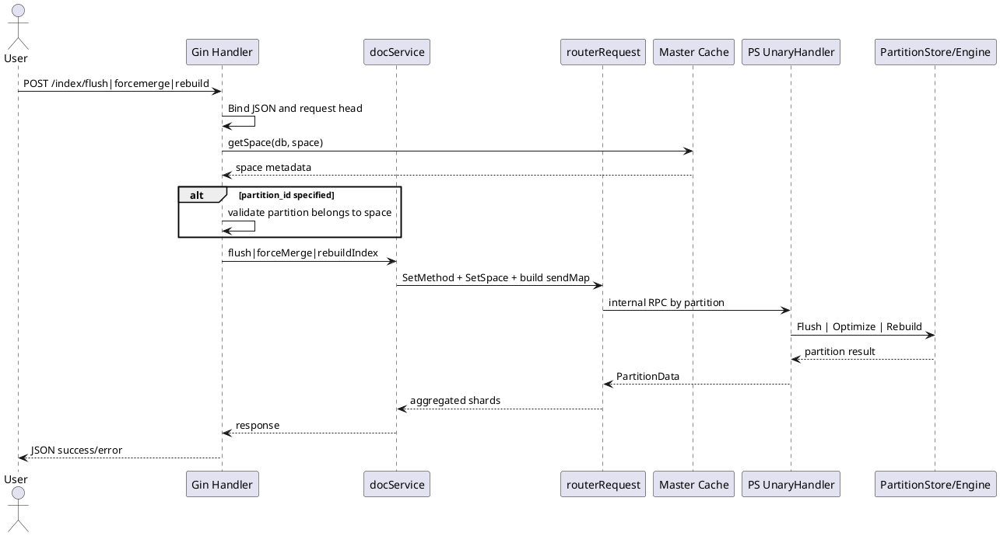
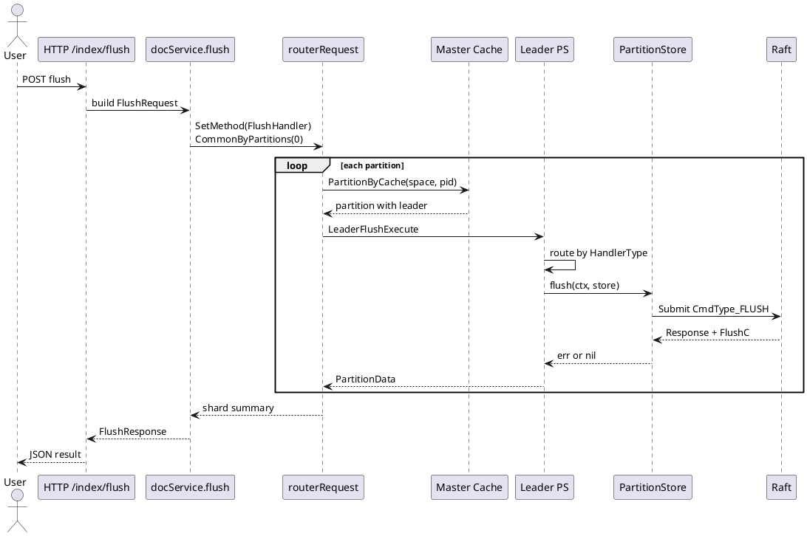
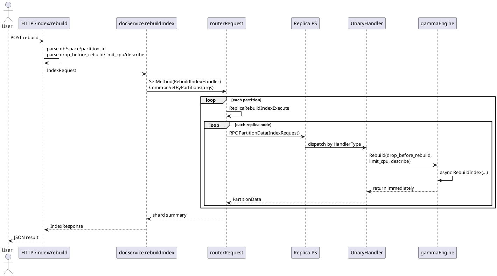

## 索引管理与维护操作

索引管理接口覆盖 `Flush`、`ForceMerge`、`Rebuild` 三类生命周期操作。它们都从 Router 的 HTTP 入口进入，但在分发策略上并不相同：`Flush` 只发往分区 `Leader`，而 `ForceMerge` 与 `Rebuild` 会发往分区的所有副本。这个差异直接决定了它们各自作用的对象：`Flush` 面向 Raft 写入链路上的持久化落盘，`ForceMerge` 与 `Rebuild` 面向每个副本节点上的本地索引文件整理与重建。

从实现上看，这一组能力并没有复用文档写入的 `DocCmd` 路径，而是走了 Router 到 PS 的专用内部 RPC 调度。Router 负责请求头构造、空间与分区校验、分区范围展开；PS 负责并发控制、分区定位与具体引擎调用；底层 `PartitionStore` 或引擎对象最终执行 `Flush`、`Optimize`、`Rebuild`。

### 操作职责与作用边界

三类操作在业务语义上都属于“索引维护”，但作用点并不一样。

| 操作 | HTTP 路径 | Router 调度方法 | PS 执行分支 | 最终落点 | 分发范围 |
|---|---|---|---|---|---|
| `Flush` | `/index/flush` | `docService.flush` | `client.FlushHandler` | `store.Flush` | 每个分区仅 `Leader` |
| `ForceMerge` | `/index/forcemerge` | `docService.forceMerge` | `client.ForceMergeHandler` | `store.GetEngine().Optimize` | 分区全部副本 |
| `Rebuild` | `/index/rebuild` | `docService.rebuildIndex` | `client.RebuildIndexHandler` | `store.GetEngine().Rebuild` | 分区全部副本 |

`Flush` 的职责是把分区当前写入状态推进到可持久化的状态，它落在 `PartitionStore` 上而不是直接落在引擎层。`store.Flush` 内部会构造 `CmdType_FLUSH` 的 Raft 命令并提交，说明这一步属于分区一致性路径的一部分，而不是单节点本地动作。

`ForceMerge` 的职责是触发索引整理，PS 端最终调用 `Optimize`。在 Gamma 引擎实现里，`Optimize` 会异步调用 `BuildIndex`。这类操作不依赖 Raft 提交，因此 Router 直接把请求广播给分区所有副本，由每个副本各自执行本地索引整理。

`Rebuild` 的职责是重建索引，额外携带了 `drop_before_rebuild`、`limit_cpu`、`describe`、`partition_id` 等参数。PS 端直接把这些参数传入引擎的 `Rebuild` 方法，因此重建行为不是 Router 解释的，而是由底层引擎按参数执行。这里的 `limit_cpu` 与 `describe` 并没有在 Router/PS 层做二次加工，而是原样传递给引擎。

<details>
<summary>关联代码</summary>

[internal/router/document/doc_http.go:824-997](),[internal/router/document/doc_service.go:202-266](),[internal/ps/handler_document.go:254-496](),[internal/ps/partition_service.go:70-86](),[internal/ps/storage/raftstore/store_writer.go:129-164](),[internal/ps/engine/gammacb/gamma.go:313-333](),[internal/entity/request/search_doc.go:46-53]()

</details>

### HTTP 入口如何把维护请求转成分区级任务

这组接口都挂在 Router 的 `/index/*` 路径下，处理器结构保持一致：先从 Gin 上下文中提取公共请求头，再绑定 `IndexRequest`，之后把 `db_name`、`space_name` 和可选分区参数写入 protobuf 请求对象。

`IndexRequest` 的 HTTP 结构如下，`Rebuild` 的控制参数就在这里进入系统：

[internal/entity/request/search_doc.go:46-53]()
```go
type IndexRequest struct {
	DbName            string `json:"db_name,omitempty"`
	SpaceName         string `json:"space_name,omitempty"`
	DropBeforeRebuild bool   `json:"drop_before_rebuild,omitempty"`
	LimitCPU          int    `json:"limit_cpu,omitempty"`
	Describe          int    `json:"describe,omitempty"`
	PartitionId       uint32 `json:"partition_id,omitempty"`
}
```

`Flush` 的 HTTP 处理最短，它只要求能够定位空间，然后把空间名与库名交给 `docService.flush`：

[internal/router/document/doc_http.go:824-864]()
```go
func (handler *DocumentHandler) handleIndexFlush(c *gin.Context) {
	args := &vearchpb.FlushRequest{}
	var err error
	args.Head, err = setRequestHeadFromGin(c)
	if err != nil {
		httpCode = response.New(c).JsonError(errors.NewErrInternal(err))
		return
	}
	indexRequest := &request.IndexRequest{}
	err = c.ShouldBindJSON(indexRequest)
	if err != nil {
		httpCode = response.New(c).JsonError(errors.NewErrBadRequest(err))
		return
	}

	args.Head.DbName = indexRequest.DbName
	args.Head.SpaceName = indexRequest.SpaceName

	_, err = handler.docService.getSpace(c.Request.Context(), args.Head)
	if err != nil {
		httpCode = response.New(c).JsonError(errors.NewErrInternal(err))
		return
	}

	flushResponse := handler.docService.flush(c.Request.Context(), args)
	result := IndexResponseToContent(flushResponse.Shards)
	httpCode = response.New(c).JsonSuccess(result)
}
```

`ForceMerge` 与 `Rebuild` 多了一层分区合法性校验。只要请求里给出了 `partition_id`，Router 就会先在空间的分区列表中确认该分区确实属于当前空间，否则直接返回参数错误，而不会让下游节点再做一次模糊判断。

[internal/router/document/doc_http.go:866-927]()
```go
if args.PartitionId > 0 {
	found := false
	for _, partition := range space.Partitions {
		if partition.Id == args.PartitionId {
			found = true
			break
		}
	}
	if !found {
		err := vearchpb.NewError(vearchpb.ErrorEnum_PARAM_ERROR, fmt.Errorf("partition_id %d not belong to space %s", args.PartitionId, space.Name))
		httpCode = response.New(c).JsonError(errors.NewErrBadRequest(err))
		return
	}
}
```

`Rebuild` 在构造参数时，把布尔值 `drop_before_rebuild` 映射成 protobuf 中的整型字段，并把 `limit_cpu` 与 `describe` 原样转成 `int64`：

[internal/router/document/doc_http.go:939-963]()
```go
args := &vearchpb.IndexRequest{}
args.Head, err = setRequestHeadFromGin(c)
// ...
args.Head.DbName = indexRequest.DbName
args.Head.SpaceName = indexRequest.SpaceName
if indexRequest.DropBeforeRebuild {
	args.DropBeforeRebuild = 1
} else {
	args.DropBeforeRebuild = 0
}
args.LimitCpu = int64(indexRequest.LimitCPU)
args.Describe = int64(indexRequest.Describe)
args.PartitionId = indexRequest.PartitionId
```

这里可以看到 Router 的职责边界很清楚：校验空间与分区归属，整理协议字段，然后把请求转成分区级任务，不参与具体索引构建逻辑。



<details>
<summary>关联代码</summary>

[internal/router/document/doc_http.go:320-322](),[internal/router/document/doc_http.go:824-997](),[internal/entity/request/search_doc.go:46-53]()

</details>

### `docService` 如何选择分区与执行路径

Router 层真正把 HTTP 请求变成内部调度请求的核心在 `docService`。三类操作都通过 `client.NewRouterRequest` 创建统一的 `routerRequest`，但选用的 `SetMethod` 和分区装配函数不同。

[internal/router/document/doc_service.go:202-266]()
```go
func (docService *docService) flush(ctx context.Context, args *vearchpb.FlushRequest) *vearchpb.FlushResponse {
	request := client.NewRouterRequest(ctx, docService.client)
	request.SetMsgID(args.Head.Params["request_id"]).SetMethod(client.FlushHandler).SetHead(args.Head).SetSpace().CommonByPartitions(0)
	if request.Err != nil {
		return &vearchpb.FlushResponse{Head: setErrHead(request.Err)}
	}

	flushResponse := request.FlushExecute()
	// ...
	return flushResponse
}

func (docService *docService) forceMerge(ctx context.Context, args *vearchpb.ForceMergeRequest) *vearchpb.ForceMergeResponse {
	request := client.NewRouterRequest(ctx, docService.client)
	request.SetMsgID(args.Head.Params["request_id"]).SetMethod(client.ForceMergeHandler).SetHead(args.Head).SetSpace().CommonByPartitions(args.PartitionId)
	if request.Err != nil {
		return &vearchpb.ForceMergeResponse{Head: setErrHead(request.Err)}
	}

	forceMergeResponse := request.ForceMergeExecute()
	// ...
	return forceMergeResponse
}

func (docService *docService) rebuildIndex(ctx context.Context, args *vearchpb.IndexRequest) *vearchpb.IndexResponse {
	request := client.NewRouterRequest(ctx, docService.client)
	request.SetMsgID(args.Head.Params["request_id"]).SetMethod(client.RebuildIndexHandler).SetHead(args.Head).SetSpace().CommonSetByPartitions(args)
	if request.Err != nil {
		return &vearchpb.IndexResponse{Head: setErrHead(request.Err)}
	}

	indexResponse := request.RebuildIndexExecute()
	// ...
	return indexResponse
}
```

这里有两个关键差异。

第一，`Flush` 和 `ForceMerge` 都用 `CommonByPartitions` 构造 `sendMap`，也就是只为每个分区准备一个不带业务载荷的 `PartitionData`。区别在于 `Flush` 传 `0`，表示空间下的所有分区；`ForceMerge` 传 `args.PartitionId`，表示单分区或全部分区。

第二，`Rebuild` 使用 `CommonSetByPartitions`。它不仅展开分区，还把整个 `IndexRequest` 填到每个 `PartitionData.IndexRequest` 里，供 PS 节点本地执行。`drop_before_rebuild`、`limit_cpu`、`describe` 就在这里附着到分区级请求上。

对应的装配逻辑如下：

[internal/client/client.go:1629-1669]()
```go
func (r *routerRequest) CommonByPartitions(pid entity.PartitionID) *routerRequest {
	sendMap := make(map[entity.PartitionID]*vearchpb.PartitionData)
	if pid != 0 {
		sendMap[pid] = &vearchpb.PartitionData{PartitionID: pid, MessageID: r.GetMsgID()}
	} else {
		for _, partitionInfo := range r.space.Partitions {
			partitionID := partitionInfo.Id
			sendMap[partitionID] = &vearchpb.PartitionData{PartitionID: partitionID, MessageID: r.GetMsgID()}
		}
	}
	r.sendMap = sendMap
	return r
}

func (r *routerRequest) CommonSetByPartitions(args *vearchpb.IndexRequest) *routerRequest {
	sendMap := make(map[entity.PartitionID]*vearchpb.PartitionData)
	if args.PartitionId != 0 {
		sendMap[args.PartitionId] = &vearchpb.PartitionData{PartitionID: args.PartitionId, MessageID: r.GetMsgID(), IndexRequest: args}
	} else {
		for _, partitionInfo := range r.space.Partitions {
			partitionID := partitionInfo.Id
			sendMap[partitionID] = &vearchpb.PartitionData{PartitionID: partitionID, MessageID: r.GetMsgID(), IndexRequest: args}
		}
	}
	r.sendMap = sendMap
	return r
}
```

这意味着分区装配阶段已经确定了请求作用范围，后面的执行器只负责对每个分区并发发送，不再重新推导目标集合。

<details>
<summary>关联代码</summary>

[internal/router/document/doc_service.go:202-266](),[internal/client/client.go:1629-1669](),[internal/client/ps.go:48-64]()

</details>

### `Flush` 的执行机制：只进入分区 `Leader`，再走 `store.Flush`

`Flush` 的执行链路是三者中最贴近存储一致性的一条。Router 先把空间所有分区展开，然后 `FlushExecute` 为每个分区起一个 goroutine，查询该分区的元数据，再调用 `LeaderFlushExecute`。

[internal/client/client.go:1763-1805]()
```go
func (r *routerRequest) FlushExecute() *vearchpb.FlushResponse {
	var wg sync.WaitGroup
	partitionLen := len(r.sendMap)
	respChain := make(chan *vearchpb.PartitionData, partitionLen)
	for partitionID, pData := range r.sendMap {
		wg.Add(1)
		c := context.WithValue(r.ctx, share.ReqMetaDataKey, copyMap(r.md))
		go func(ctx context.Context, pid entity.PartitionID, d *vearchpb.PartitionData) {
			defer wg.Done()
			replyPartition := new(vearchpb.PartitionData)
			partition, e := r.client.Master().Cache().PartitionByCache(ctx, r.space.Name, pid)
			if e != nil {
				panic(e.Error())
			}
			responsePartition := r.LeaderFlushExecute(partition, ctx, d, replyPartition)
			respChain <- responsePartition
		}(c, partitionID, pData)
	}
	// ... aggregate shards
}
```

`LeaderFlushExecute` 非常直接：只取分区的 `LeaderID`，向该节点执行一次内部 RPC。

[internal/client/client.go:1874-1880]()
```go
func (r *routerRequest) LeaderFlushExecute(partition *entity.Partition, ctx context.Context, d *vearchpb.PartitionData, replyPartition *vearchpb.PartitionData) *vearchpb.PartitionData {
	leaderId := partition.LeaderID
	err := r.client.PS().GetOrCreateRPCClient(ctx, leaderId).Execute(ctx, UnaryHandler, d, replyPartition)
	if err != nil {
		replyPartition.Err = vearchpb.NewError(0, err).GetError()
	}
	return replyPartition
}
```

到达 PS 后，`UnaryHandler.execute` 根据元数据里的 `HandlerType` 路由到 `flush(ctx, store)`：

[internal/ps/handler_document.go:254-286]()
```go
switch method {
case client.ForceMergeHandler:
	req.Err = forceMerge(store)
case client.RebuildIndexHandler:
	req.Err = rebuildIndex(store, req.IndexRequest)
case client.FlushHandler:
	req.Err = flush(ctx, store)
default:
	req.Err = vearchpb.NewError(vearchpb.ErrorEnum_METHOD_NOT_IMPLEMENT, nil).GetError()
}
```

真正的 `flush` 只是调用 `store.Flush(ctx)`，返回统一错误码：

[internal/ps/handler_document.go:488-496]()
```go
func flush(ctx context.Context, store PartitionStore) *vearchpb.Error {
	err := store.Flush(ctx)
	if err != nil {
		partitionID := store.GetPartition().Id
		pIdStr := strconv.Itoa(int(partitionID))
		return &vearchpb.Error{Code: vearchpb.ErrorEnum_FLUSH_ERR, Msg: "flush err, PartitionID :" + pIdStr}
	}
	return nil
}
```

`store.Flush` 的实现体现了它与本地索引操作的根本区别：它先做可写状态检查，再提交 `CmdType_FLUSH` 的 Raft 命令，最后等待 `FlushC` 返回结果。这说明 `Flush` 是一个经过分区写入通道提交的操作，而不是本地直接执行的函数调用。

[internal/ps/storage/raftstore/store_writer.go:129-164]()
```go
func (s *Store) Flush(ctx context.Context) error {
	var err error
	if err := s.checkWritable(); err != nil {
		return err
	}

	s.Partition.ResourceExhausted, err = entity.CheckResource(s.RaftPath, config.Conf().Global.ResourceLimitRate)
	if err != nil {
		log.Warn(err.Error())
	}
	raftCmd := &vearchpb.RaftCommand{
		Type: vearchpb.CmdType_FLUSH,
	}
	data, err := json.Marshal(raftCmd)
	if err != nil {
		return err
	}

	future := s.RaftServer.Submit(uint64(s.Partition.Id), data)
	response, err := future.Response()
	if err != nil {
		return err
	}

	if response.(*RaftApplyResponse).Err != nil {
		return response.(*RaftApplyResponse).Err
	}

	err = <-response.(*RaftApplyResponse).FlushC
	if err != nil {
		return err
	}
	return nil
}
```

因此，`Flush` 的“只打 Leader”并不是简单的网络优化，而是因为最终的执行体是具备写入资格的 `PartitionStore`。如果分区状态是 `PA_READONLY`，`checkWritable` 会返回 `PARTITION_NOT_LEADER`，不会继续提交 `CmdType_FLUSH`。



<details>
<summary>关联代码</summary>

[internal/client/client.go:1763-1805](),[internal/client/client.go:1874-1880](),[internal/ps/handler_document.go:254-286](),[internal/ps/handler_document.go:488-496](),[internal/ps/storage/raftstore/store_writer.go:129-164]()

</details>

### `ForceMerge` 的执行机制：对副本广播并触发引擎 `Optimize`

`ForceMerge` 的执行策略与 `Flush` 不同。`ForceMergeExecute` 对每个目标分区并发发送，但真正进入节点时不只找 `Leader`，而是调用 `ReplicaForceMergeExecute`，遍历 `partition.Replicas` 对所有副本发起 RPC。

[internal/client/client.go:1672-1715]()
```go
func (r *routerRequest) ForceMergeExecute() *vearchpb.ForceMergeResponse {
	var wg sync.WaitGroup
	partitionLen := len(r.sendMap)
	respChain := make(chan *vearchpb.PartitionData, partitionLen)
	for partitionID, pData := range r.sendMap {
		wg.Add(1)
		c := context.WithValue(r.ctx, share.ReqMetaDataKey, copyMap(r.md))
		go func(ctx context.Context, pid entity.PartitionID, d *vearchpb.PartitionData) {
			defer wg.Done()
			replyPartition := new(vearchpb.PartitionData)
			partition, e := r.client.Master().Cache().PartitionByCache(ctx, r.space.Name, pid)
			if e != nil {
				panic(e.Error())
			}
			responsePartition := r.ReplicaForceMergeExecute(partition, ctx, d, replyPartition)
			respChain <- responsePartition
		}(c, partitionID, pData)
	}
	// ... aggregate shards
}
```

广播细节在 `ReplicaForceMergeExecute` 中：

[internal/client/client.go:1807-1838]()
```go
func (r *routerRequest) ReplicaForceMergeExecute(partition *entity.Partition, ctx context.Context, d *vearchpb.PartitionData, replyPartition *vearchpb.PartitionData) *vearchpb.PartitionData {
	var wgOther sync.WaitGroup
	nodeIds := partition.Replicas
	replicaNum := len(nodeIds)
	respChain := make(chan *vearchpb.PartitionData, replicaNum)
	senderResp := new(vearchpb.PartitionData)
	for i := 0; i < replicaNum; i++ {
		wgOther.Add(1)
		go func(nodeId entity.NodeID) {
			defer wgOther.Done()
			err := r.client.PS().GetOrCreateRPCClient(ctx, nodeId).Execute(ctx, UnaryHandler, d, replyPartition)
			if err != nil {
				replyPartition.Err = vearchpb.NewError(vearchpb.ErrorEnum_INTERNAL_ERROR, err).GetError()
			} else {
				respChain <- replyPartition
			}
		}(nodeIds[i])
	}
	wgOther.Wait()
	close(respChain)

	for res := range respChain {
		if res.Err != nil {
			senderResp.Err = res.Err
			break
		}
		senderResp.Err = res.Err
	}
	return senderResp
}
```

进入 PS 后，`ForceMergeHandler` 对应的是 `forceMerge(store)`，最终直接调用引擎 `Optimize()`：

[internal/ps/handler_document.go:468-476]()
```go
func forceMerge(store PartitionStore) *vearchpb.Error {
	err := store.GetEngine().Optimize()
	if err != nil {
		partitionID := store.GetPartition().Id
		pIdStr := strconv.Itoa(int(partitionID))
		return &vearchpb.Error{Code: vearchpb.ErrorEnum_FORCE_MERGE_BUILD_INDEX_ERR, Msg: "build index err, PartitionID :" + pIdStr}
	}
	return nil
}
```

Gamma 引擎中的 `Optimize` 并不阻塞等待合并完成，而是启动异步任务调用 `BuildIndex`，函数本身立即返回 `nil`。因此，Router 汇总到的成功结果表示“任务已成功触发”，而不是“索引整理已完成”。

[internal/ps/engine/gammacb/gamma.go:313-323]()
```go
func (ge *gammaEngine) Optimize() error {
	go func() {
		log.Info("build index:[%d] begin", ge.partitionID)
		if e := ge.BuildIndex(); e != nil {
			log.Error("build index:[%d] has err %v", ge.partitionID, e.Error())
			return
		}
		log.Info("build index:[%d] end", ge.partitionID)
	}()
	return nil
}
```

由于 `ForceMerge` 面向的是每个副本节点的本地引擎文件，这个广播模型与 `Flush` 明显不同：它不经过 `store.Flush` 的 Raft 命令提交流程，而是直接在副本节点本地触发索引整理。

<details>
<summary>关联代码</summary>

[internal/client/client.go:1672-1715](),[internal/client/client.go:1807-1838](),[internal/ps/handler_document.go:275-276](),[internal/ps/handler_document.go:468-476](),[internal/ps/engine/gammacb/gamma.go:313-323]()

</details>

### `Rebuild` 的执行机制：参数透传到引擎重建

`Rebuild` 与 `ForceMerge` 在分发模型上相同，都是按分区找到所有副本，再在每个副本本地执行；区别在于它带有显式重建参数，并且这些参数会原样传给引擎。

Router 侧通过 `CommonSetByPartitions(args)` 把 `IndexRequest` 装入每个 `PartitionData`，随后 `RebuildIndexExecute` 并发按分区调度：

[internal/client/client.go:1717-1760]()
```go
func (r *routerRequest) RebuildIndexExecute() *vearchpb.IndexResponse {
	var wg sync.WaitGroup
	partitionLen := len(r.sendMap)
	respChain := make(chan *vearchpb.PartitionData, partitionLen)
	for partitionID, pData := range r.sendMap {
		wg.Add(1)
		c := context.WithValue(r.ctx, share.ReqMetaDataKey, copyMap(r.md))
		go func(ctx context.Context, pid entity.PartitionID, d *vearchpb.PartitionData) {
			defer wg.Done()
			replyPartition := new(vearchpb.PartitionData)
			partition, e := r.client.Master().Cache().PartitionByCache(ctx, r.space.Name, pid)
			if e != nil {
				panic(e.Error())
			}
			responsePartition := r.ReplicaRebuildIndexExecute(partition, ctx, d, replyPartition)
			respChain <- responsePartition
		}(c, partitionID, pData)
	}
	// ... aggregate shards
}
```

副本广播与 `ForceMerge` 同构，只是调用的方法换成了 `ReplicaRebuildIndexExecute`：

[internal/client/client.go:1840-1871]()
```go
func (r *routerRequest) ReplicaRebuildIndexExecute(partition *entity.Partition, ctx context.Context, d *vearchpb.PartitionData, replyPartition *vearchpb.PartitionData) *vearchpb.PartitionData {
	var wgOther sync.WaitGroup
	nodeIds := partition.Replicas
	replicaNum := len(nodeIds)
	respChain := make(chan *vearchpb.PartitionData, replicaNum)
	senderResp := new(vearchpb.PartitionData)
	for i := 0; i < replicaNum; i++ {
		wgOther.Add(1)
		go func(nodeId entity.NodeID) {
			defer wgOther.Done()
			err := r.client.PS().GetOrCreateRPCClient(ctx, nodeId).Execute(ctx, UnaryHandler, d, replyPartition)
			if err != nil {
				replyPartition.Err = vearchpb.NewError(vearchpb.ErrorEnum_INTERNAL_ERROR, err).GetError()
			} else {
				respChain <- replyPartition
			}
		}(nodeIds[i])
	}
	// ... collect senderResp
	return senderResp
}
```

在 PS 端，`rebuildIndex` 直接读取 `req.IndexRequest`，把三个控制参数传入引擎：

[internal/ps/handler_document.go:478-486]()
```go
func rebuildIndex(store PartitionStore, indexRequest *vearchpb.IndexRequest) *vearchpb.Error {
	err := store.GetEngine().Rebuild(int(indexRequest.DropBeforeRebuild), int(indexRequest.LimitCpu), int(indexRequest.Describe))
	if err != nil {
		partitionID := store.GetPartition().Id
		pIdStr := strconv.Itoa(int(partitionID))
		return &vearchpb.Error{Code: vearchpb.ErrorEnum_FORCE_MERGE_BUILD_INDEX_ERR, Msg: "rebuild index err, PartitionID :" + pIdStr}
	}
	return nil
}
```

Gamma 引擎侧的 `Rebuild` 同样采用异步方式，实际重建工作在 goroutine 中由 `RebuildIndex` 完成：

[internal/ps/engine/gammacb/gamma.go:325-333]()
```go
func (ge *gammaEngine) Rebuild(drop_before_rebuild int, limit_cpu int, describe int) error {
	go func() {
		if e := ge.RebuildIndex(drop_before_rebuild, limit_cpu, describe); e != nil {
			log.Error("rebuild index:[%d] has err %v", ge.partitionID, e.Error())
			return
		}
	}()
	return nil
}
```

这条链路可以明确看出两个实现特征。其一，`drop_before_rebuild`、`limit_cpu`、`describe` 只是一次协议透传，Router 和 PS 不参与参数解释。其二，HTTP 返回成功时，只代表每个目标副本都接收并启动了重建动作，是否已经完成重建，需要依赖后续状态查询或引擎状态观测，而不是这次接口返回值本身。



<details>
<summary>关联代码</summary>

[internal/router/document/doc_http.go:929-997](),[internal/router/document/doc_service.go:246-266](),[internal/client/client.go:1650-1669](),[internal/client/client.go:1717-1760](),[internal/client/client.go:1840-1871](),[internal/ps/handler_document.go:277-279](),[internal/ps/handler_document.go:478-486](),[internal/ps/engine/gammacb/gamma.go:325-333]()

</details>

### 分片汇总结果如何形成接口返回

三类操作虽然执行路径不同，但响应汇总方式是一致的。`routerRequest` 会把每个分区的执行结果汇入 `respChain`，最后组装一个 `SearchStatus` 作为 `Shards` 字段，其中记录总分区数、成功数、失败数以及拼接后的错误消息。

`FlushExecute` 的汇总逻辑如下，`ForceMergeExecute` 和 `RebuildIndexExecute` 结构一致：

[internal/client/client.go:1789-1804]()
```go
respShards := new(vearchpb.SearchStatus)
respShards.Total = int32(partitionLen)
respShards.Failed = 0
flushResponse := &vearchpb.FlushResponse{}
var errMsg strings.Builder
for resp := range respChain {
	if resp.Err == nil {
		respShards.Successful++
	} else {
		respShards.Failed++
		errMsg.WriteString(resp.Err.Msg)
	}
}
respShards.Msg = errMsg.String()
flushResponse.Shards = respShards
return flushResponse
```

HTTP 处理器再把这个 `Shards` 通过 `IndexResponseToContent` 转成外部响应体：

[internal/router/document/doc_http.go:861-863]()
```go
flushResponse := handler.docService.flush(c.Request.Context(), args)
result := IndexResponseToContent(flushResponse.Shards)
httpCode = response.New(c).JsonSuccess(result)
```

因此，外部看到的是一个按分区统计后的执行摘要，而不是逐副本、逐引擎阶段的详细运行信息。对于 `ForceMerge` 与 `Rebuild` 这种异步触发型操作，这个返回值表达的是“分区任务投递情况”。

| 返回统计字段 | 来源 | 含义 |
|---|---|---|
| `total` | `len(r.sendMap)` | 本次命中的分区数 |
| `successful` | `resp.Err == nil` 计数 | 分区级 RPC 返回成功的数量 |
| `failed` | `resp.Err != nil` 计数 | 分区级 RPC 返回失败的数量 |
| `msg` | 拼接的 `resp.Err.Msg` | 分区错误摘要 |

<details>
<summary>关联代码</summary>

[internal/client/client.go:1699-1714](),[internal/client/client.go:1744-1759](),[internal/client/client.go:1789-1804](),[internal/router/document/doc_http.go:861-863](),[internal/router/document/doc_http.go:923-926](),[internal/router/document/doc_http.go:993-996]()

</details>

### 状态约束与错误落点

这组接口虽然同属索引维护，但失败点不在同一层。

`Flush` 的主要约束落在 `PartitionStore.checkWritable`。如果分区不是可写状态，例如只读副本或已关闭分区，`store.Flush` 会在真正提交 Raft 命令前返回错误。因为 `Flush` 只发往 `Leader`，所以它天然依赖正确的主分片定位与分区可写状态。

`ForceMerge` 与 `Rebuild` 的主要约束落在副本遍历和引擎调用。Router 会先挡住非法 `partition_id`；PS 再根据 `partition.Replicas` 向每个副本发送 RPC；最后由引擎本地返回是否能成功触发。对于引擎实现而言，`Optimize` 和 `Rebuild` 当前都采用异步启动模式，因此接口返回成功不代表后台任务已完成，只代表触发动作本身没有立即失败。

`UnaryHandler` 还会对这类请求统一施加节点级并发控制。因为它们不属于 `Query`/`Search`/`Get` 读通道，所以会走 `write_request_concurrent` 限流槽位。这样 `Flush`、`ForceMerge`、`Rebuild` 在 PS 侧都被归为写类操作处理。

[internal/ps/handler_document.go:215-244]()
```go
var concurrentCh chan bool
if req.SearchRequest != nil && req.SearchRequest.IsSlowSearch {
	concurrentCh = handler.server.slow_search_concurrent
} else if method == client.QueryHandler || method == client.SearchHandler ||
	method == client.GetDocsHandler || method == client.GetDocsByPartitionHandler ||
	method == client.GetNextDocsByPartitionHandler {
	concurrentCh = handler.server.read_request_concurrent
} else {
	concurrentCh = handler.server.write_request_concurrent
}
```

这种并发控制与索引维护操作的业务语义是贴合的：它们不是纯查询，也不是单条文档写入，而是占用分区写侧资源的维护请求。

<details>
<summary>关联代码</summary>

[internal/router/document/doc_http.go:894-921](),[internal/router/document/doc_http.go:978-990](),[internal/ps/storage/raftstore/store_writer.go:129-180](),[internal/ps/handler_document.go:215-244](),[internal/ps/engine/gammacb/gamma.go:313-333]()

</details>