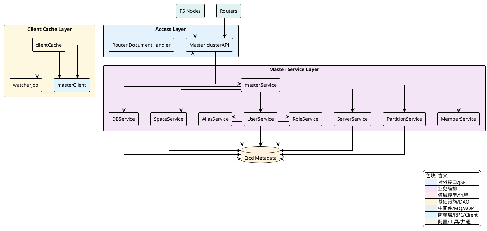
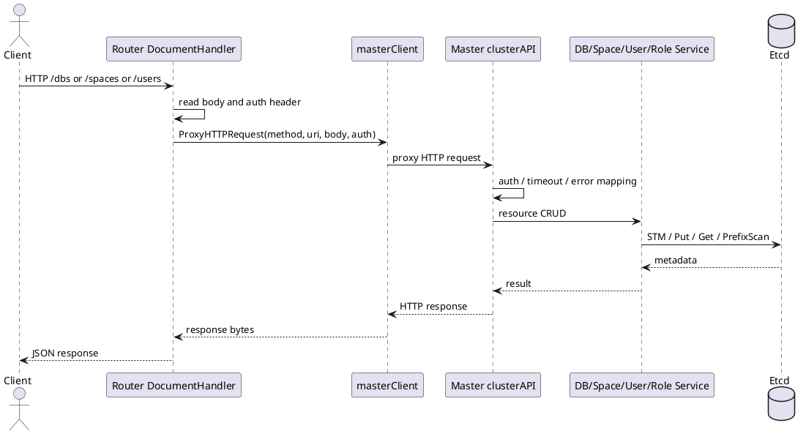
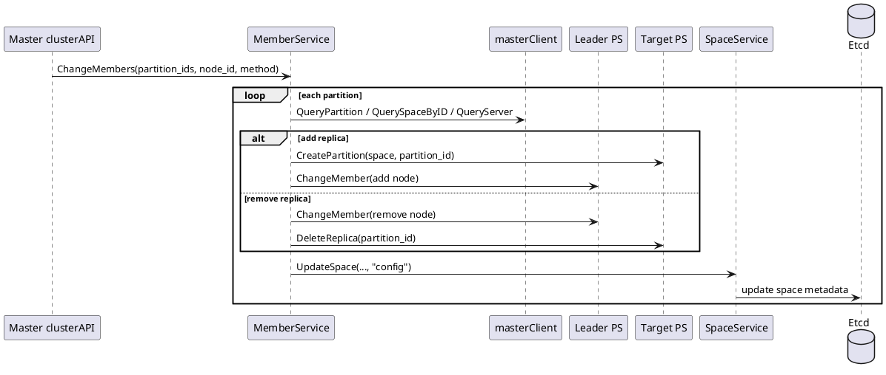

## 集群与元数据管理

Vearch 的 `Master` 承担了两类连续发生的工作：一类是面向业务资源的元数据管理，覆盖 `DB`、`Space`、`Alias`、`User`、`Role` 的增删改查；另一类是面向运行中集群的治理，覆盖 `PS`、`Router`、`Partition`、`Member`、`FailServer` 与调度接口。两类工作都以 `Etcd` 为落点，但它们不是简单地“写入一个键值”，而是围绕一致性更新、节点注册、路由缓存同步和副本变更编排形成了一套完整链路。

从入口上看，`Router` 把一部分管理型 HTTP 请求直接代理给 `Master`。从落地上看，`Master` 将资源定义和集群状态持久化到 `Etcd`。从读取上看，客户端侧维护了一套 `master cache`，通过前缀扫描与持续 watch，把 `DB/Space/Partition/Server/Alias/User/Role/Master/Router` 等元数据保存在本地缓存里，使请求转发与路由计算不必每次都直接访问 `Etcd`。



### 核心职责边界

`cluster_api` 不是把所有逻辑都堆在控制器里，而是把协议处理、鉴权、超时控制和错误映射留在 HTTP 层，把真正的业务动作下沉到 `masterService` 聚合的各个子服务。`masterService` 只是一个服务门面，它把资源与治理能力按领域拆成 `DB`、`Space`、`Alias`、`User`、`Role`、`Server`、`Partition`、`Member`、`Config`、`Backup` 等服务对象。

这种分层在实现上非常直接。路由注册统一放在 `ExportToClusterHandler`，而具体资源操作则转发给相应服务。这样，HTTP 层关注的是“请求是否有效、是否允许、如何返回”，服务层关注的是“状态如何更新、如何写入 `Etcd`、是否需要并发控制”。

[internal/master/cluster_service.go:22-90]()
```go
type masterService struct {
	*client.Client
	dbService        *services.DBService
	spaceService     *services.SpaceService
	aliasService     *services.AliasService
	serverService    *services.ServerService
	userService      *services.UserService
	roleService      *services.RoleService
	partitionService *services.PartitionService
	memberService    *services.MemberService
	configService    *services.ConfigService
	backupService    *services.BackupService
}
```

[internal/master/cluster_api.go:244-354]()
```go
func ExportToClusterHandler(router *gin.Engine, masterService *masterService, server *Server) {
	c := &clusterAPI{router: router, masterService: masterService, server: server}
	router.Use(RecoveryMiddleware())
	router.Use(TimeoutMiddleware(10 * time.Second))

	var groupAuth *gin.RouterGroup
	var group *gin.RouterGroup = router.Group("")
	if !config.Conf().Global.SkipAuth {
		groupAuth = router.Group("", BasicAuthMiddleware(masterService))
	} else {
		groupAuth = router.Group("")
	}

	group.POST("/register", c.register)
	group.POST("/register_partition", c.registerPartition)
	group.POST("/register_router", c.registerRouter)

	groupAuth.POST(fmt.Sprintf("/dbs/:%s", paramDbName), c.createDB)
	groupAuth.GET("/dbs", c.getDB)
	groupAuth.POST(fmt.Sprintf("/dbs/:%s/spaces", paramDbName), c.createSpace)
	groupAuth.POST("/partitions/change_member", c.changeMember)
	groupAuth.POST("/schedule/recover_server", c.RecoverFailServer)
	groupAuth.POST("/schedule/change_replicas", c.ChangeReplicas)
	groupAuth.POST("/users", c.createUser)
	groupAuth.POST("/roles", c.createRole)
}
```

这里还有两个和元数据管理强关联的横切能力。其一是 `BasicAuthMiddleware`，它从 `Authorization` 头解析用户，再经由 `RoleService` 做权限校验。其二是 `handleError`，它把 `vearchpb.ErrorEnum` 映射成明确的 HTTP 状态码，使上层调用者能区分参数错误、鉴权失败、资源不存在和内部错误。

<details>
<summary>关联代码</summary>

[internal/master/cluster_api.go:63-161](),[internal/master/cluster_api.go:244-354](),[internal/master/cluster_service.go:22-90]()

</details>

### Router 到 Master 的代理链路

业务侧通常不会直接把所有管理请求打到某个 `Master` 节点，而是通过 `Router` 进入。`DocumentHandler` 在 `proxyMaster` 中显式注册了 `/dbs`、`/spaces`、`/alias`、`/users`、`/roles`、`/partitions`、`/schedule`、`/members` 等一整组管理型路由，它们统一进入 `handleMasterRequest`。

`handleMasterRequest` 的工作很克制：读取原始请求体，保留上游 `Authorization` 头，随后调用 `client.Master().ProxyHTTPRequest` 把原始 `method`、`RequestURI`、`body` 原样转发给某个 `Master`。这意味着路由层并不解释这些管理语义，也不改写协议，只充当转发入口。

[internal/router/document/doc_http.go:189-300]()
```go
func (handler *DocumentHandler) proxyMaster(group *gin.RouterGroup) error {
	group.POST(fmt.Sprintf("/dbs/:%s", URLParamDbName), handler.handleMasterRequest)
	group.GET("/dbs", handler.handleMasterRequest)
	group.POST(fmt.Sprintf("/dbs/:%s/spaces", URLParamDbName), handler.handleMasterRequest)
	group.POST("/partitions/change_member", handler.handleMasterRequest)
	group.POST("/schedule/recover_server", handler.handleMasterRequest)
	group.POST("/users", handler.handleMasterRequest)
	group.POST("/roles", handler.handleMasterRequest)
	return nil
}

func (handler *DocumentHandler) handleMasterRequest(c *gin.Context) {
	method := c.Request.Method
	bodyBytes, err := io.ReadAll(c.Request.Body)
	if err != nil { ... }

	authHeader := c.GetHeader("Authorization")
	res, err := handler.client.Master().ProxyHTTPRequest(
		method, c.Request.RequestURI, string(bodyBytes), authHeader,
	)
    ...
}
```

`ProxyHTTPRequest` 本身会从当前配置中获取 `Master` 列表，构造一个可重试的目标选择过程。它与内部使用根签名调用的 `HTTPRequest` 不同，前者保留调用者的鉴权上下文，后者则用于集群内部任务。对于 `Router` 来说，这条链路保证了用户身份不会在代理过程中丢失。

[internal/client/master.go:627-700]()
```go
func (m *masterClient) ProxyHTTPRequest(method string, url string, reqBody string, authHeader string) (response []byte, e error) {
	query := netutil.NewQuery().SetHeader(Authorization, authHeader)
	query.SetMethod(method)
	query.SetUrlPath(url)
	query.SetReqBody(reqBody)
	query.SetContentTypeJson()
	query.SetTimeout(60)

	var masterServer = &MasterServer{}
	ms := m.Config().GetMasters()
	masterServer.init(len(ms))

	for {
		keyNumber, err := masterServer.getKey()
		if err != nil {
			return nil, err
		}
		query.SetAddress(ms[keyNumber].ApiUrl())
		statusCode := 0
		response, statusCode, err = query.ProxyDo()
		if statusCode != -1 {
			e = err
			break
		}
	}
	return response, e
}
```

因此，`/dbs|/spaces|/users|/roles` 这类元数据请求的主干路径实际是：`Router -> handleMasterRequest -> masterClient.ProxyHTTPRequest -> Master clusterAPI -> 各 Service -> Etcd`。业务语义由 `Master` 解释，转发链路只负责把请求可靠送达。



<details>
<summary>关联代码</summary>

[internal/router/document/doc_http.go:189-300](),[internal/client/master.go:627-700](),[internal/master/cluster_api.go:244-354]()

</details>

### 元数据如何落到 Etcd

`DB`、`Alias`、`User`、`Role` 的 CRUD 都采用了同一类模式：先做领域校验，再申请一个按资源粒度划分的分布式锁，最后在 `STM` 事务里写入或删除 `Etcd` 键。这里的重点不是“把对象序列化后保存”，而是保证名称索引、ID 索引和正文之间的状态一致。

`DBService.CreateDB` 最完整地体现了这条路径。它先校验资源上限、名称合法性和私有 `PS` 列表，再生成新的 `DB ID`，之后对 `entity.LockDBKey(db.Name)` 加锁，并在一个 `STM` 中同时写入 `name -> id`、`id -> name` 和 `body` 三类键。这样，按名查、按 ID 查、列举 `DB` 正文都使用同一份事务结果。

[internal/master/services/db_service.go:42-98]()
```go
func (s *DBService) CreateDB(ctx context.Context, db *entity.DB) (err error) {
	mc := s.client.Master()

	if err = db.Validate(); err != nil {
		return err
	}
	if err = s.validatePS(ctx, db.Ps); err != nil {
		return err
	}

	db.Id, err = mc.NewIDGenerate(ctx, entity.DBIdSequence, 1, 5*time.Second)
	if err != nil {
		return err
	}

	mutex := mc.NewLock(ctx, entity.LockDBKey(db.Name), time.Second*300)
	if err = mutex.Lock(); err != nil {
		return err
	}
	defer mutex.Unlock()

	err = mc.STM(context.Background(), func(stm concurrency.STM) error {
		idKey, nameKey, bodyKey := mc.DBKeys(db.Id, db.Name)

		if stm.Get(nameKey) != "" {
			return vearchpb.NewError(vearchpb.ErrorEnum_DB_EXIST, fmt.Errorf("dbname %s already exists", db.Name))
		}
		if stm.Get(idKey) != "" {
			return vearchpb.NewError(vearchpb.ErrorEnum_DB_EXIST, fmt.Errorf("dbID %d already exists", db.Id))
		}
		value, err := json.Marshal(db)
		if err != nil {
			return err
		}
		stm.Put(nameKey, cast.ToString(db.Id))
		stm.Put(idKey, db.Name)
		stm.Put(bodyKey, string(value))
		return nil
	})
	return err
}
```

`AliasService`、`UserService`、`RoleService` 也保持这一模式，只是键结构更简单。它们都围绕各自的资源名加锁，再在 `STM` 中做存在性检查与写入。对调用者来说，`Master` 返回的是资源级语义；对存储层来说，行为则是带并发控制的原子更新。

[internal/master/services/alias_service.go:38-67]()
```go
func (s *AliasService) CreateAlias(ctx context.Context, alias *entity.Alias) (err error) {
	if err = alias.Validate(); err != nil {
		return err
	}
	mc := s.client.Master()
	mutex := mc.NewLock(ctx, entity.LockAliasKey(alias.Name), time.Second*30)
	if err = mutex.Lock(); err != nil {
		return err
	}
	defer mutex.Unlock()

	err = mc.STM(context.Background(), func(stm concurrency.STM) error {
		aliasKey := entity.AliasKey(alias.Name)
		value := stm.Get(aliasKey)
		if value != "" {
			return vearchpb.NewError(vearchpb.ErrorEnum_ALIAS_EXIST, nil)
		}
		marshal, err := json.Marshal(alias)
		if err != nil {
			return err
		}
		stm.Put(aliasKey, string(marshal))
		return nil
	})
	return err
}
```

[internal/master/services/user_service.go:39-80]()
```go
func (s *UserService) CreateUser(ctx context.Context, role *RoleService, user *entity.User, check_root bool) (err error) {
	if err = user.Validate(check_root); err != nil {
		return err
	}
	if user.RoleName != nil {
		if _, err := role.QueryRole(ctx, *user.RoleName); err != nil {
			return err
		}
	} else {
		return vearchpb.NewError(vearchpb.ErrorEnum_PARAM_ERROR, fmt.Errorf("role name is empty"))
	}

	mc := s.client.Master()
	mutex := mc.NewLock(ctx, entity.LockUserKey(user.Name), time.Second*30)
	if err = mutex.Lock(); err != nil {
		return err
	}
	defer mutex.Unlock()

	err = mc.STM(context.Background(), func(stm concurrency.STM) error {
		userKey := entity.UserKey(user.Name)
		if stm.Get(userKey) != "" {
			return vearchpb.NewError(vearchpb.ErrorEnum_USER_EXIST, nil)
		}
		marshal, err := json.Marshal(user)
		if err != nil {
			return err
		}
		stm.Put(userKey, string(marshal))
		return nil
	})
	return err
}
```

`RoleService.QueryRole` 还体现了一个细节：内建角色优先从 `entity.RoleMap` 返回，只有非内建角色才回落到 `Etcd`。这使得权限模型既包含静态内建角色，又支持动态角色元数据。

<details>
<summary>关联代码</summary>

[internal/master/services/db_service.go:42-188](),[internal/master/services/alias_service.go:38-172](),[internal/master/services/user_service.go:39-245](),[internal/master/services/role_service.go:38-229]()

</details>

### `Space` 元数据把资源定义和集群布局绑定在一起

`Space` 是这一章里最复杂的元数据对象，因为它并不只是“一个表定义”。它同时携带 schema、索引定义、分区数、副本数、分区规则和具体的 `Partition` 布局。也就是说，创建 `Space` 的过程天然跨越“资源定义”与“集群治理”。

`cluster_api.createSpace` 先补默认值，再做请求级校验，然后调用 `SpaceService.CreateSpace`。在服务层，先根据 `dbName` 解析 `DBId`，校验 schema 和索引定义，随后为 `Space` 申请分布式锁，检查同名空间是否已经存在。之后它生成 `Space ID`，生成所有 `Partition ID`，并按分区规则计算槽位。

[internal/master/cluster_api.go:621-699]()
```go
func (ca *clusterAPI) createSpace(c *gin.Context) {
	dbName = c.Param(paramDbName)
	refreshInterval := int32(entity.DefaultRefreshInterval)
	enableIdCache := entity.DefaultEnableIdCache
	enableRealtime := entity.DefalutEnableRealtime
	space := &entity.Space{
		RefreshInterval: &refreshInterval,
		EnableIdCache:   &enableIdCache,
		EnableRealtime:  &enableRealtime,
	}
	if err := c.ShouldBindJSON(space); err != nil { ... }

	if space.ResourceName == "" {
		space.ResourceName = defaultResourceName
	}
	if space.PartitionNum <= 0 {
		space.PartitionNum = 1
	}
	if space.ReplicaNum <= 0 {
		space.ReplicaNum = 3
	}
	if err := space.Validate(); err != nil { ... }

	space.Version = 1
	if err := ca.masterService.Space().CreateSpace(c, ca.masterService.DB(), dbName, space, false); err != nil { ... }
}
```

[internal/master/services/space_service.go:59-173]()
```go
func (s *SpaceService) CreateSpace(ctx context.Context, dbs *DBService, dbName string, space *entity.Space, isRestore bool) (err error) {
	masterClient := s.client.Master()
	if space.DBId, err = masterClient.QueryDBName2ID(ctx, dbName); err != nil {
		return err
	}

	_, err = mapping.SchemaMap(space.Fields)
	if err != nil {
		return err
	}

	spaceLock := masterClient.NewLock(ctx, entity.LockSpaceKey(dbName, spaceName), time.Second*300)
	if err = spaceLock.Lock(); err != nil {
		return err
	}
	defer spaceLock.Unlock()

	if _, err := masterClient.QuerySpaceByName(ctx, space.DBId, space.Name); err == nil {
		return vearchpb.NewError(vearchpb.ErrorEnum_SPACE_EXIST, nil)
	}

	spaceID, err := masterClient.NewIDGenerate(ctx, entity.SpaceIdSequence, 1, 5*time.Second)
	if err != nil {
		return err
	}
	space.Id = spaceID
    ...
}
```

真正让 `Space` 具备“集群语义”的是后半段。服务先筛选可用 `Server`，检查副本数与机器数量是否匹配，再把未启用的 `Space` 正文先写入 `Etcd`。随后为每个 `Partition` 选择副本节点，向对应 `PS` 并发发送建分区请求，等待所有分区就绪，最后把 `space.Enabled` 置为 `true` 并写回元数据。如果中途失败，则回滚已经创建的分区和相应 `PartitionKey`。

[internal/master/services/space_service.go:175-257]()
```go
serverPartitions, err := s.filterAndSortServer(ctx, dbs, space, servers)
if err != nil {
	return err
}

if int(space.ReplicaNum) > len(serverPartitions) {
	return fmt.Errorf("not enough partition servers, need %d replicas but only have %d",
		int(space.ReplicaNum), len(serverPartitions))
}

isSpaceDisabled := false
space.Enabled = &isSpaceDisabled
defer func() {
	if !(*space.Enabled) {
		if deleteErr := masterClient.Delete(context.Background(), entity.SpaceKey(space.DBId, space.Id)); deleteErr != nil {
			log.Error("to delete space err: %s", deleteErr.Error())
		}
	}
}()

marshaledSpace, err := json.Marshal(space)
if err != nil {
	return err
}
err = masterClient.Create(ctx, entity.SpaceKey(space.DBId, space.Id), marshaledSpace)
if err != nil {
	return err
}
...
if err := s.waitForPartitionsReady(ctx, masterClient, space.Partitions, errorChannel); err != nil {
    ...
    return err
}

isSpaceEnabled := true
space.Enabled = &isSpaceEnabled
err = s.UpdateSpaceData(ctx, space)
```

因此，`Space` 元数据的写入并不是单步动作，而是一段“先定义、再布局、再启用”的状态流转。它把逻辑对象和运行态分区布署绑定在同一个资源生命周期里。

<details>
<summary>关联代码</summary>

[internal/master/cluster_api.go:621-699](),[internal/master/services/space_service.go:59-257]()

</details>

### 注册路径把节点状态写入元数据平面

`PS` 和 `Router` 的注册入口都在 `cluster_api`。这两条路径都不走通用鉴权组，而是作为集群内部接口直接暴露给节点启动流程。

`/register` 对 `PS` 生效。它读取请求来源 IP、校验 `clusterName` 与 `nodeID`，然后调用 `ServerService.IsExistNode` 判断当前 `nodeID` 是否已被其他 IP 占用。通过检查后，`RegisterServer` 会遍历所有 `Space` 和 `SpaceConfig`，把当前 `nodeID` 所承载的 `PartitionIds` 和归属 `Space` 汇总出来，构造成一个 `Server` 返回。这个返回结果既让新启动的节点知道自己承接哪些分区，也让注册过程能够和当前元数据视图对齐。

[internal/master/cluster_api.go:444-483]()
```go
func (ca *clusterAPI) register(c *gin.Context) {
	ip := c.ClientIP()
	clusterName := c.Query("clusterName")
	nodeID := entity.NodeID(cast.ToInt64(c.Query("nodeID")))

	if clusterName == "" || nodeID == 0 {
		...
	}
	if clusterName != config.Conf().Global.Name {
		...
	}
	if err := ca.masterService.Server().IsExistNode(c, nodeID, ip); err != nil {
		...
		return
	}

	server, err := ca.masterService.Server().RegisterServer(c, ip, nodeID)
	if err != nil {
		...
		return
	}
	httpCode = response.New(c).JsonSuccess(server)
}
```

[internal/master/services/server_service.go:42-92]()
```go
func (s *ServerService) RegisterServer(ctx context.Context, ip string, nodeID entity.NodeID) (*entity.Server, error) {
	server := &entity.Server{Ip: ip}

	mc := s.client.Master()
	spaces, err := mc.QuerySpacesByKey(ctx, entity.PrefixSpace)
	if err != nil {
		return nil, err
	}

	spaceConfigs, err := mc.QuerySpaceConfigsByKey(ctx, entity.PrefixSpaceConfig)
	if err != nil {
		return nil, err
	}
    ...
	for _, s := range spaces {
		for _, p := range s.Partitions {
			for _, id := range p.Replicas {
				if nodeID == id {
					server.PartitionIds = append(server.PartitionIds, p.Id)
					server.Spaces = append(server.Spaces, s)
					break
				}
			}
		}
	}
	return server, nil
}
```

`/register_router` 的动作更轻，它主要校验集群名并返回 `Router` 自身 IP。后续 `Router` 的存在状态不是靠这次返回值维持，而是通过写入 `Etcd` 的 `router` 前缀以及缓存 watch 被其他组件感知。

`/register_partition` 则由分区领导者主动上报 `Partition` 运行状态。这里会更新时间戳，然后交给 `PartitionService.RegisterPartition` 落入 `PartitionKey`。因此，`Partition` 元数据不是只在建表时产生，运行中的领导者信息和时间戳也会持续刷新。

[internal/master/cluster_api.go:485-530]()
```go
func (ca *clusterAPI) registerRouter(c *gin.Context) {
	ip := c.ClientIP()
	clusterName := c.Query("clusterName")
	if clusterName != config.Conf().Global.Name {
		...
		return
	}
	httpCode = response.New(c).JsonSuccess(ip)
}

func (ca *clusterAPI) registerPartition(c *gin.Context) {
	partition := &entity.Partition{}
	if err := c.ShouldBindJSON(partition); err != nil { ... }

	partition.UpdateTime = time.Now().UnixNano()
	if err := ca.masterService.Partition().RegisterPartition(c, partition); err != nil {
		...
	}
}
```

[internal/master/services/partition_service.go:159-167]()
```go
func (s *PartitionService) RegisterPartition(ctx context.Context, partition *entity.Partition) error {
	log.Info("register partition:[%d] ", partition.Id)
	marshal, err := json.Marshal(partition)
	if err != nil {
		return err
	}
	mc := s.client.Master()
	return mc.Put(ctx, entity.PartitionKey(partition.Id), marshal)
}
```

这里的结果是，`Server`、`Router`、`Partition` 都会在 `Etcd` 中形成可 watch 的活动元数据，集群控制面据此维护最新路由和故障视图。

<details>
<summary>关联代码</summary>

[internal/master/cluster_api.go:444-530](),[internal/master/services/server_service.go:42-92](),[internal/master/services/partition_service.go:159-167]()

</details>

### 副本变更通过 `MemberService` 驱动真实分区成员调整

`/partitions/change_member` 是集群治理中最直接的一条路径。它接受一个 `entity.ChangeMembers` 请求，包含一组 `PartitionIDs`、目标 `NodeID` 和变更方法 `Method`，随后交给 `MemberService.ChangeMembers`。服务层再把批量请求拆成多个 `ChangeMember` 单元顺序执行。

单个分区成员变更的编排比表面复杂得多。服务首先读取 `Partition`、`Space` 和 `DB` 名称，更新内存中的副本列表草稿；然后根据 `Partition.LeaderID` 找到当前领导 `PS`；接着确定目标节点。如果是添加副本，会先对目标节点发送 `CreatePartition`，再请求领导节点执行 `ChangeMember`；如果是删除副本，则在领导节点完成成员变更后，再对目标节点执行 `DeleteReplica`。最后调用 `spaceService.UpdateSpace` 把新的副本列表写回 `Space` 元数据。

[internal/master/cluster_api.go:356-376]()
```go
func (ca *clusterAPI) changeMember(c *gin.Context) {
	cm := &entity.ChangeMembers{}
	if err := c.ShouldBindJSON(cm); err != nil {
		...
		return
	}
	if err := ca.masterService.Member().ChangeMembers(c, ca.masterService.Space(), cm); err != nil {
		...
	} else {
		httpCode = response.New(c).JsonSuccess(nil)
	}
}
```

[internal/master/services/member_service.go:102-197]()
```go
func (s *MemberService) ChangeMember(ctx context.Context, spaceService *SpaceService, cm *entity.ChangeMember) error {
	mc := s.client.Master()
	partition, err := mc.QueryPartition(ctx, cm.PartitionID)
	if err != nil {
		return err
	}

	space, err := mc.QuerySpaceByID(ctx, partition.DBId, partition.SpaceId)
	if err != nil {
		return err
	}
	dbName, err := mc.QueryDBId2Name(ctx, space.DBId)
	if err != nil {
		return err
	}

	spacePartition := space.GetPartition(cm.PartitionID)
	if cm.Method != proto.ConfRemoveNode {
		if slices.Contains(spacePartition.Replicas, cm.NodeID) {
			return vearchpb.NewError(vearchpb.ErrorEnum_PARAM_ERROR, fmt.Errorf("partition:[%d] already on server:[%d]", cm.PartitionID, cm.NodeID))
		}
		spacePartition.Replicas = append(spacePartition.Replicas, cm.NodeID)
	} else {
		...
	}

	psNode, err := mc.QueryServer(ctx, partition.LeaderID)
    ...
	targetNode, err := mc.QueryServer(ctx, cm.NodeID)
    ...

	if cm.Method == proto.ConfAddNode && targetNode != nil {
		if err := client.CreatePartition(targetNode.RpcAddr(), space, cm.PartitionID); err != nil {
			return ...
		}
	}

	if err := client.ChangeMember(psNode.RpcAddr(), cm); err != nil {
		return err
	}

	if cm.Method == proto.ConfRemoveNode && targetNode != nil && client.IsLive(targetNode.RpcAddr()) {
		if err := client.DeleteReplica(targetNode.RpcAddr(), cm.PartitionID); err != nil {
			return ...
		}
	}

	if _, err := spaceService.UpdateSpace(ctx, nil, dbName, space.Name, space, "config"); err != nil {
		return err
	}
	return nil
}
```

这个过程的关键点在于，副本变更既要更新运行中的 Raft 成员，也要更新 `Space.Partitions[].Replicas` 这份元数据定义。只有两者都更新后，控制面与数据面才保持一致。`ChangeMembers` 只是一个批处理包装层，实际的状态跃迁发生在 `ChangeMember` 内部。



<details>
<summary>关联代码</summary>

[internal/master/cluster_api.go:356-376](),[internal/master/services/member_service.go:102-210]()

</details>

### 异常节点恢复是“先补副本，再摘除故障节点”的双阶段动作

`/schedule/recover_server` 处理的是失效节点恢复。接口接收一个 `entity.RecoverFailServer`，其中包含故障节点地址和替代节点地址，然后调用 `ServerService.RecoverFailServer`。该服务会先查询旧节点和新节点的 `Server` 信息；一旦二者都可识别，就对故障节点承载的每个分区执行两步操作：先 `ConfAddNode` 把新节点加入副本组，再 `ConfRemoveNode` 把故障节点移出副本组；全部成功后再从 fail server 集合中清理该故障节点记录。

[internal/master/services/server_service.go:94-133]()
```go
func (s *ServerService) RecoverFailServer(ctx context.Context, spaceService *SpaceService, memberService *MemberService, rs *entity.RecoverFailServer) (e error) {
	mc := s.client.Master()
	targetFailServer := mc.QueryServerByIPAddr(ctx, rs.FailNodeAddr)
	newServer := mc.QueryServerByIPAddr(ctx, rs.NewNodeAddr)
	if newServer.ID <= 0 || targetFailServer.ID <= 0 {
		return vearchpb.NewError(vearchpb.ErrorEnum_PARTITION_SERVER_ERROR, fmt.Errorf("newServer or targetFailServer is nil"))
	}

	for _, pid := range targetFailServer.Node.PartitionIds {
		cm := &entity.ChangeMember{}
		cm.Method = proto.ConfAddNode
		cm.NodeID = newServer.ID
		cm.PartitionID = pid
		if e = memberService.ChangeMember(ctx, spaceService, cm); e != nil {
			return e
		}

		cm.Method = proto.ConfRemoveNode
		cm.NodeID = targetFailServer.ID
		cm.PartitionID = pid
		if e = memberService.ChangeMember(ctx, spaceService, cm); e != nil {
			return e
		}
	}
	mc.TryRemoveFailServer(ctx, targetFailServer.Node)
	return nil
}
```

这条恢复链路和普通副本变更复用了同一个 `MemberService.ChangeMember`，因此它天然继承了相同的数据面和元数据双更新过程。区别只在于，恢复服务针对的是“某个故障节点上的全部分区”，所以它是以节点为批量单位发起多次成员变更。

除此之外，`master_cache` 里还有一条和故障恢复直接相关的后台治理链。`watcherJob.serverDelete` 在发现 `/server/` 键删除、且目标节点不可达且仍承载分区时，会把该节点记入 fail server 元数据。之后后台扫描协程在拿到全局锁后，会查询所有 fail server，并尝试寻找满足条件的空闲节点，对每个故障分区先调用 `/partitions/change_member` 添加新副本，再调用同一接口移除故障节点，最后清理或更新 fail server 记录。

[internal/client/master_cache.go:963-1003]()
```go
func (w *watcherJob) serverDelete(cacheKey string) (err error) {
    ...
	mutex := w.masterClient.Client().Master().NewLock(w.ctx, entity.ClusterWatchServerKeyDelete, time.Second*188)
	if getLock, err := mutex.TryLock(); getLock && err == nil {
		...
		failServer := get.(*entity.Server)
		if IsLive(failServer.RpcAddr()) || len(failServer.PartitionIds) == 0 {
			return nil
		}

		err = w.masterClient.PutFailServerByID(w.ctx, nodeID, failServer)
		errutil.ThrowError(err)
	}
	w.cache.Delete(cacheServerKey(nodeID))
	return err
}
```

[internal/client/master_cache.go:1210-1287]()
```go
fs, err := wj.masterClient.QueryAllFailServer(wj.ctx)
...
for _, failServer := range fs {
    ...
    cm := &entity.ChangeMembers{
        PartitionIDs: []entity.PartitionID{failPid},
        NodeID:       availableServers[0].ID,
        Method:       proto.ConfAddNode,
    }
    reqBody, err := vjson.Marshal(cm)
    response, err := wj.masterClient.HTTPRequest(wj.ctx, http.MethodPost, "/partitions/change_member?timeout=60000", string(reqBody))
    ...
    cm = &entity.ChangeMembers{
        PartitionIDs: []entity.PartitionID{failPid},
        NodeID:       failServer.ID,
        Method:       proto.ConfRemoveNode,
    }
    response, err = wj.masterClient.HTTPRequest(wj.ctx, http.MethodPost, "/partitions/change_member?timeout=60000", string(reqBody))
    ...
}
```

可以看到，异常节点恢复既支持显式的管理接口，也存在一条依赖 watch 与扫描任务的后台恢复路径。两者最终都收敛到相同的成员变更接口，因此恢复动作的核心实现是一致的。

<details>
<summary>关联代码</summary>

[internal/master/services/server_service.go:94-133](),[internal/client/master_cache.go:963-1003](),[internal/client/master_cache.go:1210-1287](),[internal/master/services/member_service.go:102-210]()

</details>

### Router 缓存如何把 `Etcd` 元数据转成可直接消费的本地视图

`internal/client/master_cache.go` 是元数据平面的读侧实现。它维护多组本地缓存：`userCache`、`spaceCache`、`spaceIDCache`、`partitionCache`、`serverCache`、`aliasCache`、`roleCache`、`mastersCache`、`routerCache`。初始化时会先做一次全量加载，之后每类资源都对应一个 `watcherJob` 持续消费相应前缀上的变更事件。

这种机制带来的结果不是简单的“做缓存”，而是把 `Etcd` 的键空间转成按业务对象可直接查询的本地对象视图。比如 `SpaceByCache` 用的是 `db/space` 复合键，`PartitionByCache` 用的是 `space/pid` 键，`Server` 用的是 `nodeID`。当 watch 事件到达时，缓存层会做必要的补充查询、版本比较和过滤，保证本地视图和业务读取方式一致。

[internal/client/master_cache.go:423-500]()
```go
func (cliCache *clientCache) startCacheJob(ctx context.Context) error {
	if err := cliCache.initUser(ctx); err != nil {
		return err
	}
	userJob := watcherJob{ctx: ctx, prefix: entity.PrefixUser, masterClient: cliCache.mc, cache: cliCache.userCache, ...}
	userJob.start()

	if err := cliCache.initSpace(ctx); err != nil {
		return err
	}
	spaceJob := watcherJob{ctx: ctx, prefix: entity.PrefixSpace, masterClient: cliCache.mc, cache: cliCache.spaceCache,
		put: func(key, value []byte) (err error) {
			space := &entity.Space{}
			if err := vjson.Unmarshal(value, space); err != nil {
				return err
			}
			if space.ResourceName != config.Conf().Global.ResourceName {
				return nil
			}
			dbName, err := cliCache.mc.QueryDBId2Name(ctx, space.DBId)
			if err != nil {
				return ...
			}
			ckey := CacheSpaceKey(dbName, space.Name)
			if oldValue, b := cliCache.spaceCache.Get(ckey); !b || space.Version > oldValue.(*entity.Space).Version {
				cliCache.spaceCache.Set(ckey, space, cache.NoExpiration)
				cliCache.spaceIDCache.Set(cast.ToString(space.Id), space, cache.NoExpiration)
			}
			return nil
		},
	}
	spaceJob.start()
    ...
}
```

`watcherJob.start` 则提供了通用的 watch 执行框架。它持续调用 `WatchPrefix`，消费 `PUT/DELETE` 事件，并将每个事件委托给资源自定义的 `put`/`delete` 回调。若 watch 被取消或异常中断，则外层循环会再次启动，保证缓存同步不因为单次 watch 中断而永久停止。

[internal/client/master_cache.go:1102-1166]()
```go
func (wj *watcherJob) start() {
	go func() {
		for {
			select {
			case <-wj.ctx.Done():
				return
			default:
			}

			wj.wg.Add(1)
			go func() {
				defer wj.wg.Done()

				watcher, err := wj.masterClient.WatchPrefix(wj.ctx, wj.prefix)
				if err != nil {
					time.Sleep(1 * time.Second)
					return
				}

				for reps := range watcher {
					if reps.Canceled {
						return
					}
					for _, event := range reps.Events {
						switch event.Type {
						case mvccpb.PUT:
							err := wj.put(event.Kv.Key, event.Kv.Value)
							if err != nil { ... }
						case mvccpb.DELETE:
							err := wj.delete(string(event.Kv.Key))
							if err != nil { ... }
						}
					}
				}
			}()
            ...
		}
	}()
}
```

对于 `Router` 来说，这套缓存的意义在于它不需要每次处理文档或管理请求都去重新解析整个元数据图谱。它可以用 `SpaceByCache`、`PartitionByCache`、`AliasByCache`、`UserByCache`、`RoleByCache` 等读取本地视图，同时通过 watch 保持和 `Master` 的控制面同步。于是，“元数据落在 `Etcd`”和“Router 持有可读缓存”之间并不是离散关系，而是由这组前缀 watch 持续连接起来的。

<details>
<summary>关联代码</summary>

[internal/client/master_cache.go:56-87](),[internal/client/master_cache.go:118-327](),[internal/client/master_cache.go:423-657](),[internal/client/master_cache.go:909-1166]()

</details>