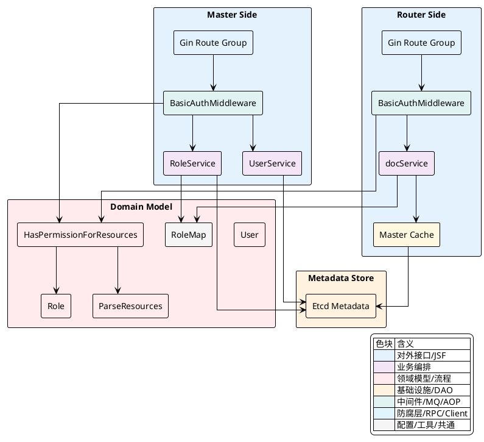
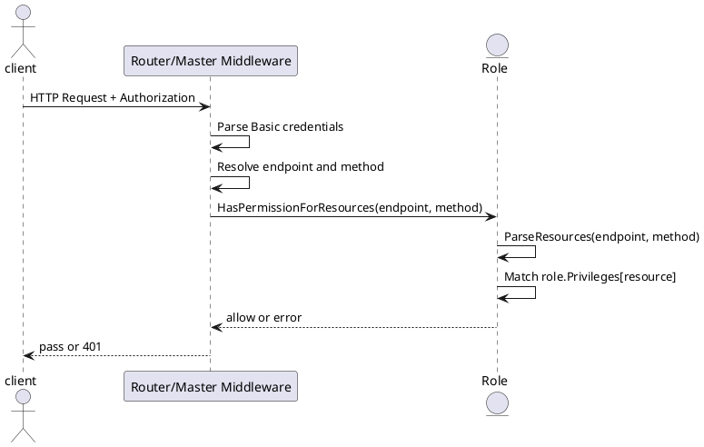
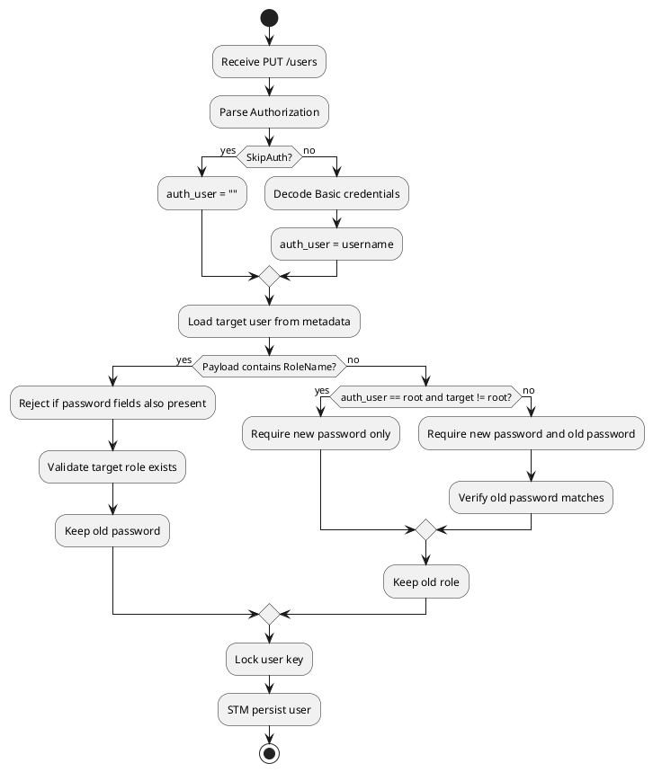

## 安全与权限模型

Vearch 的权限控制建立在一条非常直接的链路上：请求先经过可选的 `BasicAuth` 身份校验，再把访问的 HTTP 路径和方法映射成资源与权限类型，最后交给角色对象执行资源级、方法级授权判断。这个机制同时存在于 `Router` 与 `Master` 两侧，只是两者读取用户与角色信息的方式略有不同。

`Router` 侧面向文档写入、查询、搜索等数据面请求，它通过缓存读取用户和角色；`Master` 侧面向库、空间、别名、用户、角色、备份、集群管理等控制面请求，它直接调用角色服务读取用户与角色。两侧最终都收敛到同一个授权入口：`Role.HasPermissionForResources(endpoint, method)`。

### 认证与授权边界

权限模型里有两个边界最值得先固定下来。

第一层边界是“是否启用鉴权”。无论 `Router` 还是 `Master`，都会检查 `config.Conf().Global.SkipAuth`。当该开关为 `false` 时，请求被挂载到带鉴权中间件的路由组；当开关为 `true` 时，请求直接跳过认证授权逻辑。

第二层边界是“认证只解决你是谁，授权决定你能做什么”。在实现上，用户名密码仅用于找到用户并比对密码；真正决定放行与否的是用户绑定的角色，以及该角色对当前资源是否具备足够权限。



<details>
<summary>关联代码</summary>

[internal/router/document/doc_http.go:68-130](),[internal/router/document/doc_http.go:167-187](),[internal/master/cluster_api.go:98-160](),[internal/master/cluster_api.go:244-255]()

</details>

### `Router` 侧：文档请求的 `BasicAuth` 链路

`Router` 的鉴权中间件定义在 `internal/router/document/doc_http.go` 中。它只做四件事：读取 `Authorization` 头、解析 `Basic` 凭据、查找用户与角色、按当前访问端点做授权判断。处理过程没有引入额外状态，全部围绕当前请求上下文完成。

核心逻辑如下，先校验请求头格式，再把 Base64 解码后的字符串按 `username:password` 解析：

[internal/router/document/doc_http.go:68-99]()
```go
func BasicAuthMiddleware(docService docService) gin.HandlerFunc {
	return func(c *gin.Context) {
		authHeader := c.GetHeader("Authorization")
		if authHeader == "" {
			err := fmt.Errorf("auth header is empty")
			response.New(c).JsonError(errors.NewErrUnauthorized(err))
			c.Abort()
			return
		}

		parts := strings.SplitN(authHeader, " ", 2)
		if len(parts) != 2 || parts[0] != "Basic" {
			err := fmt.Errorf("auth header type is invalid")
			response.New(c).JsonError(errors.NewErrUnauthorized(err))
			c.Abort()
			return
		}

		decoded, err := base64.StdEncoding.DecodeString(parts[1])
		if err != nil {
			response.New(c).JsonError(errors.NewErrUnauthorized(err))
			c.Abort()
			return
		}

		credentials := strings.SplitN(string(decoded), ":", 2)
		if len(credentials) != 2 {
			err := fmt.Errorf("auth header credentials is invalid")
			response.New(c).JsonError(errors.NewErrUnauthorized(err))
			c.Abort()
			return
		}
```

完成解码后，`Router` 不直接操作底层元数据，而是通过 `docService` 从缓存读取用户和角色。用户密码通过 `user.Password` 与请求密码直接比较；角色取回后，再用请求的 `FullPath` 和 HTTP 方法做授权判断。

[internal/router/document/doc_http.go:101-128]()
```go
		user, err := docService.getUser(c, credentials[0])
		if err != nil {
			ferr := fmt.Errorf("auth header user %s is invalid", credentials[0])
			response.New(c).JsonError(errors.NewErrUnauthorized(ferr))
			c.Abort()
			return
		}
		if *user.Password != credentials[1] {
			err := fmt.Errorf("auth header password is invalid")
			response.New(c).JsonError(errors.NewErrUnauthorized(err))
			c.Abort()
			return
		}
		role, err := docService.getRole(c, *user.RoleName)
		if err != nil {
			response.New(c).JsonError(errors.NewErrUnauthorized(err))
			c.Abort()
			return
		}
		endpoint := c.FullPath()
		method := c.Request.Method
		if err := role.HasPermissionForResources(endpoint, method); err != nil {
			response.New(c).JsonError(errors.NewErrUnauthorized(err))
			c.Abort()
			return
		}

		c.Next()
	}
}
```

这里的关键点不在于“有没有用户”，而在于 `Router` 只关心当前文档 API 被归类成什么资源。也就是说，一个请求即使用户名密码正确，只要角色对 `ResourceDocument` 或 `ResourceIndex` 不具备匹配权限，仍然会被拒绝。

`Router` 读取用户与角色时依赖 `Master().Cache()`。这使得文档面请求不必每次都直接从元数据存储读取角色定义。与此同时，内置角色优先从 `entity.RoleMap` 返回，避免了对默认角色的存储依赖。

[internal/router/document/doc_service.go:138-148]()
```go
func (docService *docService) getUser(ctx context.Context, userName string) (*entity.User, error) {
	return docService.client.Master().Cache().UserByCache(ctx, userName)
}

func (docService *docService) getRole(ctx context.Context, roleName string) (*entity.Role, error) {
	if value, exists := entity.RoleMap[roleName]; exists {
		role := &value
		return role, nil
	}
	return docService.client.Master().Cache().RoleByCache(ctx, roleName)
}
```

<details>
<summary>关联代码</summary>

[internal/router/document/doc_http.go:68-130](),[internal/router/document/doc_service.go:138-148]()

</details>

### `Master` 侧：控制面请求的 `BasicAuth` 链路

`Master` 侧的鉴权逻辑与 `Router` 保持同构：头解析、凭据解码、用户查询、密码比对、角色查询、权限判定。不同点在于，`Master` 通过 `masterService.Role()` 直接执行业务服务调用，而不是走 `docService` 缓存封装。

[internal/master/cluster_api.go:98-160]()
```go
func BasicAuthMiddleware(masterService *masterService) gin.HandlerFunc {
	return func(c *gin.Context) {
		authHeader := c.GetHeader("Authorization")
		if authHeader == "" {
			err := fmt.Errorf("auth header is empty")
			response.New(c).JsonError(errors.NewErrUnauthorized(err))
			c.Abort()
			return
		}

		parts := strings.SplitN(authHeader, " ", 2)
		if len(parts) != 2 || parts[0] != "Basic" {
			err := fmt.Errorf("auth header type is invalid")
			response.New(c).JsonError(errors.NewErrUnauthorized(err))
			c.Abort()
			return
		}

		decoded, err := base64.StdEncoding.DecodeString(parts[1])
		if err != nil {
			response.New(c).JsonError(errors.NewErrUnauthorized(err))
			c.Abort()
			return
		}

		credentials := strings.SplitN(string(decoded), ":", 2)
		if len(credentials) != 2 {
			err := fmt.Errorf("auth header credentials is invalid")
			response.New(c).JsonError(errors.NewErrUnauthorized(err))
			c.Abort()
			return
		}

		user, err := masterService.Role().QueryUserWithPassword(c, credentials[0], true)
		if err != nil {
			ferr := fmt.Errorf("auth header user %s is invalid", credentials[0])
			response.New(c).JsonError(errors.NewErrUnauthorized(ferr))
			c.Abort()
			return
		}
		if *user.Password != credentials[1] {
			err := fmt.Errorf("auth header password is invalid")
			response.New(c).JsonError(errors.NewErrUnauthorized(err))
			c.Abort()
			return
		}

		role, err := masterService.Role().QueryRole(c, user.Role.Name)
		if err != nil {
			response.New(c).JsonError(errors.NewErrUnauthorized(err))
			c.Abort()
			return
		}
		endpoint := c.FullPath()
		method := c.Request.Method
		if err := role.HasPermissionForResources(endpoint, method); err != nil {
			response.New(c).JsonError(errors.NewErrUnauthorized(err))
			c.Abort()
			return
		}

		c.Next()
	}
}
```

`Master` 中带鉴权的路由集中挂在 `groupAuth` 上，覆盖了用户、角色、库、空间、备份、集群、成员、别名等控制面接口；少数内部注册接口仍保留在未鉴权的 `group` 上，例如分片与路由注册。

这意味着权限模型并不是“某个 handler 自行判断”，而是在路由分组层先统一过滤，再进入具体业务处理函数。控制面绝大多数资源都因此具备一致的授权入口。

[internal/master/cluster_api.go:249-354]()
```go
var groupAuth *gin.RouterGroup
var group *gin.RouterGroup = router.Group("")
if !config.Conf().Global.SkipAuth {
	groupAuth = router.Group("", BasicAuthMiddleware(masterService))
} else {
	groupAuth = router.Group("")
}

group.GET("/", c.handleClusterInfo)

// cluster handler
groupAuth.GET("/clean_lock", c.cleanLock)

// servers handler
groupAuth.GET("/servers", c.serverList)

// router  handler
groupAuth.GET("/routers", c.routerList)

// partition register, use internal so no need to auth
group.POST("/register", c.register)
group.POST("/register_partition", c.registerPartition)
group.POST("/register_router", c.registerRouter)
```

<details>
<summary>关联代码</summary>

[internal/master/cluster_api.go:98-160](),[internal/master/cluster_api.go:244-354]()

</details>

### 角色模型：资源与读写权限的表达方式

Vearch 的授权不是把权限直接绑到接口字符串上，而是先把权限抽象为“资源 + 权限类型”。资源定义覆盖了集群治理和数据访问两类对象，例如 `ResourceDB`、`ResourceSpace`、`ResourceDocument`、`ResourceUser`、`ResourceRole` 等；权限类型则是 `ReadOnly`、`WriteOnly`、`WriteRead`。

这种表示方式决定了授权判断的核心输入只有两个：当前请求落在哪个资源上，以及当前请求需要读权限还是写权限。

[internal/entity/user.go:27-59]()
```go
type Privilege string

const (
	None      Privilege = "None"
	WriteOnly Privilege = "WriteOnly"
	ReadOnly  Privilege = "ReadOnly"
	WriteRead Privilege = "WriteRead"
)

type Resource string

const (
	ResourceAll       Resource = "ResourceAll"
	ResourceCluster   Resource = "ResourceCluster"
	ResourceServer    Resource = "ResourceServer"
	ResourcePartition Resource = "ResourcePartition"
	ResourceDB        Resource = "ResourceDB"
	ResourceSpace     Resource = "ResourceSpace"
	ResourceDocument  Resource = "ResourceDocument"
	ResourceIndex     Resource = "ResourceIndex"
	ResourceAlias     Resource = "ResourceAlias"
	ResourceUser      Resource = "ResourceUser"
	ResourceRole      Resource = "ResourceRole"
	ResourceConfig    Resource = "ResourceConfig"
	ResourceCache     Resource = "ResourceCache"
)
```

角色自身的数据结构也非常紧凑，核心就是一个 `Privileges` 映射表：

[internal/entity/user.go:84-88]()
```go
type Role struct {
	Name       string                 `json:"name,omitempty"`
	Operator   OperatorType           `json:"operator,omitempty"`
	Privileges map[Resource]Privilege `json:"privileges,omitempty"`
}
```

系统还预置了一组默认角色，直接保存在 `RoleMap` 中。只要角色名称命中这个内置映射，就不必再到存储层读取。这里最特殊的是 `root`，它拥有 `ResourceAll: WriteRead`，在授权函数里也被单独短路放行。

| 角色名 | 权限特征 |
|---|---|
| `root` | 拥有 `ResourceAll` 的 `WriteRead` |
| `defaultClusterAdmin` | 覆盖集群、服务、分区、库、空间、文档、索引、别名、配置、用户、角色 |
| `defaultSpaceAdmin` | 以空间、文档、索引为主，别名只读 |
| `defaultDocumentAdmin` | 文档与索引读写 |
| `defaultReadDBSpaceEditDocument` | 集群、库、空间只读，文档与索引读写 |
| `defaultReadSpaceEditDocument` | 空间只读，文档与索引读写 |

[internal/entity/user.go:141-155]()
```go
var RootRole = Role{Name: "root", Privileges: RootPrivilege}
var ClusterAdminRole = Role{Name: "defaultClusterAdmin", Privileges: ClusterPrivilege}
var SpaceAdminRole = Role{Name: "defaultSpaceAdmin", Privileges: SpaceAdminPrivilege}
var DocumentAdminRole = Role{Name: "defaultDocumentAdmin", Privileges: DocumentAdminPrivilege}
var ReadDBSpaceEditDocumentRole = Role{Name: "defaultReadDBSpaceEditDocument", Privileges: ReadDBSpaceEditDocumentPrivilege}
var ReadSpaceEditDocumentRole = Role{Name: "defaultReadSpaceEditDocument", Privileges: ReadSpaceEditDocumentPrivilege}

var RoleMap = map[string]Role{
	"root":                           RootRole,
	"defaultClusterAdmin":            ClusterAdminRole,
	"defaultSpaceAdmin":              SpaceAdminRole,
	"defaultDocumentAdmin":           DocumentAdminRole,
	"defaultReadDBSpaceEditDocument": ReadDBSpaceEditDocumentRole,
	"defaultReadSpaceEditDocument":   ReadSpaceEditDocumentRole,
}
```

<details>
<summary>关联代码</summary>

[internal/entity/user.go:27-59](),[internal/entity/user.go:84-88](),[internal/entity/user.go:141-155]()

</details>

### 资源映射与授权判定

真正把 HTTP 请求转成权限判断的是 `ParseResources` 与 `HasPermissionForResources`。前者根据 `endpoint` 与 `method` 推导资源和所需权限，后者根据角色上的 `Privileges` 映射做最终匹配。

`ParseResources` 的规则有两个层次。先按 HTTP 方法区分读写，默认 `GET` 为 `ReadOnly`，其他方法为 `WriteOnly`。之后再按路径前缀归类资源。文档接口存在额外分支：虽然可能是 `POST`，但如果路径中含有 `query` 或 `search`，仍然归为 `ReadOnly`。

[internal/entity/user.go:191-269]()
```go
func ParseResources(endpoint string, method string) (resource Resource, privilege Privilege) {
	switch method {
	case "GET":
		privilege = ReadOnly
	default:
		privilege = WriteOnly
	}

	resource = ResourceAll
	if strings.HasPrefix(endpoint, "/cluster") {
		resource = ResourceCluster
		return resource, privilege
	}

	if strings.HasPrefix(endpoint, "/servers") {
		resource = ResourceServer
		return resource, privilege
	}

	if strings.HasPrefix(endpoint, "/dbs") {
		resource = ResourceDB
		if strings.Contains(endpoint, "/spaces") {
			resource = ResourceSpace
		}
		return resource, privilege
	}

	if strings.HasPrefix(endpoint, "/document") {
		resource = ResourceDocument
		if strings.Contains(endpoint, "query") || strings.Contains(endpoint, "search") {
			privilege = ReadOnly
		} else {
			privilege = WriteOnly
		}
		return resource, privilege
	}
    // ...
	return resource, privilege
}
```

`HasPermissionForResources` 的实现非常直接。`root` 角色直接通过；否则先解析当前请求需要的资源与权限，再检查角色是否声明了该资源。如果声明的值与所需权限一致，或者声明为 `WriteRead`，则允许访问；若角色压根没有该资源项，则返回认证失败错误。

[internal/entity/user.go:300-313]()
```go
func (role *Role) HasPermissionForResources(endpoint string, method string) error {
	if role.Name == RootName {
		return nil
	}
	resource, privilege := ParseResources(endpoint, method)
	if value, ok := role.Privileges[resource]; ok {
		if privilege == value || value == WriteRead {
			return nil
		}
	} else {
		return vearchpb.NewError(vearchpb.ErrorEnum_AUTHENTICATION_FAILED, fmt.Errorf("role:%s don't have privilege for resource: %s", role.Name, resource))
	}
	return nil
}
```

这里有一个实现细节值得单独指出：当角色包含该资源，但权限值既不是所需权限也不是 `WriteRead` 时，函数最终仍然返回 `nil`。例如角色对某资源是 `ReadOnly`，请求却需要 `WriteOnly`，当前实现不会走 `else` 分支，也不会显式报错。这使得“资源已声明但权限不足”的场景没有被拒绝，而“资源不存在”才会报错。文档行为必须以这段实际代码为准。



<details>
<summary>关联代码</summary>

[internal/entity/user.go:191-269](),[internal/entity/user.go:300-313](),[internal/router/document/doc_http.go:120-123](),[internal/master/cluster_api.go:151-154]()

</details>

### 用户与角色数据的读取方式

在权限链路里，用户和角色是两个独立对象。用户记录了用户名、密码和绑定角色名；角色记录了资源权限表。认证阶段需要用户密码，授权阶段需要角色权限，因此二者总是成对读取。

用户与用户视图结构如下：

[internal/entity/user.go:315-327]()
```go
type User struct {
	Name        string  `json:"name"`
	Password    *string `json:"password,omitempty"`
	OldPassword *string `json:"old_password,omitempty"`
	RoleName    *string `json:"role_name,omitempty"`
}

type UserRole struct {
	Name        string  `json:"name"`
	Password    *string `json:"password,omitempty"`
	OldPassword *string `json:"old_password,omitempty"`
	Role        Role    `json:"role,omitempty"`
}
```

`Master` 侧用于鉴权的是 `RoleService.QueryUserWithPassword`。这个接口会读取用户元数据，并在 `check_role` 为 `true` 时将角色一并组装进 `UserRole`。由于鉴权中间件要做密码比对，所以这里返回的 `UserRole` 会保留 `Password` 字段。

[internal/master/services/role_service.go:149-178]()
```go
func (s *RoleService) QueryUserWithPassword(ctx context.Context, user_name string, check_role bool) (userRole *entity.UserRole, err error) {
	user := &entity.User{Name: user_name}

	mc := s.client.Master()
	bs, err := mc.Get(ctx, entity.UserKey(user_name))
	if err != nil {
		return nil, err
	}

	if bs == nil {
		return nil, vearchpb.NewError(vearchpb.ErrorEnum_USER_NOT_EXIST, nil)
	}

	err = json.Unmarshal(bs, user)
	if err != nil {
		return nil, vearchpb.NewError(vearchpb.ErrorEnum_PARAM_ERROR, fmt.Errorf("get user:%s, err:%s", user.Name, err.Error()))
	}

	userRole = &entity.UserRole{Name: user.Name, Password: user.Password}
	if check_role {
		if role, err := s.QueryRole(ctx, *user.RoleName); err != nil {
			return nil, vearchpb.NewError(vearchpb.ErrorEnum_PARAM_ERROR, fmt.Errorf("get user:%s role:%s, err:%s", user.Name, *user.RoleName, err.Error()))
		} else {
			userRole.Role = *role
		}
	}

	return userRole, nil
}
```

角色读取则统一走 `QueryRole`。它先查 `entity.RoleMap`，命中默认角色时直接返回；命不中时再去元数据存储取自定义角色。

[internal/master/services/role_service.go:100-125]()
```go
func (s *RoleService) QueryRole(ctx context.Context, role_name string) (role *entity.Role, err error) {
	role = &entity.Role{Name: role_name}
	mc := s.client.Master()

	if value, exists := entity.RoleMap[role_name]; exists {
		role = &value
		return role, nil
	}

	bs, err := mc.Get(ctx, entity.RoleKey(role_name))
	if err != nil {
		return nil, err
	}

	if bs == nil {
		return nil, vearchpb.NewError(vearchpb.ErrorEnum_ROLE_NOT_EXIST, nil)
	}

	err = json.Unmarshal(bs, role)
	if err != nil {
		return nil, vearchpb.NewError(vearchpb.ErrorEnum_PARAM_ERROR, fmt.Errorf("get role:%s, err:%s", role.Name, err.Error()))
	}

	return role, nil
}
```

因此，两条链路的读取区别可以归纳为下面这张表：

| 侧别 | 用户读取 | 角色读取 | 读取特征 |
|---|---|---|---|
| `Router` | `docService.getUser` → `Master().Cache().UserByCache` | `docService.getRole` → 先查 `RoleMap`，再 `Cache().RoleByCache` | 依赖缓存服务 |
| `Master` | `Role().QueryUserWithPassword` | `Role().QueryRole` | 直接走角色服务与存储 |

<details>
<summary>关联代码</summary>

[internal/entity/user.go:315-327](),[internal/router/document/doc_service.go:138-148](),[internal/master/services/role_service.go:100-125](),[internal/master/services/role_service.go:149-178]()

</details>

### 用户与角色的写路径

权限模型并不只是在请求入口判定，还包含用户与角色元数据如何被创建、变更和持久化。`UserService` 与 `RoleService` 都把数据写入 `Master` 元数据存储，并在写操作前加分布式锁，再通过 `STM` 保证并发更新的一致性。

创建用户时，会先执行名称校验、角色存在性校验和密码非空校验，然后获取以用户名为粒度的锁，最后在事务里检查用户是否已存在并写入。

[internal/master/services/user_service.go:39-80]()
```go
func (s *UserService) CreateUser(ctx context.Context, role *RoleService, user *entity.User, check_root bool) (err error) {
	if err = user.Validate(check_root); err != nil {
		return err
	}

	if user.RoleName != nil {
		if _, err := role.QueryRole(ctx, *user.RoleName); err != nil {
			return err
		}
	} else {
		return vearchpb.NewError(vearchpb.ErrorEnum_PARAM_ERROR, fmt.Errorf("role name is empty"))
	}
	if user.Password == nil {
		return vearchpb.NewError(vearchpb.ErrorEnum_PARAM_ERROR, fmt.Errorf("password is empty"))
	}

	mc := s.client.Master()
	mutex := mc.NewLock(ctx, entity.LockUserKey(user.Name), time.Second*30)
	if err = mutex.Lock(); err != nil {
		return err
	}
	defer func() { _ = mutex.Unlock() }()

	err = mc.STM(context.Background(), func(stm concurrency.STM) error {
		userKey := entity.UserKey(user.Name)
		value := stm.Get(userKey)
		if value != "" {
			return vearchpb.NewError(vearchpb.ErrorEnum_USER_EXIST, nil)
		}
		marshal, err := json.Marshal(user)
		if err != nil {
			return err
		}
		stm.Put(userKey, string(marshal))
		return nil
	})
	return err
}
```

角色创建路径与此一致，只是锁粒度换成角色名，写入键换成 `RoleKey`。

[internal/master/services/role_service.go:38-67]()
```go
func (s *RoleService) CreateRole(ctx context.Context, role *entity.Role) (err error) {
	if err = role.Validate(); err != nil {
		return err
	}
	mc := s.client.Master()
	mutex := mc.NewLock(ctx, entity.LockRoleKey(role.Name), time.Second*30)
	if err = mutex.Lock(); err != nil {
		return err
	}
	defer func() { _ = mutex.Unlock() }()

	err = mc.STM(context.Background(), func(stm concurrency.STM) error {
		roleKey := entity.RoleKey(role.Name)
		value := stm.Get(roleKey)
		if value != "" {
			return vearchpb.NewError(vearchpb.ErrorEnum_ROLE_EXIST, nil)
		}
		marshal, err := json.Marshal(role)
		if err != nil {
			return err
		}
		stm.Put(roleKey, string(marshal))
		return nil
	})
	return err
}
```

角色权限变更不是全量覆盖任意对象，而是围绕 `Privileges` 映射做增删。调用方通过 `role.Operator` 指示 `Grant` 或 `Revoke`，服务端读取旧角色后在事务内合并更新。

[internal/master/services/role_service.go:180-229]()
```go
func (s *RoleService) ChangeRolePrivilege(ctx context.Context, role *entity.Role) (new_role *entity.Role, err error) {
	if err = role.Validate(); err != nil {
		return nil, err
	}

	mc := s.client.Master()
	bs, err := mc.Get(ctx, entity.RoleKey(role.Name))
	if err != nil {
		return nil, err
	}
	if bs == nil {
		return nil, vearchpb.NewError(vearchpb.ErrorEnum_ROLE_NOT_EXIST, nil)
	}
	old_role := &entity.Role{}
	err = json.Unmarshal(bs, old_role)
	if err != nil {
		return nil, vearchpb.NewError(vearchpb.ErrorEnum_PARAM_ERROR, fmt.Errorf("get role privilege:%s err:%s", old_role.Name, err.Error()))
	}

	mutex := mc.NewLock(ctx, entity.LockRoleKey(role.Name), time.Second*30)
	if err = mutex.Lock(); err != nil {
		return nil, err
	}
	defer func() { _ = mutex.Unlock() }()

	err = mc.STM(context.Background(), func(stm concurrency.STM) error {
		if len(old_role.Privileges) == 0 {
			old_role.Privileges = make(map[entity.Resource]entity.Privilege)
		}
		for resource, privilege := range role.Privileges {
			if role.Operator == entity.Grant {
				old_role.Privileges[resource] = privilege
			}
			if role.Operator == entity.Revoke {
				delete(old_role.Privileges, resource)
			}
		}
		marshal, err := json.Marshal(old_role)
		if err != nil {
			return err
		}
		stm.Put(entity.RoleKey(old_role.Name), string(marshal))
		return nil
	})
	return old_role, nil
}
```

<details>
<summary>关联代码</summary>

[internal/master/services/user_service.go:39-80](),[internal/master/services/role_service.go:38-67](),[internal/master/services/role_service.go:180-229]()

</details>

### 用户更新规则与认证身份的关系

用户更新场景把“当前是谁在操作”带入了业务规则。`Master` 的 `updateUser` handler 会再次从 `Authorization` 头中解析出当前认证用户名，并把它作为 `auth_user` 传给 `UserService.UpdateUser`。这一点说明更新用户不是单纯依靠目标用户名，还要结合操作者身份决定能否改密码以及需要哪些附加字段。

[internal/master/cluster_api.go:1393-1444]()
```go
func (ca *clusterAPI) updateUser(c *gin.Context) {
	user := &entity.User{}
	if err := c.ShouldBindJSON(user); err != nil {
		httpCode = response.New(c).JsonError(errors.NewErrBadRequest(err))
		return
	}
	auth_user := ""
	if !config.Conf().Global.SkipAuth {
		authHeader := c.GetHeader("Authorization")
		// ...
		credentials := strings.SplitN(string(decoded), ":", 2)
		// ...
		auth_user = credentials[0]
	}

	if err := ca.masterService.User().UpdateUser(c, ca.masterService.Role(), user, auth_user); err != nil {
		httpCode = response.New(c).JsonError(errors.NewErrInternal(err))
	} else {
		httpCode = response.New(c).JsonSuccess(user)
	}
}
```

`UserService.UpdateUser` 的判断分成两类。若请求里提供了 `RoleName`，则本次更新被视为“改角色”，此时禁止同时改密码，并且会保留旧密码。若没有提供 `RoleName`，则本次更新被视为“改密码”。改密码又分为两种情况：`root` 修改非 `root` 用户时，不要求提交旧密码；其他场景必须同时提交新旧密码，并验证旧密码匹配。

[internal/master/services/user_service.go:176-245]()
```go
func (s *UserService) UpdateUser(ctx context.Context, role *RoleService, user *entity.User, auth_user string) (err error) {
	// ...
	if user.RoleName != nil {
		if user.Password != nil || user.OldPassword != nil {
			return vearchpb.NewError(vearchpb.ErrorEnum_PARAM_ERROR, fmt.Errorf("don't update role or password at same time"))
		}
		if _, err := role.QueryRole(ctx, *user.RoleName); err != nil {
			return err
		}
		if old_user.Password != nil {
			user.Password = old_user.Password
		}
	} else {
		if auth_user == entity.RootName && user.Name != entity.RootName {
			if user.Password == nil {
				return vearchpb.NewError(vearchpb.ErrorEnum_PARAM_ERROR, fmt.Errorf("empty password"))
			}
			if old_user.Password != nil && *user.Password == *old_user.Password {
				return vearchpb.NewError(vearchpb.ErrorEnum_PARAM_ERROR, fmt.Errorf("password is same with old password"))
			}
		} else {
			if user.Password == nil || user.OldPassword == nil {
				return vearchpb.NewError(vearchpb.ErrorEnum_PARAM_ERROR, fmt.Errorf("empty password or old password"))
			}
			if old_user.Password != nil && *user.Password == *old_user.Password {
				return vearchpb.NewError(vearchpb.ErrorEnum_PARAM_ERROR, fmt.Errorf("password is same with old password"))
			}
			if old_user.Password != nil && *user.OldPassword != *old_user.Password {
				return vearchpb.NewError(vearchpb.ErrorEnum_PARAM_ERROR, fmt.Errorf("old password is invalid"))
			}
		}

		if old_user.RoleName != nil {
			user.RoleName = old_user.RoleName
		}
	}
    // ...
}
```

这条规则与入口鉴权形成了配合关系：中间件先确保请求人已通过身份认证并具有 `ResourceUser` 的接口权限，业务层再根据认证人身份决定密码修改时的约束条件。



<details>
<summary>关联代码</summary>

[internal/master/cluster_api.go:1393-1444](),[internal/master/services/user_service.go:176-245]()

</details>

### 权限模型覆盖的资源范围

由于授权判断依赖 `ParseResources`，所以系统实际可保护的资源范围由它明确界定。每个请求路径最终都要归到某个 `Resource` 上，权限检查并不关心更细粒度的对象实例，例如某个具体库名或空间名，而是只关注资源类别与读写性质。

| 路径模式 | 资源映射 | 权限判定规则 |
|---|---|---|
| `/cluster...` | `ResourceCluster` | `GET` 为读，其余为写 |
| `/servers...` | `ResourceServer` | `GET` 为读，其余为写 |
| `/partitions...` | `ResourcePartition` | `GET` 为读，其余为写 |
| `/dbs...` | `ResourceDB` 或 `ResourceSpace` | 如果路径包含 `/spaces` 则归到 `ResourceSpace` |
| `/backup...` | `ResourceSpace` | 按方法决定读写 |
| `/document...` | `ResourceDocument` | `query`、`search` 强制视为读，其余视为写 |
| `/index...` | `ResourceIndex` | 按方法决定读写 |
| `/alias...` | `ResourceAlias` | 按方法决定读写 |
| `/config...` | `ResourceConfig` | 按方法决定读写 |
| `/users...` | `ResourceUser` | 按方法决定读写 |
| `/roles...` | `ResourceRole` | 按方法决定读写 |
| `/cache...` | `ResourceCache` | 按方法决定读写 |

这种映射使得文档搜索与写入在授权层天然分离。即使都走 `/document`，只要路径中出现 `query` 或 `search`，就会被判成读操作；而 `upsert`、`delete` 等路径则被判成写操作。

<details>
<summary>关联代码</summary>

[internal/entity/user.go:191-269](),[internal/master/cluster_api.go:263-353](),[internal/router/document/doc_http.go:189-240]()

</details>