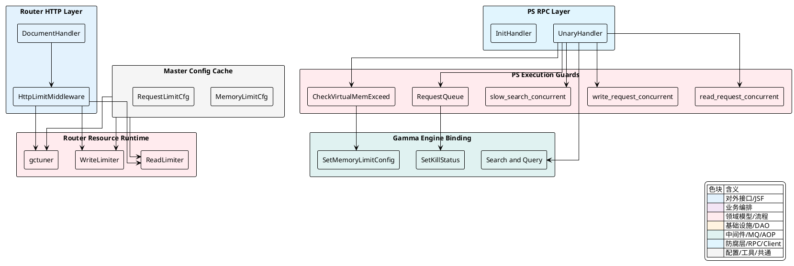
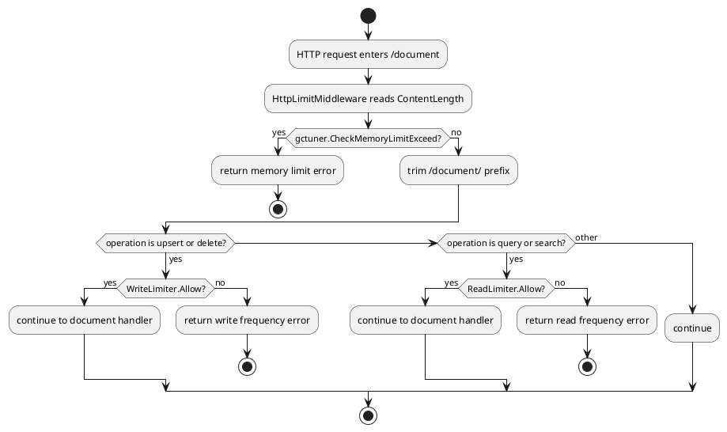
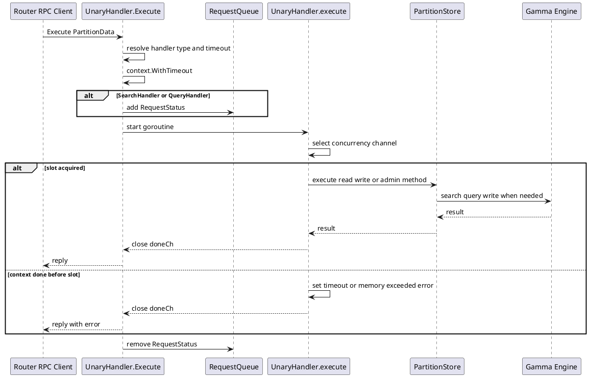
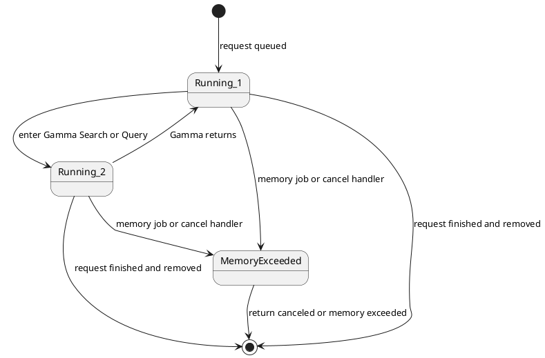

## 资源与限流治理

Vearch 的资源治理沿请求链路分成两段：`Router` 在 HTTP 入口处做请求级保护，提前拦截明显会扩大内存压力或超过集群读写吞吐预算的请求；`PS` 在分区服务内部做执行期隔离，用并发通道、超时 `Context`、请求队列和 Gamma 引擎取消机制共同约束真实计算负载。两段治理都围绕同一类业务目标展开：让写入、检索、慢查和批量序列化在可控边界内执行，并在内存压力达到阈值时快速返回或取消。

### 治理职责与链路分层

资源治理不是单点开关，而是贯穿 `Router`、`PS`、Gamma 引擎绑定层和 Master 配置缓存的协作链。`Router` 侧的 `HttpLimitMiddleware` 只覆盖 `/document` 下的 `upsert`、`delete`、`query`、`search`，处理的是 HTTP 请求进入时的准入控制。`PS` 侧的 `UnaryHandler` 承接 Router 发来的内部 RPC 请求，进入分区执行前先绑定超时和并发通道，执行中再由内存断路和请求取消机制干预。



| 层级 | 核心对象 | 触发时机 | 治理动作 | 失败表现 |
| --- | --- | --- | --- | --- |
| `Router` HTTP 入口 | `HttpLimitMiddleware` | `/document` 请求进入 | 调用 `gctuner.CheckMemoryLimitExceed`，调用 `entity.ReadLimiter.Allow` 或 `entity.WriteLimiter.Allow` | 返回 `JsonError` 并 `Abort` |
| `Router` 配置运行态 | `entity.SetRequestLimit`、`entity.SetRouterCount` | Master 配置缓存变更或 Router 数变化 | 按 `RouterCount` 分摊读写限流值，更新 `rate.Limiter` | 新请求按最新限流器准入 |
| `PS` RPC 接入 | `UnaryHandler.Execute` | 内部 RPC 到达 PS | 解析方法、建立超时 `Context`、登记读请求队列 | 超时返回 `ErrorEnum_TIMEOUT` |
| `PS` 并发隔离 | `read_request_concurrent`、`write_request_concurrent`、`slow_search_concurrent` | 分区执行前 | 不同请求类型进入不同容量的通道 | 等待期间 `Context` 结束则返回超时或内存超限错误 |
| `PS` 内存断路 | `entity.CheckVirtualMemExceed` | 批量写入前、后台慢查检查、响应反序列化前 | 判断进程内存是否超过 `MemoryLimitUsage` | 返回内存超限或取消正在执行的请求 |
| Gamma 绑定层 | `gamma.SetKillStatus`、`gamma.DeleteKillStatus` | 慢查进入 C++ 引擎后被取消 | 将取消状态同步给引擎侧 | 引擎查询返回 `request canceled` 或内存超限状态 |

治理边界与引擎业务状态是分离的。`internal/entity/engine.go` 中的 `EngineStatus` 表达索引、备份和文档数量等业务状态，不参与限流判定；资源治理主要落在 `entity.ConfigInfo`、`gctuner`、`UnaryHandler` 和 Gamma 绑定层。

<details>
<summary>关联代码</summary>

[internal/router/document/doc_http.go:132-165](),[internal/router/document/doc_http.go:306-317](),[internal/entity/config.go:21-31](),[internal/entity/config.go:47-67](),[internal/ps/server.go:50-73](),[internal/entity/engine.go:17-22]()

</details>

### Router 请求级内存保护与读写限流

`Router` 的资源治理从 `HttpLimitMiddleware` 开始。该中间件被挂载到 `/document` 路由组，因此只影响文档写入、删除、查询和搜索这些直接产生数据读写压力的接口。请求到达时，`HttpLimitMiddleware` 先根据 `ContentLength` 估算本次请求可能带来的堆内存增量，并调用 `gctuner.CheckMemoryLimitExceed` 判断当前堆使用量叠加请求体大小后是否越界。越界时，流程在业务解析前终止。

[internal/router/document/doc_http.go:132-165]()
```go
func HttpLimitMiddleware(docService docService) gin.HandlerFunc {
	return func(c *gin.Context) {
		if c.Request.ContentLength > 0 && gctuner.CheckMemoryLimitExceed(uint64(c.Request.ContentLength)) {
			msg := fmt.Sprintf("memory usage have reached limit %d before execute request", entity.ConfigInfo.MemoryLimitConfig.RouterMemoryLimit)
			log.Error(msg)
			response.New(c).JsonError(errors.NewErrInternal(fmt.Errorf(msg)))
			c.Abort()
			return
		}

		Request := strings.TrimPrefix(c.Request.RequestURI, "/document/")

		switch Request {
		case "upsert", "delete":
			if !entity.WriteLimiter.Allow() {
				msg := fmt.Sprintf("document write request too frequency, have reached limit %d", entity.WriteLimiter.Burst())
				log.Error(msg)
				response.New(c).JsonError(errors.NewErrInternal(fmt.Errorf(msg)))
				c.Abort()
				return
			}
		case "query", "search":
			if !entity.ReadLimiter.Allow() {
				msg := fmt.Sprintf("document read request too frequency, have reached limit %d", entity.ReadLimiter.Burst())
				log.Error(msg)
				response.New(c).JsonError(errors.NewErrInternal(fmt.Errorf(msg)))
				c.Abort()
				return
			}
		}

		c.Next()
	}
}
```

中间件中的第二道控制是读写限流。`upsert` 和 `delete` 使用 `entity.WriteLimiter`，`query` 和 `search` 使用 `entity.ReadLimiter`。限流器是进程内对象，默认由 `rate.NewLimiter(rate.Limit(rate.Inf), 0)` 初始化，真正的限流值来自 Master 配置缓存同步后的 `entity.SetRequestLimit` 与 `entity.SetRouterCount`。

`entity.SetRequestLimit` 将集群级的 `TotalReadLimit` 和 `TotalWriteLimit` 除以当前 `RouterCount`，写入本 Router 进程的 `ReadLimiter` 和 `WriteLimiter`。`SetRouterCount` 在 Router 节点增减时重新计算本地额度，使每个 Router 进程持有一份当前视角下的准入速率。

[internal/entity/config.go:69-121]()
```go
func SetRequestLimit(requestLimit *RequestLimitCfg) {
	if requestLimit.RequestLimitEnabled {
		ConfigInfo.RequestLimitConfig.RequestLimitEnabled = true

		if requestLimit.TotalReadLimit > 0 {
			ConfigInfo.RequestLimitConfig.TotalReadLimit = requestLimit.TotalReadLimit
		} else {
			ConfigInfo.RequestLimitConfig.TotalReadLimit = DefaultReadRequestLimitCount
		}

		if requestLimit.TotalWriteLimit > 0 {
			ConfigInfo.RequestLimitConfig.TotalWriteLimit = requestLimit.TotalWriteLimit
		} else {
			ConfigInfo.RequestLimitConfig.TotalWriteLimit = DefaultWriteRequestLimitCount
		}

		if ConfigInfo.RouterCount > 0 {
			var limit rate.Limit
			limit = rate.Limit(ConfigInfo.RequestLimitConfig.TotalReadLimit / ConfigInfo.RouterCount)
			ReadLimiter.SetLimit(limit)
			ReadLimiter.SetBurst(int(limit * 1.1))

			limit = rate.Limit(ConfigInfo.RequestLimitConfig.TotalWriteLimit / ConfigInfo.RouterCount)
			WriteLimiter.SetLimit(limit)
			WriteLimiter.SetBurst(int(limit * 1.1))
		}
	} else {
		ConfigInfo.RequestLimitConfig.RequestLimitEnabled = false

		ReadLimiter.SetLimit(rate.Inf)
		ReadLimiter.SetBurst(0)

		WriteLimiter.SetLimit(rate.Inf)
		WriteLimiter.SetBurst(0)
	}
}
```

`Router` 的内存保护由 `gctuner` 和 `entity.SetMemoryLimit` 串联。`entity.SetMemoryLimit` 在 Router 模式下计算 `MemoryLimitUsage`，并把系统内存和配置值写入 `gctuner.GlobalMemoryLimitTuner`。`gctuner.CheckMemoryLimitExceed` 读取 Go 运行时的 `HeapInuse`，用 `MemUsed + estimatedSize` 与 `serverMemLimitUsage` 比较，形成请求进入前的准入判断。

[internal/router/document/gctuner/memory_limit_check.go:24-32]()
```go
func CheckMemoryLimitExceed(estimatedSize uint64) bool {
	MemUsed := readMemoryInuse()
	memoryLimitUsage := GlobalMemoryLimitTuner.serverMemLimitUsage.Load()

	if memoryLimitUsage > 0 && MemUsed+estimatedSize > memoryLimitUsage {
		return true
	}
	return false
}
```

`gctuner.memoryLimitTuner` 同时管理 Go runtime 的 `debug.SetMemoryLimit`。当 `SetMemoryLimit` 启用 Router 内存治理时，`EnableAdjustMemoryLimit` 会更新 runtime memory limit；当配置关闭时，`DisableAdjustMemoryLimit` 将 runtime memory limit 恢复到初始化值。`CheckMemoryLimitExceed` 与 runtime memory limit 使用同一份 `serverMemLimitUsage` 运行态数据，因此入口拦截与 Go GC 触发边界保持在同一配置链路上。

[internal/entity/config.go:124-155]()
```go
func SetMemoryLimit(memLimit *MemoryLimitCfg, router bool) {
	if memLimit.MemoryLimitEnabled {
		ConfigInfo.MemoryLimitConfig.MemoryLimitEnabled = true

		if memLimit.RouterMemoryLimit > 0 {
			ConfigInfo.MemoryLimitConfig.RouterMemoryLimit = memLimit.RouterMemoryLimit
		} else {
			ConfigInfo.MemoryLimitConfig.RouterMemoryLimit = DefaultRouterMemoryLimitPercent
		}
		if router {
			MemoryLimitUsage = SystemMemory * uint64(ConfigInfo.MemoryLimitConfig.RouterMemoryLimit) / 100
			gctuner.GlobalMemoryLimitTuner.SetTotalMemory(SystemMemory)
			gctuner.GlobalMemoryLimitTuner.SetPercentage(float64(ConfigInfo.MemoryLimitConfig.RouterMemoryLimit))
			gctuner.GlobalMemoryLimitTuner.EnableAdjustMemoryLimit()
		}

		if memLimit.PsMemoryLimit > 0 {
			ConfigInfo.MemoryLimitConfig.PsMemoryLimit = memLimit.PsMemoryLimit
		} else {
			ConfigInfo.MemoryLimitConfig.PsMemoryLimit = DefaultPsMemoryLimitPercent
		}

		if !router {
			MemoryLimitUsage = SystemMemory * uint64(ConfigInfo.MemoryLimitConfig.PsMemoryLimit) / 100
		}
	} else {
		ConfigInfo.MemoryLimitConfig.MemoryLimitEnabled = false
		MemoryLimitUsage = 0
		if router {
			gctuner.GlobalMemoryLimitTuner.DisableAdjustMemoryLimit()
		}
	}
}
```



<details>
<summary>关联代码</summary>

[internal/router/document/doc_http.go:132-165](),[internal/router/document/doc_http.go:306-317](),[internal/router/document/gctuner/memory_limit_check.go:24-32](),[internal/router/document/gctuner/mem.go:21-35](),[internal/router/document/gctuner/memory_limit_tuner.go:98-149](),[internal/entity/config.go:69-155](),[internal/client/master_cache.go:665-727](),[internal/client/master_cache.go:878-896]()

</details>

### PS 并发隔离与请求执行壳

`PS` 的资源治理从 `Server` 初始化开始。`NewServer` 根据 `config.Conf().PS.ConcurrentNum` 决定基础并发容量，分别创建 `read_request_concurrent`、`write_request_concurrent` 和 `slow_search_concurrent`。读写通道容量相同，慢查通道容量为基础并发的四分之一。三类通道共同构成分区服务内部的并发隔离边界。

[internal/ps/server.go:89-99]()
```go
s.concurrentNum = defaultConcurrentNum
if config.Conf().PS.ConcurrentNum > 0 {
	s.concurrentNum = config.Conf().PS.ConcurrentNum
}
s.read_request_concurrent = make(chan bool, s.concurrentNum)
s.write_request_concurrent = make(chan bool, s.concurrentNum)
s.slow_search_concurrent = make(chan bool, s.concurrentNum/4)
s.backupStatus = make(map[uint32]int)

request.Rqueue.ReqList = list.New()
request.Rqueue.ReqMap = make(map[request.RequestId]*list.Element, s.concurrentNum)
```

每个 RPC 请求进入 `UnaryHandler.Execute` 后，先从 rpcx metadata 中读取 `client.HandlerType`，再计算请求超时时间。超时来源有三个层级：`server.rpcTimeOut` 默认值、上游 `Context` 的 deadline、metadata 中的 `entity.RPC_TIME_OUT`。最终值被转换为 `delayTime`，并用 `context.WithTimeout` 包装当前请求。

读请求在执行前会被登记到全局 `request.Rqueue`。队列项由 `RequestId` 定位，`RequestStatus` 持有原始 `PartitionData`、运行状态和 `CancelFunc`。队列只登记 `SearchHandler` 与 `QueryHandler`，因为这类请求可能在 Gamma 引擎中运行较久，需要被后台内存任务或外部取消命令定位。

[internal/ps/handler_document.go:127-161]()
```go
timeout := handler.server.rpcTimeOut * 1000
deadline, ok := ctx.Deadline()
if ok {
	timeout = int(time.Until(deadline).Seconds() * 1000)
}
if s, ok := reqMap[string(entity.RPC_TIME_OUT)]; ok {
	if t, err := strconv.Atoi(s); err == nil {
		if t > 0 {
			timeout = t
		}
	}
}
delayTime := time.Duration(timeout) * time.Millisecond
ctx, cancel := context.WithTimeout(ctx, delayTime)
defer cancel()
doneCh := make(chan struct{})

requestStatus := &request.RequestStatus{Req: req, Status: request.Running_1, CancelFunc: cancel}
requestId := request.RequestId{MessageId: req.MessageID, PartitionId: req.PartitionID}
if method == client.SearchHandler || method == client.QueryHandler {
	request.Rqueue.Mutex.Lock()
	elem := request.Rqueue.ReqList.PushBack(requestStatus)
	request.Rqueue.ReqMap[requestId] = elem
	request.Rqueue.Mutex.Unlock()
}
defer func() {
	if method == client.SearchHandler || method == client.QueryHandler {
		request.Rqueue.Mutex.Lock()
		if elem := request.Rqueue.ReqMap[requestId]; elem != nil {
			delete(request.Rqueue.ReqMap, requestId)
			request.Rqueue.ReqList.Remove(elem)
		}
		request.Rqueue.Mutex.Unlock()
	}
}()
```

真正的分区执行被放入独立 goroutine，`UnaryHandler.Execute` 等待 `doneCh` 或 `time.After(delayTime)`。这让业务执行函数可以继续使用同一个 `Context` 感知取消，而 RPC 返回路径能在超时时间到达后明确给调用方返回 `ErrorEnum_TIMEOUT`。

[internal/ps/handler_document.go:163-186]()
```go
go func(ctx context.Context, req *vearchpb.PartitionData) {
	handler.execute(ctx, req)
	close(doneCh)
}(ctx, req)
select {
case <-doneCh:
	reply.PartitionID = req.PartitionID
	reply.MessageID = req.MessageID
	reply.Items = req.Items
	reply.SearchResponse = req.SearchResponse
	reply.DelByQueryResponse = req.DelByQueryResponse
	reply.Err = req.Err
	return
case <-time.After(delayTime):
	reply.PartitionID = req.PartitionID
	reply.MessageID = req.MessageID
	reply.Items = req.Items
	msg := fmt.Sprintf("request of method[%s] time out[%dms]", method, timeout)
	reply.Err = vearchpb.NewError(vearchpb.ErrorEnum_TIMEOUT, errors.New(msg)).GetError()
	log.Error(msg)
	code = vearchpb.ErrorEnum_TIMEOUT
	return
}
```

`handler.execute` 在进入具体分区方法前选择并发通道。慢查优先进入 `slow_search_concurrent`，普通查询、搜索和文档读取进入 `read_request_concurrent`，其余批量写、删除、索引运维类 RPC 进入 `write_request_concurrent`。通道写入成功代表取得执行名额，函数退出时通过 `defer` 释放名额；如果等待通道期间 `Context` 已结束，则根据 `ctx.Err` 返回超时或内存超限。

[internal/ps/handler_document.go:215-244]()
```go
var concurrentCh chan bool
if req.SearchRequest != nil && req.SearchRequest.IsSlowSearch {
	concurrentCh = handler.server.slow_search_concurrent
} else if method == client.QueryHandler || method == client.SearchHandler ||
	method == client.GetDocsHandler || method == client.GetDocsByPartitionHandler ||
	method == client.GetNextDocsByPartitionHandler {
	concurrentCh = handler.server.read_request_concurrent
} else {
	concurrentCh = handler.server.write_request_concurrent
}

select {
case concurrentCh <- true:
	defer func() {
		<-concurrentCh
	}()
case <-ctx.Done():
	if ctx.Err() == context.DeadlineExceeded {
		msg := fmt.Sprintf("request for partition: %d time out, the server can only deal [%d] request at same time.", req.PartitionID, cap(concurrentCh))
		log.Error(msg)
		req.Err = vearchpb.NewError(vearchpb.ErrorEnum_TIMEOUT, nil).GetError()
		return
	} else {
		msg := fmt.Sprintf("request for partition: %d have been canceled", req.PartitionID)
		log.Error(msg)
		req.Err = vearchpb.NewError(vearchpb.ErrorEnum_PARTITION_SERVER_MEMORYEXCEED, nil).GetError()
		return
	}
}
```



<details>
<summary>关联代码</summary>

[internal/ps/server.go:50-73](),[internal/ps/server.go:75-115](),[internal/ps/handler_document.go:96-187](),[internal/ps/handler_document.go:189-244](),[internal/ps/handler_document.go:254-290](),[internal/entity/request/request.go:16-39]()

</details>

### PS 内存断路与慢查取消机制

`PS` 的内存治理使用 `entity.CheckVirtualMemExceed` 作为统一判断函数。该函数读取 `MemoryLimitUsage`，再通过系统运行时工具获取当前虚拟内存使用量。带 `estimatedSize` 的调用会每 10 次真正检查一次，避免批量路径中频繁读取进程内存；不带估算值的调用会直接检查当前内存压力。

[internal/entity/config.go:158-176]()
```go
func CheckVirtualMemExceed(estimatedSize int) bool {
	if MemoryLimitUsage == 0 {
		return false
	}

	if estimatedSize > 0 {
		check_count = (check_count + 1) % 10
		if check_count != 0 {
			return false
		}
	}

	VirtualMemUsage, _ := vearch_os.GetMemoryUsage()
	if VirtualMemUsage != 0 && VirtualMemUsage > MemoryLimitUsage {
		return true
	}

	return false
}
```

批量写入 `bulk` 在序列化文档前使用 `estimatedDocSize` 估算本批次内存增量，并调用 `CheckVirtualMemExceed`。如果断路触发，请求不会继续并发序列化，也不会进入 `store.Write`，而是将批次内每个 `Item` 标记为失败。

[internal/ps/handler_document.go:333-380]()
```go
func estimatedDocSize(item *vearchpb.Item) int {
	estimatedSize := 0
	for _, field := range item.Doc.Fields {
		size := len(field.Name) + len(field.Value) + 2
		estimatedSize += (size + 3) &^ 3
	}
	estimatedSize += 28*len(item.Doc.Fields) + 12 //flatbuffer stores fields offset, vtable offset,...

	return estimatedSize
}

func bulk(ctx context.Context, store PartitionStore, items []*vearchpb.Item) {
	var err error
	var vErr *vearchpb.VearchErr
	estimatedSize := estimatedDocSize(items[0])
	if entity.CheckVirtualMemExceed(estimatedSize*len(items) + 24*len(items)) {
		err = fmt.Errorf("canceled by memory circuit breaker")
		vErr = vearchpb.NewError(vearchpb.ErrorEnum_INTERNAL_ERROR, nil)
	} else {
		wg := sync.WaitGroup{}
		docBytes := make([][]byte, len(items))
		for i, item := range items {
			wg.Add(1)
			go func(item *vearchpb.Item, n int) {
				defer wg.Done()
				docGamma := &gamma.Doc{Fields: item.Doc.Fields}
				docBytes[n] = docGamma.Serialize()
				item.Doc.Fields = nil
				item.Err = vearchpb.NewError(vearchpb.ErrorEnum_SUCCESS, nil).GetError()
			}(item, i)
		}
		wg.Wait()
		docCmd := &vearchpb.DocCmd{Type: vearchpb.OpType_BULK, Docs: docBytes}

		err = store.Write(ctx, docCmd)
		vErr = vearchpb.NewError(vearchpb.ErrorEnum_INTERNAL_ERROR, err)
	}
}
```

慢查取消由 `StartKillSlowRequestJob` 周期执行。服务启动时，它先通过 `MemoryLimitHandler` 拉取并应用 PS 内存配置，然后每 5 秒检查一次 `CheckVirtualMemExceed(0)`。当内存超限且请求队列非空时，它取队头请求并尝试更新 `RequestStatus.Status`。如果请求还在 Go 侧排队或执行准备阶段，状态从 `Running_1` 切到 `MemoryExceeded` 后直接调用 `CancelFunc`。如果请求已经进入 Gamma 引擎，状态从 `Running_2` 切到 `MemoryExceeded` 后既调用 `CancelFunc`，又调用 `gamma.SetKillStatus` 把取消原因传给 C++ 引擎侧。

[internal/ps/schedule_job.go:252-283]()
```go
func (s *Server) StartKillSlowRequestJob() {
	s.wg.Add(1)
	memoryLimitHandler := &MemoryLimitHandler{server: s}
	memoryLimitHandler.Execute(s.ctx, new(vearchpb.PartitionData), new(vearchpb.PartitionData))
	go func() {
		defer s.wg.Done()

		const checkInterval = 5 * time.Second
		ticker := time.NewTicker(checkInterval)
		defer ticker.Stop()

		for {
			select {
			case <-ticker.C:
				if entity.ConfigInfo.MemoryLimitConfig.MemoryLimitEnabled && entity.CheckVirtualMemExceed(0) {
					if elem := request.Rqueue.ReqList.Front(); elem != nil {
						requestStatus, _ := elem.Value.(*request.RequestStatus)
						if atomic.CompareAndSwapInt32(&requestStatus.Status, request.Running_1, request.MemoryExceeded) {
							requestStatus.CancelFunc()
						} else if atomic.CompareAndSwapInt32(&requestStatus.Status, request.Running_2, request.MemoryExceeded) {
							requestStatus.CancelFunc()
							gamma.SetKillStatus([]byte(requestStatus.Req.MessageID), int(requestStatus.Req.PartitionID), int(request.MemoryExceeded))
						}
					}
				}
			case <-s.ctx.Done():
				log.Info("server request monitor stopped")
				return
			}
		}
	}()
}
```

Gamma 绑定层通过 `RequestQueue` 感知查询状态。`gamma.Search` 和 `gamma.Query` 在调用 C API 前，使用 `MessageID` 和 `PartitionID` 找到 `RequestStatus`，并尝试把状态从 `Running_1` 改为 `Running_2`。这一步标记了请求已经进入引擎执行区。引擎返回后，状态被恢复到 `Running_1`，并删除引擎侧的 kill 状态。如果进入引擎前状态已被改成 `MemoryExceeded`，则直接返回 `request canceled`。

[internal/engine/sdk/go/gamma/gamma.go:160-199]()
```go
func Search(engine unsafe.Pointer, reqByte []byte, message_id string, partition_id entity.PartitionID) ([]byte, *Status) {
	var CBuffer *C.char
	var respByte []byte
	var status *Status
	var requestStatus *request.RequestStatus
	zero := 0
	length := &zero

	requestId := request.RequestId{MessageId: message_id, PartitionId: partition_id}
	request.Rqueue.Mutex.RLock()
	elem := request.Rqueue.ReqMap[requestId]
	request.Rqueue.Mutex.RUnlock()

	requestStatus = elem.Value.(*request.RequestStatus)
	messageId := []byte(message_id)
	if requestStatus == nil || atomic.CompareAndSwapInt32(&requestStatus.Status, request.Running_1, request.Running_2) {
		cstatus := C.Search(engine,
			(*C.char)(unsafe.Pointer(&reqByte[0])), C.int(len(reqByte)),
			(**C.char)(unsafe.Pointer(&CBuffer)),
			(*C.int)(unsafe.Pointer(length)))
		defer C.free(unsafe.Pointer(CBuffer))
		respByte = C.GoBytes(unsafe.Pointer(CBuffer), C.int(*length))
		status = &Status{
			Code: int32(cstatus.code),
			Msg:  C.GoString(cstatus.msg),
		}
		atomic.CompareAndSwapInt32(&requestStatus.Status, request.Running_2, request.Running_1)
		DeleteKillStatus(messageId, int(partition_id))
	} else {
		log.Debug("request cancel before search in engine")
		status = &Status{
			Code: int32(gamma_api.CodekMemoryExceeded),
			Msg:  "request canceled",
		}
	}

	return respByte, status
}
```

`MemoryLimitHandler` 负责把 Master 侧配置同步到 PS 进程和 Gamma 引擎。它调用 `entity.SetMemoryLimit(memLimitConfig, false)` 更新 Go 侧 `MemoryLimitUsage`，再通过 `gamma.SetMemoryLimitConfig` 设置 C++ 引擎侧内存阈值。配置关闭时，传入 `0` 清除引擎侧限制。

[internal/ps/handler_admin.go:1026-1055]()
```go
type MemoryLimitHandler struct {
	server *Server
}

func (mlh *MemoryLimitHandler) Execute(ctx context.Context, req *vearchpb.PartitionData, reply *vearchpb.PartitionData) (err error) {
	reply.Err = &vearchpb.Error{Code: vearchpb.ErrorEnum_SUCCESS}
	var memLimitConfig *entity.MemoryLimitCfg

	if req.Data == nil {
		memLimitConfig, err = mlh.server.client.Master().QueryMemoryLimitConfig(ctx)
		if err != nil {
			log.Debug("get memory limit config error")
			return err
		}
	} else {
		memLimitConfig = new(entity.MemoryLimitCfg)
		if err = json.Unmarshal(req.Data, memLimitConfig); err != nil {
			return err
		}
	}

	entity.SetMemoryLimit(memLimitConfig, false)
	if memLimitConfig.MemoryLimitEnabled {
		gamma.SetMemoryLimitConfig(memLimitConfig.PsMemoryLimit)
	} else {
		gamma.SetMemoryLimitConfig(0)
	}
	log.Debug("partition server set MemoryLimit config %v", memLimitConfig)

	return err
}
```

<details>
<summary>关联代码</summary>

[internal/entity/config.go:124-176](),[internal/ps/handler_document.go:333-380](),[internal/ps/schedule_job.go:252-283](),[internal/ps/handler_admin.go:1026-1055](),[internal/engine/sdk/go/gamma/gamma.go:160-199](),[internal/engine/sdk/go/gamma/gamma.go:202-243](),[internal/engine/sdk/go/gamma/gamma.go:327-337](),[internal/engine/c_api/gamma_api.cc:354-363]()

</details>

### 超时、取消与错误语义

`PS` 中同一个请求可能因为三类原因提前结束：等待并发槽位超时、执行总耗时超过 RPC timeout、内存超限触发取消。`UnaryHandler.Execute` 负责 RPC 返回层的超时；`handler.execute` 负责并发槽等待阶段的超时或取消；`StartKillSlowRequestJob` 与 `RequestCancelHandler` 负责基于 `RequestQueue` 定位并取消已经登记的查询请求。

`RequestStatus.Status` 是读请求生命周期中的关键状态。请求刚进入 `Rqueue` 时为 `Running_1`。Gamma 绑定层真正调用 `C.Search` 或 `C.Query` 前，尝试把状态切成 `Running_2`。内存任务或取消命令抢占状态时，会把 `Running_1` 或 `Running_2` 切成 `MemoryExceeded`。这使 Go 侧 `Context` 取消与 Gamma 引擎侧 kill 状态可以对齐到同一个请求标识。



`RequestCancelHandler` 是外部取消入口。Router 在聚合搜索时，如果需要取消已发往 PS 的分区请求，会构造带 `MessageID` 和 `PartitionID` 的 `PartitionData`，调用 PS 的 `RequestCancelHandler`。PS 收到后从 `Rqueue.ReqMap` 定位请求状态，并复用与内存任务相同的状态迁移逻辑。请求仍在 Go 侧时只调用 `CancelFunc`；请求已经进入 Gamma 时同时调用 `gamma.SetKillStatus`。

[internal/ps/handler_admin.go:1058-1085]()
```go
type RequestCancelHandler struct {
	server *Server
}

func (qch *RequestCancelHandler) Execute(ctx context.Context, req *vearchpb.PartitionData, reply *vearchpb.PartitionData) (err error) {
	reply.Err = &vearchpb.Error{Code: vearchpb.ErrorEnum_SUCCESS}
	var rStatus *request.RequestStatus

	messageID := req.MessageID
	requestId := request.RequestId{MessageId: messageID, PartitionId: req.PartitionID}

	log.Debug("receive query cancel command, request_id: %v, partition_id: %d", messageID, req.PartitionID)

	request.Rqueue.Mutex.RLock()
	if elem := request.Rqueue.ReqMap[requestId]; elem != nil {
		rStatus, _ = elem.Value.(*request.RequestStatus)
	}
	request.Rqueue.Mutex.RUnlock()

	if atomic.CompareAndSwapInt32(&rStatus.Status, request.Running_1, request.MemoryExceeded) {
		rStatus.CancelFunc()
		return nil
	} else if atomic.CompareAndSwapInt32(&rStatus.Status, request.Running_2, request.MemoryExceeded) {
		rStatus.CancelFunc()
		gamma.SetKillStatus([]byte(messageID), int(req.PartitionID), int(request.MemoryExceeded))
	}

	return err
}
```

Router 侧的 `CancelRequestFromPartition` 会遍历已经下发的分区请求，按分区找到对应 PS 节点，并异步调用 `RequestCancelHandler`。这里使用的请求标识与 PS 队列中的 `RequestId` 完全一致：`MessageID` 来自 Router 请求，`PartitionID` 来自目标分区。

[internal/client/client.go:746-768]()
```go
func (r *routerRequest) CancelRequestFromPartition() {
	sendPartitionMap := r.sendMap

	for partitionId := range sendPartitionMap {
		if value, ok := r.clientMap.Load(partitionId); ok {
			go func(pid entity.PartitionID, value interface{}) {
				defer func() {
					if err := recover(); err != nil {
						msg := fmt.Sprintf("CancelRequestFromPartition partitionID: [%v], err: [%v]", pid, err)
						r.Err = vearchpb.NewError(vearchpb.ErrorEnum_RECOVER, errors.New(msg))
					}
				}()
				nodeId, _ := value.(entity.NodeID)
				requestPartition := &vearchpb.PartitionData{PartitionID: partitionId, MessageID: r.GetMsgID()}

				rpcClient := r.client.PS().GetOrCreateRPCClient(r.ctx, nodeId)
				if rpcClient != nil {
					rpcClient.Execute(r.ctx, RequestCancelHandler, requestPartition, new(vearchpb.PartitionData))
				}
			}(partitionId, value)
		}
	}
}
```

不同阶段产生的错误码体现了请求被拦截的位置。入口限流和 Router 内存保护使用 `errors.NewErrInternal` 包装 HTTP JSON 错误。PS 等待并发槽或 RPC 总耗时超时返回 `ErrorEnum_TIMEOUT`。PS 内存超限取消返回 `ErrorEnum_PARTITION_SERVER_MEMORYEXCEED`，Gamma 绑定层在被取消时返回 `CodekMemoryExceeded` 对应的状态信息。

| 阶段 | 触发条件 | 主要代码路径 | 返回语义 |
| --- | --- | --- | --- |
| Router 入口内存保护 | `HeapInuse + ContentLength` 超过 `serverMemLimitUsage` | `HttpLimitMiddleware` 到 `gctuner.CheckMemoryLimitExceed` | HTTP JSON 内部错误，消息包含 `memory usage have reached limit` |
| Router 读写限流 | `ReadLimiter.Allow` 或 `WriteLimiter.Allow` 返回 `false` | `HttpLimitMiddleware` | HTTP JSON 内部错误，消息包含 `document read/write request too frequency` |
| PS 并发槽等待 | 等待 `read_request_concurrent`、`write_request_concurrent` 或 `slow_search_concurrent` 时 `Context` 超时 | `handler.execute` | `ErrorEnum_TIMEOUT` |
| PS RPC 总耗时 | `time.After(delayTime)` 先于 `doneCh` 到达 | `UnaryHandler.Execute` | `ErrorEnum_TIMEOUT` |
| PS 内存断路 | `CheckVirtualMemExceed` 为 `true` | `bulk`、`StartKillSlowRequestJob`、Router 合并响应前检查 | 批量写内部错误或 `ErrorEnum_PARTITION_SERVER_MEMORYEXCEED` |
| Gamma 执行取消 | `RequestStatus` 被切到 `MemoryExceeded` | `gamma.Search`、`gamma.Query`、`gamma.SetKillStatus` | `request canceled` 或内存超限状态 |

<details>
<summary>关联代码</summary>

[internal/entity/request/request.go:16-39](),[internal/ps/handler_document.go:127-186](),[internal/ps/handler_document.go:215-244](),[internal/ps/handler_admin.go:1058-1085](),[internal/client/client.go:718-733](),[internal/client/client.go:746-768](),[internal/engine/sdk/go/gamma/gamma.go:160-243]()

</details>