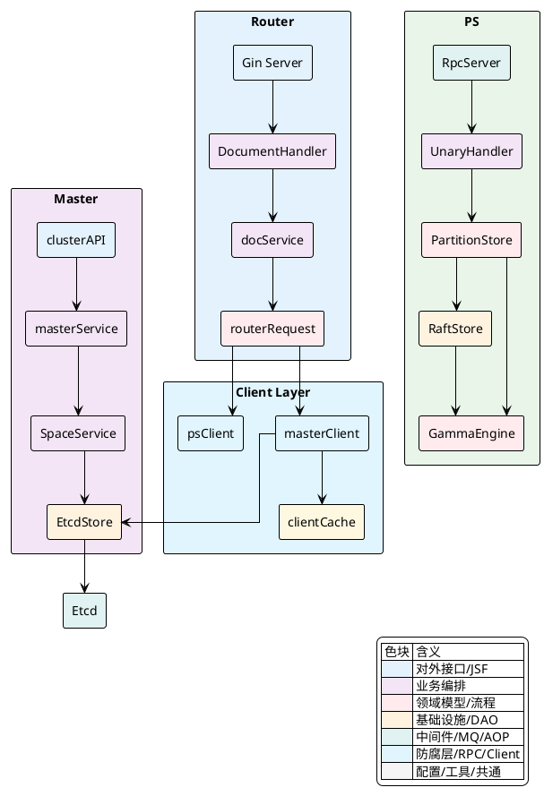
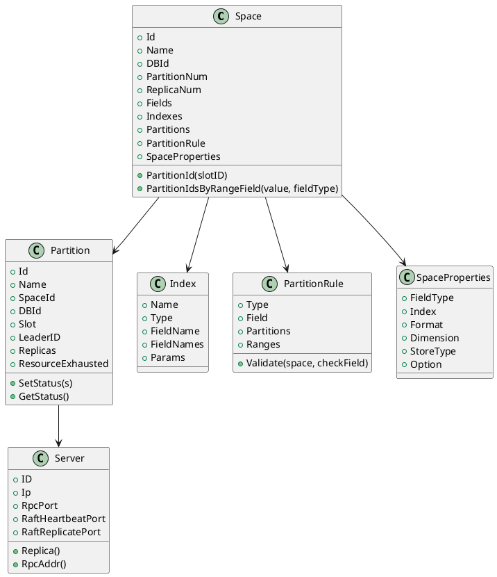
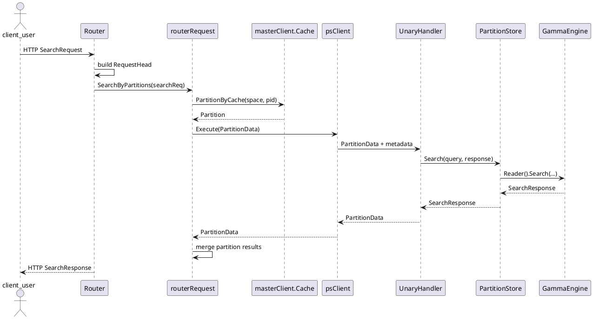
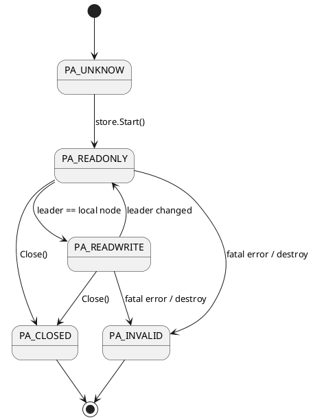

# 实现视角篇

Vearch 的实现主线可以压缩为三段：Router 负责把外部请求转换成分区级调用，Master 负责把集群元数据维持在一致状态，PS 负责把分区上的读写请求落到 Raft 与引擎。真正决定行为差异的，不是 HTTP、Gin、rpcx 或 Etcd 这些框架边界，而是三个内部抽象：`RequestHead/PartitionData` 这类协议头，`routerRequest` 这类路由编排器，以及 `PartitionStore` 这类分区执行接口。

从代码上看，Router 并不直接理解向量索引细节，它做的是“空间解析、主键归一、分区切分、并发聚合、错误折叠”；PS 并不理解 HTTP 语义，它做的是“方法分发、并发闸门、分区状态检查、Raft 提交、Gamma 调用”；Master 也不直接参与数据读写，它处理的是“元数据生成、分布式锁、分区分配、服务注册、缓存源头”。因此，理解实现细节的最好方式，是沿着请求从入口到引擎的链路，把每一层的职责边界和关键算法串起来。

## 模块协作总览

下面这张组件图对应代码里的实际职责边界。`Router` 通过 `client.masterClient` 读缓存与元数据，通过 `client.psClient` 建立分区 RPC；`PS` 以 `PartitionStore` 为执行入口，把写请求提交给 `raftstore.Store`，再由状态机驱动 `Gamma`；`Master` 则以 `services/*` 为编排层，把变更持久化进 `EtcdStore`。



## Router模块实现

Router 进程启动时先创建 `client.Client`，然后向 Master 注册当前 Router，再建立 Gin 路由树。HTTP 入口的第一个稳定行为是注入 `X-Request-Id`，如果调用方未携带该头，代码会生成 UUID，经 `base64` 截取后写回请求头与响应头。这个请求 ID 会沿着 `RequestHead.Params`、`routerRequest.md` 和 `PartitionData.MessageID` 进入后续 RPC 链路，成为超时控制、追踪和请求取消的关联键。

Router 的 HTTP 生命周期是从 `gin.Engine` 开始的，但核心并不在 Gin，而在两类中间件和一个处理器出口。`ExportDocumentHandler` 把 `master.TimeoutMiddleware` 挂在整个分组上，再按配置选择 `BasicAuthMiddleware`，随后把文档接口与代理到 Master 的管理接口都注册进来。真正的数据接口最终都落到 `DocumentHandler` 的方法，再委托给 `docService`。

`HttpLimitMiddleware` 是 Router 层第一个显式的资源保护点。它先依据 `Content-Length` 配合 `gctuner.CheckMemoryLimitExceed` 做内存上限检查，再按 URI 分类调用 `entity.WriteLimiter` 或 `entity.ReadLimiter`。因此 Router 的限流不是抽象的 QPS 配置，而是直接与 `/document/upsert`、`/document/delete`、`/document/query`、`/document/search` 这几个路径绑定。请求在到达分区路由前就可能被熔断。

`docService` 自身很薄，但它负责把所有 HTTP 请求统一收敛成 `client.NewRouterRequest(...)` 的链式调用。这个阶段会完成三件关键工作。第一是从 `RequestHead` 解析超时，`setTimeout` 把截止时间写入上下文中的 `entity.RPC_TIME_OUT`，同时创建 `context.WithTimeout`。第二是通过 `SetSpace()` 从 Master 缓存中解析 `Space`，包括别名转真实空间名。第三是根据操作类型选择分区拆分策略，例如 `SetDocsByKey(...).PartitionDocs()`、`SetDocs(...).UpsertByPartitions(...)`、`SearchByPartitions(...)`。

这段入口代码把 Router 的实现风格暴露得很清楚：每个操作都是“构建请求对象，再一次性执行”，而不是在 Handler 中直接写网络代码。

[internal/router/document/doc_service.go:55-67]()
```go
func (docService *docService) getDocs(ctx context.Context, args *vearchpb.GetRequest) *vearchpb.GetResponse {
	ctx, cancel := setTimeout(ctx, args.Head)
	defer cancel()
	reply := &vearchpb.GetResponse{Head: newOkHead()}
	request := client.NewRouterRequest(ctx, docService.client)
	request.SetMsgID(args.Head.Params["request_id"]).SetMethod(client.GetDocsHandler).
		SetHead(args.Head).SetSpace().SetDocsByKey(args.PrimaryKeys).PartitionDocs()
	if request.Err != nil {
		return &vearchpb.GetResponse{Head: setErrHead(request.Err)}
	}
	items := request.Execute()
	reply.Head.Params = request.GetMD()
	reply.Items = items
	return reply
}
```

`server.go` 里的启动流程还暴露了另一个实现细节：Router 自身不只是一层 HTTP 反向代理。它会启动 `FlushCacheJob`，持续刷新 Master 元数据缓存，所以 Router 的行为高度依赖本地缓存的一致性窗口，而不是每次请求都回源 Etcd。

<details>
<summary>关联代码</summary>

[internal/router/server.go:46-145](),[internal/router/document/doc_http.go:62-187](),[internal/router/document/doc_service.go:31-257](),[internal/router/document/doc_rpc.go:33-215]()

</details>

## 客户端与路由请求封装

`internal/client` 的实现不是一个单纯的 SDK，而是集群内部的调度层。`Client` 只暴露两个子客户端：`masterClient` 和 `psClient`。前者读写元数据与缓存，后者负责到分区节点的 RPC。Router 层几乎所有跨模块动作，最终都会沉淀到这两个对象上。

`routerRequest` 是整个请求编排的中心结构。它把上下文、元数据、空间定义、待发送文档和按分区分桶后的 `sendMap` 封装在一起，采用链式风格逐步构建。这个对象最关键的不是持有什么字段，而是它把“参数校验、主键归一、分区选择、跨分区并发、结果回填”都集中到一个对象里，避免 Handler 层出现大量流程控制。

主键到分区的映射算法非常直接：用 `murmur3.Sum32WithSeed([]byte(doc.PKey), 0)` 计算哈希，再调用 `space.PartitionId(...)` 做槽位到分区的映射。`Space.PartitionId` 内部通过二分查找落到 `Partition.Slot` 所代表的区间下界，因此分区切分依赖的是预先排好序的槽位数组，而不是简单的取模。对范围分区场景，`UpsertByPartitions` 会优先读 `space.PartitionRule`，从指定字段值推导候选分区；如果一个范围映射到多个物理分区，再用主键哈希在候选集里打散。

这段代码体现了两层映射：先“文档 -> slot”，再“slot -> partition”。在范围分区启用时则变成“范围字段 -> 逻辑 range -> 物理 partition 集合 -> 哈希选定实例”。

[internal/client/client.go:231-251]()
```go
func (r *routerRequest) PartitionDocs() *routerRequest {
	if r.Err != nil {
		return r
	}
	dataMap := make(map[entity.PartitionID]*vearchpb.PartitionData)
	for _, doc := range r.docs {
		partitionID := r.space.PartitionId(murmur3.Sum32WithSeed([]byte(doc.PKey), 0))
		item := &vearchpb.Item{Doc: doc}
		if d, ok := dataMap[partitionID]; ok {
			d.Items = append(d.Items, item)
		} else {
			items := make([]*vearchpb.Item, 0)
			d = &vearchpb.PartitionData{PartitionID: partitionID, MessageID: r.GetMsgID(), Items: items}
			dataMap[partitionID] = d
			d.Items = append(d.Items, item)
		}
	}
	r.sendMap = dataMap
	return r
}
```

`SetDocsField()` 里的实现还做了一次主键归一化：它把文档 `PKey` 经过 `generateUUID` 处理，并显式补入名为 `_id` 的字段。这样后面的 PS 写流程不需要再猜测主键字段名，而是统一依赖 `entity.IdField`。删除逻辑也是围绕这个约定实现的，PS 端要求删除文档只携带一个 `_id` 字段。

`Execute()` 是 `routerRequest` 中最核心的方法。它为每个分区起一个 goroutine，先从 `client.Master().Cache()` 读出分区元数据，再通过 `psClient.GetOrCreateRPCClient` 连接到 leader 节点执行 `UnaryHandler`。如果 leader 调用失败，会遍历副本列表尝试重试，并跳过已标记为 faulty 的节点。这里的容错不是 Raft 自动透明完成的，而是 Router 主动以“leader 优先、replica 回退”的方式补偿。

写入路径里还有一个容易忽略的实现细节：向量归一化并不是引擎层统一做的，而是在 Router 侧按 `Space` 的字段配置预处理。`NormalizedVectorFields` 会筛选出 `format` 为 `normalization` 或 `normal` 的向量字段，并排除 `BINARYIVF`。在 `BatchHandler` 执行前，Router 把 `field.Value` 解码为 `[]float32`，执行 `number.Normalization`，再重新编码回字节数组。这意味着向量规范化的入口在分发前，而不是在 Gamma 写入时。

`searchFromPartition` 对读请求的处理更复杂。它除了做分区级 RPC 调用外，还把 trace 参数塞回 `ResponseHead.Params`，记录取分区元数据、RPC 调用、聚合等阶段耗时。这里的 `ClientType` 决定了节点选择方式，读请求并不总是强制 leader，从而允许在副本可用时做读扩散或就近路由。

`psClient` 本身并不维护复杂连接池，而是通过 `client.Master().cliCache` 存储 `rpcClient`，并用一个 30 秒 TTL 的 `faultyList` 标记异常节点。`Execute(addr, ...)` 这个辅助函数单独实现了“无缓存连接 + no leader / not leader 重试”逻辑，其中 `PARTITION_NOT_LEADER` 会从错误消息反序列化新的 `Replica.RpcAddr` 再重试，这条链路说明“领导者漂移”是通过业务错误码向上反馈的。

<details>
<summary>关联代码</summary>

[internal/client/client.go:48-907](),[internal/client/ps.go:32-230](),[internal/client/master.go:46-244]()

</details>

## PS模块与引擎集成

PS 的入口是 `rpc.RpcServer`，它在 `Server.Start()` 中创建，随后通过 `ExportToRpcHandler` 注册统一的 `UnaryHandler` 链。这个链并不是一个普通函数注册，而是把 `DefaultPanicHandler`、错误转换器、初始化检查器和业务处理器串起来，因此任何分区调用都会先经过统一的 panic 恢复和服务可用性检查。

`UnaryHandler.Execute` 的第一步是从 rpcx 元数据里取出 `client.HandlerType`，这就是 Router 在 `routerRequest.md` 中写入的操作类型。PS 并不依靠不同 RPC 方法名区分行为，而是统一走一个 `UnaryHandler`，再在内部按 `HandlerType` 分发。这样协议层只需要一个 `PartitionData` 结构就能承载多种请求。

执行前的超时处理也有一层重新封装。PS 会优先读取 `ctx.Deadline()`，其次读取元数据中的 `entity.RPC_TIME_OUT`，最终创建自己的 `context.WithTimeout`。这意味着 Router 传来的超时预算会在 PS 内再次收敛成独立定时器，避免底层引擎调用无限挂起。

`request.Rqueue` 是 PS 端一个专门用于长查询管理的结构。`SearchHandler` 和 `QueryHandler` 在执行前会把 `RequestStatus` 插入队列，并以 `MessageId + PartitionId` 作为键；请求完成或退出时再从队列移除。这个结构后面会被慢请求清理和内存保护逻辑使用，因此它是运行态请求的索引，而不是业务排队系统。

真正执行时，`execute()` 先根据请求类型选择并发通道。普通查询走 `read_request_concurrent`，写入走 `write_request_concurrent`，慢查询隔离走 `slow_search_concurrent`。通道容量来自 `PS.ConcurrentNum`，而慢查询默认只占其四分之一。拿不到令牌时，如果上下文已经超时，会返回 `TIMEOUT`；如果是上下文取消，则映射成 `PARTITION_SERVER_MEMORYEXCEED`。这段逻辑把“背压”和“取消原因”显式区分开了。

[internal/ps/handler_document.go:215-244]()
```go
var concurrentCh chan bool
if req.SearchRequest != nil && req.SearchRequest.IsSlowSearch {
	concurrentCh = handler.server.slow_search_concurrent
} else if method == client.QueryHandler || method == client.SearchHandler ||
	method == client.GetDocsHandler || method == client.GetDocsByPartitionHandler ||
	method == client.GetNextDocsByPartitionHandler {
	concurrentCh = handler.server.read_request_concurrent
} else {
	concurrentCh = handler.server.write_request_concurrent
}

select {
case concurrentCh <- true:
	defer func() { <-concurrentCh }()
case <-ctx.Done():
	if ctx.Err() == context.DeadlineExceeded {
		req.Err = vearchpb.NewError(vearchpb.ErrorEnum_TIMEOUT, nil).GetError()
		return
	} else {
		req.Err = vearchpb.NewError(vearchpb.ErrorEnum_PARTITION_SERVER_MEMORYEXCEED, nil).GetError()
		return
	}
}
```

通过并发闸门之后，PS 根据 `PartitionID` 找到 `PartitionStore`，再进入方法分派。读请求调用 `GetDocument`、`Search`、`Query`；写请求调用 `Write`；维护请求调用 `Flush`、`Optimize`、`Rebuild`。这一层的关键抽象是 `PartitionStore`，它把 Raft、一致性状态、空间元数据和引擎读写统一起来。

写入路径分两层。第一层在 `bulk()` 中把每个文档转换为 `gamma.Doc` 并序列化成字节数组，然后封装成 `vearchpb.DocCmd{Type: BULK, Docs: ...}`。第二层在 `raftstore.Store.Write()` 中先执行 `checkWritable()`，确认分区当前是 `PA_READWRITE`，再把 `DocCmd` 包装成 `RaftCommand{Type: WRITE}` 提交给 `RaftServer.Submit(...)`。因此“只有 leader 可写”并不是客户端假设，而是由 `checkWritable()` 强制执行的。

`bulk()` 还有一个关键实现：它先按单文档估算大小，再调用 `entity.CheckVirtualMemExceed(...)` 做内存断路器判断。这个检查发生在真正序列化和 Raft 提交之前，所以能提前拒绝大批量写入。

Raft 状态机的入口是 `Store.Apply()`。收到日志后，`innerApply()` 按 `CmdType` 分发到 `Engine.Writer().Write()`、`Engine.Writer().Commit()` 或 `Engine.UpdateMapping()`。也就是说，Gamma 并不是直接处理客户端请求，而是处理已经通过 Raft 共识落地的命令。`Commit()` 的返回值是 `FlushC chan error`，`Flush` RPC 会等待这个 channel，直到真正 `Dump` 完成。

[internal/ps/storage/raftstore/raft_state_machine.go:124-143]()
```go
func (s *Store) innerApply(index uint64, raftCmd *vearchpb.RaftCommand) any {
	resp := new(RaftApplyResponse)
	switch raftCmd.Type {
	case vearchpb.CmdType_WRITE:
		resp.Err = s.Engine.Writer().Write(s.Ctx, raftCmd.WriteCommand)
	case vearchpb.CmdType_UPDATESPACE:
		resp = s.updateSchemaBySpace(raftCmd.UpdateSpace.Space)
	case vearchpb.CmdType_FLUSH:
		flushC, err := s.Engine.Writer().Commit(s.Ctx, int64(index))
		resp.FlushC = flushC
		resp.Err = err
	default:
		resp.SetErr(fmt.Errorf("unsupported command[%s]", raftCmd.Type))
	}
	s.Sn = int64(index)
	return resp
}
```

Gamma 集成层 `gammacb` 则把 `Space` 映射转换为底层表结构，再调用 C++ binding 完成建表、加载、搜索和写入。`writerImpl.Write()` 对 `BULK` 的行为很有代表性：它调用 `gamma.AddOrUpdateDocs(...)`，逐个收集返回码，再包装成一个 `SUCCESS` 但带有错误码字符串的 `VearchErr`。上层 `bulk()` 再把这些逗号分隔的返回码拆开，逐条回填到 `items[i].Err`。因此批量写并不是一个全有或全无事务，而是“整体提交、逐项回填”的结果模型。

<details>
<summary>关联代码</summary>

[internal/ps/server.go:50-226](),[internal/ps/handler_document.go:64-555](),[internal/ps/partition_service.go:70-260](),[internal/ps/storage/raftstore/store.go:55-259](),[internal/ps/storage/raftstore/store_writer.go:38-183](),[internal/ps/storage/raftstore/store_read.go:25-73](),[internal/ps/storage/raftstore/raft_state_machine.go:91-242](),[internal/ps/engine/engine.go:26-82](),[internal/ps/engine/gammacb/gamma.go:53-260](),[internal/ps/engine/gammacb/writer.go:42-159]()

</details>

## Master模块与元数据服务

Master 启动时的代码揭示了它的双重角色。一方面它可以自管嵌入式 Etcd，也可以连外部 Etcd；另一方面它自身还是一个 Gin HTTP 服务，对外暴露集群与元数据管理接口。`Start()` 在 Etcd ready 之后创建 `client.Client`，再创建 `masterService`，启动 backup 服务、监控服务、HTTP 服务、root 用户初始化，以及两个 watch job。

HTTP 入口由 `ExportToClusterHandler` 注册。这里的路由结构和 Router 端有明显对应关系：Router 中的很多管理接口其实只是 `handleMasterRequest` 代理到这些 Master API。Master 自己同样有 `RecoveryMiddleware`、`TimeoutMiddleware` 和 `BasicAuthMiddleware`，但它多了一层 `handleError()`，根据 `vearchpb.ErrorEnum` 精确映射到 `400/401/404/422/500`。

元数据编排真正落在 `services/*`。其中 `SpaceService.CreateSpace()` 代表性最强。它先通过 `QueryDBName2ID()` 解析数据库，再用 `mapping.SchemaMap()` 校验字段定义，然后对空间名加分布式锁 `LockSpaceKey(dbName, spaceName)`。这个锁通过 `masterClient.NewLock()` 落到 Etcd lease，会覆盖整个建空间过程，保证分区 ID 生成、分区落盘和空间元数据写入的一致性窗口。

空间创建算法分四步。第一步生成 `space.Id`，解析 `space.Fields` 为 `SpaceProperties`，再把字段级索引信息合并进 `space.Indexes`，并校验至少存在一个向量索引。第二步为每个逻辑分区申请 `partitionID`，并按 `PartitionRule` 或 hash 分片规则生成 `space.Partitions`。第三步查询集群中的可用服务器，调用 `filterAndSortServer()` 与 `selectServersForPartition()` 为每个分区选出副本集合。第四步先把 `space` 写入 Etcd，再并发地向各个 PS 发起建分区 RPC，最后等待所有分区 ready，若失败则逐个清理已创建分区与 `PartitionKey`。

可以看到，Master 的“元数据服务”不是单纯写 Etcd，而是把“Etcd 持久化 + PS 远程执行 + 回滚清理”串成一个编排事务。

[internal/master/services/space_service.go:74-92]()
```go
spaceLock := masterClient.NewLock(ctx, entity.LockSpaceKey(dbName, spaceName), time.Second*300)
if err = spaceLock.Lock(); err != nil {
	return err
}
defer func() {
	if unlockErr := spaceLock.Unlock(); unlockErr != nil {
		log.Error("unlock space err:[%s]", unlockErr.Error())
	}
}()

if _, err := masterClient.QuerySpaceByName(ctx, space.DBId, space.Name); err != nil {
	vErr := vearchpb.NewError(vearchpb.ErrorEnum_INTERNAL_ERROR, err)
	if vErr.GetError().Code != vearchpb.ErrorEnum_SPACE_NOT_EXIST {
		return vErr
	}
} else {
	return vearchpb.NewError(vearchpb.ErrorEnum_SPACE_EXIST, nil)
}
```

`EtcdStore` 则提供 Master 使用的最基础原语。`NewIDGenerate()` 用 `concurrency.NewSTM` 做原子递增；`Create()` 以 version compare-and-put 保障键不存在时才写入；`KeepAlive()` 用 lease 维持 server/router 注册项的存活；`WatchPrefix()` 为缓存刷新与 watch job 提供事件流。Master、Router、PS 虽然都通过 `client.Master()` 操作元数据，但最终都会落到这一层。

另一个关键点在于 `masterClient.FlushCacheJob()`。Router 和 PS 作为消费者进程，启动后都会建立自己的 `clientCache`。这使得 Master 并不负责主动推送到每个实例，而是实例侧通过 watch 与缓存刷新感知元数据变化。因此，Master 的一致性边界在 Etcd，运行节点看到更新的时机由本地缓存驱动。

<details>
<summary>关联代码</summary>

[internal/master/server.go:46-220](),[internal/master/cluster_api.go:63-320](),[internal/master/services/space_service.go:51-315](),[internal/master/store/store.go:26-72](),[internal/master/store/etcdstore.go:33-259](),[internal/client/master.go:46-244]()

</details>

## 领域模型与映射结构

Vearch 的领域模型主要集中在 `internal/entity`。这些结构体并不只是 DTO，而是携带了分片算法、校验规则、状态流转和配置含义。`Space`、`Partition`、`Server` 是最核心的三个对象。

`Space` 同时承载逻辑模型和部分运行态信息。它包含 `Fields` 原始 JSON、解析后的 `SpaceProperties`、索引定义 `Indexes`、逻辑分区列表 `Partitions`、副本数 `ReplicaNum` 以及可选的 `PartitionRule`。`PartitionId(slotID)` 用二分查找把一个哈希槽映射到具体分区，这个方法是 Router 分发算法的核心。`PartitionIdsByRangeField()` 则针对范围分区读取分区字段的时间戳，把文档映射到同名逻辑分区的一组物理分区上。

`Index.UnmarshalJSON()` 展示了索引模型的约束方式。索引类型不是字符串任意值，而是在解析阶段就限定为 `IVFPQ`、`HNSW`、`FLAT`、`SCALAR`、`BITMAP`、`COMPOSITE` 等集合；并且会继续校验 `nlinks`、`efConstruction`、`ncentroids`、`training_threshold` 等参数区间。也就是说，很多“索引配置错误”并不会拖到引擎层，而是在领域模型反序列化阶段就被拦下。

`Partition` 的设计体现了运行态与元数据态叠加。它既持久化 `LeaderID`、`Replicas`、`ResourceExhausted`，又维护进程内状态 `status` 与 `ReStatusMap`。`status` 只通过 `SetStatus`/`GetStatus` 原子访问，取值是 `PA_INVALID`、`PA_CLOSED`、`PA_READONLY`、`PA_READWRITE`。Raft leader 变化时，`HandleLeaderChange()` 会把本地分区从只读切换为可写或者反之。这一状态直接影响 `checkReadable()` 和 `checkWritable()` 的行为。

`Server` 模型则把一个 PS 节点暴露为多个地址组合：`RpcPort` 用于业务 RPC，`RaftHeartbeatPort` 与 `RaftReplicatePort` 用于 Raft 网络。`Replica()` 方法把这三个地址打包成 `entity.Replica`，供 `raftResolver` 和错误重定向使用。

请求与响应模型也有明显分层。`entity/request/SearchDocumentRequest` 是 Router HTTP 的高层请求体，保留 `Filters`、`Vectors`、`Sort`、`LoadBalance`、`PartitionNames` 等用户语义；而实际跨节点传输时会被进一步转换为 `vearchpb.SearchRequest` 和 `PartitionData`。响应侧的 `SearchDocResult` 则把“某个分区返回的 `PartitionData`、排序方向和 topN 信息”组合起来，供 Router 聚合排序。

下面这张类图压缩了几个关键领域对象之间的关系。



<details>
<summary>关联代码</summary>

[internal/entity/space.go:29-355](),[internal/entity/partition.go:29-240](),[internal/entity/server.go:23-64](),[internal/entity/db.go:24-58](),[internal/entity/request/search_doc.go:24-102](),[internal/entity/response/doc_results.go:22-30]()

</details>

## 协议与消息定义

Vearch 内部协议的重心在 `internal/proto`，其中最重要的不是 gRPC service，而是消息体本身。`data_model.proto` 定义了 `Field`、`Document`、`Item` 这些最小文档单元；`raftcmd.proto` 定义了 Router 到 PS、PS 到 Raft 状态机都在复用的 `PartitionData`、`DocCmd` 和 `RaftCommand`；`errors.proto` 则定义了整个系统共享的错误码空间。

`Document` 的结构很简单：`p_key` 加 `repeated Field`。但是一旦进入分区链路，请求就会被包装成 `Item`，因为单条文档不再只关心内容，还要携带独立的 `Error` 与消息。批量写、批量删、批量取文档都依赖这个模型做逐项错误回填。

`PartitionData` 是内部最关键的多态消息。它同时能承载 `items`、`search_request`、`search_response`、`query_request`、`index_request`、`del_by_query_response` 等不同负载，外加 `partitionID`、`messageID` 和 `err`。Router 发往 PS 的 RPC 统一走这个包体，PS 返回时也沿用同一个结构。因此 `HandlerType` 放在 rpc metadata，而不是放在 `PartitionData` 的字段里，二者组合起来才形成完整的调用语义。

`DocCmd` 和 `RaftCommand` 的组合则展示了 PS 写链路的协议分层。`DocCmd` 表示一个文档级操作，关注 `OpType`、`doc` 或 `docs`；`RaftCommand` 表示一个复制日志项，关注 `CmdType` 和其携带的 `write_command` 或 `update_space`。这意味着“文档写入”和“Raft 提交”是两个独立层次的协议，后者包裹前者。

错误码定义也体现了模块边界。`120-139` 预留给 Router，`140-159` 给 Partition，`160-179` 给 Server，`220+` 给 Space/DB/Alias 等元数据对象，`400+` 给数据接口错误。Master 的 `handleError()` 会按这些错误码映射 HTTP 返回；Router 和 PS 则用同一套错误码进行 RPC 传递与聚合，因此错误语义在整个链路中是一致的。

下面这张时序图对应典型的搜索调用所经过的消息形态。



<details>
<summary>关联代码</summary>

[internal/proto/data_model.proto:1-94](),[internal/proto/raftcmd.proto:1-64](),[internal/proto/errors.proto:2-120](),[internal/router/document/doc_service.go:150-244](),[internal/ps/handler_document.go:96-291]()

</details>

## 监控与调试能力

监控能力的实现分成两层。第一层是统一的 Prometheus 指标注册，入口在 `monitor.Register(...)`；第二层是业务链路里主动埋点与按需 trace。Master、Router、PS 都会在启动时调用 `monitor.Register`，但各自上报的指标维度并不相同。

HTTP 侧的 `monitor.Profiler(...)` 记录 API 名称、HTTP 状态码、数据库和空间维度的耗时与计数。PS 侧则使用 `monitor.DataNodeProfiler(...)`，标签包含 `api`、`code`、`ip`、`node_id`、`partition_id`，因此它更适合分析分区热点、单节点毛刺和 특정方法的执行分布。`UnaryHandler.Execute` 在 defer 中无条件上报这一指标，所以无论成功、超时还是 panic 恢复，都能进入监控。

追踪实现沿着 `opentracing` 贯穿。Router 的 `doc_http.go` 会用 `opentracing.StartSpanFromContext(...)` 创建 span；RPC 客户端在 `internal/pkg/server/rpc/rpc_client.go` 中把 span context 注入 metadata；PS 的 `UnaryHandler.Execute` 再用 `opentracing.GlobalTracer().Extract(...)` 恢复上下文并创建 `server-execute` span。这样 Router 到 PS 的 RPC 就形成一条连续链路。

除了标准 trace，Vearch 还提供了“参数级追踪”。`trace` 开关既可以走全局 `config.Trace`，也可以通过请求头中的 `RequestHead.Params["trace"]` 针对单次请求启用。开启后，Router 和 PS 会把诸如 `getPartition_x`、`storeSearch_x`、RPC 阶段耗时等指标写入 `ResponseHead.Params`，直接随业务响应返回。这种调试方式不依赖外部 tracing 系统，适合在线排查单次查询的阶段耗时分布。

运行时调试还有两条独立通道。其一是 `internal/debugutil/server.go` 暴露的 `/debug/pprof/trace` 等接口；其二是 Gamma 引擎关闭时打印栈追踪，帮助定位谁在触发引擎关闭。前者适合 CPU/内存剖析，后者适合排查生命周期问题。

<details>
<summary>关联代码</summary>

[internal/monitor/monitor_service.go:46-260](),[internal/router/document/doc_http.go:429-818](),[internal/ps/handler_document.go:96-187](),[internal/pkg/server/rpc/rpc_client.go:120-121](),[internal/debugutil/server.go](),[internal/ps/engine/gammacb/gamma.go:453-456]()

</details>

## 容错与限流策略

容错与限流并不是集中在一个模块里，而是贯穿 Router、Client、PS、RaftStore 和配置层。它们覆盖的故障面也不同：有的处理入口背压，有的处理节点故障，有的处理内存压力，有的处理领导者漂移。

Router 侧的第一道防线是 `HttpLimitMiddleware`。它基于 `entity.ReadLimiter` 与 `entity.WriteLimiter` 实现读写分离限流，参数来自 `entity.ConfigInfo`，并会随 Master 配置更新被动态刷新。第二道防线是 `gctuner.CheckMemoryLimitExceed(...)`，它不是简单比较当前 RSS，而是配合 Go `debug.SetMemoryLimit` 和进程内统计做内存阈值判断。请求在进入解析与分区前就可能因内存超限被拒绝。

PS 侧的并发限制更细化。`read_request_concurrent`、`write_request_concurrent` 和 `slow_search_concurrent` 三个通道把请求拆分成读、写和慢查询隔离池。对慢查询，默认只给 `ConcurrentNum/4` 的容量，从而防止少量长查询占满普通查询通道。

内存容错在 PS 侧还有额外一层。`bulk()` 在写入前按文档估算大小，再调用 `entity.CheckVirtualMemExceed(...)` 做虚拟内存断路器；后台 `schedule_job.go` 中的慢请求清理逻辑会在内存超限时从 `request.Rqueue` 队头取出请求并执行取消。因此 Router 的内存限制偏入口拒绝，PS 的内存限制则包含“运行中请求淘汰”。

分区级容错主要依赖两套机制。第一套是 Router 的节点故障绕过：`routerRequest.Execute()` 先尝试 leader，失败后轮询 replicas，并跳过 `psClient.faultyList` 中的节点。第二套是 PS/raftstore 的角色校验：非 leader 写请求在 `checkWritable()` 中立即返回 `PARTITION_NOT_LEADER`，而读请求只有在显式要求 leader 时才会被拒绝。`client.Execute(addr, ...)` 还支持根据 `PARTITION_NOT_LEADER` 错误里的新地址继续重试。

Raft 状态变化本身也参与容错。`HandleLeaderChange()` 会切换分区状态；`ReplicasStatusChange()` 会根据 follower `commit` 落后程度更新 `ReStatusMap`；在 `Global.RaftConsistent` 开启时，这个副本状态会被推送到 `RsStatusC`，供读路径判断副本是否可用。也就是说，副本是否参与查询，不只由“活着”决定，还由“落后到什么程度”决定。

下面这张状态图概括了分区在执行路径上的几个关键状态。



用表格压缩这些策略，会更容易对应代码位置。

| 维度 | 实现位置 | 触发条件 | 行为 |
|---|---|---|---|
| HTTP 读写限流 | `internal/router/document/doc_http.go` | `/document/query/search` 或 `/document/upsert/delete` 过频 | 返回错误并中止请求 |
| Router 内存阈值 | `gctuner.CheckMemoryLimitExceed` | 请求进入前检测到内存接近上限 | 入口拒绝 |
| PS 并发闸门 | `internal/ps/handler_document.go` | 读写/慢查询通道无剩余容量 | 等待或超时返回 |
| PS 内存断路器 | `entity.CheckVirtualMemExceed` | 批量写估算大小超阈值 | 取消 bulk |
| 运行中请求取消 | `request.Rqueue` + `schedule_job.go` | 慢请求或内存压力 | 调用 `CancelFunc` 终止 |
| leader 漂移重试 | `internal/client/ps.go` | `PARTITION_NOT_LEADER` 或 `PARTITION_NO_LEADER` | 重试新 leader 或退避等待 |
| 副本故障绕过 | `routerRequest.Execute()` | leader RPC 失败 | 遍历 replicas 回退 |
| 资源耗尽保护 | `raftstore.Store.Write()` | `Partition.ResourceExhausted` | 返回 `PARTITION_RESOURCE_EXHAUSTED` |

<details>
<summary>关联代码</summary>

[internal/router/document/doc_http.go:132-165](),[internal/router/document/gctuner/memory_limit_check.go:24-26](),[internal/entity/config.go:52-171](),[internal/client/ps.go:138-230](),[internal/client/client.go:374-498](),[internal/ps/handler_document.go:144-244](),[internal/ps/handler_document.go:344-403](),[internal/ps/storage/raftstore/store_writer.go:77-183](),[internal/ps/storage/raftstore/raft_state_machine.go:40-120]()

</details>