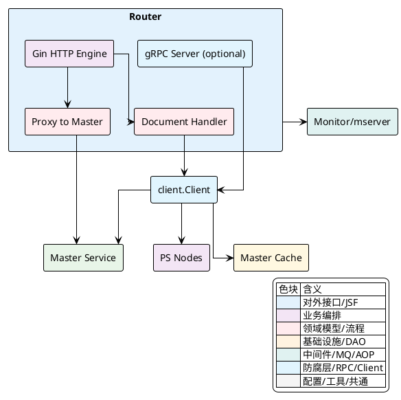
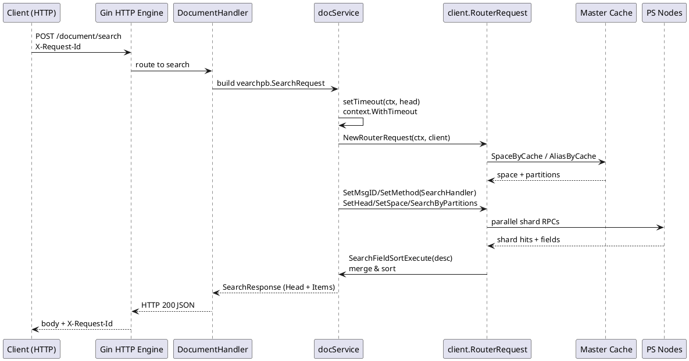
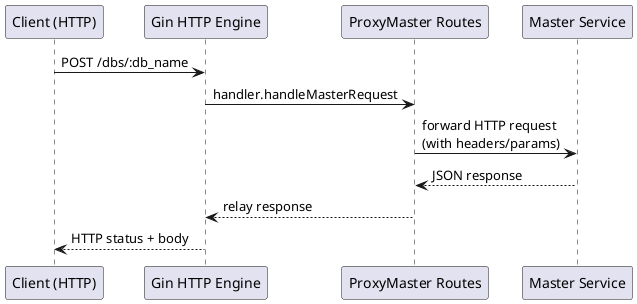

## Router模块实现

本文聚焦 Router 模块在实现层面的关键职责划分、调用链路与可扩展点，重点解析 HTTP 服务装配、跨域与请求标识、Master 中转、文档接口导出与缓存读取，以及可选的 gRPC 监听端口。所有类名、方法名、变量名与泛型类型均以代码反引号标注，配合 PlantUML 图示化关键交互。

### 模块职责与组件关系

Router 的职责围绕三条主线展开：
- 对外 HTTP API 装配与治理：`gin.Engine` 初始化、统一 `X-Request-Id` 注入、跨域策略、限流与内存门控。
- 文档接口编排与数据面路由：`ExportDocumentHandler` 将 `/document/*` 等业务请求映射为内部 `client.NewRouterRequest`，按 `Space`/`Partition` 分发至后端 `PS` 节点，聚合执行结果。
- 控制面代理与缓存协同：将 `/dbs`、`/spaces`、`/users`、`/roles` 等控制面请求透明转发至 `Master`，同时依赖 `Master.Cache` 提供 `Space`、`User`、`Role` 的就地读取与别名解析；启动时注册自身并拉起缓存刷新任务。

组件视图如下：



<details>
<summary>关联代码</summary>

[internal/router/server.go:46-120](),[internal/router/document/doc_http.go:167-187](),[internal/router/document/doc_service.go:31-53]()

</details>

### 启动流程与注册、缓存刷新

`NewServer` 执行顺序：
- 创建 `client.Client`，调用 `Master.RegisterRouter` 注册 Router 实例，返回注册结果。
- 初始化 `gin.Engine` 并挂载统一 `X-Request-Id` 中间件与可选 CORS。
- 导出文档与 Master 中转路由。
- 可选启动 gRPC 监听端口。
- 创建 `routerCtx` 并启动 `cli.Master().FlushCacheJob(routerCtx)` 缓存刷新任务。
- 返回包含 `httpServer`、`rpcServer`、`cancelFunc` 的 `Server`。

关键代码示例（裁剪保留核心逻辑）：

[internal/router/server.go:46-90]()
```go
func NewServer(ctx context.Context) (*Server, error) {
    cli, err := client.NewClient(config.Conf())
    if err != nil { return nil, err }

    res, err := cli.Master().RegisterRouter(ctx, config.Conf().Global.Name, time.Duration(10*time.Second))
    if err != nil { return nil, err }
    log.Info("register router success, res: %s", res)

    gin.SetMode(gin.ReleaseMode)
    httpServer := gin.New()
    httpServer.Use(func(c *gin.Context) {
        rid := c.GetHeader("X-Request-Id")
        if rid == "" {
            id, err := uuid.NewRandom()
            if err != nil { log.Error("generate request id failed, %v", err); c.Next(); return }
            rid = base64.StdEncoding.EncodeToString([]byte(id.String()))[:10]
            c.Request.Header.Add("X-Request-Id", rid)
        }
        c.Header("X-Request-Id", rid)
        c.Next()
    })
    if len(config.Conf().Router.AllowOrigins) > 0 {
        corsConfig := cors.DefaultConfig()
        // corsConfig.AllowCredentials = true (在源码中配置)
        corsConfig.AllowOrigins = config.Conf().Router.AllowOrigins
        httpServer.Use(cors.New(corsConfig))
    }

    document.ExportDocumentHandler(httpServer, cli)
    ...
    routerCtx, routerCancel := context.WithCancel(ctx)
    if err := cli.Master().FlushCacheJob(routerCtx); err != nil { panic(err) }

    return &Server{httpServer: httpServer, ctx: routerCtx, cli: cli, cancelFunc: routerCancel, rpcServer: rpcServer}, nil
}
```

启动阶段的健康与观测：
- `Start` 中获取本机 IP，`mserver.SetIp` 上报，`monitor.Register` 挂载监控端口。
- `StartHeartbeatJob` 保持心跳（定义在同文件其他位置）。

<details>
<summary>关联代码</summary>

[internal/router/server.go:46-120](),[internal/router/server.go:122-145]()

</details>

### HTTP 服务装配：请求 ID、CORS 与引擎运行

请求标识注入逻辑：
- 在 `gin.Engine` 层面统一拦截，若缺失则构造随机 `UUID`，通过 `base64` 编码截断成 10 字符作为 `X-Request-Id`。
- 将请求头中的 `X-Request-Id` 回写到响应头，便于跨链路关联追踪。

跨域配置：
- 若 `config.Conf().Router.AllowOrigins` 非空，使用 `cors.DefaultConfig` 允许指定源，启用 `AllowCredentials`。
- 将 `cors.New(corsConfig)` 注册到引擎。

引擎运行与监控端口：
- `httpServer.Run` 绑定 HTTP 端口。
- `monitor.Register` 将监控 HTTP 端口暴露在 `Router.MonitorPort`。

关键代码示例（裁剪保留核心逻辑）：

[internal/router/server.go:61-87]()
```go
gin.SetMode(gin.ReleaseMode)
httpServer := gin.New()
httpServer.Use(func(c *gin.Context) {
    rid := c.GetHeader("X-Request-Id")
    if rid == "" {
        id, err := uuid.NewRandom()
        if err != nil { log.Error("generate request id failed, %v", err); c.Next(); return }
        rid = base64.StdEncoding.EncodeToString([]byte(id.String()))[:10]
        c.Request.Header.Add("X-Request-Id", rid)
    }
    c.Header("X-Request-Id", rid)
    c.Next()
})
if len(config.Conf().Router.AllowOrigins) > 0 {
    corsConfig := cors.DefaultConfig()
    // corsConfig.AllowCredentials = true
    corsConfig.AllowOrigins = config.Conf().Router.AllowOrigins
    httpServer.Use(cors.New(corsConfig))
}
```

<details>
<summary>关联代码</summary>

[internal/router/server.go:61-87](),[internal/router/server.go:135-141]()

</details>

### 路由导出与 Master 中转

`ExportDocumentHandler` 负责两个维度的路由：
- 对内业务组 `group`：挂载 `master.TimeoutMiddleware(defaultTimeout)`，由 `DocumentHandler.ExportInterfacesToServer` 开放 `/document/*`、`/index/*`、`/config/*`、`/cache/*` 等 API。
- 控制面代理组 `groupProxy`：通过 `proxyMaster` 将控制面 REST 端点透明转发至 `Master`，用于集群、DB/Space、用户/角色、备份/恢复、配置等操作。

核心装配：

[internal/router/document/doc_http.go:167-187]()
```go
func ExportDocumentHandler(httpServer *gin.Engine, client *client.Client) {
    docService := newDocService(client)
    documentHandler := &DocumentHandler{httpServer: httpServer, docService: *docService, client: client}

    var group *gin.RouterGroup = documentHandler.httpServer.Group("", master.TimeoutMiddleware(defaultTimeout))
    var groupProxy *gin.RouterGroup = documentHandler.httpServer.Group("")
    if !config.Conf().Global.SkipAuth {
        group.Use(BasicAuthMiddleware(documentHandler.docService))
    }

    documentHandler.proxyMaster(groupProxy)
    if err := documentHandler.ExportInterfacesToServer(group); err != nil {
        panic(err)
    }
}
```

Master 代理路由注册（节选）：

[internal/router/document/doc_http.go:189-260]()
```go
func (handler *DocumentHandler) proxyMaster(group *gin.RouterGroup) error {
    // server handler
    group.GET("/servers", handler.handleMasterRequest)

    // partition handler
    group.GET("/partitions", handler.handleMasterRequest)
    group.POST("/partitions/change_member", handler.handleMasterRequest)

    // schedule
    group.POST("/schedule/recover_server", handler.handleMasterRequest)
    group.POST("/schedule/change_replicas", handler.handleMasterRequest)

    // db handler
    group.POST(fmt.Sprintf("/dbs/:%s", URLParamDbName), handler.handleMasterRequest)
    group.GET(fmt.Sprintf("/dbs/:%s", URLParamDbName), handler.handleMasterRequest)
    group.GET("/dbs", handler.handleMasterRequest)
    group.DELETE(fmt.Sprintf("/dbs/:%s", URLParamDbName), handler.handleMasterRequest)

    // alias handler
    group.POST(fmt.Sprintf("/alias/:%s/dbs/:%s/spaces/:%s", URLParamAliasName, URLParamDbName, URLParamSpaceName), handler.handleMasterRequest)
    group.GET(fmt.Sprintf("/alias/:%s", URLParamAliasName), handler.handleMasterRequest)

    // user handler
    group.POST("/users", handler.handleMasterRequest)
    group.GET(fmt.Sprintf("/users/:%s", URLParamUserName), handler.handleMasterRequest)

    // role handler
    group.POST("/roles", handler.handleMasterRequest)
    group.GET(fmt.Sprintf("/roles/:%s", URLParamRoleName), handler.handleMasterRequest)

    // cluster handler
    group.GET("/cluster/health", handler.handleMasterRequest)

    // config handler
    group.POST("/config/:"+URLParamDbName+"/:"+URLParamSpaceName, handler.handleMasterRequest)
    group.GET("/config/:"+URLParamDbName+"/:"+URLParamSpaceName, handler.handleMasterRequest)
    ...
}
```

中转端点分类与示例：

| 类目 | 示例路径 |
| --- | --- |
| Server/Router | `/servers`、`/routers` |
| Partition | `/partitions`、`/partitions/change_member` |
| Schedule | `/schedule/recover_server`、`/schedule/change_replicas` |
| DB | `/dbs/:db_name`、`/dbs` |
| Space | `/dbs/:db_name/spaces/:space_name` |
| Alias | `/alias/:alias_name`、`/alias/:alias_name/dbs/:db_name/spaces/:space_name` |
| User | `/users`、`/users/:user_name` |
| Role | `/roles`、`/roles/:role_name` |
| Cluster | `/cluster/health`、`/cluster/stats` |
| Config | `/config/:db_name/:space_name`、`/config/request_limit` |
| Backup/Restore | `/backup/dbs/:db_name`、`/restore/dbs/:db_name/spaces/:space_name/progress` |

<details>
<summary>关联代码</summary>

[internal/router/document/doc_http.go:167-187](),[internal/router/document/doc_http.go:189-260]()

</details>

### 文档请求编排与数据面路由

`docService` 将文档相关请求转为内部 `client.NewRouterRequest`，核心步骤保持一致：
- 超时策略：`setTimeout` 从 `Router.RpcTimeOut` 与请求头 `head.TimeOutMs` 二择其一，设置 `context.WithTimeout`，并在 `context` 中注入 `entity.RPC_TIME_OUT` 的截止时间。
- 请求构造：通过链式调用设置 `MsgID`、`Method`、`Head`、`Space` 与分片策略，如 `PartitionDocs`、`UpsertByPartitions`、`QueryByPartitions`，或 `CommonByPartitions`。
- 请求执行：`Execute`、`QueryFieldSortExecute`、`SearchFieldSortExecute`、`FlushExecute`、`ForceMergeExecute`、`RebuildIndexExecute` 等执行器负责派发至分区上的 `PS` 节点并聚合结果。
- 响应包装：统一填充 `Head` 与 `Params`，错误路径统一 `setErrHead` 返回 `vearchpb.ErrorEnum_INTERNAL_ERROR` 或后端错误。

超时设置：

[internal/router/document/doc_service.go:41-53]()
```go
func setTimeout(ctx context.Context, head *vearchpb.RequestHead) (context.Context, context.CancelFunc) {
    timeout := defaultRpcTimeOut
    if config.Conf().Router.RpcTimeOut > 0 {
        timeout = int64(config.Conf().Router.RpcTimeOut)
    }
    if head.TimeOutMs > 0 { timeout = head.TimeOutMs }
    t := time.Duration(timeout) * time.Millisecond
    endTime := time.Now().Add(t)
    ctx = context.WithValue(ctx, entity.RPC_TIME_OUT, endTime)
    return context.WithTimeout(ctx, t)
}
```

`getDocs` 数据面路由（构建、分区、聚合）：

[internal/router/document/doc_service.go:55-69]()
```go
func (docService *docService) getDocs(ctx context.Context, args *vearchpb.GetRequest) *vearchpb.GetResponse {
    ctx, cancel := setTimeout(ctx, args.Head)
    defer cancel()
    reply := &vearchpb.GetResponse{Head: newOkHead()}
    request := client.NewRouterRequest(ctx, docService.client)
    request.SetMsgID(args.Head.Params["request_id"]).
        SetMethod(client.GetDocsHandler).
        SetHead(args.Head).
        SetSpace().
        SetDocsByKey(args.PrimaryKeys).
        PartitionDocs()
    if request.Err != nil {
        return &vearchpb.GetResponse{Head: setErrHead(request.Err)}
    }
    items := request.Execute()
    reply.Head.Params = request.GetMD()
    reply.Items = items
    return reply
}
```

`bulk` 写路径（批量上行至分区）：

[internal/router/document/doc_service.go:104-115]()
```go
func (docService *docService) bulk(ctx context.Context, args *vearchpb.BulkRequest) *vearchpb.BulkResponse {
    reply := &vearchpb.BulkResponse{Head: newOkHead()}
    request := client.NewRouterRequest(ctx, docService.client)
    request.SetMsgID(args.Head.Params["request_id"]).
        SetMethod(client.BatchHandler).
        SetHead(args.Head).
        SetSpace().
        SetDocs(args.Docs).
        SetDocsField().
        UpsertByPartitions(args.Partitions)
    if request.Err != nil {
        return &vearchpb.BulkResponse{Head: setErrHead(request.Err)}
    }
    reply.Items = request.Execute()
    reply.Head.Params = request.GetMD()
    return reply
}
```

读路径的排序执行与字段排序：
- `query` 使用 `request.QueryFieldSortExecute`。
- `search` 将 `SortFields` 转为 `sortorder.Sort`，取第一个的排序方向，调用 `request.SearchFieldSortExecute(desc)`。

[internal/router/document/doc_service.go:172-188,189-200]()
```go
func (docService *docService) search(ctx context.Context, searchReq *vearchpb.SearchRequest) *vearchpb.SearchResponse {
    request := client.NewRouterRequest(ctx, docService.client)
    request.SetMsgID(searchReq.Head.Params["request_id"]).
        SetMethod(client.SearchHandler).
        SetHead(searchReq.Head).
        SetSpace().
        SearchByPartitions(searchReq)
    if request.Err != nil { return &vearchpb.SearchResponse{Head: setErrHead(request.Err)} }

    sortOrder := make([]sortorder.Sort, 0)
    if len(searchReq.SortFields) > 0 {
        for _, sortF := range searchReq.SortFields {
            sortOrder = append(sortOrder, &sortorder.SortField{Field: sortF.Field, Desc: sortF.Type})
        }
    }
    desc := sortOrder[0].GetSortOrder()
    searchResponse := request.SearchFieldSortExecute(desc)
    ...
    return searchResponse
}
```

<details>
<summary>关联代码</summary>

[internal/router/document/doc_service.go:41-53](),[internal/router/document/doc_service.go:55-69](),[internal/router/document/doc_service.go:104-115](),[internal/router/document/doc_service.go:150-170](),[internal/router/document/doc_service.go:172-200]()

</details>

### 缓存读取与别名解析、鉴权角色

`docService` 直接使用 `Master.Cache` 做本地读，减少控制面压力：
- `getSpace`：先通过 `AliasByCache` 做 `Space` 别名解引用，再 `SpaceByCache` 拉取元数据。
- `getUser`、`getRole`：从 `UserByCache`、`RoleByCache` 获取；`getRole` 优先从静态 `entity.RoleMap` 命中快速返回。
- `BasicAuthMiddleware`：从 `Authorization: Basic ...` 中解码用户名与密码，校验用户密码与角色权限；若 `config.Conf().Global.SkipAuth` 为 `false`，则在业务 `group` 启用该中间件。
- `HttpLimitMiddleware`：按 URI 区分写 `upsert/delete` 与读 `query/search`，分别通过 `entity.WriteLimiter`、`entity.ReadLimiter` 控制频率；另有 `gctuner.CheckMemoryLimitExceed` 做内存水位保护。

核心接口：

[internal/router/document/doc_service.go:131-148]()
```go
func (docService *docService) getSpace(ctx context.Context, head *vearchpb.RequestHead) (*entity.Space, error) {
    if alias, err := docService.client.Master().Cache().AliasByCache(ctx, head.SpaceName); err == nil {
        head.SpaceName = alias.SpaceName
    }
    return docService.client.Master().Cache().SpaceByCache(ctx, head.DbName, head.SpaceName)
}

func (docService *docService) getUser(ctx context.Context, userName string) (*entity.User, error) {
    return docService.client.Master().Cache().UserByCache(ctx, userName)
}

func (docService *docService) getRole(ctx context.Context, roleName string) (*entity.Role, error) {
    if value, exists := entity.RoleMap[roleName]; exists {
        role := &value
        return role, nil
    }
    return docService.client.Master().Cache().RoleByCache(ctx, roleName)
}
```

内存与限流保护：

[internal/router/document/doc_http.go:132-161]()
```go
func HttpLimitMiddleware(docService docService) gin.HandlerFunc {
    return func(c *gin.Context) {
        if c.Request.ContentLength > 0 && gctuner.CheckMemoryLimitExceed(uint64(c.Request.ContentLength)) {
            response.New(c).JsonError(errors.NewErrInternal(fmt.Errorf("memory usage have reached limit ...")))
            c.Abort(); return
        }
        Request := strings.TrimPrefix(c.Request.RequestURI, "/document/")
        switch Request {
        case "upsert", "delete":
            if !entity.WriteLimiter.Allow() { /* 返回频率限制错误并中止 */ }
        case "query", "search":
            if !entity.ReadLimiter.Allow() { /* 返回频率限制错误并中止 */ }
        }
        c.Next()
    }
}
```

<details>
<summary>关联代码</summary>

[internal/router/document/doc_service.go:131-148](),[internal/router/document/doc_http.go:68-130](),[internal/router/document/doc_http.go:132-165]()

</details>

### 可选 gRPC 监听端口

当 `config.Conf().Router.RpcPort > 0` 时，Router 会额外启动一个 `grpc.Server`：
- 使用 `net.Listen("tcp", fmt.Sprintf("%s:%d", addr, Router.RpcPort))` 监听。
- `grpc.NewServer()` 创建服务，`Serve` 于独立 goroutine。
- 暂留的 `document.ExportRpcHandler` 被注释，意味着当前仅启动空的 gRPC Server，未来可扩展注册服务端点。

关键代码示例：

[internal/router/server.go:91-104]()
```go
var rpcServer *grpc.Server
if config.Conf().Router.RpcPort > 0 {
    lis, err := net.Listen("tcp", fmt.Sprintf("%s:%d", addr, config.Conf().Router.RpcPort))
    if err != nil { panic(fmt.Errorf("start rpc server failed to listen: %v", err)) }
    rpcServer = grpc.NewServer()
    go func() {
        if err := rpcServer.Serve(lis); err != nil {
            panic(fmt.Errorf("start rpc server failed to start: %v", err))
        }
    }()
    // document.ExportRpcHandler(rpcServer, cli)
}
```

<details>
<summary>关联代码</summary>

[internal/router/server.go:91-104]()

</details>

### 交互时序：一次查询的端到端路径

以下时序描述 `/document/search` 的典型执行链路，包括超时设定、分区派发与结果聚合。注意参与者仅为逻辑角色，非部署节点。



<details>
<summary>关联代码</summary>

[internal/router/document/doc_service.go:41-53](),[internal/router/document/doc_service.go:172-200](),[internal/router/document/doc_service.go:131-136]()

</details>

### 交互时序：控制面端点的 Master 中转

以下时序展示 `/dbs/:db_name` 的代理路径，体现 Router 在控制面路由中的“透明中转”职责。



<details>
<summary>关联代码</summary>

[internal/router/document/doc_http.go:189-260]()

</details>

### 关键配置与可扩展点

- `X-Request-Id`：由 `gin` 中间件统一生成与透传，`docService` 将其从 `head.Params["request_id"]` 注入客户端请求链，便于链路关联与日志追踪。
- `RPC 超时`：`setTimeout` 聚合 `Router.RpcTimeOut` 与每次请求的 `head.TimeOutMs`，确保请求在上下文截止时快速返回。
- `排序执行`：`search` 将 `SortFields` 转换为 `sortorder.Sort`，当前使用第一个字段的排序方式作为 `SearchFieldSortExecute` 的全局排序参数。
- `分区派发`：通过 `SetSpace().QueryByPartitions(...)` 或 `SetDocs...().PartitionDocs()`，由 `client.RouterRequest` 分片并行下发，内置聚合器合并返回。
- `Master 中转`：`proxyMaster` 以统一的 `handleMasterRequest` 转发请求，保持路径参数与方法一致，方便新增控制面能力。

<details>
<summary>关联代码</summary>

[internal/router/server.go:63-80](),[internal/router/document/doc_service.go:41-53](),[internal/router/document/doc_service.go:172-200](),[internal/router/document/doc_service.go:55-69](),[internal/router/document/doc_http.go:189-260]()

</details>