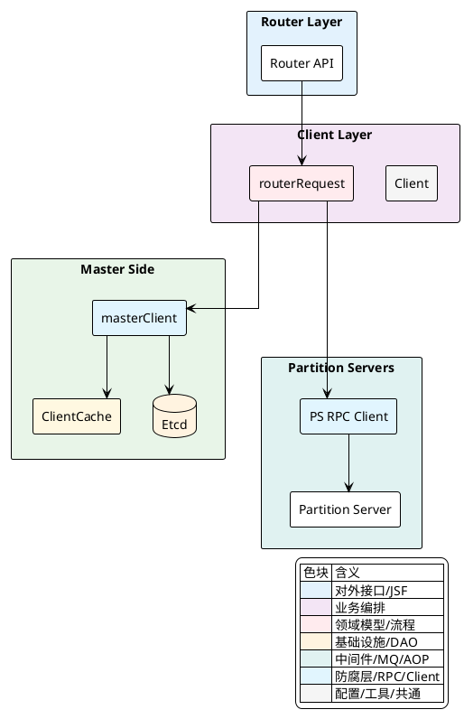
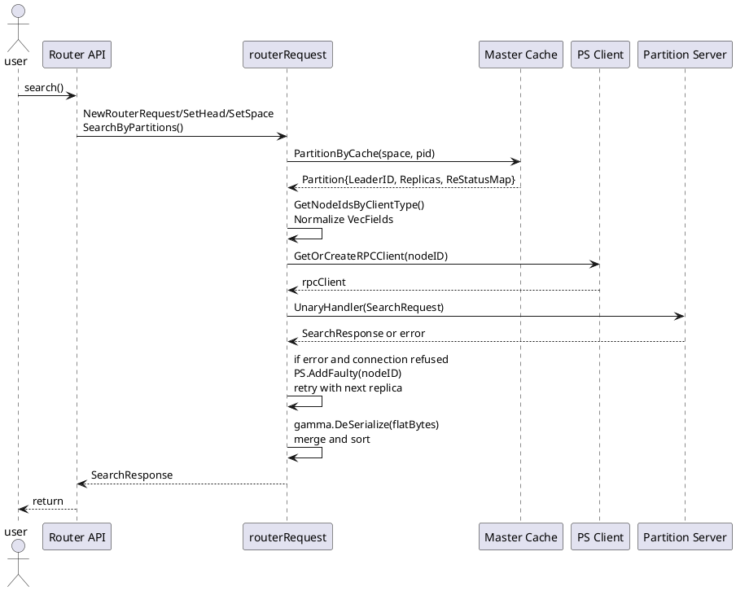
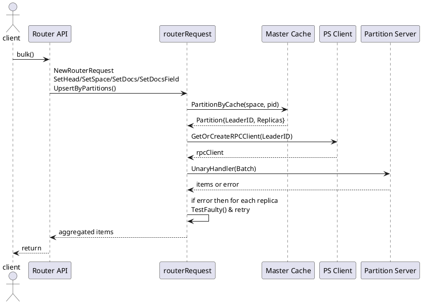

## 客户端与路由请求封装

本节面向实现视角，聚焦 `routerRequest` 在路由侧的统一职责：分区路由、并行 RPC、向量归一化、重试与副本容错；以及与 Master Cache 的协作以感知 `Leader` 与副本列表。围绕关键业务流，梳理写路径与查询路径的并行执行、失败回退与结果聚合。

### 模块关系与职责

`Client` 聚合 `masterClient` 与 `psClient` 两个子客户端。`masterClient` 以内嵌的 Client Cache 维护 `Space`、`Partition`、`Server` 等元数据缓存（从 Etcd 获取+Watch），用以提供路由决策所需的 `LeaderID` 和副本节点集合。`psClient` 负责 `PartitionServer` RPC 客户端复用与重试语义。`routerRequest` 在路由层形成请求生命周期的统一封装：构造 `message_id` 与元数据、校验与向量处理、分区拆分与并行派发，以及结果归一化与聚合。



<details>
<summary>关联代码</summary>

[internal/client/client.go:110-126](),[internal/client/client.go:150-170](),[internal/client/master.go:44-66](),[internal/client/master_cache.go:56-86](),[internal/client/ps.go:84-106](),[internal/router/document/doc_service.go:59-67]()

</details>

### 路由请求生命周期与封装

`routerRequest` 以链式方法封装请求生命周期：

- 元数据与方法：`SetMsgID` 建立请求关联标识；`SetMethod` 标记 `HandlerType`；`SetHead` 注入 `RequestHead`。
- 业务空间：`SetSpace` 经 `masterClient.Cache().SpaceByCache` 获取 `Space` 元数据。
- 文档与校验：`SetDocs` 校验字段与空间属性一致；`SetDocsField` 注入 `_id`（即 `entity.IdField`）与主键生成。
- 分区拆分：`PartitionDocs` 基于 `PKey` Murmur3 哈希映射 `PartitionId`；或 `UpsertByPartitions` 根据 `PartitionRule`/指定分区输出 `sendMap`。
- 查询/搜索/通用：`QueryByPartitions`、`SearchByPartitions`、`CommonByPartitions`/`CommonSetByPartitions` 生成每分区的 `vearchpb.PartitionData`。

[internal/client/client.go:231-341]()
```go
// PartitionDocs: 按 doc.PKey 哈希到分区
func (r *routerRequest) PartitionDocs() *routerRequest {
    dataMap := make(map[entity.PartitionID]*vearchpb.PartitionData)
    for _, doc := range r.docs {
        partitionID := r.space.PartitionId(murmur3.Sum32WithSeed([]byte(doc.PKey), 0))
        item := &vearchpb.Item{Doc: doc}
        if d, ok := dataMap[partitionID]; ok {
            d.Items = append(d.Items, item)
        } else {
            items := make([]*vearchpb.Item, 0)
            d = &vearchpb.PartitionData{PartitionID: partitionID, MessageID: r.GetMsgID(), Items: items}
            dataMap[partitionID] = d
            d.Items = append(d.Items, item)
        }
    }
    r.sendMap = dataMap
    return r
}
```

[internal/client/client.go:276-341]()
```go
// UpsertByPartitions: 支持 PartitionRule 或指定分区数组
func (r *routerRequest) UpsertByPartitions(partitions []uint32) *routerRequest {
    partitionID := uint32(0)
    dataMap := make(map[entity.PartitionID]*vearchpb.PartitionData)
    if r.space.PartitionRule != nil {
        // 依据 RangeField 规则选择分区；如有多个候选，按 PKey 二次哈希分桶
        ...
    } else {
        for _, doc := range r.docs {
            if len(partitions) == 0 {
                partitionID = r.space.PartitionId(murmur3.Sum32WithSeed([]byte(doc.PKey), 0))
            } else {
                hashIndex := murmur3.Sum32WithSeed([]byte(doc.PKey), 0) % uint32(len(partitions))
                partitionID = partitions[hashIndex]
            }
            item := &vearchpb.Item{Doc: doc}
            if d, ok := dataMap[partitionID]; ok {
                d.Items = append(d.Items, item)
            } else {
                items := make([]*vearchpb.Item, 0)
                d = &vearchpb.PartitionData{PartitionID: partitionID, MessageID: r.GetMsgID(), Items: items}
                dataMap[partitionID] = d
                d.Items = append(d.Items, item)
            }
        }
    }
    r.sendMap = dataMap
    return r
}
```

<details>
<summary>关联代码</summary>

[internal/client/client.go:134-170](),[internal/client/client.go:171-211](),[internal/client/client.go:213-229](),[internal/client/client.go:231-252](),[internal/client/client.go:276-341](),[internal/router/document/doc_service.go:106-114]()

</details>

### 写路径并行执行与副本容错

`routerRequest.Execute` 面向写路径（如 `BatchHandler`, `DeleteDocsHandler`, `GetDocsHandler` 等），对 `sendMap` 中每个分区并行执行 `UnaryHandler`。顺序策略为：优先 `LeaderID`，失败再在副本列表中回退；通过 `psClient.TestFaulty` 跳过故障节点，遇到错误统一以分区级错误反馈到 `Item.Err`。

[internal/client/client.go:374-451]()
```go
func (r *routerRequest) Execute() []*vearchpb.Item {
    normalizedVectorFields := make(map[string]string)
    if r.md[HandlerType] == BatchHandler {
        normalizedVectorFields = NormalizedVectorFields(r.space) // 写入时向量归一化
    }
    var wg sync.WaitGroup
    respChain := make(chan *vearchpb.PartitionData, len(r.sendMap))
    for partitionID, pData := range r.sendMap {
        wg.Add(1)
        c := context.WithValue(r.ctx, share.ReqMetaDataKey, copyMap(r.md))
        go func(ctx context.Context, pid entity.PartitionID, d *vearchpb.PartitionData) {
            defer wg.Done()
            reply := new(vearchpb.PartitionData)
            partition, e := r.client.Master().Cache().PartitionByCache(ctx, r.space.Name, pid)
            if e != nil { panic(e.Error()) }

            nodeID := partition.LeaderID
            err := r.client.PS().GetOrCreateRPCClient(ctx, nodeID).Execute(ctx, UnaryHandler, d, reply)
            if err != nil {
                for _, nodeID := range partition.Replicas {
                    if nodeID == 0 || r.client.PS().TestFaulty(nodeID) { continue }
                    reply = new(vearchpb.PartitionData)
                    err = r.client.PS().GetOrCreateRPCClient(ctx, nodeID).Execute(ctx, UnaryHandler, d, reply)
                    if err == nil { break }
                }
                if err != nil {
                    d.Err = vearchpb.NewError(vearchpb.ErrorEnum_INTERNAL_ERROR, err).GetError()
                    respChain <- d
                } else {
                    d.Err = nil
                    respChain <- reply
                }
            } else {
                respChain <- reply
            }
        }(c, partitionID, pData)
    }
    wg.Wait()
    close(respChain)

    // 按 PKey 聚合返回的 Item 与原 doc 顺序
    docIndexMap := make(map[string][]int, len(r.docs))
    for i, doc := range r.docs { docIndexMap[doc.PKey] = append(docIndexMap[doc.PKey], i) }
    items := make([]*vearchpb.Item, len(r.docs))
    for resp := range respChain {
        setPartitionErr(resp)
        for _, item := range resp.Items {
            realIndex := docIndexMap[item.Doc.PKey]
            if len(realIndex) == 1 {
                items[realIndex[0]] = item
            } else {
                for _, index := range realIndex { items[index] = item }
            }
        }
    }
    return items
}
```

写路径的 RPC 重试语义由 `ps.Execute` 统一实现：遇到 `PARTITION_NO_LEADER` 指数退避；遇到 `PARTITION_NOT_LEADER` 则解析错误中的 `Replica.RpcAddr` 切换目标重试。

[internal/client/ps.go:187-215]()
```go
func Execute(addr, servicePath string, args *vearchpb.PartitionData, reply *vearchpb.PartitionData) (err error) {
    ctx := context.Background()
    sleepTime := baseSleepTime
    for i := range adaptRetry {
        err = execute(ctx, addr, servicePath, args, reply)
        if err == nil { return nil }
        if reply.Err != nil && reply.Err.Code == vearchpb.ErrorEnum_PARTITION_NO_LEADER {
            sleepTime = 2 * sleepTime
            time.Sleep(sleepTime) // 退避后重试原地址
            continue
        } else if reply.Err != nil && reply.Err.Code == vearchpb.ErrorEnum_PARTITION_NOT_LEADER {
            addrs := new(entity.Replica)
            if err = vjson.Unmarshal([]byte(reply.Err.Msg), addrs); err != nil { return err }
            addr = addrs.RpcAddr // 切换到错误中提示的“当前 Leader”地址
            continue
        }
    }
    return err
}
```

<details>
<summary>关联代码</summary>

[internal/client/client.go:374-451](),[internal/client/client.go:482-488](),[internal/client/ps.go:187-215](),[internal/client/ps.go:217-229]()

</details>

### 搜索并行路径与节点选择策略

搜索路径以 `SearchFieldSortExecute` 承载整体并行编排、结果聚合与排序；每分区由 `searchFromPartition` 选择一个节点执行 RPC，并在失败场景回退到其他副本。节点选择通过 `GetNodeIdsByClientType` 支持多种策略：

- `Leader`：固定选取 `LeaderID`。
- `NotLeader`：在副本列表中排除 `LeaderID`，走轮询。
- `Random`：在所有健康副本中轮询。
- `LeastConnection`：优先选取当前并发最低的副本（通过 `rpcClient.GetConcurrent`）。
- `NearestConnection`：优先同 `HostZone` 的副本，否则退到其他区域。

节点选择遵循 `Master Cache` 的副本健康感知与一致性开关：当 `config.Conf().Global.RaftConsistent` 打开时，仅挑选 `partition.ReStatusMap[nodeID] == entity.ReplicasOK` 的副本。

[internal/client/client.go:1349-1492]()
```go
func GetNodeIdsByClientType(clientType string, partition *entity.Partition, servers *cache.Cache, client *Client) entity.NodeID {
    var nodeId uint64
    switch clientType {
    case request.Leader:
        nodeId = partition.LeaderID
    case request.NotLeader:
        // 排除 Leader，过滤故障与离线，轮询选择
        noLeaderIDs := make([]entity.NodeID, 0)
        for _, id := range partition.Replicas { ... }
        nodeId = replicaRoundRobin.Next(partition.Id, noLeaderIDs)
    case request.Random, "":
        randIDs := make([]entity.NodeID, 0)
        for _, id := range partition.Replicas { ... }
        nodeId = replicaRoundRobin.Next(partition.Id, randIDs)
    case request.LeastConnection:
        // 同时计算各副本并发度，优先最低
        ...
    case request.NearestConnection:
        // 优先 HostZone 相同的副本，否则选其他区域
        ...
    default:
        // 兜底策略等价于 Random
        ...
    }
    return nodeId
}
```

`searchFromPartition` 在节点选择后，对 `VecFields` 执行归一化（由 `NormalizedVectorFields` 与空间属性驱动），推进 RPC 并在连接拒绝时将节点加入故障列表进行短期屏蔽，再次选择新节点重试。若全副本失败，封装错误返回。成功场景下，若响应携带 `FlatBytes`，进行 `gamma.DeSerialize` 反序列化并合并计时信息。当出现内存限制超限（`vearchpb.ErrorEnum_PARTITION_SERVER_MEMORYEXCEED`）或本机虚拟内存检查失败时，进行请求取消与错误标记。路由侧还维护了 `clientMap` 以支持对正在执行中的分区请求执行 `RequestCancelHandler`。

[internal/client/client.go:526-680]()
```go
func (r *routerRequest) searchFromPartition(ctx context.Context, partitionID entity.PartitionID, pd *vearchpb.PartitionData, respChain chan *response.SearchDocResult, normalizedVectorFields map[string]string, desc bool) {
    partition, e := r.client.Master().Cache().PartitionByCache(ctx, r.space.Name, partitionID)
    replyPartition := new(vearchpb.PartitionData)
    clientType := pd.SearchRequest.Head.ClientType
    serverCache := r.client.Master().Cache().serverCache
    nodeID := GetNodeIdsByClientType(clientType, partition, serverCache, r.client)

    faultyNodeNum := r.replicasFaultyNum(partition.Replicas)
    retryTime := 0
    var retryErr error
    if len(partition.Replicas) <= faultyNodeNum || nodeID == 0 {
        retryErr = fmt.Errorf("nodeID %v partitionID: %d is faulty ...", nodeID, partitionID)
    }
    for len(partition.Replicas) > faultyNodeNum && retryTime < len(partition.Replicas) {
        rpcClient := r.client.PS().GetOrCreateRPCClient(ctx, nodeID)
        // 向量查询字段归一化（按空间属性）
        if len(normalizedVectorFields) > 0 { /* normalization for VecFields */ }
        if r.Err == nil {
            r.clientMap.Store(partitionID, nodeID)
            retryErr = rpcClient.Execute(ctx, UnaryHandler, pd, replyPartition)
            r.clientMap.Delete(partitionID)
        }
        if retryErr == nil || r.Err != nil { break }
        if strings.Contains(retryErr.Error(), "connect: connection refused") {
            r.client.PS().AddFaulty(nodeID, time.Second*30) // 标记故障，短时间屏蔽
        } else {
            break
        }
        nodeID = GetNodeIdsByClientType(clientType, partition, serverCache, r.client)
        faultyNodeNum = r.replicasFaultyNum(partition.Replicas)
        retryTime++
    }
    if retryErr != nil { /* 封装错误返回 */ return }
    // gamma 反序列化与 trace 计时聚合
    searchResponse := replyPartition.SearchResponse
    if searchResponse.FlatBytes != nil { gamma.DeSerialize(searchResponse.FlatBytes, searchResponse) }
    respChain <- &response.SearchDocResult{PartitionData: replyPartition, Desc: desc}
}
```

搜索编排与合并排序由 `SearchFieldSortExecute` 承担：按分区并行触发 `searchFromPartition`，收集每分区结果并执行 `AddMergeSort` 与 `quickSort`，支持 `TopN`/分页裁剪，聚合 trace 指标。

[internal/client/client.go:770-909]()
```go
func (r *routerRequest) SearchFieldSortExecute(desc bool) *vearchpb.SearchResponse {
    var wg sync.WaitGroup
    normalizedVectorFields := NormalizedVectorFields(r.space)
    respChain := make(chan *response.SearchDocResult, len(r.sendMap))
    for pid, pd := range r.sendMap {
        wg.Add(1)
        c := context.WithValue(r.ctx, share.ReqMetaDataKey, copyMap(r.md))
        go func(ctx context.Context, partitionID entity.PartitionID, pd *vearchpb.PartitionData, ...) {
            defer wg.Done()
            r.searchFromPartition(ctx, partitionID, pd, respChain, normalizedVectorFields, desc)
        }(c, pid, pd, respChain, normalizedVectorFields)
    }
    // 合并与排序（AddMergeSort + quickSort），裁剪 TopN/PageSize
    ...
}
```

取消正在执行的请求通过 `CancelRequestFromPartition` 实现，利用 `clientMap` 的分区到节点映射，向对应节点发送 `RequestCancelHandler`。

[internal/client/client.go:746-765]()
```go
func (r *routerRequest) CancelRequestFromPartition() {
    for partitionId := range r.sendMap {
        if value, ok := r.clientMap.Load(partitionId); ok {
            nodeId, _ := value.(entity.NodeID)
            requestPartition := &vearchpb.PartitionData{PartitionID: partitionId, MessageID: r.GetMsgID()}
            rpcClient := r.client.PS().GetOrCreateRPCClient(r.ctx, nodeId)
            if rpcClient != nil {
                rpcClient.Execute(r.ctx, RequestCancelHandler, requestPartition, new(vearchpb.PartitionData))
            }
        }
    }
}
```

为更直观地展示搜索并行路径与回退机制，时序如下：



客户端类型与选择策略的结构化说明如下：

| ClientType 常量 | 策略说明 |
| --- | --- |
| `request.Leader` | 选取 `partition.LeaderID` |
| `request.NotLeader` | 排除 `LeaderID`，在健康副本轮询 |
| `request.Random` 或空字符串 | 所有健康副本轮询 |
| `request.LeastConnection` | 偏向并发度最低节点（`rpcClient.GetConcurrent`） |
| `request.NearestConnection` | 优先本机房（`server.HostZone == entity.HostZone`），否则其他 |

<details>
<summary>关联代码</summary>

[internal/client/client.go:500-744](),[internal/client/client.go:770-909](),[internal/client/client.go:1349-1492]()

</details>

### Flush/ForceMerge/Rebuild 调度策略

管理类操作的分区调度策略如下：

- `FlushExecute`：只调用 `LeaderFlushExecute`，避免多副本并发刷盘带来的冲突。
- `ForceMergeExecute`：所有副本并发执行 `ReplicaForceMergeExecute`，聚合分片状态。
- `RebuildIndexExecute`：所有副本并发执行 `ReplicaRebuildIndexExecute`，聚合分片状态。

[internal/client/client.go:1672-1715]()
```go
func (r *routerRequest) ForceMergeExecute() *vearchpb.ForceMergeResponse {
    var wg sync.WaitGroup
    respChain := make(chan *vearchpb.PartitionData, len(r.sendMap))
    for pid, pd := range r.sendMap {
        wg.Add(1)
        c := context.WithValue(r.ctx, share.ReqMetaDataKey, copyMap(r.md))
        go func(ctx context.Context, pid entity.PartitionID, d *vearchpb.PartitionData) {
            defer wg.Done()
            reply := new(vearchpb.PartitionData)
            partition, _ := r.client.Master().Cache().PartitionByCache(ctx, r.space.Name, pid)
            resp := r.ReplicaForceMergeExecute(partition, ctx, d, reply)
            respChain <- resp
        }(c, pid, pd)
    }
    wg.Wait(); close(respChain)
    // 聚合 Shards 状态
    ...
}
```

[internal/client/client.go:1718-1760]()
```go
func (r *routerRequest) RebuildIndexExecute() *vearchpb.IndexResponse {
    // 与 ForceMergeExecute 同步并行到所有副本
    ...
}
```

[internal/client/client.go:1762-1805]()
```go
func (r *routerRequest) FlushExecute() *vearchpb.FlushResponse {
    // Leader-only 策略
    ...
}
```

[internal/client/client.go:1808-1871]()
```go
func (r *routerRequest) ReplicaForceMergeExecute(partition *entity.Partition, ctx context.Context, d *vearchpb.PartitionData, reply *vearchpb.PartitionData) *vearchpb.PartitionData {
    var wgOther sync.WaitGroup
    nodeIds := partition.Replicas
    respChain := make(chan *vearchpb.PartitionData, len(nodeIds))
    for i := 0; i < len(nodeIds); i++ {
        wgOther.Add(1)
        go func(nodeId entity.NodeID) {
            defer wgOther.Done()
            err := r.client.PS().GetOrCreateRPCClient(ctx, nodeId).Execute(ctx, UnaryHandler, d, reply)
            if err != nil { reply.Err = vearchpb.NewError(vearchpb.ErrorEnum_INTERNAL_ERROR, err).GetError() }
            else { respChain <- reply }
        }(nodeIds[i])
    }
    wgOther.Wait(); close(respChain)
    // 选取第一个返回或错误
    ...
}
```

[internal/client/client.go:1874-1881]()
```go
func (r *routerRequest) LeaderFlushExecute(partition *entity.Partition, ctx context.Context, d *vearchpb.PartitionData, reply *vearchpb.PartitionData) *vearchpb.PartitionData {
    leaderId := partition.LeaderID
    err := r.client.PS().GetOrCreateRPCClient(ctx, leaderId).Execute(ctx, UnaryHandler, d, reply)
    if err != nil { reply.Err = vearchpb.NewError(0, err).GetError() }
    return reply
}
```

<details>
<summary>关联代码</summary>

[internal/client/client.go:1672-1715](),[internal/client/client.go:1718-1760](),[internal/client/client.go:1762-1805](),[internal/client/client.go:1808-1871](),[internal/client/client.go:1874-1881]()

</details>

### Master Cache 感知 Leader 与副本

`masterClient` 上的 `clientCache` 通过 Etcd Watch 初始化并维护以下缓存：

- `SpaceByCache(db, space)`：空间定义及索引、分区元信息。
- `PartitionByCache(spaceName, pid)`：分区元数据，含 `LeaderID`、`Replicas`、`ReStatusMap`、`UpdateTime`。
- `ServerByCache(nodeID)`：节点网络与 RPC 连接信息，含 `HostZone` 等故障域属性。

[internal/client/master_cache.go:212-236]()
```go
func (cliCache *clientCache) SpaceByCache(ctx context.Context, db, space string) (*entity.Space, error) {
    key := CacheSpaceKey(db, space)
    if get, found := cliCache.spaceCache.Get(key); found { return get.(*entity.Space), nil }
    // miss: 从 Etcd 读取并缓存（资源隔离校验）
    err := cliCache.reloadSpaceCache(ctx, false, db, space)
    ...
}
```

[internal/client/master_cache.go:289-308]()
```go
func (cliCache *clientCache) PartitionByCache(ctx context.Context, spaceName string, pid entity.PartitionID) (*entity.Partition, error) {
    key := cachePartitionKey(spaceName, pid)
    if get, found := cliCache.partitionCache.Get(key); found { return get.(*entity.Partition), nil }
    _ = cliCache.reloadPartitionCache(ctx, false, spaceName, pid)
    ...
}
```

[internal/client/master_cache.go:347-365]()
```go
func (cliCache *clientCache) ServerByCache(ctx context.Context, id entity.NodeID) (*entity.Server, error) {
    key := cast.ToString(id)
    if get, found := cliCache.serverCache.Get(key); found { return get.(*entity.Server), nil }
    _ = cliCache.reloadServerCache(ctx, false, id)
    ...
}
```

缓存的装载与 watch 初始化见 `startCacheJob`/`startWSJob`，其中空间与分区更新遵循版本/更新时间比较，服务器更新会及时关闭并删除旧 RPC 客户端连接以避免脏连接。

<details>
<summary>关联代码</summary>

[internal/client/master.go:58-89](),[internal/client/master_cache.go:422-501](),[internal/client/master_cache.go:503-535](),[internal/client/master_cache.go:536-560]()

</details>

### PS 客户端复用与重试语义

`psClient` 负责管理到 `PartitionServer` 的 RPC 连接复用与故障屏蔽：

- `GetOrCreateRPCClient(nodeID)`：从 `Master().cliCache` 获取 `Server` 元信息，构建或复用 `rpcClient`，记录最近使用时间。
- `AddFaulty/TestFaulty(nodeID)`：维护短期故障列表，避免频繁探测。
- `rpcClient.Execute`：委派至底层 `server.RpcClient.Execute`。
- `Execute(addr, servicePath, args, reply)`：无连接池版本的直连执行，带重试语义（`PARTITION_NO_LEADER` 退避；`PARTITION_NOT_LEADER` 切换 Leader 地址）。

[internal/client/ps.go:102-136]()
```go
func (ps *psClient) GetOrCreateRPCClient(ctx context.Context, nodeID entity.NodeID) *rpcClient {
    value, ok := ps.Client().Master().cliCache.Load(nodeID)
    if ok { return value.(*rpcClient).lastUse() }
    ps.Client().Master().cliCache.lock.Lock(); defer ps.Client().Master().cliCache.lock.Unlock()

    psServer, err := ps.Client().Master().cliCache.ServerByCache(ctx, nodeID)
    client, err := server.NewRpcClient(psServer.Ip + ":" + cast.ToString(psServer.RpcPort))
    if client != nil {
        c := &rpcClient{client: client, useTime: time.Now().UnixNano()}
        ps.Client().Master().cliCache.Store(nodeID, c)
        return c.lastUse()
    }
    return nilClient
}
```

[internal/client/ps.go:142-151]()
```go
func (ps *psClient) AddFaulty(nodeID uint64, d time.Duration) {
    ps.faultyList.Set(fmt.Sprint(nodeID), nodeID, d)
}
func (ps *psClient) TestFaulty(nodeID uint64) bool {
    _, b := ps.faultyList.Get(fmt.Sprint(nodeID))
    return b
}
```

[internal/client/ps.go:173-185]()
```go
func (r *rpcClient) Execute(ctx context.Context, servicePath string, args interface{}, reply *vearchpb.PartitionData) error {
    if r == nilClient { return vearchpb.NewError(vearchpb.ErrorEnum_CREATE_RPCCLIENT_FAILED, nil) }
    return r.client.Execute(ctx, servicePath, args, reply)
}
func (r *rpcClient) GetConcurrent() int {
    if r == nilClient { return -1 }
    return r.client.GetConcurrent()
}
```

<details>
<summary>关联代码</summary>

[internal/client/ps.go:84-106](),[internal/client/ps.go:138-151](),[internal/client/ps.go:173-185](),[internal/client/ps.go:187-215]()

</details>

### 可扩展点与请求元数据

路由封装支持多维可扩展能力：

- 请求元数据：`routerRequest.md` 注入 `message_id`（`MessageID`）、`HandlerType`、trace 控制等，通过 `share.ReqMetaDataKey` 传递到下游。
- 客户端类型：`GetNodeIdsByClientType` 基于 `ClientType` 动态选择副本集中的目标节点，可扩展新的选择策略。
- 向量归一化：`NormalizedVectorFields` 按空间属性中 `format` 或索引类型（排除 `BINARYIVF`）决定是否对写入与查询向量执行归一化。
- 取消请求：路由侧维护 `clientMap`，在发生 `PARTITION_SERVER_MEMORYEXCEED` 或本地虚拟内存超过阈值时触发 `RequestCancelHandler`。

示例：路由层使用封装（以搜索为例）

[internal/router/document/doc_service.go:172-187]()
```go
func (docService *docService) search(ctx context.Context, searchReq *vearchpb.SearchRequest) *vearchpb.SearchResponse {
    request := client.NewRouterRequest(ctx, docService.client)
    request.SetMsgID(searchReq.Head.Params["request_id"]).
        SetMethod(client.SearchHandler).
        SetHead(searchReq.Head).
        SetSpace().
        SearchByPartitions(searchReq)

    // 根据 SortField 顺序决定 desc
    desc := sortOrder[0].GetSortOrder()
    searchResponse := request.SearchFieldSortExecute(desc)
    ...
}
```

<details>
<summary>关联代码</summary>

[internal/client/client.go:352-372](),[internal/client/client.go:400-424](),[internal/client/client.go:746-765](),[internal/router/document/doc_service.go:172-187]()

</details>

### 写路径与搜索路径的时序补充

写路径（例如批量 upsert）时序如下：



<details>
<summary>关联代码</summary>

[internal/client/client.go:374-451](),[internal/client/client.go:276-341](),[internal/client/ps.go:187-215]()

</details>

### 结语

本节从代码与模块层面解释了 `routerRequest` 的核心职责与实现机制：如何联合 Master Cache 进行分区与副本选择，如何在并行 RPC 下实现向量归一化、故障屏蔽与重试，以及根据不同操作类型（写入、查询、管理）采取对应的副本执行策略。通过这些封装，路由层能稳定地为上层提供一致的请求生命周期管理与结果聚合能力。

<details>
<summary>关联代码</summary>

[internal/client/client.go](),[internal/client/master.go](),[internal/client/master_cache.go](),[internal/client/ps.go](),[internal/router/document/doc_service.go]()

</details>