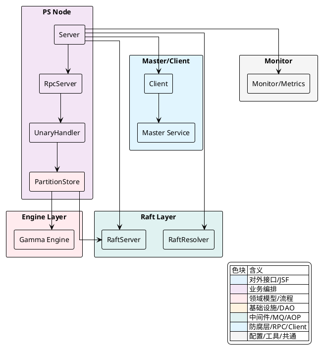
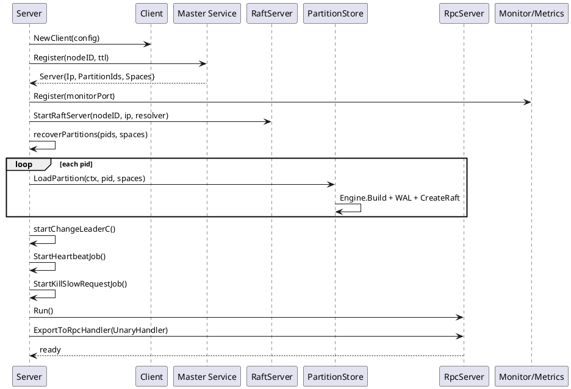
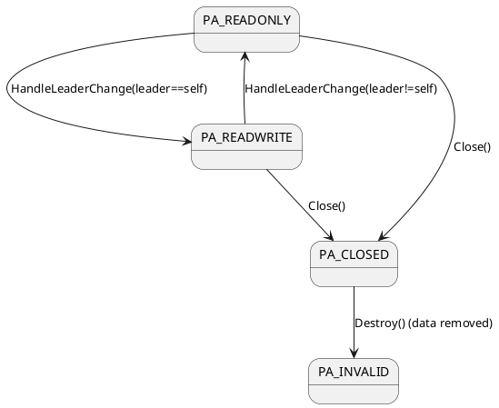
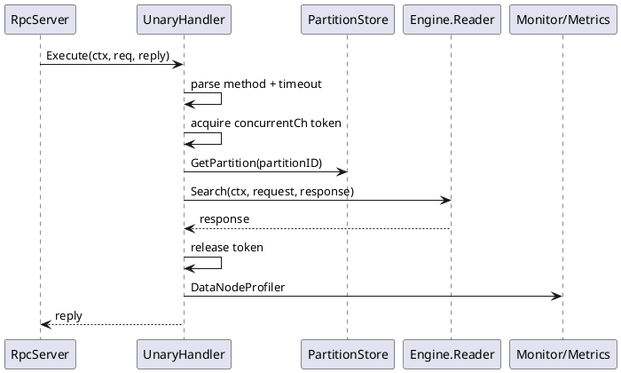
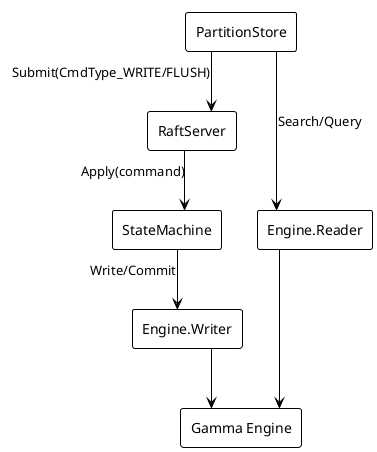
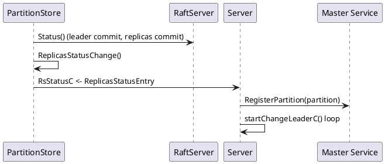

## PS模块与引擎集成

### 模块职责与集成概览
PS（Partition Server）承担分区数据的持久化与检索职责，核心由以下部件协作完成：
- `Server`：节点生命周期管理。负责加载节点与分区元数据、向 `Master` 注册节点与分区、创建并管理 `RaftServer`、启动心跳与慢请求巡检、运行 `RpcServer` 对外提供 RPC。
- `PartitionStore`（默认实现 `raftstore.Store`）：分区的读写入口。封装 `Gamma` 引擎实例、实现 `Raft` 状态机接口，将写入经 `Raft` 共识落盘，并在成为 Leader 后切换为可写状态。读路径在满足可读性约束后直接访问引擎 `Reader`。
- `UnaryHandler`：RPC统一入口。解析方法元数据、应用超时与并发控制、路由到具体分区与操作，并协调返回。
- 引擎层（`Gamma` C++ 引擎 Go SDK）：提供 `Reader`/`Writer` 能力，包括 `Search`、`Query`、`Write`、`Commit(Flush)`、`Optimize(ForceMerge)`、`Rebuild` 等。
- `Raft`：基于 `tiglabs/raft`，通过 `WAL` 保证写入一致性、快照与截断维护日志、监听 Leader 变更与副本进度，驱动分区状态与 `Master` 注册。
- `Client/Master`：内部 RPC 客户端与主控服务，用于节点注册、路由发现、分区注册与副本信息维护。
- `Monitor`：指标与慢请求巡检，辅助运行时治理。

系统/模块架构图：



表：RPC方法到分区/引擎操作映射
| 方法名 | 并发通道 | 分区操作 | 引擎入口 | 是否经 Raft |
|---|---|---|---|---|
| `GetDocsHandler`/`GetDocsByPartitionHandler`/`GetNextDocsByPartitionHandler` | `read_request_concurrent` | `GetDocument` | `Reader.GetDoc` | 否 |
| `DeleteDocsHandler` | `write_request_concurrent` | `Write`（`OpType_DELETE`） | `Writer.Write` | 是 |
| `BatchHandler` | `write_request_concurrent` | `Write`（`OpType_BULK`） | `Writer.Write` | 是 |
| `SearchHandler` | `read_request_concurrent` 或 `slow_search_concurrent` | `Search` | `Reader.Search` | 否 |
| `QueryHandler` | `read_request_concurrent` | `Query` | `Reader.Query` | 否 |
| `ForceMergeHandler` | `write_request_concurrent` | `GetEngine.Optimize` | `Optimize` | 否（直接引擎） |
| `RebuildIndexHandler` | `write_request_concurrent` | `GetEngine.Rebuild` | `Rebuild` | 否（直接引擎） |
| `FlushHandler` | `write_request_concurrent` | `Flush`（Raft `CmdType_FLUSH`） | `Writer.Commit` | 是 |

<details>
<summary>关联代码</summary>

[internal/ps/server.go:123-177](),[internal/ps/handler_document.go:64-75](),[internal/ps/partition_service.go:70-86](),[internal/ps/storage/raftstore/store.go:124-188]()

</details>

### 启动与注册流程
`Server.Start` 串起 PS 节点启动的关键阶段：
- 元数据与节点信息加载：`psutil.InitMeta` 获取 `nodeID`，并通过 `client.Master().Register` 向 `Master` 注册节点，返回当前节点 `IP`、本地持有的 `PartitionIds` 与 `Spaces`。
- `RaftServer` 创建：使用 `StartRaftServer` 根据配置初始化心跳/复制地址、并发参数、保留日志等。失败会重试，直至成功或超过最大次数。
- 分区恢复：`recoverPartitions` 并发加载本地分区，`LoadPartition` 内部创建 `raftstore.Store`，构建引擎、绑定 `Raft`，填充副本解析器（`RaftResolver`），并启动分区。
- 事件与运维任务：启动 `startChangeLeaderC` 监听 Leader 变化与副本状态，启动心跳任务 `StartHeartbeatJob` 与慢请求巡检 `StartKillSlowRequestJob`。
- RPC服务：`rpcServer.Run()` 开启对外服务，随后通过 `ExportToRpcHandler` 导出 `UnaryHandler` 等 RPC 处理链。

启动时序图：



<details>
<summary>关联代码</summary>

[internal/ps/server.go:75-116](),[internal/ps/server.go:123-175](),[internal/ps/server.go:204-226](),[internal/ps/server.go:275-298](),[internal/ps/storage/raftstore/server.go:31-53]()

</details>

### 分区存储与 Raft 集成
`PartitionStore` 是分区数据面，默认实现为 `raftstore.Store`，其职责与实现包括：
- 引擎构建与状态初始化：`Start` 内部通过 `gammacb.Build` 构建 `Gamma` 引擎，读取应用号 `SN`，初始设置分区状态为 `PA_READONLY`（不可写）。随后创建 `WAL` 存储、拼装 `RaftConfig`（含 `Peers`、`Leader`、`Applied`、`StateMachine`），调用 `CreateRaft` 加入共识。
- 状态机应用：`Apply` 反序列化 `vearchpb.RaftCommand` 并进入 `innerApply`：
  - `CmdType_WRITE`：调用 `Engine.Writer().Write` 执行写入。
  - `CmdType_FLUSH`：调用 `Engine.Writer().Commit` 获取 `FlushC`，等待刷盘完成。
  - `CmdType_UPDATESPACE`：更新引擎映射并持久化空间元数据。
  - 更新当前 `SN`。
- 读写可用性约束：`checkWritable` 基于分区状态决定是否允许写；`checkReadable` 针对读取是否要求 Leader 与状态满足。
- Leader 变更与副本进度：
  - `HandleLeaderChange` 在成为 Leader 时将状态切换为 `PA_READWRITE` 并通知事件监听器；
  - 当启用 `RaftConsistent` 时，Leader 在 `Apply` 后检查各副本 `Commit` 与 Leader 差异，构造 `ReplicasStatusEntry` 并投递到 `RsStatusC`，用于外层判断副本可用性与路由决策。

状态流转图（分区可写性）：



<details>
<summary>关联代码</summary>

[internal/ps/partition_service.go:70-86](),[internal/ps/storage/raftstore/store.go:69-96](),[internal/ps/storage/raftstore/store.go:124-188](),[internal/ps/storage/raftstore/raft_state_machine.go:91-121](),[internal/ps/storage/raftstore/raft_state_machine.go:123-144](),[internal/ps/storage/raftstore/raft_state_machine.go:217-229]()

</details>

### 请求处理与统一路由
`UnaryHandler` 统一处理 RPC 请求，提供一致的限流、超时与异常恢复，核心机制：
- 方法解析与跟踪：从请求上下文 `ReqMetaDataKey` 读取 `client.HandlerType`，标记操作名用于监控打点；根据 `deadline` 或元数据 `RPC_TIME_OUT` 设定超时。
- 请求队列与慢查询清理：对于 `Search`/`Query` 请求将 `request.RequestStatus` 进入链表队列（`Rqueue`），在返回时移除。
- 并发通道限流：依据方法与 `IsSlowSearch` 分配到 `slow_search_concurrent`、`read_request_concurrent` 或 `write_request_concurrent`，占位令牌未获取时依据上下文取消或超时返回。
- 分区路由与操作执行：通过 `server.GetPartition` 获取分区存储，使用 `switch` 路由到具体操作，统一在 `req` 或 `reply` 上携带错误与响应。

请求时序（以 Search 为例）：



表：并发通道与适用方法
| 通道名 | 容量来源 | 适用方法 | 特殊条件 |
|---|---|---|---|
| `slow_search_concurrent` | `concurrentNum/4` | `SearchHandler` | `req.SearchRequest.IsSlowSearch == true` |
| `read_request_concurrent` | `concurrentNum` | `QueryHandler`、`SearchHandler`、`GetDocs*` | 常规读 |
| `write_request_concurrent` | `concurrentNum` | `DeleteDocsHandler`、`BatchHandler`、`FlushHandler`、`RebuildIndexHandler`、`ForceMergeHandler` | 写与维护操作 |

<details>
<summary>关联代码</summary>

[internal/ps/handler_document.go:64-75](),[internal/ps/handler_document.go:96-187](),[internal/ps/handler_document.go:189-231](),[internal/ps/handler_document.go:254-290](),[internal/ps/server.go:88-96]()

</details>

### 引擎调用与数据路径
读路径直接访问引擎 `Reader`，写路径经 `Raft` 提交后由状态机调用引擎 `Writer`：
- 读操作：
  - `store.Search`/`store.Query` 先执行 `checkReadable`（可选 Leader 约束），然后调用 `Engine.Reader().Search`/`Query`。
- 写操作：
  - `store.Write` 构造 `vearchpb.RaftCommand{CmdType_WRITE}`，经 `RaftSubmit` 提交，状态机 `Apply` 调用 `Engine.Writer().Write` 完成写入。
  - `store.Flush` 构造 `CmdType_FLUSH`，状态机返回 `FlushC` 通知刷盘完成，`Flush` 阻塞等待。
  - 索引维护：`GetEngine.Optimize`（ForceMerge）、`GetEngine.Rebuild`（重建）直接调用引擎接口。
- 文档序列化：批量写入路径将 `vearchpb.Field` 组装为 `gamma.Doc` 并用 FlatBuffers 序列化；结果反序列化支持 `gamma.Response` 或直接 `proto.Unmarshal` 到 `vearchpb.SearchResponse`。

读写与引擎交互图：



关键代码要点：
- `checkReadable`/`checkWritable` 强制状态检查，防止在非 Leader/关闭/非法状态下读写。
- `CmdType_FLUSH` 的 `FlushC` 信号通道用于精确等待刷盘完成。
- `bulk` 写前进行内存断路器（`entity.CheckVirtualMemExceed`）判定，防止批量过大导致内存压力。

<details>
<summary>关联代码</summary>

[internal/ps/storage/raftstore/store_read.go:25-74](),[internal/ps/storage/raftstore/store_writer.go:77-114](),[internal/ps/storage/raftstore/store_writer.go:116-129](),[internal/ps/storage/raftstore/raft_state_machine.go:123-144](),[internal/engine/sdk/go/gamma/doc.go:23-59](),[internal/engine/sdk/go/gamma/response.go:148-152]()

</details>

### 并发控制与限流
PS 的并发与接入限制由三层机制构成：
- 连接层限制：`limitPlugin` 按当前协程数限制新连接，识别来自 `Master` 的连接例外放行。
- 方法级并发控制：将请求按慢搜/读/写分流到不同容量的令牌通道，使用 `select` 在占位与上下文取消之间选择，保证整体稳定性。
- 内存断路器：`bulk` 写时估算文档大小（`estimatedDocSize`），在超过阈值时提前失败，保护进程内存。

表：配置与默认值
| 配置项 | 默认值 | 说明 |
|---|---|---|
| `PS.ConcurrentNum` | `256` | 并发令牌容量（读/写），慢搜容量为其 1/4 |
| `PS.RpcTimeOut` | `10` 秒 | 统一 RPC 超时，可被请求覆盖 |
| `limitPlugin.size` | `50000` | 连接层限制的最大协程数 |

<details>
<summary>关联代码</summary>

[internal/ps/handler_document.go:44-62](),[internal/ps/server.go:88-96](),[internal/ps/handler_document.go:215-244](),[internal/ps/handler_document.go:333-351]()

</details>

### 领导者变更与 Master 注册
Leader 变更与副本状态变化会驱动 `Master` 上的分区注册更新，保证路由与查询结果一致性：
- 事件通道：`startChangeLeaderC` 处理 Leader 更新（`HandleRaftLeaderEvent`）与副本进度（`RsStatusC`）。
- 注册分区：在仅且当前节点为 Leader 时，`registerMaster` 将分区信息（含 `LeaderID` 与 `ReStatusMap`）注册至 `Master`。
- 副本状态更新：`ReplicasStatusChange` 基于 Leader `Commit` 与副本 `Commit` 差值判定副本是否可用，写入 `RsStatusMap` 并通过 `RsStatusC` 通知；`changeReplicas` 汇总副本状态并上报 `Master`。

副本进度上报时序：



<details>
<summary>关联代码</summary>

[internal/ps/server.go:204-226](),[internal/ps/server.go:302-308](),[internal/ps/server.go:310-334](),[internal/ps/server.go:336-365](),[internal/ps/storage/raftstore/raft_state_machine.go:40-89](),[internal/ps/storage/raftstore/raft_state_machine.go:101-119]()

</details>

### 心跳与监控
PS 节点在启动阶段注册监控端口与心跳任务：
- 监控注册：`monitor.Register` 在端口 `PS.MonitorPort` 或默认 `8818` 注册指标采集。
- 心跳与慢请求巡检：`StartHeartbeatJob` 定时心跳上报与健康检查；`StartKillSlowRequestJob` 结合 `Rqueue` 扫描慢查询并采取终止策略。

监控调用位置代码可作为运维任务存在性与端口选择的依据。

<details>
<summary>关联代码</summary>

[internal/ps/server.go:109-116](),[internal/ps/server.go:162-167](),[internal/ps/handler_document.go:144-161]()

</details>

### 关键代码示例

#### Server.Start 关键路径
展示启动阶段的核心流程，包括注册、Raft 启动与分区恢复：
[internal/ps/server.go:123-175]()
```go
func (s *Server) Start() error {
    s.stopping = false
    nodeId := psutil.InitMeta(s.client, config.Conf().Global.Name, config.Conf().GetDataDir())
    s.nodeID = nodeId

    server := s.register()
    s.ip = server.Ip
    mserver.SetIp(server.Ip, true)

    retryTime := 0
    s.raftServer, err = raftstore.StartRaftServer(nodeId, s.ip, s.raftResolver)
    for err != nil {
        if retryTime > maxTryTime { log.Panic(...) }
        time.Sleep(5 * time.Second)
        retryTime++
        s.raftServer, err = raftstore.StartRaftServer(nodeId, s.ip, s.raftResolver)
    }

    s.recoverPartitions(server.PartitionIds, server.Spaces)
    s.startChangeLeaderC()
    s.StartHeartbeatJob()
    s.StartKillSlowRequestJob()

    if err = s.rpcServer.Run(); err != nil { log.Panic(...) }

    ExportToRpcHandler(s)
    ExportToRpcAdminHandler(s)
    ...
}
```

<details>
<summary>关联代码</summary>

[internal/ps/server.go:123-175]()

</details>

#### UnaryHandler.Execute 并发与路由
展示统一入口的并发令牌选择与方法路由：
[internal/ps/handler_document.go:215-290]()
```go
var concurrentCh chan bool
if req.SearchRequest != nil && req.SearchRequest.IsSlowSearch {
    concurrentCh = handler.server.slow_search_concurrent
} else if method == client.QueryHandler || method == client.SearchHandler ||
    method == client.GetDocsHandler || method == client.GetDocsByPartitionHandler ||
    method == client.GetNextDocsByPartitionHandler {
    concurrentCh = handler.server.read_request_concurrent
} else {
    concurrentCh = handler.server.write_request_concurrent
}

select {
case concurrentCh <- true:
    defer func() { <-concurrentCh }()
case <-ctx.Done():
    // timeout or canceled
    req.Err = vearchpb.NewError(vearchpb.ErrorEnum_TIMEOUT, nil).GetError()
    return
}

store := handler.server.GetPartition(req.PartitionID)
switch method {
case client.BatchHandler:
    bulk(ctx, store, req.Items)
case client.SearchHandler:
    search(ctx, store, req.SearchRequest, req.SearchResponse)
case client.QueryHandler:
    query(ctx, store, req.QueryRequest, req.SearchResponse)
case client.FlushHandler:
    req.Err = flush(ctx, store)
...
}
```

<details>
<summary>关联代码</summary>

[internal/ps/handler_document.go:215-244](),[internal/ps/handler_document.go:254-290]()

</details>

#### Store.Apply 状态机
展示 Raft 命令应用到引擎的核心逻辑：
[internal/ps/storage/raftstore/raft_state_machine.go:123-144]()
```go
func (s *Store) innerApply(index uint64, raftCmd *vearchpb.RaftCommand) any {
    resp := new(RaftApplyResponse)
    switch raftCmd.Type {
    case vearchpb.CmdType_WRITE:
        resp.Err = s.Engine.Writer().Write(s.Ctx, raftCmd.WriteCommand)
    case vearchpb.CmdType_UPDATESPACE:
        resp = s.updateSchemaBySpace(raftCmd.UpdateSpace.Space)
    case vearchpb.CmdType_FLUSH:
        flushC, err := s.Engine.Writer().Commit(s.Ctx, int64(index))
        resp.FlushC = flushC
        resp.Err = err
    default:
        resp.SetErr(fmt.Errorf("unsupported command[%s]", raftCmd.Type))
    }
    s.Sn = int64(index)
    return resp
}
```

<details>
<summary>关联代码</summary>

[internal/ps/storage/raftstore/raft_state_machine.go:123-144]()

</details>

#### Gamma 文档序列化
展示批量写入路径的文档序列化：
[internal/engine/sdk/go/gamma/doc.go:27-59]()
```go
func (doc *Doc) Serialize() []byte {
    builder := flatbuffers.NewBuilder(0)
    var names, values []flatbuffers.UOffsetT
    names = make([]flatbuffers.UOffsetT, len(doc.Fields))
    values = make([]flatbuffers.UOffsetT, len(doc.Fields))
    i := 0
    for _, field := range doc.Fields {
        names[i] = builder.CreateString(field.Name)
        values[i] = builder.CreateString(string(field.Value))
        i++
    }
    fields := make([]flatbuffers.UOffsetT, len(doc.Fields))
    for i := 0; i < len(doc.Fields); i++ {
        gamma_api.FieldStart(builder)
        gamma_api.FieldAddName(builder, names[i])
        gamma_api.FieldAddValue(builder, values[i])
        gamma_api.FieldAddDataType(builder, int8(doc.Fields[i].Type))
        fields[i] = gamma_api.FieldEnd(builder)
    }
    gamma_api.DocStartFieldsVector(builder, len(doc.Fields))
    for i := 0; i < len(doc.Fields); i++ {
        builder.PrependUOffsetT(fields[i])
    }
    f := builder.EndVector(len(doc.Fields))
    gamma_api.TableStart(builder)
    gamma_api.DocAddFields(builder, f)
    builder.Finish(builder.EndObject())
    return builder.FinishedBytes()
}
```

<details>
<summary>关联代码</summary>

[internal/engine/sdk/go/gamma/doc.go:27-59]()

</details>

### 运行要点与实践提示
- 分区可用性判断严格依赖 `Partition` 状态与 Leader 身份，写路径必须在 `PA_READWRITE` 且当前节点为 Leader 才可执行。
- `Flush` 属于强一致刷盘语义，通过 `Raft` 应用索引绑定的 `Commit` 与 `FlushC` 通知完成，适合在批量导入或索引构建阶段作为边界。
- `bulk` 写需关注内存断路器；文档体较大或批量过多时应拆批。
- 查询路径可根据请求头 `ClientType` 指示 Leader 读取（`Query/Search` 的 `Head.ClientType == "leader"`），以保证读取语义与一致性要求。
- 当 `Global.RaftConsistent` 开启时，Leader 将持续监测副本进度并上报；路由层可结合副本状态选择更优的读取节点。

<details>
<summary>关联代码</summary>

[internal/ps/storage/raftstore/store_read.go:52-62](),[internal/ps/storage/raftstore/store_writer.go:129-165](),[internal/ps/handler_document.go:347-375](),[internal/ps/storage/raftstore/raft_state_machine.go:41-89]()

</details>