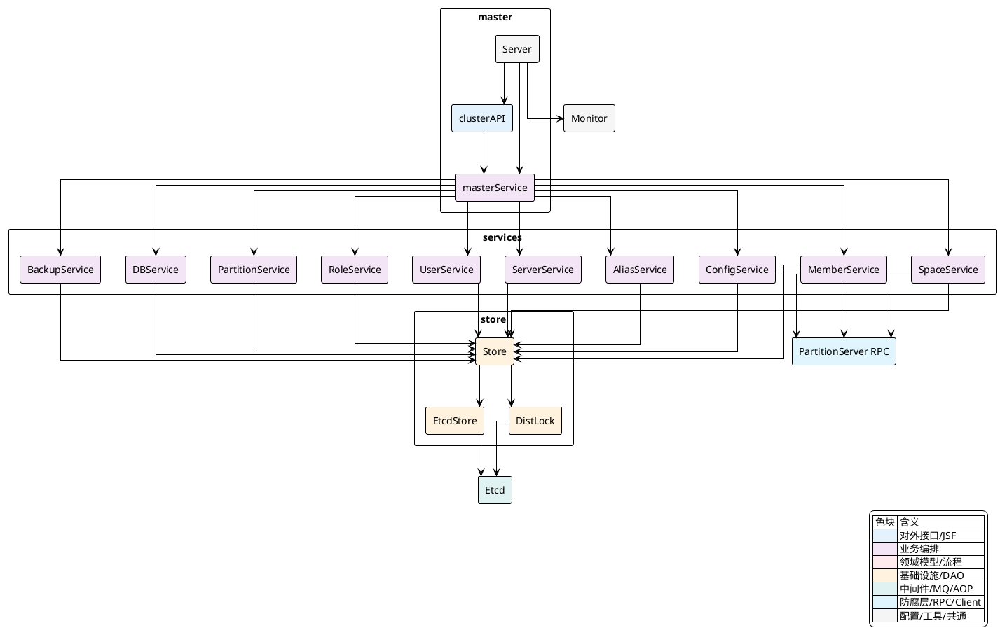
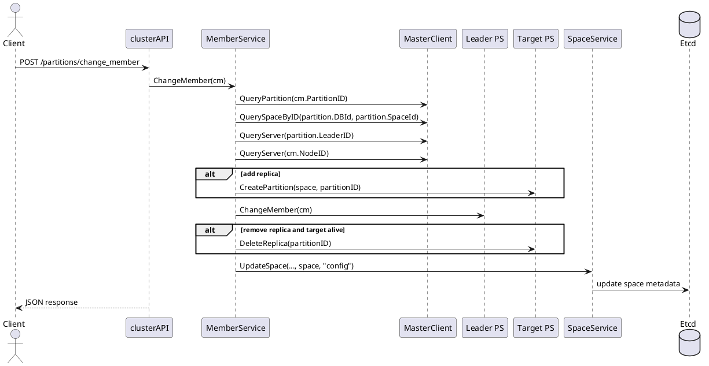
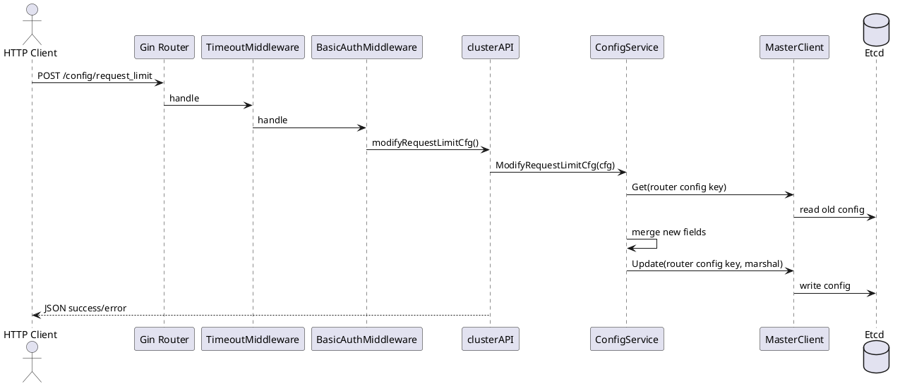

## Master模块与元数据服务

`Master` 在 `Vearch` 中承担两类实现职责：一类是集群控制面入口，负责对外暴露 HTTP 元数据与管理 API；另一类是元数据协调中心，负责把数据库、空间、分区、副本、用户权限、配置与备份状态持久化到 `Etcd`。代码里这两类职责没有混在一个大对象里，而是以 `Server` 启动器、`clusterAPI` 路由层、`masterService` 服务聚合器、`store` 存储抽象四层串联起来。

从实现上看，`Master` 并不直接把所有逻辑写在 Gin Handler 中。HTTP 入口只做三件事：接收请求、施加中间件约束、调用领域 Service。真正涉及元数据一致性、分布式锁、`STM` 事务、分区副本变更的逻辑，都下沉到了 `internal/master/services/*`。而 `internal/master/store/*` 则把 Etcd 操作包装为统一的 `Store` 接口，使上层服务围绕“键空间 + 事务 + 锁 + watch”组织。



### 启动链：从 `Server.Start` 到元数据服务就绪

`Master` 的启动入口集中在 `internal/master/server.go`。这里最重要的不是“启动一个 Gin 服务”，而是把元数据后端、服务编排器、监控、初始化用户、元数据 watch 作业按固定顺序组装起来。这个顺序直接决定了 `Master` 是否能在 HTTP 可访问之前拥有完整的控制面能力。

`NewServer` 先根据 `config.Conf().Global.SelfManageEtcd` 决定 `Etcd` 是外部托管还是本地内嵌。如果是内嵌模式，会通过 `config.Conf().GetEmbed()` 生成 `embed.Config`，之后由 `embed.StartEtcd` 启动。无论哪种模式，都会在数据目录创建一个重启标记文件，表示当前 `Master` 节点经历了一次启动。

`Start` 的第一段逻辑处理 Etcd 可用性。内嵌模式下，`Master` 会阻塞等待 `ReadyNotify()`，超时则直接停止 Etcd 并返回错误。随后通过 `client.NewClient` 建立统一客户端，再通过 `newMasterService` 创建服务聚合器。这个聚合器把 `DB`、`Space`、`Alias`、`Server`、`User`、`Role`、`Partition`、`Member`、`Config`、`Backup` 九类元数据服务挂到同一个入口上。

路由初始化完成后，启动流程继续向后推进：先拉起备份服务，再初始化监控服务，随后创建 Gin HTTP 服务并注册全量集群 API。HTTP 服务真正对外监听后，代码会立即确保系统存在 `root` 用户；如果不存在，则调用 `UserService.CreateUser` 自动创建。最后两个关键作业是 `WatchServerJob` 和 `WatchSpaceJob`，它们分别维护节点状态缓存与空间缓存，使控制面对 Etcd 中的变化具备持续感知能力。

启动尾声还会执行一次集群成员对齐：通过 `MemberList` 找到当前配置中的 `master.Name` 对应的 Etcd 成员 `ID`，再用 `STM` 把成员信息写入 `entity.MasterMemberKey(ID)`。这里写入的并不是 Etcd 的原始 membership，而是 Vearch 自己维护的 `master` 元数据映射。

关键启动链如下：

[internal/master/server.go:82-236]()
```go
func (s *Server) Start() (err error) {
	if !config.Conf().Global.SelfManageEtcd {
		s.etcdServer, err = embed.StartEtcd(s.etcCfg)
		if err != nil {
			return err
		}
		defer s.etcdServer.Close()
		select {
		case <-s.etcdServer.Server.ReadyNotify():
		case <-time.After(60 * time.Second):
			s.etcdServer.Server.Stop()
			return vearchpb.NewError(vearchpb.ErrorEnum_INTERNAL_ERROR, fmt.Errorf("etcd start timeout"))
		}
	}

	s.client, err = client.NewClient(config.Conf())
	if err != nil {
		return err
	}
	service, err := newMasterService(s.client)
	if err != nil {
		return err
	}

	service.Backup().Start()

	httpServer := gin.New()
	ExportToClusterHandler(httpServer, service, s)

	go func() {
		if err := httpServer.Run(":" + cast.ToString(config.Conf().Masters.Self().ApiPort)); err != nil {
			panic(err)
		}
	}()

	if _, err := service.User().QueryUser(s.ctx, service.Role(), userInfo.Name, true); err != nil {
		if err := service.User().CreateUser(s.ctx, service.Role(), userInfo, false); err != nil {
			_, err := service.User().QueryUser(s.ctx, service.Role(), userInfo.Name, true)
			if err != nil {
				panic(err)
			}
		}
	}

	err = s.WatchServerJob(s.ctx, s.client)
	if err != nil {
		os.Exit(1)
	}

	err = s.WatchSpaceJob(s.ctx, s.client)
	if err != nil {
		os.Exit(1)
	}

	resp, err := s.client.Master().MemberList(context.Background())
	if err != nil {
		return err
	}
	// ...
	err = s.client.Master().STM(context.Background(), func(stm concurrency.STM) error {
		marshal, err := vjson.Marshal(master)
		if err != nil {
			return err
		}
		stm.Put(entity.MasterMemberKey(ID), string(marshal))
		return nil
	})
	if err != nil {
		return err
	}

	if !config.Conf().Global.SelfManageEtcd {
		return <-s.etcdServer.Err()
	}
	return nil
}
```

这里可以把启动过程理解为“先让元数据后端可写，再让领域服务可用，最后让对外 API 暴露并伴随 watch 作业进入持续运行态”。

<details>
<summary>关联代码</summary>

[internal/master/server.go:46-239](),[internal/master/cluster_service.go:22-90]()

</details>

### API装配：Gin 路由、中间件与 Service 入口

`cluster_api.go` 是 `Master` 的 HTTP 面。它的关键点不在于路由数量，而在于请求在进入 Service 之前被附加了哪些控制语义：异常恢复、超时控制、基础认证、权限校验，以及统一错误映射。

`ExportToClusterHandler` 创建了两个路由组。`group` 用于无需认证的接口，例如根路径 `/`、内部注册接口 `/register`、`/register_partition`、`/register_router`。`groupAuth` 则在未开启 `SkipAuth` 时套上 `BasicAuthMiddleware`，用于 DB、Space、Alias、Partition、Schedule、User、Role、Config、Backup 等管理接口。这意味着 API 层已经完成了“公开注册入口”和“受控元数据管理入口”的分流。

`TimeoutMiddleware` 给每个请求包上一层 `context.WithTimeout`。如果请求参数中带有 `timeout`，则按毫秒解析；否则使用默认的 `10s`。它不是简单地把超时写进上下文，而是把 `c.Next()` 放到 goroutine 中执行，再从 `httpResponse` 取出处理结果。如果超时先发生，就直接返回 `504 Gateway Timeout` 和 Vearch 的 `TIMEOUT` 码。这样一来，Service 层只要尊重 `c.Request.Context()`，就能共享这条链路的超时语义。

`RecoveryMiddleware` 则负责兜底 `panic`，将其转换成 `500` 响应。`handleError` 把内部的 `vearchpb.VearchErr` 映射为 HTTP 语义，例如“已存在”映射到 `422`，“不存在”映射到 `404`，“参数错误”映射到 `400`，“鉴权失败”映射到 `401`。这部分代码建立了领域错误码与 REST 响应之间的桥梁。

认证链路本身也在 `cluster_api.go`。`BasicAuthMiddleware` 从 `Authorization` 头中提取 `Basic` 凭据，解码出用户名密码后，先调用 `Role().QueryUserWithPassword` 读取用户及其角色，再通过 `Role().QueryRole` 取出完整权限模型，最后执行 `role.HasPermissionForResources(endpoint, method)`。权限判断基于“当前路由模板 + HTTP 方法”，而不是业务层二次判断，所以路由定义天然就是权限资源模型的一部分。

HTTP 入口装配代码如下：

[internal/master/cluster_api.go:244-327]()
```go
func ExportToClusterHandler(router *gin.Engine, masterService *masterService, server *Server) {
	c := &clusterAPI{router: router, masterService: masterService, server: server}
	router.Use(RecoveryMiddleware())
	router.Use(TimeoutMiddleware(10 * time.Second))

	var groupAuth *gin.RouterGroup
	var group *gin.RouterGroup = router.Group("")
	if !config.Conf().Global.SkipAuth {
		groupAuth = router.Group("", BasicAuthMiddleware(masterService))
	} else {
		groupAuth = router.Group("")
	}

	group.GET("/", c.handleClusterInfo)

	groupAuth.GET("/clean_lock", c.cleanLock)
	groupAuth.GET("/servers", c.serverList)
	groupAuth.GET("/routers", c.routerList)

	group.POST("/register", c.register)
	group.POST("/register_partition", c.registerPartition)
	group.POST("/register_router", c.registerRouter)

	groupAuth.POST("/dbs/:db_name", c.createDB)
	groupAuth.GET("/dbs/:db_name", c.getDB)
	groupAuth.GET("/dbs", c.getDB)
	groupAuth.DELETE("/dbs/:db_name", c.deleteDB)
	groupAuth.PUT("/dbs/:db_name", c.modifyDB)

	groupAuth.POST("/dbs/:db_name/spaces", c.createSpace)
	groupAuth.GET("/dbs/:db_name/spaces/:space_name", c.getSpace)
	groupAuth.GET("/dbs/:db_name/spaces", c.getSpace)
	groupAuth.DELETE("/dbs/:db_name/spaces/:space_name", c.deleteSpace)
	groupAuth.PUT("/dbs/:db_name/spaces/:space_name", c.updateSpace)

	groupAuth.POST("/partitions/change_member", c.changeMember)
	groupAuth.POST("/schedule/recover_server", c.RecoverFailServer)
	groupAuth.POST("/schedule/change_replicas", c.ChangeReplicas)
}
```

中间件核心实现如下：

[internal/master/cluster_api.go:98-218]()
```go
func BasicAuthMiddleware(masterService *masterService) gin.HandlerFunc {
	return func(c *gin.Context) {
		authHeader := c.GetHeader("Authorization")
		if authHeader == "" {
			response.New(c).JsonError(errors.NewErrUnauthorized(fmt.Errorf("auth header is empty")))
			c.Abort()
			return
		}

		parts := strings.SplitN(authHeader, " ", 2)
		if len(parts) != 2 || parts[0] != "Basic" {
			response.New(c).JsonError(errors.NewErrUnauthorized(fmt.Errorf("auth header type is invalid")))
			c.Abort()
			return
		}

		decoded, err := base64.StdEncoding.DecodeString(parts[1])
		if err != nil {
			response.New(c).JsonError(errors.NewErrUnauthorized(err))
			c.Abort()
			return
		}

		credentials := strings.SplitN(string(decoded), ":", 2)
		user, err := masterService.Role().QueryUserWithPassword(c, credentials[0], true)
		if err != nil {
			response.New(c).JsonError(errors.NewErrUnauthorized(err))
			c.Abort()
			return
		}
		if *user.Password != credentials[1] {
			response.New(c).JsonError(errors.NewErrUnauthorized(fmt.Errorf("auth header password is invalid")))
			c.Abort()
			return
		}

		role, err := masterService.Role().QueryRole(c, user.Role.Name)
		if err != nil {
			response.New(c).JsonError(errors.NewErrUnauthorized(err))
			c.Abort()
			return
		}
		endpoint := c.FullPath()
		method := c.Request.Method
		if err := role.HasPermissionForResources(endpoint, method); err != nil {
			response.New(c).JsonError(errors.NewErrUnauthorized(err))
			c.Abort()
			return
		}

		c.Next()
	}
}

func TimeoutMiddleware(defaultTimeout time.Duration) gin.HandlerFunc {
	return func(c *gin.Context) {
		ctx, cancel := context.WithTimeout(c.Request.Context(), defaultTimeout)
		defer cancel()

		c.Request = c.Request.WithContext(ctx)
		resultCh := make(chan *response.Response, 1)

		go func() {
			c.Next()
			httpResponse, exist := c.Get("httpResponse")
			var httpResp *response.Response
			if exist && httpResponse != nil {
				if _, ok := httpResponse.(*response.Response); ok {
					httpResp = httpResponse.(*response.Response)
				}
			}
			resultCh <- httpResp
		}()

		select {
		case <-ctx.Done():
			c.JSON(http.StatusGatewayTimeout, gin.H{
				"request_id": c.GetHeader(paramRequestID),
				"code":       vearchpb.ErrorEnum_TIMEOUT,
				"msg":        "request timeout"})
			c.Abort()
		case res := <-resultCh:
			if res != nil {
				c.JSON(int(res.GetHttpStatus()), res.GetHttpReply())
			}
		}
	}
}
```

这层实现把 `Master` 的 HTTP 行为变成了“统一外壳 + 领域调用器”，而不是直接在 handler 中拼装 Etcd 操作。

<details>
<summary>关联代码</summary>

[internal/master/cluster_api.go:63-247](),[internal/master/cluster_api.go:244-327]()

</details>

### 服务分层：`masterService` 如何把元数据职责拆开

`masterService` 是一层很薄但很关键的聚合对象。它本身没有复杂逻辑，却决定了整个 `Master` 模块的职责边界：每个领域对象只暴露一个单独的 Service，API 层通过聚合器取得这些 Service，而不是跨层直接访问底层客户端。这样，路由层总是面对“业务语义”，例如 `CreateDB`、`UpdateSpace`、`ChangeMember`、`ModifyRequestLimitCfg`，而不是“我要写哪个 Etcd key”。

聚合器初始化在 `newMasterService` 中完成。每个子服务都共享同一个 `client.Client`，因此它们访问元数据、查询节点、调用分区节点 RPC 时使用的是统一的基础设施对象。

这个设计在实际调用链中体现得很明显。比如 `changeMember` 的 handler 只负责参数解析，真正的副本变更会落到 `MemberService.ChangeMembers`；`modifyRequestLimitCfg` 只绑定 JSON，然后交给 `ConfigService.ModifyRequestLimitCfg`；创建库、删库、建空间、删空间、用户管理也都是同样模式。

`masterService` 的定义如下：

[internal/master/cluster_service.go:22-50]()
```go
type masterService struct {
	*client.Client
	dbService        *services.DBService
	spaceService     *services.SpaceService
	aliasService     *services.AliasService
	serverService    *services.ServerService
	userService      *services.UserService
	roleService      *services.RoleService
	partitionService *services.PartitionService
	memberService    *services.MemberService
	configService    *services.ConfigService
	backupService    *services.BackupService
}

func newMasterService(client *client.Client) (*masterService, error) {
	return &masterService{
		Client:           client,
		dbService:        services.NewDBService(client),
		spaceService:     services.NewSpaceService(client),
		aliasService:     services.NewAliasService(client),
		serverService:    services.NewServerService(client),
		userService:      services.NewUserService(client),
		roleService:      services.NewRoleService(client),
		partitionService: services.NewPartitionService(client),
		memberService:    services.NewMemberService(client),
		configService:    services.NewConfigService(client),
		backupService:    services.NewBackupService(client),
	}, nil
}
```

各服务覆盖的元数据领域可以直接用代码结构来理解：

| 服务 | 主要职责 | 典型操作 |
|---|---|---|
| `DBService` | 数据库元数据 | `CreateDB`、`DeleteDB`、`QueryDB` |
| `SpaceService` | 空间、分区、分配与空间状态 | `CreateSpace`、`DeleteSpace`、`UpdateSpace` |
| `AliasService` | 别名元数据 | `CreateAlias`、`UpdateAlias`、`QueryAlias` |
| `ServerService` | 分区节点注册、故障恢复、资源限制 | `RegisterServer`、`RecoverFailServer` |
| `UserService` | 用户元数据 | `CreateUser`、`UpdateUser`、`DeleteUser` |
| `RoleService` | 角色与权限模型 | `CreateRole`、`ChangeRolePrivilege`、`QueryRole` |
| `PartitionService` | 分区视图、分区注册 | `PartitionInfo`、`RegisterPartition` |
| `MemberService` | Master 成员管理与分区副本成员变更 | `AddMember`、`RemoveMember`、`ChangeMember` |
| `ConfigService` | 空间引擎配置与全局限流配置 | `ModifySpaceConfig`、`ModifyMemoryLimitCfg` |
| `BackupService` | 备份版本、进度、恢复进度 | `Start`、`GetBackupProgress` |

这层划分的直接结果，是元数据模型之间的依赖关系在 Service 间显式化。例如用户创建依赖角色校验，所以 `UserService.CreateUser` 接收 `RoleService`；恢复故障节点依赖副本成员变更，所以 `ServerService.RecoverFailServer` 接收 `MemberService` 与 `SpaceService`；改变副本数依赖库与空间查询，所以 `MemberService.ChangeReplica` 同时接收 `DBService` 和 `SpaceService`。

<details>
<summary>关联代码</summary>

[internal/master/cluster_service.go:22-90](),[internal/master/services/db_service.go:34-99](),[internal/master/services/space_service.go:51-258](),[internal/master/services/member_service.go:36-312]()

</details>

### Etcd 访问模型：`Store` 抽象、`STM` 事务与分布式锁

`Master` 模块的元数据服务本质上都围绕键值存储组织，但代码没有把 Etcd API 直接散落在服务层。`internal/master/store/store.go` 定义了统一 `Store` 接口，把核心能力收束为 `Put`、`Create`、`Get`、`PrefixScan`、`Delete`、`STM`、`NewLock`、`WatchPrefix`、`MemberList` 等方法。这样，服务层描述的始终是“事务性更新某组元数据”而不是“调用哪个 Etcd 客户端方法”。

`EtcdStore` 是当前实现。它通过 `clientv3.Client` 提供事务与 watch 语义，其中最重要的三项能力分别是：

第一，`NewIDGenerate` 使用 `STM` 完成全局自增 ID 分配。数据库、空间、分区的 ID 都由这一机制生成，避免多 `Master` 并发时的冲突。

第二，`Create` 和 `STM` 提供写入一致性。`Create` 用 `Txn + Version(key)==0` 确保“仅在不存在时写入”；`STM` 则允许在一个事务闭包中读取并修改多个 key。库名到库 ID、库 ID 到库名、库实体 body 这样的多 key 更新都依赖它。

第三，`NewLock` 返回基于 Etcd lease 的 `DistLock`。服务层在执行建库、建空间、建别名、改用户、改角色等互斥操作时，会先获取逻辑锁，保证同一资源名上的并发修改被串行化。

`Store` 接口如下：

[internal/master/store/store.go:45-69]()
```go
type Store interface {
	Put(ctx context.Context, key string, value []byte) error
	Create(ctx context.Context, key string, value []byte) error
	CreateWithTTL(ctx context.Context, key string, value []byte, ttl time.Duration) error
	KeepAlive(ctx context.Context, key string, value []byte, ttl time.Duration) (<-chan *clientv3.LeaseKeepAliveResponse, error)
	PutWithLeaseId(ctx context.Context, key string, value []byte, ttl time.Duration, leaseId clientv3.LeaseID) error
	Update(ctx context.Context, key string, value []byte) error
	Get(ctx context.Context, key string) ([]byte, error)
	PrefixScan(ctx context.Context, prefix string) ([][]byte, [][]byte, error)
	Delete(ctx context.Context, key string) error
	STM(ctx context.Context, apply func(stm concurrency.STM) error) error
	NewLock(ctx context.Context, key string, timeout time.Duration) *DistLock
	NewIDGenerate(ctx context.Context, key string, base int64, timeout time.Duration) (int64, error)
	WatchPrefix(ctx context.Context, key string) (clientv3.WatchChan, error)
	MemberList(ctx context.Context) (*clientv3.MemberListResponse, error)
	MemberStatus(ctx context.Context) ([]*clientv3.StatusResponse, error)
	MemberAdd(ctx context.Context, peerAddrs []string) (*clientv3.MemberAddResponse, error)
	MemberRemove(ctx context.Context, id uint64) (*clientv3.MemberRemoveResponse, error)
	Endpoints() []string
	MemberSync(ctx context.Context) error
}
```

`EtcdStore` 中最关键的事务与 ID 逻辑如下：

[internal/master/store/etcdstore.go:38-66]()
```go
func (store *EtcdStore) NewIDGenerate(ctx context.Context, key string, base int64, timeout time.Duration) (int64, error) {
	var (
		nextID = int64(0)
		err    error
	)
	err = store.STM(ctx, func(stm concurrency.STM) error {
		v := stm.Get(key)
		if len(v) == 0 {
			stm.Put(key, fmt.Sprintf("%v", base))
			nextID = base
			return nil
		}

		intv, err := strconv.ParseInt(v, 10, 64)
		if err != nil {
			return fmt.Errorf("increment id error in storage :%v", v)
		}

		nextID = intv + 1
		stm.Put(key, strconv.FormatInt(nextID, 10))
		return nil
	})

	if err != nil {
		return int64(0), err
	}
	return nextID, nil
}
```

[internal/master/store/etcdstore.go:103-115]()
```go
func (store *EtcdStore) Create(ctx context.Context, key string, value []byte) error {
	resp, err := store.cli.Txn(ctx).
		If(clientv3.Compare(clientv3.Version(key), "=", 0)).
		Then(clientv3.OpPut(key, string(value))).
		Commit()
	if err != nil {
		return err
	}
	if !resp.Succeeded {
		return fmt.Errorf("etcd store key :%v error", key)
	}
	return nil
}
```

[internal/master/store/etcdstore.go:212-222]()
```go
func (store *EtcdStore) STM(ctx context.Context, apply func(stm concurrency.STM) error) error {
	resp, err := concurrency.NewSTM(store.cli, apply)
	if err != nil {
		return err
	}
	if !resp.Succeeded {
		return fmt.Errorf("etcd stm failed")
	}
	return nil
}
```

分布式锁实现也不是“一个 key 上简单写值”，而是创建带 lease 的临时顺序节点，再等待前序 revision 删除。这样同一路径上的多个竞争者能按 revision 串行进入临界区。

[internal/master/store/distlock.go:47-53]()
```go
func (dl *DistLock) Lock() (err error) {
	err = dl.lock()
	if err != nil {
		return dl.Unlock()
	}
	return nil
}
```

[internal/master/store/distlock.go:104-129]()
```go
func (dl *DistLock) lock() (err error) {
	if dl.ttl <= 0 {
		dl.ttl = 30 * time.Second
	}

	lease, err := dl.client.Grant(dl.ctx, int64(dl.ttl.Seconds()))
	if err != nil {
		return err
	}
	dl.leaseID = lease.ID
	_, revision, err := dl.newUniqueEphemeralKV(dl.ctx, dl.client, lease.ID, dl.path, "")
	if err != nil {
		return err
	}

	for {
		done, err := dl.waitOnLastRev(dl.ctx, dl.path, revision)
		if err != nil {
			dl.client.Revoke(context.Background(), lease.ID)
			return err
		}
		if done {
			return nil
		}
	}
}
```

这套实现决定了服务层的典型写法：先锁定资源名，再在 `STM` 中校验当前状态并提交多 key 更新。

<details>
<summary>关联代码</summary>

[internal/master/store/store.go:26-76](),[internal/master/store/etcdstore.go:33-318](),[internal/master/store/distlock.go:30-181]()

</details>

### 数据库与空间元数据：从逻辑对象到 Etcd 键空间

在 `Master` 代码里，数据库和空间并不是单一记录，而是多类键的组合。`DBService.CreateDB` 会同时维护库 ID、库名和库实体 body，这样既支持按名字查 ID，也支持按 ID 反查名字及读取完整对象。它先做名字合法性校验和 PS 列表校验，再生成全局 DB ID，随后用 `LockDBKey(db.Name)` 获取分布式锁，最终在 `STM` 中原子写入三组 key。

`DeleteDB` 的删除逻辑则先查库、再查空间列表，只有当库下没有空间时才在事务中删除对应 key。这说明库和空间之间的约束不是通过底层外键完成的，而是通过服务层先校验“逻辑非空”，再执行删除。

创建库的实现如下：

[internal/master/services/db_service.go:42-98]()
```go
func (s *DBService) CreateDB(ctx context.Context, db *entity.DB) (err error) {
	mc := s.client.Master()
	if err = db.Validate(); err != nil {
		return err
	}

	if err = s.validatePS(ctx, db.Ps); err != nil {
		return err
	}

	db.Id, err = mc.NewIDGenerate(ctx, entity.DBIdSequence, 1, 5*time.Second)
	if err != nil {
		return err
	}

	mutex := mc.NewLock(ctx, entity.LockDBKey(db.Name), time.Second*300)
	if err = mutex.Lock(); err != nil {
		return err
	}
	defer mutex.Unlock()

	err = mc.STM(context.Background(), func(stm concurrency.STM) error {
		idKey, nameKey, bodyKey := mc.DBKeys(db.Id, db.Name)

		if stm.Get(nameKey) != "" {
			return vearchpb.NewError(vearchpb.ErrorEnum_DB_EXIST, fmt.Errorf("dbname %s already exists", db.Name))
		}

		if stm.Get(idKey) != "" {
			return vearchpb.NewError(vearchpb.ErrorEnum_DB_EXIST, fmt.Errorf("dbID %d already exists", db.Id))
		}
		value, err := json.Marshal(db)
		if err != nil {
			return err
		}
		stm.Put(nameKey, cast.ToString(db.Id))
		stm.Put(idKey, db.Name)
		stm.Put(bodyKey, string(value))
		return nil
	})
	return err
}
```

空间创建则比数据库复杂得多，因为空间不仅是元数据对象，还承担“分区切分”和“副本初始分配”的职责。`SpaceService.CreateSpace` 的逻辑链条是：

先根据 `dbName` 找到 `DBId`，然后校验 schema。接着以 `LockSpaceKey(dbName, spaceName)` 上锁，检查同名空间是否已存在。之后生成 `space.Id`，解析字段属性，合并字段级索引定义，并校验至少存在一个向量索引。完成这些静态校验后，代码会根据 `PartitionNum` 及可选的 `PartitionRule` 批量生成 `PartitionID`，为每个分区计算 slot。

分区对象生成完成后，并不会立即把空间视为可用。代码先将 `space.Enabled` 设为 `false`，把空间主体写入 Etcd，然后根据当前可用服务器做副本分配，为每个分区并发发起 `createPartitionOnServers` RPC。如果任一分区创建失败，代码会回滚：删除已创建分区的远端副本，并尝试删除对应分区元数据；只有 `waitForPartitionsReady` 成功后，才把 `space.Enabled` 切到 `true`，再调用 `UpdateSpaceData` 持久化最终状态。

这意味着空间写入采取的是“先占位、后分发、再启用”的顺序。空间 body 提前进入 Etcd，是为了让后续分区节点注册与状态汇聚有一个元数据锚点；`Enabled` 则承担了是否可被视为正式可用空间的状态位。

空间创建核心代码如下：

[internal/master/services/space_service.go:59-257]()
```go
func (s *SpaceService) CreateSpace(ctx context.Context, dbs *DBService, dbName string, space *entity.Space, isRestore bool) (err error) {
	masterClient := s.client.Master()
	if space.DBId, err = masterClient.QueryDBName2ID(ctx, dbName); err != nil {
		return err
	}

	_, err = mapping.SchemaMap(space.Fields)
	if err != nil {
		return err
	}

	spaceLock := masterClient.NewLock(ctx, entity.LockSpaceKey(dbName, spaceName), time.Second*300)
	if err = spaceLock.Lock(); err != nil {
		return err
	}
	defer spaceLock.Unlock()

	if _, err := masterClient.QuerySpaceByName(ctx, space.DBId, space.Name); err == nil {
		return vearchpb.NewError(vearchpb.ErrorEnum_SPACE_EXIST, nil)
	}

	servers, err := masterClient.QueryServers(ctx)
	if err != nil {
		return err
	}

	spaceID, err := masterClient.NewIDGenerate(ctx, entity.SpaceIdSequence, 1, 5*time.Second)
	if err != nil {
		return err
	}
	space.Id = spaceID

	spaceProperties, err := entity.UnmarshalPropertyJSON(space.Fields)
	if err != nil {
		return err
	}
	space.SpaceProperties = spaceProperties

	if !isRestore || (isRestore && len(space.Indexes) == 0) {
		if err := entity.MergeFieldIndexes(spaceProperties, &space.Indexes); err != nil {
			return err
		}
	}

	hasVectorIndex := false
	for _, idx := range space.Indexes {
		if !entity.IsScalarIndexType(idx.Type) {
			hasVectorIndex = true
			break
		}
	}
	if !hasVectorIndex {
		return vearchpb.NewError(vearchpb.ErrorEnum_PARAM_ERROR, fmt.Errorf("space vector field index should not be empty"))
	}

	// generate partitions ...

	isSpaceDisabled := false
	space.Enabled = &isSpaceDisabled
	defer func() {
		if !(*space.Enabled) {
			_ = masterClient.Delete(context.Background(), entity.SpaceKey(space.DBId, space.Id))
		}
	}()

	marshaledSpace, err := json.Marshal(space)
	if err != nil {
		return err
	}
	err = masterClient.Create(ctx, entity.SpaceKey(space.DBId, space.Id), marshaledSpace)
	if err != nil {
		return err
	}

	// create partitions on servers ...
	if err := s.waitForPartitionsReady(ctx, masterClient, space.Partitions, errorChannel); err != nil {
		// rollback
		return err
	}

	isSpaceEnabled := true
	space.Enabled = &isSpaceEnabled

	err = s.UpdateSpaceData(ctx, space)
	if err != nil {
		bFalse := false
		space.Enabled = &bFalse
		return err
	}

	return nil
}
```

删除空间则沿相反方向执行：先删空间 key，再删除各分区的远程副本与分区 key，最后删除空间配置 key。因为分区节点的副本删除是通过 RPC 完成，所以“元数据删除”和“远程存储清理”并不是单一事务，而是服务层顺序编排的复合操作。

<details>
<summary>关联代码</summary>

[internal/master/services/db_service.go:42-188](),[internal/master/services/space_service.go:59-315]()

</details>

### 成员变更与故障恢复：分区副本是如何被修改的

`MemberService` 负责两类“成员”概念：一类是 Etcd 的 `Master` 集群成员；另一类是某个分区在分区节点上的副本成员。前者通过 `MemberAdd`、`MemberRemove` 管理 Etcd membership；后者通过 `ChangeMember`、`ChangeMembers`、`ChangeReplica` 管理分区副本布局。

`RemoveMember` 的实现很直接：先读取当前 Etcd 成员列表，确保集群成员数大于 1，再确认待删除成员确实存在，然后调用 `mc.MemberRemove`，接着在 Vearch 自己的元数据空间里删除 `entity.MasterMemberKey(master.ID)`，最后执行一次 `MemberSync`。这说明 `Master` 成员信息在 Vearch 的元数据视图里是 Etcd membership 的一层镜像。

更复杂的是分区副本成员变更。`ChangeMember` 的处理顺序是：

先根据 `PartitionID` 读取分区对象，再定位其所属空间与数据库名。然后直接修改 `space` 对象中目标分区的 `Replicas` 列表：增加节点时追加 `NodeID`，移除节点时过滤掉对应节点。接着读取当前分区 `LeaderID` 对应的节点 `psNode`，因为真正的 raft 成员变更必须由 leader 协调。如果目标操作是新增副本，会先对目标节点发 `CreatePartition`，确保副本数据容器存在；然后通过 leader 节点调用 `client.ChangeMember` 发起 raft 配置变更；如果是删除副本，在变更完成后，还会对被移除节点调用 `DeleteReplica`。最后一步再调用 `spaceService.UpdateSpace` 把修改过的空间副本布局写回元数据。

这里有一个重要实现特征：元数据中的 `Replicas` 先在内存对象里变更，但真正持久化发生在最后的 `UpdateSpace`。因此整个流程是“远端 raft 变更成功后，元数据视图再追平”。

核心代码如下：

[internal/master/services/member_service.go:102-197]()
```go
func (s *MemberService) ChangeMember(ctx context.Context, spaceService *SpaceService, cm *entity.ChangeMember) error {
	mc := s.client.Master()
	partition, err := mc.QueryPartition(ctx, cm.PartitionID)
	if err != nil {
		return err
	}

	space, err := mc.QuerySpaceByID(ctx, partition.DBId, partition.SpaceId)
	if err != nil {
		return err
	}

	dbName, err := mc.QueryDBId2Name(ctx, space.DBId)
	if err != nil {
		return err
	}

	spacePartition := space.GetPartition(cm.PartitionID)

	if cm.Method != proto.ConfRemoveNode {
		if slices.Contains(spacePartition.Replicas, cm.NodeID) {
			return vearchpb.NewError(vearchpb.ErrorEnum_PARAM_ERROR, fmt.Errorf("partition:[%d] already on server:[%d]", cm.PartitionID, cm.NodeID))
		}
		spacePartition.Replicas = append(spacePartition.Replicas, cm.NodeID)
	} else {
		tempIDs := make([]entity.NodeID, 0, len(spacePartition.Replicas)-1)
		for _, id := range spacePartition.Replicas {
			if id != cm.NodeID {
				tempIDs = append(tempIDs, id)
			}
		}
		spacePartition.Replicas = tempIDs
	}

	psNode, err := mc.QueryServer(ctx, partition.LeaderID)
	// retry omitted ...

	targetNode, err := mc.QueryServer(ctx, cm.NodeID)
	if err != nil {
		if cm.Method == proto.ConfRemoveNode {
			targetNode = nil
		} else {
			return err
		}
	}

	if !client.IsLive(psNode.RpcAddr()) {
		return vearchpb.NewError(vearchpb.ErrorEnum_PARTITION_SERVER_ERROR, fmt.Errorf("server:[%d] addr:[%s] can not connect ", cm.NodeID, psNode.RpcAddr()))
	}

	if cm.Method == proto.ConfAddNode && targetNode != nil {
		if err := client.CreatePartition(targetNode.RpcAddr(), space, cm.PartitionID); err != nil {
			return vearchpb.NewError(vearchpb.ErrorEnum_INTERNAL_ERROR, fmt.Errorf("create partiiton has err:[%s]", err.Error()))
		}
	}

	if err := client.ChangeMember(psNode.RpcAddr(), cm); err != nil {
		return err
	}
	if cm.Method == proto.ConfRemoveNode && targetNode != nil && client.IsLive(targetNode.RpcAddr()) {
		if err := client.DeleteReplica(targetNode.RpcAddr(), cm.PartitionID); err != nil {
			return vearchpb.NewError(vearchpb.ErrorEnum_INTERNAL_ERROR, fmt.Errorf("delete partiiton has err:[%s]", err.Error()))
		}
	}

	if _, err := spaceService.UpdateSpace(ctx, nil, dbName, space.Name, space, "config"); err != nil {
		return err
	}
	return nil
}
```

`ChangeReplica` 则是“批量对所有分区执行一次加副本或减副本”的编排器。它先根据库和空间找出所有分区，再根据当前各节点承载的分区数量排序，为每个分区挑选新增或删除的目标节点。最终逐一调用 `ChangeMember`。全部分区变更成功后，它还会再次锁住空间元数据，将 `space.ReplicaNum` 加一或减一，再用 `UpdateSpaceData` 落盘。这一步把“副本拓扑”与“副本数配置”对齐。

故障恢复逻辑位于 `ServerService.RecoverFailServer`。其实现并不引入单独的恢复协议，而是对故障节点上的每个分区执行两步副本成员变更：先把新节点加进来，再把故障节点移除，最后从 fail server 集合中剔除故障记录。恢复流程本质上是 `ChangeMember` 的组合。



<details>
<summary>关联代码</summary>

[internal/master/services/member_service.go:44-312](),[internal/master/services/server_service.go:94-134](),[internal/master/cluster_api.go:356-376]()

</details>

### Server、Space 的 watch 作业与元数据自清理

`Master` 启动后不会只被动读写 Etcd。`WatchServerJob` 和 `WatchSpaceJob` 会一直跟踪特定前缀下的变更，维护运行期缓存，并在空间删除后清理监控指标。

`WatchServerJob` 本身比较薄，调用了 `client.NewWatchServerCache` 初始化服务端节点缓存。`WatchSpaceJob` 则完全在 `schedule_job.go` 中实现：它先读取所有空间初始化本地 `spaceCache`，只缓存 `ResourceName` 与当前实例配置一致的空间。之后构造 `watcherJob` 监听 `entity.PrefixSpace`。当收到 `PUT` 事件时，它会反序列化 `Space`，查出库名，按 `dbName + space.Name` 形成缓存键。如果这是新空间，或者其 `Version` 高于缓存版本，就覆盖本地缓存；当收到 `DELETE` 事件时，它会扫描缓存对象，找到匹配的 `DBId` 与 `SpaceId`，删除缓存，并移除相关空间与分区的 metrics。

这段实现表明 `Master` 除了持久化元数据，还承担了一部分“运行态索引”的职责。很多上层查询并不直接扫描 Etcd，而是依赖 watch 维护出的缓存视图。

`watcherJob.start` 的实现采用一个外层常驻 goroutine + 内层真正 watch goroutine 的模式。如果 watch 因错误或服务端关闭而退出，外层循环会等待再重新建立 watcher。这样 watch 行为具备了自恢复能力。

[internal/master/schedule_job.go:216-285]()
```go
func (s *Server) WatchSpaceJob(ctx context.Context, cli *client.Client) error {
	_, cancel := context.WithCancel(ctx)

	cc := &clientCache{
		cli:        cli,
		cancel:     cancel,
		spaceCache: cache.New(cache.NoExpiration, cache.NoExpiration),
	}

	if err := cc.initSpace(ctx); err != nil {
		return err
	}
	spaceJob := watcherJob{ctx: ctx, prefix: entity.PrefixSpace, cli: cli, cache: cc.spaceCache,
		put: func(key, value []byte) (err error) {
			space := &entity.Space{}
			if err := vjson.Unmarshal(value, space); err != nil {
				return err
			}
			if space.ResourceName != config.Conf().Global.ResourceName {
				return nil
			}
			dbName, err := cli.Master().QueryDBId2Name(ctx, space.DBId)
			if err != nil {
				return vearchpb.NewError(vearchpb.ErrorEnum_PARAM_ERROR, fmt.Errorf("find db by id err: %s", err.Error()))
			}
			ckey := client.CacheSpaceKey(dbName, space.Name)
			if oldValue, b := cc.spaceCache.Get(ckey); !b || space.Version > oldValue.(*entity.Space).Version {
				cc.lock.Lock()
				cc.spaceCache.Set(ckey, space, cache.NoExpiration)
				cc.lock.Unlock()
			}
			return nil
		},
		delete: func(key string) (err error) {
			// remove cache and metrics
			return nil
		},
	}
	spaceJob.start()
	return nil
}
```

[internal/master/schedule_job.go:288-356]()
```go
func (wj *watcherJob) start() {
	go func() {
		defer func() {
			if rErr := recover(); rErr != nil {
				log.Error("recover() err:[%v]", rErr)
			}
		}()
		for {
			select {
			case <-wj.ctx.Done():
				return
			default:
			}

			wj.wg.Add(1)
			go func() {
				defer wj.wg.Done()

				watcher, err := wj.cli.Master().WatchPrefix(wj.ctx, wj.prefix)
				if err != nil {
					time.Sleep(1 * time.Second)
					return
				}

				for reps := range watcher {
					if reps.Canceled {
						return
					}

					for _, event := range reps.Events {
						switch event.Type {
						case mvccpb.PUT:
							_ = wj.put(event.Kv.Key, event.Kv.Value)
						case mvccpb.DELETE:
							_ = wj.delete(string(event.Kv.Key))
						}
					}
				}
			}()

			wj.wg.Wait()
		}
	}()
}
```

除了 watch，`schedule_job.go` 还定义了 `CleanTask` 及三个 `walk*` 函数，用于遍历分区、空间、服务器元数据，清理孤儿记录。例如当分区引用的空间不存在时删除分区 key，当空间引用的数据库不存在时删除空间 key，当服务器上残留了元数据中已不存在的分区时，通过 RPC 删除远端分区。这是运行期的“元数据自清理”机制。

<details>
<summary>关联代码</summary>

[internal/master/schedule_job.go:42-160](),[internal/master/schedule_job.go:162-286](),[internal/master/schedule_job.go:288-356]()

</details>

### 配置、权限与备份：元数据服务的横切能力

`Master` 里并不是只有 DB/Space/Partition 这些结构性元数据。配置、权限、备份也全部作为元数据服务实现，并遵循同样的存储与调用模型。

权限侧由 `UserService` 和 `RoleService` 组成。`UserService.CreateUser` 会先校验角色是否存在，再在 `LockUserKey(user.Name)` 上加锁，并通过 `STM` 保证用户 key 只在不存在时写入。`UpdateUser` 则根据当前操作者是否为 `root`、是否修改角色、是否提供旧密码来选择不同校验路径，然后整体覆盖用户记录。`RoleService` 负责角色查询、持久化与权限更新，其中 `QueryRole` 对内置角色先查 `entity.RoleMap`，查不到才回落到 Etcd。`ChangeRolePrivilege` 读取旧角色，按 `Grant` 或 `Revoke` 修改 `Privileges` 映射，再整体写回。

[internal/master/services/user_service.go:39-80]()
```go
func (s *UserService) CreateUser(ctx context.Context, role *RoleService, user *entity.User, check_root bool) (err error) {
	if err = user.Validate(check_root); err != nil {
		return err
	}

	if user.RoleName != nil {
		if _, err := role.QueryRole(ctx, *user.RoleName); err != nil {
			return err
		}
	} else {
		return vearchpb.NewError(vearchpb.ErrorEnum_PARAM_ERROR, fmt.Errorf("role name is empty"))
	}

	mc := s.client.Master()
	mutex := mc.NewLock(ctx, entity.LockUserKey(user.Name), time.Second*30)
	if err = mutex.Lock(); err != nil {
		return err
	}
	defer mutex.Unlock()

	err = mc.STM(context.Background(), func(stm concurrency.STM) error {
		userKey := entity.UserKey(user.Name)
		value := stm.Get(userKey)
		if value != "" {
			return vearchpb.NewError(vearchpb.ErrorEnum_USER_EXIST, nil)
		}
		marshal, err := json.Marshal(user)
		if err != nil {
			return err
		}
		stm.Put(userKey, string(marshal))
		return nil
	})
	return err
}
```

配置侧由 `ConfigService` 负责。这里分成两种对象：

一种是空间级引擎配置。`ModifySpaceConfig` 会先找到目标空间，再遍历其所有分区副本，对每个节点调用 `client.UpdateEngineCfg` 推送配置，最后再把兼容旧版本所需的 `DBId` 和 `Id` 回填到 `cfg` 并写入 `SpaceConfigKey`。也就是说，空间配置变更先传播到数据节点，再同步更新元数据。

另一种是全局配置，例如请求限流、内存限制、慢查询隔离。这些配置直接存放在路由配置键下。读取时如果不存在则返回默认值；更新时则以“读取旧值 + 合并新字段 + 回写”的模式工作。内存限制配置更新之后，还会遍历所有分区节点 RPC 下发 `UpdateMemoryLimitCfg`，使运行时配置和元数据保持一致。

[internal/master/services/config_service.go:135-180]()
```go
func (s *ConfigService) ModifySpaceConfig(ctx context.Context, dbName, spaceName string, cfg *entity.SpaceConfig) (err error) {
	mc := s.client.Master()
	dbId, err := mc.QueryDBName2ID(ctx, dbName)
	if err != nil {
		return err
	}

	space, err := mc.QuerySpaceByName(ctx, dbId, spaceName)
	if err != nil {
		return err
	}
	if space != nil && space.Partitions != nil {
		for _, partition := range space.Partitions {
			if partition.Replicas != nil {
				for _, nodeID := range partition.Replicas {
					server, err := mc.QueryServer(ctx, nodeID)
					if err != nil {
						continue
					}
					err = client.UpdateEngineCfg(server.RpcAddr(), cfg, partition.Id)
					if err != nil {
						continue
					}
				}
			}
		}
	}
	cfg.DBId = dbId
	cfg.Id = space.Id
	err = s.UpdateSpaceConfig(ctx, space, cfg)
	if err != nil {
		return err
	}
	return nil
}
```

备份侧则由 `BackupService` 持有一个 `BackupManager`。在 `Server.Start` 中，这个服务会先于 HTTP 对外服务启动。`BackupService` 自身主要暴露查询与删除接口，而实际进度追踪依赖 `backupManager.backupMonitor` 与 `versionCache`。查询备份/恢复进度时，逻辑会优先看版本缓存中的状态，如果状态明确为 `completed` 或 `failed` 就直接返回；否则再去 monitor 中查运行中的 task 进度。这里的元数据不再只是简单的 KV 对象，而是“缓存态 + 长任务态 + 版本态”的组合视图。

[internal/master/services/backup_service.go:67-72]()
```go
func (s *BackupService) Start() {
	if s.backupManager != nil {
		s.backupManager.Start()
		log.Info("BackupService started successfully")
	}
}
```

[internal/master/services/backup_service.go:75-130]()
```go
func (s *BackupService) GetBackupProgress(ctx context.Context, dbName, spaceName, versionID string) (*entity.BackupProgressResponse, error) {
	spaceKey := buildSpaceKey(dbName, spaceName)

	if s.backupManager == nil || s.backupManager.backupMonitor == nil {
		return nil, fmt.Errorf("backup service not initialized")
	}

	s.backupManager.muVersionCache.RLock()
	versionInfo, exists := s.backupManager.versionCache[versionID]
	s.backupManager.muVersionCache.RUnlock()

	if exists {
		switch versionInfo.Status {
		case VersionStatusCompleted:
			return &entity.BackupProgressResponse{
				Status:    BackupStatusStringCompleted,
				VersionID: versionID,
			}, nil
		case VersionStatusFailed:
			return &entity.BackupProgressResponse{
				Status:    BackupStatusStringFailed,
				VersionID: versionID,
			}, nil
		}
	}

	progress := s.backupManager.backupMonitor.GetBackupProgress(spaceKey)
	if progress.TotalTasks > 0 {
		progress.Status = BackupStatusStringRunning
		progress.VersionID = versionID
	}

	return progress, nil
}
```

这几组横切能力共同说明：`Master` 的元数据服务不只是对象 CRUD，而是把认证授权、运行期配置传播、长任务状态跟踪都纳入了同一控制面。

<details>
<summary>关联代码</summary>

[internal/master/services/user_service.go:39-245](),[internal/master/services/role_service.go:38-229](),[internal/master/services/config_service.go:35-346](),[internal/master/services/backup_service.go:51-212]()

</details>

### 典型调用链：从 HTTP 请求到 Etcd 存取

把 `cluster_api` 和各 Service 串起来，可以看到 `Master` 最常见的执行模型：

请求进入 Gin。
经过 `RecoveryMiddleware`、`TimeoutMiddleware`，必要时再经过 `BasicAuthMiddleware`。
Handler 做参数绑定与少量格式校验。
调用某个领域 Service。
Service 使用 `client.Master()` 对 Etcd 进行 `Get`、`PrefixScan`、`Put`、`Create`、`STM`、`NewLock` 等操作。
如果涉及分区节点变更，则再通过 `client.*` RPC 调用 PS。
最终通过 `response.New(c).JsonSuccess` 或 `JsonError` 输出响应。

以“修改请求限流配置”为例，handler 只负责解析 `entity.RequestLimitCfg`，真正逻辑在 `ConfigService.ModifyRequestLimitCfg`。它先读取旧配置，如果没有则使用默认值作为基线；之后根据新参数合并 `RequestLimitEnabled`、`TotalReadLimit`、`TotalWriteLimit` 三个字段；最后将合并结果序列化并写回 `entity.RouterConfigKey(entity.RequestLimitConfigKey)`。

[internal/master/cluster_api.go:396-410]()
```go
func (ca *clusterAPI) modifyRequestLimitCfg(c *gin.Context) {
	rlc := &entity.RequestLimitCfg{}

	if err := c.ShouldBindJSON(rlc); err != nil {
		response.New(c).JsonError(errors.NewErrBadRequest(err))
		return
	}

	if err := ca.masterService.Config().ModifyRequestLimitCfg(c, rlc); err != nil {
		response.New(c).JsonError(errors.NewErrInternal(err))
	} else {
		response.New(c).JsonSuccess(nil)
	}
}
```

[internal/master/services/config_service.go:207-238]()
```go
func (s *ConfigService) ModifyRequestLimitCfg(ctx context.Context, cfg *entity.RequestLimitCfg) (err error) {
	old_cfg, err := s.GetRequestLimitCfg(ctx)
	if err != nil {
		return err
	}
	new_cfg := cfg

	if old_cfg != nil {
		new_cfg = old_cfg

		if cfg.RequestLimitEnabled != new_cfg.RequestLimitEnabled {
			new_cfg.RequestLimitEnabled = cfg.RequestLimitEnabled
		}
		if cfg.RequestLimitEnabled && cfg.TotalReadLimit > 0 {
			new_cfg.TotalReadLimit = cfg.TotalReadLimit
		}
		if cfg.RequestLimitEnabled && cfg.TotalWriteLimit > 0 {
			new_cfg.TotalWriteLimit = cfg.TotalWriteLimit
		}
	}

	marshal, err := json.Marshal(new_cfg)
	if err != nil {
		return err
	}
	mc := s.client.Master()
	if err = mc.Update(ctx, entity.RouterConfigKey(entity.RequestLimitConfigKey), marshal); err != nil {
		return err
	}

	return nil
}
```

这条调用链很有代表性：HTTP 层不关心 Etcd key 细节，Service 层不关心认证与响应格式，存储层不关心业务对象。每层只处理自己负责的那部分控制语义。



<details>
<summary>关联代码</summary>

[internal/master/cluster_api.go:163-218](),[internal/master/cluster_api.go:396-410](),[internal/master/services/config_service.go:183-238]()

</details>