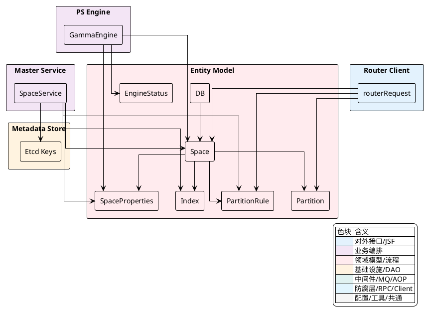
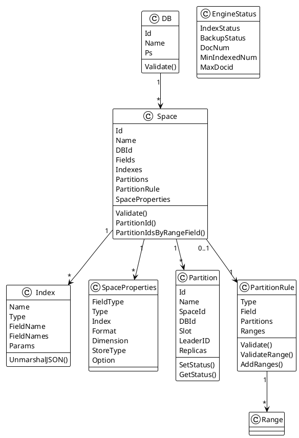
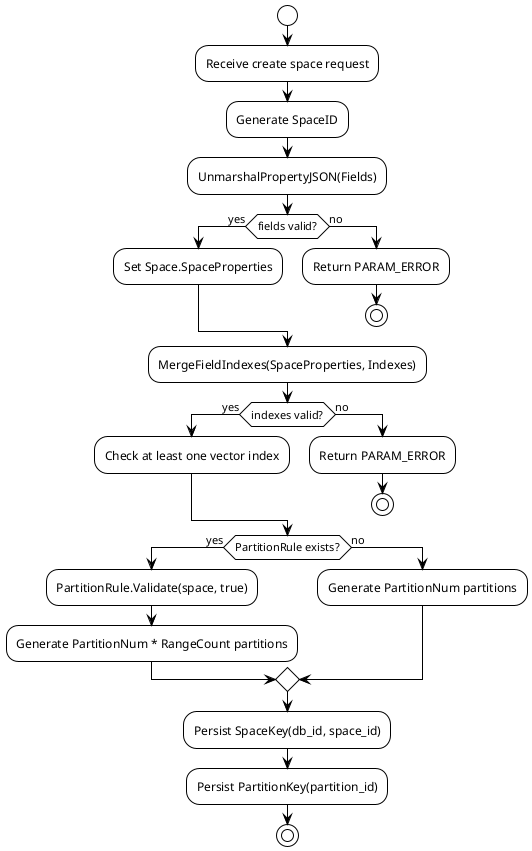
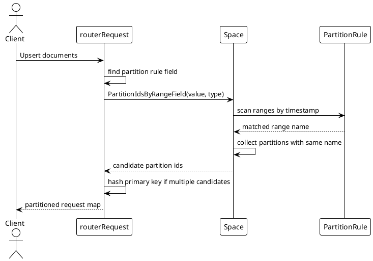

## 领域模型与映射结构

Vearch 的集合建模围绕 `DB`、`Space`、`Partition`、`Index`、`SpaceProperties` 展开。`DB` 提供数据库级命名空间，`Space` 承载字段声明、索引声明、分片副本、分区规则和运行开关，`Partition` 是路由与存储执行单元，`Index` 描述向量索引与标量索引的结构，`SpaceProperties` 则是从用户提交的 `fields` JSON 解析出来的内部字段映射。

这些类型集中定义在 `internal/entity` 包中，并被 `master`、`router`、`ps` 复用。`master` 在创建或变更 `Space` 时执行映射解析与规则校验，`router` 在写入与查询时依赖 `SpaceProperties` 和分区映射完成请求拆分，`ps` 的 Gamma 引擎通过同一份映射判断字段变更、索引状态和引擎状态。



### 核心类型的职责边界

`DB` 是最外层命名空间，字段较少，只保留 `Id`、`Name` 和可选的 `Ps` 约束。它的 `Validate` 方法只关注数据库名称合法性和创建阶段禁止用户传入 `Id`。`Space` 是模型中心，它同时包含元数据标识、分片副本配置、原始字段 JSON、归一化后的 `SpaceProperties`、索引列表、分区规则和若干运行开关。

`Index` 兼容单字段索引与多字段复合索引。单字段索引使用 `FieldName`，复合索引使用 `FieldNames`。`SpaceProperties` 是字段级内部结构，记录 `FieldType`、原始 `Type`、字段级 `Index`、向量维度、格式化方式、存储方式和 `FieldOption`。`Partition` 绑定到具体 `Space` 和 `DB`，通过 `Slot` 表达哈希槽下界，通过 `Name` 表达范围分区所属区间。

| 类型 | 关键字段 | 核心职责 |
|---|---|---|
| `DB` | `Id`、`Name`、`Ps` | 数据库命名空间与创建参数校验 |
| `Space` | `Id`、`Name`、`DBId`、`Fields`、`Indexes`、`Partitions`、`PartitionRule`、`SpaceProperties` | 集合级 schema、索引、分片、副本、分区规则的聚合根 |
| `Index` | `Name`、`Type`、`FieldName`、`FieldNames`、`Params` | 描述向量索引、标量索引、复合索引及参数 |
| `SpaceProperties` | `FieldType`、`Type`、`Index`、`Dimension`、`Option` | 将用户字段定义转成引擎和查询层可消费的字段映射 |
| `Partition` | `Id`、`Name`、`SpaceId`、`DBId`、`Slot`、`LeaderID`、`Replicas` | 写入路由、查询路由、Raft 副本和资源状态的基础单元 |
| `PartitionRule` | `Type`、`Field`、`Partitions`、`Ranges` | 基于日期字段的范围分区规则 |
| `EngineStatus` | `IndexStatus`、`BackupStatus`、`DocNum`、`MinIndexedNum`、`MaxDocid` | PS 引擎状态的跨层传递结构 |



`Space` 的字段定义没有直接以强类型数组落盘，而是保留 `Fields` 这个 `json.RawMessage`。创建和更新阶段会调用 `UnmarshalPropertyJSON` 解析成 `map[string]*SpaceProperties`，随后再由 `MergeFieldIndexes` 将字段内联索引与顶层 `Indexes` 合并。这个处理路径使 `Space` 同时保留用户输入的原始 schema 和服务端校验后的内部映射。

[internal/entity/space.go:74-95]()
```go
type Space struct {
	Id                    SpaceID                     `json:"id,omitempty"`
	Desc                  string                      `json:"desc,omitempty"` // user setting
	Name                  string                      `json:"name,omitempty"` // user setting
	ResourceName          string                      `toml:"resource_name,omitempty" json:"resource_name"`
	Version               Version                     `json:"version,omitempty"`
	DBId                  DBID                        `json:"db_id,omitempty"`
	Enabled               *bool                       `json:"enabled"`    // Enabled flag whether the space can work
	Partitions            []*Partition                `json:"partitions"` // partitionids not sorted
	PartitionNum          int                         `json:"partition_num"`
	ReplicaNum            uint8                       `json:"replica_num"`
	Fields                json.RawMessage             `json:"fields"`
	Indexes               []*Index                    `json:"indexes,omitempty"`
	PartitionRule         *PartitionRule              `json:"partition_rule,omitempty"`
	SpaceProperties       map[string]*SpaceProperties `json:"space_properties,omitempty"`
	RefreshInterval       *int32                      `json:"refresh_interval,omitempty"`
	PartitionName         *string                     `json:"partition_name,omitempty"`  // partition name for partition rule
	PartitionOperatorType *string                     `json:"operator_type,omitempty"`   // partition rule operator type
	EnableIdCache         *bool                       `json:"enable_id_cache,omitempty"` // whether enable map docid to _id value in cache
	EnableRealtime        *bool                       `json:"enable_realtime,omitempty"` // whether enable realtime search
}
```

`DB` 和 `Space` 的命名校验规则保持一致：名称不能为空，不能以数字或 `_` 开头，不能包含空白字符和一组特殊字符。`DB` 额外禁止创建时设置 `Id`，因为 `Id` 来自 `master` 的序列键。

[internal/entity/db.go:33-58]()
```go
func (db *DB) Validate() error {
	rs := []rune(db.Name)
	if len(rs) == 0 {
		return vearchpb.NewError(vearchpb.ErrorEnum_PARAM_ERROR, fmt.Errorf("db name can not set empty string"))
	}
	if unicode.IsNumber(rs[0]) {
		return vearchpb.NewError(vearchpb.ErrorEnum_PARAM_ERROR, fmt.Errorf("db name : %s can not start with num", db.Name))
	}
	if rs[0] == '_' {
		return vearchpb.NewError(vearchpb.ErrorEnum_PARAM_ERROR, fmt.Errorf("db name : %s can not start with _", db.Name))
	}
	for _, r := range rs {
		switch r {
		case '\t', '\n', '\v', '\f', '\r', ' ', 0x85, 0xA0, '\\', '+', '-', '!', '*', '/', '(', ')', ':', '^', '[', ']', '"', '{', '}', '~', '%', '&', '\'', '<', '>', '?':
			return vearchpb.NewError(vearchpb.ErrorEnum_PARAM_ERROR, fmt.Errorf("character '%c' can not in db name[%s]", r, db.Name))
		}
	}

	if db.Id > 0 {
		return vearchpb.NewError(vearchpb.ErrorEnum_PARAM_ERROR, fmt.Errorf("can not set db id when creating db"))
	}

	return nil
}
```

<details>
<summary>关联代码</summary>

[internal/entity/db.go:24-58](),[internal/entity/space.go:34-40](),[internal/entity/space.go:74-137](),[internal/entity/space.go:331-355](),[internal/entity/partition.go:49-101](),[internal/entity/engine.go:17-23](),[internal/entity/meta.go:175-188]()

</details>

### `Space` 映射装配与创建链路

创建 `Space` 时，`master` 先生成 `SpaceID`，再将 `Fields` 解析为 `SpaceProperties`。字段解析通过后，`MergeFieldIndexes` 会把字段级 `Index` 合并进顶层 `Indexes`，并触发索引结构校验。随后 `master` 要求至少存在一个向量索引，因为底层向量检索空间需要可执行的向量索引定义。

当 `PartitionRule` 不为空时，`master` 调用 `PartitionRule.Validate` 校验范围分区，并按 `PartitionNum * PartitionRule.Partitions` 生成物理分片。每个范围区间内会生成 `PartitionNum` 个 `Partition`，这些 `Partition` 共享同一个范围名 `Name`，但拥有不同的 `Slot`。当没有 `PartitionRule` 时，物理分片数就是 `PartitionNum`，每个分片只按哈希槽划分。



`master` 创建路径中的核心代码体现了这个装配顺序。`UnmarshalPropertyJSON` 负责字段类型和字段级索引解析，`MergeFieldIndexes` 负责把字段级索引纳入统一索引数组，后续的 `hasVectorIndex` 检查直接遍历统一后的 `space.Indexes`。

[internal/master/services/space_service.go:111-134]()
```go
spaceProperties, err := entity.UnmarshalPropertyJSON(space.Fields)
if err != nil {
	return err
}
space.SpaceProperties = spaceProperties

// Merge indexes definitions with field-level index info
if !isRestore || (isRestore && len(space.Indexes) == 0) {
	if err := entity.MergeFieldIndexes(spaceProperties, &space.Indexes); err != nil {
		return err
	}
}

// Validate that at least one vector index is defined
hasVectorIndex := false
for _, idx := range space.Indexes {
	if !entity.IsScalarIndexType(idx.Type) {
		hasVectorIndex = true
		break
	}
}
if !hasVectorIndex {
	return vearchpb.NewError(vearchpb.ErrorEnum_PARAM_ERROR, fmt.Errorf("space vector field index should not be empty"))
}
```

分区生成阶段将范围规则和哈希槽映射合并在一起。`slotWidth` 基于 `math.MaxUint32` 均分，`Slot` 存储每个物理分片负责的槽段下界。范围分区下，`space.PartitionRule.Ranges[i/space.PartitionNum].Name` 将连续的 `PartitionNum` 个物理分片归入同一个范围名。

[internal/master/services/space_service.go:136-172]()
```go
if space.PartitionRule != nil {
	err := space.PartitionRule.Validate(space, true)
	if err != nil {
		return err
	}
	slotWidth := math.MaxUint32 / (space.PartitionNum * space.PartitionRule.Partitions)
	for i := range space.PartitionNum * space.PartitionRule.Partitions {
		partitionID, err := masterClient.NewIDGenerate(ctx, entity.PartitionIdSequence, 1, 5*time.Second)

		if err != nil {
			return err
		}

		space.Partitions = append(space.Partitions, &entity.Partition{
			Id:      entity.PartitionID(partitionID),
			Name:    space.PartitionRule.Ranges[i/space.PartitionNum].Name,
			SpaceId: space.Id,
			DBId:    space.DBId,
			Slot:    entity.SlotID(i * slotWidth),
		})
	}
} else {
	slotWidth := math.MaxUint32 / space.PartitionNum
	for i := range space.PartitionNum {
		partitionID, err := masterClient.NewIDGenerate(ctx, entity.PartitionIdSequence, 1, 5*time.Second)
```

<details>
<summary>关联代码</summary>

[internal/master/services/space_service.go:104-134](),[internal/master/services/space_service.go:136-172](),[internal/master/services/space_service.go:195-200](),[internal/entity/space.go:369-501](),[internal/entity/space.go:592-622](),[internal/entity/meta.go:34-43]()

</details>

### 字段映射解析与 `SpaceProperties` 校验

`UnmarshalPropertyJSON` 将用户提交的字段数组解析为 `map[string]*SpaceProperties`。这个过程先执行字段名级别的唯一性检查，再根据字段 `type` 映射到 `vearchpb.FieldType`。标量字段覆盖字符串、日期、整数、长整数、浮点、双精度、布尔和字符串数组；向量字段使用 `vector`，必须设置非零 `dimension`。

字段名有两个保留值：`_id` 和 `_score`。`_id` 是文档主键语义，`_score` 是检索评分语义，因此两者不能作为用户字段进入 `SpaceProperties`。字段级索引名称也在解析阶段去重，防止同一份 `fields` 中出现重复索引名。

| 字段类型字符串 | 内部类型 |
|---|---|
| `text`、`keyword`、`string` | `vearchpb.FieldType_STRING` |
| `date` | `vearchpb.FieldType_DATE` |
| `integer`、`short`、`byte` | `vearchpb.FieldType_INT` |
| `long` | `vearchpb.FieldType_LONG` |
| `float` | `vearchpb.FieldType_FLOAT` |
| `double` | `vearchpb.FieldType_DOUBLE` |
| `boolean`、`bool` | `vearchpb.FieldType_BOOL` |
| `stringArray`、`StringArray`、`string_array` | `vearchpb.FieldType_STRINGARRAY` |
| `vector` | `vearchpb.FieldType_VECTOR` |

向量字段有额外约束。`dimension` 不能为 `0`，`store_type` 只接受 `RocksDB` 或 `MemoryOnly`，`format` 只接受 `normalization`、`normal` 或 `no`。`format` 也可以用于 `date` 字段；如果非日期、非向量字段设置了 `format`，解析会返回参数错误。

[internal/entity/space.go:369-447]()
```go
func UnmarshalPropertyJSON(propertity []byte) (map[string]*SpaceProperties, error) {
	tmpPro := make(map[string]*SpaceProperties)
	fields := make([]Field, 0)
	err := json.Unmarshal(propertity, &fields)
	if err != nil {
		log.Error(err)
		return nil, err
	}
	names := make(map[string]bool)
	indexNames := make(map[string]bool)

	for _, field := range fields {
		if field.Name == "" {
			return nil, vearchpb.NewError(vearchpb.ErrorEnum_PARAM_ERROR, fmt.Errorf("field name can not be empty"))
		}
		if field.Name == IdField {
			return nil, vearchpb.NewError(vearchpb.ErrorEnum_PARAM_ERROR, fmt.Errorf("field name can not be %s", IdField))
		}
		if field.Name == ScoreField {
			return nil, vearchpb.NewError(vearchpb.ErrorEnum_PARAM_ERROR, fmt.Errorf("field name can not be %s", ScoreField))
		}
		if _, ok := names[field.Name]; ok {
			return nil, vearchpb.NewError(vearchpb.ErrorEnum_PARAM_ERROR, fmt.Errorf("field name can not be duplicate"))
		} else {
			names[field.Name] = true
		}
```

[internal/entity/space.go:424-443]()
```go
case "vector":
	sp.FieldType = vearchpb.FieldType_VECTOR

	isVector = true
	if field.Dimension == 0 {
		return nil, vearchpb.NewError(vearchpb.ErrorEnum_PARAM_ERROR, fmt.Errorf("dimension can not be zero by field : [%s] ", field.Name))
	}
	sp.Dimension = field.Dimension

	if field.StoreType != nil && *field.StoreType != "" {
		if *field.StoreType != "RocksDB" && *field.StoreType != "MemoryOnly" {
			return nil, vearchpb.NewError(vearchpb.ErrorEnum_PARAM_ERROR, fmt.Errorf("vector field:[%s] not support this store type:[%s] it only RocksDB or MemoryOnly", field.Name, *sp.StoreType))
		}
	}
	sp.StoreType = field.StoreType
	sp.Format = field.Format
	format := field.Format
	if format != nil && !(*format == "normalization" || *format == "normal" || *format == "no") {
		return nil, vearchpb.NewError(vearchpb.ErrorEnum_PARAM_ERROR, fmt.Errorf("unknow vector process method:[%s]", *format))
	}
```

字段和索引类型兼容性在同一个解析函数中完成。向量字段不能使用标量索引类型，标量字段不能使用向量索引类型。字段级 `Index` 会转成 `SpaceProperties.Option`，其中 `SCALAR` 对应 `FieldOption_Scalar`，`INVERTED` 对应 `FieldOption_Inverted`，`BITMAP` 对应 `FieldOption_Bitmap`，`COMPOSITE` 对应 `FieldOption_Composite`。不过复合索引不能真正以内联方式挂在字段上，后续 `MergeFieldIndexes` 会拒绝字段级 `COMPOSITE`。

[internal/entity/space.go:450-486]()
```go
if sp.Index != nil {
	if isVector {
		// Vector fields: reject scalar index types
		if IsScalarIndexType(sp.Index.Type) {
			return nil, vearchpb.NewError(vearchpb.ErrorEnum_PARAM_ERROR,
				fmt.Errorf("field [%s] is a vector field, scalar index type [%s] is not allowed",
					field.Name, sp.Index.Type))
		}
		// Vector fields: set Option to Index (vector index type is handled elsewhere)
		sp.Option = vearchpb.FieldOption_Index
	} else {
		// Scalar fields: reject vector index types
		if !IsScalarIndexType(sp.Index.Type) {
			return nil, vearchpb.NewError(vearchpb.ErrorEnum_PARAM_ERROR,
				fmt.Errorf("field [%s] is a scalar field, index type [%s] is not allowed",
					field.Name, sp.Index.Type))
		}
		switch sp.Index.Type {
		case ScalarIndexType:
			sp.Option = vearchpb.FieldOption_Scalar
		case InvertedIndexType:
			sp.Option = vearchpb.FieldOption_Inverted
		case InvertedListIndexType:
			sp.Option = vearchpb.FieldOption_InvertedList
```

<details>
<summary>关联代码</summary>

[internal/entity/space.go:128-137](),[internal/entity/space.go:357-367](),[internal/entity/space.go:369-501](),[internal/entity/constant.go:20-27](),[internal/proto/vearchpb/]()

</details>

### `Index.UnmarshalJSON` 与索引合法性检查

`Index.UnmarshalJSON` 是索引 JSON 的入口校验。它先解析 `name`、`type`、`field_name`、`field_names` 和 `params`，再用内置的 `indexTypeMap` 限定索引类型集合。支持的类型同时覆盖向量索引和标量索引，包括 `IVFPQ`、`IVFFLAT`、`BINARYIVF`、`FLAT`、`HNSW`、`GPU_IVFPQ`、`GPU_IVFFLAT`、`SSG`、`IVFPQ_RELAYOUT`、`SCANN`、`IVFRABITQ`、`DISKANN_STATIC`、`SCALAR`、`INVERTED`、`BITMAP` 和 `COMPOSITE`。

| 索引类别 | 类型 |
|---|---|
| 向量索引 | `IVFPQ`、`IVFFLAT`、`BINARYIVF`、`FLAT`、`HNSW`、`GPU_IVFPQ`、`GPU_IVFFLAT`、`SSG`、`IVFPQ_RELAYOUT`、`SCANN`、`IVFRABITQ`、`DISKANN_STATIC` |
| 标量单字段索引 | `SCALAR`、`INVERTED`、`BITMAP` |
| 标量复合索引 | `COMPOSITE` |
| 常量中声明但未被 `IsScalarIndexType` 识别的类型 | `INVERTED_LIST` |

`params` 被解析为 `IndexParams`。通用参数 `metric_type` 只接受 `InnerProduct` 或 `L2`。`HNSW` 额外检查 `nlinks` 和 `efConstruction` 的范围。IVF 系列检查 `ncentroids`、`training_threshold` 和 `nprobe`。`FLAT` 在当前代码中不额外检查参数，`SCANN`、`SSG`、`DISKANN_STATIC` 虽在类型表中被接受，但没有在 `UnmarshalJSON` 中追加专有参数约束。

| 参数 | 生效索引 | 校验规则 |
|---|---|---|
| `metric_type` | 所有携带 `params` 的索引 | 只能是 `InnerProduct` 或 `L2` |
| `nlinks` | `HNSW` | 非零时必须位于 `[8, 96]` |
| `efConstruction` | `HNSW` | 非零时必须位于 `[16, 1024]` |
| `ncentroids` | `BINARYIVF`、`IVFFLAT`、`IVFPQ`、`GPU_IVFPQ`、`GPU_IVFFLAT`、`IVFRABITQ` | 非零时必须位于 `[1, 262144]` |
| `training_threshold` | IVF 系列 | 非零时必须大于等于 `ncentroids` 且大于等于 `256` |
| `nprobe` | IVF 系列 | 非零时必须小于等于 `ncentroids` |

[internal/entity/space.go:245-262]()
```go
indexTypeMap := map[string]string{
	"IVFPQ":          "IVFPQ",
	"IVFFLAT":        "IVFFLAT",
	"BINARYIVF":      "BINARYIVF",
	"FLAT":           "FLAT",
	"HNSW":           "HNSW",
	"GPU_IVFPQ":      "GPU_IVFPQ",
	"GPU_IVFFLAT":    "GPU_IVFFLAT",
	"SSG":            "SSG",
	"IVFPQ_RELAYOUT": "IVFPQ_RELAYOUT",
	"SCANN":          "SCANN",
	"SCALAR":         "SCALAR",
	"IVFRABITQ":      "IVFRABITQ",
	"DISKANN_STATIC": "DISKANN_STATIC",
	"INVERTED":       "INVERTED",
	"BITMAP":         "BITMAP",
	"COMPOSITE":      "COMPOSITE",
}
```

[internal/entity/space.go:278-317]()
```go
if indexParams.MetricType != "" && indexParams.MetricType != "InnerProduct" && indexParams.MetricType != "L2" {
	return vearchpb.NewError(vearchpb.ErrorEnum_PARAM_ERROR, fmt.Errorf("index params metric_type not support: %s, should be L2 or InnerProduct", indexParams.MetricType))
}

if tempIndex.Type == "HNSW" {
	if indexParams.Nlinks != 0 {
		if indexParams.Nlinks < MinNlinks || indexParams.Nlinks > MaxNlinks {
			return vearchpb.NewError(vearchpb.ErrorEnum_PARAM_ERROR, fmt.Errorf("index params nlinks:%d should in [%d, %d]", indexParams.Nlinks, MinNlinks, MaxNlinks))
		}
	}
	if indexParams.EfConstruction != 0 {
		if indexParams.EfConstruction < MinEfConstruction || indexParams.EfConstruction > MaxEfConstruction {
			return vearchpb.NewError(vearchpb.ErrorEnum_PARAM_ERROR, fmt.Errorf("index params efConstruction:%d should in [%d, %d]", indexParams.EfConstruction, MinEfConstruction, MaxEfConstruction))
		}
	}
} else if tempIndex.Type == "FLAT" {

} else if slices.Contains([]string{"BINARYIVF", "IVFFLAT", "IVFPQ", "GPU_IVFPQ", "GPU_IVFFLAT", "IVFRABITQ"}, tempIndex.Type) {
	if indexParams.Ncentroids != 0 {
		if indexParams.Ncentroids < MinNcentroids || indexParams.Ncentroids > MaxNcentroids {
			return vearchpb.NewError(vearchpb.ErrorEnum_PARAM_ERROR, fmt.Errorf("index params ncentroids:%d should in [%d, %d]", indexParams.Ncentroids, MinNcentroids, MaxNcentroids))
		}
	}
```

索引结构校验由 `validateIndexes` 处理。`COMPOSITE` 必须使用 `field_names`，并且至少包含两个字段；普通单字段索引必须使用 `field_name`；`field_name` 和 `field_names` 不能同时出现。`COMPOSITE` 引用的所有字段必须存在于 `SpaceProperties`，且不能是向量字段。单字段索引还会根据字段类型执行一次兼容性检查，确保标量索引只挂标量字段，向量索引只挂向量字段。

[internal/entity/space.go:520-589]()
```go
func validateIndexes(indexes []*Index, props map[string]*SpaceProperties) error {
	indexNames := make(map[string]bool)
	for i, idx := range indexes {
		if idx.Name == "" {
			return vearchpb.NewError(vearchpb.ErrorEnum_PARAM_ERROR,
				fmt.Errorf("indexes[%d]: name cannot be empty", i))
		}
		if _, ok := indexNames[idx.Name]; ok {
			return vearchpb.NewError(vearchpb.ErrorEnum_PARAM_ERROR, fmt.Errorf("index name can not be duplicate"))
		} else {
			indexNames[idx.Name] = true
		}
		// field_name and field_names cannot coexist
		if idx.FieldName != "" && len(idx.FieldNames) > 0 {
			return vearchpb.NewError(vearchpb.ErrorEnum_PARAM_ERROR,
				fmt.Errorf("indexes[%d] name[%s]: field_name and field_names cannot both be set", i, idx.Name))
		}

		if idx.Type == CompositeIndexType {
			if len(idx.FieldNames) < 2 {
				return vearchpb.NewError(vearchpb.ErrorEnum_PARAM_ERROR,
					fmt.Errorf("indexes[%d] name[%s] type[COMPOSITE]: requires at least 2 fields, got %d",
						i, idx.Name, len(idx.FieldNames)))
			}
```

`MergeFieldIndexes` 连接了字段级索引与顶层索引。字段级索引会被转换成一个带 `FieldName` 的 `Index` 并追加到 `space.Indexes`。如果同一字段已经在顶层定义了非 `COMPOSITE` 索引，合并会失败。字段级 `COMPOSITE` 被明确拒绝，复合索引只能出现在顶层 `indexes` 中。

[internal/entity/space.go:592-622]()
```go
func MergeFieldIndexes(props map[string]*SpaceProperties, indexes *[]*Index) error {
	for fieldName, field := range props {
		if field.Index != nil {
			if field.Index.Type == CompositeIndexType {
				return vearchpb.NewError(vearchpb.ErrorEnum_PARAM_ERROR,
					fmt.Errorf("field[%s] index type[COMPOSITE] can not set in fields", fieldName))
			}
			for _, idx := range *indexes {
				if idx == nil {
					continue
				}
				if fieldName == idx.FieldName && idx.Type != CompositeIndexType {
					return vearchpb.NewError(vearchpb.ErrorEnum_PARAM_ERROR,
						fmt.Errorf("field[%s] index duplicated", fieldName))
				}
			}
			index := &Index{
				Name:      field.Index.Name,
				Type:      field.Index.Type,
				FieldName: fieldName,
				Params:    field.Index.Params,
			}
			*indexes = append(*indexes, index)
		}
	}
	if err := validateIndexes(*indexes, props); err != nil {
		return err
	}
	return nil
}
```

<details>
<summary>关联代码</summary>

[internal/entity/space.go:34-72](),[internal/entity/space.go:230-329](),[internal/entity/space.go:504-512](),[internal/entity/space.go:514-590](),[internal/entity/space.go:592-622](),[internal/entity/constant.go:20-27]()

</details>

### 分区规则与路由映射

`Space.PartitionId` 处理默认哈希路由。调用方把主键通过 `murmur3.Sum32WithSeed` 转成 `SlotID`，`PartitionId` 在 `space.Partitions` 中按 `Slot` 二分查找，返回不大于当前 `slotID` 的最大槽下界对应的 `PartitionID`。当只有一个分片时，它直接返回唯一分片。

[internal/entity/space.go:153-179]()
```go
func (s *Space) PartitionId(slotID SlotID) PartitionID {
	if len(s.Partitions) == 1 {
		return s.Partitions[0].Id
	}

	arr := s.Partitions

	maxKey := len(arr) - 1

	low, high, mid := 0, maxKey, 0

	for low <= high {
		mid = (low + high) >> 1

		midVal := arr[mid].Slot

		if midVal > slotID {
			high = mid - 1
		} else if midVal < slotID {
			low = mid + 1
		} else {
			return arr[mid].Id
		}
	}

	return arr[low-1].Id
}
```

`PartitionRule` 目前只支持 `RANGE`。开启范围分区时，`field` 必须存在于 `SpaceProperties`，且字段类型必须是 `vearchpb.FieldType_DATE`。`ranges` 必须非空，数量不能超过 `MaxPartitions`，范围数乘以 `PartitionNum` 不能超过 `MaxTotalPartitions`。每个 `Range` 要求 `Name` 非空、`Value` 非空、名称和值不重复，并且 `Value` 转换成纳秒时间戳后必须严格递增。

| 规则项 | 校验行为 |
|---|---|
| `PartitionRule.Type` | 必须等于 `RANGE` |
| `PartitionRule.Field` | 开启字段检查时不能为空，且必须存在于 `SpaceProperties` |
| 分区字段类型 | 必须是 `vearchpb.FieldType_DATE` |
| `Ranges` 数量 | 不能为空，不能超过 `MaxPartitions` |
| 总物理分片数 | `len(Ranges) * Space.PartitionNum` 不能超过 `MaxTotalPartitions` |
| `Range.Name` | 不能为空，不能重复 |
| `Range.Value` | 不能为空，不能重复，转换为时间戳后必须递增 |

[internal/entity/partition.go:134-199]()
```go
func (pr *PartitionRule) Validate(space *Space, check_field bool) error {
	if check_field {
		if space.PartitionRule.Field == "" {
			return vearchpb.NewError(vearchpb.ErrorEnum_PARAM_ERROR, fmt.Errorf("space partition rule field is empty"))
		}
		if value, exist := space.SpaceProperties[space.PartitionRule.Field]; !exist {
			return vearchpb.NewError(vearchpb.ErrorEnum_PARAM_ERROR, fmt.Errorf("%s not in space fields", space.PartitionRule.Field))
		} else {
			if value.FieldType != vearchpb.FieldType_DATE {
				return vearchpb.NewError(vearchpb.ErrorEnum_PARAM_ERROR, fmt.Errorf("currently only partition field with %s data type are supported", vearchpb.FieldType_DATE.String()))
			}
		}
	}
	return pr.ValidateRange(space)
}

func (pr *PartitionRule) ValidateRange(space *Space) error {
	if pr.Type != RangePartition {
		return vearchpb.NewError(vearchpb.ErrorEnum_PARAM_ERROR, fmt.Errorf("now only support partition type of RANGE"))
	}

	space.PartitionRule.Partitions = len(space.PartitionRule.Ranges)
	if space.PartitionRule.Partitions == 0 {
```

范围分区的写入路由由 `PartitionIdsByRangeField` 完成。它把文档中的分区字段值转成纳秒时间戳，然后从 `PartitionRule.Ranges` 中找到第一个大于该时间戳的范围边界，将命中的 `Range.Name` 映射到同名 `Partition`。由于创建 `Space` 时一个范围名下会生成多个物理分片，这里可能返回多个 `PartitionID`。调用方再用主键哈希对候选分片取模，得到最终写入分片。



[internal/entity/space.go:198-228]()
```go
func (s *Space) PartitionIdsByRangeField(value []byte, field_type vearchpb.FieldType) ([]PartitionID, error) {
	pids := make([]PartitionID, 0)
	if len(s.Partitions) == 1 {
		pids = append(pids, s.Partitions[0].Id)
		return pids, nil
	}

	arr := s.Partitions
	partition_name := ""
	ts := cbbytes.Bytes2Int(value)
	found := false
	for _, r := range s.PartitionRule.Ranges {
		value, _ := ToTimestamp(r.Value)
		if ts < value {
			partition_name = r.Name
			found = true
			break
		}
	}
	if !found {
		u := cbbytes.Bytes2Int(value)
		timeStr := time.Unix(u/1e9, u%1e9)
		return pids, vearchpb.NewError(vearchpb.ErrorEnum_PARAM_ERROR, fmt.Errorf("can't set partition for field value %s, space ranges %v", timeStr, s.PartitionRule.Ranges))
	}
	for i := 0; i < len(arr); i++ {
		if arr[i].Name == partition_name {
			pids = append(pids, arr[i].Id)
		}
	}
	return pids, nil
}
```

`routerRequest.UpsertByPartitions` 展示了范围分区和普通哈希分区的分流。启用 `PartitionRule` 时，文档必须包含分区字段；未启用时，写入直接按主键哈希进入 `Space.PartitionId`，或者在显式传入的分片列表中取模分配。

[internal/client/client.go:276-326]()
```go
func (r *routerRequest) UpsertByPartitions(partitions []uint32) *routerRequest {
	if r.Err != nil {
		return r
	}
	partitionID := uint32(0)
	dataMap := make(map[entity.PartitionID]*vearchpb.PartitionData)
	// partition by specify rule
	if r.space.PartitionRule != nil {
		for _, doc := range r.docs {
			found := false
			for _, field := range doc.Fields {
				if field.Name == r.space.PartitionRule.Field {
					found = true
					pids, err := r.space.PartitionIdsByRangeField(field.Value, field.Type)
					if err != nil {
						r.Err = err
						return r
					}
					if len(pids) == 1 {
						partitionID = pids[0]
					} else {
						hash_index := murmur3.Sum32WithSeed([]byte(doc.PKey), 0) % uint32(len(pids))
						partitionID = pids[hash_index]
					}
```

<details>
<summary>关联代码</summary>

[internal/entity/space.go:144-179](),[internal/entity/space.go:198-228](),[internal/entity/partition.go:110-132](),[internal/entity/partition.go:134-212](),[internal/entity/partition.go:318-326](),[internal/client/client.go:231-251](),[internal/client/client.go:276-326](),[internal/entity/constant.go:17-18]()

</details>

### 元数据键、序列与运行状态映射

`meta.go` 统一生成 `etcd` 中的元数据键。`DB` 相关键区分 `id`、`name` 和 `body`，`Space` 以 `dbID/spaceID` 组织，`Partition` 以 `partitionID` 组织。`SetPrefixAndSequence` 会根据 `cluster_id` 改写所有前缀和序列键，让同一套键构造函数在不同集群前缀下生成隔离的元数据路径。

| 函数 | 键语义 |
|---|---|
| `DBKeyId` | `db/id/[dbId]` 到数据库名 |
| `DBKeyName` | `db/name/[dbName]` 到数据库 ID |
| `DBKeyBody` | `db/body/[dbId]` 到 `DB` 元数据 |
| `SpaceKey` | `space/[dbId]/[spaceId]` 到 `Space` 元数据 |
| `SpaceConfigKey` | `space_config/[dbId]/[spaceId]` 到 `SpaceConfig` |
| `PartitionKey` | `partition/[partitionID]` 到 `Partition` 元数据 |
| `LockSpaceKey` | 创建、删除、修改 `Space` 的分布式锁键 |
| `PartitionIdSequence` | 分片 ID 序列键 |
| `SpaceIdSequence` | 集合 ID 序列键 |
| `DBIdSequence` | 数据库 ID 序列键 |

[internal/entity/meta.go:22-57]()
```go
func LockSpaceKey(db, space string) string {
	return fmt.Sprintf("%s/%s/%s", PrefixLock, db, space)
}

func LockDBKey(db string) string {
	return fmt.Sprintf("%s/%s", PrefixLock, db)
}

func ServerKey(name NodeID) string {
	return fmt.Sprintf("%s%d", PrefixServer, name)
}

func SpaceKey(dbID, spaceId int64) string {
	return fmt.Sprintf("%s%d/%d", PrefixSpace, dbID, spaceId)
}

func SpaceConfigKey(dbID, spaceId int64) string {
	return fmt.Sprintf("%s%d/%d", PrefixSpaceConfig, dbID, spaceId)
}

func PartitionKey(partitionID uint32) string {
	return fmt.Sprintf("%s%d", PrefixPartition, partitionID)
}

func DBKeyId(id int64) string {
	return fmt.Sprintf("%sid/%d", PrefixDataBase, id)
}

func DBKeyName(name string) string {
	return fmt.Sprintf("%sname/%s", PrefixDataBase, name)
}

func DBKeyBody(id int64) string {
	return fmt.Sprintf("%sbody/%d", PrefixDataBase, id)
}
```

[internal/entity/meta.go:100-125]()
```go
func SetPrefixAndSequence(cluster_id string) {
	if strings.HasPrefix(cluster_id, Prefix) {
		PrefixEtcdClusterID = cluster_id
	} else {
		PrefixEtcdClusterID = Prefix + cluster_id
	}
	NodeIdSequence = PrefixEtcdClusterID + PrefixNodeId
	SpaceIdSequence = PrefixEtcdClusterID + PrefixSpaceId
	DBIdSequence = PrefixEtcdClusterID + PrefixDBId
	PartitionIdSequence = PrefixEtcdClusterID + PrefixPartitionId

	PrefixUser = PrefixEtcdClusterID + PrefixUser
	PrefixLock = PrefixEtcdClusterID + PrefixLock
	PrefixLockCluster = PrefixEtcdClusterID + PrefixLockCluster
	PrefixServer = PrefixEtcdClusterID + PrefixServer
	PrefixSpace = PrefixEtcdClusterID + PrefixSpace
	PrefixSpaceConfig = PrefixEtcdClusterID + PrefixSpaceConfig
	PrefixPartition = PrefixEtcdClusterID + PrefixPartition
	PrefixDataBase = PrefixEtcdClusterID + PrefixDataBase
	PrefixDataBaseBody = PrefixEtcdClusterID + PrefixDataBaseBody
	PrefixFailServer = PrefixEtcdClusterID + PrefixFailServer
	PrefixRouter = PrefixEtcdClusterID + PrefixRouter
```

`EngineStatus` 是 PS 引擎状态从 Gamma C++ binding 回传到 Go 层的结构。`gammaEngine.GetEngineStatus` 从底层 `gamma.GetEngineStatus` 获取 JSON 字符串，再反序列化到 `entity.EngineStatus`。上层 `IndexInfo` 只提取 `IndexStatus`、`MinIndexedNum` 和 `MaxDocid`，管理接口和调度任务也复用同一个状态结构。

[internal/entity/engine.go:17-23]()
```go
type EngineStatus struct {
	IndexStatus   int32 `json:"index_status,omitempty"`
	BackupStatus  int32 `json:"backup_status,omitempty"`
	DocNum        int32 `json:"doc_num,omitempty"`
	MinIndexedNum int32 `json:"min_indexed_num,omitempty"`
	MaxDocid      int32 `json:"max_docid,omitempty"`
}
```

[internal/ps/engine/gammacb/gamma.go:343-355]()
```go
func (ge *gammaEngine) GetEngineStatus(status *entity.EngineStatus) error {
	enginePtr, err := ge.getEnginePtr()
	if err != nil {
		return err
	}

	ges := gamma.GetEngineStatus(enginePtr)
	if err := json.Unmarshal([]byte(ges), status); err != nil {
		return vearchpb.NewError(vearchpb.ErrorEnum_INTERNAL_ERROR,
			fmt.Errorf("unmarshal engine status failed: %v", err))
	}
	return nil
}
```

`SpaceProperties` 在 PS 映射变更中同样是校验入口。`gammaEngine.UpdateMapping` 同时解析旧 `Space.Fields` 和新 `Space.Fields`，比较字段类型和索引选项变化。字段类型变化和字段删除会直接失败，索引启停会被记录为需要重建索引的变更。

[internal/ps/engine/gammacb/gamma.go:165-198]()
```go
func (ge *gammaEngine) UpdateMapping(updatedSpace *entity.Space) error {
	// Parse current and updated space fields using SpaceProperties
	currentSpaceProperties, err := entity.UnmarshalPropertyJSON(ge.space.Fields)
	if err != nil {
		return vearchpb.NewError(vearchpb.ErrorEnum_PARAM_ERROR, fmt.Errorf("unmarshal current space properties:[%s] has err:[%s]", ge.space.Fields, err.Error()))
	}
	log.Debug("current space properties: %v", currentSpaceProperties)

	updatedSpaceProperties, err := entity.UnmarshalPropertyJSON(updatedSpace.Fields)
	if err != nil {
		return vearchpb.NewError(vearchpb.ErrorEnum_PARAM_ERROR, fmt.Errorf("unmarshal updated space properties:[%s] has err:[%s]", updatedSpace.Fields, err.Error()))
	}
	log.Debug("updated space properties: %v", updatedSpaceProperties)

	// Check for field changes and index option changes
	needIndexRebuild := false
	var indexChanges []string

	// Check existing fields for changes
	for fieldName, currentProperty := range currentSpaceProperties {
		if updatedProperty, exists := updatedSpaceProperties[fieldName]; exists {
			// Compare field types and basic properties
			if currentProperty.FieldType != updatedProperty.FieldType {
```

<details>
<summary>关联代码</summary>

[internal/entity/meta.go:22-57](),[internal/entity/meta.go:100-157](),[internal/entity/meta.go:175-188](),[internal/entity/engine.go:17-23](),[internal/ps/engine/gammacb/gamma.go:165-198](),[internal/ps/engine/gammacb/gamma.go:335-355](),[internal/master/services/space_service.go:195-200](),[internal/master/services/partition_service.go:166-166]()

</details>