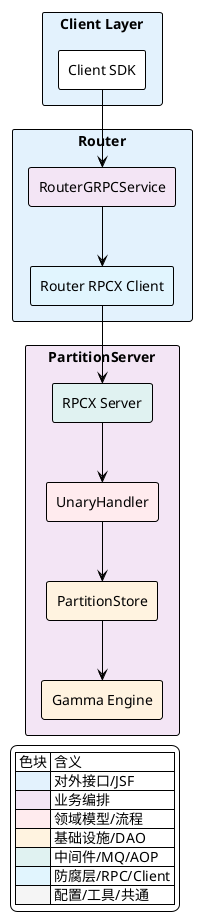
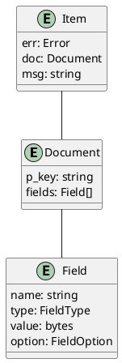
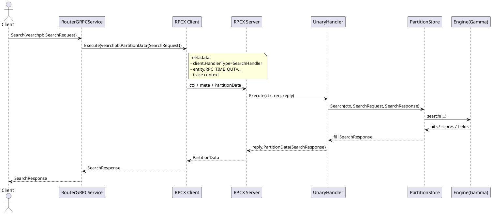

## 协议与消息定义

本节围绕 Router 层的 gRPC 协议与消息，以及 PartitionServer（PS）内部基于 rpcx 的一元（Unary）批处理协议，说明它们的职责边界、请求/响应结构、元数据携带与路由机制，以及典型调用链中的数据载荷与状态流转。

### 角色与边界：Router gRPC 与 PS 内部 RPC

Router 层面：
- 对外暴露 `RouterGRPCService`，提供 `Get`、`Delete`、`Search`、`Bulk`、`Space`、`SearchByID` 等。
- 统一使用 `vearchpb.RequestHead`/`vearchpb.ResponseHead` 作为通用头，承载 `timeout`、`db_name`、`space_name`、`params` 等上下文。
- 以 `vearchpb.Document`、`vearchpb.Item` 为数据载体，实现单/批请求的一致化。

PS 层面：
- 内部通过 rpcx 的一元调用承载所有读写、检索、索引运维指令，采用统一容器 `vearchpb.PartitionData` 批量承载 `Items` 或携带 `SearchRequest`/`QueryRequest` 等。
- 关键元数据通过 `share.ReqMetaDataKey` 注入，至少包含 `client.HandlerType`（决定服务端 `switch` 路由）、`entity.RPC_TIME_OUT`（覆盖 `ctx` 超时）、Jaeger `trace` 载荷等。
- `UnaryHandler.Execute` 统一解析元数据、选择并发通道、超时控制、分区定位与降级，最终将结果回填到 `reply`。

架构视角（组件关系）如下所示：



<details>
<summary>关联代码</summary>

internal/proto/router_grpc.proto:10-17,internal/proto/router_grpc.proto:19-34,internal/proto/data_model.proto:39-48,internal/proto/errors.proto:8-20,internal/ps/handler_document.go:64-88

</details>

### Router gRPC 接口与请求/响应规范

Router 以 `RouterGRPCService` 定义外部接口，方法与消息对例如下：

| RPC 方法 | 请求 | 响应 | 说明 |
|---|---|---|---|
| `Get` | `vearchpb.GetRequest` | `vearchpb.GetResponse` | 按主键批量读取，响应 `items` 返回 `document` 与错误 |
| `Delete` | `vearchpb.DeleteRequest` | `vearchpb.DeleteResponse` | 按主键批量删除 |
| `Search` | `vearchpb.SearchRequest` | `vearchpb.SearchResponse` | 向量检索与混合检索，支持过滤、排序、分区选择 |
| `Bulk` | `vearchpb.BulkRequest` | `vearchpb.BulkResponse` | 批量写入，按 `partitions` 可指定目标分区 |
| `Space` | `vearchpb.RequestHead` | `vearchpb.Table` | 返回空间（表）元信息 |
| `SearchByID` | `vearchpb.SearchRequest` | `vearchpb.SearchResponse` | 基于 ID 的向量检索（语义同 `Search`，特殊语义在 `SearchRequest` 中体现） |

关键消息片段（节选）：

- 服务与请求头

```proto
service RouterGRPCService {
  rpc Get(GetRequest) returns (GetResponse) {}
  rpc Delete(DeleteRequest) returns (DeleteResponse) {}
  rpc Search(SearchRequest) returns (SearchResponse) {}
  rpc Bulk(BulkRequest) returns (BulkResponse) {}
  rpc Space(RequestHead) returns (Table) {}
  rpc SearchByID(SearchRequest) returns (SearchResponse) {}
}

message RequestHead {
  int64 time_out_ms = 1;
  string user_name = 2;
  string db_name = 4;
  string space_name = 5;
  string client_type = 6;
  map<string, string> params = 7;
}

message ResponseHead {
  string request_id = 1;
  Error err = 2;
  map<string, string> params = 3;
}
```

- 文档操作

```proto
message GetRequest {
  RequestHead head = 1;
  repeated string primary_keys = 2;
}

message BulkRequest {
  RequestHead head = 1;
  repeated Document docs = 2;
  repeated uint32 partitions = 3;
}

message GetResponse {
  ResponseHead head = 1;
  repeated Item items = 2;
}
```

- 检索请求与响应（包含过滤、排序、向量参数等）

```proto
message VectorQuery {
  string name = 1;
  bytes value = 2;
  double min_score = 3;
  double max_score = 4;
  string format = 5;
  string index_type = 6;
}

message SearchRequest {
  RequestHead head = 1;
  int32 req_num = 2;
  int32 topN = 3;
  int32 is_brute_search = 4;
  repeated VectorQuery vec_fields = 5;
  repeated string fields = 6;
  repeated RangeFilter range_filters = 7;
  repeated TermFilter term_filters = 8;
  string index_params = 9;
  int32 multi_vector_rank = 10;
  bool l2_sqrt = 11;
  bool is_vector_value = 12;
  map<string, string> sort_field_map = 13;
  repeated SortField sort_fields = 14;
  string ranker = 15;
  bool trace = 16;
  int32 operator = 17;
  int32 page_size = 18;
  int32 page_num = 19;
  int32 offset = 20;
  bool is_slow_search = 21;
  repeated string partition_names = 22;
}

message SearchResponse {
  ResponseHead head = 1;
  repeated SearchResult results = 2;
  bool timeout = 3;
  bytes FlatBytes = 4;
}
```

要点：
- `vearchpb.RequestHead.params` 作为扩展键值对用于透传；`trace` 控制在 `SearchRequest`/`QueryRequest` 中亦可标记链路采样。
- `vearchpb.SearchResponse.FlatBytes` 在 PS 内部可作为压平的二进制回传给 Router，再解压还原 `results`（在 PS 内部 `deleteByQuery` 就会先反序列化该字段）。

<details>
<summary>关联代码</summary>

internal/proto/router_grpc.proto:10-17,internal/proto/router_grpc.proto:19-34,internal/proto/router_grpc.proto:168-191,internal/proto/router_grpc.proto:214-219,internal/proto/data_model.proto:39-48

</details>

### 数据模型与错误码

数据模型（节选）：
- `vearchpb.FieldType` 定义标量与向量类型，`vearchpb.FieldOption` 定义索引选项。
- `vearchpb.Field`/`vearchpb.Document`/`vearchpb.Item` 组成 Router 与 PS 之间数据载荷的基本单元。
- `vearchpb.Table`/`vearchpb.TableMetaInfo`/`vearchpb.FieldMetaInfo` 描述空间元数据（`Space`）。

表：字段类型与选项

| 名称 | 值域 |
|---|---|
| `vearchpb.FieldType` | `INT`、`LONG`、`FLOAT`、`DOUBLE`、`STRING`、`VECTOR`、`BOOL`、`DATE`、`STRINGARRAY` |
| `vearchpb.FieldOption` | `Null`、`Index`、`Scalar`、`Inverted`、`InvertedList`、`Bitmap`、`Composite` |

实体关联图示意：



错误码：
- 结构为 `vearchpb.ErrorEnum` + `vearchpb.Error`，分类覆盖路由、PS、分区、服务、文档操作、检索与索引等。
- 典型值：`SUCCESS`、`TIMEOUT`、`PARTITION_NOT_EXIST`、`METHOD_NOT_IMPLEMENT`、`SEARCH_ENGINE_ERR`、`UPSERT_INVALID_PARAMS` 等。
- Router/PS 在响应头 `vearchpb.ResponseHead.err` 或 `vearchpb.Item.err` 中反映错误来源与粒度。

<details>
<summary>关联代码</summary>

internal/proto/data_model.proto:9-37,internal/proto/data_model.proto:39-48,internal/proto/data_model.proto:74-85,internal/proto/errors.proto:8-115

</details>

### PS 内部 RPC 协议与批处理容器（rpcx + PartitionData/Item）

内部统一使用一元 RPC 容器 `vearchpb.PartitionData`：
- 路由键：`PartitionID`、`MessageID`。
- 批载荷：`Items`（每个 `vearchpb.Item` 包裹一个 `vearchpb.Document` 或删除用 `_id` 字段），用于 `Get`/`Delete`/`Bulk` 等。
- 检索载荷：`SearchRequest`/`QueryRequest` 与对应的 `SearchResponse`。
- 运维载荷：`IndexRequest`、`DelByQueryResponse` 等。
- 统一错误回写：`Err`。

元数据携带（rpcx `share.ReqMetaDataKey`）：
- `client.HandlerType`：决定服务端 `switch` 分派，取值如 `SearchHandler`、`BatchHandler`、`GetDocsHandler` 等。
- `entity.RPC_TIME_OUT`：覆盖每次请求的 `ctx` 超时。
- Jaeger trace：从 `reqMap` 提取 `TextMap`，在服务端构建 `server-execute` span，贯穿一次 PS 执行。

执行流程要点（`UnaryHandler.Execute`）：
- 解析元数据，确定 `method` 与超时，使用 `context.WithTimeout` 包裹。
- 记录和管理可取消队列（针对 `Search`/`Query`），用于中断慢查询。
- 基于 `method` 选择并发通道：慢查、读、写三类，超过容量时返回 `TIMEOUT` 或取消。
- 分区定位并降级，不存在时回写 `PARTITION_NOT_EXIST`。
- `switch` 分派至 `getDocuments`/`deleteDocs`/`bulk`/`search`/`query`/`forceMerge`/`rebuildIndex`/`flush`/`deleteByQuery` 等。
- 结束时将 `req` 中的 `Items`、`SearchResponse`、`DelByQueryResponse`、`Err` 回填到 `reply`。

核心代码片段（节选，元数据与回填）：

```go
// 提取 method 与 trace/timeout
reqMap := ctx.Value(share.ReqMetaDataKey).(map[string]string)
method, ok := reqMap[client.HandlerType]
if !ok {
    reply.Err = vearchpb.NewError(vearchpb.ErrorEnum_INTERNAL_ERROR, errors.New("client type not found")).GetError()
    return
}
if spanCtx, err := opentracing.GlobalTracer().Extract(opentracing.TextMap, opentracing.TextMapCarrier(reqMap)); err == nil {
    span := opentracing.StartSpan("server-execute", ext.RPCServerOption(spanCtx))
    defer span.Finish()
}
timeout := handler.server.rpcTimeOut * 1000
if s, ok := reqMap[string(entity.RPC_TIME_OUT)]; ok {
    if t, err := strconv.Atoi(s); err == nil && t > 0 {
        timeout = t
    }
}
ctx, cancel := context.WithTimeout(ctx, time.Duration(timeout)*time.Millisecond)
defer cancel()

// 并发闸门：慢查/读/写
if req.SearchRequest != nil && req.SearchRequest.IsSlowSearch {
    concurrentCh = handler.server.slow_search_concurrent
} else if method == client.QueryHandler || method == client.SearchHandler ||
    method == client.GetDocsHandler || method == client.GetDocsByPartitionHandler ||
    method == client.GetNextDocsByPartitionHandler {
    concurrentCh = handler.server.read_request_concurrent
} else {
    concurrentCh = handler.server.write_request_concurrent
}

// 回填 reply
select {
case <-doneCh:
    reply.PartitionID = req.PartitionID
    reply.MessageID = req.MessageID
    reply.Items = req.Items
    reply.SearchResponse = req.SearchResponse
    reply.DelByQueryResponse = req.DelByQueryResponse
    reply.Err = req.Err
    return
case <-time.After(delayTime):
    reply.PartitionID = req.PartitionID
    reply.MessageID = req.MessageID
    reply.Items = req.Items
    reply.Err = vearchpb.NewError(vearchpb.ErrorEnum_TIMEOUT, errors.New("request time out")).GetError()
    return
}
```

关键批处理实现：
- `bulk`：将每个 `vearchpb.Item.doc.fields` 转为 `gamma.Doc` 二进制批文，汇聚为 `vearchpb.DocCmd` 写入，引擎端逐条返回错误码字符串，PS 再映射回每个 `item.err`。
- `deleteDocs`：校验 `_id` 字段，构造 `vearchpb.DocCmd{Type: OpType_DELETE}` 批量写入。
- `getDocuments`：遍历 `items` 调用 `store.GetDocument` 并对每条记录填充 `item.err`。

<details>
<summary>关联代码</summary>

internal/ps/handler_document.go:96-187,internal/ps/handler_document.go:254-291,internal/ps/handler_document.go:344-383,internal/ps/handler_document.go:306-331,internal/ps/handler_document.go:293-305

</details>

### 典型调用链：Router.Search 到 PS.SearchHandler

一次标准检索的跨层时序如下（单分区示意）：



要点：
- 元数据从 Router 的 rpcx 客户端落入服务端 `share.ReqMetaDataKey`，被 `UnaryHandler` 用于分派、超时与 trace。
- `vearchpb.PartitionData` 在服务端被直接修改（填充 `SearchResponse`）后回传， Router 聚合多个分区的 `SearchResult` 构成最终 `vearchpb.SearchResponse`。

<details>
<summary>关联代码</summary>

internal/proto/router_grpc.proto:168-191,internal/proto/router_grpc.proto:214-219,internal/ps/handler_document.go:107-138,internal/ps/handler_document.go:254-274,internal/ps/handler_document.go:432-466

</details>

### 扩展与兼容性实践

扩展新的外部 API（Router 侧）：
- 在 `router_grpc.proto` 声明新的 `rpc`、请求/响应 `message`。
- `go_package` 生成 `vearchpb` 类型后，在 Router 实现层将该请求映射为内部 `vearchpb.PartitionData` 载荷。

扩展新的内部操作（PS 侧）：
- 定义新的 `client.HandlerType` 常量，并由 Router 在 rpcx 元数据 `share.ReqMetaDataKey` 中写入该键。
- 在 `UnaryHandler.execute` 的 `switch method` 中新增分支，消费 `req.Items` 或特定 `req.*Request`，并将结果回写到 `req` 对应的响应字段。
- 若涉及批处理，复用 `vearchpb.Item` 包裹单条 `vearchpb.Document`，或新增 `vearchpb.DocCmd` 类型以二进制批文方式写入引擎。

错误与超时处理：
- 统一使用 `vearchpb.ErrorEnum` 回填到 `vearchpb.ResponseHead.err` 或 `vearchpb.Item.err`。
- 使用 `entity.RPC_TIME_OUT` 控制单次调用超时；并根据操作类型进入对应的并发闸门，超过容量将返回 `TIMEOUT` 或取消。

<details>
<summary>关联代码</summary>

internal/proto/router_grpc.proto:10-17,internal/proto/errors.proto:109-115,internal/ps/handler_document.go:254-291,internal/ps/handler_document.go:226-244,internal/ps/handler_document.go:177-186

</details>