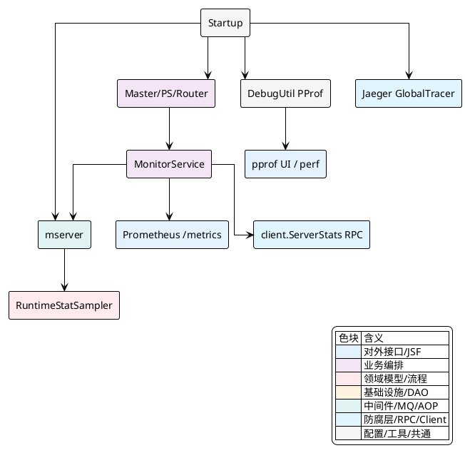
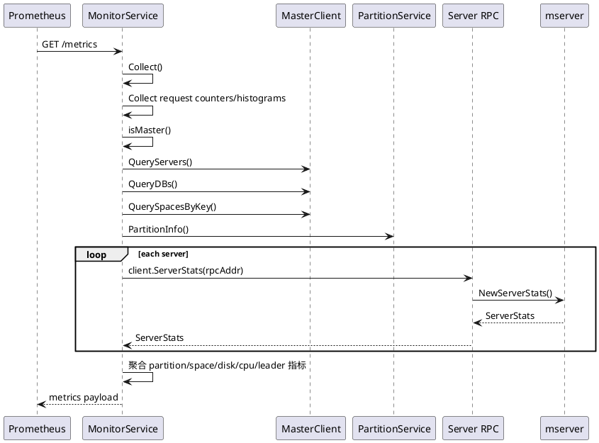
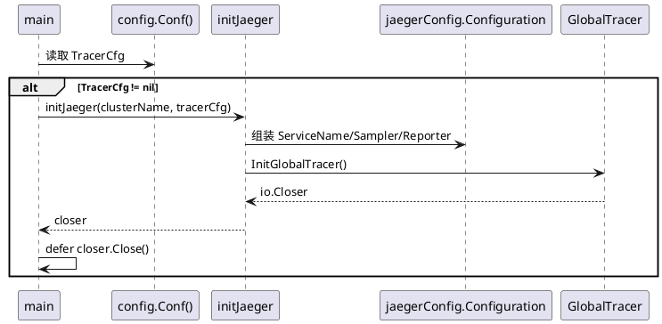

## 监控与调试能力

Vearch 的监控与调试实现分成四条并行但可互补的能力链路：一条是 `mserver` 维护的节点级运行时快照，用于沉淀进程、磁盘、CPU、网络、GC 等本地状态；一条是 `monitor` 基于 Prometheus Collector 暴露可抓取指标，将接口调用、集群元数据、分区统计和节点快照拼接成统一观测面；一条是 `debugutil` 提供的 PProf 与 FlameGraph 入口，用于直接定位 CPU/Heap 热点；最后一条是启动时可选初始化的 Jaeger Tracer，它把全局链路追踪挂入进程生命周期。

这几条能力不是独立散落在各模块里，而是被 `cmd/vearch/startup.go` 串成统一启动过程：节点角色先完成自身地址识别与服务启动，再注册 PProf 监听，随后启动 `mserver` 采样与标签写入；如果配置了监控端口，各角色还会通过 `monitor.Register` 暴露 `/metrics`；如果配置了 `TracerCfg`，则在主进程最早期完成全局 Tracer 注册。



### 启动阶段如何把观测能力挂进进程生命周期

启动逻辑里，监控与调试并不是服务启动后的附加动作，而是与角色启动交织在一起。`main()` 首先装载配置；如果存在 `TracerCfg`，立即调用 `initJaeger()` 创建全局 Tracer，并把 `closer.Close()` 延迟到进程退出时执行。随后根据命令行参数决定当前进程承载 `master`、`ps`、`router` 中的哪些角色。

角色启动过程中，`master` 分支会先取 `self.Address` 并调用 `mserver.SetIp(self.Address, true)`，这一步的作用是给后续节点级监控快照写入实例地址。各角色启动完成后，如果对应配置中的 `PprofPort` 大于 `0`，则调用 `debugutil.StartUIPprofListener()` 独立打开调试监听端口。所有角色分支结束后，主流程统一执行 `mserver.Start(ctx, psPath)` 开启运行时采样，再通过 `mserver.AddLabel("models", strings.Join(models, ","))` 把当前进程承载的角色集合打入标签集。

这意味着同一个二进制在 `all` 模式下启动时，会把 `master`、`ps`、`router` 的组合信息直接写进 `mserver` 标签中；而在单角色模式下，标签只反映该角色。Prometheus 侧和内部状态快照侧都能借此辨认节点职责。

关键代码集中在以下片段：

[cmd/vearch/startup.go:103-105]()
```go
if config.Conf().TracerCfg != nil {
	closer := initJaeger(config.Conf().Global.Name, config.Conf().TracerCfg)
	defer closer.Close()
}
```

[cmd/vearch/startup.go:173-175]()
```go
self := config.Conf().Masters.Self()
mserver.SetIp(self.Address, true)
models = append(models, "master")
```

[cmd/vearch/startup.go:192-194]()
```go
if port := config.Conf().Masters.Self().PprofPort; port > 0 {
	debugutil.StartUIPprofListener(int(port))
}
```

[cmd/vearch/startup.go:262-263]()
```go
mserver.Start(ctx, psPath)
mserver.AddLabel("models", strings.Join(models, ","))
```

这里存在一个明确的启动顺序语义：`SetIp()` 先于 `Start()` 并不要求强依赖，因为 `metricServer` 本身把地址与采样器拆开维护；但 `AddLabel()` 依赖 `MetricRegistry` 已初始化，所以它被放在 `Start()` 之后。

<details>
<summary>关联代码</summary>

[cmd/vearch/startup.go:65-85](),[cmd/vearch/startup.go:162-194](),[cmd/vearch/startup.go:197-254](),[cmd/vearch/startup.go:262-263]()

</details>

### `mserver` 如何沉淀节点级运行时快照

`mserver` 的职责不是直接暴露 Prometheus 文本格式，而是维护一个进程内的指标注册表、运行时采样器和导出器，最终生成统一的 `ServerStats` 结构，供其他模块拉取。实现入口是包级单例 `ms`，内部通过 `sync.Once` 保证 `Start()` 只执行一次，这样无论当前进程承载多少角色，运行时采样器都只会创建一份。

`Start(ctx, diskPaths)` 做了四件事：创建 `MetricRegistry`、创建内存导出器、创建 `RuntimeStatSampler`、启动导出定时器。`RuntimeStatSampler` 收集的内容覆盖内存、交换区、磁盘、CPU、网络和 GC，磁盘采样以 `diskPaths` 为输入，因此启动时把数据目录和日志目录都放入路径集，后续磁盘统计就与真实节点存储路径保持一致。

[internal/pkg/metrics/mserver/MetricServer.go:39-58]()
```go
func Start(ctx context.Context, diskPaths []string) {
	ms.once.Do(func() {
		ms.MetricRegistry = metrics.NewRegistry()
		ms.MetricExport = export.NewMemoryExporter()
		ms.MetricRuntime = sysstat.NewRuntimeStatSampler(sysstat.RuntimeStatOption{
			Ctx:        ctx,
			HeapSample: false,
			DiskPath:   diskPaths,
		})
		ms.MetricRegistry.AddMetricStruct(ms.MetricRuntime)
		ms.MetricExportTimer = metrics.NewExportTimer(ctx, 0)

		if err := ms.MetricRuntime.Start(); err != nil {
			log.Error("start metric runtime err: %s", err.Error())
		}
		if err := ms.MetricExportTimer.Start(); err != nil {
			log.Error("start metric runtime err: %s", err.Error())
		}
	})
}
```

`SetIp()` 与 `AddLabel()` 则负责给这份快照增加身份信息。`SetIp()` 持锁维护 `Ip` 字段，并通过 `replace` 控制是否允许覆盖；`AddLabel()` 直接写入 `MetricRegistry`。启动阶段将 `"models"` 标签加入后，`NewServerStats()` 会把当前 `Ip` 和全量标签一起封装进 `ServerStats`。

[internal/pkg/metrics/mserver/MetricServer.go:61-83]()
```go
func NewServerStats() *ServerStats {
	ms.lock.Lock()
	defer ms.lock.Unlock()
	return newServerStats(ms.Ip, ms.MetricRegistry.GetLabels(), ms)
}

func SetIp(ip string, replace bool) {
	ms.lock.Lock()
	defer ms.lock.Unlock()

	if ms.Ip != "" {
		if replace {
			ms.Ip = ip
		}
	} else {
		ms.Ip = ip
	}
}

func AddLabel(key, value string) {
	ms.MetricRegistry.AddLabel(key, value)
}
```

`newServerStats()` 不是简单返回原始采样器，而是把运行时数据规整成稳定的传输模型。`Mem`、`Swap`、`Fs`、`Cpu`、`Net`、`GC` 等字段都由专门构造函数从 `RuntimeStatSampler` 当前值快照化，这样调用方拿到的是一个时点一致的只读结构。`FsStats` 还会带上采样时使用的 `Paths`，方便定位磁盘统计覆盖了哪些目录。

[internal/pkg/metrics/mserver/monitor.go:35-46]()
```go
func newServerStats(ip string, lables []*metrics.LabelPair, ss *metricServer) *ServerStats {
	return &ServerStats{
		Ip:     ip,
		Labels: lables,
		Mem:    NewMemStats(ss.MetricRuntime),
		Fs:     NewFsStats(ss.MetricRuntime),
		Swap:   NewSwapStats(ss.MetricRuntime),
		Cpu:    NewCpuStats(ss.MetricRuntime),
		Net:    NewNetStats(ss.MetricRuntime),
		GC:     NewGCStats(ss.MetricRuntime),
	}
}
```

`ServerStats` 还有两个重要扩展槽位：`ActiveConn` 与 `PartitionInfos`。这表明它不仅承载系统级指标，也承载业务节点可上报的连接数和分区状态。`monitor` 模块在汇总集群信息时，就会依赖 `PartitionInfos` 做分区文档数、分区大小和 leader 数量统计。

| 字段 | 来源 | 含义 |
|---|---|---|
| `Ip` | `mserver.SetIp()` | 节点实例地址 |
| `Labels` | `MetricRegistry.GetLabels()` | 角色等静态标签 |
| `Mem`/`Swap`/`Fs`/`Cpu`/`Net`/`GC` | `RuntimeStatSampler` | 本机运行时资源快照 |
| `ActiveConn` | 节点业务侧补充 | 活跃连接数 |
| `PartitionInfos` | 节点业务侧补充 | 分区及 Raft 状态 |

<details>
<summary>关联代码</summary>

[internal/pkg/metrics/mserver/MetricServer.go:27-83](),[internal/pkg/metrics/mserver/monitor.go:35-192]()

</details>

### `monitor.Register` 如何把本地快照与集群业务指标合成为 `/metrics`

`monitor` 包的实现重心在 `MonitorService`。它同时扮演了两个角色：一方面持有多个 `HistogramVec`、`CounterVec`、`GaugeVec`，接收接口调用和集群状态写入；另一方面实现了 Prometheus 的 `Collector` 接口，在抓取瞬间动态计算和产出指标。

`Register(masterClient, etcdServer, monitorPort)` 只会执行一次。它创建 `collector`，注册到自定义 `metricRegistry`，然后把 `/metrics` 处理器绑定到默认 `http` 多路复用器上。输出时通过 `prometheus.Gatherers{metricRegistry, prometheus.DefaultGatherer}` 合并了自定义指标与默认 Go 运行时指标，因此抓取结果里既有 Vearch 业务指标，也有进程基础指标。

[internal/monitor/monitor_service.go:76-99]()
```go
func Register(masterClient *client.Client, etcdServer *etcdserver.EtcdServer, monitorPort uint16) {
	once.Do(func() {
		collector = newMetricCollector(masterClient, etcdServer)
		metricRegistry.MustRegister(collector)

		http.Handle("/metrics", promhttp.HandlerFor(
			prometheus.Gatherers{metricRegistry, prometheus.DefaultGatherer},
			promhttp.HandlerOpts{
				EnableOpenMetrics: true,
				Registry:          metricRegistry,
			},
		))

		go func() {
			if monitorPort > 0 {
				log.Info("monitoring start in Port: %v", monitorPort)
				if err := http.ListenAndServe(":"+cast.ToString(monitorPort), nil); err != nil {
					log.Error("Error occur when start server %v", err)
				}
			} else {
				log.Info("skip register monitoring")
			}
		}()
	})
}
```

`MonitorService` 内部的指标可以分成三类。第一类是请求剖面，包含 `vearch_request_duration_milliseconds`、`vearch_request_count` 以及数据节点请求版本；第二类是集群规模与健康度，包含 `server`、`db`、`space`、`partition`、`cluster_health`；第三类是节点资源与分区载荷，包含磁盘占用、CPU 使用率、空间文档数、分区大小、leader 数量等。

这些指标的初始化都集中在 `newMetricCollector()`。请求类指标在创建时就固定了标签维度，例如普通 API 请求以 `cluster`、`api`、`http_code`、`db`、`space` 为标签，数据节点请求则增加 `ip`、`node_id`、`partition_id`。

[internal/monitor/monitor_service.go:164-196]()
```go
RequestDuration: prometheus.NewHistogramVec(
	prometheus.HistogramOpts{
		Name:    "vearch_request_duration_milliseconds",
		Help:    "Vearch API request durations in milliseconds",
		Buckets: prometheus.ExponentialBuckets(1, 2, 15),
	},
	[]string{"cluster", "api", "http_code", "db", "space"},
),

DataNodeRequestDuration: prometheus.NewHistogramVec(
	prometheus.HistogramOpts{
		Name:    "vearch_data_node_request_duration_milliseconds",
		Help:    "Vearch Data Node API request durations in milliseconds",
		Buckets: prometheus.ExponentialBuckets(1, 2, 15),
	},
	[]string{"cluster", "api", "code", "ip", "node_id", "partition_id"},
),
```

运行时写入请求指标时，`Profiler()` 和 `DataNodeProfiler()` 并不依赖抓取周期，而是在请求结束时立刻按标签写入直方图和计数器。普通 API 以毫秒记录，数据节点请求先取微秒再转毫秒，避免极短请求被粗粒度时间单位吞掉。

[internal/monitor/monitor_service.go:102-113]()
```go
func Profiler(key string, startTime time.Time, httpCode int, dbName string, spaceName string) {
	if collector == nil || collector.RequestDuration == nil || collector.RequestCount == nil {
		log.Warn("Monitoring system not initialized, metrics will not be recorded")
		return
	}

	httpCodeStr := fmt.Sprintf("%d", httpCode)
	collector.RequestDuration.WithLabelValues(config.Conf().Global.Name, key, httpCodeStr, dbName, spaceName).Observe(float64(time.Since(startTime).Milliseconds()))
	collector.RequestCount.WithLabelValues(config.Conf().Global.Name, key, httpCodeStr, dbName, spaceName).Add(float64(1))
}
```

[internal/monitor/monitor_service.go:140-156]()
```go
func DataNodeProfiler(key string, startTime time.Time, code int, ip string, nodeID uint32, partitionID uint32) {
	if collector == nil || collector.DataNodeRequestDuration == nil || collector.DataNodeRequestCount == nil {
		log.Warn("Monitoring system not initialized, metrics will not be recorded")
		return
	}

	codeStr := fmt.Sprintf("%d", code)
	nodeIDStr := fmt.Sprintf("%d", nodeID)
	partitionIDStr := fmt.Sprintf("%d", partitionID)

	durationMicroseconds := time.Since(startTime).Microseconds()
	durationMilliseconds := float64(durationMicroseconds) / 1000.0

	collector.DataNodeRequestDuration.WithLabelValues(config.Conf().Global.Name, key, codeStr, ip, nodeIDStr, partitionIDStr).Observe(durationMilliseconds)
	collector.DataNodeRequestCount.WithLabelValues(config.Conf().Global.Name, key, codeStr, ip, nodeIDStr, partitionIDStr).Add(float64(1))
}
```

而 `Collect()` 则负责在 Prometheus 抓取时补齐那些需要实时聚合的指标。这里最关键的行为是它只在当前节点既具备 `masterClient` 又是 etcd leader 时继续执行集群级采集。判断逻辑由 `isMaster()` 完成：`etcdServer.ID()` 必须等于 `etcdServer.Lead()`。因此，集群级统计只有主节点对外产出，避免多实例重复汇总。

`Collect()` 的采集链路可以概括为：先查询服务列表、数据库列表、空间列表，再借助 `PartitionService.PartitionInfo()` 计算每个空间的健康度，然后并发拉取所有 server 的 `ServerStats`，最后把分区级数据回卷成空间级和集群级指标。这里的“并发拉取”由 `collectServerStats()` 执行，它为每个节点启动 goroutine，给单节点请求施加 `5s` 超时，并且在 goroutine 内部做 `recover`，把异常也折叠成 `ServerStats` 错误结果，而不是中断整次采集。



并发采集的错误处理和超时控制在以下代码中非常集中：

[internal/monitor/monitor_service.go:341-378]()
```go
func collectServerStats(ctx context.Context, servers []*entity.Server) []*mserver.ServerStats {
	results := make([]*mserver.ServerStats, 0, len(servers))
	resultCh := make(chan *mserver.ServerStats, len(servers))

	var wg sync.WaitGroup
	for _, s := range servers {
		wg.Add(1)
		go func(s *entity.Server) {
			defer wg.Done()
			defer func() {
				if r := recover(); r != nil {
					log.Error("Panic while collecting stats from %s: %v", s.RpcAddr(), r)
					resultCh <- mserver.NewErrServerStatus(s.RpcAddr(), errors.New(cast.ToString(r)))
				}
			}()

			serverCtx, cancel := context.WithTimeout(ctx, 5*time.Second)
			defer cancel()

			select {
			case <-serverCtx.Done():
				log.Warn("Timeout while collecting stats from %s", s.RpcAddr())
				resultCh <- mserver.NewErrServerStatus(s.RpcAddr(), serverCtx.Err())
			case resultCh <- client.ServerStats(s.RpcAddr()):
			}
		}(s)
	}
```

真正的汇总逻辑则把节点资源快照和业务分区统计合在一起。磁盘指标直接从 `ServerStats.Fs` 读取；只有当某个分区在其节点上处于 leader 状态时，才把 `DocNum` 和 `Size` 计入分区与空间总量，同时也累加 `leaderCount` 与集群总 `partitionCount`。这使得空间文档数与空间大小都来源于 leader 分区视角，而不是简单按副本数重复累计。

[internal/monitor/monitor_service.go:466-504]()
```go
for _, s := range result {
	if s.Fs != nil {
		ms.diskTotal.WithLabelValues(s.Ip).Set(float64(s.Fs.Total))
		ms.diskFree.WithLabelValues(s.Ip).Set(float64(s.Fs.Free))
		ms.diskUsed.WithLabelValues(s.Ip).Set(float64(s.Fs.Used))
		ms.diskUsedPercent.WithLabelValues(s.Ip).Set(float64(s.Fs.UsedPercent))
	}

	leaderNum := float64(0)
	for _, p := range s.PartitionInfos {
		if p.RaftStatus == nil {
			continue
		}
		if p.RaftStatus.Leader == p.RaftStatus.NodeID {
			leaderNum++
			partitionNum++

			if space, ok := spacePartitionIDMap[p.PartitionID]; ok {
				docNumMap[space] += p.DocNum
			} else {
				ms.partitionDocs.DeleteLabelValues(cast.ToString(p.PartitionID))
				ms.partitionSize.DeleteLabelValues(cast.ToString(p.PartitionID))
				continue
			}

			ms.partitionDocs.WithLabelValues(cast.ToString(p.PartitionID)).Set(float64(p.DocNum))
			ms.partitionSize.WithLabelValues(cast.ToString(p.PartitionID)).Set(float64(p.Size))

			if space, ok := spacePartitionIDMap[p.PartitionID]; ok {
				sizeMap[space] += p.Size
			}
		}
	}

	ms.leaderCount.WithLabelValues(s.Ip).Set(leaderNum)
}
```

此外，`RemoveUselessSpaceAndPartitionMetrics()` 用于删除已经无效的空间和分区指标，防止指标集合保留历史垃圾标签。它只有在 `isMaster()` 为真时才会执行删除，保持集群级指标的唯一修改源。

| 函数 | 写入/产出内容 | 触发时机 |
|---|---|---|
| `Register()` | 注册 Collector、启动 `/metrics` HTTP 服务 | 进程启动 |
| `Profiler()` | 普通 API 请求耗时和计数 | 单次请求结束 |
| `DataNodeProfiler()` | 数据节点请求耗时和计数 | 单次节点调用结束 |
| `Collect()` | 集群规模、健康度、分区/空间统计、节点资源统计 | Prometheus 抓取时 |
| `RemoveUselessSpaceAndPartitionMetrics()` | 删除过期空间和分区指标 | 元数据变更后 |

<details>
<summary>关联代码</summary>

[internal/monitor/monitor_service.go:40-100](),[internal/monitor/monitor_service.go:102-157](),[internal/monitor/monitor_service.go:159-305](),[internal/monitor/monitor_service.go:334-544]()

</details>

### PProf 与 FlameGraph 如何通过 `debugutil` 暴露调试入口

`debugutil` 维护了一套独立于业务 HTTP 服务的调试服务器。`StartUIPprofListener(port)` 在指定端口上创建 TCP 监听，并把 `pprofServer.mux` 交给 `http.Server`。它不依附于 Router 的 Gin 路由，也不要求复用已有服务端口，因此 `Master`、`PS`、`Router` 都可以按各自配置单独拉起调试入口。

[internal/debugutil/server.go:89-113]()
```go
func StartUIPprofListener(port int) {
	pprofServer := NewServer()
	address := strings.Join([]string{"", strconv.Itoa(port)}, ":")
	listener, err := net.Listen("tcp", address)
	if err != nil {
		log.Error("StartUIPprofListener start error: %v", err.Error())
		return
	}

	srvhttp := &http.Server{
		Handler: pprofServer.mux,
	}
	go func() {
		defer func() {
			if r := recover(); r != nil {
				log.Error("start pprof server error: %v", r)
			}
		}()

		err = srvhttp.Serve(listener)
		if err != nil {
			log.Error("srvhttp.Serve error: %v", err.Error())
		}
	}()
}
```

`NewServer()` 组装出的调试端点分成三层。第一层是原生 `pprof` 路由，例如 `/debug/pprof/`、`/debug/pprof/trace`。第二层是 `/debug/pprof/ui/`，它接入了 `pprofui`，提供更适合浏览器查看的 UI。第三层是 `/perf/profile` 和 `/perf/heap`，它们不是 Go 原生 pprof 输出，而是通过系统命令链生成 FlameGraph HTML 页面。

[internal/debugutil/server.go:33-75]()
```go
func NewServer() *Server {
	mux := http.NewServeMux()

	mux.HandleFunc("/debug/pprof/", pprof.Index)
	mux.HandleFunc("/debug/pprof/cmdline", pprof.Cmdline)
	mux.HandleFunc("/debug/pprof/profile", func(w http.ResponseWriter, r *http.Request) {
		CPUProfileHandler(w, r)
	})
	mux.HandleFunc("/debug/pprof/symbol", pprof.Symbol)
	mux.HandleFunc("/debug/pprof/trace", pprof.Trace)

	ps := pprofui.NewServer(pprofui.NewMemStorage(1, 0), func(profile string, labels bool, do func()) {
		if profile != "profile" {
			do()
			return
		}

		if err := CPUProfileDo(CPUProfileOptions{WithLabels: labels}.Type(), func() error {
			var extra string
			if labels {
				extra = " (enabling profiler labels)"
			}
			log.Info("pprofui: recording %v%v", profile, extra)
			do()
			return nil
		}); err != nil {
			return
		}
	})
	mux.Handle("/debug/pprof/ui/", http.StripPrefix("/debug/pprof/ui", ps))

	mux.HandleFunc("/perf/profile", CPUProfile)
	mux.HandleFunc("/perf/heap", HeapProfile)

	return &Server{mux: mux}
}
```

CPU Profiling 这一层又多包了一层状态控制。`CPUProfileOptionsFromRequest()` 会从请求参数读取 `seconds` 和 `labels`；`CPUProfileDo()` 在全局变量 `GlobalCPUProfiling` 上标记当前 profiling 类型；`CPUProfileHandler()` 再把控制权交给标准库 `pprof.Profile()`。因此，调试接口既能沿用原生 pprof 输出，又能知道当前是否启用了 labels。

[internal/debugutil/cpuprofile.go:52-90]()
```go
func CPUProfileOptionsFromRequest(r *http.Request) CPUProfileOptions {
	seconds, err := strconv.ParseInt(r.FormValue("seconds"), 10, 32)
	if err != nil || seconds <= 0 {
		seconds = 30
	}
	withLabels := r.FormValue("labels") != "false"
	return CPUProfileOptions{
		Seconds:    int32(seconds),
		WithLabels: withLabels,
	}
}

func CPUProfileHandler(w http.ResponseWriter, r *http.Request) {
	opts := CPUProfileOptionsFromRequest(r)
	if err := CPUProfileDo(opts.Type(), func() error {
		pprof.Profile(w, r)
		return nil
	}); err != nil {
		http.Error(w, err.Error(), http.StatusInternalServerError)
		return
	}
}
```

`/perf/profile` 与 `/perf/heap` 则完全走另一条链路。`CPUProfile()` 和 `HeapProfile()` 都会调用 `GetPerfSVGHtml()`，后者使用当前进程 `pid` 执行 `perf record`，再串联 `perf script`、`stackcollapse-perf.pl`、`flamegraph.pl`，把生成的 SVG 包进 HTML 返回。中间临时文件都会在函数退出时清理。

[internal/debugutil/perfui.go:46-66]()
```go
func GetPerfSVGHtml(w io.Writer, name string, interval int64) error {
	suffix := time.Now().UnixNano()
	perfDataFile := fmt.Sprintf("perf-%v.data", suffix)
	perfUnfoldFile := fmt.Sprintf("perf-%v.unfold", suffix)
	perfFoldedFile := fmt.Sprintf("perf-%v.folded", suffix)
	flameGraphSVGFile := fmt.Sprintf("flamegraph-%v.svg", suffix)

	pid := os.Getpid()
	var cmdPerf *exec.Cmd
	if name == "profile" {
		cmdPerf = exec.Command("perf", "record", "-g",
			"-p", fmt.Sprintf("%d", pid),
			"-o", perfDataFile, "sleep", fmt.Sprintf("%d", interval))
	} else {
		cmdPerf = exec.Command("perf", "record", "-g", "-e",
			"\"kmem:*\"", "-p", fmt.Sprintf("%d", pid),
			"-o", perfDataFile, "sleep", fmt.Sprintf("%d", interval))
	}
	err := cmdPerf.Run()
```

这条实现链意味着 `debugutil` 暴露的并不只是标准 Go 调试接口，还包括依赖系统级工具链的热点火焰图入口。调用者看到的是统一的 HTTP 接口，但底层分别通向 Go 运行时 profile 和 Linux perf 采样。

| 路径 | 实现入口 | 输出 |
|---|---|---|
| `/debug/pprof/` | 标准库 `pprof.Index` | 原生 pprof 页面 |
| `/debug/pprof/profile` | `CPUProfileHandler()` | CPU profile |
| `/debug/pprof/trace` | 标准库 `pprof.Trace` | trace 数据 |
| `/debug/pprof/ui/` | `pprofui.NewServer()` | UI 化 profile 浏览 |
| `/perf/profile` | `CPUProfile()` | CPU FlameGraph HTML |
| `/perf/heap` | `HeapProfile()` | Heap FlameGraph HTML |

<details>
<summary>关联代码</summary>

[internal/debugutil/server.go:28-113](),[internal/debugutil/cpuprofile.go:19-90](),[internal/debugutil/perfui.go:17-145]()

</details>

### Jaeger 初始化如何进入全局调用链

Jaeger 的接入点非常集中，只有 `startup.go` 中的 `initJaeger()` 和主流程中的条件调用。`initJaeger(service, c)` 根据配置组装 `jaegerConfig.Configuration`，其中 `Sampler` 和 `Reporter` 都直接映射到 `TracerCfg`。随后调用 `cfg.InitGlobalTracer(service, jaegerConfig.Logger(jaeger.StdLogger))`，把 tracer 注册成全局实例。

[cmd/vearch/startup.go:65-85]()
```go
func initJaeger(service string, c *config.TracerCfg) io.Closer {
	cfg := &jaegerConfig.Configuration{
		ServiceName: service,
		Sampler: &jaegerConfig.SamplerConfig{
			Type:  c.SampleType,
			Param: c.SampleParam,
		},
		Reporter: &jaegerConfig.ReporterConfig{
			LocalAgentHostPort:         c.Host,
			LogSpans:                   false,
			DisableAttemptReconnecting: false,
			AttemptReconnectInterval:   1 * time.Minute,
		},
	}
	closer, err := cfg.InitGlobalTracer(service, jaegerConfig.Logger(jaeger.StdLogger))
	if err != nil {
		panic(fmt.Sprintf("ERROR: cannot init Jaeger: %v\n", err))
	}
	return closer
}
```

由于这里调用的是 `InitGlobalTracer()`，后续代码只要使用 OpenTracing 全局 tracer，就会自动进入这一实现。初始化发生在读取完配置、启动任何角色之前，因此 Master、PS、Router 的内部链路只要依赖全局 tracer，都共享同一套服务名与采样配置。资源释放则由 `defer closer.Close()` 绑定在主进程生命周期末尾。



这一实现不负责埋点本身，它只负责把 tracer 放进全局运行环境中。链路追踪是否真正产生 span，取决于其他业务模块是否在调用链中使用全局 tracer。

<details>
<summary>关联代码</summary>

[cmd/vearch/startup.go:65-85](),[cmd/vearch/startup.go:97-106]()

</details>

### 角色级监控端口与能力边界

题目中的四条关键业务流最终汇合成统一的角色级能力矩阵。`mserver` 与 `debugutil` 都是在每个进程内局部启动的；`monitor` 是否汇总集群级状态，则受当前角色和主节点身份共同约束；Jaeger 只要启用，就会作用于整个进程。

| 能力 | 入口函数 | 作用范围 | 关键输出 |
|---|---|---|---|
| 节点运行时采样 | `mserver.SetIp()`、`mserver.Start()`、`mserver.AddLabel()` | 当前进程 | `ServerStats`、节点标签 |
| Prometheus 监控 | `monitor.Register()` | 当前进程对外暴露；集群级指标仅主节点汇总 | `/metrics` |
| PProf/火焰图调试 | `debugutil.StartUIPprofListener()` | 当前进程 | `/debug/pprof/*`、`/perf/*` |
| 全局链路追踪 | `initJaeger()` | 当前进程 | 全局 `Tracer` |

其中最值得注意的是，`mserver` 与 `monitor` 的关系是“本地快照提供者”和“抓取时聚合者”。`mserver` 不关心 Prometheus，也不直接维护集群视图；`monitor` 不自己采样本机资源，而是通过 `mserver.NewServerStats()` 和远端 `client.ServerStats()` 把各节点快照收回来，在抓取瞬间汇总成可观测指标。调试和追踪能力则分别从旁路切入：`debugutil` 提供面向问题定位的即时接口，Jaeger 提供跨调用链的上下文传播底座。

<details>
<summary>关联代码</summary>

[cmd/vearch/startup.go:162-263](),[internal/pkg/metrics/mserver/MetricServer.go:39-83](),[internal/monitor/monitor_service.go:76-99](),[internal/monitor/monitor_service.go:381-544](),[internal/debugutil/server.go:33-113]()

</details>