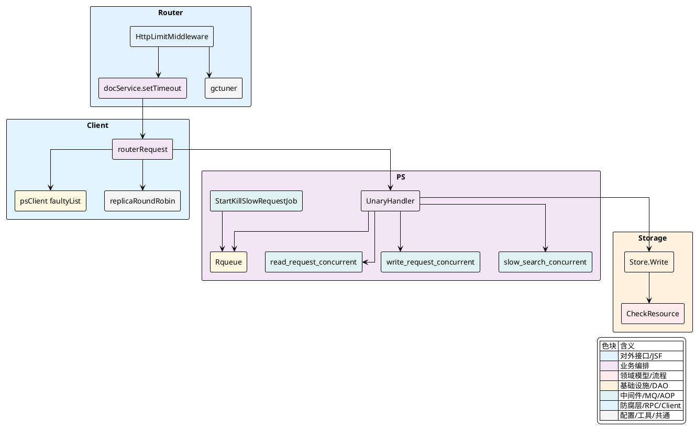
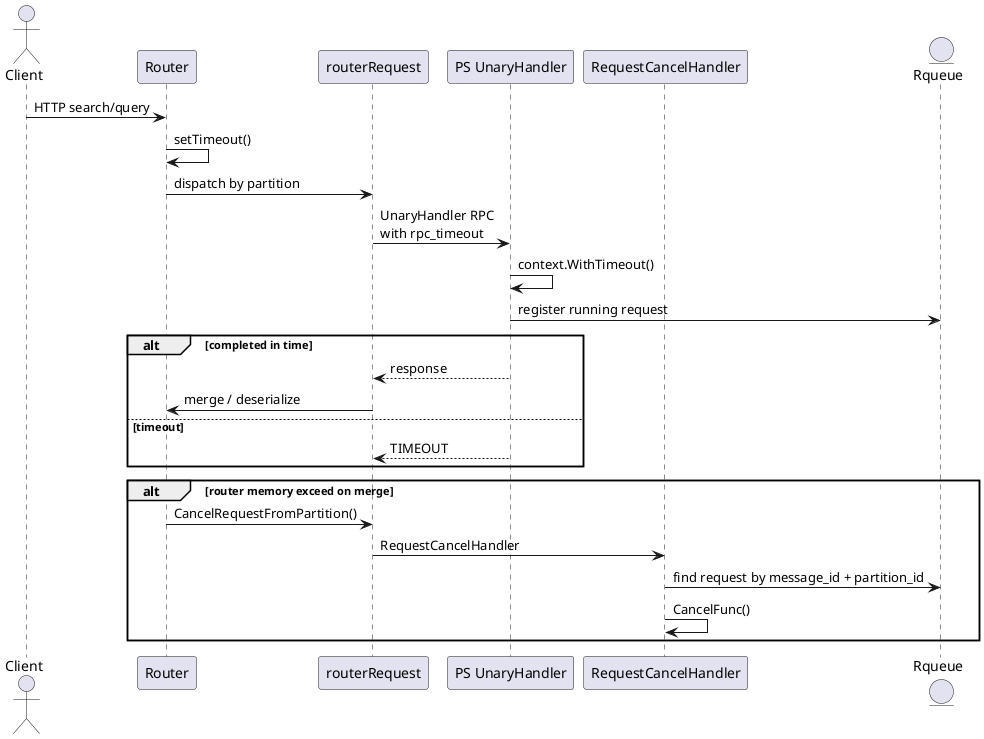

## 容错与限流策略

Vearch 的稳定性控制分散在 `Router`、`Client`、`PS` 与底层存储几个层面，但实现链路是连续的：入口先做容量预判与频率限制，请求进入分区路由后再决定副本访问策略，落到 `PS` 时进入按类型隔离的并发通道，执行中受超时、取消与内存压力共同约束，写路径还会持续检查磁盘和内存资源。这里的重点不是单个开关，而是这些机制如何在一次请求中串起来。

## 稳定性控制的职责分层

稳定性相关职责并不是集中在一个模块里完成，而是沿调用链逐层收紧。

| 层级 | 主要模块 | 控制点 | 触发后的表现 |
|---|---|---|---|
| 入口层 | `internal/router/document/doc_http.go` | HTTP 请求体内存预检、读写频率限制 | 请求直接拒绝，不进入分区执行 |
| 路由层 | `internal/client/client.go` | 副本选择、故障节点跳过、读请求重试、跨分区取消传播 | Leader 失败时切换副本；内存取消时广播取消 |
| 执行层 | `internal/ps/handler_document.go`、`internal/ps/server.go` | 读/写/慢查隔离、并发通道限流、超时与上下文取消 | 等待超时返回；内存超限返回取消错误 |
| 保护层 | `internal/entity/config.go`、`internal/router/document/gctuner/*` | 进程内存阈值、Go 运行时内存上限、虚拟内存巡检 | Router 拦截；PS 杀掉最老慢请求 |
| 存储层 | `internal/entity/partition.go`、`internal/ps/storage/raftstore/store_writer.go` | 分区磁盘/内存资源检查、资源耗尽标记 | 分区写入返回 `PARTITION_RESOURCE_EXHAUSTED` |



### 入口先挡住无法承受的请求

`Router` 先在 HTTP 中间件上完成两件事：一是基于请求体大小做内存预估，二是基于全局读写配额做频率限制。这样做的结果非常直接，请求还没进入分区拆分和 RPC 阶段就可能被拒绝。

`HttpLimitMiddleware` 在处理文档接口时先判断 `ContentLength`，只要 `gctuner.CheckMemoryLimitExceed` 认为当前堆内存加上本次请求体会越过阈值，就立即中止请求。随后再按 URI 将请求区分为写类和读类，分别调用 `entity.WriteLimiter.Allow()` 与 `entity.ReadLimiter.Allow()`。这两个限流器的速率并不是固定值，而是由 `entity.SetRequestLimit` 按 `RouterCount` 平摊到每个 Router 实例上。

```go
if c.Request.ContentLength > 0 && gctuner.CheckMemoryLimitExceed(uint64(c.Request.ContentLength)) {
    msg := fmt.Sprintf("memory usage have reached limit %d before execute request", entity.ConfigInfo.MemoryLimitConfig.RouterMemoryLimit)
    response.New(c).JsonError(errors.NewErrInternal(fmt.Errorf(msg)))
    c.Abort()
    return
}

switch Request {
case "upsert", "delete":
    if !entity.WriteLimiter.Allow() { ... }
case "query", "search":
    if !entity.ReadLimiter.Allow() { ... }
}
```

[internal/router/document/doc_http.go:132-165]()

限流参数的装配逻辑在 `entity/config.go`。`ReadLimiter` 和 `WriteLimiter` 是全局单例，`SetRequestLimit` 会把总配额除以 `RouterCount`，再设置 `Limit` 与 `Burst`。这意味着扩容 Router 后，单实例可接受速率会动态收缩或放大，而不是所有实例都使用同一固定阈值。

<details>
<summary>关联代码</summary>

[internal/router/document/doc_http.go:132-165](),[internal/entity/config.go:21-122]()

</details>

### 读路径的容错不是“单点失败即失败”，而是副本轮询接管

Vearch 的读路径容错实现集中在 `routerRequest.Execute`、`searchFromPartition` 和 `queryFromPartition`。它们都遵循同一条规则：先按策略挑选节点，RPC 失败后在可用副本之间轮换，出现成功结果就立刻返回该分区结果。

最简单的读取入口是 `Execute`。它先从元数据缓存拿到分区，再尝试访问 `partition.LeaderID`。如果第一次调用失败，就遍历 `partition.Replicas`，跳过 `0` 和 `faulty` 节点，只要某个副本执行成功，就将该返回结果放入响应通道，不继续等待其它副本。

```go
nodeID := partition.LeaderID
err := r.client.PS().GetOrCreateRPCClient(ctx, nodeID).Execute(ctx, UnaryHandler, d, replyPartition)
if err != nil {
    for _, nodeID := range partition.Replicas {
        if nodeID == 0 {
            continue
        }
        if r.client.PS().TestFaulty(nodeID) {
            continue
        }
        replyPartition = new(vearchpb.PartitionData)
        err = r.client.PS().GetOrCreateRPCClient(ctx, nodeID).Execute(ctx, UnaryHandler, d, replyPartition)
        if err == nil {
            break
        }
    }
}
```

[internal/client/client.go:425-449]()

搜索与查询路径把这个逻辑做得更细。`GetNodeIdsByClientType` 会根据客户端请求头中的 `ClientType` 选择初始节点，它支持 `Leader`、`NotLeader`、`Random`、`LeastConnection`、`NearestConnection` 等模式。无论起点如何，后续都通过 `replicaRoundRobin.Next` 在候选副本集合里轮转，从而避免重试总是打到同一个节点。

同时，`psClient` 维护了一个 `faultyList`。当 RPC 错误包含 `connect: connection refused` 时，当前节点会被加入故障缓存 30 秒。之后的选路阶段会跳过这个节点，直到故障缓存过期。

```go
func (ps *psClient) AddFaulty(nodeID uint64, d time.Duration) {
    ps.faultyList.Set(fmt.Sprint(nodeID), nodeID, d)
}

func (ps *psClient) TestFaulty(nodeID uint64) bool {
    _, b := ps.faultyList.Get(fmt.Sprint(nodeID))
    return b
}
```

[internal/client/ps.go:138-149]()

搜索路径中的核心重试循环很能说明这个机制。循环退出条件不是固定重试次数，而是“可用副本数仍大于故障副本数，且重试次数未超过副本数”。这样在多副本中只要还有一个节点未被判定故障，就还会继续尝试。

```go
faultyNodeNum := r.replicasFaultyNum(partition.Replicas)
retryTime := 0
for len(partition.Replicas) > faultyNodeNum && retryTime < len(partition.Replicas) {
    rpcClient := r.client.PS().GetOrCreateRPCClient(ctx, nodeID)
    retry_err = rpcClient.Execute(ctx, UnaryHandler, pd, replyPartition)
    if retry_err == nil || r.Err != nil {
        break
    }

    if strings.Contains(retry_err.Error(), "connect: connection refused") {
        r.client.PS().AddFaulty(nodeID, time.Second*30)
    } else {
        break
    }
    nodeID = GetNodeIdsByClientType(clientType, partition, serverCache, r.client)
    faultyNodeNum = r.replicasFaultyNum(partition.Replicas)
    retryTime++
}
```

[internal/client/client.go:566-680]()

这个读路径容错有两个很实际的边界。

第一，只有连接拒绝类错误会触发节点故障缓存；普通业务错误不会切换副本，而是停止重试并把错误向上返回。

第二，当 `config.Conf().Global.RaftConsistent` 打开时，`GetNodeIdsByClientType` 还会检查 `partition.ReStatusMap[nodeID] == entity.ReplicasOK`，因此候选副本集合不仅要求“节点在线”，还要求“副本状态可读”。

<details>
<summary>关联代码</summary>

[internal/client/client.go:375-499](),[internal/client/client.go:559-689](),[internal/client/client.go:970-1029](),[internal/client/client.go:1297-1494](),[internal/client/ps.go:84-149]()

</details>

### 超时、取消与结果反序列化阶段的保护会跨层联动

一次请求的超时并不是只在 HTTP 层生效，而是被显式传递到了 RPC 元数据，再由 PS 侧重新构造带 deadline 的上下文。

Router 侧的 `setTimeout` 会根据 `Router.RpcTimeOut` 或请求头 `TimeOutMs` 计算结束时间，并把它放进上下文键 `entity.RPC_TIME_OUT`。随后 `rpc_client` 在真正发起 RPC 前读取该值，转换成剩余毫秒数写入元数据 `md[string(entity.RPC_TIME_OUT)]`。

```go
endTime := time.Now().Add(t)
ctx = context.WithValue(ctx, entity.RPC_TIME_OUT, endTime)
return context.WithTimeout(ctx, t)
```

[internal/router/document/doc_service.go:41-52]()

```go
if endTime, ok := ctx.Value(entity.RPC_TIME_OUT).(time.Time); ok {
    timeout := int64((time.Until(endTime) + time.Millisecond - 1) / time.Millisecond)
    md[string(entity.RPC_TIME_OUT)] = strconv.FormatInt(int64(timeout), 10)
}
```

[internal/pkg/server/rpc/rpc_client.go:110-119]()

PS 侧在 `UnaryHandler.Execute` 中优先读取 RPC 元数据里的超时值，然后用 `context.WithTimeout` 包一层新的执行上下文。后面的执行协程和并发通道争抢都在这个上下文里完成，因此“排队时间”也算在总超时里。

```go
timeout := handler.server.rpcTimeOut * 1000
deadline, ok := ctx.Deadline()
if ok {
    timeout = int(time.Until(deadline).Seconds() * 1000)
}
if s, ok := reqMap[string(entity.RPC_TIME_OUT)]; ok {
    if t, err := strconv.Atoi(s); err == nil && t > 0 {
        timeout = t
    }
}
ctx, cancel := context.WithTimeout(ctx, time.Duration(timeout)*time.Millisecond)
defer cancel()
```

[internal/ps/handler_document.go:127-141]()

执行阶段的取消传播还有一条专门链路。Router 在发往各分区时会把“分区到目标节点”的映射记在 `clientMap`。如果本次查询被判定为内存超限，需要尽快终止已发出的子请求，就会调用 `CancelRequestFromPartition`，向对应的 PS 节点发送 `RequestCancelHandler` 请求。

```go
if value, ok := r.clientMap.Load(partitionId); ok {
    requestPartition := &vearchpb.PartitionData{PartitionID: partitionId, MessageID: r.GetMsgID()}
    rpcClient := r.client.PS().GetOrCreateRPCClient(r.ctx, nodeId)
    if rpcClient != nil {
        rpcClient.Execute(r.ctx, RequestCancelHandler, requestPartition, new(vearchpb.PartitionData))
    }
}
```

[internal/client/client.go:746-767]()

这条取消链路和内存保护直接关联。搜索与查询返回后，Router 在对 `FlatBytes` 做 `gamma.DeSerialize` 之前，会再次调用 `entity.CheckVirtualMemExceed(len(flatBytes))`。如果此时虚拟内存已越界，就不再继续反序列化，而是把错误提升为 `PARTITION_SERVER_MEMORYEXCEED`，同时通过 `CancelRequestFromPartition` 取消仍在执行的其它分区。

```go
flatBytes := searchResponse.FlatBytes
if entity.CheckVirtualMemExceed(len(flatBytes)) {
    r.Err = vearchpb.NewError(vearchpb.ErrorEnum_PARTITION_SERVER_MEMORYEXCEED, errors.New("request canceled"))
    replyPartition.Err = &vearchpb.Error{Code: vearchpb.ErrorEnum_PARTITION_SERVER_MEMORYEXCEED, Msg: "request canceled"}
} else if flatBytes != nil {
    gamma.DeSerialize(flatBytes, searchResponse)
}
```

[internal/client/client.go:718-726]()

这里的效果是，内存压力不仅能阻止新请求进入，还能在大结果集已经返回但尚未在 Router 完成解码时切断后续处理，避免解码本身再把进程推向更高的内存占用。



<details>
<summary>关联代码</summary>

[internal/router/document/doc_service.go:41-52](),[internal/pkg/server/rpc/rpc_client.go:92-134](),[internal/ps/handler_document.go:96-187](),[internal/client/client.go:695-726](),[internal/client/client.go:746-767](),[internal/entity/meta.go:168-173]()

</details>

### PS 用三条并发通道做隔离，慢查和普通读写不会混在一个容量池里

PS 的并发控制不是单一信号量，而是三组容量隔离的通道：`read_request_concurrent`、`write_request_concurrent`、`slow_search_concurrent`。这三组通道在 `NewServer` 初始化，普通读和写的容量相同，慢查通道只有总并发的四分之一。

```go
s.read_request_concurrent = make(chan bool, s.concurrentNum)
s.write_request_concurrent = make(chan bool, s.concurrentNum)
s.slow_search_concurrent = make(chan bool, s.concurrentNum/4)
```

[internal/ps/server.go:89-95]()

请求分类发生在 `UnaryHandler.execute`。若 `SearchRequest.IsSlowSearch` 为真，请求进入慢查通道；否则，`Query`、`Search`、`GetDocs` 等进入读通道，批量写入、删除、索引构建等进入写通道。这样慢查询不会占满普通查询和写入的全部执行席位。

```go
var concurrentCh chan bool
if req.SearchRequest != nil && req.SearchRequest.IsSlowSearch {
    concurrentCh = handler.server.slow_search_concurrent
} else if method == client.QueryHandler || method == client.SearchHandler ||
    method == client.GetDocsHandler || method == client.GetDocsByPartitionHandler ||
    method == client.GetNextDocsByPartitionHandler {
    concurrentCh = handler.server.read_request_concurrent
} else {
    concurrentCh = handler.server.write_request_concurrent
}
```

[internal/ps/handler_document.go:215-224]()

这里的 `IsSlowSearch` 并不是由 PS 自己判断，而是在 Router 解析请求时标出来。`parseSlowSearch` 把 `TopN >= 500`、`IVFFLAT/IVFPQ` 的高 `Nprobe`、过滤器数量过多等请求标为慢查。只有 `entity.SlowSearchIsolationEnabled` 开启时，这个标记才会生效。

```go
if req.TopN >= 500 {
    req.IsSlowSearch = true
    return
}
if indexParams != nil {
    if (indexType == "IVFFLAT" || indexType == "IVFPQ") && indexParams.Nprobe >= indexParams.Ncentroids/10 {
        req.IsSlowSearch = true
        return
    }
}
if len(req.RangeFilters)+len(req.TermFilters) >= 3 {
    req.IsSlowSearch = true
}
```

[internal/router/document/doc_query.go:218-233]()

真正的限流动作发生在 `select` 进入通道的位置。拿到通道令牌就执行，请求结束后释放；如果在等待期间上下文先结束，则直接返回。这里 `ctx.Done()` 区分了两种情况。

一类是 `context.DeadlineExceeded`，说明请求在排队或执行期间耗尽了时间预算，返回 `TIMEOUT`。

另一类是普通取消，当前代码把它映射为 `PARTITION_SERVER_MEMORYEXCEED`，表明这个请求更可能是被上层内存保护或慢请求清理逻辑终止的。

```go
select {
case concurrentCh <- true:
    defer func() { <-concurrentCh }()
case <-ctx.Done():
    if ctx.Err() == context.DeadlineExceeded {
        req.Err = vearchpb.NewError(vearchpb.ErrorEnum_TIMEOUT, nil).GetError()
        return
    } else {
        req.Err = vearchpb.NewError(vearchpb.ErrorEnum_PARTITION_SERVER_MEMORYEXCEED, nil).GetError()
        return
    }
}
```

[internal/ps/handler_document.go:226-244]()

<details>
<summary>关联代码</summary>

[internal/ps/server.go:75-116](),[internal/ps/handler_document.go:215-244](),[internal/router/document/doc_query.go:218-233](),[internal/router/document/doc_query.go:1562-1564](),[internal/entity/config.go:178-184]()

</details>

### 慢查隔离之外，还有“内存压力下优先杀最老请求”的主动回收

PS 还维护了一条专门面向搜索、查询请求的运行队列 `request.Rqueue`。进入 `UnaryHandler.Execute` 时，只要方法是 `Search` 或 `Query`，就会把 `RequestStatus` 放入链表和哈希表，键为 `MessageID + PartitionID`。执行完成后再删除。

```go
requestStatus := &request.RequestStatus{Req: req, Status: request.Running_1, CancelFunc: cancel}
requestId := request.RequestId{MessageId: req.MessageID, PartitionId: req.PartitionID}
if method == client.SearchHandler || method == client.QueryHandler {
    request.Rqueue.Mutex.Lock()
    elem := request.Rqueue.ReqList.PushBack(requestStatus)
    request.Rqueue.ReqMap[requestId] = elem
    request.Rqueue.Mutex.Unlock()
}
```

[internal/ps/handler_document.go:144-151]()

这个队列被 `StartKillSlowRequestJob` 定期扫描。每 5 秒，如果 `MemoryLimitEnabled` 打开且 `entity.CheckVirtualMemExceed(0)` 为真，PS 就从链表头部拿出最老的请求，把它的状态从 `Running_1` 或 `Running_2` 原子切换为 `MemoryExceeded`，随后调用 `CancelFunc()`。当请求已经深入 Gamma 执行阶段时，还会额外调用 `gamma.SetKillStatus` 把取消标记送进底层引擎。

```go
if entity.ConfigInfo.MemoryLimitConfig.MemoryLimitEnabled && entity.CheckVirtualMemExceed(0) {
    if elem := request.Rqueue.ReqList.Front(); elem != nil {
        requestStatus, _ := elem.Value.(*request.RequestStatus)
        if atomic.CompareAndSwapInt32(&requestStatus.Status, request.Running_1, request.MemoryExceeded) {
            requestStatus.CancelFunc()
        } else if atomic.CompareAndSwapInt32(&requestStatus.Status, request.Running_2, request.MemoryExceeded) {
            requestStatus.CancelFunc()
            gamma.SetKillStatus([]byte(requestStatus.Req.MessageID), int(requestStatus.Req.PartitionID), int(request.MemoryExceeded))
        }
    }
}
```

[internal/ps/schedule_job.go:263-275]()

这里的状态切换和底层 Gamma 的桥接很关键。`Running_1`、`Running_2`、`MemoryExceeded` 定义在 `internal/entity/request/request.go`，而 `gamma` 的 Go 封装会在进入底层检索时把 `Running_1` 切到 `Running_2`。因此，PS 不只是“取消 Go 上下文”，它还能通知 C++ 引擎对指定请求做真正的 kill。

另外，管理面也支持按 `MessageID` 主动取消分区请求。`RequestCancelHandler` 会通过 `Rqueue.ReqMap` 找到对应请求，复用同样的状态切换与 `gamma.SetKillStatus` 逻辑。这正是 Router 发起取消传播时落地执行的地方。

<details>
<summary>关联代码</summary>

[internal/ps/handler_document.go:142-161](),[internal/ps/schedule_job.go:252-283](),[internal/ps/handler_admin.go:1066-1085](),[internal/entity/request/request.go:12-39]()

</details>

### 资源保护覆盖 Router 与 PS，但两边看的“内存”并不相同

Vearch 同时维护了两类内存保护。

第一类是 Router 侧的 `gctuner` 保护，它直接读取 Go 堆 `HeapInuse`，并通过 `runtime/debug.SetMemoryLimit` 动态调整 Go 运行时可用内存上限。`GlobalMemoryLimitTuner` 保存 `serverTotalmem`、百分比阈值和当前 `serverMemLimitUsage`，一旦 GC 被判断为由 `MemoryLimit` 触发，会暂时把阈值放宽到 `fallbackPercentage`，一分钟后再恢复，避免频繁 GC 抖动。

```go
func CheckMemoryLimitExceed(estimatedSize uint64) bool {
    MemUsed := readMemoryInuse()
    memoryLimitUsage := GlobalMemoryLimitTuner.serverMemLimitUsage.Load()

    if memoryLimitUsage > 0 && MemUsed+estimatedSize > memoryLimitUsage {
        return true
    }
    return false
}
```

[internal/router/document/gctuner/memory_limit_check.go:24-31]()

```go
func (t *memoryLimitTuner) calcMemoryLimit(percentage float64) int64 {
    if t.adjustDisabled.Load() > 0 {
        return initGOMemoryLimitValue
    }
    memoryLimit := int64(float64(t.serverTotalmem) * percentage)
    t.serverMemLimitUsage.Store(uint64(memoryLimit))
    if memoryLimit == 0 {
        memoryLimit = math.MaxInt64
    }
    return memoryLimit
}
```

[internal/router/document/gctuner/memory_limit_tuner.go:139-149]()

第二类是全局 `entity.CheckVirtualMemExceed`，它关注的是进程级 `VirtualMemUsage` 是否超过 `MemoryLimitUsage`。当传入 `estimatedSize > 0` 时，这个函数还会做“十次调用只检查一次”的采样，以降低高频调用成本。它主要用于 PS 慢请求淘汰以及 Router 反序列化结果前的再拦截。

```go
func CheckVirtualMemExceed(estimatedSize int) bool {
    if MemoryLimitUsage == 0 {
        return false
    }

    if estimatedSize > 0 {
        check_count = (check_count + 1) % 10
        if check_count != 0 {
            return false
        }
    }

    VirtualMemUsage, _ := vearch_os.GetMemoryUsage()
    if VirtualMemUsage != 0 && VirtualMemUsage > MemoryLimitUsage {
        return true
    }
    return false
}
```

[internal/entity/config.go:158-176]()

Router 在多个位置用 `gctuner.CheckMemoryLimitExceed` 做前置拦截，包括 HTTP 请求体、文档解析时的文档总大小预估，以及搜索向量的 embedding 大小预估。

```go
if gctuner.CheckMemoryLimitExceed(uint64(estimatedSize)) {
    return vearchpb.NewError(vearchpb.ErrorEnum_INTERNAL_ERROR, fmt.Errorf("memory usage exceed limit"))
}
```

[internal/router/document/doc_parse.go:595-598]()

PS 则在写入路径调用 `entity.CheckVirtualMemExceed`。`bulk` 会先估算所有文档序列化后的内存占用，如果超限则直接构造 `canceled by memory circuit breaker` 错误，不进入后续写入。

```go
estimatedSize := estimatedDocSize(items[0])
if entity.CheckVirtualMemExceed(estimatedSize*len(items) + 24*len(items)) {
    err = fmt.Errorf("canceled by memory circuit breaker")
    vErr = vearchpb.NewError(vearchpb.ErrorEnum_INTERNAL_ERROR, nil)
} else {
    ...
    err = store.Write(ctx, docCmd)
}
```

[internal/ps/handler_document.go:344-374]()

这两类检查形成了“Router 先拦、PS 再断”的双层保护：前者尽量不让大请求入场，后者在已经进入执行阶段后仍保留熔断机会。

<details>
<summary>关联代码</summary>

[internal/router/document/gctuner/memory_limit_check.go:1-32](),[internal/router/document/gctuner/memory_limit_tuner.go:25-156](),[internal/router/document/gctuner/mem.go:21-35](),[internal/router/document/gctuner/gogc.go:24-46](),[internal/router/document/gctuner/finalizer.go:23-58](),[internal/entity/config.go:124-176](),[internal/router/document/doc_http.go:132-140](),[internal/router/document/doc_query.go:289-290](),[internal/router/document/doc_parse.go:589-598](),[internal/ps/handler_document.go:333-403]()

</details>

### 分区资源耗尽会在创建期和运行期持续生效

除了进程内存，Vearch 还会在分区维度监控磁盘与可用内存。`entity.CheckResource` 使用 `syscall.Statfs` 读取磁盘容量，再结合 `/proc` 和 cgroup 内存信息，按 `resourceLimitRate` 判断是否已到达资源耗尽区间；一旦触发，返回 `PARTITION_RESOURCE_EXHAUSTED`。

```go
if float64(availDisk)/float64(totalDisk) <= (1 - resourceLimitRate) {
    return true, vearchpb.NewError(vearchpb.ErrorEnum_PARTITION_RESOURCE_EXHAUSTED, fmt.Errorf("disk space not enough: total [%d]M, avail [%d]M", totalDisk, availDisk))
}

if float64(availableMemory)/float64(totalMemory) <= (1 - resourceLimitRate) {
    return true, vearchpb.NewError(vearchpb.ErrorEnum_PARTITION_RESOURCE_EXHAUSTED, fmt.Errorf("available memory not enough: total [%d]M, avail [%d]M", totalMemory, availableMemory))
}
```

[internal/entity/partition.go:286-315]()

分区创建时，`CreatePartition` 会立刻做一次资源检查。若当前节点资源已不足，分区创建直接失败。

```go
if resourceExhausted, err := entity.CheckResource(store.RaftPath, config.Conf().Global.ResourceLimitRate); err != nil {
    return err
} else {
    if resourceExhausted {
        return vearchpb.NewError(vearchpb.ErrorEnum_PARTITION_RESOURCE_EXHAUSTED, nil)
    }
}
```

[internal/ps/partition_service.go:163-169]()

运行期间，`Store.Write` 在批量写场景会检查 `Partition.ResourceExhausted`。每累计约 `50000` 条文档再次刷新一次资源状态；如果分区已被标记耗尽，后续写入立即返回，不再继续 Raft 提交。

```go
if request.Type == vearchpb.OpType_BULK {
    if s.Partition.ResourceExhausted {
        err = vearchpb.NewError(vearchpb.ErrorEnum_PARTITION_RESOURCE_EXHAUSTED, fmt.Errorf("partition %d resource exhausted", s.Partition.Id))
        return err
    }
    s.Partition.AddNum += int64(len(request.Docs))
    if s.Partition.AddNum >= 50000 {
        s.Partition.AddNum = 0
        s.Partition.ResourceExhausted, err = entity.CheckResource(s.RaftPath, config.Conf().Global.ResourceLimitRate)
        if s.Partition.ResourceExhausted {
            return err
        }
    }
}
```

[internal/ps/storage/raftstore/store_writer.go:82-94]()

这种实现让 `PARTITION_RESOURCE_EXHAUSTED` 不只是一次性的检测结果，而是分区对象上的持续状态。它会随着写入量增长周期性刷新，并直接影响后续写路径是否还能继续承载流量。

<details>
<summary>关联代码</summary>

[internal/entity/partition.go:278-315](),[internal/ps/partition_service.go:154-169](),[internal/ps/storage/raftstore/store_writer.go:77-99]()

</details>

### 错误码如何表达不同保护动作

Vearch 把稳定性动作映射成几类明确的错误码，调用方可以据此区分“节点故障”“执行超时”“内存回收”和“分区资源耗尽”。

| 错误码 | 产生位置 | 典型触发条件 | 表现 |
|---|---|---|---|
| `TIMEOUT` | `rpc_client`、`UnaryHandler.execute` | RPC 总时限到期；通道等待超时 | 请求失败，可视为时间预算耗尽 |
| `PARTITION_SERVER_MEMORYEXCEED` | `UnaryHandler.execute`、Gamma reader、Router 结果处理 | 被取消、PS 内存回收、Router 反序列化前内存超限 | 请求被主动中断 |
| `PARTITION_RESOURCE_EXHAUSTED` | `CheckResource`、`Store.Write` | 磁盘不足、可用内存不足、分区标记资源耗尽 | 分区拒绝继续写入 |
| `ROUTER_MEMORY_EXCEEDED` | `doc_query` | Router 解析搜索向量前预估超限 | 请求在入口被拒绝 |
| `ROUTER_NO_PS_CLIENT` | `searchFromPartition`、`queryFromPartition` | 找不到可用 PS RPC 客户端 | 该分区无法下发 |
| `CALL_RPCCLIENT_FAILED` | `rpc_client` | 普通 RPC 调用失败 | 由上层决定是否切换副本 |

这些错误码贯穿整个链路。最典型的是 `PARTITION_SERVER_MEMORYEXCEED`：它可能来自 PS 侧底层引擎，也可能来自 Router 自己的反序列化保护；一旦在搜索聚合中发现该错误，`routerRequest` 会把自身 `Err` 置成同一错误码，从而触发跨分区取消。

<details>
<summary>关联代码</summary>

[internal/ps/handler_document.go:177-185](),[internal/ps/handler_document.go:232-242](),[internal/ps/engine/gammacb/reader.go:170-171](),[internal/ps/engine/gammacb/reader.go:212-213](),[internal/client/client.go:697-721](),[internal/client/client.go:1034-1042](),[internal/entity/partition.go:291-313](),[internal/proto/errors.proto:36-41]()

</details>