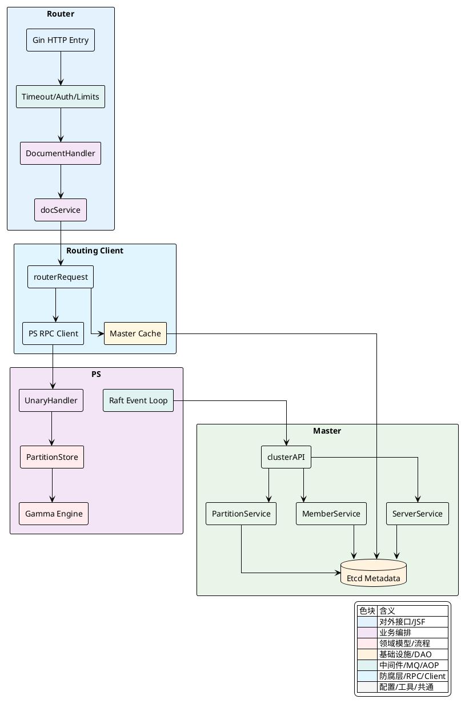
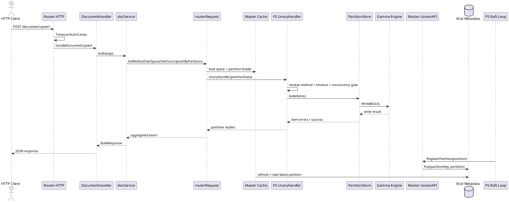
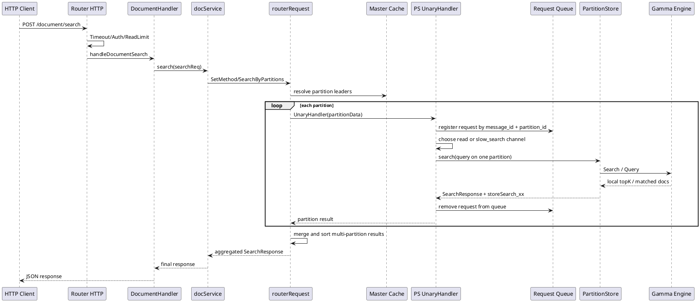
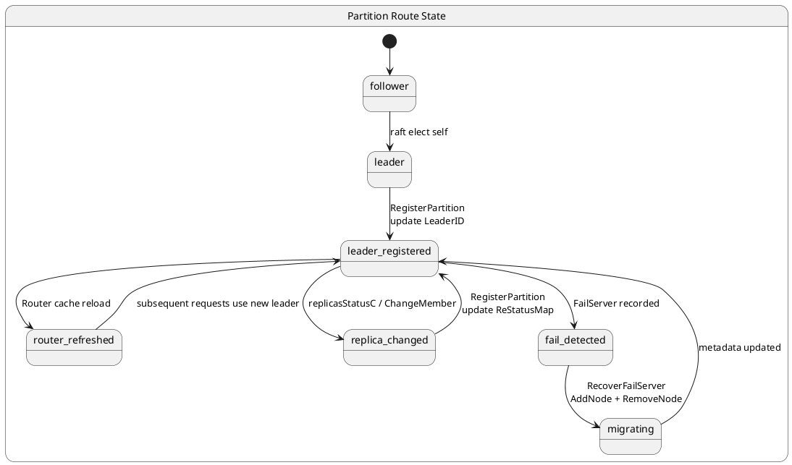

## 数据流与状态流转图谱

Vearch 的跨模块链路有一条非常明确的边界：`Router` 负责承接 HTTP 请求、做请求级校验和分发；`Client` 负责把逻辑请求拆成按分区路由的 RPC 调用；`PS` 负责把每个分区上的请求落到本地 `PartitionStore` 和底层向量引擎；`Master` 则维护分区元数据、Leader 信息与副本成员变化。动态行为的关键，不在单一模块内部，而在这些模块如何围绕“分区”协作。

从代码实现看，请求生命周期和状态生命周期是同一套元数据在不同阶段的两种表现。前者关心一条读写请求如何从 HTTP 进入并被拆分、并发执行、聚合返回；后者关心分区的 `LeaderID`、副本集合和故障节点信息如何被 PS 上报到 Master，再被 Router 的缓存读取，从而影响下一条请求到底打到哪台节点。



### 写入路径数据流

写入入口由 `DocumentHandler` 暴露在 `/document/upsert`。HTTP 请求进入后，先经过 `TimeoutMiddleware`、可选的 `BasicAuthMiddleware`，以及文档路由组上的 `HttpLimitMiddleware`。这一段并不处理业务数据本身，而是把请求约束固定下来：超时边界被写入 `Context`，认证结果被校验，写请求会被 `WriteLimiter` 和内存阈值拦截。这样后续的写入编排始终在一个已经限定好的执行窗口内进行。

在控制流上，写入请求真正进入业务分发，是在 `handleDocumentUpsert` 调用 `docService.bulk` 之后。`docService` 不是直接向某一台 PS 发请求，而是构造一个 `routerRequest`，把这次 HTTP 写入变成“按分区拆分的批量投递”。这一层的核心动作包括四件事：绑定消息 ID、标记方法类型为 `client.BatchHandler`、加载空间定义、校验并补齐文档 `_id` 字段，然后依据分区规则或哈希规则把文档分桶到 `sendMap`。这意味着 Router 不保存写入状态，它只负责把一批文档映射到多个分区任务。

`routerRequest` 的分区拆分逻辑直接依赖空间元数据。若空间定义了 `PartitionRule`，则优先从文档指定字段计算目标分区；否则退回到基于 `PKey` 的哈希分片。每个分区最终形成一个 `vearchpb.PartitionData`，其中包含 `PartitionID`、统一的 `MessageID` 和该分区需要处理的 `Items`。这里的数据形态已经从 HTTP JSON 变成了分区级 RPC 包。

下面这段代码集中体现了写入路径在 Router 侧的“构造—校验—分片”机制：

[internal/router/document/doc_service.go:104-114]()
```go
func (docService *docService) bulk(ctx context.Context, args *vearchpb.BulkRequest) *vearchpb.BulkResponse {
	reply := &vearchpb.BulkResponse{Head: newOkHead()}
	request := client.NewRouterRequest(ctx, docService.client)
	request.SetMsgID(args.Head.Params["request_id"]).SetMethod(client.BatchHandler).SetHead(args.Head).SetSpace().SetDocs(args.Docs).SetDocsField().UpsertByPartitions(args.Partitions)
	if request.Err != nil {
		log.Errorf("bulk args:[%v] error: [%s]", args, request.Err)
		return &vearchpb.BulkResponse{Head: setErrHead(request.Err)}
	}
	reply.Items = request.Execute()
	reply.Head.Params = request.GetMD()
	return reply
}
```

[internal/client/client.go:276-327]()
```go
func (r *routerRequest) UpsertByPartitions(partitions []uint32) *routerRequest {
	if r.Err != nil {
		return r
	}
	partitionID := uint32(0)
	dataMap := make(map[entity.PartitionID]*vearchpb.PartitionData)
	if r.space.PartitionRule != nil {
		// ...
	} else {
		for _, doc := range r.docs {
			if len(partitions) == 0 {
				partitionID = r.space.PartitionId(murmur3.Sum32WithSeed([]byte(doc.PKey), 0))
			} else {
				hash_index := murmur3.Sum32WithSeed([]byte(doc.PKey), 0) % uint32(len(partitions))
				partitionID = partitions[hash_index]
			}
            // ...
		}
	}
	r.sendMap = dataMap
	return r
}
```

分区任务生成后，请求进入并发 RPC 阶段。`routerRequest` 会根据 Master 缓存查询每个分区当前的 `LeaderID`，然后通过 `PS` 客户端把 `PartitionData` 发到对应节点的 `UnaryHandler`。这里的关键不是简单的 RPC 转发，而是 Router 通过缓存持有“当前该打给谁”的视图；这个视图来自 Master 持久化的分区元数据，因此后续 Leader 变化会自然影响到新请求的投递方向。

到达 PS 后，`UnaryHandler.Execute` 先从请求元数据中取出 `client.HandlerType`，再结合 `Context` 的截止时间计算分区级超时。写请求随后进入 `execute`，被路由到 `bulk`。PS 端先基于并发通道做写入限流，再从本地 `partitions` 映射中拿到目标 `PartitionStore`。如果分区不存在，错误在这一层直接终止，不会进入引擎。

写入真正落盘前，会发生一次文档序列化：每条文档先被转换成 `gamma.Doc` 并序列化为字节数组，随后封装成 `vearchpb.DocCmd{Type: BULK}` 交给 `store.Write`。这一点说明 PS 不是把 Router 传来的结构直接交给引擎，而是先转成引擎可消费的批命令格式。返回时，PS 再把每个 `Item` 的错误码逐条填充到响应里，Router 只负责聚合，不重新解释每条写入的底层结果。

[internal/ps/handler_document.go:254-289]()
```go
switch method {
case client.BatchHandler:
	bulk(ctx, store, req.Items)
case client.SearchHandler:
	if req.SearchResponse == nil {
		req.SearchResponse = &vearchpb.SearchResponse{}
	}
	search(ctx, store, req.SearchRequest, req.SearchResponse)
case client.QueryHandler:
	if req.SearchResponse == nil {
		req.SearchResponse = &vearchpb.SearchResponse{}
	}
	query(ctx, store, req.QueryRequest, req.SearchResponse)
default:
	log.Error("method not found, method: [%s]", method)
	req.Err = vearchpb.NewError(vearchpb.ErrorEnum_METHOD_NOT_IMPLEMENT, nil).GetError()
	return
}
```

[internal/ps/handler_document.go:344-373]()
```go
func bulk(ctx context.Context, store PartitionStore, items []*vearchpb.Item) {
	var err error
	var vErr *vearchpb.VearchErr
	estimatedSize := estimatedDocSize(items[0])
	if entity.CheckVirtualMemExceed(estimatedSize*len(items) + 24*len(items)) {
		err = fmt.Errorf("canceled by memory circuit breaker")
		vErr = vearchpb.NewError(vearchpb.ErrorEnum_INTERNAL_ERROR, nil)
	} else {
		wg := sync.WaitGroup{}
		docBytes := make([][]byte, len(items))
		for i, item := range items {
			wg.Add(1)
			go func(item *vearchpb.Item, n int) {
				defer wg.Done()
				docGamma := &gamma.Doc{Fields: item.Doc.Fields}
				docBytes[n] = docGamma.Serialize()
				item.Doc.Fields = nil
				item.Err = vearchpb.NewError(vearchpb.ErrorEnum_SUCCESS, nil).GetError()
			}(item, i)
		}
		wg.Wait()
		docCmd := &vearchpb.DocCmd{Type: vearchpb.OpType_BULK, Docs: docBytes}
		err = store.Write(ctx, docCmd)
		vErr = vearchpb.NewError(vearchpb.ErrorEnum_INTERNAL_ERROR, err)
	}
    // ...
}
```

写入路径里的状态流转，主要围绕分区 Leader 和副本状态。PS 启动时会建立 `changeLeaderC` 与 `replicasStatusC` 两条事件通道。Raft 角色变化或副本状态变化发生后，事件被送入这两个通道，再由后台循环统一处理。只要本节点确认自己仍然是该分区 Leader，就会把更新后的分区对象通过 `RegisterPartition` 上报给 Master；Master 则把分区对象写入 Etcd。Router 再通过 `Master().Cache()` 读取这些元数据，在下一轮写请求中把同一分区投递到新的 Leader。

这个状态链路没有独立于请求之外的“路由推送”，而是“PS 上报元数据，Router 按缓存读取元数据”。因此写路径中一次 Leader 切换的可观察结果，就是后续写入命中的 `LeaderID` 发生变化。



在故障恢复链路里，Master 负责把“状态收敛”变成一系列具体的成员变更。`FailServer` 记录故障节点集合；`RecoverFailServer` 会找到失效节点和新节点，然后按分区循环执行两步：先 `ConfAddNode` 把新节点加为副本，再 `ConfRemoveNode` 把故障节点移出副本。每一步最终都落到 `MemberService.ChangeMember`，由它找到分区当前 Leader，向对应 PS 发起管理 RPC，并在成功后更新空间元数据。这样一来，副本迁移不是抽象的“恢复”，而是一个个分区成员关系与空间副本信息的逐步重写。

[internal/ps/server.go:204-223]()
```go
func (s *Server) startChangeLeaderC() {
	go func() {
		for {
			select {
			case <-s.ctx.Done():
				return
			case entry := <-s.changeLeaderC:
				s.registerMaster(entry.leader, entry.pid)
			case pStatus := <-s.replicasStatusC:
				s.changeReplicas(pStatus)
			}
		}
	}()
}
```

[internal/ps/server.go:310-364]()
```go
func (s *Server) registerMaster(leader entity.NodeID, pid entity.PartitionID) {
	if leader != s.nodeID {
		return
	}
	store, ok := s.partitions.Load(pid)
	if !ok {
		return
	}
	if !s.raftServer.IsLeader(uint64(pid)) {
		return
	}
	partition := store.(PartitionStore).GetPartition()
	partition.LeaderID = s.nodeID
	if err := s.client.Master().RegisterPartition(context.Background(), partition); err != nil {
		log.Error("register partition error: [%s]", err.Error())
	}
}

func (s *Server) changeReplicas(pStatus *raftstore.ReplicasStatusEntry) {
	store, ok := s.partitions.Load(pStatus.PartitionID)
	if !ok {
		return
	}
	partition := store.(PartitionStore).GetPartition()
	if partition.ReStatusMap == nil {
		partition.ReStatusMap = make(map[uint64]uint32)
	}
	pStatus.ReStatusMap.Range(func(key, value any) bool {
		partition.ReStatusMap[key.(uint64)] = value.(uint32)
		return true
	})
	if err := s.client.Master().RegisterPartition(context.Background(), partition); err != nil {
		log.Error("register partition error: [%s]", err.Error())
	}
}
```

[internal/master/services/server_service.go:95-133]()
```go
func (s *ServerService) RecoverFailServer(ctx context.Context, spaceService *SpaceService, memberService *MemberService, rs *entity.RecoverFailServer) (e error) {
	targetFailServer := mc.QueryServerByIPAddr(ctx, rs.FailNodeAddr)
	newServer := mc.QueryServerByIPAddr(ctx, rs.NewNodeAddr)
	if newServer.ID <= 0 || targetFailServer.ID <= 0 {
		return vearchpb.NewError(vearchpb.ErrorEnum_PARTITION_SERVER_ERROR, fmt.Errorf("newServer or targetFailServer is nil"))
	}

	for _, pid := range targetFailServer.Node.PartitionIds {
		cm := &entity.ChangeMember{}
		cm.Method = proto.ConfAddNode
		cm.NodeID = newServer.ID
		cm.PartitionID = pid
		if e = memberService.ChangeMember(ctx, spaceService, cm); e != nil {
			return e
		}
		cm.Method = proto.ConfRemoveNode
		cm.NodeID = targetFailServer.ID
		cm.PartitionID = pid
		if e = memberService.ChangeMember(ctx, spaceService, cm); e != nil {
			return e
		}
	}
	mc.TryRemoveFailServer(ctx, targetFailServer.Node)
	return nil
}
```

<details>
<summary>关联代码</summary>

[internal/router/document/doc_http.go:167-317](),[internal/router/document/doc_http.go:460-505](),[internal/router/document/doc_service.go:104-114](),[internal/client/client.go:110-327](),[internal/ps/handler_document.go:96-289](),[internal/ps/handler_document.go:344-403](),[internal/ps/server.go:204-364](),[internal/master/cluster_api.go:268-271](),[internal/master/services/partition_service.go:159-167](),[internal/master/services/member_service.go:102-197](),[internal/master/services/server_service.go:95-133](),[internal/client/master.go:582-625]()

</details>

### 检索路径数据流

检索路径的入口分成 `/document/query` 与 `/document/search` 两类。两者都走同一套 Router 前置链路：HTTP 超时、认证与读请求限流。但进入 `docService` 之后，执行模型与写入不同。写入是“每个分区执行后返回逐条结果”，检索则是“每个分区产出局部结果，Router 再做聚合排序”。因此检索路径的关键职责不在单个 PS 的查询能力，而在 Router 如何构造分区级检索、如何承接多分区局部结果、以及如何把这些结果归并为一个逻辑上的统一响应。

`handleDocumentQuery` 与 `handleDocumentSearch` 都会先拿到空间定义。这个动作不仅用于校验 `db`、`space` 是否存在，也决定了检索会触达哪些分区。随后 `docService.query` 或 `docService.search` 构造 `routerRequest`，分别调用 `QueryByPartitions` 和 `SearchByPartitions`。这一步把原始查询请求挂到多个 `PartitionData` 上，但与写入不同，检索不会把 `Document` 拆成多个写包，而是把一份查询条件复制到每个目标分区任务中。

`docService.search` 还会根据 `SortFields` 构造排序器，再调用 `SearchFieldSortExecute`。这说明跨分区检索的最终排序不完全依赖 PS。PS 负责给出分区内候选结果与统计信息，Router 则决定如何在多分区结果之间做二次排序和聚合。`query` 路径同样走 `QueryFieldSortExecute`，只是目标是按字段过滤或查询文档，而不是向量搜索。

[internal/router/document/doc_service.go:150-199]()
```go
func (docService *docService) query(ctx context.Context, args *vearchpb.QueryRequest) *vearchpb.SearchResponse {
	request := client.NewRouterRequest(ctx, docService.client)
	request.SetMsgID(args.Head.Params["request_id"]).SetMethod(client.QueryHandler).SetHead(args.Head).SetSpace().QueryByPartitions(args)
	if request.Err != nil {
		return &vearchpb.SearchResponse{Head: setErrHead(request.Err)}
	}

	searchResponse := request.QueryFieldSortExecute()
    // ...
	return searchResponse
}

func (docService *docService) search(ctx context.Context, searchReq *vearchpb.SearchRequest) *vearchpb.SearchResponse {
	request := client.NewRouterRequest(ctx, docService.client)
	request.SetMsgID(searchReq.Head.Params["request_id"]).SetMethod(client.SearchHandler).SetHead(searchReq.Head).SetSpace().SearchByPartitions(searchReq)
	if request.Err != nil {
		return &vearchpb.SearchResponse{Head: setErrHead(request.Err)}
	}

	sortOrder := make([]sortorder.Sort, 0)
	if len(searchReq.SortFields) > 0 {
		for _, sortF := range searchReq.SortFields {
			sortOrder = append(sortOrder, &sortorder.SortField{Field: sortF.Field, Desc: sortF.Type})
		}
	}
	desc := sortOrder[0].GetSortOrder()
	searchResponse := request.SearchFieldSortExecute(desc)
    // ...
	return searchResponse
}
```

与写入一样，Router 仍然依赖 Master 缓存来解析每个分区当前的 `LeaderID`，并把检索 RPC 打给 Leader 所在的 PS。PS 端 `UnaryHandler.Execute` 在取出方法名后，会把 `SearchHandler` 与 `QueryHandler` 类型的请求放入 `request.Rqueue`，并绑定取消函数。这使得慢查询治理与请求超时不再只是 Router 侧的事，而是落到每个分区请求实例上。检索请求如果超时，PS 可以在本地识别并提前退出；如果执行完成，则把 `SearchResponse` 填回 `PartitionData`。

进入 `execute` 后，`SearchHandler` 和 `QueryHandler` 都会把并发令牌从读请求通道中获取。针对慢搜索，请求还可能进入 `slow_search_concurrent` 单独隔离。这样一来，检索路径上的状态不仅包括业务结果，还包括运行时执行状态：普通读、慢检索、排队中的可取消请求，它们都在 PS 的局部生命周期中被显式建模。

真正的数据访问发生在 `store.Query` 或 `store.Search`。PS 在返回前会把分区级耗时写入响应头参数，例如 `storeQuery_<partitionID>` 或 `storeSearch_<partitionID>`。这些参数是检索链路的重要诊断点，因为聚合后的响应仍然携带各分区局部执行时间，便于定位到底是哪一个分区拖慢了整体请求。

[internal/ps/handler_document.go:144-160]()
```go
requestStatus := &request.RequestStatus{Req: req, Status: request.Running_1, CancelFunc: cancel}
requestId := request.RequestId{MessageId: req.MessageID, PartitionId: req.PartitionID}
if method == client.SearchHandler || method == client.QueryHandler {
	request.Rqueue.Mutex.Lock()
	elem := request.Rqueue.ReqList.PushBack(requestStatus)
	request.Rqueue.ReqMap[requestId] = elem
	request.Rqueue.Mutex.Unlock()
}
defer func() {
	if method == client.SearchHandler || method == client.QueryHandler {
		request.Rqueue.Mutex.Lock()
		if elem := request.Rqueue.ReqMap[requestId]; elem != nil {
			delete(request.Rqueue.ReqMap, requestId)
			request.Rqueue.ReqList.Remove(elem)
		}
		request.Rqueue.Mutex.Unlock()
	}
}()
```

[internal/ps/handler_document.go:215-244]()
```go
var concurrentCh chan bool
if req.SearchRequest != nil && req.SearchRequest.IsSlowSearch {
	concurrentCh = handler.server.slow_search_concurrent
} else if method == client.QueryHandler || method == client.SearchHandler ||
	method == client.GetDocsHandler || method == client.GetDocsByPartitionHandler ||
	method == client.GetNextDocsByPartitionHandler {
	concurrentCh = handler.server.read_request_concurrent
} else {
	concurrentCh = handler.server.write_request_concurrent
}

select {
case concurrentCh <- true:
	defer func() { <-concurrentCh }()
case <-ctx.Done():
	if ctx.Err() == context.DeadlineExceeded {
		req.Err = vearchpb.NewError(vearchpb.ErrorEnum_TIMEOUT, nil).GetError()
		return
	} else {
		req.Err = vearchpb.NewError(vearchpb.ErrorEnum_PARTITION_SERVER_MEMORYEXCEED, nil).GetError()
		return
	}
}
```

[internal/ps/handler_document.go:405-465]()
```go
func query(ctx context.Context, store PartitionStore, request *vearchpb.QueryRequest, response *vearchpb.SearchResponse) {
	if response.Head == nil {
		response.Head = &vearchpb.ResponseHead{
			Params: make(map[string]string),
		}
	}
	if err := store.Query(ctx, request, response); err != nil {
		response.Head.Err = vearchpb.NewError(vearchpb.ErrorEnum_INTERNAL_ERROR, err).GetError()
	}
	partitionIDstr := strconv.FormatUint(uint64(store.GetEngine().GetPartitionID()), 10)
	storeQuery := (time.Since(startTime).Seconds()) * 1000
	response.Head.Params["storeQuery_"+partitionIDstr] = strconv.FormatFloat(storeQuery, 'f', 4, 64)
}

func search(ctx context.Context, store PartitionStore, request *vearchpb.SearchRequest, response *vearchpb.SearchResponse) {
	if response.Head == nil {
		response.Head = &vearchpb.ResponseHead{
			Params: make(map[string]string),
		}
	}
	if err := store.Search(ctx, request, response); err != nil {
		response.Head.Err = vearchpb.NewError(vearchpb.ErrorEnum_INTERNAL_ERROR, err).GetError()
		return
	}
	partitionIDstr := strconv.FormatUint(uint64(store.GetEngine().GetPartitionID()), 10)
	storeSearch := (time.Since(startTime).Seconds()) * 1000
	response.Head.Params["storeSearch_"+partitionIDstr] = strconv.FormatFloat(storeSearch, 'f', 4, 64)
}
```

检索路径和状态流转的联系，体现在“路由总是跟着最新 Leader 走”。PS 侧一旦发生选主，`HandleRaftLeaderEvent` 会把变更送入 `changeLeaderC`，再通过 `registerMaster` 把新的 `LeaderID` 写回 Master。只要 Router 的缓存下一次取到的是更新后的分区对象，同一个查询就会自动指向新的 Leader，而不需要检索逻辑本身感知选主过程。这也是排查“检索偶发命中旧节点”时最重要的观察点：问题不在 `search` 本身，而在 `RegisterPartition -> Master 元数据 -> Router Cache` 这条刷新链是否已收敛。

故障恢复对检索的影响也遵循同一规则。Master 收集 `FailServer` 后，调用 `RecoverFailServer` 或单个 `ChangeMember`，最终修改的是分区副本集合和分区元数据。当新副本加入并在 Raft 层完成收敛后，Leader 和副本状态再次上报到 Master。检索链路依赖的是当下 Master 里的分区视图，因此恢复完成后，新请求会直接绕开失效节点。

下表把检索路径上的关键状态对象和作用位置对应起来：

| 状态对象 | 所在模块 | 作用 |
|---|---|---|
| `RequestHead.TimeOutMs` | `Router/docService` | 约束整个检索 RPC 生命周期 |
| `MessageID` | `routerRequest` | 关联跨分区请求与 PS 本地请求队列 |
| `PartitionData.SearchRequest` / `QueryRequest` | `routerRequest -> PS` | 分区级检索载体 |
| `request.Rqueue` | `PS` | 维护可取消、可清理的检索请求实例 |
| `LeaderID` | `Master/Partition` 元数据 | 决定 Router 把检索打到哪台 PS |
| `ReStatusMap` | `Partition` 元数据 | 反映副本状态，辅助观察收敛情况 |
| `storeSearch_*` / `storeQuery_*` | `PS ResponseHead.Params` | 暴露分区级耗时，便于定位慢分区 |



检索路径里的分区状态流转可以单独看成一条元数据状态机。分区的本地状态先因 Raft 选主或副本变化而改变，再经 `RegisterPartition` 上报到 Master，最后变成 Router 可见的路由视图。故障恢复时，状态机会多出成员变更与故障节点移除两个阶段，但终点仍然是新的分区元数据生效。



<details>
<summary>关联代码</summary>

[internal/router/document/doc_http.go:514-713](),[internal/router/document/doc_service.go:150-199](),[internal/client/client.go:111-126](),[internal/ps/handler_document.go:96-187](),[internal/ps/handler_document.go:189-290](),[internal/ps/handler_document.go:405-465](),[internal/ps/server.go:277-364](),[internal/master/cluster_api.go:1764-1960](),[internal/master/services/member_service.go:102-313](),[internal/master/services/server_service.go:95-133](),[internal/client/master.go:724-787]()

</details>