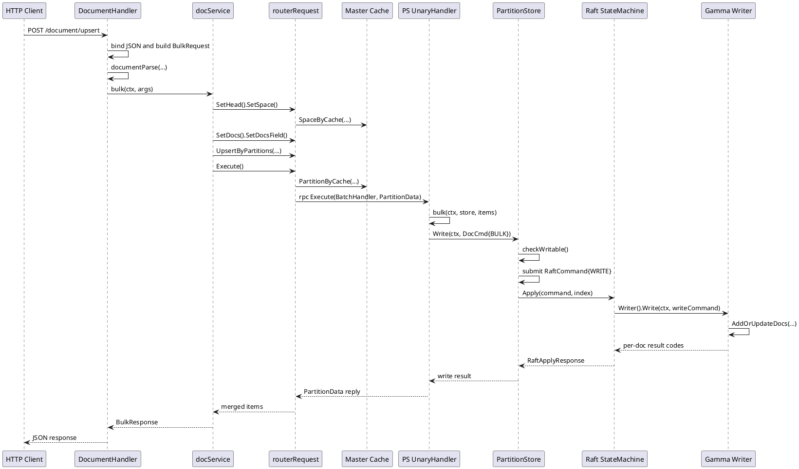
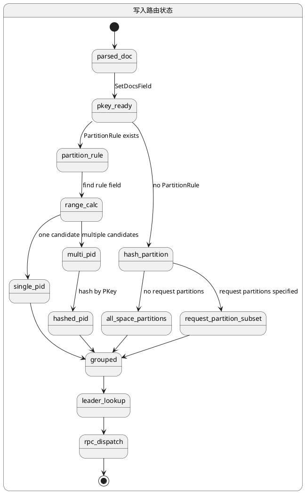
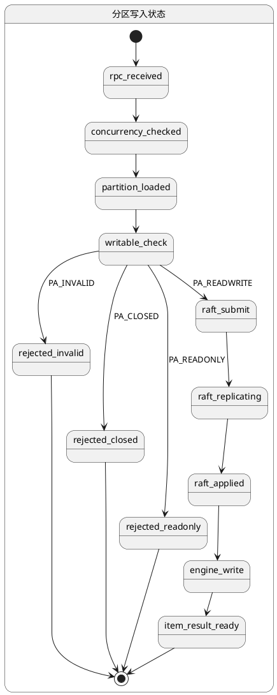

## 写入路径数据流

写入链路从路由层接收一批 JSON 文档开始，终点不是简单的“返回成功”，而是把文档分发到对应分区、经由分区主副本一致性提交，再交给底层向量引擎写入内存索引与持久化状态。这个过程横跨 `router`、`client`、`ps`、`raftstore` 与 `gamma` 引擎封装层，链路上的每一段都承担了不同的约束：请求格式约束、空间字段约束、主键规整、分区归属、Leader 写入、Raft 状态机应用，以及引擎级批处理落地。

### 端到端写入链路总览

HTTP 入口由 `handleDocumentUpsert` 接收请求体，先把上层 JSON 绑定为 `request.DocumentRequest`，再结合空间元数据调用 `documentParse` 生成内部 `vearchpb.BulkRequest`。此时文档已经从原始 JSON 转换成强类型字段数组 `[]*vearchpb.Field`，但仍未决定属于哪个分区。

`docService.bulk` 随后创建 `routerRequest`，串联 `SetSpace`、`SetDocs`、`SetDocsField`、`UpsertByPartitions`。这一步把逻辑文档转换成按分区聚合的 `PartitionData`，每个分区形成一个单独的批次。`Execute` 会并发找到各分区的 Leader 节点，并通过内部 RPC 把批次发送给对应 PS 节点。

PS 节点收到 `BatchHandler` 请求后进入 `bulk`，先将 `Document.Fields` 序列化成 `gamma.Doc` 字节块，再组装为 `vearchpb.DocCmd{Type: BULK}`。真正的状态提交发生在 `store.Write`：它把写请求封装成 `RaftCommand{Type: WRITE}` 并提交给当前分区的 Raft 实例。只有当状态机 `Apply` 到这条日志时，才会调用引擎 `Writer().Write`，最终进入 `gamma.AddOrUpdateDocs`。



<details>
<summary>关联代码</summary>

[internal/router/document/doc_http.go:460-512](),[internal/router/document/doc_service.go:104-115](),[internal/client/client.go:277-342](),[internal/client/client.go:374-480](),[internal/ps/handler_document.go:344-403](),[internal/ps/storage/raftstore/store_writer.go:77-127](),[internal/ps/storage/raftstore/raft_state_machine.go:91-144](),[internal/ps/engine/gammacb/writer.go:42-82]()

</details>

### JSON 解析与字段校验

写入入口的核心职责不是直接转发请求，而是把不可靠的外部 JSON 转换成空间定义约束下的内部字段模型。`handleDocumentUpsert` 先通过 `c.ShouldBindJSON` 读取 `db_name`、`space_name`、`documents` 等输入，再根据 `RequestHead` 定位空间，随后将原始文档交给 `documentParse`。这个阶段已经依赖空间元数据，因此字段校验并不是通用 JSON 校验，而是“以 Space schema 为准”的解析。

`documentParse` 会先提取 `space.SpaceProperties`。如果缓存对象里尚未展开属性定义，则从 `space.Fields` 反序列化。之后它会统计空间中定义的向量字段数 `vectorFieldNum`，这个数字在后面用于校验单文档是否包含完整向量输入。对于显式指定分区的请求，它还会检查每个分区 id 是否真的属于当前空间，避免把文档投递到非法分区。

每条文档先经 `vjson.ByteToJsonMap` 抽取 `_id`，再调用 `MapDocument`。`MapDocument` 使用 `fastjson` 解析对象并遍历字段。这个阶段会做几类强约束：字段必须在 `SpaceProperties` 中存在，内部保留字段不能被用户复用，`null` 值会被拒绝，字符串长度受索引与非索引场景限制，日期会转为纳秒时间戳，数值字段会按目标类型编码，向量字段则要求维度严格匹配，且浮点值不能是 `NaN` 或 `Inf`。

向量字段计数的处理有一个很关键的行为：`haveVector != vectorFieldNum` 时，如果文档又没有主键，则直接报错；如果文档有主键，则允许继续进入后续链路。这意味着写入路径支持“带主键的部分更新”，但不允许对没有主键的残缺向量文档进行模糊写入，因为后续无法明确更新目标。

[internal/router/document/doc_parse.go:540-609]()
```go
func documentParse(ctx context.Context, handler *DocumentHandler, r *http.Request, docRequest *request.DocumentRequest, space *entity.Space, args *vearchpb.BulkRequest) error {
	spaceProperties := space.SpaceProperties
	if spaceProperties == nil {
		spaceProperties, _ = entity.UnmarshalPropertyJSON(space.Fields)
	}

	vectorFieldNum := 0
	for _, value := range spaceProperties {
		if value.FieldType == vearchpb.FieldType_VECTOR {
			vectorFieldNum++
		}
	}

	if docRequest.Partitions != nil && len(*docRequest.Partitions) != 0 {
		for _, pid := range *docRequest.Partitions {
			found := false
			for _, partition := range space.Partitions {
				if pid == partition.Id {
					found = true
					break
				}
			}
			if !found {
				return vearchpb.NewError(vearchpb.ErrorEnum_PARAM_ERROR, fmt.Errorf("partition id %d not belong to space[%s]", pid, space.Name))
			}
		}
		args.Partitions = *docRequest.Partitions
	}

	docs := make([]*vearchpb.Document, 0, len(docRequest.Documents))
	for i, docJson := range docRequest.Documents {
		jsonMap, err := vjson.ByteToJsonMap(docJson)
		if err != nil {
			return err
		}
		primaryKey := jsonMap.GetJsonValString(IDField)

		fields, haveVector, err := MapDocument(docJson, space, spaceProperties)
		if err != nil {
			return err
		}

		if haveVector != vectorFieldNum {
			if primaryKey == "" {
				return vearchpb.NewError(vearchpb.ErrorEnum_PARAM_ERROR, fmt.Errorf("vector field num:%d is not equal to vector num of space fields:%d and document_id is empty", haveVector, vectorFieldNum))
			}
		}

		docs = append(docs, &vearchpb.Document{PKey: primaryKey, Fields: fields})
	}

	args.Docs = docs
	return nil
}
```

字段映射函数 `MapDocument` 与 `processProperty` 则承担了真正的类型编排。它把 JSON 层的数据变成 `vearchpb.Field`，其中 `Name`、`Type`、`Value`、`Option` 都已具备后续引擎写入所需信息。这个阶段完成后，文档已经不再依赖原始 JSON 结构，而是成为空间字段模型的紧凑二进制表示。

[internal/router/document/doc_parse.go:67-127]()
```go
func parseJSON(path []string, v *fastjson.Value, space *entity.Space, proMap map[string]*entity.SpaceProperties) ([]*vearchpb.Field, int, error) {
	fields := make([]*vearchpb.Field, 0)
	obj, err := v.Object()
	if err != nil {
		return nil, 0, vearchpb.NewError(vearchpb.ErrorEnum_PARAM_ERROR, fmt.Errorf("data format error, object is required but received %s", v.Type().String()))
	}

	haveNoField := false
	errorField := ""
	haveVector := 0
	parseErr := fmt.Errorf("")

	obj.Visit(func(key []byte, val *fastjson.Value) {
		fieldName := string(key)
		if fieldName == IDField {
			return
		}
		pro, ok := proMap[fieldName]
		if !ok {
			haveNoField = true
			errorField = fieldName
			return
		}
		field, err := processProperty(docV, val, space.GetFieldIndexType(fieldName), pro)
		if err != nil {
			parseErr = err
			return
		}
		if field != nil && field.Type == vearchpb.FieldType_VECTOR && field.Value != nil {
			haveVector += 1
		}
		fields = append(fields, field)
	})

	if parseErr.Error() != "" {
		return nil, haveVector, vearchpb.NewError(vearchpb.ErrorEnum_PARAM_ERROR, fmt.Errorf("%s", parseErr.Error()))
	}
	if haveNoField {
		return nil, haveVector, vearchpb.NewError(vearchpb.ErrorEnum_PARAM_ERROR, fmt.Errorf("unrecognizable field, %s is not found in space[%s] fields", errorField, space.Name))
	}
	return fields, haveVector, nil
}
```

| 校验环节 | 触发位置 | 校验内容 | 结果形态 |
|---|---|---|---|
| 请求体绑定 | `handleDocumentUpsert` | HTTP JSON 是否符合 `DocumentRequest` 结构 | 失败直接返回 HTTP 错误 |
| 空间加载 | `docService.getSpace` | `db` / `space` 或别名是否存在 | 得到 `entity.Space` |
| 分区合法性 | `documentParse` | 显式传入的分区是否属于该空间 | 设置 `args.Partitions` |
| 字段识别 | `MapDocument` | 字段是否存在于 `SpaceProperties` | 未定义字段报错 |
| 类型转换 | `processString` / `processNumber` / `processVector` | 值能否编码为 schema 定义类型 | 生成 `vearchpb.Field` |
| 向量完整性 | `documentParse` | 向量字段数量是否满足空间定义 | 无主键时缺失向量直接报错 |
| 内存保护 | `documentParse` | 按首文档估算整批内存占用 | 超限中止 |

<details>
<summary>关联代码</summary>

[internal/router/document/doc_http.go:472-505](),[internal/router/document/doc_parse.go:56-65](),[internal/router/document/doc_parse.go:67-127](),[internal/router/document/doc_parse.go:276-309](),[internal/router/document/doc_parse.go:327-397](),[internal/router/document/doc_parse.go:400-514](),[internal/router/document/doc_parse.go:540-609]()

</details>

### 主键补充与文档内部表示

路由层解析出的 `vearchpb.Document` 还只是“有可选主键的字段集合”。真正进入分区路由前，`docService.bulk` 会调用 `SetDocsField`，在这里完成主键标准化与 `_id` 字段补充。这个动作很重要，因为后续分区哈希、错误归并以及引擎删除/更新语义都依赖稳定的 `PKey`。

`SetDocsField` 对每个文档执行 `generateUUID(doc.PKey)`。这里的行为不是“有就保留、无就补默认值”那么简单，而是统一把外部主键规整成内部可用字符串，再写回 `doc.PKey`。之后额外构造一个名为 `entity.IdField` 的 `Field`，其 `Type` 固定为 `STRING`，其 `Value` 就是规整后的 `PKey` 字节。于是 `_id` 同时存在于文档主键槽位与字段列表中：前者服务于路由和内部索引定位，后者服务于引擎文档内容表达。

这一步还隐含着一个边界：`SetDocs` 在 `SetDocsField` 之前执行，会先检查文档的所有字段都属于空间定义；由于用户提交的原始 `_id` 在 `MapDocument` 阶段被跳过，没有进入 `Fields`，因此不会触发“用户字段里携带内部字段”的冲突。内部 `_id` 是在 schema 校验完成后由系统补入的。

[internal/router/document/doc_service.go:104-113]()
```go
func (docService *docService) bulk(ctx context.Context, args *vearchpb.BulkRequest) *vearchpb.BulkResponse {
	reply := &vearchpb.BulkResponse{Head: newOkHead()}
	request := client.NewRouterRequest(ctx, docService.client)
	request.SetMsgID(args.Head.Params["request_id"]).
		SetMethod(client.BatchHandler).
		SetHead(args.Head).
		SetSpace().
		SetDocs(args.Docs).
		SetDocsField().
		UpsertByPartitions(args.Partitions)
	if request.Err != nil {
		return &vearchpb.BulkResponse{Head: setErrHead(request.Err)}
	}
	reply.Items = request.Execute()
	reply.Head.Params = request.GetMD()
	return reply
}
```

[internal/client/client.go:171-210]()
```go
func (r *routerRequest) SetDocs(docs []*vearchpb.Document) *routerRequest {
	if r.Err != nil {
		return r
	}
	r.docs = docs
	for _, doc := range r.docs {
		if doc == nil {
			r.Err = vearchpb.NewError(vearchpb.ErrorEnum_PARAM_ERROR, errors.New("the doc is nil"))
			return r
		}
		for _, field := range doc.Fields {
			if _, ok := r.space.SpaceProperties[field.Name]; !ok {
				r.Err = vearchpb.NewError(vearchpb.ErrorEnum_PARAM_ERROR, fmt.Errorf("the field[%s] in doc not needed in space", field.Name))
				return r
			}
		}
	}
	return r
}

func (r *routerRequest) SetDocsField() *routerRequest {
	if r.Err != nil {
		return r
	}
	for _, doc := range r.docs {
		key, err := generateUUID(doc.PKey)
		if err != nil {
			r.Err = err
			return r
		}
		doc.PKey = key
		field := &vearchpb.Field{Name: entity.IdField}
		field.Value = []byte(doc.PKey)
		field.Type = vearchpb.FieldType_STRING
		doc.Fields = append(doc.Fields, field)
	}
	return r
}
```

文档到这里已经形成一种稳定结构：`PKey` 负责路由与文档身份，`Fields` 则包含完整业务字段与系统补充的 `_id`。后续无论走哈希分区还是范围分区，都是在这个内部表示上进行。

| 内部字段 | 生成阶段 | 作用 |
|---|---|---|
| `Document.PKey` | `documentParse` 读取，`SetDocsField` 规整 | 作为路由哈希输入与文档唯一标识 |
| `Field{Name: "_id"}` | `SetDocsField` 补充 | 作为引擎中的可读字段与删除/查询回传字段 |
| `Document.Fields` | `MapDocument` + `SetDocsField` | 承载所有 schema 字段与系统主键字段 |

<details>
<summary>关联代码</summary>

[internal/router/document/doc_service.go:104-115](),[internal/client/client.go:171-210](),[internal/router/document/doc_parse.go:570-602]()

</details>

### 分区路由与批次组装

进入 `UpsertByPartitions` 后，写入路径的核心问题从“文档是否合法”转变为“文档应该发往哪个分区”。Vearch 在这一层同时支持按空间分区规则路由，以及按主键哈希路由。两类路径都会把结果组织成 `map[PartitionID]*PartitionData`，为并发 RPC 发送做准备。

如果空间定义了 `PartitionRule`，则每条文档必须包含对应字段。路由逻辑会扫描文档字段，找到分区规则字段后调用 `space.PartitionIdsByRangeField(field.Value, field.Type)` 计算候选分区集合。若候选只有一个，就直接写入该分区；若命中一个范围对应多个物理分区，则继续用主键哈希在候选分区中做二次离散化。这个行为保证了范围规则下的数据分散仍然可重复计算。

如果空间没有显式分区规则，则进入哈希路由。未指定 `partitions` 参数时，使用 `space.PartitionId(murmur3.Sum32WithSeed([]byte(doc.PKey), 0))` 直接从空间所有分区中计算落点。若请求中传入了分区集合，则不会完全跳过哈希，而是先对 `PKey` 求哈希，再对给定分区列表长度取模，从该子集里选择一个分区。这使显式分区写入依然保留同主键稳定映射，而不是简单广播或顺序填充。

[internal/client/client.go:277-341]()
```go
func (r *routerRequest) UpsertByPartitions(partitions []uint32) *routerRequest {
	if r.Err != nil {
		return r
	}
	partitionID := uint32(0)
	dataMap := make(map[entity.PartitionID]*vearchpb.PartitionData)

	if r.space.PartitionRule != nil {
		for _, doc := range r.docs {
			found := false
			for _, field := range doc.Fields {
				if field.Name == r.space.PartitionRule.Field {
					found = true
					pids, err := r.space.PartitionIdsByRangeField(field.Value, field.Type)
					if err != nil {
						r.Err = err
						return r
					}
					if len(pids) == 1 {
						partitionID = pids[0]
					} else {
						hash_index := murmur3.Sum32WithSeed([]byte(doc.PKey), 0) % uint32(len(pids))
						partitionID = pids[hash_index]
					}
					break
				}
			}
			if !found {
				r.Err = vearchpb.NewError(vearchpb.ErrorEnum_PARAM_ERROR, fmt.Errorf("document must have partition rule field"))
				return r
			}
			item := &vearchpb.Item{Doc: doc}
			if d, ok := dataMap[partitionID]; ok {
				d.Items = append(d.Items, item)
			} else {
				d = &vearchpb.PartitionData{PartitionID: partitionID, MessageID: r.GetMsgID(), Items: []*vearchpb.Item{}}
				dataMap[partitionID] = d
				d.Items = append(d.Items, item)
			}
		}
	} else {
		for _, doc := range r.docs {
			if len(partitions) == 0 {
				partitionID = r.space.PartitionId(murmur3.Sum32WithSeed([]byte(doc.PKey), 0))
			} else {
				hash_index := murmur3.Sum32WithSeed([]byte(doc.PKey), 0) % uint32(len(partitions))
				partitionID = partitions[hash_index]
			}
			item := &vearchpb.Item{Doc: doc}
			if d, ok := dataMap[partitionID]; ok {
				d.Items = append(d.Items, item)
			} else {
				d = &vearchpb.PartitionData{PartitionID: partitionID, MessageID: r.GetMsgID(), Items: []*vearchpb.Item{}}
				dataMap[partitionID] = d
				d.Items = append(d.Items, item)
			}
		}
	}

	r.sendMap = dataMap
	return r
}
```

路由完成后，每个 `PartitionData` 都带有同一个 `MessageID`。这个 `MessageID` 来源于上层请求 id，被用于跨模块追踪同一批次。随后 `Execute` 并发处理 `sendMap` 中每个分区请求，并以分区为单位拿缓存中的 `Partition` 元数据，提取其 `LeaderID` 发起 RPC。

这里有一个很重要的动态特征：路由层不是直接面向某个固定节点写，而是先通过主键决定逻辑分区，再通过分区元数据决定当前 Leader 节点。分区归属稳定，节点归属可随 Raft 选主变化。这样写入链路把“数据键空间”和“副本领导权”解耦了。



<details>
<summary>关联代码</summary>

[internal/client/client.go:277-342](),[internal/client/client.go:374-450](),[internal/router/document/doc_service.go:104-115]()

</details>

### Router 到 PS 的批量写入执行

`routerRequest.Execute` 是写入路径里真正发起跨节点调用的地方。它遍历 `sendMap`，为每个分区启动 goroutine，并在 goroutine 内通过 `Master().Cache().PartitionByCache` 获取分区元信息。此时分区内的副本拓扑、Leader 节点信息都来自 master 缓存，因此写入路径依赖元数据缓存的及时性，但真正的可写性仍由 PS 侧再次校验。

在发送前，如果空间中存在开启归一化格式的向量字段，`Execute` 会在路由侧原地解码字段向量、执行 `number.Normalization`，再重新编码为字节。也就是说，文档写入的向量预处理发生在分区 RPC 之前，而不是在引擎层再做一次解释。这使每个分区接收到的负载已经是引擎可直接消费的二进制向量。

RPC 的目标优先是分区 Leader。若对 Leader 的 `Execute` 调用失败，则代码会遍历分区副本列表，对未标记故障的副本逐个重试。这里的“重试副本”并不意味着副本可直接接管写入成功；最终是否可写仍取决于目标节点上该分区状态是否为 `PA_READWRITE`。因此路由层的容错只是重试网络或节点可达性，而提交语义仍以后端分区状态判断为准。

[internal/client/client.go:374-480]()
```go
func (r *routerRequest) Execute() []*vearchpb.Item {
	var wg sync.WaitGroup
	respChain := make(chan *vearchpb.PartitionData, len(r.sendMap))
	for partitionID, pData := range r.sendMap {
		wg.Add(1)
		c := context.WithValue(r.ctx, share.ReqMetaDataKey, copyMap(r.md))
		go func(ctx context.Context, pid entity.PartitionID, d *vearchpb.PartitionData) {
			defer wg.Done()
			replyPartition := new(vearchpb.PartitionData)
			partition, e := r.client.Master().Cache().PartitionByCache(ctx, r.space.Name, pid)
			if e != nil {
				panic(e.Error())
			}

			nodeID := partition.LeaderID
			err := r.client.PS().GetOrCreateRPCClient(ctx, nodeID).Execute(ctx, UnaryHandler, d, replyPartition)
			if err != nil {
				for _, nodeID := range partition.Replicas {
					if nodeID == 0 {
						continue
					}
					if r.client.PS().TestFaulty(nodeID) {
						continue
					}
					replyPartition = new(vearchpb.PartitionData)
					err = r.client.PS().GetOrCreateRPCClient(ctx, nodeID).Execute(ctx, UnaryHandler, d, replyPartition)
					if err == nil {
						break
					}
				}
				if err != nil {
					d.Err = vearchpb.NewError(vearchpb.ErrorEnum_INTERNAL_ERROR, err).GetError()
					respChain <- d
				} else {
					d.Err = nil
					respChain <- replyPartition
				}
			} else {
				respChain <- replyPartition
			}
		}(c, partitionID, pData)
	}
	wg.Wait()
	close(respChain)

	// merge partition replies back to original doc order
	...
}
```

回复归并时，路由层不会简单按分区顺序拼装结果，而是先建立 `docIndexMap`，再按 `PKey` 把各分区返回的 `Item` 放回原始文档顺序。这样上层收到的响应与输入数组位置保持一致，即便内部已经经历了按分区打散和并发执行。

| 执行步骤 | 位置 | 关键对象 | 行为 |
|---|---|---|---|
| 查询分区元数据 | `Execute` | `Partition` | 获取 `LeaderID` 与副本列表 |
| 向量归一化 | `Execute` | `Field.Value` | 路由侧预处理向量字节 |
| 主 RPC 投递 | `Execute` | `PartitionData` | 发往 Leader |
| 副本级重试 | `Execute` | `partition.Replicas` | Leader 失败时尝试其它可达节点 |
| 结果回填 | `Execute` | `docIndexMap` | 按原请求顺序还原返回项 |

<details>
<summary>关联代码</summary>

[internal/client/client.go:352-372](),[internal/client/client.go:374-480](),[internal/client/client.go:482-488]()

</details>

### PS 侧批处理、Raft 提交与状态机应用

PS 节点把所有入站请求都收束到 `UnaryHandler.Execute`。方法名来自 RPC metadata 中的 `HandlerType`，写入请求会落到 `client.BatchHandler` 分支，并进一步调用本地函数 `bulk(ctx, store, req.Items)`。在进入真正写入前，PS 层会先应用并发槽控制、超时控制、分区查找与分区状态检查。这些操作保证请求即使已经被路由到某个节点，也必须满足该节点当前有能力处理这个分区。

`bulk` 不直接把 `vearchpb.Document` 逐个写给引擎，而是先并发将每个 `Item.Doc.Fields` 转换为 `gamma.Doc` 并序列化成字节数组 `docBytes`。这一步完成后，原先的字段对象会被清空，表示对引擎而言，文档已经进入更紧凑的二进制表示。随后 `bulk` 组装 `vearchpb.DocCmd{Type: BULK, Docs: docBytes}`，并调用 `store.Write`。

`store.Write` 是写入语义的分水岭。它先执行 `checkWritable`：如果当前分区状态是 `PA_INVALID`、`PA_CLOSED` 或 `PA_READONLY`，请求会分别得到无效、关闭、非 Leader 等错误；只有 `PA_READWRITE` 才允许继续写。对于批量写入，它还会在一定数量阈值上检查分区资源是否耗尽。之后写请求被包装为 `RaftCommand{Type: WRITE}`，以分区 id 为 key 提交到本地 `RaftServer`。

Raft 日志被提交并达成一致后，状态机会回调 `Apply`。`Apply` 内部解析出 `RaftCommand`，在 `innerApply` 中识别 `CmdType_WRITE`，并调用 `s.Engine.Writer().Write(s.Ctx, raftCmd.WriteCommand)`。此时才真正进入引擎写入阶段。因此从业务视角看，PS `bulk` 只是构造写命令；从一致性视角看，真正修改分区内容的是 Raft 状态机应用点。

[internal/ps/handler_document.go:246-290]()
```go
switch method {
case client.BatchHandler:
	bulk(ctx, store, req.Items)
...
}
```

[internal/ps/handler_document.go:344-403]()
```go
func bulk(ctx context.Context, store PartitionStore, items []*vearchpb.Item) {
	var err error
	var vErr *vearchpb.VearchErr
	estimatedSize := estimatedDocSize(items[0])
	if entity.CheckVirtualMemExceed(estimatedSize*len(items) + 24*len(items)) {
		err = fmt.Errorf("canceled by memory circuit breaker")
		vErr = vearchpb.NewError(vearchpb.ErrorEnum_INTERNAL_ERROR, nil)
	} else {
		wg := sync.WaitGroup{}
		docBytes := make([][]byte, len(items))
		for i, item := range items {
			wg.Add(1)
			go func(item *vearchpb.Item, n int) {
				defer wg.Done()
				docGamma := &gamma.Doc{Fields: item.Doc.Fields}
				docBytes[n] = docGamma.Serialize()
				item.Doc.Fields = nil
				item.Err = vearchpb.NewError(vearchpb.ErrorEnum_SUCCESS, nil).GetError()
			}(item, i)
		}
		wg.Wait()
		docCmd := &vearchpb.DocCmd{Type: vearchpb.OpType_BULK, Docs: docBytes}

		err = store.Write(ctx, docCmd)
		vErr = vearchpb.NewError(vearchpb.ErrorEnum_INTERNAL_ERROR, err)
	}
	...
}
```

[internal/ps/storage/raftstore/store_writer.go:77-113]()
```go
func (s *Store) Write(ctx context.Context, request *vearchpb.DocCmd) (err error) {
	if err = s.checkWritable(); err != nil {
		return err
	}

	if request.Type == vearchpb.OpType_BULK {
		if s.Partition.ResourceExhausted {
			err = vearchpb.NewError(vearchpb.ErrorEnum_PARTITION_RESOURCE_EXHAUSTED, fmt.Errorf("partition %d resource exhausted", s.Partition.Id))
			return err
		}
		...
	}

	raftCmd := &vearchpb.RaftCommand{
		Type:         vearchpb.CmdType_WRITE,
		WriteCommand: request,
	}

	data, err := json.Marshal(raftCmd)
	if err != nil {
		return err
	}

	err = s.RaftSubmit(data)
	if err != nil {
		return err
	}
	return nil
}
```

[internal/ps/storage/raftstore/raft_state_machine.go:124-143]()
```go
func (s *Store) innerApply(index uint64, raftCmd *vearchpb.RaftCommand) any {
	resp := new(RaftApplyResponse)
	switch raftCmd.Type {
	case vearchpb.CmdType_WRITE:
		resp.Err = s.Engine.Writer().Write(s.Ctx, raftCmd.WriteCommand)
	case vearchpb.CmdType_UPDATESPACE:
		resp = s.updateSchemaBySpace(raftCmd.UpdateSpace.Space)
	case vearchpb.CmdType_FLUSH:
		flushC, err := s.Engine.Writer().Commit(s.Ctx, int64(index))
		resp.FlushC = flushC
		resp.Err = err
	default:
		resp.SetErr(fmt.Errorf("unsupported command[%s]", raftCmd.Type))
	}
	s.Sn = int64(index)
	return resp
}
```

这里可以清楚看到两个状态层面同时存在。分区状态机层面，分区必须处于 `PA_READWRITE` 才允许接受写请求；日志复制层面，写请求必须转化为 `CmdType_WRITE` 并成功 `Apply` 才真正影响存储内容。前者决定“能不能发起提交”，后者决定“是否已经成为分区已提交状态”。



<details>
<summary>关联代码</summary>

[internal/ps/handler_document.go:96-187](),[internal/ps/handler_document.go:189-291](),[internal/ps/handler_document.go:344-403](),[internal/ps/storage/raftstore/store_writer.go:77-127](),[internal/ps/storage/raftstore/raft_state_machine.go:91-144]()

</details>

### 引擎写入、内存索引与持久化语义

Raft 状态机进入 `Writer().Write` 后，数据已经从“文档字段模型”转换为“引擎批处理命令”。`gammacb.writerImpl.Write` 对 `OpType_BULK` 的处理非常直接：调用 `gamma.AddOrUpdateDocs(gammaEngine, doc.Docs)`，然后把返回的逐文档状态码拼成逗号分隔字符串，并封装成一个 `ErrorEnum_SUCCESS` 的 `VearchErr` 返回。这里的返回值含义比较特殊：错误对象本身不表示 RPC 失败，而是携带每条文档的写入结果码，供上层再按 item 级别展开。

对于批量写入，`gamma` 引擎执行的是 `AddOrUpdateDocs`。从链路行为看，这一步已经把文档放入引擎维护的数据结构中，形成可查询的内存态或可增量索引态。是否已经同步到磁盘索引，并不由普通 `upsert` 立即保证。PS 层解析状态码时，如果某条文档得到状态码 `1`，会把它翻译成“stored successfully, but not yet in disk index until rebuild”。这说明普通写入完成后，文档已经进入可持有状态，但磁盘索引构建与可搜索覆盖范围仍可能滞后于内存态。

真正与持久化快照强绑定的是 `Commit` / `Flush` 路径，而不是普通 `Write`。在状态机 `CmdType_FLUSH` 分支里，会调用 `Writer().Commit`，其内部执行 `gamma.Dump`，并把当前日志序号 `sn` 写入 `indexSn` 文件，表示某个引擎快照点已经与 Raft 应用序号对齐。普通 `upsert` 因此对应“已提交日志 + 已写入引擎增量状态”，而 `flush` 则额外推进“已生成持久化索引快照”的边界。

[internal/ps/engine/gammacb/writer.go:42-69]()
```go
func (wi *writerImpl) Write(ctx context.Context, doc *vearchpb.DocCmd) (err error) {
	if doc == nil {
		return errors.New("doc is nil")
	}
	...
	switch doc.Type {
	case vearchpb.OpType_BULK:
		resp := gamma.AddOrUpdateDocs(gammaEngine, doc.Docs)
		var buffer bytes.Buffer
		for _, code := range resp {
			buffer.WriteString(strconv.Itoa(int(code)) + ",")
		}
		err := errors.New(buffer.String())
		return vearchpb.NewError(vearchpb.ErrorEnum_SUCCESS, err)
	case vearchpb.OpType_DELETE:
		...
	}
	return
}
```

[internal/ps/handler_document.go:383-401]()
```go
msgs := strings.Split(vErr.GetError().Msg, ",")
for i, msg := range msgs {
	errInfo := strings.Split(msg, ":")
	var codeInfo string
	if len(errInfo) == 2 {
		codeInfo = errInfo[1]
	} else {
		codeInfo = msg
	}
	code, codeErr := strconv.Atoi(codeInfo)
	if codeErr == nil {
		if code == 1 {
			items[i].Err = vearchpb.NewError(vearchpb.ErrorEnum_INTERNAL_ERROR,
				errors.New("add doc failed: stored successfully, but not yet in disk index until rebuild")).GetError()
		} else if code != 0 {
			errMsg := fmt.Sprintf("add doc failed, err code %d", code)
			items[i].Err = vearchpb.NewError(vearchpb.ErrorEnum_INTERNAL_ERROR, errors.New(errMsg)).GetError()
		}
	}
}
```

[internal/ps/engine/gammacb/writer.go:109-159]()
```go
func (wi *writerImpl) Commit(ctx context.Context, snx int64) (chan error, error) {
	...
	go func(fc chan error, sn int64) {
		...
		if code := gamma.Dump(gammaEngine); code != 0 {
			fc <- fmt.Errorf("dump index err response code :[%d]", code)
		} else {
			fileName := filepath.Join(wi.engine.path, indexSn)
			err := fileutil.WriteFileAtomic(fileName, []byte(string(strconv.FormatInt(sn, 10))), os.ModePerm)
			if err != nil {
				return
			}
			fc <- nil
		}
	}(flushC, snx)

	return flushC, nil
}
```

从状态流转角度看，写入成功至少经过三层含义递进。第一层是 Router 返回了 item 级响应，表示路由、RPC 与 PS 批处理完成。第二层是 Raft `Apply` 成功，表示该写入已经成为分区复制状态的一部分。第三层是引擎 `Dump` 对应的 `Flush` 完成，表示某个日志序号之前的数据已经稳定固化到磁盘索引快照。普通 `upsert` 保证前两层，`flush` 则推动第三层。

| 状态层 | 触发点 | 表示含义 |
|---|---|---|
| 请求接收成功 | `handleDocumentUpsert` 返回前 | Router 已完成解析与分发 |
| 分区写入成功 | `store.Write` / `Apply` 成功 | 写操作已成为分区一致性状态 |
| 引擎增量生效 | `gamma.AddOrUpdateDocs` 返回 | 文档进入引擎当前数据集 |
| 磁盘索引快照完成 | `Writer.Commit` / `gamma.Dump` | 已有对应持久化索引快照 |

<details>
<summary>关联代码</summary>

[internal/ps/engine/gammacb/writer.go:42-82](),[internal/ps/handler_document.go:344-403](),[internal/ps/storage/raftstore/raft_state_machine.go:124-143](),[internal/ps/storage/raftstore/store_writer.go:129-164]()

</details>