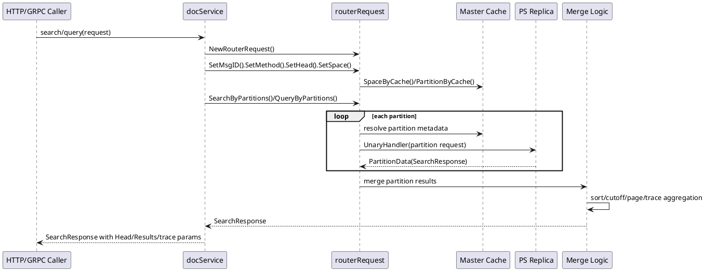
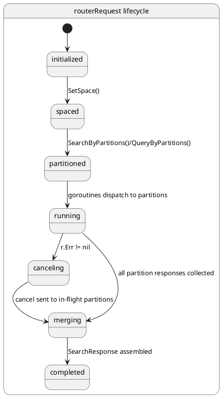

## 检索路径数据流

检索链路在 Vearch 中由 `router` 负责分区展开与并行调度，由 `client.routerRequest` 负责将一次逻辑查询拆成多个分区级 RPC，再由各个 `PS` 节点返回局部结果，最后在路由层完成合并、截断、排序以及 trace 信息汇总。这里的核心不是“把请求转发出去”，而是把**空间级检索请求**稳定地转换成**多分区、多副本、可取消、可追踪**的执行过程。

从入口看，`docService` 对外暴露 `search` 与 `query` 两类读请求。两者都先把请求包装为 `routerRequest`，补齐消息元数据、空间信息与分区路由，再分别进入 `SearchFieldSortExecute` 与 `QueryFieldSortExecute`。二者共享同一套并发模型，但在结果合并策略上不同：`search` 需要面向打分结果进行有序归并，而 `query` 更像是跨分区结果拼接，并在必要时按 `DocumentIds` 恢复用户指定顺序。

### 链路总览：从路由入口到结果回传



这条链路里，`docService` 负责构造，`routerRequest` 负责拆分和并发执行，`Master Cache` 提供空间与分区元数据，`PS` 提供每个分区的局部检索结果，而“合并逻辑”并不是独立模块，而是集中实现在 `internal/client/client.go` 中的一组归并函数。

<details>
<summary>关联代码</summary>

[internal/router/document/doc_service.go:150-200](),[internal/client/client.go:770-1179](),[internal/client/client.go:1255-1494](),[internal/client/client.go:1496-1609](),[internal/client/client.go:500-744]()

</details>

### 入口职责：`docService.search` 与 `docService.query`

`docService` 这一层并不直接参与分区执行，它的职责是把上层请求转换成路由层可执行的 `routerRequest`。这里最重要的动作有四个：写入请求标识、标记处理方法、绑定请求头、根据 `db/space` 获取空间元数据。

`query` 与 `search` 的分流发生在这里。`query` 走 `SetMethod(client.QueryHandler)` 与 `QueryByPartitions(args)`，随后调用 `QueryFieldSortExecute()`；`search` 则走 `SetMethod(client.SearchHandler)` 与 `SearchByPartitions(searchReq)`，随后调用 `SearchFieldSortExecute(desc)`。

其中 `search` 还会从 `SortFields` 中提取排序方向，并把首个排序字段的顺序作为归并阶段的方向参数。这个参数直接影响后续 `mergeSortedArrays`、`quickSort` 的行为。

```go
func (docService *docService) query(ctx context.Context, args *vearchpb.QueryRequest) *vearchpb.SearchResponse {
	request := client.NewRouterRequest(ctx, docService.client)
	request.SetMsgID(args.Head.Params["request_id"]).SetMethod(client.QueryHandler).SetHead(args.Head).SetSpace().QueryByPartitions(args)
	if request.Err != nil {
		return &vearchpb.SearchResponse{Head: setErrHead(request.Err)}
	}

	searchResponse := request.QueryFieldSortExecute()
	// 省略响应头兜底逻辑
	return searchResponse
}

func (docService *docService) search(ctx context.Context, searchReq *vearchpb.SearchRequest) *vearchpb.SearchResponse {
	request := client.NewRouterRequest(ctx, docService.client)
	request.SetMsgID(searchReq.Head.Params["request_id"]).SetMethod(client.SearchHandler).SetHead(searchReq.Head).SetSpace().SearchByPartitions(searchReq)
	if request.Err != nil {
		return &vearchpb.SearchResponse{Head: setErrHead(request.Err)}
	}

	sortOrder := make([]sortorder.Sort, 0)
	if len(searchReq.SortFields) > 0 {
		for _, sortF := range searchReq.SortFields {
			sortOrder = append(sortOrder, &sortorder.SortField{Field: sortF.Field, Desc: sortF.Type})
		}
	}

	desc := sortOrder[0].GetSortOrder()
	searchResponse := request.SearchFieldSortExecute(desc)
	// 省略响应头兜底逻辑
	return searchResponse
}
```

这段代码把检索路径的职责切得很清楚：`docService` 不判断副本、不管理并发，也不自己合并结果；它只负责把一次“空间级查询”转成一个“可执行的路由任务”。

需要注意的是，`search` 这里直接读取 `sortOrder[0]`。这意味着检索请求实际依赖至少一个排序字段存在，否则会在这一层出现越界风险。文档化这条行为很重要，因为它决定了 `SearchFieldSortExecute` 的输入前提。

<details>
<summary>关联代码</summary>

[internal/router/document/doc_service.go:150-200]()

</details>

### 分区展开：空间请求如何变成 `sendMap`

`routerRequest` 是检索路径的核心工作单元。它内部最关键的数据结构是 `sendMap`，类型为 `map[entity.PartitionID]*vearchpb.PartitionData`。这个结构把“一个空间级请求”拆成“多个分区级请求”，后续所有并发调度都围绕它展开。

`QueryByPartitions` 与 `SearchByPartitions` 的展开策略并不相同。`SearchByPartitions` 默认遍历 `space.Partitions`，把请求广播到所有目标分区；如果请求中带有 `PartitionNames`，则只保留命名分区。`QueryByPartitions` 除了支持 `PartitionNames`，还支持 `PartitionId` 直接定向单分区，这使得查询路径可以更精确地命中目标分片。

```go
func (r *routerRequest) QueryByPartitions(queryReq *vearchpb.QueryRequest) *routerRequest {
	if r.Err != nil {
		return r
	}

	sendMap := make(map[entity.PartitionID]*vearchpb.PartitionData)
	if queryReq.PartitionId != 0 {
		partitionID := uint32(queryReq.PartitionId)
		d := &vearchpb.PartitionData{PartitionID: partitionID, MessageID: r.GetMsgID(), QueryRequest: queryReq}
		sendMap[partitionID] = d
	} else {
		partition_names := make(map[string]bool)
		for _, pname := range queryReq.PartitionNames {
			partition_names[pname] = true
		}
		for _, partitionInfo := range r.space.Partitions {
			partitionID := partitionInfo.Id
			if len(partition_names) > 0 {
				if _, ok := partition_names[partitionInfo.Name]; !ok {
					continue
				}
			}
			d := &vearchpb.PartitionData{PartitionID: partitionID, MessageID: r.GetMsgID(), QueryRequest: queryReq}
			sendMap[partitionID] = d
		}
	}

	r.sendMap = sendMap
	return r
}

func (r *routerRequest) SearchByPartitions(searchReq *vearchpb.SearchRequest) *routerRequest {
	if r.Err != nil {
		return r
	}
	r.sendMap = make(map[entity.PartitionID]*vearchpb.PartitionData)
	partition_names := make(map[string]bool)
	for _, pname := range searchReq.PartitionNames {
		partition_names[pname] = true
	}
	for _, p := range r.space.Partitions {
		if len(partition_names) > 0 {
			if _, ok := partition_names[p.Name]; !ok {
				continue
			}
		}
		r.sendMap[p.Id] = &vearchpb.PartitionData{PartitionID: p.Id, MessageID: r.GetMsgID(), SearchRequest: searchReq}
	}
	return r
}
```

这里的数据流变化很直接：请求体没有被复制为多份业务对象，而是被装进多个 `PartitionData` 中，每个分区请求都带有相同的 `MessageID`。这个 `MessageID` 后续既参与 trace 维度的串联，也被取消请求逻辑复用。

<details>
<summary>关联代码</summary>

[internal/client/client.go:1255-1345](),[internal/client/client.go:110-169]()

</details>

### 副本选择与并发调度：每个分区发往哪个 `PS`

分区确定之后，真正的动态行为才开始出现。`SearchFieldSortExecute` 与 `QueryFieldSortExecute` 都会遍历 `sendMap`，为每个分区启动一个 goroutine，并通过 `respChain` 汇集响应。分区并行是检索路径性能的基础，而副本选择决定每个分区请求最终落到哪个 `PS` 节点。

副本选择由 `GetNodeIdsByClientType` 完成。它会结合 `RequestHead.ClientType`、分区副本列表、`serverCache`、故障节点列表和副本状态做节点筛选。读取侧支持 `Leader`、`NotLeader`、`Random`、`LeastConnection`、`NearestConnection` 等策略。返回的不是“所有可用副本”，而是**当前这一次分区请求的单个目标节点**。

```go
func GetNodeIdsByClientType(clientType string, partition *entity.Partition, servers *cache.Cache, client *Client) entity.NodeID {
	nodeId := uint64(0)
	switch clientType {
	case request.Leader:
		nodeId = partition.LeaderID
	case request.NotLeader:
		// 从非 leader 且可用副本中轮询
	case request.Random, "":
		// 从可用副本中轮询
	case request.LeastConnection:
		// 并发数高于阈值时选最少连接，否则退化为轮询
	case request.NearestConnection:
		// 优先本 zone，再退化到其他 zone
	default:
		// 默认轮询可用副本
	}
	return nodeId
}
```

`searchFromPartition` 与 `queryFromPartition` 在执行 RPC 前都会读取分区元数据并调用这个函数。随后进入 `PS().GetOrCreateRPCClient(...).Execute(...)`。如果发生 `"connect: connection refused"`，节点会被标记为短期故障，并重新选取副本重试。这个重试是**单分区内部**的，不会阻塞其他分区 goroutine。

```go
nodeID := GetNodeIdsByClientType(clientType, partition, serverCache, r.client)
faultyNodeNum := r.replicasFaultyNum(partition.Replicas)
retryTime := 0
var retry_err error

for len(partition.Replicas) > faultyNodeNum && retryTime < len(partition.Replicas) {
	rpcClient := r.client.PS().GetOrCreateRPCClient(ctx, nodeID)
	if rpcClient == nil {
		// 返回无可用 PS 客户端错误
		return
	}

	if r.Err == nil {
		r.clientMap.Store(partitionID, nodeID)
		retry_err = rpcClient.Execute(ctx, UnaryHandler, pd, replyPartition)
		r.clientMap.Delete(partitionID)
	}
	if retry_err == nil || r.Err != nil {
		break
	}

	if strings.Contains(retry_err.Error(), "connect: connection refused") {
		r.client.PS().AddFaulty(nodeID, time.Second*30)
	} else {
		break
	}
	nodeID = GetNodeIdsByClientType(clientType, partition, serverCache, r.client)
	faultyNodeNum = r.replicasFaultyNum(partition.Replicas)
	retryTime++
}
```

`clientMap` 在这里承担了一个很具体的状态职责：记录“当前分区请求正发往哪个节点”。这个状态不是为了路由，而是为了后续取消请求。只要某个分区 RPC 仍在执行，就可以通过 `partitionID -> nodeID` 的映射向对应 `PS` 发送取消命令。

<details>
<summary>关联代码</summary>

[internal/client/client.go:770-800](),[internal/client/client.go:928-1065](),[internal/client/client.go:1347-1494](),[internal/client/client.go:746-768]()

</details>

### `search` 的分区内执行：向量预处理、RPC、反序列化

`search` 路径比 `query` 更复杂，因为它包含向量检索特有的预处理和结果解包过程。`searchFromPartition` 在发起 RPC 前会先根据 `NormalizedVectorFields(r.space)` 判断是否需要对查询向量做归一化。如果空间字段配置要求归一化，路由层会直接修改请求中的向量字节内容，再发往 `PS`。

```go
if len(normalizedVectorFields) > 0 {
	vectorQueryArr := pd.SearchRequest.VecFields
	proMap := r.space.SpaceProperties
	for _, query := range vectorQueryArr {
		docField := proMap[query.Name]
		if docField != nil {
			dimension := docField.Dimension
			float32s, err := cbbytes.ByteToVectorForFloat32(query.Value)
			// 按维度切片并归一化，再转回字节
			query.Value = bs
		} else {
			float32s, err := cbbytes.ByteToVectorForFloat32(query.Value)
			// 直接归一化
			query.Value = bs
		}
	}
}
```

这一段意味着搜索请求进入 `PS` 之前，路由层已经参与了部分“数据变换”，而不仅是转发。这样返回结果时，路由层也需要处理 `PS` 返回的压缩或序列化结果。`searchFromPartition` 在收到响应后会检查 `FlatBytes`。如果存在，就通过 `gamma.DeSerialize` 反序列化成真正的 `Results`。

```go
flatBytes := searchResponse.FlatBytes
if entity.CheckVirtualMemExceed(len(flatBytes)) {
	r.Err = vearchpb.NewError(vearchpb.ErrorEnum_PARTITION_SERVER_MEMORYEXCEED, errors.New("request canceled"))
	replyPartition.Err = &vearchpb.Error{Code: vearchpb.ErrorEnum_PARTITION_SERVER_MEMORYEXCEED, Msg: "request canceled"}
} else if flatBytes != nil {
	sr := &vearchpb.SearchResponse{}
	gamma.DeSerialize(flatBytes, sr)
	searchResponse.Results = sr.Results
}
```

这里出现了一个很重要的状态分支。若 `FlatBytes` 太大导致触发 `CheckVirtualMemExceed`，路由层会直接把整个 `routerRequest` 标记为错误，并把当前分区响应设置为内存超限。这个错误不是局部静默处理，而是会驱动取消其他在途分区请求。

<details>
<summary>关联代码</summary>

[internal/client/client.go:500-744]()

</details>

### `query` 的分区内执行：读取型 RPC 与错误包装

`queryFromPartition` 的执行骨架和 `searchFromPartition` 基本一致，但它没有向量预处理，也没有 `search` 里那种 trace 埋点与排序方向控制。它的关键行为集中在三点：副本选取、单分区 RPC、如果返回 `FlatBytes` 则进行反序列化。

```go
func (r *routerRequest) queryFromPartition(ctx context.Context, partitionID entity.PartitionID, pd *vearchpb.PartitionData, space *entity.Space, respChain chan *response.SearchDocResult) {
	partition, e := r.client.Master().Cache().PartitionByCache(ctx, r.space.Name, partitionID)
	if e != nil {
		// 组装 SearchResponse 错误返回
		return
	}

	nodeID := GetNodeIdsByClientType(clientType, partition, servers, r.client)
	// 副本重试逻辑与 search 基本一致

	if r.Err == nil {
		searchResponse := replyPartition.SearchResponse
		if searchResponse != nil && searchResponse.Head.Err != nil &&
			searchResponse.Head.Err.GetCode() == vearchpb.ErrorEnum_PARTITION_SERVER_MEMORYEXCEED {
			r.Err = vearchpb.NewError(vearchpb.ErrorEnum_PARTITION_SERVER_MEMORYEXCEED, errors.New("request canceled"))
			replyPartition.Err = searchResponse.Head.Err
		}
		if searchResponse != nil {
			flatBytes := searchResponse.FlatBytes
			if entity.CheckVirtualMemExceed(len(flatBytes)) {
				r.Err = vearchpb.NewError(vearchpb.ErrorEnum_PARTITION_SERVER_MEMORYEXCEED, errors.New("request canceled"))
				replyPartition.Err = &vearchpb.Error{Code: vearchpb.ErrorEnum_PARTITION_SERVER_MEMORYEXCEED, Msg: "request canceled"}
			} else if flatBytes != nil {
				gamma.DeSerialize(flatBytes, searchResponse)
			}
		}
	}
	respChain <- responseDoc
}
```

`query` 虽然最终也返回 `SearchResponse`，但它的语义更偏向文档读取结果，因此合并阶段不会按分数做 topN 归并，而是直接把各分区的 `ResultItems` 追加起来，并在必要时恢复请求中的 `DocumentIds` 顺序。

<details>
<summary>关联代码</summary>

[internal/client/client.go:928-1050]()

</details>

### 结果合并：`search` 的有序归并与截断

`SearchFieldSortExecute` 的核心价值在于把多个分区返回的局部有序结果合并成一个全局有序结果。这个过程不是简单拼接，而是逐个 `SearchResult` 调用 `AddMergeSort`，并在最后再次执行 `quickSort` 与分页截断。

```go
for r := range respChain {
	if r != nil && r.PartitionData.Err != nil {
		finalErr = r.PartitionData.Err
		continue
	}
	if r != nil && r.PartitionData != nil && r.PartitionData.SearchResponse != nil &&
		r.PartitionData.SearchResponse.Head != nil {
		if r.PartitionData.SearchResponse.Head.Err != nil {
			finalErr = r.PartitionData.SearchResponse.Head.Err
			continue
		}
	}
	if result == nil && r != nil {
		searchResponse = r.PartitionData.SearchResponse
		if searchResponse != nil && len(searchResponse.Results) > 0 {
			result = searchResponse.Results
			continue
		}
	}

	if len(result) <= len(r.PartitionData.SearchResponse.Results) {
		for i := range result {
			AddMergeSort(result[i], r.PartitionData.SearchResponse.Results[i], int(searchReq.TopN), desc)
		}
	} else {
		for i := range r.PartitionData.SearchResponse.Results {
			AddMergeSort(result[i], r.PartitionData.SearchResponse.Results[0], int(searchReq.TopN), desc)
		}
	}
}

for _, resp := range result {
	quickSort(resp.ResultItems, desc, 0, len(resp.ResultItems)-1)
	if len(resp.ResultItems) > 0 {
		if searchReq.PageSize > 0 && searchReq.PageNum >= 1 {
			// 分页裁剪
		} else if searchReq.TopN > 0 {
			if len(resp.ResultItems) > int(searchReq.TopN) {
				resp.ResultItems = resp.ResultItems[:searchReq.TopN]
			}
		}
	}
}
```

`AddMergeSort` 内部调用 `mergeSortedArrays`，这一步会在两个有序数组之间做归并，并且尽量在 `topN` 范围内截断，避免结果集合无限增长。

```go
func AddMergeSort(sr *vearchpb.SearchResult, other *vearchpb.SearchResult, topN int, desc bool) {
	Merge(sr.Status, other.Status)
	sr.TotalHits += other.TotalHits
	if other.MaxScore > sr.MaxScore {
		sr.MaxScore = other.MaxScore
	}
	if other.MaxTook > sr.MaxTook {
		sr.MaxTook = other.MaxTook
		sr.MaxTookId = other.MaxTookId
	}
	sr.Timeout = sr.Timeout && other.Timeout

	if len(sr.ResultItems) > 0 || len(other.ResultItems) > 0 {
		sr.ResultItems = mergeSortedArrays(sr.ResultItems, other.ResultItems, topN, desc)
	}
}
```

这里的状态流转可以概括为：**局部结果有序返回 -> 两两归并保持有序 -> 全量 quick sort 兜底 -> 根据 `PageSize/PageNum` 或 `TopN` 截断**。最终 `searchResponse.Results` 才被设置为合并后的全局结果。

<details>
<summary>关联代码</summary>

[internal/client/client.go:770-926](),[internal/client/client.go:1530-1609](),[internal/client/client.go:1181-1216]()

</details>

### 结果合并：`query` 的拼接、校验与顺序恢复

`QueryFieldSortExecute` 不做按分值 topN 归并，它把各分区结果通过 `AddMergeResultArr` 拼接到一起，然后根据查询形态决定如何整理结果。

如果 `result == nil` 且某个分区先返回了有效结果，该分区的 `Results` 会作为基准数组。后续分区的结果通过 `AddMergeResultArr` 逐项追加。最后它会检查结果结构：如果合并后结果数组长度大于 1，会报出 `"the document_ids of query should be a one-dimensional array"`；如果长度为 1，则对结果项做分页或 `Limit` 截断。若请求带有 `DocumentIds`，则还会按 `_id` 字段回填 `PKey` 并按输入顺序重排。

```go
if len(result) == 1 {
	if len(searchReq.DocumentIds) == 0 {
		for _, resp := range result {
			if len(resp.ResultItems) > 0 {
				if searchReq.PageSize > 0 && searchReq.PageNum >= 1 {
					// 分页裁剪
				} else if searchReq.Limit > 0 {
					if len(resp.ResultItems) > int(searchReq.Limit) {
						resp.ResultItems = resp.ResultItems[:searchReq.Limit]
					}
				}
			}
		}
	} else {
		orderMap := make(map[string]int)
		for i, name := range searchReq.DocumentIds {
			orderMap[name] = i
		}
		for _, item := range result[0].ResultItems {
			for _, field := range item.Fields {
				if field != nil && field.Name == "_id" {
					item.PKey = string(field.Value)
				}
			}
		}
		sort.Slice(result[0].ResultItems, func(i, j int) bool {
			return orderMap[result[0].ResultItems[i].PKey] < orderMap[result[0].ResultItems[j].PKey]
		})
	}
}
```

这使得 `query` 链路的返回结果具备两个明确特征。其一，分区之间不按得分竞争，只做累积。其二，只要请求显式带了 `DocumentIds`，最终输出顺序就由用户输入决定，而不是分区返回顺序决定。

<details>
<summary>关联代码</summary>

[internal/client/client.go:1052-1179](),[internal/client/client.go:1496-1528]()

</details>

### 取消与错误传播：一个分区出错后其余分区如何收束

检索路径不是等所有分区都自然结束后再统一判断错误。`SearchFieldSortExecute` 与 `QueryFieldSortExecute` 都在主循环中轮询 `doneCh`，一旦发现 `r.Err != nil` 且尚未取消，就调用 `CancelRequestFromPartition()`。这意味着某个分区触发全局错误后，路由层会主动向仍在执行中的其他分区发送取消请求。

```go
canceled := false
for {
	select {
	case <-doneCh:
		return searchResponse
	default:
	}

	if r.Err != nil && !canceled {
		r.CancelRequestFromPartition()
		canceled = true
	}
}
```

取消动作依赖前面提到的 `clientMap`。只有仍处于执行状态的分区，才会在 `clientMap` 中保留 `partitionID -> nodeID` 记录，取消时也只会向这些节点发 `RequestCancelHandler`。

```go
func (r *routerRequest) CancelRequestFromPartition() {
	for partitionId := range r.sendMap {
		if value, ok := r.clientMap.Load(partitionId); ok {
			go func(pid entity.PartitionID, value interface{}) {
				nodeId, _ := value.(entity.NodeID)
				requestPartition := &vearchpb.PartitionData{PartitionID: partitionId, MessageID: r.GetMsgID()}
				rpcClient := r.client.PS().GetOrCreateRPCClient(r.ctx, nodeId)
				if rpcClient != nil {
					rpcClient.Execute(r.ctx, RequestCancelHandler, requestPartition, new(vearchpb.PartitionData))
				}
			}(partitionId, value)
		}
	}
}
```

错误传播在检索路径上有两层。第一层是分区级错误，通过 `PartitionData.Err` 或 `SearchResponse.Head.Err` 回传。第二层是路由级错误，写入 `r.Err`，用于触发取消和决定最终返回是否有效。内存超限就是典型会升级成路由级错误的场景。

<details>
<summary>关联代码</summary>

[internal/client/client.go:746-768](),[internal/client/client.go:913-925](),[internal/client/client.go:1166-1179](),[internal/client/client.go:695-744](),[internal/client/client.go:1032-1049]()

</details>

### trace 信息回传：分区耗时如何汇总到最终响应头

trace 并不是单独的观测模块接管，而是直接嵌入检索链路的数据流中。`searchFromPartition` 会在多个关键阶段记录耗时，并写入 `replyPartition.SearchResponse.Head.Params`，键名带上 `partitionID` 后缀，形成按分区区分的 trace 片段。

记录的阶段包括 `getPartition_*`、`getNodeId_*`、`getRpcClient_*`、`normalField_*`、`rpcExecute_*`、`deSerialize_*`、`searchFromPartition_*`。在 `SearchFieldSortExecute` 合并阶段，如果开启 trace，会把每个分区响应头上的 `Params` 继续拷贝到最终 `searchResponse.Head.Params`，再附加全局统计，如 `mergeAndSort`、`searchPartitions`、`searchExecute`。

```go
if trace {
	replyPartition.SearchResponse.Head.Params["getPartition_"+partitionIDstr] = getPartitionTimeStr
	replyPartition.SearchResponse.Head.Params["getNodeId_"+partitionIDstr] = getNodeIdTimeStr
	replyPartition.SearchResponse.Head.Params["getRpcClient_"+partitionIDstr] = getRpcClientTimeStr
	replyPartition.SearchResponse.Head.Params["normalField_"+partitionIDstr] = normalFieldTimeStr
	searchResponse.Head.Params["rpcExecute_"+partitionIDstr] = rpcExecuteStr
	searchResponse.Head.Params["deSerialize_"+partitionIDstr] = deSerializeStr
	searchResponse.Head.Params["searchFromPartition_"+partitionIDstr] = searchFromPartitionStr
}
```

```go
if trace {
	for key, value := range r.PartitionData.SearchResponse.Head.Params {
		searchResponse.Head.Params[key] = value
	}
}

if trace && searchResponse.Head != nil && searchResponse.Head.Params != nil {
	searchResponse.Head.Params["mergeAndSort"] = mergeAndSortStr
	searchResponse.Head.Params["searchPartitions"] = searchPartitionsStr
	searchResponse.Head.Params["searchExecute"] = searchExecuteStr
}
searchResponse.Head.RequestId = r.GetMsgID()
```

因此最终返回给调用方的不只是 `Results`，还包含一组跨分区拼接后的时序片段。这个响应头上的 `Params` 是检索路径动态行为最直接的观测出口，能够定位耗时究竟落在分区元数据获取、副本选择、RPC 执行、反序列化还是总归并阶段。

<details>
<summary>关联代码</summary>

[internal/client/client.go:514-579](),[internal/client/client.go:581-657](),[internal/client/client.go:701-739](),[internal/client/client.go:817-909]()

</details>

### 检索路径中的数据与状态变化

下表把检索路径中最关键的对象变化集中起来，便于把“请求流”和“状态流”对应起来理解。

| 阶段 | 核心对象 | 输入状态 | 输出状态 |
|---|---|---|---|
| 路由入口 | `vearchpb.SearchRequest` / `vearchpb.QueryRequest` | 原始空间级请求 | 绑定到 `routerRequest.head` |
| 空间解析 | `routerRequest.space` | 仅有 `DbName`、`SpaceName` | 拿到 `space.Partitions`、字段配置、分区规则 |
| 分区展开 | `routerRequest.sendMap` | 单一逻辑请求 | `partitionID -> PartitionData` 映射 |
| 副本调度 | `partition.Replicas`、`clientType` | 多副本可选 | 选出单次 RPC 的 `nodeID` |
| 分区执行 | `replyPartition.SearchResponse` | 空结果壳对象 | 携带 `Head`、`FlatBytes` 或 `Results` |
| 反序列化 | `SearchResponse.FlatBytes` | 二进制结果 | 解包为 `SearchResponse.Results` |
| 合并排序 | `[]*SearchResult` | 多分区局部结果 | 全局结果集 |
| 取消控制 | `clientMap`、`r.Err` | 部分分区仍在执行 | 向在途分区发送取消命令 |
| trace 回传 | `ResponseHead.Params` | 分区局部耗时参数 | 聚合到最终响应头 |

检索路径里的状态转移并不复杂，但非常集中。`sendMap` 表示“有哪些分区要跑”，`clientMap` 表示“哪些分区正在跑、跑在哪个节点”，`r.Err` 表示“是否已进入全局收束状态”，而 `SearchResponse.Head.Params` 表示“这次链路到底慢在哪里”。



<details>
<summary>关联代码</summary>

[internal/client/client.go:115-126](),[internal/client/client.go:1255-1345](),[internal/client/client.go:746-768](),[internal/client/client.go:770-926](),[internal/client/client.go:1052-1179]()

</details>