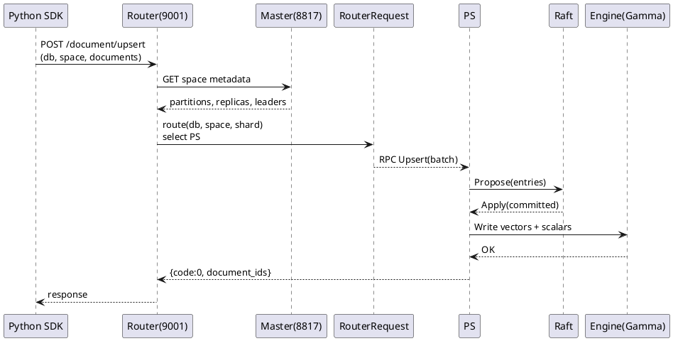

## 开发与测试视图

本节面向日常开发与联调测试，聚焦两件事：
- 本地拉起与定位：如何在单机快速启动、常用端口与角色、典型调试链路。
- 测试覆盖与样例：如何借助现有用例验证 `upsert`、`search`、`query`、`delete` 与索引管理。

为便于上手，示例覆盖 HTTP 调用、Python SDK 使用，串联 Router、Master、PS 与底层引擎的端到端路径。

---

### 本地运行与调试清单

单机模式聚合了 `master`、`router`、`ps`，通过 Docker Compose 的 `standalone` 服务以 `command: all` 一次性拉起。关键职责与机制如下：
- 角色职责
  - `master`：元数据与调度，HTTP 管理端口 `8817`。
  - `router`：无状态网关，HTTP 端口 `9001`，负责分片路由与请求组装。
  - `ps`：分区副本节点，承载写入、查询与索引构建，内部 `RPC` 与 `Raft` 端口按配置开放。
- 启动机制
  - Compose 映射 `config.toml` 至容器根目录以作为统一进程配置。
  - `standalone` 模式通过 `command: all` 在同一容器内启动三类角色，默认暴露 `:8817` 与 `:9001`。
  - 认证由 `config.toml` 控制，`[global] skip_auth` 为 `false` 时需基本认证。
- 调试出入口
  - 通过 `:9001` 与 `:8817` 分别验证 Router 与 Master 探活。
  - PS 内部 `pprof`、`raft` 端口由 `[ps]` 配置决定，用于性能与一致性排查。

表：单机调试要点

| 项目 | 位置或值 | 说明 |
|---|---|---|
| `standalone` 服务 | `cloud/docker-compose.yml` | 单容器一键拉起，`command: all` |
| Router 端口 | `9001` | HTTP 文档接口入口 |
| Master API 端口 | `8817` | 管理接口入口 |
| 配置文件 | `config/config.toml` | 全局参数、路由与存储配置 |
| 认证 | `[global] skip_auth`、`signkey` | 控制是否跳过认证与签名密钥 |
| PS 关键参数 | `[ps] rpc_port`、`raft_*`、`flush_*` | 写入、复制与刷盘等行为 |

典型启动步骤
- 准备配置与启动
  - 拷贝配置并启动容器
    ```
    cd cloud
    cp ../config/config.toml .
    docker-compose --profile standalone up
    ```
- 验证 Router 与 Master
  - 探活
    ```
    curl -f http://localhost:9001
    curl -f http://localhost:8817 -u root:secret
    ```
- 快速建立库与空间并写入
  - HTTP 示例（cURL）
    ```
    # 创建 DB
    curl -XPUT -H "content-type:application/json" \
      -d '{"name": "test"}' http://localhost:9001/db/_create

    # 创建 Space（向量字段 + 索引参数）
    curl -XPUT -H "content-type: application/json" \
      -d' { "name": "test",
        "partition_num": 2, "replica_num": 1, "engine":
        {"index_size":10000,"retrieval_type": "IVFPQ",
         "retrieval_param": {"metric_type": "InnerProduct","ncentroids": -1,"nsubvector": -1}},
        "properties": {
          "url": { "type": "keyword", "index":true},
          "feature1": { "type": "vector", "dimension":512, "format": "normalization"}
        }} ' \
      http://localhost:9001/space/test/_create

    # 单条写入
    curl -XPOST -H "content-type: application/json" \
      -d' { "url": "../images/img.jpg",
            "feature1":{"feature":"../images/img.jpg"} } ' \
      http://localhost:9001/test/test/doc-1
    ```
- Python SDK 验证
  - 安装与初始化
    ```
    pip3 install pyvearch
    ```
    ```python
    from vearch.core.vearch import Vearch
    from vearch.config import Config
    from vearch.schema.field import Field
    from vearch.schema.space import SpaceSchema
    from vearch.utils import DataType, MetricType, VectorInfo
    from vearch.schema.index import FlatIndex, ScalarIndex
    import random

    vc = Vearch(Config(host="http://localhost:9001", token="***"))
    vc.create_database("database_test")

    book_name = Field("book_name", DataType.STRING, desc="name", index=ScalarIndex("book_name_idx"))
    book_vector = Field("book_character", DataType.VECTOR, FlatIndex("book_vec_idx", MetricType.Inner_product), dimension=512)
    schema = SpaceSchema("book_info", fields=[book_name, book_vector])
    vc.create_space("database_test", schema)

    # 写入 + 搜索
    data = [{"book_name": "Write", "book_character":[random.uniform(0, 1) for _ in range(512)]}]
    up = vc.upsert("database_test", "book_info", data)
    ids = up.get_document_ids()

    vi = VectorInfo("book_character", [random.uniform(0, 1) for _ in range(512)])
    ret = vc.search("database_test", "book_info", vector_infos=[vi], limit=5)
    print(ret.documents)
    ```

端到端调试链路（文档写入）


常见排查路径
- Router 侧：`/document/*` 请求参数、`filter` 与 `vector_infos` 格式检查，必要时开启 trace 查询。
- Master 侧：`/dbs/{db}/spaces/{space}?detail=true` 观测 `index_status`、分片健康度与副本角色。
- PS 侧：`pprof` 端口与 `raft_*` 指标定位写入或复制瓶颈；`flush_*` 参数决定落盘与查询可见性。

<details>
<summary>关联代码</summary>

[cloud/docker-compose.yml:9-25](),[cloud/docker-compose.yml:171-230](),[config/config.toml:1-26](),[config/config.toml:60-88](),[docs/Quickstart.md:11-19](),[examples/python/example.py:226-279](),[sdk/python/README.md:30-58](),[examples/golang/basic_usage/basic_usage.go:35-88]()

</details>

---

### 典型测试场景与用例

测试职责聚焦两层：
- 文档操作正确性：`upsert`、`query`、`search`、`delete` 的协议契约、分页与过滤、重复与更新语义。
- 索引生命周期一致性：构建、合并、刷盘、重建与检索阈值等行为在不同索引类型上的表现。

表：测试模块与接口映射

| 能力 | 测试文件 | 入口接口 | 关键校验点 |
|---|---|---|---|
| 写入 Upsert | `test/test_document_upsert.py` | `/document/upsert` | 混合 `_id` 与无 `_id` 批写入一致性；重复 `_id` 更新行为；含/不含向量字段的更新 |
| 搜索 Search | `test/test_document_search.py` | `/document/search` | 过滤检索、`score` 阈值、`brute_force_search_threshold`、索引参数透传 |
| 查询 Query | `test/test_document_query.py` | `/document/query` | 按 `_id`、过滤、指定分片与分页的组合场景；错误参数覆盖 |
| 删除 Delete | `test/test_document_delete.py` | `/document/delete` | 按 `_id` 与过滤的删除，空分片语义，先删后写再查的 `max_docid` 演进 |
| 索引管理 | `test/test_index_*.py`、`test/test_vector_index_*.py` | `/index/forcemerge` 等 | 分段合并、重建、刷盘与多索引类型一致性 |

准备阶段通用机制
- 数据集与对齐指标
  - 使用 `SIFT10K` 数据集构造 `xb`、`xq` 与 `gt`，在 `search` 场景通过 `evaluate` 计算 `recall@K`，验证召回正确性。
- 空间与字段编排
  - 借助 `create_for_document_test` 快速创建 DB/Space，空间字段覆盖标量与向量，并配置索引类型，例如 `FLAT`、`IVFPQ`、`HNSW`。
- 构建与可见性
  - 通过 `waiting_index_finish` 等待构建完成；部分场景调用 `/index/forcemerge` 触发一次性合并，保障后续检索稳定。

关键用例片段
- Upsert：混合 `_id` 与无 `_id` 批写入并查询核验
  ```python
  url = router_url + "/document/upsert"
  data = {
      "db_name": db_name,
      "space_name": space_name,
      "documents": [
          {"_id": "test_id_001", "field_int": 100, "field_vector": xb[0].tolist()},
          {"field_int": 200, "field_vector": xb[1].tolist()},
      ],
  }
  rs = requests.post(url, auth=(username, password), json=data)
  assert rs.json()["code"] == 0
  document_ids = rs.json()["data"]["document_ids"]  # 同时返回显式与自动生成的 `_id`
  ```
- Search：带索引参数与 Trace 的检索
  ```python
  data = {
      "db_name": db_name,
      "space_name": space_name,
      "vectors": [{"field": "field_vector", "feature": xb[:1].flatten().tolist()}],
      "index_params": {"nprobe": 1}
  }
  rs = requests.post(router_url + "/document/search?trace=true", auth=(username, password), data=json.dumps(data))
  assert rs.status_code == 200
  ```
- Query：按分片 + 翻页的稳定性
  ```python
  data = {
      "db_name": db_name,
      "space_name": space_name,
      "fields": ["field_int"],
      "limit": 5,
      "offset": 0,
      "page_num": 1,
      "filters": {"operator": "AND", "conditions": [{"field": "field_int", "operator": ">=", "value": 0}]}
  }
  rs = requests.post(router_url + "/document/query", auth=(username, password), data=json.dumps(data))
  assert rs.json()["code"] == 0
  assert len(rs.json()["data"]["documents"]) == 5
  ```
- Delete：按过滤批量删除与空分片场景
  ```python
  data = {
      "db_name": db_name,
      "space_name": space_name,
      "limit": 10,
      "filters": {"operator": "AND", "conditions": [{"field": "field_int", "operator": ">=", "value": 0}]}
  }
  rs = requests.post(router_url + "/document/delete", auth=(username, password), data=json.dumps(data))
  assert rs.json()["code"] == 0
  ```

执行与定位
- 执行命令
  ```
  pytest test/test_document_upsert.py -q
  pytest test/test_document_search.py -q
  pytest test/test_document_query.py -q
  pytest test/test_document_delete.py -q
  ```
- 结果解读
  - 成功返回体包含 `{"code": 0, "data": ...}`，`total` 与 `document_ids` 为关键计数与标识字段。
  - 分页校验关注 `limit`、`page_num`、`offset` 与返回文档条目数量一致性。
  - 检索指标关注 `recall@K` 达标与索引参数生效。
- 常用排查
  - 空间状态：`/dbs/{db}/spaces/{space}?detail=true` 查看 `index_status`。
  - 写入更新：对比「含向量/不含向量」更新的 `total` 与 `get_space_num()` 变化。
  - 阈值行为：小集合触发 `brute_force_search_threshold` 前后的返回码与性能差异。

<details>
<summary>关联代码</summary>

[test/test_document_upsert.py:122-205](),[test/test_document_upsert.py:526-572](),[test/test_document_search.py:33-69](),[test/test_document_search.py:230-253](),[test/test_document_query.py:226-265](),[test/test_document_delete.py:330-358]()

</details>