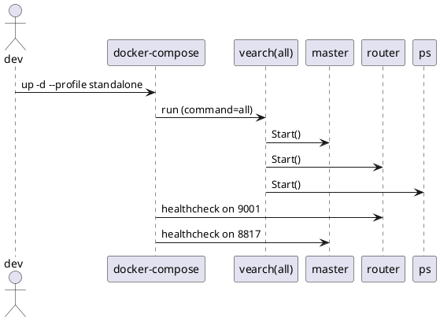
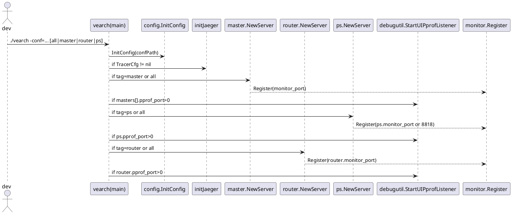
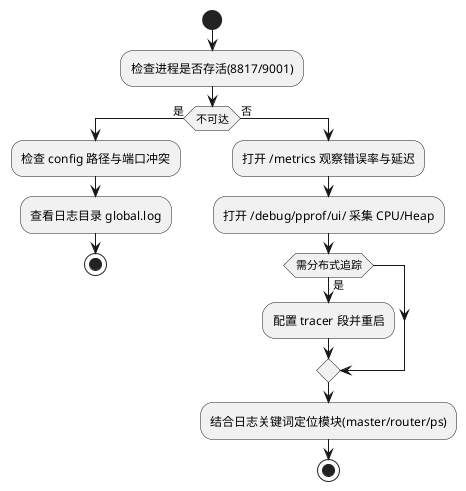

## 本地运行与调试清单

本清单面向本地单机或轻量集群的开发联调场景，目标是以最小代价启动 `master`、`router`、`ps` 三个模块，并具备完备的可观察性通道（日志、PProf、Prometheus 指标、Jaeger 可选）。核心机制由二进制入口 `./vearch` 的参数解析与配置加载负责，`config.toml` 控制模块化启动与调试端口开关，监控与剖析服务按需注册。

### 运行模式与职责边界

Vearch 二进制通过命令行参数将三大模块以独立或合并方式运行，职责拆解如下：

- `master`：集群控制面，管理 `etcd`、元数据服务、用户与权限、监控注册。
- `router`：HTTP 网关，负责路由请求、CORS、Trace 开关、指标上报。
- `ps`：数据平面，承载分区副本、Raft 引擎、向量引擎绑定、RPC 服务。

二进制启动参数与默认行为由 `cmd/vearch/startup.go` 定义：

- `-conf`：配置文件路径，未显式指定时自动探测 `./config/config.toml`。
- `-master`：本地多 `master` 启动时用于标识当前 `master` 的 `name`。
- 位置参数：`all`、`master`、`router`、`ps`，缺省则等价于 `all`。

模块与启动参数关系表：

| 启动参数 | 含义 | 典型用途 |
|---|---|---|
| `all` | 同进程内同时启动 `master`、`router`、`ps` | 单机开发、快速验收 |
| `master` | 仅启动 `master` | 集群控制面或本地多主测试 |
| `router` | 仅启动 `router` | 路由层调试、HTTP 接入联调 |
| `ps` | 仅启动 `ps` | 数据平面、索引与存储调试 |

关键实现机制：
- `flag.Args()` 缺省替换为 `all`，简化单机体验。
- `InitConfig` 加载 `TOML` 后进行路径校验与目录创建，保障日志与数据目录可用。
- `TracerCfg` 非空时初始化 `Jaeger` 全局 Tracer。
- 每个模块启动前执行 `Validate` 确认本地 `master` 判定、单机多主冲突、目录有效性。
- PProf 与 Prometheus 监控在模块成功启动后按配置端口启动监听。

代码示例（参数解析与模块门控）:
[cmd/vearch/startup.go:103-121]()
```go
if config.Conf().TracerCfg != nil {
    closer := initJaeger(config.Conf().Global.Name, config.Conf().TracerCfg)
    defer closer.Close()
}
args := flag.Args()
if len(args) == 0 {
    args = []string{allTag}
}
tags := map[string]bool{allTag: false, psTag: false, routerTag: false, masterTag: false}
for _, a := range args {
    if _, ok := tags[a]; !ok {
        os.Exit(1)
    }
    tags[a] = true
}
```

<details>
<summary>关联代码</summary>

[cmd/vearch/startup.go](),[internal/config/config.go]()

</details>

### 配置文件要点与可观察性开关

`config.toml` 决定进程行为、端口分配与调试开关，重点项：

- 全局路径与权限
  - `global.log`、`global.level`：日志目录与级别，二进制入口通过 `vearchlog` 初始化滚动日志。
  - `global.data`：数据目录列表，`ps` 会按分区 `pid` 做槽位散列到相应目录。
  - `global.skip_auth`：路由与主控鉴权开关。
  - `global.self_manage_etcd`：是否外部自管 `etcd`，否则由 `master` 内嵌 `etcd`。
- Jaeger 分布式追踪
  - `tracer.host`、`tracer.sample_type`、`tracer.sample_param`：存在即启用 `Jaeger` 全局 Tracer。
- PProf UI（各模块）
  - `masters[].pprof_port`、`router.pprof_port`、`ps.pprof_port`：大于 0 时启用 `/debug/pprof` 与 UI。
- Prometheus 指标（各模块）
  - `masters[].monitor_port`、`router.monitor_port`、`ps.monitor_port`：大于 0 时注册 `/metrics`。
- 路由 HTTP
  - `router.port`：HTTP 服务端口，默认 `9001`。
- PS 端口
  - `ps.rpc_port`、`ps.raft_heartbeat_port`、`ps.raft_replicate_port`：RPC 与 Raft 通信端口。

配置切片：
[config/config.toml:56-74]()
```toml
[masters]
    pprof_port = 6062
    monitor_port = 8818

[router]
    port = 9001
    pprof_port = 6061

[ps]
    rpc_port = 8081
    raft_heartbeat_port = 8898
    raft_replicate_port = 8899
    pprof_port = 6060
```

PProf 启动条件：
[cmd/vearch/startup.go:192-199]()
```go
if port := config.Conf().Masters.Self().PprofPort; port > 0 {
    debugutil.StartUIPprofListener(int(port))
}
```

监控注册点：
- `master`：在 `monitor.Register` 注册 `/metrics`。
- `router`：启动时按 `router.monitor_port` 注册。
- `ps`：按 `ps.monitor_port` 注册，未配置则使用默认 `8818`。

[internal/router/server.go:135-139]()
```go
if port := config.Conf().Router.MonitorPort; port > 0 {
    monitor.Register(nil, nil, config.Conf().Router.MonitorPort)
}
```

<details>
<summary>关联代码</summary>

[config/config.toml](),[internal/config/config.go:195-222](),[cmd/vearch/startup.go:192-199,222-224,252-254](),[internal/master/server.go:149-156](),[internal/router/server.go:135-141](),[internal/ps/server.go:109-115]()

</details>

### Docker 启动路径

两种容器化启动方式：

- 直接运行镜像（单机合并模式）：端口映射并挂载 `config.toml`，通过 `all` 一次性启动三大模块。
- `docker-compose`（集群模式与单机模式 Profile）：通过 `profiles` 启动 `standalone` 或 `cluster` 布局。

单机镜像运行：
[docs/DeployByDocker.md:11-14]()
```bash
cp vearch/config/config.toml .
nohup docker run -p 8817:8817 -p 9001:9001 \
  -v $PWD/config.toml:/vearch/config.toml vearch/vearch:latest all &
```

Compose 关键片段：
[cloud/docker-compose.yml:10-24]()
```yaml
services:
  standalone:
    image: vearch/vearch:latest
    ports:
      - "8817:8817"
      - "9001:9001"
    volumes:
      - ${DOCKER_VOLUME_DIRECTORY:-.}/config.toml:/vearch/config.toml
    command: all
    profiles: [standalone]
```

集群 Profile 提供 `master[N]`、`router[N]`、`ps[N]`，健康检查依赖 `8817` 与 `9001`：
[cloud/docker-compose.yml:133-169]()
```yaml
router1:
  ports:
    - "9001:9001"
  command: router
  depends_on:
    master1: { condition: service_healthy }
    master2: { condition: service_healthy }
    master3: { condition: service_healthy }
  healthcheck:
    test: ["CMD","sh","-c","curl -f http://localhost:9001 -u root:secret"]
```

容器与端口映射表：

| 服务 | 容器命令 | 映射端口 | 配置挂载 |
|---|---|---|---|
| standalone | `all` | `8817`/`9001` | `config.toml:/vearch/config.toml` |
| master[N] | `master` | `8817` | `config_cluster.toml:/vearch/config.toml` |
| router[N] | `router` | `9001` | `config_cluster.toml:/vearch/config.toml` |
| ps[N] | `ps` | 内部 RPC/Raft | `config_cluster.toml:/vearch/config.toml` |

验证要点：
- `master` 健康检查命令命中 `8817`。
- `router` 健康检查命中 `9001`。
- `standalone` 需同时映射 `8817` 与 `9001`。

启动与依赖时序（Sequence）：


<details>
<summary>关联代码</summary>

[cloud/docker-compose.yml](),[docs/DeployByDocker.md](),[config/config_cluster.toml]()

</details>

### 本地编译与二进制启动路径

无需镜像编译路径包含基础依赖、构建脚本与二进制启动命令。构建可用 `Makefile` 的 `all` 目标或 `build/build.sh`。

构建入口：
[Makefile:9-11]()
```make
all:
	cd build && ./build.sh -n $(JOBS)
```

文档示例（源码编译与单机启动）：
[docs/SourceCompileDeployment.md:37-39]()
```bash
./vearch -conf conf.toml all
```

文档示例（分布式启动，分角色拉起）：
[docs/SourceCompileDeployment.md:95-108]()
```bash
./vearch -conf conf.toml master
./vearch -conf conf.toml ps
./vearch -conf conf.toml router
```

编译加速与 GPU 选择由 `build/build.sh` 与 `internal/engine/CMakeLists.txt` 控制（若需 GPU，将 `BUILD_WITH_GPU` 打开）。本地运行前需确保 `LD_LIBRARY_PATH` 包含 `gamma` 动态库路径。

<details>
<summary>关联代码</summary>

[Makefile](),[docs/SourceCompileDeployment.md]()

</details>

### 启动时序与内部机制

进程内时序由入口 `main` 控制，核心流程包括配置初始化、可观察性初始化、模块装配与系统信号管理。

启动时序图：


关键代码摘录（PProf、Monitor、Jaeger）：

- Jaeger 条件初始化：
[cmd/vearch/startup.go:103-106]()
```go
if config.Conf().TracerCfg != nil {
    closer := initJaeger(config.Conf().Global.Name, config.Conf().TracerCfg)
    defer closer.Close()
}
```

- PProf 启动开关（各模块）：
[cmd/vearch/startup.go:222-224,252-254]()
```go
if port := config.Conf().PS.PprofPort; port > 0 { debugutil.StartUIPprofListener(int(port)) }
if port := config.Conf().Router.PprofPort; port > 0 { debugutil.StartUIPprofListener(int(port)) }
```

- Prometheus 监控注册（各模块）：
[internal/master/server.go:149-156]()
```go
monitor.Register(monitorService.Client, monitorService.etcdServer, config.Conf().Masters.Self().MonitorPort)
// httpServer.Run on masters[].api_port
```

<details>
<summary>关联代码</summary>

[cmd/vearch/startup.go](),[internal/master/server.go](),[internal/router/server.go](),[internal/ps/server.go](),[internal/debugutil/server.go]()

</details>

### 问题定位与调试通道

故障定位以“日志 + 指标 + 剖析 + Trace”四通道为核心。各通道的开关控制与访问方式：

- 日志目录
  - 位置：`config.global.log`，二进制入口通过 `vearchlog` 滚动输出。
  - 文件名：以模块组合与级别命名，入口设置 `logName := strings.ToUpper(strings.Join(args, "-"))`。
- PProf 剖析
  - 启用：设置 `masters[].pprof_port`、`router.pprof_port`、`ps.pprof_port` 为大于 0 的端口。
  - 访问：`http://<host>:<pprof_port>/debug/pprof/` 与 `http://<host>:<pprof_port>/debug/pprof/ui/`。
- Prometheus 指标
  - 启用：设置 `monitor_port`（各模块）。
  - 访问：`http://<host>:<monitor_port>/metrics`。
  - 核心指标：`vearch_request_duration_milliseconds`、`vearch_request_count`、`vearch_cluster_health` 等。
- Jaeger Trace
  - 启用：在 `config.toml` 增加 `tracer` 段，指向 Jaeger Agent。
  - 作用：全局 Tracer 初始化，路由层 `trace` 请求参数可进一步输出详尽流水。

调试流程（Activity）：


PProf UI 启动实现：
[internal/debugutil/server.go:89-101]()
```go
func StartUIPprofListener(port int) {
    pprofServer := NewServer()
    listener, _ := net.Listen("tcp", ":"+strconv.Itoa(port))
    srvhttp := &http.Server{ Handler: pprofServer.mux }
    go srvhttp.Serve(listener)
}
```

监控注册实现（合并注册 DefaultGatherer 与自建 Registry）：
[internal/monitor/monitor_service.go:76-87]()
```go
metricRegistry.MustRegister(collector)
http.Handle("/metrics", promhttp.HandlerFor(
  prometheus.Gatherers{metricRegistry, prometheus.DefaultGatherer},
  promhttp.HandlerOpts{EnableOpenMetrics: true, Registry: metricRegistry},
))
```

<details>
<summary>关联代码</summary>

[internal/debugutil/server.go](),[internal/monitor/monitor_service.go](),[cmd/vearch/startup.go:123-129](),[internal/config/config.go:123-152]()

</details>

### 常见端口与文件清单

端口与路径总览：

| 项 | 配置键 | 默认/示例 | 说明 |
|---|---|---|---|
| Master API | `masters[].api_port` | 8817 | 集群控制平面 HTTP |
| Router HTTP | `router.port` | 9001 | 业务访问入口 |
| PS RPC | `ps.rpc_port` | 8081 | 内部 RPC |
| PS Raft 心跳 | `ps.raft_heartbeat_port` | 8898 | Raft 心跳 |
| PS Raft 复制 | `ps.raft_replicate_port` | 8899 | Raft 复制 |
| PProf | `*.pprof_port` | 6060+/模块 | `/debug/pprof` 与 UI |
| Prometheus | `*.monitor_port` | 8818/8828 等 | `/metrics` |
| 日志目录 | `global.log` | `logs/` | 由入口创建 |
| 数据目录 | `global.data` | `["datas/","datas1/"]` | 多目录轮转 |

<details>
<summary>关联代码</summary>

[config/config.toml](),[config/config_cluster.toml](),[cmd/vearch/startup.go:270-285](),[internal/config/config.go:123-152,353-397]()

</details>

### 快速校验用例

- 单机二进制拉起后校验：
  - Master 健康：`curl -u root:secret http://localhost:8817`
  - Router 通达：`curl -f http://localhost:9001`
  - Metrics：`curl -f http://localhost:<monitor_port>/metrics`
  - PProf UI：浏览器打开 `http://localhost:<pprof_port>/debug/pprof/ui/`

- Docker 单机（standalone）校验：
  - Compose 已在 `router` 和 `master` 增设健康检查，可直接观察容器状态。
  - 如鉴权开启，使用 `root:secret` 基本认证。

健康检查示例（Compose 中）：
[cloud/docker-compose.yml:159-167]()
```yaml
healthcheck:
  test: ["CMD","sh","-c","curl -f http://localhost:9001 -u root:secret"]
  interval: 30s
  timeout: 5s
  retries: 3
```

<details>
<summary>关联代码</summary>

[cloud/docker-compose.yml](),[docs/DeployByDocker.md]()

</details>