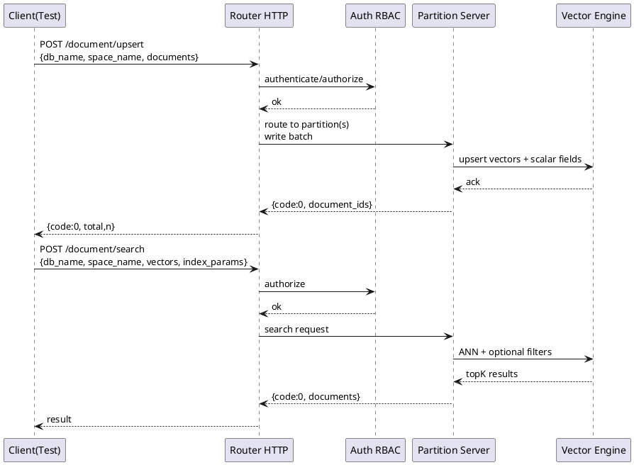
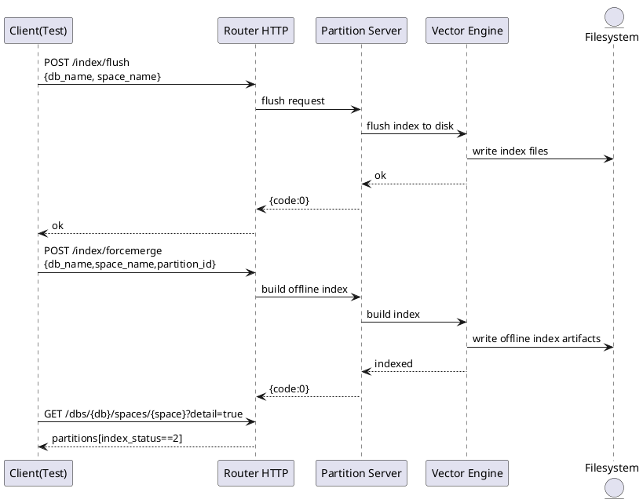
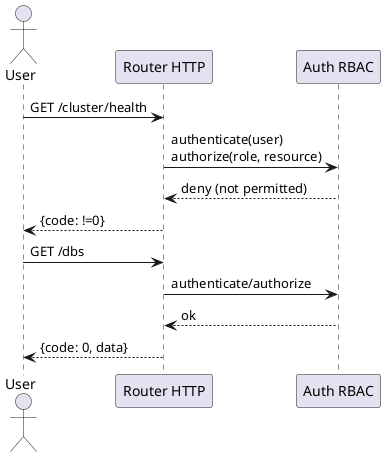
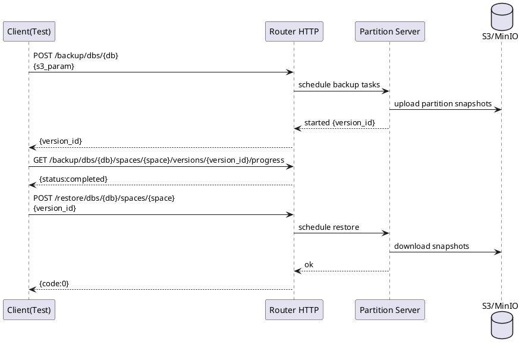

## 典型测试场景与用例

本节聚焦于端到端的验证路径，围绕以下核心职责来组织典型测试场景：
- 文档写入与向量检索（CRUD + Upsert/Search）
- 索引生命周期与一致性（Flush/ForceMerge/Rebuild）
- 数据库与空间（DB/Space）建模、校验与基准化
- 用户与权限（RBAC）访问控制
- 备份与恢复（S3/MinIO）跨空间、跨库的完整性验证

测试统一以 HTTP Router 为入口，基于 `SIFT-10K` 的向量数据集，使用批量写入构造空间数据，随后对检索质量、索引状态、权限校验与备份进度进行断言。所有接口均以 `code == 0` 判定成功，异常路径显式断言非 0 或 HTTP 状态码非 200。

### 端到端：Upsert 与 Search

这一类用例承担核心职责：
- 验证向量与标量字段共同建模
- 覆盖 `_id` 显式与自动生成两种写入路径
- 通过查询接口检索刚写入的文档，校验字段完整性与 TopK 召回

实现机制由三部分组成：构造空间、批量 Upsert、发起 Search 并断言。

1) 空间与字段建模
- 统一定义 `field_vector` 为向量字段，并为标量字段建立 `SCALAR` 索引，确保过滤与排序场景可用。
- 维度与度量类型随数据集一致（例如 `L2` 或 `InnerProduct`）。

2) Upsert 写入
- 批量写入接口 `/document/upsert` 支持带 `_id` 与不带 `_id` 同批次，系统为缺省 `_id` 的文档自动补全。
- 写入完成后等待索引可检索状态（`waiting_index_finish` 或轮询空间详情中的 `index_status`）。

3) Search 检索与断言
- 基于 `/document/search` 发起向量检索，可选设置 `index_params` 以控制 `nprobe`、`efSearch` 等参数。
- 常见断言包括：`code == 0`、每批次返回 `k` 条文档、每条文档的标量字段与向量一致性校验。

关键代码示例（两条文档：一条显式 `_id`，一条自动 `_id`），随后经 `/document/query` 精确查询校验字段完整性：
```python
# test/test_document_upsert.py
url = router_url + "/document/upsert"
data = {
    "db_name": db_name,
    "space_name": space_name,
    "documents": [
        {"_id": "test_id_001", "field_int": 100, "field_long": 100, "field_float": 100.0,
         "field_double": 100.0, "field_string": "test_with_id", "field_vector": xb[0].tolist()},
        {"field_int": 200, "field_long": 200, "field_float": 200.0, "field_double": 200.0,
         "field_string": "test_without_id", "field_vector": xb[1].tolist()},
    ],
}
rs = requests.post(url, auth=(username, password), json=data)
assert rs.json()["code"] == 0
document_ids = [x["_id"] for x in rs.json()["data"]["document_ids"]]

query_url = router_url + "/document/query"
query_data = {"db_name": db_name, "space_name": space_name,
              "document_ids": document_ids,
              "fields": ["field_int", "field_long", "field_float", "field_double", "field_string", "field_vector"]}
query_rs = requests.post(query_url, auth=(username, password), json=query_data)
assert query_rs.json()["code"] == 0
```

检索端的典型构造（向量检索 + 指定 `index_params`）：
```python
# test/test_document_search.py
data = {
    "db_name": db_name, "space_name": space_name,
    "vectors": [{"field": "field_vector", "feature": xb[:1].flatten().tolist()}],
    "index_params": {"nprobe": 1},
}
rs = requests.post(router_url + "/document/search", auth=(username, password), data=json.dumps(data))
assert rs.status_code == 200
assert rs.json()["code"] == 0
```

等待分区索引状态达标（`index_status == 2` 为可检索）：
```python
# test/test_document_search.py
url = f"{router_url}/dbs/{db_name}/spaces/{space_name}?detail=true"
for _ in range(180):
    rs = requests.get(url, auth=(username, password))
    body = rs.json()
    partitions = body["data"].get("partitions", [])
    idx_statuses = [p.get("index_status", -1) for p in partitions]
    if len(partitions) > 0 and all(s == 2 for s in idx_statuses):
        break
    time.sleep(10)
```

检索阈值行为验证（训练阈值与降级路径）
- 当构造 `IVFPQ/IVFFLAT/IVFRABITQ` 且训练阈值较高时，初始少量数据检索成功（200），随后增加数据量再次发起带 `trace=true` 的查询时预期非 200，用于校验阈值切换或降级路径是否符合预期。
```python
# test/test_document_search.py
rs = requests.post(url, auth=(username, password), data=json_str)  # 初始量
assert rs.status_code == 200
add(total_batch, batch_size, xb, with_id, full_field)  # 增加数据
rs = requests.post(url, auth=(username, password), data=json_str)
assert rs.status_code != 200
```

PlantUML 时序图：Upsert → Search


<details>
<summary>关联代码</summary>

[test/test_document_upsert.py](),[test/test_document_search.py](),[test/utils/vearch_utils.py](),[test/utils/data_utils.py]()

</details>

### 索引操作：Flush / ForceMerge / Rebuild 与一致性校验

这一类用例负责验证索引生命周期操作的稳定性与可观测性：
- 执行索引写盘 `flush`
- 针对离线型索引（如 `DISKANN_STATIC`）触发一次性构建 `forcemerge`
- 通过集群状态与分区路径，检查索引文件是否存在且大小合理
- 搜索路径回归，保证 flush 后仍可检索且字段一致

实现机制：
- 通过 `/index/flush` 写盘，随后读取分区路径，拼接检索引擎的索引文件位置，校验不同索引类型的落盘文件名。
- `DISKANN_STATIC` 通过 `/index/forcemerge` 触发构建，等待 `index_status` 达到已索引后再进入文件存在性检查。
- 进行多次 `/document/search` 回归，确认 flush/forcemerge 后的检索结果与字段一致性。

关键代码示例（flush 后索引文件存在性校验）：
```python
# test/test_index_flush.py
response = index_flush(router_url, db_name, space_name)
assert response.json()["code"] == 0

partition_infos = get_partition_with_path(router_url, db_name, space_name)
base_path = get_partition_path_from_cluster_stats(router_url)
index_file_map = {"IVFPQ":"ivfpq.index","IVFFLAT":"ivfflat.index","IVFRABITQ":"ivfrabitq.index","HNSW":"hnswlib.index"}

for partition in partition_infos:
    partition_id = partition.get("id", 0)
    index_dir = os.path.join(base_path, "data", str(partition_id), "retrieval_model_index")
    # FLAT 不产生落盘文件，其他类型检查具体文件存在
    index_file = os.path.join(index_dir, index_name, "field_vector.000", index_file_name)
    assert os.path.exists(index_file)
```

触发 `DISKANN_STATIC` 构建并等待索引完成：
```python
# test/test_index_flush.py
fm = requests.post(f"{router_url}/index/forcemerge",
                   auth=(username, password),
                   json={"db_name": db_name, "space_name": space_name, "partition_id": 0})
assert fm.status_code == 200
# 轮询 /dbs/{db}/spaces/{space}?detail=true 直到 partitions[*].index_status == 2
```

PlantUML 时序图：Flush/ForceMerge 与检查


<details>
<summary>关联代码</summary>

[test/test_index_flush.py](),[test/test_document_search.py](),[test/utils/vearch_utils.py]()

</details>

### 数据库与空间：建模、约束与回归

职责与机制：
- 创建数据库 `/dbs`，列举与删除覆盖基本生命周期。
- 创建空间 `/spaces` 时，声明字段类型、数组、多索引与复合索引等配置，成功后可立即写入与检索。
- 使用参数化的“错误用例”构造非法配置（如 `nlinks`、`ncentroids`、`metric_type` 等），要求接口返回 `code != 0`，以验证参数校验体系。

关键代码示例（创建空间并检索）：
```python
# test/test_module_space.py
space_config = {
  "name": space_name, "partition_num": 1, "replica_num": 1,
  "fields": [
    {"name":"field_string","type":"keyword"},
    {"name":"field_int","type":"integer"},
    {"name":"field_float","type":"float","index":{"name":"field_float","type":"SCALAR"}},
    {"name":"field_string_array","type":"string","array":True,"index":{"name":"field_string_array","type":"SCALAR"}},
    {"name":"field_int_index","type":"integer","index":{"name":"field_int_index","type":"SCALAR"}},
    {"name":"field_vector","type":"vector","dimension":128,
     "index":{"name":"gamma","type":"IVFPQ","params":{"metric_type":"InnerProduct","training_threshold":70000}}}
  ]
}
resp = create_space(router_url, db_name, space_config)
assert resp.json()["code"] == 0

# 写入 10 条再检索
add(10, 1, xb, False, True)
rs = requests.post(router_url + "/document/search", auth=(username, password),
                   data=json.dumps({"db_name":db_name,"space_name":space_name,
                                    "vectors":[{"field":"field_vector","feature":xq[:1].flatten().tolist()}]}))
assert len(rs.json()["data"]["documents"][0]) == 10
```

数据库 CRUD：
```python
# test/test_module_db.py
assert create_db(router_url, db_name).json()["code"] == 0
assert get_db(router_url, db_name).json()["code"] == 0
assert drop_db(router_url, db_name).json()["code"] == 0
```

<details>
<summary>关联代码</summary>

[test/test_module_db.py](),[test/test_module_space.py](),[test/utils/vearch_utils.py]()

</details>

### 用户与权限：角色、认证与授权校验

职责与机制：
- 基于 `/users` 管理用户，支持创建、变更角色、变更密码与删除。
- 权限通过角色名（如 `defaultSpaceAdmin`、`defaultDocumentAdmin` 等）映射能力边界，覆盖集群、服务器、分区与 DB/Space 级别的可见性。
- 通过以不同用户身份调用不同端点，断言 `code == 0` 或 `code != 0`，从而验证授权矩阵的正确性。
- 覆盖 root 密码修改、用户自助改密（需 `old_password`）、不可删除 root 等约束。

关键代码示例（创建用户、变更角色与权限探测）：
```python
# test/test_module_user.py
# 创建用户并查询
assert create_user(router_url, "user_name", "password", "defaultSpaceAdmin").json()["code"] == 0
assert get_user(router_url, "user_name").json()["code"] == 0

# 角色变更
assert update_user(router_url, "user_name", role_name="defaultClusterAdmin").json()["code"] == 0

# 权限探测：defaultSpaceAdmin 无权访问集群级接口
rs = requests.get(router_url + "/cluster/health", auth=("user_name", "password"))
assert rs.json()["code"] != 0
```

密码修改路径（root 绕过旧密码，普通用户需提供 `old_password`）：
```python
# test/test_module_user.py
# root 修改任意用户密码
assert update_user(router_url, "user_name", new_password="password_new").json()["code"] == 0

# 普通用户自助改密
url = f"{router_url}/users"
payload = {"name":"user_name","password":"password_new2","old_password":"password_new"}
assert requests.put(url, json=payload, auth=("user_name","password_new")).json()["code"] == 0
```

PlantUML 时序图：认证与授权


<details>
<summary>关联代码</summary>

[test/test_module_user.py](),[test/utils/vearch_utils.py]()

</details>

### 备份与恢复：S3/MinIO 版本化与进度追踪

职责与机制：
- 对单空间或整个数据库执行备份 `/backup/...` 与恢复 `/restore/...`，对接 S3/MinIO，采用版本号 `version_id` 标识一次备份。
- 提供进度查询端点，确保所有分区/空间任务完成；失败/超时会触发用例失败。
- 恢复后对每个空间执行检索与字段值回归，以验证数据完整性与一致性。

实现要点：
- 备份发起后返回 `version_id` 或 `backup_id`，随后轮询 `versions/{version_id}/progress` 或空间级恢复进度。
- 若进度接口不可用，回退到空间详情（`/dbs/{db}/spaces/{space}`）中的分区 `backup_status` 作为兜底信号。
- 错误参数路径（错误的 AccessKey/Secret/Bucket/Endpoint）均断言失败，验证错误处理。

关键代码示例（发起空间备份并获取 `version_id`）：
```python
# test/test_module_backup.py
url = router_url + f"/backup/dbs/{db_name}/spaces/{space_name}?timeout=100000"
payload = {
  "command": "backup",
  "backup_id": 0,
  "s3_param": {
    "access_key": os.getenv("S3_ACCESS_KEY", "minioadmin"),
    "secret_key": os.getenv("S3_SECRET_KEY", "minioadmin"),
    "bucket_name": os.getenv("S3_BUCKET_NAME", "test"),
    "endpoint": os.getenv("S3_ENDPOINT", "minio:9000"),
    "region": os.getenv("S3_REGION", ""),
    "use_ssl": os.getenv("S3_USE_SSL","False").lower() in ['true','1']
  }
}
rs = requests.post(url, auth=(username, password), json=payload)
assert rs.json()["code"] == 0
version_id = rs.json()["data"].get("version_id")
```

备份/恢复进度等待：
```python
# test/test_module_backup.py
def waiting_backup_finish_for_all_spaces(router_url, space_names, version_id, timewait=5, max_wait_time=600):
    start_time = time.time()
    completed = set()
    while len(completed) < len(space_names):
        for sn in space_names:
            progress = get_backup_progress_for_space(router_url, sn, version_id)
            if progress and progress.get("status") == "completed":
                completed.add(sn)
        assert time.time() - start_time <= max_wait_time
        if len(completed) < len(space_names):
            time.sleep(timewait)
```

数据库级备份与分空间恢复，恢复后逐空间校验：
```python
# test/test_module_backup.py
version_id = backup_db(router_url, "backup")
waiting_backup_finish_for_all_spaces(router_url, test_space_names, version_id)
for sn in test_space_names:
    destroy(router_url, db_name, sn)
# 重新建库并恢复
for sn in test_space_names:
    restore_space(router_url, sn, version_id)
waiting_restore_finish_for_all_spaces(router_url, test_space_names)
for sn in test_space_names:
    waiting_index_finish(total, space_name=sn)
    query_space(router_url, sn, k=100)  # 回归检索
    verify_space_data(router_url, sn, sample_size=100)  # 字段一致性校验
```

错误参数验证（均期望失败，HTTP 非 200 或 `code != 0`）：
```python
# test/test_module_backup.py
data["s3_param"]["access_key"] = "error_key"
rs = requests.post(url, auth=(username,password), json=data)
assert rs.status_code != 200  # or code != 0
```

PlantUML 时序图：数据库级备份与恢复


<details>
<summary>关联代码</summary>

[test/test_module_backup.py](),[test/utils/vearch_utils.py](),[test/utils/data_utils.py]()

</details>

### 工具层：数据集、并发写入与公共断言

为保证测试可复用与高并发覆盖，公共工具承担这些职责：
- 统一数据集装载（`DatasetSift10K`），下载与解压由 `data_utils` 封装，提供 `xb/xq/gt`。
- 批量写入工具 `add`/`process_add_data` 以线程池并行调用 `/document/upsert`，支持是否带 `_id`、是否全字段、是否含向量等开关，并内置断言（`code == 0`）。
- 空间与 DB/Space 的创建、销毁、查询、状态轮询、索引写盘等 HTTP 封装放在 `vearch_utils`，以减少每个用例的样板代码。

关键代码示例（并发批量写入，带字段开关）：
```python
# test/utils/vearch_utils.py
def process_add_data(items):
    url = router_url + "/document/upsert?timeout=2000000"
    data = {"db_name": db_name, "space_name": space_name, "documents": []}
    index, batch_size, features, with_id, full_field, seed, alias_name, partitions, has_string2, has_vector, db_name, space_name, offset = items
    for j in range(batch_size):
        doc = {}
        if with_id:
            doc["_id"] = str(index * batch_size + j)
        doc["field_int"] = (index * batch_size + j + offset) * seed
        if has_vector:
            doc["field_vector"] = features[j].tolist()
        if full_field:
            doc["field_long"] = doc["field_int"]
            doc["field_float"] = float(doc["field_int"])
            doc["field_double"] = float(doc["field_int"])
            doc["field_string"] = str(doc["field_int"])
        data["documents"].append(doc)
    rs = requests.post(url, auth=(username, password), json=data)
    assert rs.json()["code"] == 0

def add(total, batch_size, xb, with_id=False, full_field=False, seed=1, alias_name="", partitions=[],
        has_string2=False, has_vector=True, db_name=db_name, space_name=space_name, offset=0):
    pool = ThreadPool()
    total_data = [...]
    pool.map(process_add_data, total_data)
```

数据集装载（本地不存在时自动下载并校验解压）：
```python
# test/utils/data_utils.py
class DatasetSift10K(Dataset):
    def __init__(self):
        self.d = 128; self.metric = "L2"; self.nq = 100; self.nb = 10000
        self.url = "ftp://ftp.irisa.fr"; self.basedir = "datasets/"
        self.download()
    def get_database(self): return fvecs_read(self.basedir + "siftsmall/siftsmall_base.fvecs")
    def get_queries(self): return fvecs_read(self.basedir + "siftsmall/siftsmall_query.fvecs")
    def get_groundtruth(self): return ivecs_read(self.basedir + "siftsmall/siftsmall_groundtruth.ivecs")
```

<details>
<summary>关联代码</summary>

[test/utils/vearch_utils.py](),[test/utils/data_utils.py]()

</details>

### 常用接口与断言映射

| 场景 | HTTP 接口 | 典型入参 | 成功断言 | 失败断言 |
| --- | --- | --- | --- | --- |
| 写入 Upsert | `/document/upsert` | `db_name, space_name, documents[]` | `code == 0`，返回 `document_ids` | 错参/错库/错空间 `code != 0` |
| 精确查询 | `/document/query` | `db_name, space_name, document_ids[]` | 返回所需字段与向量长度一致 | - |
| 向量检索 | `/document/search` | `vectors[], index_params` | `status_code == 200 && code == 0` | 阈值异常等 `status_code != 200` |
| Flush | `/index/flush` | `db_name, space_name` | `code == 0` 且落盘文件存在 | - |
| ForceMerge | `/index/forcemerge` | `db_name, space_name, partition_id` | `code == 0` 且 `index_status == 2` | 超时/状态异常 |
| 空间详情 | `/dbs/{db}/spaces/{space}?detail=true` | `detail=true` | `partitions[].index_status == 2` | - |
| 创建 DB/Space | `/dbs` `/spaces` | `db_name`、空间字段与索引配置 | `code == 0` | 非法配置 `code != 0` |
| 用户管理 | `/users` | `name, password, role_name` | `code == 0` | 权限/参数错误 `code != 0` |
| 备份/恢复 | `/backup/...` `/restore/...` | `command, s3_param, version_id` | 返回 `version_id`，进度 `completed` | 错误参数 `status_code != 200` 或 `code != 0` |

<details>
<summary>关联代码</summary>

[test/test_document_upsert.py](),[test/test_document_search.py](),[test/test_index_flush.py](),[test/test_module_db.py](),[test/test_module_space.py](),[test/test_module_user.py](),[test/test_module_backup.py]()

</details>